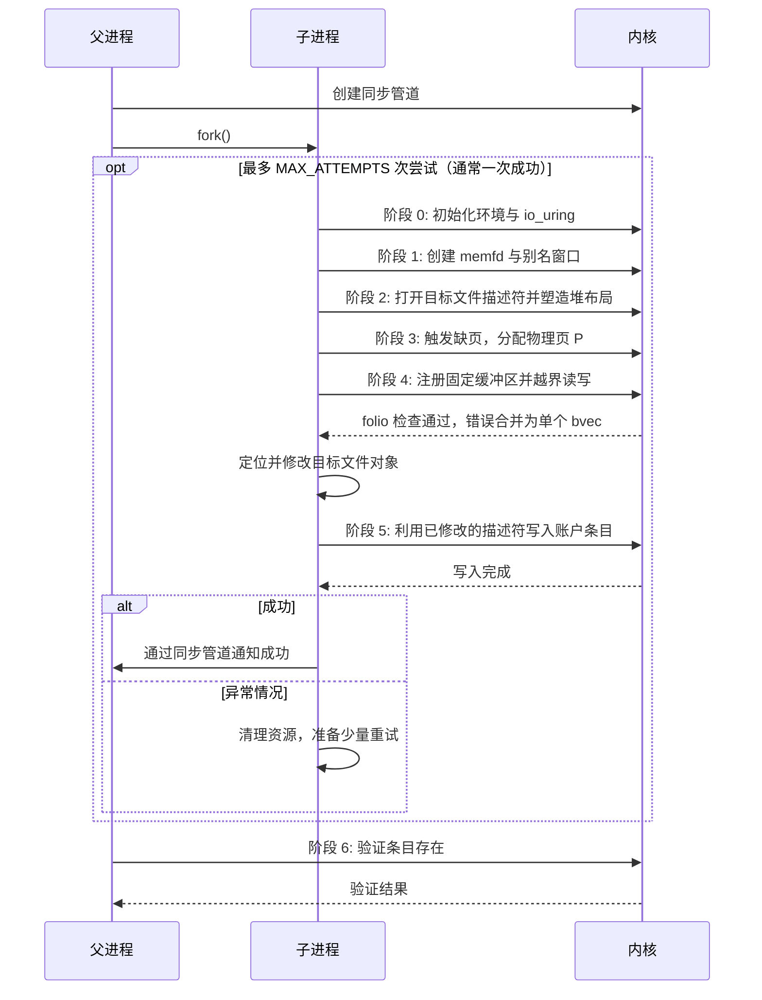
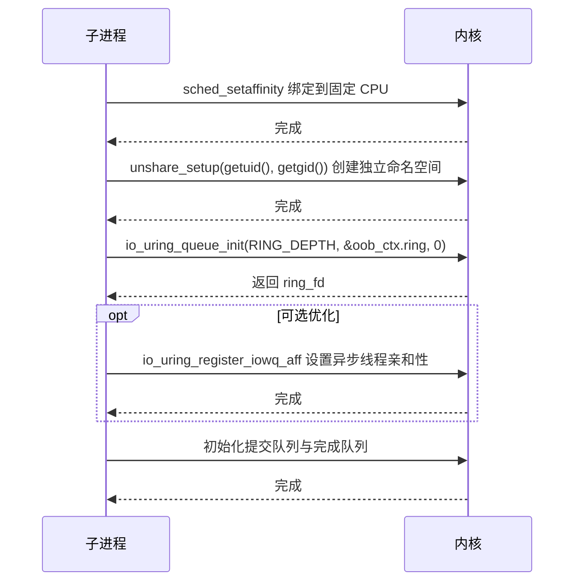
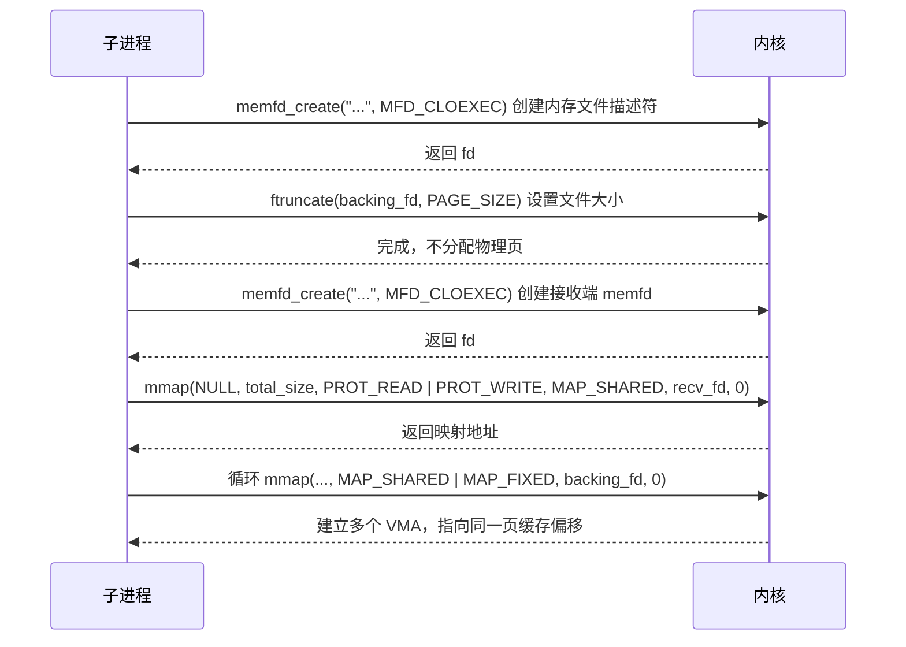
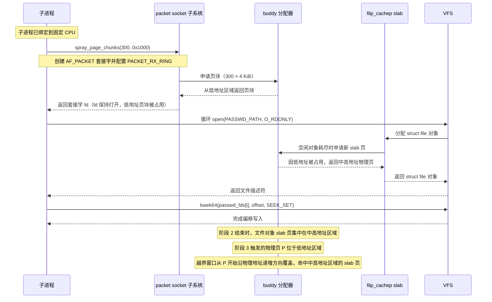
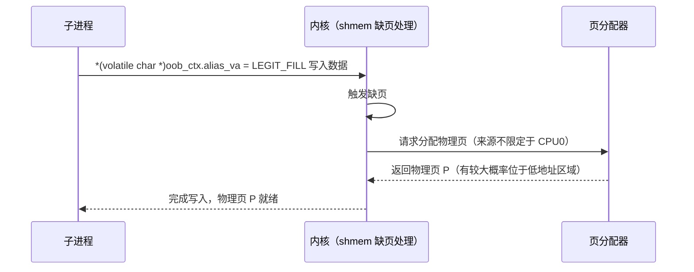
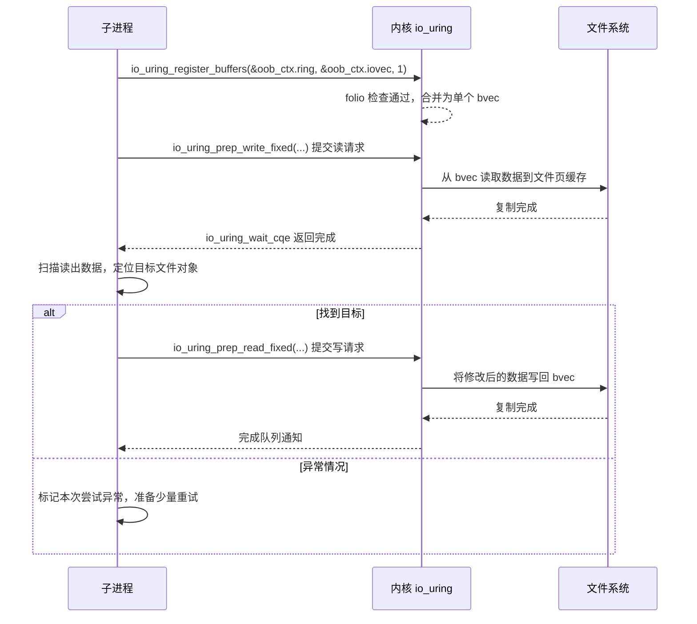
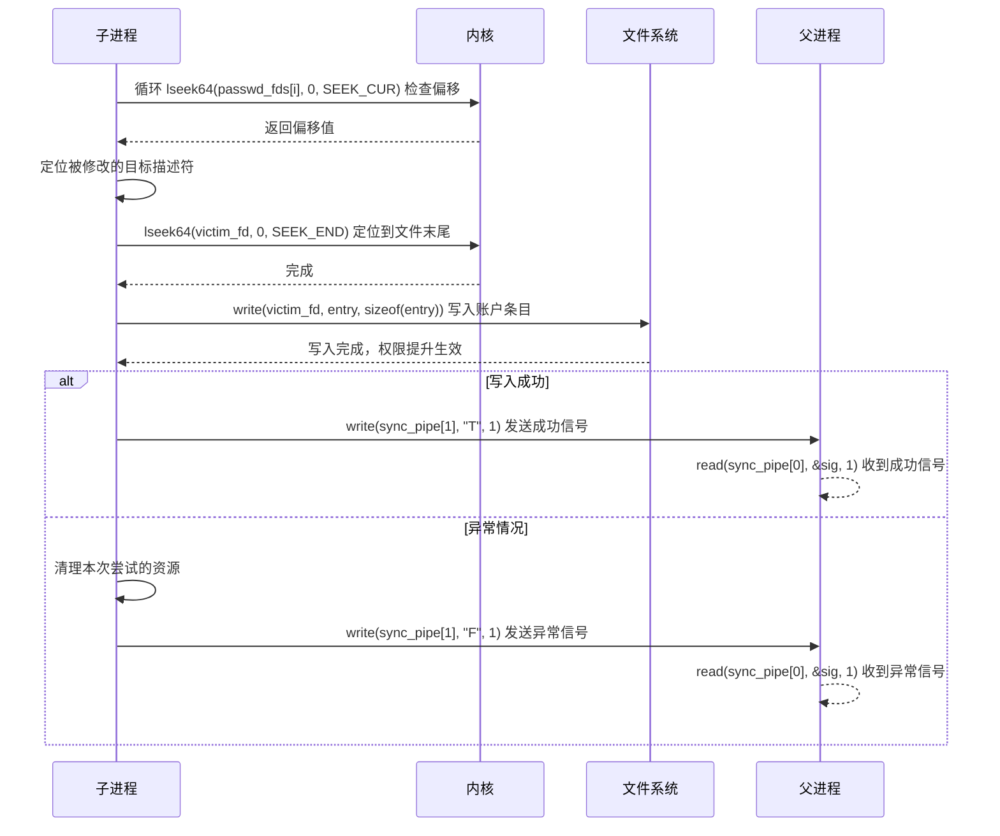
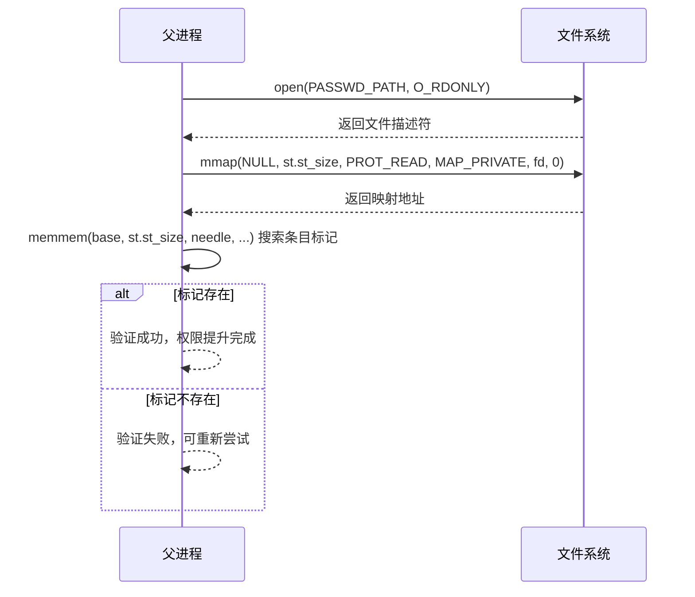

# 【Kernel Exploit】CVE-2023-2598 (Dirty Cred) 漏洞分析

## 1. 测试环境

**测试版本**：Linux-6.3.1 [内核镜像地址](https://github.com/BinRacer/pwn4cve/blob/master/kernels/6.3.1/01/bzImage)

笔者测试的内核版本是 `Linux alpine 6.3.1 #1 SMP PREEMPT_DYNAMIC Sat Feb 28 16:14:10 CST 2026 x86_64 Linux`。

**编译选项**：开启`CONFIG_IO_URING`、`CONFIG_TMPFS`、`CONFIG_SHMEM`、`CONFIG_SECURITY`、`CONFIG_BINFMT_MISC`、`CONFIG_THREAD_INFO_IN_TASK`、`CONFIG_INIT_ON_ALLOC_DEFAULT_ON`、`CONFIG_KCMP`、`CONFIG_MEMCG`、`CONFIG_MEMCG_KMEM`、`CONFIG_CGROUPS`、`CONFIG_SLAB_FREELIST_RANDOM`、`CONFIG_SLAB_FREELIST_HARDENED`、`CONFIG_SHUFFLE_PAGE_ALLOCATOR`、`CONFIG_HARDENED_USERCOPY`、`CONFIG_FUSE_FS`、`CONFIG_USERFAULTFD`、`CONFIG_SYSVIPC`、`CONFIG_KEYS`、`CONFIG_STACKPROTECTOR`、`CONFIG_STACKPROTECTOR_STRONG`、`CONFIG_SLUB`、`CONFIG_SLUB_DEBUG`、`CONFIG_E1000`、`CONFIG_E1000E`、`CONFIG_PACKET`、`CONFIG_PACKET_DIAG`、`CONFIG_USER_NS`、`CONFIG_NET_NS`、`CONFIG_NAMESPACES`、`CONFIG_CHECKPOINT_RESTORE`、`CONFIG_IPC_NS`选项。完整配置参考[.config](https://github.com/BinRacer/pwn4cve/blob/master/kernels/6.3.1/01/.config)。

**保护机制**：KASLR/SMEP/SMAP/KPTI

## 2. 漏洞背景

### 2-1. 漏洞概述

**CVE-2023-2598** 是 Linux 内核 `io_uring` 子系统固定缓冲区注册路径中的越界读写问题。该问题出现在 Linux 6.3 开发周期引入的巨页注册优化逻辑中，影响 6.3-rc1 至 6.3.1 等版本。其核心特征是：本地用户可以通过构造特殊的虚拟内存映射，使内核在注册固定缓冲区时错误地合并页面描述，进而获得从某一物理页开始、跨越多个物理页的线性读写能力。该能力可与 DirtyCred 风格的 `struct file` 篡改技术结合，完成本地权限提升。

`io_uring` 作为通用异步 I/O 接口，其固定缓冲区机制允许用户一次性注册缓冲区，后续 I/O 请求复用已 pin 住的页面，避免重复的地址翻译与页面钉住开销。为提升巨页场景下的注册效率，内核在固定缓冲区注册路径中引入了一项优化：当多个页面属于同一 `folio` 时，将它们合并为单个 `bio_vec` 条目，从而减少 `bio_vec` 数组长度与后续迭代开销。该优化的前提是同一 `folio` 的页面在物理上连续且互异，这一前提在正常巨页场景下成立，但在用户通过 `memfd` 与 `MAP_FIXED` 重复映射同一物理页时被打破。

具体而言，本地用户可以创建一个 `memfd`，在其中分配至少一个物理页，然后使用 `MAP_FIXED` 将该 `memfd` 的同一偏移重复映射到连续的虚拟地址区域。这样，多个虚拟页会解析到同一个物理页 P，`pin_user_pages()` 返回的页面数组中会出现大量指向同一 `struct page` 的重复条目。注册路径中的 `folio` 检查仅比较 `page_folio(pages[i])` 是否等于 `page_folio(pages[0])`，并未验证页面是否彼此不同，也未验证它们是否物理连续。由于所有重复条目指向同一物理页，该检查被满足，内核随即将多个页面合并为单个 `bio_vec`。合并后的 `bio_vec` 只记录一个物理页，但 `bv_len` 取自用户可控的 `iov_len`，覆盖范围远超实际拥有的单页。

在后续固定缓冲区 I/O 操作中，迭代器通过 `nth_page(bvec, i) = bv_page + i` 计算相邻页面，不再进行 PTE 查找，也不检查页面是否属于同一 `folio`。这样，本地用户就获得了一个从 PFN(P) 开始、按页线性的物理内存读写原语。该原语不依赖传统用户态地址越界，而是直接作用于物理页内容，能够绕过常规 PTE 检查与 `folio` 成员校验，具有较强的对象篡改价值。

获得该原语后，本地用户可以扫描物理内存，定位以只读方式打开的目标文件对应的 `struct file`，并修改其 `f_flags`、`f_mode`、`f_pos` 等字段，使原本只读的文件描述符在后续写入路径中被内核视为可写，并将文件偏移重置。随后可通过该描述符向 `/etc/passwd` 等文件追加新的高权限账户条目，完成本地权限提升。该利用方式属于 DirtyCred 风格：不直接修改进程凭据，而是篡改文件对象权限，借合法文件操作达成越权写入，因而具有较好的稳定性与隐蔽性。

该问题影响所有启用 `CONFIG_IO_URING` 且运行于受影响内核版本的 Linux 系统。主流发行版若采用相关内核版本，也可能受到影响。由于 `io_uring` 面向通用异步 I/O，容器、沙箱和普通本地用户环境都可能成为触发场景。成功利用可导致本地权限提升，使非特权用户获得 root 权限，因此该问题被评定为高危。

整体来看，该问题体现了内核优化路径中“语义假设”与“用户可控映射”之间的冲突：`folio` 归属相同并不能推出页面互异或物理连续，二者之间的语义差距正是问题能够成立的关键。后续小节将从漏洞根因、核心数据结构、关键函数调用链、触发条件与流程等角度逐步展开，分析该问题的形成机理与完整路径。

### 2-2. 漏洞根因

漏洞根因位于固定缓冲区注册路径的核心函数 `io_sqe_buffer_register()` 中。该函数负责将用户提供的 `iovec` 转换为内核中的 `io_mapped_ubuf`，其关键步骤包括调用 `pin_user_pages()` 钉住用户页面、检查页面关系、构造 `bio_vec` 数组。问题并非来自页面钉住本身，而是来自一项面向巨页场景的合并优化。该优化在判断多个页面是否可以合并时，使用了过强的语义假设，而这一假设在用户可控的重复映射场景下并不成立。

在正常巨页场景中，同一 `folio` 的多个页面确实在物理上连续且互异。因此，内核可以在注册时将这些页面合并为单个 `bio_vec`，从而减少 `bio_vec` 数组长度、降低后续 I/O 迭代开销。相关合并逻辑如下：

```c
/* 若页面数大于 1，尝试按巨页合并为单个 bvec 条目 */
if (nr_pages > 1) {
    folio = page_folio(pages[0]);
    for (i = 1; i < nr_pages; i++) {
        if (page_folio(pages[i]) != folio) {
            folio = NULL;
            break;
        }
    }
    if (folio) {
        /*
         * 页面绑定到 folio，此处并不真正 unpin，
         * 而是释放除第一个页面外的所有引用，
         * 最终由 io_buffer_unmap 释放。
         */
        unpin_user_pages(&pages[1], nr_pages - 1);
        nr_pages = 1;
    }
}
```

该检查只比较了 `page_folio(pages[i])` 是否等于 `page_folio(pages[0])`，没有验证 `pages[i]` 是否彼此不同，也没有验证 `pages[i]` 是否等于 `pages[i - 1] + 1`。对于真正的巨页，这两个条件自然成立；但对于用户通过 `memfd` 与 `MAP_FIXED` 构造的重复映射，这两个条件都被打破。用户可以在 `memfd` 中分配一个物理页，然后使用 `MAP_FIXED` 将该 `memfd` 的同一偏移重复映射到连续的虚拟地址区域。`shmem` 在缺页处理时，会将这些 VMA 的 PTE 都解析到页缓存偏移 0 对应的同一物理页 P。因此，`pin_user_pages()` 返回的 `pages[]` 数组中会出现大量指向同一 `struct page` 的重复条目。

此时，`page_folio(pages[i])` 与 `page_folio(pages[0])` 完全相同，合并检查被满足。内核随即将多个页面合并为单个 `bio_vec`：

```c
if (folio) {
    /* 合并路径：单个 bvec 记录一个页面，但 bv_len 为整个 size */
    bvec_set_page(&imu->bvec[0], pages[0], size, off);
    goto done;
}
```

该 `bio_vec` 的 `bv_page` 仅指向物理页 P，而 `bv_len` 取自用户提供的 `iov_len`，`bv_offset` 取自 `iov_base` 的页内偏移。由于 `iov_len` 完全由用户控制，合并后的 `bio_vec` 可以覆盖远超实际拥有的单页范围。内核认为它记录的是一个巨页，实际上它只拥有一个物理页，却对外声明了跨越多个物理页的长度。

该缺陷之所以能够成立，根本原因在于优化路径对页面关系作出了过强假设。`folio` 归属相同只能说明这些页面描述符指向同一个复合页首页，并不能推出它们在页面数组中互异，也不能推出它们在物理上连续。正常巨页的物理连续性由复合页分配过程保证，而用户通过重复映射构造的页面数组并不具备这一性质。注册路径信任了用户提交的虚拟映射，却没有对页面数组进行重复性与连续性检查，使合并逻辑在异常映射下错误生效。

合并后的 `bio_vec` 会保存在 `io_mapped_ubuf` 中，并在后续固定缓冲区 I/O 中被 `io_import_fixed()` 转换为 `iov_iter`。迭代器直接引用 `imu->bvec`，不再进行 PTE 查找。执行阶段通过 `nth_page(bvec, i) = bv_page + i` 计算相邻页面，直接解引用 `vmemmap` 中相邻的 `struct page`。这样，读写操作就会从物理页 P 开始，线性覆盖其后 `bv_len / PAGE_SIZE` 个物理页。该原语不依赖传统用户态地址越界，而是直接作用于物理页内容，能够绕过常规 PTE 检查与 `folio` 成员校验。

从数据流角度看，问题链条可以概括为：用户构造重复映射，使 `pin_user_pages()` 返回重复页面条目；注册路径的 `folio` 检查被满足，错误合并为单个 `bio_vec`；`bv_len` 携带用户可控的过大长度；固定缓冲区 I/O 将该 `bio_vec` 转换为 `iov_iter`；执行阶段按物理页线性推进，形成越界读写。每一环都建立在上一环的错误状态之上，最终将注册阶段的语义缺陷转化为实际的内存访问能力。

整体来看，**CVE-2023-2598** 的根因并非单一函数中的越界写或越界读，而是注册优化中“页面关系判断”与“页面实际布局”之间的语义落差。`folio` 相同不能推出页面互异，也不能推出物理连续，而这两个条件恰恰是合并为单个 `bio_vec` 的前提。该语义落差在正常巨页场景下被物理连续性掩盖，在重复映射场景下则完全暴露。理解这一点，是理解后续核心数据结构与关键函数调用链的基础。

### 2-3. 核心数据结构

**CVE-2023-2598** 的数据流贯穿 `io_uring` 高层对象、资源注册路径、缓冲区迭代器、物理页管理与 VFS 文件对象。理解这条数据流，需要从 `io_uring` 实例如何保存固定缓冲区开始，逐步下沉到 `bio_vec`、`page`、`folio`，最后到达 `file` 这一越界写入目标。每一层都承担明确角色：高层对象负责组织请求与资源，中间层负责把用户缓冲区转换为物理页迭代，底层结构则决定越界读写原语的实际作用范围与目标选择。以下按从高层到低层的顺序展开，便于对照漏洞路径逐层理解。

#### 2-3-1. 实例与请求

`io_uring` 实例由上下文与请求对象共同构成。上下文保存全局资源与队列状态，请求对象描述单次操作。固定缓冲区注册与固定缓冲区 I/O 都从这两个结构出发，异常合并后的 `bio_vec` 也通过它们进入实际 I/O 路径。理解这两个结构，是理解后续资源管理、迭代导入与执行路径的前提。

##### 2-3-1-1. io_ring_ctx

`io_ring_ctx` 是 `io_uring` 实例的全局上下文。固定缓冲区注册结果通过 `user_bufs`、`nr_user_bufs`、`buf_data`、`rsrc_node` 等字段与上下文关联。`buf_data` 保存缓冲区资源数据，`user_bufs` 指向 `io_mapped_ubuf` 数组，后续固定缓冲区 I/O 会从该数组取出 `imu` 并转换为 `iov_iter`。

```c
struct io_ring_ctx {
    struct {
        unsigned int flags;                         /* 上下文全局标志 */
        unsigned int drain_next : 1;                /* 下一请求是否执行 drain */
        unsigned int restricted : 1;                /* 是否处于受限模式 */
        unsigned int off_timeout_used : 1;          /* 是否使用过 off timeout */
        unsigned int drain_active : 1;              /* drain 是否激活 */
        unsigned int has_evfd : 1;                  /* 是否绑定 eventfd */
        unsigned int task_complete : 1;             /* 任务完成标志 */
        unsigned int syscall_iopoll : 1;            /* 是否使用系统调用 iopoll */
        unsigned int poll_activated : 1;            /* poll 是否已激活 */
        unsigned int drain_disabled : 1;            /* drain 是否被禁用 */
        unsigned int compat : 1;                    /* 是否兼容模式 */
        enum task_work_notify_mode notify_method;   /* task_work 通知方式 */
        struct io_rings *rings;                     /* 用户态共享环指针 */
        struct task_struct *submitter_task;         /* 提交者任务 */
        struct percpu_ref refs;                     /* 上下文引用计数 */
    };
    struct {
        struct mutex uring_lock;                    /* io_uring 主锁 */
        u32 *sq_array;                              /* 提交队列索引数组 */
        struct io_uring_sqe *sq_sqes;               /* 提交队列 SQE 数组 */
        unsigned int cached_sq_head;                /* 缓存的提交队列头 */
        unsigned int sq_entries;                    /* 提交队列条目数 */
        struct io_rsrc_node *rsrc_node;             /* 当前资源节点 */
        int rsrc_cached_refs;                       /* 缓存资源引用数 */
        atomic_t cancel_seq;                        /* 取消序列号 */
        struct io_file_table file_table;            /* 注册文件表 */
        unsigned int nr_user_files;                 /* 用户注册文件数量 */
        unsigned int nr_user_bufs;                  /* 用户注册缓冲区数量 */
        struct io_mapped_ubuf **user_bufs;          /* 用户固定缓冲区数组 */
        struct io_submit_state submit_state;        /* 提交状态 */
        struct io_buffer_list *io_bl;               /* 缓冲列表 */
        struct xarray io_bl_xa;                     /* 缓冲列表 xarray */
        struct list_head io_buffers_cache;          /* 缓冲缓存链表 */
        struct io_hash_table cancel_table_locked;   /* 加锁取消哈希表 */
        struct list_head cq_overflow_list;          /* 完成队列溢出链表 */
        struct io_alloc_cache apoll_cache;          /* 异步 poll 分配缓存 */
        struct io_alloc_cache netmsg_cache;         /* 网络消息分配缓存 */
    };
    struct io_wq_work_list locked_free_list;        /* 加锁空闲工作链表 */
    unsigned int locked_free_nr;                    /* 加锁空闲工作数量 */
    const struct cred *sq_creds;                    /* 提交队列凭据 */
    struct io_sq_data *sq_data;                     /* 提交队列数据 */
    struct wait_queue_head sqo_sq_wait;             /* 提交队列等待队列 */
    struct list_head sqd_list;                      /* 提交队列数据链表 */
    unsigned long check_cq;                         /* 完成队列检查标志 */
    unsigned int file_alloc_start;                  /* 文件分配起始索引 */
    unsigned int file_alloc_end;                    /* 文件分配结束索引 */
    struct xarray personalities;                    /* personality xarray */
    u32 pers_next;                                  /* 下一个 personality 索引 */
    struct {
        struct io_uring_cqe *cqe_cached;            /* 缓存的完成队列条目 */
        struct io_uring_cqe *cqe_sentinel;          /* 完成队列哨兵 */
        unsigned int cached_cq_tail;                /* 缓存的完成队列尾 */
        unsigned int cq_entries;                    /* 完成队列条目数 */
        struct io_ev_fd *io_ev_fd;                  /* 事件 fd 上下文 */
        struct wait_queue_head cq_wait;             /* 完成队列等待队列 */
        unsigned int cq_extra;                      /* 完成队列额外计数 */
    };
    struct {
        spinlock_t completion_lock;                 /* 完成路径锁 */
        bool poll_multi_queue;                      /* 是否多队列 poll */
        bool cq_waiting;                            /* 是否有等待完成队列者 */
        struct io_wq_work_list iopoll_list;         /* iopoll 工作链表 */
        struct io_hash_table cancel_table;          /* 取消哈希表 */
        struct llist_head work_llist;               /* 工作无锁链表 */
        struct list_head io_buffers_comp;           /* 缓冲完成链表 */
    };
    struct {
        spinlock_t timeout_lock;                    /* 超时锁 */
        atomic_t cq_timeouts;                       /* 完成队列超时计数 */
        struct list_head timeout_list;              /* 超时链表 */
        struct list_head ltimeout_list;             /* 长超时链表 */
        unsigned int cq_last_tm_flush;              /* 上次超时刷新 */
    };
    struct wait_queue_head poll_wq;                 /* poll 等待队列 */
    struct io_restriction restrictions;             /* 操作限制 */
    struct io_rsrc_node *rsrc_backup_node;          /* 备份资源节点 */
    struct io_mapped_ubuf *dummy_ubuf;              /* 哑固定缓冲区 */
    struct io_rsrc_data *file_data;                 /* 文件资源数据 */
    struct io_rsrc_data *buf_data;                  /* 缓冲资源数据 */
    struct delayed_work rsrc_put_work;              /* 资源释放延迟工作 */
    struct callback_head rsrc_put_tw;               /* 资源释放 task_work */
    struct llist_head rsrc_put_llist;               /* 资源释放无锁链表 */
    struct list_head rsrc_ref_list;                 /* 资源引用链表 */
    spinlock_t rsrc_ref_lock;                       /* 资源引用锁 */
    struct list_head io_buffers_pages;              /* 缓冲页链表 */
    struct socket *ring_sock;                       /* 环 socket */
    struct io_wq_hash *hash_map;                    /* 工作队列哈希映射 */
    struct user_struct *user;                       /* 关联用户 */
    struct mm_struct *mm_account;                   /* 记账 mm */
    struct llist_head fallback_llist;               /* 回退无锁链表 */
    struct delayed_work fallback_work;              /* 回退延迟工作 */
    struct work_struct exit_work;                   /* 退出工作 */
    struct list_head tctx_list;                     /* 任务上下文链表 */
    struct completion ref_comp;                     /* 引用完成量 */
    u32 iowq_limits[2];                             /* 工作队列限制 */
    bool iowq_limits_set;                           /* 工作队列限制是否设置 */
    struct callback_head poll_wq_task_work;         /* poll 等待 task_work */
    struct list_head defer_list;                    /* 延迟链表 */
    unsigned int sq_thread_idle;                    /* 提交线程空闲时间 */
    unsigned int evfd_last_cq_tail;                 /* eventfd 上次完成尾 */
};
```

##### 2-3-1-2. io_kiocb

`io_kiocb` 表示一次 I/O 请求。固定缓冲区 I/O 路径中，`imu` 指向 `io_mapped_ubuf`，`buf_index` 指定使用哪一个已注册缓冲区。异常合并后的 `bio_vec` 正是通过 `imu` 进入 I/O 迭代，并最终转化为对相邻物理页的线性访问。

```c
struct io_kiocb {
    union {
        struct file *file;                          /* 关联文件对象 */
        struct io_cmd_data {
            struct file *file;                      /* 命令关联文件 */
            __u8 data[56];                          /* 命令私有数据 */
        } cmd;                                      /* 命令数据 */
    };
    u8 opcode;                                      /* 操作码 */
    u8 iopoll_completed;                            /* iopoll 是否完成 */
    u16 buf_index;                                  /* 缓冲区索引 */
    unsigned int flags;                             /* 请求标志 */
    struct io_cqe {
        __u64 user_data;                            /* 用户数据 */
        __s32 res;                                  /* 结果码 */
        union {
            __u32 flags;                            /* 完成标志 */
            int fd;                                 /* 完成 fd */
        };
    } cqe;                                          /* 完成信息 */
    struct io_ring_ctx *ctx;                        /* 所属 io_uring 上下文 */
    struct task_struct *task;                       /* 提交任务 */
    struct io_rsrc_node *rsrc_node;                 /* 资源节点 */
    union {
        struct io_mapped_ubuf *imu;                 /* 固定缓冲区 */
        struct io_buffer *kbuf;                     /* 内核缓冲 */
        struct io_buffer_list *buf_list;            /* 缓冲列表 */
    };
    union {
        struct io_wq_work_node {
            struct io_wq_work_node *next;           /* 下一工作节点 */
        } comp_list;                                /* 完成链表 */
        __poll_t apoll_events;                      /* 异步 poll 事件 */
    };
    atomic_t refs;                                  /* 请求引用计数 */
    atomic_t poll_refs;                             /* poll 引用计数 */
    struct io_task_work {
        struct llist_node {
            struct llist_node *next;                /* 下一节点 */
        } node;                                     /* 无锁节点 */
        io_req_tw_func_t func;                      /* task_work 回调 */
    } io_task_work;                                 /* 任务工作 */
    union {
        struct hlist_node {
            struct hlist_node *next;                /* 下一哈希节点 */
            struct hlist_node **pprev;              /* 前驱指针 */
        } hash_node;                                /* 哈希节点 */
        struct {
            u64 extra1;                             /* 扩展字段 1 */
            u64 extra2;                             /* 扩展字段 2 */
        };
    };
    struct async_poll *apoll;                       /* 异步 poll */
    void *async_data;                               /* 异步数据 */
    struct io_kiocb *link;                          /* 链接请求 */
    const struct cred *creds;                       /* 凭据 */
    struct io_wq_work {
        struct io_wq_work_node {
            struct io_wq_work_node *next;           /* 下一工作节点 */
        } list;                                     /* 工作链表 */
        unsigned int flags;                         /* 工作标志 */
        int cancel_seq;                             /* 取消序列号 */
    } work;                                         /* 工作项 */
};
```

上下文与请求对象为后续资源管理提供了容器。当用户注册固定缓冲区时，相关数据会挂载到 `io_ring_ctx` 上，并在请求提交时通过 `io_kiocb` 引用。接下来进入提交与完成环，了解用户态与内核之间如何传递这些请求与结果。

#### 2-3-2. 提交完成环

用户态与内核之间的请求传递依赖提交队列条目与完成队列条目。固定缓冲区注册时，用户通过系统调用参数指定缓冲区数组；固定缓冲区 I/O 时，`addr`、`len`、`buf_index` 等字段描述操作范围。异常合并后，`len` 所对应的 `bv_len` 会覆盖远超单页的物理范围，而提交与完成环本身仍按正常路径工作。

##### 2-3-2-1. io_uring_sqe

`io_uring_sqe` 是用户态提交队列条目，描述操作码、标志、目标 fd、地址、长度、用户数据、缓冲区索引、personality、文件索引以及命令扩展字段。固定缓冲区注册与固定缓冲区 I/O 通过这些字段传递 `addr`、`len`、`buf_index` 等信息。

```c
struct io_uring_sqe {
    __u8 opcode;                                    /* 操作码 */
    __u8 flags;                                     /* 通用标志 */
    __u16 ioprio;                                   /* I/O 优先级 */
    __s32 fd;                                       /* 目标文件描述符 */
    union {
        __u64 off;                                  /* 文件偏移 */
        __u64 addr2;                                /* 第二地址 */
        struct {
            __u32 cmd_op;                           /* 命令操作码 */
            __u32 __pad1;                           /* 填充 */
        };
    };
    union {
        __u64 addr;                                 /* 用户缓冲区地址 */
        __u64 splice_off_in;                        /* splice 输入偏移 */
    };
    __u32 len;                                      /* 数据长度 */
    union {
        __kernel_rwf_t rw_flags;                    /* 读写标志 */
        __u32 fsync_flags;                          /* fsync 标志 */
        __u16 poll_events;                          /* poll 事件 */
        __u32 poll32_events;                        /* 32 位 poll 事件 */
        __u32 sync_range_flags;                     /* sync range 标志 */
        __u32 msg_flags;                            /* 消息标志 */
        __u32 timeout_flags;                        /* 超时标志 */
        __u32 accept_flags;                         /* accept 标志 */
        __u32 cancel_flags;                         /* cancel 标志 */
        __u32 open_flags;                           /* open 标志 */
        __u32 statx_flags;                          /* statx 标志 */
        __u32 fadvise_advice;                       /* fadvise 建议 */
        __u32 splice_flags;                         /* splice 标志 */
        __u32 rename_flags;                         /* rename 标志 */
        __u32 unlink_flags;                         /* unlink 标志 */
        __u32 hardlink_flags;                       /* hardlink 标志 */
        __u32 xattr_flags;                          /* xattr 标志 */
        __u32 msg_ring_flags;                       /* msg ring 标志 */
        __u32 uring_cmd_flags;                      /* uring cmd 标志 */
    };
    __u64 user_data;                                /* 用户数据 */
    union {
        __u16 buf_index;                            /* 缓冲区索引 */
        __u16 buf_group;                            /* 缓冲组 */
    };
    __u16 personality;                              /* personality 索引 */
    union {
        __s32 splice_fd_in;                         /* splice 输入 fd */
        __u32 file_index;                           /* 注册文件索引 */
        struct {
            __u16 addr_len;                         /* 地址长度 */
            __u16 __pad3[1];                        /* 填充 */
        };
    };
    union {
        struct {
            __u64 addr3;                            /* 第三地址 */
            __u64 __pad2[1];                        /* 填充 */
        };
        __u8 cmd[0];                                /* 命令扩展起始 */
    };
};
```

##### 2-3-2-2. io_uring_cqe

`io_uring_cqe` 负责把结果返回用户态。越界读路径把相邻物理内存内容写入文件，越界写路径则把文件内容写入相邻物理页，完成结果仍通过该结构正常上报。

```c
struct io_uring_cqe {
    __u64 user_data;                                /* 用户数据 */
    __s32 res;                                      /* 结果码 */
    __u32 flags;                                    /* 完成标志 */
    __u64 big_cqe[];                                /* 大完成条目扩展 */
};
```

##### 2-3-2-3. io_uring

```c
struct io_uring {
    u32 head;                                       /* 环头 */
    u32 tail;                                       /* 环尾 */
};
```

##### 2-3-2-4. io_rings

```c
struct io_rings {
    struct io_uring sq;                             /* 提交队列环 */
    struct io_uring cq;                             /* 完成队列环 */
    u32 sq_ring_mask;                               /* 提交队列掩码 */
    u32 cq_ring_mask;                               /* 完成队列掩码 */
    u32 sq_ring_entries;                            /* 提交队列条目数 */
    u32 cq_ring_entries;                            /* 完成队列条目数 */
    u32 sq_dropped;                                 /* 提交丢弃计数 */
    atomic_t sq_flags;                              /* 提交队列标志 */
    u32 cq_flags;                                   /* 完成队列标志 */
    u32 cq_overflow;                                /* 完成队列溢出计数 */
    struct io_uring_cqe cqes[];                     /* 完成队列条目数组 */
};
```

##### 2-3-2-5. io_uring_params

```c
struct io_uring_params {
    __u32 sq_entries;                               /* 提交队列条目数 */
    __u32 cq_entries;                               /* 完成队列条目数 */
    __u32 flags;                                    /* 创建标志 */
    __u32 sq_thread_cpu;                            /* 提交线程 CPU */
    __u32 sq_thread_idle;                           /* 提交线程空闲时间 */
    __u32 features;                                 /* 支持特性 */
    __u32 wq_fd;                                    /* 工作队列 fd */
    __u32 resv[3];                                  /* 保留 */
    struct io_sqring_offsets {
        __u32 head;                                 /* 提交队列头偏移 */
        __u32 tail;                                 /* 提交队列尾偏移 */
        __u32 ring_mask;                            /* 提交队列掩码偏移 */
        __u32 ring_entries;                         /* 提交队列条目偏移 */
        __u32 flags;                                /* 提交队列标志偏移 */
        __u32 dropped;                              /* 提交丢弃偏移 */
        __u32 array;                                /* 提交数组偏移 */
        __u32 resv1;                                /* 保留 */
        __u64 resv2;                                /* 保留 */
    } sq_off;                                       /* 提交队列偏移 */
    struct io_cqring_offsets {
        __u32 head;                                 /* 完成队列头偏移 */
        __u32 tail;                                 /* 完成队列尾偏移 */
        __u32 ring_mask;                            /* 完成队列掩码偏移 */
        __u32 ring_entries;                         /* 完成队列条目偏移 */
        __u32 overflow;                             /* 完成溢出偏移 */
        __u32 cqes;                                 /* 完成条目偏移 */
        __u32 flags;                                /* 完成队列标志偏移 */
        __u32 resv1;                                /* 保留 */
        __u64 resv2;                                /* 保留 */
    } cq_off;                                       /* 完成队列偏移 */
};
```

提交与完成环负责请求的传递与结果上报。当请求进入内核后，可能通过任务级状态与工作队列进行异步调度。下一节的任务与调度结构，负责组织这些异步工作项。

#### 2-3-3. 任务与调度

`io_uring` 的异步执行依赖任务级状态与工作队列。`io_uring_task` 保存任务最近使用的上下文、注册环、inflight 计数与任务工作回调。固定缓冲区 I/O 可能通过异步工作执行，因此该结构参与请求调度。`io_wq`、`io_wq_work_list` 与 `io_submit_link` 则负责工作项的排队与提交链组织。

##### 2-3-3-1. io_uring_task

```c
struct io_uring_task {
    int cached_refs;                                /* 缓存引用数 */
    const struct io_ring_ctx *last;                 /* 最近使用的上下文 */
    struct io_wq *io_wq;                            /* 关联工作队列 */
    struct file *registered_rings[16];              /* 注册环文件数组 */
    struct xarray {
        spinlock_t xa_lock;                         /* xarray 锁 */
        gfp_t xa_flags;                             /* xarray 分配标志 */
        void *xa_head;                              /* xarray 头 */
    } xa;                                           /* 注册环 xarray */
    struct wait_queue_head {
        spinlock_t lock;                            /* 等待队列锁 */
        struct list_head {
            struct list_head *next;                 /* 下一节点 */
            struct list_head *prev;                 /* 上一节点 */
        } head;                                     /* 等待队列头 */
    } wait;                                         /* 等待队列 */
    atomic_t in_cancel;                             /* 取消中计数 */
    atomic_t inflight_tracked;                      /* 跟踪的 inflight 数 */
    struct percpu_counter {
        raw_spinlock_t lock;                        /* 计数器锁 */
        s64 count;                                  /* 计数 */
        struct list_head {
            struct list_head *next;                 /* 下一节点 */
            struct list_head *prev;                 /* 上一节点 */
        } list;                                     /* 计数器链表 */
        s32 *counters;                              /* 每 CPU 计数 */
    } inflight;                                     /* inflight 计数 */
    struct {
        struct llist_head {
            struct llist_node *first;               /* 首节点 */
        } task_list;                                /* 任务链表 */
        struct callback_head {
            struct callback_head *next;             /* 下一回调 */
            void (*func)(struct callback_head *);   /* 回调函数 */
        } task_work;                                /* 任务工作 */
    };
};
```

##### 2-3-3-2. io_wq

```c
struct io_wq {
    unsigned long state;                            /* 工作队列状态 */
    free_work_fn *free_work;                        /* 释放工作回调 */
    io_wq_work_fn *do_work;                         /* 执行工作回调 */
    struct io_wq_hash *hash;                        /* 工作队列哈希 */
    atomic_t worker_refs;                           /* 工作线程引用 */
    struct completion worker_done;                  /* 工作线程完成量 */
    struct hlist_node cpuhp_node;                   /* CPU 热插拔节点 */
    struct task_struct *task;                       /* 关联任务 */
    struct io_wqe *wqes[];                          /* 工作执行器数组 */
};
```

##### 2-3-3-3. io_wq_work_list

```c
struct io_wq_work_list {
    struct io_wq_work_node *first;                  /* 首节点 */
    struct io_wq_work_node *last;                   /* 尾节点 */
};
```

##### 2-3-3-4. io_submit_link

```c
struct io_submit_link {
    struct io_kiocb *head;                          /* 链头请求 */
    struct io_kiocb *last;                          /* 链尾请求 */
};
```

任务与调度结构为请求的异步执行提供了组织方式。当请求涉及固定缓冲区时，其核心资源由资源管理结构承载。接下来进入资源管理，了解 `io_mapped_ubuf` 如何保存固定缓冲区，以及资源节点如何管理其生命周期。

#### 2-3-4. 资源管理

固定缓冲区的核心表示是 `io_mapped_ubuf`。它记录用户缓冲区起止、`bio_vec` 数量、计费页数，并柔性保存 `bio_vec` 数组。正常注册时，`nr_bvecs` 与页面或巨页数量匹配；异常合并时，`nr_bvecs` 退化为 1，而 `bvec[0].bv_len` 覆盖远超单页的物理范围。资源节点、资源数据与待释放资源负责该缓冲区的生命周期管理。

##### 2-3-4-1. io_mapped_ubuf

```c
struct io_mapped_ubuf {
    u64 ubuf;                                       /* 用户缓冲区起始 */
    u64 ubuf_end;                                   /* 用户缓冲区结束 */
    unsigned int nr_bvecs;                          /* bio_vec 数量 */
    unsigned long acct_pages;                       /* 记账页数 */
    struct bio_vec bvec[];                          /* bio_vec 柔性数组 */
};
```

##### 2-3-4-2. io_rsrc_node

```c
struct io_rsrc_node {
    struct percpu_ref {
        unsigned long percpu_count_ptr;             /* percpu 计数指针 */
        struct percpu_ref_data *data;               /* 引用数据 */
    } refs;                                         /* 资源引用 */
    struct list_head {
        struct list_head *next;                     /* 下一节点 */
        struct list_head *prev;                     /* 上一节点 */
    } node;                                         /* 节点链表 */
    struct list_head {
        struct list_head *next;                     /* 下一节点 */
        struct list_head *prev;                     /* 上一节点 */
    } rsrc_list;                                    /* 资源链表 */
    struct io_rsrc_data *rsrc_data;                 /* 资源数据 */
    struct llist_node {
        struct llist_node *next;                    /* 下一无锁节点 */
    } llist;                                        /* 无锁链表节点 */
    bool done;                                      /* 是否完成 */
};
```

##### 2-3-4-3. io_rsrc_data

```c
struct io_rsrc_data {
    struct io_ring_ctx *ctx;                        /* 所属上下文 */
    u64 **tags;                                     /* 标签数组 */
    unsigned int nr;                                /* 资源数量 */
    rsrc_put_fn *do_put;                            /* 释放回调 */
    atomic_t refs;                                  /* 引用计数 */
    struct completion {
        unsigned int done;                          /* 完成计数 */
        struct swait_queue_head {
            raw_spinlock_t lock;                    /* 等待锁 */
            struct list_head {
                struct list_head *next;             /* 下一节点 */
                struct list_head *prev;             /* 上一节点 */
            } task_list;                            /* 等待任务链表 */
        } wait;                                     /* 简单等待队列 */
    } done;                                         /* 完成量 */
    bool quiesce;                                   /* 是否静默 */
};
```

##### 2-3-4-4. io_rsrc_put

```c
struct io_rsrc_put {
    struct list_head {
        struct list_head *next;                     /* 下一节点 */
        struct list_head *prev;                     /* 上一节点 */
    } list;                                         /* 释放链表 */
    u64 tag;                                        /* 资源标签 */
    union {
        void *rsrc;                                 /* 通用资源指针 */
        struct file *file;                          /* 文件资源 */
        struct io_mapped_ubuf *buf;                 /* 固定缓冲区资源 */
    };
};
```

##### 2-3-4-5. io_uring_rsrc_register

```c
struct io_uring_rsrc_register {
    __u32 nr;                                       /* 资源数量 */
    __u32 flags;                                    /* 注册标志 */
    __u64 resv2;                                    /* 保留 */
    __u64 data;                                     /* 资源数据地址 */
    __u64 tags;                                     /* 标签地址 */
};
```

资源管理结构保存了固定缓冲区的内核表示。其中 `io_mapped_ubuf` 内的 `bio_vec` 数组，是连接用户缓冲区与物理页的关键。下一节将展开 `bio_vec`、`iovec`、`iov_iter` 与 `bvec_iter`，说明它们如何把用户提供的长度与地址转换为物理页层面的迭代。

#### 2-3-5. 向量与迭代

`bio_vec` 是连接固定缓冲区与实际物理页的关键。它只包含起始物理页、长度和页内偏移。异常合并后，单个 `bio_vec` 只记录一个物理页，却携带过大的 `bv_len`，后续迭代会以此为基础线性推进。用户态缓冲区由 `iovec` 描述，`iov_base` 与 `iov_len` 直接决定注册范围。内核在 I/O 过程中使用 `iov_iter` 表示迭代状态，并用 `bvec_iter` 在 `bio_vec` 数组内推进。

##### 2-3-5-1. bio_vec

```c
struct bio_vec {
    struct page *bv_page;                           /* 起始物理页 */
    unsigned int bv_len;                            /* 数据长度 */
    unsigned int bv_offset;                         /* 页内偏移 */
};
```

##### 2-3-5-2. iovec

```c
struct iovec {
    void *iov_base;                                 /* 用户缓冲区起始地址 */
    __kernel_size_t iov_len;                        /* 用户缓冲区长度 */
};
```

##### 2-3-5-3. iov_iter

```c
struct iov_iter {
    u8 iter_type;                                   /* 迭代器类型 */
    bool nofault;                                   /* 是否禁止缺页 */
    bool data_source;                               /* 是否为数据源 */
    bool user_backed;                               /* 是否用户态支撑 */
    union {
        size_t iov_offset;                          /* iovec 偏移 */
        int last_offset;                            /* 最后偏移 */
    };
    size_t count;                                   /* 剩余字节数 */
    union {
        const struct iovec *iov;                    /* iovec 数组 */
        const struct kvec *kvec;                    /* kvec 数组 */
        const struct bio_vec *bvec;                 /* bio_vec 数组 */
        struct xarray *xarray;                      /* xarray */
        struct pipe_inode_info *pipe;               /* pipe */
        void *ubuf;                                 /* 用户缓冲 */
    };
    union {
        unsigned long nr_segs;                      /* 段数 */
        struct {
            unsigned int head;                      /* 当前头 */
            unsigned int start_head;                /* 起始头 */
        };
        loff_t xarray_start;                        /* xarray 起始 */
    };
};
```

##### 2-3-5-4. bvec_iter

```c
struct bvec_iter {
    sector_t bi_sector;                             /* 起始扇区 */
    unsigned int bi_size;                           /* 剩余大小 */
    unsigned int bi_idx;                            /* 当前 bvec 索引 */
    unsigned int bi_bvec_done;                      /* 当前 bvec 已完成字节 */
};
```

向量与迭代结构把用户缓冲区转换为可逐段访问的物理页序列。迭代器最终会解引用 `struct page`，因此下一节进入页与地址空间，理解 `page`、`folio`、`vm_area_struct` 与 `mm_struct` 在漏洞路径中的位置。

#### 2-3-6. 页与地址空间

越界读写最终落到物理页描述符 `page`。内核通过 `vmemmap` 数组管理所有 `struct page`，`nth_page(bvec, i) = bv_page + i` 这样的线性计算会直接解引用相邻页面描述符，不再进行 PTE 查找，也不检查页面是否属于同一 `folio`。`folio` 表示复合页首页，`page_folio()` 是注册路径判断页面关系的依据。`vm_area_struct` 与 `mm_struct` 则负责虚拟映射。

##### 2-3-6-1. page

```c
struct page {
    unsigned long flags;                            /* 页面标志 */
    union {
        struct {
            union {
                struct list_head {
                    struct list_head *next;         /* 下一节点 */
                    struct list_head *prev;         /* 上一节点 */
                } lru;                              /* LRU 链表 */
                struct {
                    void *__filler;                 /* 填充 */
                    unsigned int mlock_count;       /* mlock 计数 */
                };
                struct list_head {
                    struct list_head *next;         /* 下一节点 */
                    struct list_head *prev;         /* 上一节点 */
                } buddy_list;                       /* buddy 链表 */
                struct list_head {
                    struct list_head *next;         /* 下一节点 */
                    struct list_head *prev;         /* 上一节点 */
                } pcp_list;                         /* PCP 链表 */
            };
            struct address_space *mapping;          /* 所属地址空间 */
            union {
                unsigned long index;                /* 页索引 */
                unsigned long share;                /* 共享计数 */
            };
            unsigned long private;                  /* 私有数据 */
        };
        struct {
            unsigned long pp_magic;                 /* page_pool 魔数 */
            struct page_pool *pp;                   /* page_pool */
            unsigned long _pp_mapping_pad;          /* page_pool 映射填充 */
            unsigned long dma_addr;                 /* DMA 地址 */
            union {
                unsigned long dma_addr_upper;       /* DMA 地址高位 */
                atomic_long_t pp_frag_count;        /* page_pool 分片计数 */
            };
        };
        struct {
            unsigned long compound_head;            /* 复合页头 */
        };
        struct {
            unsigned long _pt_pad_1;                /* 页表填充 1 */
            pgtable_t pmd_huge_pte;                 /* PMD 巨页 PTE */
            unsigned long _pt_pad_2;                /* 页表填充 2 */
            union {
                struct mm_struct *pt_mm;            /* 页表 mm */
                atomic_t pt_frag_refcount;          /* 页表分片引用 */
            };
            spinlock_t ptl;                         /* 页表锁 */
        };
        struct {
            struct dev_pagemap *pgmap;              /* 设备页映射 */
            void *zone_device_data;                 /* 区域设备数据 */
        };
        struct callback_head {
            struct callback_head *next;             /* 下一回调 */
            void (*func)(struct callback_head *);   /* 回调函数 */
        } callback_head;                            /* RCU 回调头 */
    };
    union {
        atomic_t _mapcount;                         /* 映射计数 */
        unsigned int page_type;                     /* 页面类型 */
    };
    atomic_t _refcount;                             /* 引用计数 */
    unsigned long memcg_data;                       /* memcg 数据 */
};
```

##### 2-3-6-2. folio

```c
struct folio {
    union {
        struct {
            unsigned long flags;                    /* folio 标志 */
            union {
                struct list_head {
                    struct list_head *next;         /* 下一节点 */
                    struct list_head *prev;         /* 上一节点 */
                } lru;                              /* LRU 链表 */
                struct {
                    void *__filler;                 /* 填充 */
                    unsigned int mlock_count;       /* mlock 计数 */
                };
            };
            struct address_space *mapping;          /* 所属地址空间 */
            unsigned long index;                    /* 页索引 */
            void *private;                          /* 私有数据 */
            atomic_t _mapcount;                     /* 映射计数 */
            atomic_t _refcount;                     /* 引用计数 */
            unsigned long memcg_data;               /* memcg 数据 */
        };
        struct page {
            unsigned long flags;                    /* 页面标志 */
            union {
                struct {
                    union {
                        struct list_head {
                            struct list_head *next;     /* 下一节点 */
                            struct list_head *prev;     /* 上一节点 */
                        } lru;                          /* LRU 链表 */
                        struct {
                            void *__filler;             /* 填充 */
                            unsigned int mlock_count;   /* mlock 计数 */
                        };
                        struct list_head {
                            struct list_head *next;     /* 下一节点 */
                            struct list_head *prev;     /* 上一节点 */
                        } buddy_list;                   /* buddy 链表 */
                        struct list_head {
                            struct list_head *next;     /* 下一节点 */
                            struct list_head *prev;     /* 上一节点 */
                        } pcp_list;                     /* PCP 链表 */
                    };
                    struct address_space *mapping;      /* 所属地址空间 */
                    union {
                        unsigned long index;            /* 页索引 */
                        unsigned long share;            /* 共享计数 */
                    };
                    unsigned long private;              /* 私有数据 */
                };
                struct {
                    unsigned long pp_magic;             /* page_pool 魔数 */
                    struct page_pool *pp;               /* page_pool */
                    unsigned long _pp_mapping_pad;      /* page_pool 映射填充 */
                    unsigned long dma_addr;             /* DMA 地址 */
                    union {
                        unsigned long dma_addr_upper;   /* DMA 地址高位 */
                        atomic_long_t pp_frag_count;    /* page_pool 分片计数 */
                    };
                };
                struct {
                    unsigned long compound_head;        /* 复合页头 */
                };
                struct {
                    unsigned long _pt_pad_1;            /* 页表填充 1 */
                    pgtable_t pmd_huge_pte;             /* PMD 巨页 PTE */
                    unsigned long _pt_pad_2;            /* 页表填充 2 */
                    union {
                        struct mm_struct *pt_mm;        /* 页表 mm */
                        atomic_t pt_frag_refcount;      /* 页表分片引用 */
                    };
                    spinlock_t ptl;                     /* 页表锁 */
                };
                struct {
                    struct dev_pagemap *pgmap;          /* 设备页映射 */
                    void *zone_device_data;             /* 区域设备数据 */
                };
                struct callback_head {
                    struct callback_head *next;         /* 下一回调 */
                    void (*func)(struct callback_head *); /* 回调函数 */
                } callback_head;                        /* RCU 回调头 */
            };
            union {
                atomic_t _mapcount;                     /* 映射计数 */
                unsigned int page_type;                 /* 页面类型 */
            };
            atomic_t _refcount;                         /* 引用计数 */
            unsigned long memcg_data;                   /* memcg 数据 */
        } page;                                         /* 内嵌 page */
    };
    union {
        struct {
            unsigned long _flags_1;                     /* 复合页标志 1 */
            unsigned long _head_1;                      /* 复合页头 1 */
            unsigned char _folio_dtor;                  /* folio 析构类型 */
            unsigned char _folio_order;                 /* folio 阶数 */
            atomic_t _entire_mapcount;                  /* 整体映射计数 */
            atomic_t _nr_pages_mapped;                  /* 已映射页数 */
            atomic_t _pincount;                         /* pin 计数 */
            unsigned int _folio_nr_pages;               /* folio 页数 */
        };
        struct page {
            unsigned long flags;                        /* 页面标志 */
            union {
                struct {
                    union {
                        struct list_head {
                            struct list_head *next;     /* 下一节点 */
                            struct list_head *prev;     /* 上一节点 */
                        } lru;                          /* LRU 链表 */
                        struct {
                            void *__filler;             /* 填充 */
                            unsigned int mlock_count;   /* mlock 计数 */
                        };
                        struct list_head {
                            struct list_head *next;     /* 下一节点 */
                            struct list_head *prev;     /* 上一节点 */
                        } buddy_list;                   /* buddy 链表 */
                        struct list_head {
                            struct list_head *next;     /* 下一节点 */
                            struct list_head *prev;     /* 上一节点 */
                        } pcp_list;                     /* PCP 链表 */
                    };
                    struct address_space *mapping;      /* 所属地址空间 */
                    union {
                        unsigned long index;            /* 页索引 */
                        unsigned long share;            /* 共享计数 */
                    };
                    unsigned long private;              /* 私有数据 */
                };
                struct {
                    unsigned long pp_magic;             /* page_pool 魔数 */
                    struct page_pool *pp;               /* page_pool */
                    unsigned long _pp_mapping_pad;      /* page_pool 映射填充 */
                    unsigned long dma_addr;             /* DMA 地址 */
                    union {
                        unsigned long dma_addr_upper;   /* DMA 地址高位 */
                        atomic_long_t pp_frag_count;    /* page_pool 分片计数 */
                    };
                };
                struct {
                    unsigned long compound_head;        /* 复合页头 */
                };
                struct {
                    unsigned long _pt_pad_1;            /* 页表填充 1 */
                    pgtable_t pmd_huge_pte;             /* PMD 巨页 PTE */
                    unsigned long _pt_pad_2;            /* 页表填充 2 */
                    union {
                        struct mm_struct *pt_mm;        /* 页表 mm */
                        atomic_t pt_frag_refcount;      /* 页表分片引用 */
                    };
                    spinlock_t ptl;                     /* 页表锁 */
                };
                struct {
                    struct dev_pagemap *pgmap;          /* 设备页映射 */
                    void *zone_device_data;             /* 区域设备数据 */
                };
                struct callback_head {
                    struct callback_head *next;         /* 下一回调 */
                    void (*func)(struct callback_head *); /* 回调函数 */
                } callback_head;                        /* RCU 回调头 */
            };
            union {
                atomic_t _mapcount;                     /* 映射计数 */
                unsigned int page_type;                 /* 页面类型 */
            };
            atomic_t _refcount;                         /* 引用计数 */
            unsigned long memcg_data;                   /* memcg 数据 */
        } __page_1;                                     /* 内嵌 page 1 */
    };
    union {
        struct {
            unsigned long _flags_2;                     /* 复合页标志 2 */
            unsigned long _head_2;                      /* 复合页头 2 */
            void *_hugetlb_subpool;                     /* hugetlb 子池 */
            void *_hugetlb_cgroup;                      /* hugetlb cgroup */
            void *_hugetlb_cgroup_rsvd;                 /* 保留 hugetlb cgroup */
            void *_hugetlb_hwpoison;                    /* hugetlb 硬件毒化 */
        };
        struct {
            unsigned long _flags_2a;                    /* 复合页标志 2a */
            unsigned long _head_2a;                     /* 复合页头 2a */
            struct list_head {
                struct list_head *next;                 /* 下一节点 */
                struct list_head *prev;                 /* 上一节点 */
            } _deferred_list;                           /* 延迟链表 */
        };
        struct page {
            unsigned long flags;                        /* 页面标志 */
            union {
                struct {
                    union {
                        struct list_head {
                            struct list_head *next;     /* 下一节点 */
                            struct list_head *prev;     /* 上一节点 */
                        } lru;                          /* LRU 链表 */
                        struct {
                            void *__filler;             /* 填充 */
                            unsigned int mlock_count;   /* mlock 计数 */
                        };
                        struct list_head {
                            struct list_head *next;     /* 下一节点 */
                            struct list_head *prev;     /* 上一节点 */
                        } buddy_list;                   /* buddy 链表 */
                        struct list_head {
                            struct list_head *next;     /* 下一节点 */
                            struct list_head *prev;     /* 上一节点 */
                        } pcp_list;                     /* PCP 链表 */
                    };
                    struct address_space *mapping;      /* 所属地址空间 */
                    union {
                        unsigned long index;            /* 页索引 */
                        unsigned long share;            /* 共享计数 */
                    };
                    unsigned long private;              /* 私有数据 */
                };
                struct {
                    unsigned long pp_magic;             /* page_pool 魔数 */
                    struct page_pool *pp;               /* page_pool */
                    unsigned long _pp_mapping_pad;      /* page_pool 映射填充 */
                    unsigned long dma_addr;             /* DMA 地址 */
                    union {
                        unsigned long dma_addr_upper;   /* DMA 地址高位 */
                        atomic_long_t pp_frag_count;    /* page_pool 分片计数 */
                    };
                };
                struct {
                    unsigned long compound_head;        /* 复合页头 */
                };
                struct {
                    unsigned long _pt_pad_1;            /* 页表填充 1 */
                    pgtable_t pmd_huge_pte;             /* PMD 巨页 PTE */
                    unsigned long _pt_pad_2;            /* 页表填充 2 */
                    union {
                        struct mm_struct *pt_mm;        /* 页表 mm */
                        atomic_t pt_frag_refcount;      /* 页表分片引用 */
                    };
                    spinlock_t ptl;                     /* 页表锁 */
                };
                struct {
                    struct dev_pagemap *pgmap;          /* 设备页映射 */
                    void *zone_device_data;             /* 区域设备数据 */
                };
                struct callback_head {
                    struct callback_head *next;         /* 下一回调 */
                    void (*func)(struct callback_head *); /* 回调函数 */
                } callback_head;                        /* RCU 回调头 */
            };
            union {
                atomic_t _mapcount;                     /* 映射计数 */
                unsigned int page_type;                 /* 页面类型 */
            };
            atomic_t _refcount;                         /* 引用计数 */
            unsigned long memcg_data;                   /* memcg 数据 */
        } __page_2;                                     /* 内嵌 page 2 */
    };
};
```

##### 2-3-6-3. vm_area_struct

```c
struct vm_area_struct {
    unsigned long vm_start;                         /* 虚拟内存起始地址 */
    unsigned long vm_end;                           /* 虚拟内存结束地址 */
    struct mm_struct *vm_mm;                        /* 所属 mm */
    pgprot_t vm_page_prot;                          /* 页保护属性 */
    union {
        const vm_flags_t vm_flags;                  /* VMA 标志 */
        vm_flags_t __vm_flags;                      /* VMA 标志可写副本 */
    };
    struct {
        struct rb_node {
            unsigned long __rb_parent_color;        /* 红黑树父节点与颜色 */
            struct rb_node *rb_right;               /* 右子节点 */
            struct rb_node *rb_left;                /* 左子节点 */
        } rb;                                       /* 红黑树节点 */
        unsigned long rb_subtree_last;              /* 子树最后节点 */
    } shared;                                       /* 共享红黑树 */
    struct list_head {
        struct list_head *next;                     /* 下一节点 */
        struct list_head *prev;                     /* 上一节点 */
    } anon_vma_chain;                               /* 匿名 VMA 链 */
    struct anon_vma *anon_vma;                      /* 匿名 VMA */
    const struct vm_operations_struct *vm_ops;      /* VMA 操作表 */
    unsigned long vm_pgoff;                         /* 文件页偏移 */
    struct file *vm_file;                           /* 关联文件 */
    void *vm_private_data;                          /* 私有数据 */
    struct anon_vma_name *anon_name;                /* 匿名 VMA 名称 */
    atomic_long_t swap_readahead_info;              /* 交换预读信息 */
    struct mempolicy *vm_policy;                    /* 内存策略 */
    struct vm_userfaultfd_ctx {
        struct userfaultfd_ctx *ctx;                /* userfaultfd 上下文 */
    } vm_userfaultfd_ctx;                           /* userfaultfd 上下文 */
};
```

##### 2-3-6-4. mm_struct

```c
struct mm_struct {
    struct {
        struct maple_tree mm_mt;                    /* 虚拟内存 maple tree */
        unsigned long (*get_unmapped_area)(struct file *, unsigned long, unsigned long, unsigned long, unsigned long); /* 获取未映射区域回调 */
        unsigned long mmap_base;                    /* mmap 基址 */
        unsigned long mmap_legacy_base;             /* 传统 mmap 基址 */
        unsigned long mmap_compat_base;             /* 兼容 mmap 基址 */
        unsigned long mmap_compat_legacy_base;      /* 兼容传统 mmap 基址 */
        unsigned long task_size;                    /* 任务地址空间大小 */
        pgd_t *pgd;                                 /* 页全局目录 */
        atomic_t membarrier_state;                  /* 内存屏障状态 */
        atomic_t mm_users;                          /* 用户计数 */
        atomic_t mm_count;                          /* mm 引用计数 */
        raw_spinlock_t cid_lock;                    /* CID 锁 */
        atomic_long_t pgtables_bytes;               /* 页表字节数 */
        int map_count;                              /* VMA 数量 */
        spinlock_t page_table_lock;                 /* 页表锁 */
        struct rw_semaphore mmap_lock;              /* mmap 读写锁 */
        struct list_head mmlist;                    /* mm 链表 */
        unsigned long hiwater_rss;                  /* RSS 峰值 */
        unsigned long hiwater_vm;                   /* VM 峰值 */
        unsigned long total_vm;                     /* 总虚拟内存 */
        unsigned long locked_vm;                    /* 锁定虚拟内存 */
        atomic64_t pinned_vm;                       /* pin 住的虚拟内存 */
        unsigned long data_vm;                      /* 数据虚拟内存 */
        unsigned long exec_vm;                      /* 可执行虚拟内存 */
        unsigned long stack_vm;                     /* 栈虚拟内存 */
        unsigned long def_flags;                    /* 默认标志 */
        seqcount_t write_protect_seq;               /* 写保护序列 */
        spinlock_t arg_lock;                        /* 参数锁 */
        unsigned long start_code;                   /* 代码段起始 */
        unsigned long end_code;                     /* 代码段结束 */
        unsigned long start_data;                   /* 数据段起始 */
        unsigned long end_data;                     /* 数据段结束 */
        unsigned long start_brk;                    /* 堆起始 */
        unsigned long brk;                          /* 堆当前 */
        unsigned long start_stack;                  /* 栈起始 */
        unsigned long arg_start;                    /* 参数起始 */
        unsigned long arg_end;                      /* 参数结束 */
        unsigned long env_start;                    /* 环境变量起始 */
        unsigned long env_end;                      /* 环境变量结束 */
        unsigned long saved_auxv[52];               /* 保存的 auxv */
        struct percpu_counter rss_stat[4];          /* RSS 统计 */
        struct linux_binfmt *binfmt;                /* 二进制格式 */
        mm_context_t context;                       /* mm 上下文 */
        unsigned long flags;                        /* mm 标志 */
        spinlock_t ioctx_lock;                      /* AIO 上下文锁 */
        struct kioctx_table *ioctx_table;           /* AIO 上下文表 */
        struct task_struct *owner;                  /* 所有者任务 */
        struct user_namespace *user_ns;             /* 用户命名空间 */
        struct file *exe_file;                      /* 可执行文件 */
        struct mmu_notifier_subscriptions *notifier_subscriptions; /* MMU 通知订阅 */
        unsigned long numa_next_scan;               /* NUMA 下次扫描 */
        unsigned long numa_scan_offset;             /* NUMA 扫描偏移 */
        int numa_scan_seq;                          /* NUMA 扫描序列 */
        atomic_t tlb_flush_pending;                 /* TLB 刷新挂起 */
        atomic_t tlb_flush_batched;                 /* TLB 批量刷新 */
        struct uprobes_state uprobes_state;         /* uprobes 状态 */
        atomic_long_t hugetlb_usage;                /* 巨页使用量 */
        struct work_struct async_put_work;          /* 异步释放工作 */
        u32 pasid;                                  /* PASID */
        unsigned long ksm_merging_pages;            /* KSM 合并页数 */
        unsigned long ksm_rmap_items;               /* KSM 反向映射项 */
        struct { ... } lru_gen;                     /* LRU 代际统计 */
    };
    unsigned long cpu_bitmap[];                     /* CPU 位图柔性数组 */
};
```

页与地址空间结构决定了越界读写原语能够触及哪些物理页。当该原语用于定位并修改文件对象时，便进入文件与 VFS 层。下一节的文件与 VFS 结构，是越界写入目标的最终承载者。

#### 2-3-7. 文件与 VFS

越界读写原语最终用于定位并修改 `file`。该结构描述文件描述符对应的内核对象，包含 `f_flags`、`f_mode`、`f_pos`、`f_op`、`f_inode`、`f_path` 等关键字段。相关路径会扫描越界窗口，寻找以只读方式打开的 `/etc/passwd` 对应 `file`，匹配锚点包括 `ext4_file_operations` 指针与喷洒写入的 `f_pos` 标记。随后修改 `f_flags`、`f_mode`、`f_pos`，使原本只读的文件描述符在后续写入路径中被内核视为可写，并将文件偏移重置。完成修改后，通过 `lseek64` 检查各喷洒 fd 的 `f_pos`，找到被修改的受害者，将其定位到文件末尾并追加新的 uid-0 账户条目。`file_operations` 提供函数指针集合，`ext4_file_operations` 可作为匹配锚点并辅助推断 KASLR 偏移。`inode` 与 `address_space` 则描述文件索引节点与页缓存地址空间，是理解文件读写路径的基础。

##### 2-3-7-1. file

```c
struct file {
    union {
        struct llist_node {
            struct llist_node *next;                /* 下一无锁节点 */
        } f_llist;                                  /* 文件无锁链表 */
        struct callback_head {
            struct callback_head *next;             /* 下一回调 */
            void (*func)(struct callback_head *);   /* 回调函数 */
        } f_rcuhead;                                /* RCU 回调头 */
        unsigned int f_iocb_flags;                  /* IOCB 标志 */
    };
    struct path {
        struct vfsmount *mnt;                       /* 挂载点 */
        struct dentry *dentry;                      /* 目录项 */
    } f_path;                                       /* 文件路径 */
    struct inode *f_inode;                          /* 索引节点 */
    const struct file_operations *f_op;             /* 文件操作表 */
    spinlock_t f_lock;                              /* 文件锁 */
    atomic_long_t f_count;                          /* 文件引用计数 */
    unsigned int f_flags;                           /* 文件打开标志 */
    fmode_t f_mode;                                 /* 文件模式 */
    struct mutex {
        atomic_long_t owner;                        /* 锁所有者 */
        raw_spinlock_t wait_lock;                   /* 等待锁 */
        struct optimistic_spin_queue {
            atomic_t tail;                          /* 乐观自旋队列尾 */
        } osq;                                      /* 乐观自旋队列 */
        struct list_head {
            struct list_head *next;                 /* 下一节点 */
            struct list_head *prev;                 /* 上一节点 */
        } wait_list;                                /* 等待链表 */
    } f_pos_lock;                                   /* 文件位置锁 */
    loff_t f_pos;                                   /* 文件当前偏移 */
    struct fown_struct {
        rwlock_t lock;                              /* 所有者锁 */
        struct pid *pid;                            /* 所有者 PID */
        enum pid_type pid_type;                     /* PID 类型 */
        kuid_t uid;                                 /* 用户 ID */
        kuid_t euid;                                /* 有效用户 ID */
        int signum;                                 /* 信号编号 */
    } f_owner;                                      /* 文件所有者 */
    const struct cred *f_cred;                      /* 文件凭据 */
    struct file_ra_state {
        unsigned long start;                        /* 预读起始 */
        unsigned int size;                          /* 预读大小 */
        unsigned int async_size;                    /* 异步预读大小 */
        unsigned int ra_pages;                      /* 预读页数 */
        unsigned int mmap_miss;                     /* mmap 未命中 */
        loff_t prev_pos;                            /* 上次位置 */
    } f_ra;                                         /* 预读状态 */
    u64 f_version;                                  /* 文件版本 */
    void *f_security;                               /* 安全模块数据 */
    void *private_data;                             /* 私有数据 */
    struct hlist_head *f_ep;                        /* epoll 钩子 */
    struct address_space *f_mapping;                /* 文件地址空间 */
    errseq_t f_wb_err;                              /* 回写错误序列 */
    errseq_t f_sb_err;                              /* 超级块错误序列 */
};
```

##### 2-3-7-2. file_operations

```c
struct file_operations {
    struct module *owner;                           /* 所属模块 */
    loff_t (*llseek)(struct file *, loff_t, int);   /* 定位回调 */
    ssize_t (*read)(struct file *, char *, size_t, loff_t *); /* 读回调 */
    ssize_t (*write)(struct file *, const char *, size_t, loff_t *); /* 写回调 */
    ssize_t (*read_iter)(struct kiocb *, struct iov_iter *); /* 迭代读回调 */
    ssize_t (*write_iter)(struct kiocb *, struct iov_iter *); /* 迭代写回调 */
    int (*iopoll)(struct kiocb *, struct io_comp_batch *, unsigned int); /* iopoll 回调 */
    int (*iterate)(struct file *, struct dir_context *); /* 目录迭代回调 */
    int (*iterate_shared)(struct file *, struct dir_context *); /* 共享目录迭代回调 */
    __poll_t (*poll)(struct file *, struct poll_table_struct *); /* poll 回调 */
    long (*unlocked_ioctl)(struct file *, unsigned int, unsigned long); /* 无锁 ioctl */
    long (*compat_ioctl)(struct file *, unsigned int, unsigned long); /* 兼容 ioctl */
    int (*mmap)(struct file *, struct vm_area_struct *); /* mmap 回调 */
    unsigned long mmap_supported_flags;             /* 支持的 mmap 标志 */
    int (*open)(struct inode *, struct file *);     /* 打开回调 */
    int (*flush)(struct file *, fl_owner_t);        /* flush 回调 */
    int (*release)(struct inode *, struct file *);  /* 释放回调 */
    int (*fsync)(struct file *, loff_t, loff_t, int); /* fsync 回调 */
    int (*fasync)(int, struct file *, int);         /* 异步通知回调 */
    int (*lock)(struct file *, int, struct file_lock *); /* 锁回调 */
    ssize_t (*sendpage)(struct file *, struct page *, int, size_t, loff_t *, int); /* sendpage 回调 */
    unsigned long (*get_unmapped_area)(struct file *, unsigned long, unsigned long, unsigned long, unsigned long); /* 获取未映射区域 */
    int (*check_flags)(int);                        /* 检查标志回调 */
    int (*flock)(struct file *, int, struct file_lock *); /* flock 回调 */
    ssize_t (*splice_write)(struct pipe_inode_info *, struct file *, loff_t *, size_t, unsigned int); /* splice 写 */
    ssize_t (*splice_read)(struct file *, loff_t *, struct pipe_inode_info *, size_t, unsigned int); /* splice 读 */
    int (*setlease)(struct file *, long, struct file_lock **, void **); /* 设置租约 */
    long (*fallocate)(struct file *, int, loff_t, loff_t); /* 预分配 */
    void (*show_fdinfo)(struct seq_file *, struct file *); /* 显示 fd 信息 */
    ssize_t (*copy_file_range)(struct file *, loff_t, struct file *, loff_t, size_t, unsigned int); /* 复制文件范围 */
    loff_t (*remap_file_range)(struct file *, loff_t, struct file *, loff_t, loff_t, unsigned int); /* 重映射文件范围 */
    int (*fadvise)(struct file *, loff_t, loff_t, int); /* fadvise 回调 */
    int (*uring_cmd)(struct io_uring_cmd *, unsigned int); /* uring 命令 */
    int (*uring_cmd_iopoll)(struct io_uring_cmd *, struct io_comp_batch *, unsigned int); /* uring 命令 iopoll */
};
```

##### 2-3-7-3. inode

```c
struct inode {
    umode_t i_mode;                                 /* 文件模式 */
    unsigned short i_opflags;                       /* inode 操作标志 */
    kuid_t i_uid;                                   /* 用户 ID */
    kgid_t i_gid;                                   /* 组 ID */
    unsigned int i_flags;                           /* inode 标志 */
    struct posix_acl *i_acl;                        /* 访问控制列表 */
    struct posix_acl *i_default_acl;                /* 默认访问控制列表 */
    const struct inode_operations *i_op;            /* inode 操作表 */
    struct super_block *i_sb;                       /* 超级块 */
    struct address_space *i_mapping;                /* 页缓存地址空间 */
    void *i_security;                               /* 安全模块数据 */
    unsigned long i_ino;                            /* inode 编号 */
    union {
        const unsigned int i_nlink;                 /* 硬链接数 */
        unsigned int __i_nlink;                     /* 硬链接数可写副本 */
    };
    dev_t i_rdev;                                   /* 设备号 */
    loff_t i_size;                                  /* 文件大小 */
    struct timespec64 {
        time64_t tv_sec;                            /* 秒 */
        long tv_nsec;                               /* 纳秒 */
    } i_atime;                                      /* 访问时间 */
    struct timespec64 {
        time64_t tv_sec;                            /* 秒 */
        long tv_nsec;                               /* 纳秒 */
    } i_mtime;                                      /* 修改时间 */
    struct timespec64 {
        time64_t tv_sec;                            /* 秒 */
        long tv_nsec;                               /* 纳秒 */
    } i_ctime;                                      /* 状态改变时间 */
    spinlock_t i_lock;                              /* inode 锁 */
    unsigned short i_bytes;                         /* 字节数 */
    u8 i_blkbits;                                   /* 块位数 */
    u8 i_write_hint;                                /* 写提示 */
    blkcnt_t i_blocks;                              /* 块数 */
    unsigned long i_state;                          /* inode 状态 */
    struct rw_semaphore {
        atomic_long_t count;                        /* 计数 */
        atomic_long_t owner;                        /* 所有者 */
        struct optimistic_spin_queue {
            atomic_t tail;                          /* 乐观自旋队列尾 */
        } osq;                                      /* 乐观自旋队列 */
        raw_spinlock_t wait_lock;                   /* 等待锁 */
        struct list_head {
            struct list_head *next;                 /* 下一节点 */
            struct list_head *prev;                 /* 上一节点 */
        } wait_list;                                /* 等待链表 */
    } i_rwsem;                                      /* inode 读写信号量 */
    unsigned long dirtied_when;                     /* 脏化时间 */
    unsigned long dirtied_time_when;                /* 脏化时间戳 */
    struct hlist_node {
        struct hlist_node *next;                    /* 下一哈希节点 */
        struct hlist_node **pprev;                  /* 前驱指针 */
    } i_hash;                                       /* inode 哈希节点 */
    struct list_head {
        struct list_head *next;                     /* 下一节点 */
        struct list_head *prev;                     /* 上一节点 */
    } i_io_list;                                    /* IO 链表 */
    struct bdi_writeback *i_wb;                     /* 回写控制 */
    int i_wb_frn_winner;                            /* 回写外键胜者 */
    u16 i_wb_frn_avg_time;                          /* 回写外键平均时间 */
    u16 i_wb_frn_history;                           /* 回写外键历史 */
    struct list_head {
        struct list_head *next;                     /* 下一节点 */
        struct list_head *prev;                     /* 上一节点 */
    } i_lru;                                        /* LRU 链表 */
    struct list_head {
        struct list_head *next;                     /* 下一节点 */
        struct list_head *prev;                     /* 上一节点 */
    } i_sb_list;                                    /* 超级块链表 */
    struct list_head {
        struct list_head *next;                     /* 下一节点 */
        struct list_head *prev;                     /* 上一节点 */
    } i_wb_list;                                    /* 回写链表 */
    union {
        struct hlist_head {
            struct hlist_node *first;               /* 首节点 */
        } i_dentry;                                 /* 目录项哈希 */
        struct callback_head {
            struct callback_head *next;             /* 下一回调 */
            void (*func)(struct callback_head *);   /* 回调函数 */
        } i_rcu;                                    /* RCU 回调头 */
    };
    atomic64_t i_version;                           /* inode 版本 */
    atomic64_t i_sequence;                          /* inode 序列 */
    atomic_t i_count;                               /* inode 引用计数 */
    atomic_t i_dio_count;                           /* 直接 IO 计数 */
    atomic_t i_writecount;                          /* 写计数 */
    atomic_t i_readcount;                           /* 读计数 */
    union {
        const struct file_operations *i_fop;        /* 文件操作表 */
        void (*free_inode)(struct inode *);         /* 释放 inode 回调 */
    };
    struct file_lock_context *i_flctx;              /* 文件锁上下文 */
    struct address_space {
        struct inode *host;                         /* 宿主 inode */
        struct xarray {
            spinlock_t xa_lock;                     /* xarray 锁 */
            gfp_t xa_flags;                         /* xarray 分配标志 */
            void *xa_head;                          /* xarray 头 */
        } i_pages;                                  /* 页 xarray */
        struct rw_semaphore {
            atomic_long_t count;                    /* 计数 */
            atomic_long_t owner;                    /* 所有者 */
            struct optimistic_spin_queue {
                atomic_t tail;                      /* 乐观自旋队列尾 */
            } osq;                                  /* 乐观自旋队列 */
            raw_spinlock_t wait_lock;               /* 等待锁 */
            struct list_head {
                struct list_head *next;             /* 下一节点 */
                struct list_head *prev;             /* 上一节点 */
            } wait_list;                            /* 等待链表 */
        } invalidate_lock;                          /* 失效锁 */
        gfp_t gfp_mask;                             /* 分配掩码 */
        atomic_t i_mmap_writable;                   /* 可写 mmap 计数 */
        struct rb_root_cached {
            struct rb_root {
                struct rb_node *rb_node;            /* 红黑树根 */
            } rb_root;                              /* 红黑树根 */
            struct rb_node *rb_leftmost;            /* 最左节点 */
        } i_mmap;                                   /* mmap 红黑树 */
        struct rw_semaphore {
            atomic_long_t count;                    /* 计数 */
            atomic_long_t owner;                    /* 所有者 */
            struct optimistic_spin_queue {
                atomic_t tail;                      /* 乐观自旋队列尾 */
            } osq;                                  /* 乐观自旋队列 */
            raw_spinlock_t wait_lock;               /* 等待锁 */
            struct list_head {
                struct list_head *next;             /* 下一节点 */
                struct list_head *prev;             /* 上一节点 */
            } wait_list;                            /* 等待链表 */
        } i_mmap_rwsem;                             /* mmap 读写信号量 */
        unsigned long nrpages;                      /* 页数 */
        unsigned long writeback_index;              /* 回写索引 */
        const struct address_space_operations *a_ops; /* 地址空间操作表 */
        unsigned long flags;                        /* 地址空间标志 */
        errseq_t wb_err;                            /* 回写错误序列 */
        spinlock_t private_lock;                    /* 私有锁 */
        struct list_head {
            struct list_head *next;                 /* 下一节点 */
            struct list_head *prev;                 /* 上一节点 */
        } private_list;                             /* 私有链表 */
        void *private_data;                         /* 私有数据 */
    } i_data;                                       /* 地址空间 */
    struct list_head {
        struct list_head *next;                     /* 下一节点 */
        struct list_head *prev;                     /* 上一节点 */
    } i_devices;                                    /* 设备链表 */
    union {
        struct pipe_inode_info *i_pipe;             /* 管道信息 */
        struct cdev *i_cdev;                        /* 字符设备 */
        char *i_link;                               /* 符号链接 */
        unsigned int i_dir_seq;                     /* 目录序列 */
    };
    __u32 i_generation;                             /* inode 世代 */
    __u32 i_fsnotify_mask;                          /* fsnotify 掩码 */
    struct fsnotify_mark_connector *i_fsnotify_marks; /* fsnotify 标记 */
    struct fscrypt_info *i_crypt_info;              /* 加密信息 */
    struct fsverity_info *i_verity_info;            /* 完整性信息 */
    void *i_private;                                /* 私有数据 */
};
```

##### 2-3-7-4. address_space

```c
struct address_space {
    struct inode *host;                             /* 宿主 inode */
    struct xarray {
        spinlock_t xa_lock;                         /* xarray 锁 */
        gfp_t xa_flags;                             /* xarray 分配标志 */
        void *xa_head;                              /* xarray 头 */
    } i_pages;                                      /* 页 xarray */
    struct rw_semaphore {
        atomic_long_t count;                        /* 计数 */
        atomic_long_t owner;                        /* 所有者 */
        struct optimistic_spin_queue {
            atomic_t tail;                          /* 乐观自旋队列尾 */
        } osq;                                      /* 乐观自旋队列 */
        raw_spinlock_t wait_lock;                   /* 等待锁 */
        struct list_head {
            struct list_head *next;                 /* 下一节点 */
            struct list_head *prev;                 /* 上一节点 */
        } wait_list;                                /* 等待链表 */
    } invalidate_lock;                              /* 失效锁 */
    gfp_t gfp_mask;                                 /* 分配掩码 */
    atomic_t i_mmap_writable;                       /* 可写 mmap 计数 */
    struct rb_root_cached {
        struct rb_root {
            struct rb_node *rb_node;                /* 红黑树根 */
        } rb_root;                                  /* 红黑树根 */
        struct rb_node *rb_leftmost;                /* 最左节点 */
    } i_mmap;                                       /* mmap 红黑树 */
    struct rw_semaphore {
        atomic_long_t count;                        /* 计数 */
        atomic_long_t owner;                        /* 所有者 */
        struct optimistic_spin_queue {
            atomic_t tail;                          /* 乐观自旋队列尾 */
        } osq;                                      /* 乐观自旋队列 */
        raw_spinlock_t wait_lock;                   /* 等待锁 */
        struct list_head {
            struct list_head *next;                 /* 下一节点 */
            struct list_head *prev;                 /* 上一节点 */
        } wait_list;                                /* 等待链表 */
    } i_mmap_rwsem;                                 /* mmap 读写信号量 */
    unsigned long nrpages;                          /* 页数 */
    unsigned long writeback_index;                  /* 回写索引 */
    const struct address_space_operations *a_ops;   /* 地址空间操作表 */
    unsigned long flags;                            /* 地址空间标志 */
    errseq_t wb_err;                                /* 回写错误序列 */
    spinlock_t private_lock;                        /* 私有锁 */
    struct list_head {
        struct list_head *next;                     /* 下一节点 */
        struct list_head *prev;                     /* 上一节点 */
    } private_list;                                 /* 私有链表 */
    void *private_data;                             /* 私有数据 */
};
```

文件与 VFS 结构是越界读写原语最终作用的目标层。从 `io_ring_ctx` 到 `file`，数据流依次经过请求、队列、调度、资源、向量、页与地址空间，每一层都为下一层提供必要的表示与操作。理解这些结构之间的衔接关系，有助于对照后续关键函数调用链，分析漏洞从注册到实际内存访问的完整过程。

### 2-4. 关键函数

**CVE-2023-2598** 的完整路径由四组关键函数构成：缓冲区注册建立存在缺陷的 `io_mapped_ubuf`；固定缓冲区导入把该结构转换为 `iov_iter`；写路径执行从该迭代器读取数据，形成越界读；读路径执行向该迭代器写入数据，形成越界写。四组函数依次衔接，覆盖从注册到实际内存访问的全过程。注册阶段决定 `bvec` 的初始形态，导入阶段决定 `iov_iter` 如何引用该 `bvec`，执行阶段则决定数据最终在物理页之间如何流动。四者环环相扣，缺一不可。

#### 2-4-1. 注册构建

注册构建阶段负责将用户提供的缓冲区转换为内核中的 `io_mapped_ubuf`。`__io_uring_register` 作为系统调用入口分发命令，`io_sqe_buffers_register` 逐个处理用户 `iovec`，`io_sqe_buffer_register` 执行页面钉住与 `folio` 合并判断。缺陷在最后一环引入，使单个 `bio_vec` 记录一个物理页却携带过大的 `bv_len`，为后续所有越界访问埋下伏笔。

##### 2-4-1-1. `__io_uring_register`

```c
/**
 * __io_uring_register - io_uring 注册系统调用的核心处理函数
 * @ctx: io_uring 实例上下文
 * @opcode: 注册操作码，决定具体注册类型
 * @arg: 用户态参数指针，通常指向 iovec 数组或资源描述
 * @nr_args: 参数数量，表示 iovec 个数或资源个数
 *
 * 返回值：成功返回 0，失败返回负错误码。
 *
 * 该函数是注册路径的入口，负责状态检查、受限模式校验，
 * 并根据 opcode 分发到不同的注册处理函数。对于固定缓冲区
 * 注册，它会调用 io_sqe_buffers_register 进入核心流程。
 */
static int __io_uring_register(struct io_ring_ctx *ctx, unsigned opcode,
			       void __user *arg, unsigned nr_args)
	__releases(ctx->uring_lock)
	__acquires(ctx->uring_lock)
{
	int ret;

	/* 检查上下文引用是否正在消亡，若消亡则拒绝操作 */
	if (WARN_ON_ONCE(percpu_ref_is_dying(&ctx->refs)))
		return -ENXIO;

	/* 若已绑定提交者任务，则只允许该任务继续操作 */
	if (ctx->submitter_task && ctx->submitter_task != current)
		return -EEXIST;

	/* 受限模式下，检查当前 opcode 是否被允许 */
	if (ctx->restricted) {
		opcode = array_index_nospec(opcode, IORING_REGISTER_LAST);
		if (!test_bit(opcode, ctx->restrictions.register_op))
			return -EACCES;
	}

	switch (opcode) {
	case IORING_REGISTER_BUFFERS:
		ret = -EFAULT;
		if (!arg)
			break;
		/* 进入固定缓冲区注册主流程 */
		ret = io_sqe_buffers_register(ctx, arg, nr_args, NULL);
		break;
	case IORING_UNREGISTER_BUFFERS:
		ret = -EINVAL;
		if (arg || nr_args)
			break;
		ret = io_sqe_buffers_unregister(ctx);
		break;
	/* ... 省略无关 case */
	default:
		ret = -EINVAL;
		break;
	}

	return ret;
}
```

##### 2-4-1-2. `io_sqe_buffers_register`

```c
/**
 * io_sqe_buffers_register - 注册用户提供的固定缓冲区数组
 * @ctx: io_uring 实例上下文
 * @arg: 用户态 iovec 数组指针
 * @nr_args: iovec 数量
 * @tags: 可选的标签数组指针，通常为 NULL
 *
 * 返回值：成功返回 0，失败返回负错误码。
 *
 * 该函数负责分配资源数据、映射缓冲区指针数组，并逐个
 * 处理用户传入的 iovec。每个 iovec 最终交给
 * io_sqe_buffer_register 完成页面钉住与 bvec 构建。
 */
int io_sqe_buffers_register(struct io_ring_ctx *ctx, void __user *arg,
			    unsigned int nr_args, u64 __user *tags)
{
	struct page *last_hpage = NULL;          /* 跟踪上一巨页，辅助记账 */
	struct io_rsrc_data *data;               /* 资源数据 */
	int i, ret;
	struct iovec iov;                        /* 单个用户缓冲区描述 */

	BUILD_BUG_ON(IORING_MAX_REG_BUFFERS >= (1u << 16));

	/* 若已有注册缓冲区，则拒绝重复注册 */
	if (ctx->user_bufs)
		return -EBUSY;
	/* 参数校验：数量不能为 0，也不能超过上限 */
	if (!nr_args || nr_args > IORING_MAX_REG_BUFFERS)
		return -EINVAL;
	/* 开始资源节点切换，准备新的资源节点 */
	ret = io_rsrc_node_switch_start(ctx);
	if (ret)
		return ret;
	/* 分配资源数据，释放回调为 io_rsrc_buf_put */
	ret = io_rsrc_data_alloc(ctx, io_rsrc_buf_put, tags, nr_args, &data);
	if (ret)
		return ret;
	/* 分配用户缓冲区指针数组 */
	ret = io_buffers_map_alloc(ctx, nr_args);
	if (ret) {
		io_rsrc_data_free(data);
		return ret;
	}

	/* 逐个处理用户传入的 iovec */
	for (i = 0; i < nr_args; i++, ctx->nr_user_bufs++) {
		if (arg) {
			/* 从用户态复制第 i 个 iovec */
			ret = io_copy_iov(ctx, &iov, arg, i);
			if (ret)
				break;
			/* 校验 iovec 合法性 */
			ret = io_buffer_validate(&iov);
			if (ret)
				break;
		} else {
			memset(&iov, 0, sizeof(iov));
		}

		/* 若缓冲区地址为空但标签非空，则参数非法 */
		if (!iov.iov_base && *io_get_tag_slot(data, i)) {
			ret = -EINVAL;
			break;
		}

		/* 核心注册函数：将 iovec 转换为 io_mapped_ubuf */
		ret = io_sqe_buffer_register(ctx, &iov, &ctx->user_bufs[i],
					     &last_hpage);
		if (ret)
			break;
	}

	WARN_ON_ONCE(ctx->buf_data);

	ctx->buf_data = data;
	if (ret)
		__io_sqe_buffers_unregister(ctx);
	else
		io_rsrc_node_switch(ctx, NULL);
	return ret;
}
```

##### 2-4-1-3. `io_sqe_buffer_register`

```c
/**
 * io_sqe_buffer_register - 将单个 iovec 注册为固定缓冲区
 * @ctx: io_uring 实例上下文
 * @iov: 用户提供的缓冲区描述
 * @pimu: 输出参数，返回构建好的 io_mapped_ubuf
 * @last_hpage: 用于跟踪上一巨页，辅助记账
 *
 * 返回值：成功返回 0，失败返回负错误码。
 *
 * 该函数是漏洞的核心位置。它调用 io_pin_pages 钉住用户页面，
 * 然后检查所有页面是否属于同一 folio。若满足，则错误地
 * 将多个页面合并为单个 bvec，且 bv_len 使用整个 iov_len。
 * 该检查未验证页面互异与物理连续，导致重复映射同一物理页时
 * bvec 覆盖范围远超实际拥有的页面。
 */
static int io_sqe_buffer_register(struct io_ring_ctx *ctx, struct iovec *iov,
				  struct io_mapped_ubuf **pimu,
				  struct page **last_hpage)
{
	struct io_mapped_ubuf *imu = NULL;
	struct page **pages = NULL;
	unsigned long off;
	size_t size;
	int ret, nr_pages, i;
	struct folio *folio = NULL;

	*pimu = ctx->dummy_ubuf;
	if (!iov->iov_base)
		return 0;

	ret = -ENOMEM;
	/* 钉住用户缓冲区对应的物理页面，返回页面数组和页数 */
	pages = io_pin_pages((unsigned long) iov->iov_base, iov->iov_len,
				&nr_pages);
	if (IS_ERR(pages)) {
		ret = PTR_ERR(pages);
		pages = NULL;
		goto done;
	}

	/* 若页面数大于 1，尝试按巨页合并为单个 bvec 条目 */
	if (nr_pages > 1) {
		folio = page_folio(pages[0]);

		/* ★★★★★ 漏洞点 ★★★★★
		 * 下面这个循环只检查了每个页面的 folio 是否与首页相同，
		 * 但没有检查 pages[i] 是否彼此不同，
		 * 也没有检查 pages[i] 是否等于 pages[i - 1] + 1。
		 * 当用户通过 MAP_FIXED 重复映射同一 memfd 偏移时，
		 * 多个虚拟页会解析到同一物理页 P，
		 * 所有 pages[i] 指向同一 page，folio 检查通过，
		 * 后续被错误合并为单个 bvec。
		 */
		for (i = 1; i < nr_pages; i++) {
			if (page_folio(pages[i]) != folio) {
				folio = NULL;
				break;
			}
		}
		if (folio) {
			/*
			 * 页面绑定到 folio，此处并不真正 unpin，
			 * 而是释放除第一个页面外的所有引用，
			 * 最终由 io_buffer_unmap 释放。
			 */
			unpin_user_pages(&pages[1], nr_pages - 1);
			nr_pages = 1;
		}
	}

	/* 分配 io_mapped_ubuf，柔性数组长度为 nr_pages */
	imu = kvmalloc(struct_size(imu, bvec, nr_pages), GFP_KERNEL);
	if (!imu)
		goto done;

	/* 记账并 pin 住页面 */
	ret = io_buffer_account_pin(ctx, pages, nr_pages, imu, last_hpage);
	if (ret) {
		unpin_user_pages(pages, nr_pages);
		goto done;
	}

	off = (unsigned long) iov->iov_base & ~PAGE_MASK;  /* 页内偏移 */
	size = iov->iov_len;                               /* 用户提供的长度 */
	/* 保存原始地址用于后续校验 */
	imu->ubuf = (unsigned long) iov->iov_base;
	imu->ubuf_end = imu->ubuf + iov->iov_len;
	imu->nr_bvecs = nr_pages;
	*pimu = imu;
	ret = 0;

	if (folio) {
		/* ★★★★★ 漏洞点 ★★★★★
		 * 合并路径：单个 bvec 只记录 pages[0]，
		 * 但 bv_len 被设置为整个 size，即用户可控的 iov_len。
		 * 这使 bvec 覆盖范围远超实际拥有的物理页，
		 * 后续 I/O 迭代会以此为基础线性访问相邻物理页。
		 */
		bvec_set_page(&imu->bvec[0], pages[0], size, off);
		goto done;
	}
	/* 正常路径：每个页面一个 bvec */
	for (i = 0; i < nr_pages; i++) {
		size_t vec_len;

		vec_len = min_t(size_t, size, PAGE_SIZE - off);
		bvec_set_page(&imu->bvec[i], pages[i], vec_len, off);
		off = 0;
		size -= vec_len;
	}
done:
	if (ret)
		kvfree(imu);
	kvfree(pages);
	return ret;
}
```

注册完成后，`io_mapped_ubuf` 已保存在 `ctx->user_bufs` 中，等待后续 I/O 请求使用。当用户发起固定缓冲区读写时，请求会携带 `buf_index` 与地址长度，进入导入阶段。

#### 2-4-2. 迭代导入

固定缓冲区导入阶段把 `io_mapped_ubuf` 中的 `bvec` 转换为 `iov_iter`。`io_write` 与 `io_read` 分别作为写方向与读方向的入口，最终都通过 `io_import_iovec`、`__io_import_iovec`、`io_import_fixed` 完成转换，并由 `iov_iter_bvec` 初始化迭代器。异常合并后的单个 `bvec` 携带过大的 `bv_len`，在此阶段被直接接受，为后续越界访问做好准备。导入阶段本身不复制数据，但它决定了执行阶段能够访问哪些物理页。

##### 2-4-2-1. `io_write`

```c
/**
 * io_write - 固定缓冲区写操作的入口
 * @req: io_uring 请求对象
 * @issue_flags: 执行标志，可能包含 NONBLOCK
 *
 * 返回值：返回请求完成状态或负错误码。
 *
 * 该函数处理写方向的固定缓冲区 I/O。它首先导入 iovec，
 * 对于固定缓冲区路径，会通过 io_import_fixed 将
 * imu->bvec 转换为 iov_iter。随后初始化文件、校验区域，
 * 最终调用 call_write_iter 进入通用文件写入路径。
 * 若 bvec 已被错误合并，此处会接受过大的 bv_len，
 * 为后续越界读做好准备。
 */
int io_write(struct io_kiocb *req, unsigned int issue_flags)
{
	struct io_rw *rw = io_kiocb_to_cmd(req, struct io_rw);
	struct io_rw_state __s, *s = &__s;
	struct iovec *iovec;
	struct kiocb *kiocb = &rw->kiocb;
	bool force_nonblock = issue_flags & IO_URING_F_NONBLOCK;
	ssize_t ret, ret2;
	loff_t *ppos;

	if (!req_has_async_data(req)) {
		/* 导入 iovec，固定缓冲区路径进入 io_import_fixed */
		ret = io_import_iovec(ITER_SOURCE, req, &iovec, s, issue_flags);
		if (unlikely(ret < 0))
			return ret;
	} else {
		struct io_async_rw *io = req->async_data;

		s = &io->s;
		iov_iter_restore(&s->iter, &s->iter_state);
		iovec = NULL;
	}
	/* 初始化文件，要求可写 */
	ret = io_rw_init_file(req, FMODE_WRITE);
	if (unlikely(ret)) {
		kfree(iovec);
		return ret;
	}
	req->cqe.res = iov_iter_count(&s->iter);

	if (force_nonblock) {
		/* 文件不支持异步则转入 copy_iov 路径 */
		if (unlikely(!io_file_supports_nowait(req)))
			goto copy_iov;

		/* 仅块设备支持非直接 IO 的 NOWAIT */
		if (!(kiocb->ki_flags & IOCB_DIRECT) &&
			!(kiocb->ki_filp->f_mode & FMODE_BUF_WASYNC) &&
			(req->flags & REQ_F_ISREG))
			goto copy_iov;

		kiocb->ki_flags |= IOCB_NOWAIT;
	} else {
		kiocb->ki_flags &= ~IOCB_NOWAIT;
	}

	ppos = io_kiocb_update_pos(req);

	/* 校验写区域 */
	ret = rw_verify_area(WRITE, req->file, ppos, req->cqe.res);
	if (unlikely(ret)) {
		kfree(iovec);
		return ret;
	}

	/*
	 * 打开文件写入冻结保护，稍后由 io_complete_rw 释放。
	 */
	if (req->flags & REQ_F_ISREG) {
		sb_start_write(file_inode(req->file)->i_sb);
		__sb_writers_release(file_inode(req->file)->i_sb,
					SB_FREEZE_WRITE);
	}
	kiocb->ki_flags |= IOCB_WRITE;

	/* 调用文件系统的 write_iter，执行实际写入 */
	if (likely(req->file->f_op->write_iter))
		ret2 = call_write_iter(req->file, kiocb, &s->iter);
	else if (req->file->f_op->write)
		ret2 = loop_rw_iter(WRITE, rw, &s->iter);
	else
		ret2 = -EINVAL;

	if (req->flags & REQ_F_REISSUE) {
		req->flags &= ~REQ_F_REISSUE;
		ret2 = -EAGAIN;
	}

	if (ret2 == -EOPNOTSUPP && (kiocb->ki_flags & IOCB_NOWAIT))
		ret2 = -EAGAIN;
	if (ret2 == -EAGAIN && (req->flags & REQ_F_NOWAIT))
		goto done;
	if (!force_nonblock || ret2 != -EAGAIN) {
		if (ret2 == -EAGAIN && (req->ctx->flags & IORING_SETUP_IOPOLL))
			goto copy_iov;

		if (ret2 != req->cqe.res && ret2 >= 0 && need_complete_io(req)) {
			struct io_async_rw *io;

			trace_io_uring_short_write(req->ctx, kiocb->ki_pos - ret2,
						req->cqe.res, ret2);

			iov_iter_save_state(&s->iter, &s->iter_state);
			ret = io_setup_async_rw(req, iovec, s, true);

			io = req->async_data;
			if (io)
				io->bytes_done += ret2;

			if (kiocb->ki_flags & IOCB_WRITE)
				kiocb_end_write(req);
			return ret ? ret : -EAGAIN;
		}
done:
		ret = kiocb_done(req, ret2, issue_flags);
	} else {
copy_iov:
		iov_iter_restore(&s->iter, &s->iter_state);
		ret = io_setup_async_rw(req, iovec, s, false);
		if (!ret) {
			if (kiocb->ki_flags & IOCB_WRITE)
				kiocb_end_write(req);
			return -EAGAIN;
		}
		return ret;
	}
	if (iovec)
		kfree(iovec);
	return ret;
}
```

##### 2-4-2-2. `io_read`

```c
/**
 * io_read - 固定缓冲区读操作的入口
 * @req: io_uring 请求对象
 * @issue_flags: 执行标志，可能包含 NONBLOCK
 *
 * 返回值：返回请求完成状态或负错误码。
 *
 * 该函数处理读方向的固定缓冲区 I/O。它首先导入 iovec，
 * 对于固定缓冲区路径，会通过 io_import_fixed 将
 * imu->bvec 转换为 iov_iter。随后初始化文件、校验区域，
 * 最终调用 io_iter_do_read 进入 shmem 读取路径。
 * 若 bvec 已被错误合并，此处会接受过大的 bv_len，
 * 为后续越界写做好准备。
 */
int io_read(struct io_kiocb *req, unsigned int issue_flags)
{
	struct io_rw *rw = io_kiocb_to_cmd(req, struct io_rw);
	struct io_rw_state __s, *s = &__s;
	struct iovec *iovec;
	struct kiocb *kiocb = &rw->kiocb;
	bool force_nonblock = issue_flags & IO_URING_F_NONBLOCK;
	struct io_async_rw *io;
	ssize_t ret, ret2;
	loff_t *ppos;

	if (!req_has_async_data(req)) {
		/* 导入 iovec，固定缓冲区路径进入 io_import_fixed */
		ret = io_import_iovec(ITER_DEST, req, &iovec, s, issue_flags);
		if (unlikely(ret < 0))
			return ret;
	} else {
		io = req->async_data;
		s = &io->s;

		/*
		 * 若使用提供的缓冲区，需要重新导入，因为之前已丢弃。
		 */
		if (io_do_buffer_select(req)) {
			ret = io_import_iovec(ITER_DEST, req, &iovec, s, issue_flags);
			if (unlikely(ret < 0))
				return ret;
		}

		iov_iter_restore(&s->iter, &s->iter_state);
		iovec = NULL;
	}
	/* 初始化文件，要求可读 */
	ret = io_rw_init_file(req, FMODE_READ);
	if (unlikely(ret)) {
		kfree(iovec);
		return ret;
	}
	req->cqe.res = iov_iter_count(&s->iter);

	if (force_nonblock) {
		if (unlikely(!io_file_supports_nowait(req))) {
			ret = io_setup_async_rw(req, iovec, s, true);
			return ret ?: -EAGAIN;
		}
		kiocb->ki_flags |= IOCB_NOWAIT;
	} else {
		kiocb->ki_flags &= ~IOCB_NOWAIT;
	}

	ppos = io_kiocb_update_pos(req);

	/* 校验读区域 */
	ret = rw_verify_area(READ, req->file, ppos, req->cqe.res);
	if (unlikely(ret)) {
		kfree(iovec);
		return ret;
	}

	/* 执行读取 */
	ret = io_iter_do_read(rw, &s->iter);

	if (ret == -EAGAIN || (req->flags & REQ_F_REISSUE)) {
		req->flags &= ~REQ_F_REISSUE;
		if (req->opcode == IORING_OP_READ && file_can_poll(req->file))
			return -EAGAIN;
		if (!force_nonblock && !(req->ctx->flags & IORING_SETUP_IOPOLL))
			goto done;
		if (req->flags & REQ_F_NOWAIT)
			goto done;
		ret = 0;
	} else if (ret == -EIOCBQUEUED) {
		if (iovec)
			kfree(iovec);
		return IOU_ISSUE_SKIP_COMPLETE;
	} else if (ret == req->cqe.res || ret <= 0 || !force_nonblock ||
		   (req->flags & REQ_F_NOWAIT) || !need_complete_io(req)) {
		goto done;
	}

	iov_iter_restore(&s->iter, &s->iter_state);

	ret2 = io_setup_async_rw(req, iovec, s, true);
	iovec = NULL;
	if (ret2) {
		ret = ret > 0 ? ret : ret2;
		goto done;
	}

	io = req->async_data;
	s = &io->s;

	do {
		iov_iter_advance(&s->iter, ret);
		if (!iov_iter_count(&s->iter))
			break;
		io->bytes_done += ret;
		iov_iter_save_state(&s->iter, &s->iter_state);

		if (!io_rw_should_retry(req)) {
			kiocb->ki_flags &= ~IOCB_WAITQ;
			return -EAGAIN;
		}

		req->cqe.res = iov_iter_count(&s->iter);
		ret = io_iter_do_read(rw, &s->iter);
		if (ret == -EIOCBQUEUED)
			return IOU_ISSUE_SKIP_COMPLETE;
		kiocb->ki_flags &= ~IOCB_WAITQ;
		iov_iter_restore(&s->iter, &s->iter_state);
	} while (ret > 0);
done:
	if (iovec)
		kfree(iovec);
	return kiocb_done(req, ret, issue_flags);
}
```

##### 2-4-2-3. `io_import_iovec`

```c
/**
 * io_import_iovec - 导入 iovec 并保存迭代器状态
 * @rw: 读写方向
 * @req: io_uring 请求对象
 * @iovec: 输出参数，返回 iovec 指针
 * @s: 读写状态
 * @issue_flags: 执行标志
 *
 * 返回值：成功返回 0，失败返回负错误码。
 *
 * 该函数封装 __io_import_iovec，并在导入成功后保存
 * 迭代器状态，以便后续重试或异步处理时恢复。
 */
static inline int io_import_iovec(int rw, struct io_kiocb *req,
				  struct iovec **iovec, struct io_rw_state *s,
				  unsigned int issue_flags)
{
	*iovec = __io_import_iovec(rw, req, s, issue_flags);
	if (IS_ERR(*iovec))
		return PTR_ERR(*iovec);

	iov_iter_save_state(&s->iter, &s->iter_state);
	return 0;
}
```

##### 2-4-2-4. `__io_import_iovec`

```c
/**
 * __io_import_iovec - 根据操作码选择 iovec 导入方式
 * @ddir: 数据方向，ITER_SOURCE 或 ITER_DEST
 * @req: io_uring 请求对象
 * @s: 读写状态
 * @issue_flags: 执行标志
 *
 * 返回值：成功返回 iovec 指针或 NULL，失败返回错误指针。
 *
 * 对于固定缓冲区操作（IORING_OP_READ_FIXED 与
 * IORING_OP_WRITE_FIXED），该函数调用 io_import_fixed
 * 将 imu->bvec 转换为 iov_iter。其他操作码则走普通
 * 用户缓冲区导入路径。
 */
static struct iovec *__io_import_iovec(int ddir, struct io_kiocb *req,
				       struct io_rw_state *s,
				       unsigned int issue_flags)
{
	struct io_rw *rw = io_kiocb_to_cmd(req, struct io_rw);
	struct iov_iter *iter = &s->iter;
	u8 opcode = req->opcode;
	struct iovec *iovec;
	void __user *buf;
	size_t sqe_len;
	ssize_t ret;

	if (opcode == IORING_OP_READ_FIXED || opcode == IORING_OP_WRITE_FIXED) {
		/* 固定缓冲区路径：将 imu->bvec 转换为 iov_iter */
		ret = io_import_fixed(ddir, iter, req->imu, rw->addr, rw->len);
		if (ret)
			return ERR_PTR(ret);
		return NULL;
	}

	buf = u64_to_user_ptr(rw->addr);
	sqe_len = rw->len;

	if (opcode == IORING_OP_READ || opcode == IORING_OP_WRITE ||
	    (req->flags & REQ_F_BUFFER_SELECT)) {
		if (io_do_buffer_select(req)) {
			buf = io_buffer_select(req, &sqe_len, issue_flags);
			if (!buf)
				return ERR_PTR(-ENOBUFS);
			rw->addr = (unsigned long) buf;
			rw->len = sqe_len;
		}

		ret = import_ubuf(ddir, buf, sqe_len, iter);
		if (ret)
			return ERR_PTR(ret);
		return NULL;
	}

	iovec = s->fast_iov;
	ret = __import_iovec(ddir, buf, sqe_len, UIO_FASTIOV, &iovec, iter,
			      req->ctx->compat);
	if (unlikely(ret < 0))
		return ERR_PTR(ret);
	return iovec;
}
```

##### 2-4-2-5. `io_import_fixed`

```c
/**
 * io_import_fixed - 将固定缓冲区 bvec 转换为 iov_iter
 * @ddir: 数据方向
 * @iter: 输出迭代器
 * @imu: 固定缓冲区描述
 * @buf_addr: 用户请求的缓冲区地址
 * @len: 用户请求的长度
 *
 * 返回值：成功返回 0，失败返回负错误码。
 *
 * 该函数根据用户提供的地址与长度，在 imu->bvec 数组上
 * 建立 BVEC 类型的 iov_iter。若 bvec 已被错误合并为单个
 * 大条目，此处会直接接受，迭代器将覆盖超出实际拥有的
 * 物理页范围。
 */
int io_import_fixed(int ddir, struct iov_iter *iter,
			   struct io_mapped_ubuf *imu,
			   u64 buf_addr, size_t len)
{
	u64 buf_end;
	size_t offset;

	if (WARN_ON_ONCE(!imu))
		return -EFAULT;
	if (unlikely(check_add_overflow(buf_addr, (u64)len, &buf_end)))
		return -EFAULT;
	/* 检查请求范围是否在已注册缓冲区内 */
	if (unlikely(buf_addr < imu->ubuf || buf_end > imu->ubuf_end))
		return -EFAULT;

	/*
	 * 可能不是缓冲区起始位置，计算偏移并推进到正确位置。
	 */
	offset = buf_addr - imu->ubuf;
	/* 将 iter 初始化为 BVEC 类型，使用 imu->bvec 数组 */
	iov_iter_bvec(iter, ddir, imu->bvec, imu->nr_bvecs, offset + len);

	if (offset) {
		/*
		 * 此处不使用 iov_iter_advance()，因为对大固定缓冲区的
		 * 后半部分来说它太慢。我们已知：
		 * 1) 这是 BVEC 迭代器
		 * 2) 所有 bvec 均为 PAGE_SIZE，除首尾可能例外
		 * 因此只需找到索引并调整迭代器。
		 */
		const struct bio_vec *bvec = imu->bvec;

		if (offset <= bvec->bv_len) {
			/*
			 * 巨页缓冲区由单个大 bvec 组成，总是走此分支。
			 */
			iter->bvec = bvec;
			iter->nr_segs = bvec->bv_len;
			iter->count -= offset;
			iter->iov_offset = offset;
		} else {
			unsigned long seg_skip;

			/* 跳过第一个 bvec */
			offset -= bvec->bv_len;
			seg_skip = 1 + (offset >> PAGE_SHIFT);

			iter->bvec = bvec + seg_skip;
			iter->nr_segs -= seg_skip;
			iter->count -= bvec->bv_len + offset;
			iter->iov_offset = offset & ~PAGE_MASK;
		}
	}

	return 0;
}
```

##### 2-4-2-6. `iov_iter_bvec`

```c
/**
 * iov_iter_bvec - 初始化 BVEC 类型的 iov_iter
 * @i: 待初始化的迭代器
 * @direction: 数据方向
 * @bvec: bio_vec 数组
 * @nr_segs: 段数
 * @count: 总字节数
 *
 * 该函数将迭代器设置为 ITER_BVEC 类型，直接指向
 * 给定的 bio_vec 数组。后续读写路径会基于该迭代器
 * 逐段访问物理内存。若 bvec 的 bv_len 过大，
 * 迭代器覆盖范围会超出实际拥有的物理页。
 */
void iov_iter_bvec(struct iov_iter *i, unsigned int direction,
			const struct bio_vec *bvec, unsigned long nr_segs,
			size_t count)
{
	WARN_ON(direction & ~(READ | WRITE));
	*i = (struct iov_iter){
		.iter_type = ITER_BVEC,          /* 类型为 BVEC */
		.data_source = direction,        /* 数据方向 */
		.bvec = bvec,                    /* bio_vec 数组 */
		.nr_segs = nr_segs,              /* 段数 */
		.iov_offset = 0,                 /* 初始偏移 */
		.count = count                   /* 总字节数 */
	};
}
```

导入完成后，`iov_iter` 已指向 `imu->bvec`，后续写路径或读路径将基于该迭代器访问物理内存。写路径会从迭代器读取数据，读路径会向迭代器写入数据。两者的执行入口分别由 `io_write` 与 `io_read` 在导入完成后调用。

#### 2-4-3. 越界读链

越界读执行函数沿写路径运行。`io_write` 完成导入后调用 `call_write_iter`，进入通用文件写入路径。`generic_file_write_iter` 负责加锁与检查，`__generic_file_write_iter` 处理直接 IO 与缓冲写，`generic_perform_write` 从异常合并的 `bvec` 中复制数据到页缓存，形成越界读。该路径的核心在于：写入操作把 `bvec` 中的数据当作源，复制到文件页缓存中，因此读取了 `bvec` 覆盖范围内、实际并不属于用户缓冲区的物理页。

##### 2-4-3-1. `call_write_iter`

```c
/**
 * call_write_iter - 调用文件系统的 write_iter 回调
 * @file: 目标文件
 * @kio: kiocb 结构
 * @iter: 数据迭代器
 *
 * 返回值：返回写入字节数或负错误码。
 *
 * 该函数是写路径的入口包装，直接调用 file->f_op->write_iter。
 * 对于固定缓冲区路径，iter 指向异常合并的 bvec，
 * 复制范围会超出实际拥有的物理页。
 */
static inline ssize_t call_write_iter(struct file *file, struct kiocb *kio,
				      struct iov_iter *iter)
{
	return file->f_op->write_iter(kio, iter);
}
```

##### 2-4-3-2. `generic_file_write_iter`

```c
/**
 * generic_file_write_iter - 通用文件写入包装
 * @iocb: IO 状态结构
 * @from: 数据迭代器
 *
 * 返回值：返回写入字节数或负错误码。
 *
 * 该函数负责加锁、检查与同步，是大多数文件系统写入
 * 路径的公共入口。它最终调用 __generic_file_write_iter
 * 执行实际写入。
 */
ssize_t generic_file_write_iter(struct kiocb *iocb, struct iov_iter *from)
{
	struct file *file = iocb->ki_filp;
	struct inode *inode = file->f_mapping->host;
	ssize_t ret;

	inode_lock(inode);
	ret = generic_write_checks(iocb, from);
	if (ret > 0)
		ret = __generic_file_write_iter(iocb, from);
	inode_unlock(inode);

	if (ret > 0)
		ret = generic_write_sync(iocb, ret);
	return ret;
}
```

##### 2-4-3-3. `__generic_file_write_iter`

```c
/**
 * __generic_file_write_iter - 执行实际文件写入
 * @iocb: IO 状态结构
 * @from: 数据迭代器
 *
 * 返回值：返回写入字节数或负错误码。
 *
 * 该函数处理直接 IO 与缓冲写。对于缓冲写，它调用
 * generic_perform_write，后者会从迭代器复制数据到
 * 页缓存。若迭代器指向异常合并的 bvec，复制范围
 * 会超出实际拥有的物理页，形成越界读。
 */
ssize_t __generic_file_write_iter(struct kiocb *iocb, struct iov_iter *from)
{
	struct file *file = iocb->ki_filp;
	struct address_space *mapping = file->f_mapping;
	struct inode 	*inode = mapping->host;
	ssize_t		written = 0;
	ssize_t		err;
	ssize_t		status;

	/* 设置回写设备信息 */
	current->backing_dev_info = inode_to_bdi(inode);
	err = file_remove_privs(file);
	if (err)
		goto out;

	err = file_update_time(file);
	if (err)
		goto out;

	if (iocb->ki_flags & IOCB_DIRECT) {
		loff_t pos, endbyte;

		written = generic_file_direct_write(iocb, from);
		if (written < 0 || !iov_iter_count(from) || IS_DAX(inode))
			goto out;

		pos = iocb->ki_pos;
		status = generic_perform_write(iocb, from);
		if (unlikely(status < 0)) {
			err = status;
			goto out;
		}
		endbyte = pos + status - 1;
		err = filemap_write_and_wait_range(mapping, pos, endbyte);
		if (err == 0) {
			iocb->ki_pos = endbyte + 1;
			written += status;
			invalidate_mapping_pages(mapping,
						 pos >> PAGE_SHIFT,
						 endbyte >> PAGE_SHIFT);
		} else {
			/* 不知道写了多少，返回直接写入的字节数 */
		}
	} else {
		written = generic_perform_write(iocb, from);
		if (likely(written > 0))
			iocb->ki_pos += written;
	}
out:
	current->backing_dev_info = NULL;
	return written ? written : err;
}
```

##### 2-4-3-4. `generic_perform_write`

```c
/**
 * generic_perform_write - 缓冲写核心函数
 * @iocb: IO 状态结构
 * @i: 数据迭代器
 *
 * 返回值：返回写入字节数或负错误码。
 *
 * 该函数按页循环，从 iov_iter 复制数据到页缓存。
 * 在固定缓冲区路径中，iov_iter 指向异常合并的 bvec，
 * 复制范围会超出实际拥有的物理页，形成越界读。
 */
ssize_t generic_perform_write(struct kiocb *iocb, struct iov_iter *i)
{
	struct file *file = iocb->ki_filp;
	loff_t pos = iocb->ki_pos;
	struct address_space *mapping = file->f_mapping;
	const struct address_space_operations *a_ops = mapping->a_ops;
	long status = 0;
	ssize_t written = 0;

	do {
		struct page *page;
		unsigned long offset;	/* 页内偏移 */
		unsigned long bytes;	/* 要写入的字节数 */
		size_t copied;		/* 从用户区复制的字节数 */
		void *fsdata = NULL;

		offset = (pos & (PAGE_SIZE - 1));
		bytes = min_t(unsigned long, PAGE_SIZE - offset,
						iov_iter_count(i));

again:
		/*
		 * 首先引入用户页，避免与写入同一页时发生死锁。
		 */
		if (unlikely(fault_in_iov_iter_readable(i, bytes) == bytes)) {
			status = -EFAULT;
			break;
		}

		if (fatal_signal_pending(current)) {
			status = -EINTR;
			break;
		}

		status = a_ops->write_begin(file, mapping, pos, bytes,
						&page, &fsdata);
		if (unlikely(status < 0))
			break;

		if (mapping_writably_mapped(mapping))
			flush_dcache_page(page);

		/* 从 iov_iter 复制数据到页缓存 */
		copied = copy_page_from_iter_atomic(page, offset, bytes, i);
		flush_dcache_page(page);

		status = a_ops->write_end(file, mapping, pos, bytes, copied,
						page, fsdata);
		if (unlikely(status != copied)) {
			iov_iter_revert(i, copied - max(status, 0L));
			if (unlikely(status < 0))
				break;
		}
		cond_resched();

		if (unlikely(status == 0)) {
			if (copied)
				bytes = copied;
			goto again;
		}
		pos += status;
		written += status;

		balance_dirty_pages_ratelimited(mapping);
	} while (iov_iter_count(i));

	return written ? written : status;
}
```

越界读完成后，文件页缓存中已包含从相邻物理页读取的内容。越界写路径与越界读路径方向相反，但导入阶段完全一致，区别仅在于执行阶段调用的函数不同。

#### 2-4-4. 越界写链

越界写执行函数沿读路径运行。`io_read` 完成导入后调用 `io_iter_do_read`，进入 shmem 文件读取路径。`call_read_iter` 调用文件系统的 `read_iter`，`shmem_file_read_iter` 将页缓存数据复制到异常合并的 `bvec`，形成越界写。该路径的核心在于：读取操作把文件页缓存中的数据当作源，复制到 `bvec` 所指向的物理页中，因此写入了 `bvec` 覆盖范围内、实际并不属于用户缓冲区的物理页。

##### 2-4-4-1. `io_iter_do_read`

```c
/**
 * io_iter_do_read - 调用文件系统的 read_iter 回调
 * @rw: 读写请求
 * @iter: 数据迭代器
 *
 * 返回值：返回读取字节数或负错误码。
 *
 * 该函数是读路径的入口包装，直接调用 file->f_op->read_iter。
 * 对于固定缓冲区路径，iter 指向异常合并的 bvec，
 * 复制目标会超出实际拥有的物理页。
 */
static inline int io_iter_do_read(struct io_rw *rw, struct iov_iter *iter)
{
	struct file *file = rw->kiocb.ki_filp;

	if (likely(file->f_op->read_iter))
		return call_read_iter(file, &rw->kiocb, iter);
	else if (file->f_op->read)
		return loop_rw_iter(READ, rw, iter);
	else
		return -EINVAL;
}
```

##### 2-4-4-2. `call_read_iter`

```c
/**
 * call_read_iter - 调用文件系统的 read_iter 回调
 * @file: 目标文件
 * @kio: kiocb 结构
 * @iter: 数据迭代器
 *
 * 返回值：返回读取字节数或负错误码。
 *
 * 该函数直接调用 file->f_op->read_iter，是读路径的
 * 底层包装。
 */
static inline ssize_t call_read_iter(struct file *file, struct kiocb *kio,
				     struct iov_iter *iter)
{
	return file->f_op->read_iter(kio, iter);
}
```

##### 2-4-4-3. `shmem_file_read_iter`

```c
/**
 * shmem_file_read_iter - shmem 文件的读迭代器
 * @iocb: IO 状态结构
 * @to: 数据迭代器
 *
 * 返回值：返回读取字节数或负错误码。
 *
 * 该函数按页从页缓存复制数据到 iov_iter。在固定缓冲区
 * 路径中，iov_iter 指向异常合并的 bvec，复制目标会
 * 超出实际拥有的物理页，形成越界写。
 */
static ssize_t shmem_file_read_iter(struct kiocb *iocb, struct iov_iter *to)
{
	struct file *file = iocb->ki_filp;
	struct inode *inode = file_inode(file);
	struct address_space *mapping = inode->i_mapping;
	pgoff_t index;
	unsigned long offset;
	int error = 0;
	ssize_t retval = 0;
	loff_t *ppos = &iocb->ki_pos;

	index = *ppos >> PAGE_SHIFT;          /* 起始页索引 */
	offset = *ppos & ~PAGE_MASK;          /* 页内偏移 */

	for (;;) {
		struct folio *folio = NULL;
		struct page *page = NULL;
		pgoff_t end_index;
		unsigned long nr, ret;
		loff_t i_size = i_size_read(inode);

		end_index = i_size >> PAGE_SHIFT;
		if (index > end_index)
			break;
		if (index == end_index) {
			nr = i_size & ~PAGE_MASK;
			if (nr <= offset)
				break;
		}

		/* 获取页缓存中的 folio */
		error = shmem_get_folio(inode, index, &folio, SGP_READ);
		if (error) {
			if (error == -EINVAL)
				error = 0;
			break;
		}
		if (folio) {
			folio_unlock(folio);

			page = folio_file_page(folio, index);
			if (PageHWPoison(page)) {
				folio_put(folio);
				error = -EIO;
				break;
			}
		}

		nr = PAGE_SIZE;
		i_size = i_size_read(inode);
		end_index = i_size >> PAGE_SHIFT;
		if (index == end_index) {
			nr = i_size & ~PAGE_MASK;
			if (nr <= offset) {
				if (folio)
					folio_put(folio);
				break;
			}
		}
		nr -= offset;

		if (folio) {
			/*
			 * 若用户可能通过任意虚拟地址写入此页，
			 * 在读取前处理潜在别名。
			 */
			if (mapping_writably_mapped(mapping))
				flush_dcache_page(page);
			/*
			 * 若读取起始位置，标记页为已访问。
			 */
			if (!offset)
				folio_mark_accessed(folio);
			/*
			 * 页已就绪，复制到用户空间。
			 */
			ret = copy_page_to_iter(page, offset, nr, to);
			folio_put(folio);

		} else if (user_backed_iter(to)) {
			/*
			 * 复制零页比清空更快。
			 */
			ret = copy_page_to_iter(ZERO_PAGE(0), offset, nr, to);
		} else {
			/*
			 * 避免对管道等重复提交同一页。
			 */
			ret = iov_iter_zero(nr, to);
		}

		retval += ret;
		offset += ret;
		index += offset >> PAGE_SHIFT;
		offset &= ~PAGE_MASK;

		if (!iov_iter_count(to))
			break;
		if (ret < nr) {
			error = -EFAULT;
			break;
		}
		cond_resched();
	}

	*ppos = ((loff_t) index << PAGE_SHIFT) + offset;
	file_accessed(file);
	return retval ? retval : error;
}
```

越界写完成后，相邻物理页的内容已被来自文件页缓存的数据覆盖。至此，从注册、导入到执行，四组关键函数完整覆盖了 **CVE-2023-2598** 从建立缺陷 `bvec` 到实现物理内存读写的全过程。

### 2-5. 触发条件

前文分析的关键函数，只有在系统配置、映射布局与 io_uring 资源同时满足时，才会把注册阶段的语义缺陷转化为实际可访问的物理内存范围。触发该问题，需要以下条件同时成立：

- **内核与配置**：内核版本应处于 6.3-rc1 至 6.3.1，此时固定缓冲区注册路径已引入巨页合并优化，但尚未补充物理连续性检查。系统需启用 `CONFIG_IO_URING`，使 `io_uring` 实例创建、固定缓冲区注册与固定缓冲区 I/O 相关代码可用。系统还需允许创建 `memfd`，并支持 `shmem` 映射。`memfd` 的可用性取决于 `CONFIG_TMPFS`，而 `CONFIG_TMPFS` 又依赖 `CONFIG_SHMEM`；只有两者开启时，`memfd` 才能创建，`shmem` 缺页机制才会把同一页缓存偏移的多个 VMA 解析到同一物理页，重复映射才能成立。

- **映射构造**：先创建一个 `memfd`，并在其中分配至少一个物理页。随后使用 `MAP_FIXED`，将同一 `memfd` 偏移重复映射到连续的虚拟地址区域。这样，多个 VMA 会指向同一页缓存偏移，缺页后解析到同一物理页 P。重复映射窗口越大，合并后的 `bv_len` 覆盖范围越广，可触及的物理页也越多。`vm.max_map_count` 需要足够大，否则重复映射窗口无法达到所需大小，合并后的 `bv_len` 覆盖范围也会受限。映射区域还需保持页对齐与地址连续，使 `pin_user_pages()` 返回的页面数组按虚拟地址顺序排列。

- **注册与执行**：调用 `io_uring_register` 注册该缓冲区。由于所有页面都指向同一物理页，`folio` 检查通过，多个页面被合并为单个 `bvec`，`bv_len` 覆盖整个映射窗口。随后使用 `IORING_OP_WRITE_FIXED` 或 `IORING_OP_READ_FIXED` 发起 I/O。目标文件需要支持 `write_iter` 或 `read_iter`，使数据能够沿预期路径复制。写方向从 `bvec` 读取数据到文件页缓存，形成越界读；读方向从文件页缓存写入 `bvec`，形成越界写。请求的 `buf_index`、`addr` 与 `len` 需与注册缓冲区一致，否则 `io_import_fixed()` 会返回错误，触发路径无法继续。

- **物理布局与目标**：越界窗口建立后，还需要物理页 P 之后存在可读或可改的内核对象。通过对象喷洒与布局整理，可以提高 `struct file` 等目标出现在窗口内的概率。越界读用于扫描与定位，匹配锚点可包括 `ext4_file_operations` 指针与喷洒写入的 `f_pos` 标记；越界写用于修改其 `f_flags`、`f_mode`、`f_pos`，使原本只读的文件描述符在后续写入路径中被内核视为可写，并向目标文件追加新的账户条目。`CONFIG_SLAB_FREELIST_RANDOM` 与 `CONFIG_SHUFFLE_PAGE_ALLOCATOR` 会增加布局随机性，但通过足够的喷洒与扫描仍可提高命中概率。

- **条件衔接**：这些条件彼此衔接，层层递进。版本与配置决定路径是否存在，映射构造决定页面数组是否重复，注册与执行决定 `bvec` 是否进入 I/O 路径，物理布局决定越界结果能否转化为可观察效果。缺少任一条件，触发路径都会在相应环节中断。下一节将按时间顺序，把这些条件组织为完整触发流程，从环境准备、原语搭建、缓冲区注册、越界读写到对象修改与权限提升，逐步展开每个阶段的具体操作与状态变化。

### 2-6. 触发流程

整个过程可分为环境准备、原语搭建、缓冲区注册、越界读写、对象修改与权限提升五个阶段。每个阶段都在前一阶段的基础上推进，前一阶段的输出是后一阶段的输入，最终把注册阶段的语义缺陷转化为对目标文件对象的实际修改。

**阶段一：环境准备。** 首先固定 CPU 亲和性，减少调度抖动对物理页布局的干扰。随后创建或加入独立的用户命名空间与网络命名空间，使 `io_uring` 实例与异步工作线程处于可控环境。接着创建 `io_uring` 实例，完成提交队列与完成队列的初始化。此阶段还需准备 `memfd` 与接收端文件描述符，为后续映射构造与数据传递做好铺垫。

**阶段二：原语搭建。** 创建一个 `memfd`，并在其中分配至少一个物理页。随后使用 `MAP_FIXED`，将同一 `memfd` 偏移重复映射到连续的虚拟地址区域。每次重复映射形成独立 VMA，多个 VMA 的 `vm_file` 与 `vm_pgoff` 指向同一页缓存偏移。缺页后，`shmem` 会将这些 VMA 的 PTE 都解析到同一物理页 P。至此，虚拟连续、物理同页的缓冲区构造完成，重复映射窗口的大小决定了后续 `bv_len` 的覆盖范围。

**阶段三：缓冲区注册。** 调用 `io_uring_register`，通过 `IORING_REGISTER_BUFFERS` 注册上述缓冲区。内核调用 `pin_user_pages()` 钉住页面，返回的页面数组中所有条目都指向物理页 P。注册路径中的 `folio` 检查因所有页面属于同一 `folio` 而通过，多个页面被错误合并为单个 `bvec`。该 `bvec` 的 `bv_page` 仅指向物理页 P，`bv_len` 取自用户提供的 `iov_len`，覆盖整个映射窗口。合并后的 `io_mapped_ubuf` 保存在 `ctx->user_bufs` 中，等待后续 I/O 请求使用。

**阶段四：越界读写。** 提交 `IORING_OP_WRITE_FIXED` 或 `IORING_OP_READ_FIXED` 请求，触发固定缓冲区 I/O。`io_import_fixed()` 将 `imu->bvec` 转换为 `iov_iter`，迭代器直接引用异常合并的 `bvec`。写方向沿 `call_write_iter` → `generic_file_write_iter` → `generic_perform_write` 路径，从 `bvec` 读取数据到文件页缓存，读取范围覆盖物理页 P 之后的相邻物理页，形成越界读。读方向沿 `io_iter_do_read` → `call_read_iter` → `shmem_file_read_iter` 路径，从文件页缓存写入 `bvec`，写入范围同样覆盖相邻物理页，形成越界写。两个方向共用同一套导入逻辑，区别仅在于执行阶段调用的文件操作。

**阶段五：对象修改与权限提升。** 利用越界读扫描物理内存，在越界窗口内定位以只读方式打开的目标文件对应的 `struct file`。匹配锚点可包括 `ext4_file_operations` 指针与喷洒写入的 `f_pos` 标记。找到目标后，利用越界写修改其 `f_flags`、`f_mode`、`f_pos`，使原本只读的文件描述符在后续写入路径中被内核视为可写，并将文件偏移重置。随后通过 `lseek64` 检查各喷洒 fd 的 `f_pos`，找到被修改的受害者，将其定位到目标文件末尾并追加新的账户条目。至此，从注册阶段的语义缺陷到实际文件写入的完整路径全部走通。

五个阶段依次衔接：环境准备为原语搭建提供可控环境，原语搭建为缓冲区注册提供重复映射，缓冲区注册为越界读写提供异常 `bvec`，越界读写为对象修改提供物理内存访问能力，对象修改最终转化为可观察的文件写入效果。每一阶段的状态变化都建立在前一阶段的输出之上，缺少任一阶段，后续操作都无法继续。

### 2-7. 影响范围

**CVE-2023-2598** 的影响范围，以 NVD、Red Hat、SUSE 及各发行版安全跟踪的官方信息为准。

**内核版本与官方评估**：该问题由 commit 57bebf807e2a 引入，最早出现在 Linux 6.3-rc1。NVD 记录的受影响版本区间为 6.3（含）至 6.3.2（不含）。修复 commit 776617db78c6 已合入 6.4-rc1，并回溯至 6.3.2。Red Hat 的 CNA 记录将受影响版本表述为“Kernel prior to 6.4-rc1”。SUSE 的 Bugzilla 将该问题状态标记为“RESOLVED UPSTREAM”，确认修复已进入上游。

**官方分类与评分**：NVD 的描述为：`io_uring` 固定缓冲区注册代码（`io_sqe_buffer_register`，位于 `io_uring/rsrc.c`）中存在缺陷，允许越界访问缓冲区末尾之后的物理内存，可导致完整的本地权限提升。弱点分类方面，Red Hat 将其归为 CWE-416（Use After Free），NIST 同时列出了 CWE-787（Out-of-bounds Write）。CVSS 3.x 评分为 Base Score 7.8，评级 HIGH，向量 `CVSS:3.1/AV:L/AC:L/PR:L/UI:N/S:U/C:H/I:H/A:H`，NVD 与 CISA-ADP 给出的评分与向量一致。该向量表明：本地向量、低复杂度、低权限要求、无需用户交互，机密性、完整性与可用性影响均为高。

**发行版官方状态**：Red Hat 的安全数据明确声明“There was no shipped kernel version were seen affected with this problem. These files are not built in our source code”，其 RHEL 6、7、8、9 的 `kernel` 与 `kernel-rt` 包均标记为“Not affected”。SUSE 同样将该问题标记为上游已解决，未列出受影响的产品版本。这意味着，基于 6.3-rc1 之前内核的稳定发行版，不包含该问题。

**io_uring 的运行时配置**：`io_uring_disabled` 系统控制项在官方补丁中引入，取值 0 表示允许所有进程创建实例（默认），2 表示完全禁用。Oracle 的公告明确说明，在其 UEKR7 内核中 `io_uring` 默认对非特权用户禁用。容器运行时方面，Docker 的默认 seccomp 配置已拦截 `io_uring_*` 系统调用，该变更与 containerd 默认配置同步。这些均为发行版与容器运行时的官方默认配置，不涉及用户自定义修改。

**整体影响**：综合官方数据，该问题实际影响的是内核版本处于 6.3-rc1 至 6.3.1、且未通过 `io_uring_disabled` 或 seccomp 策略限制 `io_uring` 创建的环境。主流企业发行版的稳定内核不在此范围内。CVSS 7.8 的评分反映了该问题在受影响版本上具备完整的本地权限提升能力，但其实际暴露程度取决于内核版本与运行时配置的组合。

### 2-8. 总结

**CVE-2023-2598** 的本质，是 `io_uring` 固定缓冲区注册优化中“页面关系判断”与“页面实际布局”之间的语义落差。该优化为提升巨页注册效率，在 `io_sqe_buffer_register()` 中引入合并逻辑：只要多个页面属于同一 `folio`，就认为它们物理连续且互异，可以合并为单个 `bio_vec`。这一假设在正常巨页场景下成立，但在用户通过 `memfd` 与 `MAP_FIXED` 重复映射同一物理页时被打破。

根因在于，该检查只比较 `page_folio(pages[i])` 是否等于 `page_folio(pages[0])`，没有验证 `pages[i]` 是否彼此不同，也没有验证 `pages[i]` 是否等于 `pages[i - 1] + 1`。当多个虚拟页解析到同一物理页 P 时，页面数组出现重复条目，`folio` 检查通过，内核错误地将多个页面合并为单个 `bvec`。合并后的 `bvec` 只记录一个物理页，却携带用户可控的 `bv_len`，覆盖范围远超实际拥有的单页。

从数据流看，问题链条依次经过注册构建、迭代导入、越界读链与越界写链。注册阶段建立存在缺陷的 `io_mapped_ubuf`；导入阶段通过 `io_import_fixed()` 将 `imu->bvec` 转换为 `iov_iter`；写路径沿 `call_write_iter` → `generic_file_write_iter` → `generic_perform_write` 从 `bvec` 读取数据到文件页缓存，形成越界读；读路径沿 `io_iter_do_read` → `call_read_iter` → `shmem_file_read_iter` 从文件页缓存写入 `bvec`，形成越界写。两个方向共用同一套导入逻辑，区别仅在于执行阶段调用的文件操作。

触发该问题需要内核版本处于 6.3-rc1 至 6.3.1，启用 `CONFIG_IO_URING`，并允许创建 `memfd`。`CONFIG_TMPFS` 与 `CONFIG_SHMEM` 决定 `memfd` 是否可用，以及 `shmem` 缺页能否将同一页缓存偏移的多个 VMA 解析到同一物理页。映射构造需要 `MAP_FIXED` 重复映射同一 `memfd` 偏移，并保证 `vm.max_map_count` 足够大。注册与执行阶段需要目标文件支持 `write_iter` 或 `read_iter`，请求参数需与注册缓冲区一致。物理布局方面，通过对象喷洒与布局整理，可提高 `struct file` 等目标出现在越界窗口内的概率。

触发流程按环境准备、原语搭建、缓冲区注册、越界读写、对象修改与权限提升五个阶段推进。环境准备提供可控的命名空间与 CPU 亲和性；原语搭建构造虚拟连续、物理同页的缓冲区；缓冲区注册使内核错误合并页面；越界读写沿写路径或读路径访问相邻物理页；对象修改最终将越界能力转化为对 `struct file` 的字段修改，使只读文件描述符在后续写入路径中被内核视为可写，并向目标文件追加新的账户条目。

影响范围以官方信息为准：NVD 记录的受影响版本为 6.3 至 6.3.2 之前的版本，修复 commit 776617db78c6 已合入 6.4-rc1 并回溯至 6.3.2。CVSS 3.x 评分为 7.8 HIGH，向量为 `CVSS:3.1/AV:L/AC:L/PR:L/UI:N/S:U/C:H/I:H/A:H`。Red Hat 与 SUSE 均确认其稳定发行版内核不受影响。实际暴露程度取决于内核版本与 `io_uring_disabled` 等运行时配置的组合。

修复方案在原有 `folio` 检查基础上增加了物理连续性验证，确保只有物理上真正连续的页面才会被合并为单个 `bio_vec`。对于无法立即升级的系统，可通过 `kernel.io_uring_disabled = 2` 禁用 `io_uring` 创建，或在容器环境中通过 seccomp 策略拦截相关系统调用，以缓解风险。

整体来看，该问题体现了内核优化路径中“语义假设”与“用户可控映射”之间的冲突。`folio` 归属相同并不能推出页面互异或物理连续，二者之间的语义差距正是问题能够成立的关键。理解这一落差，有助于在类似优化路径中识别潜在的边界条件，并为后续内核加固提供参考。

## 3. 利用思路

### 3-1. 整体架构设计

本方案围绕 `io_uring` 固定缓冲区注册路径中的页面关系判断缺陷展开。核心思路是：通过构造一组虚拟连续、物理同页的缓冲区，使注册阶段错误地将多个页面合并为单个 `bio_vec`，从而获得从某一物理页起始、线性覆盖相邻物理页的读写能力。该能力随后用于定位并修改内核中的文件对象，使原本只读的文件描述符在后续写入路径中被视为可写，最终向目标文件追加新的账户条目。

整体流程采用父子进程协作架构。父进程负责创建同步管道，并派生工作子进程。子进程承担完整的利用过程，依次完成环境初始化、原语准备、堆布局准备、触发页分配、越界读写与目标定位、修改文件对象、向目标文件追加账户条目。子进程在堆布局阶段自行打开大量目标文件描述符，作为越界扫描与对象修改的目标；对象修改完成后，子进程直接利用已修改的文件描述符向目标文件写入账户条目，完成权限提升，随后通过同步管道通知父进程。父进程收到成功信号后，仅执行结果验证：打开目标文件并检查注入的账户条目是否存在，以确认子进程的写入是否生效。

方案在物理页布局层面的核心机制是：阶段 2 通过 `spray_page_chunks` 在固定 CPU 上消耗大量低地址区域的 order-0 页面，使后续文件对象 slab 页更可能落在中高地址区域；阶段 3 触发的物理页 P 可能来自其他 CPU 关联的低地址区域，也可能来自本 CPU 的剩余低地址页。越界窗口从物理页 P 开始，沿物理地址递增方向线性覆盖；只要窗口足够大，就会覆盖到位于中高地址区域的文件对象 slab 页。固定 CPU 的作用是使阶段 2 的页消耗与对象堆喷共享同一分配路径，增强分配状态的可预测性，但物理页 P 的实际来源仍受缺页上下文与分配器行为影响，方案不依赖 P 与目标对象在物理上严格邻近。

父子进程之间的同步与协作关系如下（图中展示的是一次成功尝试的流程，循环仅表示潜在的容错重试）：



整体设计以稳定性与可重复性为目标。各阶段之间通过状态传递紧密耦合：子进程打开的候选描述符为堆布局与对象修改提供目标；子进程的利用为写入提供已修改的文件对象；子进程直接完成最终的权限提升写入；父进程的验证确认写入是否生效。容错重试机制仅用于应对极少数异常情况，不影响整体流程的高效性。

### 3-2. 阶段 0：环境初始化

阶段 0 由子进程在每次尝试开始时执行，负责建立稳定、可控的运行环境。首先通过 `sched_setaffinity` 将进程绑定到固定 CPU，使后续的 order-0 页消耗、文件对象堆喷以及相关分配操作共享同一核心的分配路径，从而在分配顺序与分配状态上更具可预测性。需要说明的是，`sched_setaffinity` 并不直接影响 `io_uring` 异步工作线程的 CPU 亲和性，异步线程的调度仍由内核工作队列决定；若需进一步约束异步线程的运行核心，可在创建 `io_uring` 实例后调用 `io_uring_register_iowq_aff` 设置工作队列的 CPU 亲和性，作为可选的优化措施。不过，本方案在阶段 1 中设置了足够大的越界窗口，窗口覆盖的物理页数量远大于单次分配位置偏差可能造成的影响，因此即使不设置异步线程亲和性，方案依然具有极高的可靠性。随后调用 `unshare_setup(getuid(), getgid())` 创建或加入独立的命名空间，使后续操作处于隔离的地址空间与文件描述符表中。接着使用 `io_uring_queue_init(RING_DEPTH, &oob_ctx.ring, 0)` 初始化 `io_uring` 实例，完成提交队列与完成队列的创建。若采用优化措施，可在此之后调用 `io_uring_register_iowq_aff` 将异步工作队列绑定到同一 CPU。若遇到异常情况导致本次尝试失败，阶段 0 中申请的资源会在清理阶段释放，并在必要时重新创建。



完成阶段 0 后，子进程已具备稳定运行环境与可用的 `io_uring` 实例。CPU 亲和性使后续的 order-0 页消耗与文件对象堆喷共享同一核心的分配路径，使分配状态更具可预测性；但物理页 P 的实际来源受缺页上下文与分配器行为影响，方案不依赖 P 与目标对象在物理上严格邻近。命名空间隔离则保证子进程的文件描述符表与地址空间不受外部进程干扰，为原语准备与堆布局提供可预测的基础。

### 3-3. 阶段 1：原语准备

阶段 1 由子进程在每次尝试中执行，负责创建后续操作所需的元数据与映射结构。首先使用 `memfd_create("...", MFD_CLOEXEC)` 创建一个内存文件描述符，并通过 `ftruncate(backing_fd, PAGE_SIZE)` 设置其大小，但此时并不分配物理页。随后再次调用 `memfd_create("...", MFD_CLOEXEC)` 创建接收端内存文件描述符，并通过 `mmap(NULL, total_size, PROT_READ | PROT_WRITE, MAP_SHARED, recv_fd, 0)` 将其映射到用户态，用于承接越界读出的数据以及提供越界写入的数据。最后，通过 `mmap(NULL, total_size, PROT_READ | PROT_WRITE, MAP_PRIVATE | MAP_ANONYMOUS, -1, 0)` 预留一段匿名虚拟地址区域，并在循环中调用 `mmap((char *)base + i * PAGE_SIZE, PAGE_SIZE, PROT_READ | PROT_WRITE, MAP_SHARED | MAP_FIXED, backing_fd, 0)`，将同一内存文件偏移重复映射到连续的虚拟地址区域。每次重复映射形成独立 VMA，多个 VMA 指向同一页缓存偏移。该阶段只建立 VMA 结构，不触发物理页分配，因此不会干扰后续堆布局。若遇到异常情况，这些 memfd 与映射会在清理阶段释放，并在必要时重新建立。



完成阶段 1 后，别名窗口的 VMA 结构已经就绪，但物理页尚未分配。此时，多个 VMA 共享同一页缓存偏移，为后续缺页时解析到同一物理页奠定基础。别名窗口的长度决定了后续越界读写能够覆盖的物理页范围，较长的窗口可显著提高目标对象出现在越界范围内的概率。接收端内存文件描述符及其映射也已准备完毕，将在越界读写阶段承接数据。

### 3-4. 阶段 2：堆布局准备

阶段 2 由子进程在每次尝试中执行，负责塑造物理页布局。子进程首先调用 `spray_page_chunks(300, 0x1000)` 分配一组页级对象，消耗低阶空闲列表中的页面。`spray_page_chunks` 通过创建一个 AF_PACKET 套接字并为其配置 PACKET_RX_RING，由 packet socket 子系统向 buddy 分配器申请页块；该套接字的文件描述符在返回后保持打开，使这些页块在整个流程期间持续占用。子进程已将自身绑定到固定 CPU，因此这些页块来自该 CPU 关联的低地址物理页区域，从而把低阶空闲列表调整到预期状态——低地址区域被大量占用，剩余可分配的页更多集中在中高地址区域。

随后子进程打开大量目标文件描述符，通过循环调用 `open(PASSWD_PATH, O_RDONLY)` 打开目标文件。`open` 系统调用由 VFS 从 `filp_cachep` 这一 slab 缓存中分配 `struct file` 对象；只有当该 slab 缓存的空闲对象耗尽时，slab 分配器才会向 buddy 分配器申请新的 slab 页。由于低地址区域已被 `spray_page_chunks` 大量占用，slab 分配器在申请新页时，所获物理页更可能落在中高地址区域。子进程通过调用 `lseek64(passwd_fds[i], offset, SEEK_SET)` 在每个文件对象中写入偏移标记，使这些文件对象在中高地址物理页上密集分布。这些文件对象是后续越界扫描的目标，也是最终写入时使用的描述符来源。

该阶段的关键在于：通过固定 CPU 上的低地址页消耗，使文件对象 slab 页在物理地址空间中被“推”向中高地址区域；而后续阶段 3 中触发的物理页 P，其分配上下文与阶段 2 不同，可能来自其他 CPU 关联的低地址区域，也可能来自本 CPU 的剩余低地址页。这样，物理页 P 在物理地址空间中位于较低位置，而文件对象 slab 页位于较高位置，两者在物理地址方向上形成“低—高”关系。越界窗口从物理页 P 开始，沿物理地址递增方向线性覆盖，因此只要窗口足够大，就会覆盖到位于较高地址区域的文件对象 slab 页。这正是本方案在单次尝试中即可高概率命中目标的根本原因。



完成阶段 2 后，文件对象已在物理地址空间的中高地址区域密集分布，子进程打开的候选描述符为越界扫描提供了充足的目标，也将在阶段 5 中作为写入通道使用。

### 3-5. 阶段 3：触发页分配

阶段 3 由子进程在每次尝试中执行，通过一次写入操作触发缺页，分配物理页 P。该写入通过 `*(volatile char *)oob_ctx.alias_va = LEGIT_FILL` 完成，缺页处理会将页缓存偏移 0 解析到新分配的物理页 P。缺页处理并不保证一定在绑定 CPU 上完成，`io_uring` 相关路径或内核内部的调度可能使分配发生在其他 CPU 的每 CPU 页帧缓存上，因此物理页 P 的来源并非严格限定于 CPU0。由于阶段 2 已消耗大量低地址区域页面，物理页 P 有较大概率落在低地址区域。本方案并不依赖物理页 P 与文件对象 slab 页在物理上严格邻近，而是依赖阶段 1 中设置的足够大的越界窗口。窗口从 P 开始沿物理地址递增方向覆盖，只要窗口足够大，就会覆盖到位于中高地址区域的文件对象 slab 页。



完成阶段 3 后，物理页 P 已分配，并有较大概率位于低地址区域。此时，别名窗口的所有 VMA 都通过缺页处理指向同一物理页 P，页面数组中的重复条目条件已经具备。接下来进入越界读写与目标定位阶段。

### 3-6. 阶段 4：越界读写与目标定位

阶段 4 由子进程在每次尝试中执行，首先通过 `io_uring_register_buffers(&oob_ctx.ring, &oob_ctx.iovec, 1)` 将别名窗口注册为固定缓冲区。注册路径中的 `folio` 检查因所有页面指向同一物理页而通过，多个页面被错误合并为单个 `bio_vec`，其长度覆盖整个映射窗口。随后通过 `io_uring_prep_write_fixed(sqe, recv_fd, vaddr, len, file_offset, 0)` 提交固定缓冲区读请求，将越界窗口内容读出到接收端。通过 `io_uring_submit` 与 `io_uring_wait_cqe` 等待完成，扫描读出数据中的文件对象。匹配锚点包括文件操作表指针与预先写入的偏移标记。找到目标后，调用 `io_uring_prep_read_fixed(sqe, recv_fd, vaddr, len, file_offset, 0)` 提交固定缓冲区写请求，将修改后的数据写回内核，从而修改目标文件对象的权限字段与文件偏移，使只读描述符在后续写入路径中被视为可写。别名窗口的长度决定了越界读写的覆盖范围：窗口越长，覆盖的物理页越多。由于阶段 2 已将文件对象 slab 页推向中高地址区域，而物理页 P 有较大概率位于低地址区域，越界窗口沿物理地址递增方向覆盖，正好覆盖到这些文件对象 slab 页。



完成阶段 4 后，目标文件对象的权限字段与文件偏移已被修改，只读描述符在后续写入路径中被视为可写。越界读窗口覆盖了物理页 P 之后的相邻物理页，其中包含阶段 2 推向中高地址区域的文件对象；越界写则将这些文件对象中的目标字段替换为修改后的值。由于物理页 P 位于低地址区域、文件对象 slab 页位于中高地址区域，且越界窗口沿物理地址递增方向覆盖，目标对象出现在窗口内的概率极高。

### 3-7. 阶段 5：写入账户条目与通知

阶段 5 由子进程执行，是每次尝试的收尾环节。子进程在完成对象修改后，直接利用阶段 2 中打开的候选描述符完成写入操作。由于这些描述符对应的文件对象已在阶段 4 中被修改，权限字段被调整为可写状态，文件偏移重置为0，子进程通过循环调用 `lseek64(passwd_fds[i], 0, SEEK_CUR)` 检查各候选描述符的当前偏移，定位被修改的目标描述符。将其通过 `lseek64(victim_fd, 0, SEEK_END)` 定位到目标文件末尾，并调用 `write(victim_fd, entry, sizeof(entry))` 写入预先准备的账户条目。写入完成后，目标文件中出现新的高权限账户条目，权限提升完成。随后子进程通过 `write(sync_pipe[1], "T", 1)` 向父进程发送成功信号；若遇到异常情况，则通过 `write(sync_pipe[1], "F", 1)` 发送异常信号，并在必要时进行少量重试。父进程通过 `read(sync_pipe[0], &sig, 1)` 接收信号：若收到成功信号，则确认子进程已完成写入，随后进入结果验证阶段；若收到异常信号，则根据预设策略决定是否继续等待或退出。



完成阶段 5 后，子进程已完成从漏洞触发到权限提升写入的完整流程。同步管道是父子进程之间唯一的通信通道，其正确性直接影响后续验证操作能否顺利执行。

### 3-8. 阶段 6：结果验证

阶段 6 由父进程执行，用于确认权限提升是否生效。父进程通过 `open(PASSWD_PATH, O_RDONLY)` 打开目标文件，调用 `fstat(fd, &st)` 获取文件大小，并使用 `mmap(NULL, st.st_size, PROT_READ, MAP_PRIVATE, fd, 0)` 将文件映射到用户态。随后通过 `memmem(base, st.st_size, needle, sizeof(needle) - 1)` 在映射区域中搜索预先写入的账户条目标记。若标记存在，则说明写入成功，权限提升完成；否则视为失败，可重新尝试。



完成阶段 6 后，整个流程结束。若验证成功，则说明从固定缓冲区注册缺陷到本地权限提升的路径已完整走通。

### 3-9. 内核保护机制的应对策略

现代内核通常启用多种安全机制，这些机制分别从地址空间随机化、执行权限隔离、内存分配隔离、堆元数据保护以及内核与用户态数据交换边界等维度，对潜在的内存破坏行为进行防御。本方案在设计之初便充分考量了这些保护机制的影响，并针对性地选择了相应的技术路径。

| 保护机制                             | 机制原理                                                               | 本方案应对策略                                                                                                                                                                                                                                      |
| ------------------------------------ | ---------------------------------------------------------------------- | --------------------------------------------------------------------------------------------------------------------------------------------------------------------------------------------------------------------------------------------------- |
| **KASLR**                            | 随机化内核代码段、数据段和模块的加载基址。                             | 采用数据导向路径，不依赖内核地址预测，无需执行内核代码或覆写函数指针。                                                                                                                                                                              |
| **SMEP/SMAP**                        | SMEP 阻止内核态执行用户态代码；SMAP 阻止内核态访问用户态数据。         | 不执行内核代码，通过修改目标文件的页缓存完成权限提升，执行完全在用户态进行。                                                                                                                                                                        |
| **KPTI**                             | 分离内核页表与用户页表，使用户态页表不包含内核映射。                   | 全程通过合法系统调用完成，不依赖用户态直接访问内核地址空间。                                                                                                                                                                                        |
| **CONFIG_MEMCG / CONFIG_MEMCG_KMEM** | 为受控进程创建独立的 `kmalloc-cg-*` 缓存，与普通 `kmalloc-*` 隔离。    | 该机制不影响页级堆布局操作。核心依赖的是物理页面级分配与释放顺序，与 slab 缓存隔离无关。                                                                                                                                                            |
| **CONFIG_SLAB_FREELIST_RANDOM**      | 随机化 SLUB 空闲链表中的对象顺序，增加同一 slab 内分配顺序的预测难度。 | 该机制作用于 SLUB 分配器内部，不影响物理页面级布局。方案核心依赖的是物理页面的地址分布与足够大的越界窗口，通过低地址消耗将文件对象 slab 页推向中高地址区域，再以低地址物理页 P 为起点沿物理地址递增方向覆盖，从而在统计层面稳定地包含目标文件对象。 |
| **CONFIG_SLAB_FREELIST_HARDENED**    | 对空闲链表指针进行异或混淆，防止通过覆写指针实现任意分配。             | 基于页面级布局，不依赖空闲链表指针覆写，该保护不构成影响。                                                                                                                                                                                          |
| **CONFIG_HARDENED_USERCOPY**         | 在 `copy_to_user()` / `copy_from_user()` 路径中增加边界检查。          | 越界写入发生在内核内部的复制路径中，不经过用户态拷贝接口，检查机制无法覆盖。                                                                                                                                                                        |

整体而言，本方案通过数据导向路径、物理页面级布局与内核内部拷贝路径等设计选择，有效规避了上述保护机制。

### 3-10. 前提条件与局限性

**前提条件**：

- 内核版本处于受影响范围，且启用了 `io_uring` 与 `memfd` 相关配置。
- 进程具备创建 `io_uring` 实例、注册固定缓冲区以及创建内存文件描述符的权限。
- 系统允许进行固定地址映射，且 `vm.max_map_count` 足够容纳重复映射窗口。
- 目标文件所在文件系统支持相应的读写回调，使数据能够沿预期路径复制。
- 子进程在堆布局阶段打开候选描述符，并在对象修改后直接利用这些描述符完成写入；父进程仅需通过同步管道接收状态信号并执行结果验证。

**局限性**：

- `sched_setaffinity` 并不直接影响 `io_uring` 异步工作线程的 CPU 亲和性，异步线程的调度仍由内核工作队列决定。若需进一步约束异步线程的运行核心，可选用 `io_uring_register_iowq_aff` 作为优化措施。
- 不同内核版本与配置下，文件对象布局与页分配行为可能存在差异，需要针对具体环境调整布局参数与越界窗口大小。
- 方案依赖目标文件对象的可修改字段，若内核版本已对相关字段增加额外校验，可能影响最终效果。
- 高负载或内存紧张环境下，页回收与迁移可能干扰布局，但在合理布局准备与足够大的越界窗口下仍可保持较高成功率。
- 父子进程协作依赖同步管道的正确性，若同步失败可能导致流程中断。

### 3-11. 章节总结

本章从整体架构出发，依次介绍了环境初始化、原语准备、堆布局准备、触发页分配、越界读写与目标定位、写入账户条目与通知、结果验证七个阶段。各阶段层层递进：环境初始化为后续操作提供稳定基础；原语准备建立重复映射窗口；堆布局准备塑造物理页分布；触发页分配将物理页 P 置于低地址区域；越界读写利用注册阶段的语义缺陷获取物理内存访问能力；对象修改将访问能力转化为文件权限变更；写入账户条目完成最终的权限提升；结果验证确认权限提升生效。

方案在物理页布局层面的核心机制是：通过固定 CPU 上的低地址页消耗，使文件对象 slab 页被推向中高地址区域；阶段 3 触发的物理页 P 有较大概率位于低地址区域，越界窗口从 P 开始沿物理地址递增方向覆盖，从而命中中高地址区域的文件对象 slab 页。`sched_setaffinity` 并不直接影响 `io_uring` 异步工作线程的 CPU 亲和性，异步线程的运行核心由内核工作队列决定；若需进一步约束异步线程，可选用 `io_uring_register_iowq_aff` 作为优化措施。

在父子进程协作方面，子进程在堆布局阶段自行打开大量候选描述符，作为扫描、对象修改与最终写入的目标；完成对象修改后，子进程直接利用已修改的描述符向目标文件写入账户条目，完成权限提升，并通过同步管道通知父进程。父进程本身不打开任何目标描述符，也不复用于子进程的描述符，仅在收到成功信号后通过读取目标文件确认注入的账户条目是否存在。这种安排将复杂的内存布局、对象修改与写入操作全部集中在子进程，父进程只做最终确认，避免跨进程描述符传递带来的额外复杂度。

通过上述阶段划分与保护机制应对策略，本方案在受影响的软硬件条件下，提供了一条从固定缓冲区注册缺陷到本地权限提升的完整路径。各阶段的设计选择均以稳定性与可重复性为目标，在避免依赖内核代码执行与地址预测的同时，充分利用了物理页级布局与内核内部数据流的特点。各阶段之间的状态传递关系清晰，前后衔接自然。

### 3-12. 测试结果

<div style="text-align: center; margin: 2rem 0;">
  
</div>

## 4. 漏洞修复

### 4-1. 修复补丁概述

**CVE-2023-2598** 的修复补丁 commit 为 `776617db78c6d208780e7c69d4d68d1fa82913de`，标题为“io_uring/rsrc: check for nonconsecutive pages”，由 Tobias Holl 提交，Jens Axboe 合入。补丁提交于 2023 年 5 月 3 日，针对的是 6.3-rc1 中引入的巨页注册优化所遗留的页面关系检查缺陷。

该补丁带有 `Cc: stable` 标记，表明需要回溯至稳定版本；同时注明 `Fixes: 57bebf807e2a`，明确指向引入该缺陷的原始 commit。补丁的提交说明指出：“来自同一 `folio` 的页面并不一定连续。在这种情况下，我们不能将它们合并为单个 `bvec` 条目。在应用来自 commit `57bebf807e2a` 的巨页优化之前，需要检查内存是否实际连续。”

补丁的核心改动位于 `io_uring/rsrc.c` 中的 `io_sqe_buffer_register()` 函数，仅修改了页面关系检查的循环条件。改动内容如下：

```diff
diff --git a/io_uring/rsrc.c b/io_uring/rsrc.c
index ddee7adb40060..00affcf811ad9 100644
--- a/io_uring/rsrc.c
+++ b/io_uring/rsrc.c
@@ -1117,7 +1117,12 @@ static int io_sqe_buffer_register(struct io_ring_ctx *ctx, struct iovec *iov,
 	if (nr_pages > 1) {
 		folio = page_folio(pages[0]);
 		for (i = 1; i < nr_pages; i++) {
-			if (page_folio(pages[i]) != folio) {
+			/*
+			 * Pages must be consecutive and on the same folio for
+			 * this to work
+			 */
+			if (page_folio(pages[i]) != folio ||
+			    pages[i] != pages[i - 1] + 1) {
 				folio = NULL;
 				break;
 			}
```

补丁在原有 `folio` 比较的基础上，增加了 `pages[i] != pages[i - 1] + 1` 的物理连续性检查，并补充注释说明“页面必须连续且属于同一 `folio`，该优化才能成立”。整个改动仅涉及数行代码，却精准地切断了从注册到越界的完整链条。

### 4-2. 补丁的技术分析

补丁的技术逻辑可从原有缺陷与修复机制两个层面理解。

原有缺陷的根因在于，`io_sqe_buffer_register()` 中的巨页合并优化仅检查了 `page_folio(pages[i])` 是否等于 `page_folio(pages[0])`，未验证页面之间是否物理连续。提交说明对此有清晰表述：“来自同一 `folio` 的页面并不一定连续。”在正常巨页场景中，同一 `folio` 的页面确实连续且互异；但当用户通过重复映射将同一物理页多次映射到连续虚拟地址时，`pages[]` 数组中会出现大量指向同一页面的重复条目，`folio` 检查通过而合并逻辑错误生效。NVD 的描述确认了该缺陷的位置与后果：“在 `io_uring` 的固定缓冲区注册代码（`io_sqe_buffer_register`，位于 `io_uring/rsrc.c`）中发现了一个缺陷，允许越界访问缓冲区末尾之后的物理内存。该缺陷可导致完整的本地权限提升。”

修复机制的核心是增加物理连续性检查。补丁将循环条件从单一的 `folio` 比较改为：

```c
if (page_folio(pages[i]) != folio ||
    pages[i] != pages[i - 1] + 1) {
```

其中 `pages[i] != pages[i - 1] + 1` 要求当前页面必须是前一页面的物理后继页面。对于真正的巨页，该条件自然满足；对于重复映射同一物理页的缓冲区，该条件立即失败，`folio` 被置为 `NULL`，合并逻辑被跳过，内核转而走逐页注册路径，每个页面各自对应一个独立的 `bvec` 条目。这样一来，即使页面指向同一物理页，`bv_len` 也不会被错误放大，越界读写的物理基础随之被消除。

从数据结构角度看，该修复确保 `bio_vec` 数组的每个条目只覆盖其实际拥有的单个页面，`imu->nr_bvecs` 与页面数量保持一致，后续 `io_import_fixed()` 在构建 `iov_iter` 时不会遇到覆盖范围异常的条目。

### 4-3. 漏洞利用链的切断

补丁通过增加物理连续性检查，在注册、迭代器构建与执行三个层面切断了从固定缓冲区注册到越界访问的完整链条。

**注册阶段的切断**：在 `io_sqe_buffer_register()` 的合并循环中，`pages[i] != pages[i - 1] + 1` 条件使得重复映射同一物理页的缓冲区无法通过检查。`folio` 被置为 `NULL`，`if (folio)` 分支被跳过，内核不会调用 `bvec_set_page(&imu->bvec[0], pages[0], size, off)` 将整个缓冲区长度写入单个 `bio_vec`。相反，内核执行逐页循环，为每个页面创建独立的 `bio_vec` 条目，每个条目的 `bv_len` 不超过单个页面的大小。

**迭代器构建阶段的切断**：由于注册阶段生成的 `io_mapped_ubuf` 中 `nr_bvecs` 与页面数量一致，每个 `bio_vec` 只覆盖一个物理页，`io_import_fixed()` 在构建 `iov_iter` 时，迭代器的总长度和段数都基于实际页面数量计算，不会出现覆盖范围被错误放大的情况。

**执行阶段的切断**：迭代器指向的 `bvec` 数组不再包含携带过大 `bv_len` 的条目，`nth_page(bvec, i) = bv_page + i` 的线性推进在到达当前 `bvec` 的 `bv_len` 边界时即停止，不再跨越到相邻物理页。至此，越界读写的物理基础被彻底消除。

### 4-4. 补丁的演进意义

该补丁的演进意义可从以下几个方面理解。

**优化路径的安全边界**：补丁提醒内核开发者，性能优化必须建立在严格的语义前提之上。`folio` 归属相同只是页面关系的一个必要条件，而非充分条件；物理连续性才是合并为单个 `bvec` 的真正前提。补丁通过在优化路径中显式补充该前提，使优化逻辑与底层物理布局保持一致。

**页面关系检查的完整性**：原检查只验证了 `folio` 指针是否相同，补丁增加了 `pages[i] != pages[i - 1] + 1` 的连续性检查。两者共同构成了完整的页面关系判断：`folio` 相同确保页面属于同一复合页，连续性检查确保页面在物理上依次排列。缺少任何一项，合并逻辑都可能产生错误的 `bvec`。

**稳定版回溯机制**：补丁带有 `Cc: stable` 标记，并明确 `Fixes` 了引入缺陷的 commit，体现了内核社区对稳定版回溯的流程化管理。这种标记方式使稳定版维护者能够快速定位缺陷来源，并判断补丁的适用范围。

### 4-5. 修复版本与回溯状态

修复补丁 `776617db78c6` 已合入 Linux 6.4-rc1，并回溯至 6.3.2 稳定版。SUSE 的 Bugzilla 记录将该问题状态标记为“RESOLVED UPSTREAM”，确认修复已进入上游。Debian 安全跟踪器同样记录了该补丁的 commit 链接。

NVD 记录的受影响版本范围为 `versionStartIncluding: 6.3`、`versionEndExcluding: 6.3.2`，即 6.3 至 6.3.1 之间的版本均受影响。Ubuntu 安全跟踪器的记录显示，其当时所有内核版本均早于 6.3-rc1，因此“均不受影响”。NetApp 的安全公告指出，Linux 内核版本低于 6.4-rc1 的系统可能受影响。

### 4-6. 安全开发启示

该补丁为内核安全开发提供了若干启示。

**优化与安全的平衡**：巨页合并优化的引入是为了减少 `bvec` 条目数量、降低迭代开销，但优化过程中对页面关系的假设不够严格，导致了安全性缺陷。这表明性能优化需要在语义前提上做完整验证，不能仅凭部分条件推断整体关系。

**检查的完备性**：原检查只比较 `folio` 指针，遗漏了物理连续性这一关键维度。补丁通过增加 `pages[i] != pages[i - 1] + 1` 条件，使检查覆盖了合并逻辑所需的全部前提。这提醒开发者，安全检查的维度应当与优化假设的维度一一对应。

**用户可控映射的影响**：用户可以通过 `memfd` 与固定地址映射构造出在内核看来“合法”但实际异常的页面数组。内核在信任用户提交的映射关系时，需要对底层物理布局进行独立验证，不能仅依赖 `folio` 等高层抽象。

**回溯与响应**：补丁从提交到合入 6.4-rc1 仅用了较短时间，并同步带有稳定版回溯标记。这表明内核社区对 `io_uring` 相关安全问题的响应速度较快，稳定版维护流程较为成熟。对于使用 6.3 系列内核的用户，升级至 6.3.2 或更高版本即可获得修复。

## 5. 免责声明

本文档旨在提供 **CVE-2023-2598** 漏洞的技术分析与教育性内容，仅供学习、研究和安全防御目的使用。作者与发布平台对以下事项声明如下：

1. **合法使用原则**：本文档中描述的任何技术细节、代码示例或利用方法仅供教育研究之用。读者不得将这些信息用于任何非法、未经授权或恶意的活动，包括但不限于未经授权的系统入侵、数据破坏、服务干扰或其他违反法律法规的行为。

2. **知识共享与责任**：本文档基于公开可获取的信息、官方漏洞公告和学术研究资料编写。作者力求确保技术内容的准确性，但不对信息的完整性、时效性或适用性作任何明示或暗示的保证。读者应自行验证信息的准确性，并在专业环境中谨慎应用。

3. **环境限制**：所有技术分析和实验应在受控的、隔离的测试环境中进行，例如使用特制的虚拟机或专用硬件。禁止在任何生产环境、公共网络或他人系统中尝试漏洞利用或相关技术。

4. **法律合规性**：读者应遵守所在国家或地区的所有适用法律法规，包括但不限于计算机安全法、数据保护法和知识产权法。任何使用本文档内容的行为所产生的法律后果，由行为者自行承担。

5. **技术中立性**：本文档对漏洞的分析保持技术中立立场，旨在促进安全社区的防御能力提升。文中提及的任何工具、技术或方法不应被视为对任何组织、产品或技术的背书或批判。

6. **更新与修正**：技术领域发展迅速，本文档内容可能随时间而过时。作者保留更新、修正或撤回文档内容的权利，不承诺另行通知。

7. **版权声明**：本文档内容受版权法保护，未经明确书面许可，不得用于商业目的。允许在注明出处的前提下进行非商业性的分享与引用。

**重要提示**：安全研究应始终遵循道德准则，以提升整体网络安全为目标。如发现安全漏洞，建议通过负责任的披露流程向相关厂商或机构报告，共同维护数字生态的安全与稳定。

---

_本文档的撰写参考了公开的漏洞公告、内核源码（Linux 6.3.1）及相关技术分析文献。所有实验均在封闭的测试环境中完成，未对任何实际系统造成影响。_

## 参考

- https://github.com/BinRacer/pwn4cve/tree/master/src/CVE-2023-2598
- https://bsauce.github.io/2024/07/30/CVE-2023-2598/
- https://anatomic.rip/cve-2023-2598/
- https://zplin.me/papers/DirtyCred.pdf
- https://www.openwall.com/lists/oss-security/2023/05/08/3
- https://www.openwall.com/lists/oss-security/2024/04/24/3
- https://git.kernel.org/pub/scm/linux/kernel/git/torvalds/linux.git/commit/?id=57bebf807e2abcf87d96b9de1266104ee2d8fc2f
- https://git.kernel.org/pub/scm/linux/kernel/git/torvalds/linux.git/commit/?id=776617db78c6d208780e7c69d4d68d1fa82913de
- https://nvd.nist.gov/vuln/detail/CVE-2023-2598
- https://ubuntu.com/security/CVE-2023-2598
