# 【Kernel Exploit】CVE-2024-0582 (Dirty Cred 和 Dirty Pagetable) 漏洞分析

## 1. 测试环境

**测试版本**：Linux-6.6.4 [内核镜像地址](https://github.com/BinRacer/pwn4cve/blob/master/kernels/6.6.4/01/bzImage)

笔者测试的内核版本是 `Linux alpine 6.6.4 #1 SMP PREEMPT_DYNAMIC Sun Jan 25 14:23:31 CST 2026 x86_64 Linux`。

**编译选项**：开启`CONFIG_CFI_CLANG`、`CONFIG_ARCH_USES_CFI_TRAPS`、`CONFIG_ARCH_SUPPORTS_CFI_CLANG`、`CONFIG_IO_URING`、`CONFIG_TMPFS`、`CONFIG_SHMEM`、`CONFIG_SECURITY`、`CONFIG_BINFMT_MISC`、`CONFIG_THREAD_INFO_IN_TASK`、`CONFIG_INIT_ON_ALLOC_DEFAULT_ON`、`CONFIG_KCMP`、`CONFIG_MEMCG`、`CONFIG_MEMCG_KMEM`、`CONFIG_CGROUPS`、`CONFIG_SLAB_FREELIST_RANDOM`、`CONFIG_SLAB_FREELIST_HARDENED`、`CONFIG_SHUFFLE_PAGE_ALLOCATOR`、`CONFIG_HARDENED_USERCOPY`、`CONFIG_FUSE_FS`、`CONFIG_USERFAULTFD`、`CONFIG_SYSVIPC`、`CONFIG_KEYS`、`CONFIG_STACKPROTECTOR`、`CONFIG_STACKPROTECTOR_STRONG`、`CONFIG_SLUB`、`CONFIG_SLUB_DEBUG`、`CONFIG_E1000`、`CONFIG_E1000E`、`CONFIG_PACKET`、`CONFIG_PACKET_DIAG`、`CONFIG_USER_NS`、`CONFIG_NET_NS`、`CONFIG_NAMESPACES`、`CONFIG_CHECKPOINT_RESTORE`、`CONFIG_IPC_NS`选项。完整配置参考[.config](https://github.com/BinRacer/pwn4cve/blob/master/kernels/6.6.4/01/.config)。

**保护机制**：KASLR/SMEP/SMAP/KPTI/CFI

## 2. 漏洞背景

### 2-1. 漏洞概述

**CVE-2024-0582** 是 Linux 内核 io_uring 子系统中的一个页级释放后重用（Use-After-Free）漏洞，由 Google Project Zero 的 Jann Horn 于 2023 年 11 月发现并报告，随后于 2024 年 1 月公开披露。该漏洞的 CVSS 分数为 7.8（High），允许本地用户通过精心构造的 io_uring 操作序列获得对已释放物理页的完整读写能力，进而实现权限提升或系统拒绝服务。

io_uring 是 Linux 5.1 引入的异步 I/O 接口，旨在减少系统调用开销、提升高吞吐场景下的性能。其核心是一对共享内存环——提交队列与完成队列——以及一系列可注册资源。其中，提供缓冲区环（provided buffer ring）允许应用预先注册一组缓冲区，供内核在处理 I/O 请求时直接选用。自 Linux 6.4 起，io_uring 进一步支持 `IOU_PBUF_RING_MMAP` 标志，由内核代替应用分配缓冲区环的物理页，应用再通过 `mmap()` 将这些页面映射到用户空间。这一特性简化了应用侧的内存管理，却也引入了一条微妙的生命周期管理路径。

漏洞的核心问题在于，当缓冲区环通过 `IOU_PBUF_RING_MMAP` 注册时，内核使用 `remap_pfn_range()` 将该缓冲区环的物理页映射到用户空间。`remap_pfn_range()` 建立的 VMA 带有 `VM_PFNMAP` 标志，这意味着 MM 子系统将这些页面视为一组“不透明的页帧号”，不会为其维护 `struct page` 引用计数，也不会在 `munmap()` 时调用 `put_page()`。换言之，用户空间的映射与内核侧的页引用计数彻底脱钩：映射的建立与撤销不影响内核的引用状态，内核的释放操作也不感知用户空间映射的存在。

当应用调用 `io_uring_unregister_buf_ring()`（对应 `IORING_UNREGISTER_PBUF_RING` 操作码）注销缓冲区环时，内核会释放该环对应的物理页并返还给页分配器。该注销操作只释放内核侧的物理页，并不会解除用户空间通过 `mmap()` 建立的映射。用户空间映射的解除需要显式调用 `munmap()`。如果应用省略了 `munmap()`，那么注销完成后用户空间仍然持有指向已释放物理页的有效指针，形成页级释放后重用。此时，物理页已回到 buddy 分配器，可能被重新用于任何内核对象，而用户空间指针依然可以直接读写该页面。

Exodus Intelligence 的研究指出，“通常一个 UAF 只能访问一个已释放的内核对象，而不是整整一页——甚至多页”。这一区别至关重要：普通 UAF 通常局限于某个特定 slab 对象，利用面窄且受对象布局约束；而 **CVE-2024-0582** 提供的是对整个物理页的读写原语，一旦该页面被重新分配给其他内核对象，利用者便能修改该页面内任何对象的任意字段。这使得纯数据篡改型利用（data-only exploit）成为可能——不修改函数指针、不劫持控制流，而是通过篡改 `struct file` 的 `f_mode`、`f_flags`、`f_pos` 等数据字段完成权限提升。正因如此，即使内核启用了 CFI（Control Flow Integrity）等控制流完整性保护，也无法阻断此类利用，因为整个过程中不存在非法的间接调用或跳转。

该漏洞的影响范围覆盖 Linux 6.4 至 6.6.4 以及 6.7-rc1 至 6.7-rc3，修复版本为 Linux 6.6.5 与 6.7-rc4。由于 io_uring 在多数发行版中默认对未特权用户开放，且利用不依赖特定的 slab 布局或内核符号泄漏，**CVE-2024-0582** 成为近年来可靠性较高、通用性较强的本地权限提升漏洞之一。

要理解这一漏洞的形成，需要从缓冲区环的注册与映射机制说起。下一节将分析漏洞的根因，说明 `remap_pfn_range()` 的映射语义与内核引用计数模型之间的冲突如何导致释放时机的失控。

### 2-2. 漏洞根因

要理解 **CVE-2024-0582** 的形成机制，需要从内存映射的语义与引用计数模型说起。2-1 节指出，漏洞的核心在于用户空间映射与内核页引用计数之间的脱钩，而这一脱钩正是由 `remap_pfn_range()` 的映射语义与 io_uring 注销路径的释放时机共同造成的。

**映射语义的错位。** 在正常的用户空间内存管理流程中，`mmap()` 映射内核分配的页面时，内核会通过 `get_page()` 增加页面引用计数，`munmap()` 或进程退出时通过 `put_page()` 减少引用计数。当引用计数归零时，页面才会被真正释放。这套机制确保了内核与用户空间对同一物理页的并发访问是安全的。

然而，io_uring 的缓冲区环映射走了一条特殊的路径。当用户通过 `IORING_REGISTER_PBUF_RING` 注册缓冲区环并指定 `IOU_PBUF_RING_MMAP` 标志时，内核在 `io_alloc_pbuf_ring()` 中分配缓冲区环的物理页：

```c
static int io_alloc_pbuf_ring(struct io_uring_buf_reg *reg,
			      struct io_buffer_list *bl)
{
	/* 分配标志：计入内存 cgroup、清零、不告警、使用复合页。 */
	gfp_t gfp = GFP_KERNEL_ACCOUNT | __GFP_ZERO | __GFP_NOWARN | __GFP_COMP;
	size_t ring_size;
	void *ptr;

	/* 计算缓冲区环所需的总字节数。 */
	ring_size = reg->ring_entries * sizeof(struct io_uring_buf_ring);
	ptr = (void *) __get_free_pages(gfp, get_order(ring_size));
	if (!ptr)
		return -ENOMEM;

	/* 保存内核虚拟地址，并标记为已映射且由内核通过 MMAP 路径分配。 */
	bl->buf_ring = ptr;
	bl->is_mapped = 1;
	bl->is_mmap = 1;
	return 0;
}
```

其中 `__GFP_COMP` 表示分配的是复合页，这为后续释放路径中调用 `folio_put()` 提供了依据。分配成功后，`io_buffer_list` 的 `buf_ring` 字段指向该复合页的内核虚拟地址，`is_mapped` 与 `is_mmap` 均被置为 1。

页面分配完成后，用户空间通过 `mmap()` 以 `IORING_OFF_PBUF_RING | (bgid << IORING_OFF_PBUF_SHIFT)` 为偏移量请求映射该缓冲区环。内核在 `io_uring_mmap()` 中调用 `remap_pfn_range()`，将 `buf_ring` 对应的物理页帧号直接映射到用户空间的 VMA 中：

```c
static __cold int io_uring_mmap(struct file *file, struct vm_area_struct *vma)
{
	size_t sz = vma->vm_end - vma->vm_start;
	unsigned long pfn;
	void *ptr;

	/* 校验 mmap 请求并获取内核虚拟地址。 */
	ptr = io_uring_validate_mmap_request(file, vma->vm_pgoff, sz);
	if (IS_ERR(ptr))
		return PTR_ERR(ptr);

	/* 将内核虚拟地址转换为物理页帧号。 */
	pfn = virt_to_phys(ptr) >> PAGE_SHIFT;
	/* 建立用户空间到物理页帧的直接映射。 */
	return remap_pfn_range(vma, vma->vm_start, pfn, sz, vma->vm_page_prot);
}
```

`remap_pfn_range()` 创建的 VMA 带有 `VM_PFNMAP` 标志，这意味着 MM 子系统将这些页面视为一组“不透明的页帧号”，不会为其维护 `struct page` 引用计数，也不会在 `munmap()` 时调用 `put_page()`。由于使用了 `remap_pfn_range()`，引用计数的管理责任完全落在调用方代码——即 io_uring 子系统——身上，而 io_uring 在这条映射路径上并未增加引用计数。

**释放时机的失控。** 漏洞的关键在于释放操作与用户空间映射的生命周期管理完全脱节。当应用注册了带有 `IOU_PBUF_RING_MMAP` 标志的缓冲区环后，内核负责分配内存；应用通过 `mmap()` 获得虚拟映射。如果应用随后调用 `io_uring_unregister_buf_ring()` 注销缓冲区环，内核会释放这些内存并返还给页分配器。然而，内核 **没有任何机制检查这些内存是否已在用户空间被解除映射**。

注销路径中的 `__io_remove_buffers()` 在 `is_mmap` 为 1 时，通过 `virt_to_folio()` 获取缓冲区环对应的 folio，并调用 `folio_put()` 将其释放：

```c
static int __io_remove_buffers(struct io_ring_ctx *ctx,
			       struct io_buffer_list *bl, unsigned nbufs)
{
	unsigned i = 0;

	if (!nbufs)
		return 0;

	if (bl->is_mapped) {
		i = bl->buf_ring->tail - bl->head;
		if (bl->is_mmap) {
			/*
			 * 释放内核分配的复合页。由于 remap_pfn_range() 创建的
			 * VM_PFNMAP 映射从未增加页引用计数，此处 folio_put()
			 * 会无条件将页面归还给 buddy 分配器，而不会检查
			 * 用户空间是否仍然持有该页的有效映射。释放完成后，
			 * 用户空间 VMA 仍然指向该物理页，形成 dangling page。
			 */
			folio_put(virt_to_folio(bl->buf_ring));
			bl->buf_ring = NULL;
			bl->is_mmap = 0;
		} else if (bl->buf_nr_pages) {
			int j;

			for (j = 0; j < bl->buf_nr_pages; j++)
				unpin_user_page(bl->buf_pages[j]);
			kvfree(bl->buf_pages);
			bl->buf_pages = NULL;
			bl->buf_nr_pages = 0;
		}
		INIT_LIST_HEAD(&bl->buf_list);
		bl->is_mapped = 0;
		return i;
	}

	lockdep_assert_held(&ctx->uring_lock);

	while (!list_empty(&bl->buf_list)) {
		struct io_buffer *nxt;

		nxt = list_first_entry(&bl->buf_list, struct io_buffer, list);
		list_move(&nxt->list, &ctx->io_buffers_cache);
		if (++i == nbufs)
			return i;
		cond_resched();
	}

	return i;
}
```

由于 `VM_PFNMAP` 映射从未增加页引用计数，`folio_put()` 会无条件将页面归还给 buddy 分配器，而不会检查用户空间是否仍然持有该页的有效映射。如果应用没有调用 `munmap()`，它就仍然持有指向已释放页面的有效内存映射。这些页面随后可能被内核重新分配给其他用途，例如 slab 缓存中的 `struct file` 对象。从这一刻起，通过用户空间指针对这些页面的读写就会触发释放后重用，且由于操作的是整个物理页，利用者可以修改该页面内任何对象的任意字段。

**触发序列。** 综合上述分析，触发漏洞的操作序列可归纳为：注册缓冲区环（`IORING_REGISTER_PBUF_RING` 配合 `IOU_PBUF_RING_MMAP`）→ 通过 `mmap()` 映射缓冲区环 → **不调用 `munmap()`** → 直接调用 `io_uring_unregister_buf_ring()`（`IORING_UNREGISTER_PBUF_RING`）注销。由于 `VM_PFNMAP` 映射不维护引用计数，注销操作中的 `folio_put()` 无条件成功，物理页被释放回 buddy 分配器，而用户空间的 VMA 映射仍然完整有效，用户空间指针仍然指向这块已被释放的物理内存。

上游修复 commit `c392cbecd8ec` 通过引入 `io_buf_list` 延迟释放，确保在用户空间映射不可能存在时才释放页面，从根本上消除了释放时机的失控。

这一根因也解释了为何该利用不依赖控制流劫持：整个过程中不存在非法的间接调用或跳转，利用者仅通过数据字段篡改完成权限提升。因此，即使内核启用了 CFI 等控制流完整性保护，也无法阻断此类利用。下一节将详细分析触发链中涉及的核心数据结构，说明 `io_buffer_list`、`io_ring_ctx` 等结构体如何承载这一语义错位。

### 2-3. 核心数据结构

**CVE-2024-0582** 的触发链横跨用户空间接口、内核缓冲区管理、虚拟内存映射与物理页分配四个层面。注册阶段，用户空间通过 `io_uring_buf_reg` 描述缓冲区环参数，内核在 `io_ring_ctx` 中建立 `io_buffer_list` 进行管理；映射阶段，`io_uring_mmap()` 以 `file` 与 `vm_area_struct` 为操作对象，将 `io_buffer_list` 中的物理页映射到用户空间；注销阶段，`__io_remove_buffers()` 通过 `page` 与 `folio` 释放物理页，而用户空间映射仍然有效。以下按从高层到底层的顺序，逐一介绍这些结构体及其在触发链中的角色。

#### 2-3-1. 注册参数与用户接口

用户空间通过 `io_uring_register()` 系统调用传递 `io_uring_buf_reg` 描述缓冲区环的注册参数。当设置 `IOU_PBUF_RING_MMAP` 标志时，内核代替应用分配缓冲区环内存，用户空间随后通过 `mmap()` 获得该内存的映射，并以 `io_uring_buf_ring` 和 `io_uring_buf` 访问其中的条目。这三个结构体构成了用户空间与内核交互的接口层。

**`io_uring_buf_reg`** 是注册与注销提供缓冲区环时使用的参数结构体，携带缓冲区环的地址、条目数、组 ID 与标志。

```c
struct io_uring_buf_reg {
    __u64 ring_addr;      /* 用户空间缓冲区环地址；设置 IOU_PBUF_RING_MMAP 时必须为 0 */
    __u32 ring_entries;   /* 缓冲区环条目数，必须是 2 的幂且小于 65536 */
    __u16 bgid;           /* 缓冲区组 ID，用于区分不同的缓冲区环 */
    __u16 flags;          /* 注册标志，目前仅支持 IOU_PBUF_RING_MMAP */
    __u64 resv[3];        /* 保留字段，必须为零 */
};
```

**`io_uring_buf_ring`** 是缓冲区环的顶层结构，通过联合体将环尾指针 `tail` 与 `io_uring_buf` 数组的起始位置重叠，避免额外占用页面。

```c
struct io_uring_buf_ring {
    union {
        struct {
            __u64 resv1;  /* 保留字段 */
            __u32 resv2;  /* 保留字段 */
            __u16 resv3;  /* 保留字段 */
            __u16 tail;   /* 环尾指针，与 io_uring_buf->resv 字段重叠 */
        };
        __DECLARE_FLEX_ARRAY(struct io_uring_buf, bufs); /* 柔性数组，指向缓冲区条目 */
    };
};
```

**`io_uring_buf`** 是缓冲区环中的单个条目，每个条目占用 16 字节。

```c
struct io_uring_buf {
    __u64 addr;   /* 缓冲区用户空间地址 */
    __u32 len;    /* 缓冲区长度 */
    __u16 bid;    /* 缓冲区 ID */
    __u16 resv;   /* 保留字段，与 io_uring_buf_ring 的 tail 重叠 */
};
```

这三个结构体定义了用户空间可见的缓冲区环形态。注册参数经由系统调用进入内核后，由 `io_ring_ctx` 与 `io_buffer_list` 接管管理。

#### 2-3-2. 实例上下文与缓冲区描述

内核侧通过 `io_ring_ctx` 管理整个 io_uring 实例，其中 `io_bl` 数组与 `io_bl_xa` 用于索引缓冲区环。每个缓冲区环由 `io_buffer_list` 描述，记录其分配方式、页面信息与消费进度。这两个结构体是注册、映射、注销路径的核心枢纽。

**`io_ring_ctx`** 是 io_uring 实例的上下文结构。

```c
struct io_ring_ctx {
    struct {
        unsigned int flags;                   /* 实例标志，如 IORING_SETUP_NO_MMAP */
        unsigned int drain_next : 1;          /* 下一次提交是否排空 */
        unsigned int restricted : 1;          /* 是否处于受限模式 */
        unsigned int off_timeout_used : 1;    /* 超时是否已关闭 */
        unsigned int drain_active : 1;        /* 排空是否激活 */
        unsigned int has_evfd : 1;            /* 是否关联 eventfd */
        unsigned int task_complete : 1;       /* 任务是否已完成 */
        unsigned int lockless_cq : 1;         /* 完成队列是否无锁 */
        unsigned int syscall_iopoll : 1;      /* 系统调用是否使用 iopoll */
        unsigned int poll_activated : 1;      /* 轮询是否已激活 */
        unsigned int drain_disabled : 1;      /* 排空是否已禁用 */
        unsigned int compat : 1;              /* 是否兼容模式 */
        struct task_struct *submitter_task;   /* 绑定的提交任务 */
        struct io_rings *rings;               /* SQ/CQ 环结构 */
        struct percpu_ref refs;               /* 引用计数，用于实例生命周期管理 */
        enum task_work_notify_mode notify_method; /* 任务工作通知方式 */
    };
    struct {
        struct mutex uring_lock;              /* 保护注册操作的互斥锁 */
        u32 *sq_array;                        /* 提交队列数组 */
        struct io_uring_sqe *sq_sqes;         /* 提交队列条目数组 */
        unsigned int cached_sq_head;          /* 缓存的提交队列头指针 */
        unsigned int sq_entries;              /* 提交队列条目数 */
        struct io_rsrc_node *rsrc_node;       /* 资源节点 */
        atomic_t cancel_seq;                  /* 取消序列号 */
        struct io_file_table file_table;      /* 固定文件表 */
        unsigned int nr_user_files;           /* 已注册用户文件数量 */
        unsigned int nr_user_bufs;            /* 已注册用户缓冲区数量 */
        struct io_mapped_ubuf **user_bufs;    /* 用户缓冲区数组 */
        struct io_submit_state submit_state;  /* 提交状态 */
        struct io_buffer_list *io_bl;         /* 小 bgid 的缓冲区列表数组 */
        struct xarray io_bl_xa;               /* 大 bgid 的缓冲区列表 XArray */
        struct io_hash_table cancel_table_locked; /* 加锁取消哈希表 */
        struct io_alloc_cache apoll_cache;    /* 异步轮询分配缓存 */
        struct io_alloc_cache netmsg_cache;   /* 网络消息分配缓存 */
        struct io_wq_work_list iopoll_list;   /* iopoll 工作链表 */
        bool poll_multi_queue;                /* 是否多队列轮询 */
    };
    struct {
        struct io_uring_cqe *cqe_cached;      /* 缓存的完成队列条目 */
        struct io_uring_cqe *cqe_sentinel;    /* 完成队列哨兵条目 */
        unsigned int cached_cq_tail;          /* 缓存的完成队列尾指针 */
        unsigned int cq_entries;              /* 完成队列条目数 */
        struct io_ev_fd *io_ev_fd;            /* eventfd 关联结构 */
        unsigned int cq_extra;                /* 完成队列额外计数 */
    };
    struct {
        struct llist_head work_llist;         /* 工作无锁链表 */
        unsigned long check_cq;               /* 检查完成队列的标志 */
        atomic_t cq_wait_nr;                  /* 等待完成队列的任务数 */
        atomic_t cq_timeouts;                 /* 完成队列超时计数 */
        struct wait_queue_head cq_wait;       /* 完成队列等待队列 */
    };
    struct {
        spinlock_t timeout_lock;              /* 超时锁 */
        struct list_head timeout_list;        /* 超时链表 */
        struct list_head ltimeout_list;       /* 长超时链表 */
        unsigned int cq_last_tm_flush;        /* 上次超时刷新时的完成队列尾指针 */
    };
    struct io_uring_cqe completion_cqes[16];  /* 内嵌完成队列条目数组 */
    spinlock_t completion_lock;               /* 完成锁 */
    struct io_wq_work_list locked_free_list;  /* 加锁空闲链表 */
    unsigned int locked_free_nr;              /* 加锁空闲数量 */
    struct list_head io_buffers_comp;         /* 缓冲区完成链表 */
    struct list_head cq_overflow_list;        /* 完成队列溢出链表 */
    struct io_hash_table cancel_table;        /* 取消哈希表 */
    const struct cred *sq_creds;              /* 提交队列凭证 */
    struct io_sq_data *sq_data;               /* 提交队列数据 */
    struct wait_queue_head sqo_sq_wait;       /* SQPOLL 提交队列等待队列 */
    struct list_head sqd_list;                /* SQPOLL 数据链表 */
    unsigned int file_alloc_start;            /* 文件分配起始索引 */
    unsigned int file_alloc_end;              /* 文件分配结束索引 */
    struct xarray personalities;              /* 身份映射 XArray */
    u32 pers_next;                            /* 下一个身份 ID */
    struct list_head io_buffers_cache;        /* 经典缓冲区缓存链表 */
    struct wait_queue_head poll_wq;           /* 轮询等待队列 */
    struct io_restriction restrictions;       /* 受限模式操作约束 */
    struct io_mapped_ubuf *dummy_ubuf;        /* 哑用户缓冲区 */
    struct io_rsrc_data *file_data;           /* 文件资源数据 */
    struct io_rsrc_data *buf_data;            /* 缓冲区资源数据 */
    struct list_head rsrc_ref_list;           /* 资源引用链表 */
    struct io_alloc_cache rsrc_node_cache;    /* 资源节点分配缓存 */
    struct wait_queue_head rsrc_quiesce_wq;   /* 资源静默等待队列 */
    unsigned int rsrc_quiesce;                /* 资源静默计数 */
    struct list_head io_buffers_pages;        /* 缓冲区页面链表 */
    struct socket *ring_sock;                 /* 环套接字 */
    struct io_wq_hash *hash_map;              /* 工作队列哈希映射 */
    struct user_struct *user;                 /* 用户结构 */
    struct mm_struct *mm_account;             /* 内存统计描述符 */
    struct llist_head fallback_llist;         /* 回退无锁链表 */
    struct delayed_work fallback_work;        /* 回退延迟工作 */
    struct work_struct exit_work;             /* 退出工作 */
    struct list_head tctx_list;               /* 任务上下文链表 */
    struct completion ref_comp;               /* 引用完成量 */
    u32 iowq_limits[2];                       /* 工作队列限制 */
    bool iowq_limits_set;                     /* 工作队列限制是否已设置 */
    struct callback_head poll_wq_task_work;   /* 轮询等待队列任务工作 */
    struct list_head defer_list;              /* 延迟链表 */
    unsigned int sq_thread_idle;              /* SQPOLL 线程空闲时间 */
    unsigned int evfd_last_cq_tail;           /* eventfd 上次完成队列尾指针 */
    unsigned short n_ring_pages;              /* 环页面数量 */
    unsigned short n_sqe_pages;               /* 提交队列条目页面数量 */
    struct page **ring_pages;                 /* 环页面数组 */
    struct page **sqe_pages;                  /* 提交队列条目页面数组 */
};
```

**`io_buffer_list`** 描述单个缓冲区环，是漏洞触发链中的核心结构体，记录缓冲区环的分配方式、页面信息与消费进度。

```c
struct io_buffer_list {
    union {
        struct list_head buf_list;        /* 经典缓冲区的链表头 */
        struct {
            struct page **buf_pages;      /* 用户空间提供页面时的页数组 */
            struct io_uring_buf_ring *buf_ring; /* 缓冲区环内核虚拟地址 */
        };
    };
    __u16 bgid;           /* 缓冲区组 ID */
    __u16 buf_nr_pages;   /* 用户空间提供页面时的页数 */
    __u16 nr_entries;     /* 缓冲区环条目数 */
    __u16 head;           /* 环头指针，记录已消费位置 */
    __u16 mask;           /* 索引掩码，等于 nr_entries - 1 */
    __u8 is_mapped;       /* 是否已映射：1 表示已映射 */
    __u8 is_mmap;         /* 是否由内核通过 IOU_PBUF_RING_MMAP 分配：1 表示是 */
};
```

`io_ring_ctx` 与 `io_buffer_list` 共同维护缓冲区环的内核状态。当用户空间发起 `mmap()` 映射时，内核以 `file` 与 `vm_area_struct` 为操作对象建立虚拟内存映射。

#### 2-3-3. 映射目标与虚拟内存

映射路径以 `file` 与 `vm_area_struct` 为操作对象。`file` 表示 io_uring 设备文件，`vm_area_struct` 描述用户空间虚拟内存区域。`remap_pfn_range()` 在这两个结构体的基础上建立物理页到用户空间的直接映射，该映射不增加页引用计数。

**`file`** 表示一个打开的文件。

```c
struct file {
    union {
        struct llist_node f_llist;            /* 无锁链表节点 */
        struct callback_head f_rcuhead;       /* RCU 回调头 */
        unsigned int f_iocb_flags;            /* IOCB 标志 */
    };
    spinlock_t f_lock;                        /* 保护 f_ep 与 f_flags 的自旋锁 */
    fmode_t f_mode;                           /* 文件读写模式，如 FMODE_WRITE */
    atomic_long_t f_count;                    /* 引用计数 */
    struct mutex f_pos_lock;                  /* 保护 f_pos 的互斥锁 */
    loff_t f_pos;                             /* 当前读写位置 */
    unsigned int f_flags;                     /* 打开标志，如 O_RDONLY */
    struct fown_struct f_owner;               /* 文件所有者信息 */
    const struct cred *f_cred;                /* 文件凭证 */
    struct file_ra_state f_ra;                /* 文件预读状态 */
    struct path f_path;                       /* 文件路径 */
    struct inode *f_inode;                    /* 关联的 inode */
    const struct file_operations *f_op;       /* 文件操作函数表 */
    u64 f_version;                            /* 文件版本号 */
    void *f_security;                         /* 安全模块数据 */
    void *private_data;                       /* 私有数据 */
    struct hlist_head *f_ep;                  /* epoll 钩子链表 */
    struct address_space *f_mapping;          /* 地址空间 */
    errseq_t f_wb_err;                        /* 写回错误序列 */
    errseq_t f_sb_err;                        /* 超级块错误序列 */
};
```

**`vm_area_struct`** 描述用户空间虚拟内存区域。

```c
struct vm_area_struct {
    union {
        struct {
            unsigned long vm_start;           /* 虚拟区域起始地址 */
            unsigned long vm_end;             /* 虚拟区域结束地址 */
        };
        struct callback_head vm_rcu;          /* RCU 回调头 */
    };
    struct mm_struct *vm_mm;                  /* 所属内存描述符 */
    pgprot_t vm_page_prot;                    /* 页保护标志 */
    union {
        const vm_flags_t vm_flags;            /* 虚拟区域标志，如 VM_PFNMAP */
        vm_flags_t __vm_flags;                /* 可写虚拟区域标志 */
    };
    int vm_lock_seq;                          /* 锁序列号 */
    struct vma_lock *vm_lock;                 /* VMA 锁 */
    bool detached;                            /* 是否已分离 */
    struct {
        struct rb_node rb;                    /* 红黑树节点 */
        unsigned long rb_subtree_last;        /* 红黑子树最后节点 */
    } shared;                                 /* 共享映射信息 */
    struct list_head anon_vma_chain;          /* 匿名 VMA 链表 */
    struct anon_vma *anon_vma;                /* 匿名 VMA */
    const struct vm_operations_struct *vm_ops; /* 虚拟内存操作函数表 */
    unsigned long vm_pgoff;                   /* 映射偏移量（以页为单位） */
    struct file *vm_file;                     /* 映射的文件 */
    void *vm_private_data;                    /* 私有数据 */
    struct anon_vma_name *anon_name;          /* 匿名 VMA 名称 */
    atomic_long_t swap_readahead_info;        /* 交换预读信息 */
    struct mempolicy *vm_policy;              /* 内存策略 */
    struct vma_numab_state *numab_state;      /* NUMA 平衡状态 */
    struct vm_userfaultfd_ctx {
        struct userfaultfd_ctx *ctx;          /* userfaultfd 上下文 */
    } vm_userfaultfd_ctx;
};
```

映射建立后，用户空间获得指向内核分配物理页的有效指针。当注销操作释放这些物理页时，底层操作通过 `page` 与 `folio` 完成。

#### 2-3-4. 物理页与复合页抽象

映射与释放路径最终作用于物理页。`page` 表示单个物理页，`folio` 表示复合页。`__io_remove_buffers()` 通过 `virt_to_folio()` 获取复合页并调用 `folio_put()` 释放，由于 `VM_PFNMAP` 映射从未增加引用计数，该释放操作会直接触发页面归还。

**`page`** 表示一个物理页。

```c
struct page {
    unsigned long flags;                      /* 页标志 */
    union {
        struct {
            union {
                struct list_head lru;         /* LRU 链表 */
                struct {
                    void *__filler;           /* 填充字段 */
                    unsigned int mlock_count; /* mlock 计数 */
                };
                struct list_head buddy_list;  /* 伙伴系统链表 */
                struct list_head pcp_list;    /* 每 CPU 页链表 */
            };
            struct address_space *mapping;    /* 关联的地址空间 */
            union {
                unsigned long index;          /* 页索引 */
                unsigned long share;          /* 共享计数 */
            };
            unsigned long private;            /* 私有数据 */
        };
        struct {
            unsigned long pp_magic;           /* 页池魔数 */
            struct page_pool *pp;             /* 页池 */
            unsigned long _pp_mapping_pad;    /* 页池映射填充 */
            unsigned long dma_addr;           /* DMA 地址 */
            union {
                unsigned long dma_addr_upper; /* DMA 地址高位 */
                atomic_long_t pp_frag_count;  /* 页池碎片计数 */
            };
        };
        struct {
            unsigned long compound_head;      /* 复合页头指针 */
        };
        struct {
            struct dev_pagemap *pgmap;        /* 设备页映射 */
            void *zone_device_data;           /* 区域设备数据 */
        };
        struct callback_head callback_head;   /* RCU 回调头 */
    };
    union {
        atomic_t _mapcount;                   /* 映射计数 */
        unsigned int page_type;               /* 页类型 */
    };
    atomic_t _refcount;                       /* 页引用计数 */
    unsigned long memcg_data;                 /* 内存 cgroup 数据 */
};
```

**`folio`** 是复合页的抽象，与 `page` 共享内存布局。

```c
struct folio {
    union {
        struct {
            unsigned long flags;              /* 页标志 */
            union {
                struct list_head lru;         /* LRU 链表 */
                struct {
                    void *__filler;           /* 填充字段 */
                    unsigned int mlock_count; /* mlock 计数 */
                };
            };
            struct address_space *mapping;    /* 关联的地址空间 */
            unsigned long index;              /* 页索引 */
            union {
                void *private;                /* 私有数据 */
                swp_entry_t swap;             /* 交换条目 */
            };
            atomic_t _mapcount;               /* 映射计数 */
            atomic_t _refcount;               /* 引用计数 */
            unsigned long memcg_data;         /* 内存 cgroup 数据 */
        };
        struct page page;                     /* 与 page 结构体共享内存 */
    };
    union {
        struct {
            unsigned long _flags_1;           /* 标志位 1 */
            unsigned long _head_1;            /* 头指针 1 */
            unsigned long _folio_avail;       /* 可用空间 */
            atomic_t _entire_mapcount;        /* 整体映射计数 */
            atomic_t _nr_pages_mapped;        /* 已映射页数 */
            atomic_t _pincount;               /* 固定计数 */
            unsigned int _folio_nr_pages;     /* 复合页页数 */
        };
        struct page __page_1;                 /* 页 1 */
    };
    union {
        struct {
            unsigned long _flags_2;           /* 标志位 2 */
            unsigned long _head_2;            /* 头指针 2 */
            void *_hugetlb_subpool;           /* 大页子池 */
            void *_hugetlb_cgroup;            /* 大页 cgroup */
            void *_hugetlb_cgroup_rsvd;       /* 大页 cgroup 保留 */
            void *_hugetlb_hwpoison;          /* 大页硬件毒化 */
        };
        struct {
            unsigned long _flags_2a;          /* 标志位 2a */
            unsigned long _head_2a;           /* 头指针 2a */
            struct list_head _deferred_list;  /* 延迟链表 */
        };
        struct page __page_2;                 /* 页 2 */
    };
};
```

物理页释放后，用户空间映射仍然指向该物理页，形成页级释放后重用。除内核分配的复合页路径外，经典缓冲区路径使用 `io_buffer` 作为链表节点。

#### 2-3-5. 经典缓冲区链表节点

经典缓冲区路径使用 `io_buffer` 作为链表节点。`__io_remove_buffers()` 中遍历 `bl->buf_list` 时使用该结构体。虽然该路径不直接触发 **CVE-2024-0582**，但理解其结构有助于区分内核分配路径与用户空间提供路径的释放差异。

```c
struct io_buffer {
    struct list_head list;                    /* 链表节点 */
    __u64 addr;                               /* 缓冲区用户空间地址 */
    __u32 len;                                /* 缓冲区长度 */
    __u16 bid;                                /* 缓冲区 ID */
    __u16 bgid;                               /* 缓冲区组 ID */
};
```

以上五个层次的结构体，从用户空间注册参数到内核缓冲区描述，再到虚拟内存映射与物理页释放，构成了 **CVE-2024-0582** 触发链的完整数据基础。其中 `io_uring_buf_reg`、`io_buffer_list` 与 `io_ring_ctx` 直接参与注册、映射、注销路径，`file`、`vm_area_struct`、`page`、`folio` 则支撑映射与释放环节的底层操作。理解这些结构体的字段布局与生命周期，是分析后续关键函数行为的前提。

### 2-4. 关键函数

**CVE-2024-0582** 的触发链由注册、映射、注销三条路径上的关键函数串联而成。注册路径在设置 `IOU_PBUF_RING_MMAP` 标志时由内核分配缓冲区环物理页；映射路径通过 `remap_pfn_range()` 将这些物理页映射到用户空间，且不增加页引用计数；注销路径在用户空间映射仍然有效的情况下释放这些物理页，从而形成页级释放后重用。以下按调用顺序逐一分析。

#### 2-4-1. 注册路径

注册路径负责将缓冲区环注册到 io_uring 实例中。当 `IOU_PBUF_RING_MMAP` 标志被设置时，内核代替应用分配缓冲区环的物理页，这为后续的页级释放后重用埋下了伏笔。

##### 2-4-1-1. 注册分发入口

`__io_uring_register()` 是 `io_uring_register()` 系统调用的内部实现，根据 opcode 分发到不同的注册处理函数。对于缓冲区环注册，它调用 `io_register_pbuf_ring()`；对于注销，则调用 `io_unregister_pbuf_ring()`。

```c
static int __io_uring_register(struct io_ring_ctx *ctx, unsigned opcode,
			       void __user *arg, unsigned nr_args)
	__releases(ctx->uring_lock)
	__acquires(ctx->uring_lock)
{
	int ret;

	/*
	 * 注册操作不再对引用进行静默处理，因此只要此处仍持有文件引用，
	 * 上下文就不会进入销毁状态。若引用已进入销毁流程，说明 io_uring
	 * 实例正在被拆除，此时继续注册已无意义，直接返回 -ENXIO。
	 */
	if (WARN_ON_ONCE(percpu_ref_is_dying(&ctx->refs)))
		return -ENXIO;

	/*
	 * 若该 io_uring 实例已绑定到某个提交任务，且当前任务并非该任务，
	 * 则拒绝本次注册操作，避免多个任务同时操作同一实例造成状态竞争。
	 */
	if (ctx->submitter_task && ctx->submitter_task != current)
		return -EEXIST;

	/*
	 * 若上下文处于受限模式，则只允许执行预先授权的注册操作。
	 * 这里通过 array_index_nospec() 对 opcode 做索引约束，避免
	 * 越界访问 restrictions.register_op 位图。
	 */
	if (ctx->restricted) {
		opcode = array_index_nospec(opcode, IORING_REGISTER_LAST);
		if (!test_bit(opcode, ctx->restrictions.register_op))
			return -EACCES;
	}

	switch (opcode) {
	case IORING_REGISTER_BUFFERS:
		/* 注册普通用户缓冲区：参数必须存在，否则返回 -EFAULT。 */
		ret = -EFAULT;
		if (!arg)
			break;
		ret = io_sqe_buffers_register(ctx, arg, nr_args, NULL);
		break;
	case IORING_UNREGISTER_BUFFERS:
		/* 注销普通用户缓冲区：此操作不接受参数。 */
		ret = -EINVAL;
		if (arg || nr_args)
			break;
		ret = io_sqe_buffers_unregister(ctx);
		break;
    /* ... 此处省略与缓冲区环注册/注销无关的 case ... */
	case IORING_REGISTER_PBUF_RING:
		/*
		 * 注册提供缓冲区环：必须传入一个参数，且参数数量为 1。
		 * 实际注册逻辑由 io_register_pbuf_ring() 完成，该函数
		 * 会根据 IOU_PBUF_RING_MMAP 标志决定由谁分配缓冲区环内存。
		 */
		ret = -EINVAL;
		if (!arg || nr_args != 1)
			break;
		ret = io_register_pbuf_ring(ctx, arg);
		break;
	case IORING_UNREGISTER_PBUF_RING:
		/*
		 * 注销提供缓冲区环：同样要求一个参数且数量为 1。
		 * 注销逻辑由 io_unregister_pbuf_ring() 完成，该函数
		 * 会释放缓冲区环对应的物理页。对于内核分配的缓冲区环，
		 * 释放时不会检查用户空间映射是否仍然存在。
		 */
		ret = -EINVAL;
		if (!arg || nr_args != 1)
			break;
		ret = io_unregister_pbuf_ring(ctx, arg);
		break;
    /* ... 此处省略与缓冲区环注册/注销无关的 case ... */
	default:
		/* 未知 opcode，返回无效参数错误。 */
		ret = -EINVAL;
		break;
	}

	return ret;
}
```

##### 2-4-1-2. 注册核心流程

`io_register_pbuf_ring()` 是缓冲区环注册的核心函数。它首先从用户空间复制 `io_uring_buf_reg` 结构体，校验各项参数，然后根据是否设置 `IOU_PBUF_RING_MMAP` 标志，分别调用 `io_pin_pbuf_ring()`（用户空间提供缓冲区）或 `io_alloc_pbuf_ring()`（内核分配缓冲区）。注册成功后，`io_buffer_list` 被加入到 `io_ring_ctx` 的缓冲区列表中。

```c
int io_register_pbuf_ring(struct io_ring_ctx *ctx, void __user *arg)
{
	struct io_uring_buf_reg reg;
	struct io_buffer_list *bl, *free_bl = NULL;
	int ret;

	/* 从用户空间复制注册参数。 */
	if (copy_from_user(&reg, arg, sizeof(reg)))
		return -EFAULT;

	/* 保留字段必须为零，防止用户传入未定义语义的数据。 */
	if (reg.resv[0] || reg.resv[1] || reg.resv[2])
		return -EINVAL;
	/* 目前仅允许 IOU_PBUF_RING_MMAP 标志，其他标志位保留。 */
	if (reg.flags & ~IOU_PBUF_RING_MMAP)
		return -EINVAL;
	/*
	 * 若未设置 MMAP 标志，则缓冲区环内存由用户空间提供，
	 * 因此必须提供合法的用户空间地址，且地址需页对齐。
	 */
	if (!(reg.flags & IOU_PBUF_RING_MMAP)) {
		if (!reg.ring_addr)
			return -EFAULT;
		if (reg.ring_addr & ~PAGE_MASK)
			return -EINVAL;
	} else {
		/*
		 * 设置 MMAP 标志时，缓冲区环内存由内核分配，
		 * 用户空间不应再传入地址，因此地址必须为空。
		 */
		if (reg.ring_addr)
			return -EINVAL;
	}

	/* 条目数必须是 2 的幂，以便用掩码进行索引计算。 */
	if (!is_power_of_2(reg.ring_entries))
		return -EINVAL;

	/*
	 * 由于 head/tail 的大小限制，无法区分“满”与“空”状态，
	 * 因此条目数必须小于 65536，即最大允许 32768 个条目。
	 */
	if (reg.ring_entries >= 65536)
		return -EINVAL;

	/*
	 * 若 bgid 小于 BGID_ARRAY 且 ctx->io_bl 未初始化，
	 * 则初始化该数组。小 bgid 使用数组存储，大 bgid 使用 XArray。
	 */
	if (unlikely(reg.bgid < BGID_ARRAY && !ctx->io_bl)) {
		int ret = io_init_bl_list(ctx);
		if (ret)
			return ret;
	}

	/* 查找指定 bgid 对应的 io_buffer_list。 */
	bl = io_buffer_get_list(ctx, reg.bgid);
	if (bl) {
		/*
		 * 如果已存在映射的缓冲区环或经典缓冲区，
		 * 则不允许重复注册，避免同一 bgid 被覆盖。
		 */
		if (bl->is_mapped || !list_empty(&bl->buf_list))
			return -EEXIST;
	} else {
		/* 否则分配一个新的 io_buffer_list。 */
		free_bl = bl = kzalloc(sizeof(*bl), GFP_KERNEL);
		if (!bl)
			return -ENOMEM;
	}

	/*
	 * 根据标志选择分配方式：
	 * - 未设置 IOU_PBUF_RING_MMAP：由用户空间提供内存，调用 io_pin_pbuf_ring()；
	 * - 设置 IOU_PBUF_RING_MMAP：由内核分配内存，调用 io_alloc_pbuf_ring()。
	 */
	if (!(reg.flags & IOU_PBUF_RING_MMAP))
		ret = io_pin_pbuf_ring(&reg, bl);
	else
		ret = io_alloc_pbuf_ring(&reg, bl);

	if (!ret) {
		/* 记录条目数与索引掩码。 */
		bl->nr_entries = reg.ring_entries;
		bl->mask = reg.ring_entries - 1;

		/* 将 io_buffer_list 加入 ctx 的缓冲区列表。 */
		io_buffer_add_list(ctx, bl, reg.bgid);
		return 0;
	}

	/* 注册失败时释放临时分配的 io_buffer_list。 */
	kfree(free_bl);
	return ret;
}
```

`io_register_pbuf_ring()` 通过 `io_buffer_get_list()` 查找或创建 `io_buffer_list`，该结构体后续将记录缓冲区环的分配方式与页面信息。

##### 2-4-1-3. 列表查找机制

`io_buffer_get_list()` 根据 bgid 查找对应的 `io_buffer_list`。对于较小的 bgid，直接使用 `ctx->io_bl` 数组；对于较大的 bgid，则通过 `xa_load()` 从 XArray 中加载。

```c
static inline struct io_buffer_list *io_buffer_get_list(struct io_ring_ctx *ctx,
							unsigned int bgid)
{
	/*
	 * 小 bgid 使用预分配数组，避免 XArray 查找开销。
	 * 这是常见路径，因为多数应用只会使用少量缓冲区组。
	 */
	if (ctx->io_bl && bgid < BGID_ARRAY)
		return &ctx->io_bl[bgid];

	/* 大 bgid 从 XArray 中加载，适用于数量较多或稀疏的组 ID。 */
	return xa_load(&ctx->io_bl_xa, bgid);
}
```

找到或创建 `io_buffer_list` 后，注册流程根据 `IOU_PBUF_RING_MMAP` 标志选择不同的分配路径。若未设置该标志，则调用 `io_pin_pbuf_ring()` 固定用户空间提供的页面；若设置该标志，则调用 `io_alloc_pbuf_ring()` 由内核分配页面。前者不会导致漏洞，后者则是漏洞的起点。

##### 2-4-1-4. 用户页固定

当用户空间自行提供缓冲区环内存时，`io_pin_pbuf_ring()` 负责将用户页固定（pin）到内存中。它调用 `io_pin_pages()` 获取页面数组，并检查是否包含高端内存页。若一切正常，则将页数组和页数保存到 `io_buffer_list` 中，并设置 `is_mapped = 1`、`is_mmap = 0`。

```c
static int io_pin_pbuf_ring(struct io_uring_buf_reg *reg,
			    struct io_buffer_list *bl)
{
	struct io_uring_buf_ring *br;
	struct page **pages;
	int i, nr_pages;

	/* 固定用户空间地址对应的页面，并获取页面数组。 */
	pages = io_pin_pages(reg->ring_addr,
			     flex_array_size(br, bufs, reg->ring_entries),
			     &nr_pages);
	if (IS_ERR(pages))
		return PTR_ERR(pages);

	/*
	 * 某些 32 位平台（如 ARM）可能返回高端内存页，这些页需要额外映射。
	 * 虽然可以支持，但会使代码复杂化并明显拖慢常见路径。
	 * 因此这里直接报错，返回 -EINVAL，与不支持映射缓冲区环的内核保持一致。
	 */
	for (i = 0; i < nr_pages; i++)
		if (PageHighMem(pages[i]))
			goto error_unpin;

	br = page_address(pages[0]);
#ifdef SHM_COLOUR
	/*
	 * 在具有特定别名要求的平台上会定义 SHM_COLOUR，此时必须保证内核侧
	 * 与用户侧地址对齐。如果未设置 IOU_PBUF_RING_MMAP 且由应用自行 mmap
	 * 提供的缓冲区环，就无法保证这种对齐。若碰巧地址未对齐，则直接失败。
	 * 应用应改用 IOU_PBUF_RING_MMAP，liburing 会透明处理该问题。
	 */
	if ((reg->ring_addr | (unsigned long) br) & (SHM_COLOUR - 1))
		goto error_unpin;
#endif
	/*
	 * 保存页数组、页数及内核虚拟地址。
	 * 这里 is_mmap = 0，表示该缓冲区环由用户空间提供，
	 * 注销时应对页面执行 unpin，而不是释放复合页。
	 */
	bl->buf_pages = pages;
	bl->buf_nr_pages = nr_pages;
	bl->buf_ring = br;
	bl->is_mapped = 1;
	bl->is_mmap = 0;
	return 0;
error_unpin:
	/* 出错时解除页面固定并释放页数组。 */
	for (i = 0; i < nr_pages; i++)
		unpin_user_page(pages[i]);
	kvfree(pages);
	return -EINVAL;
}
```

与用户空间提供页面的路径不同，当设置 `IOU_PBUF_RING_MMAP` 标志时，内核通过 `io_alloc_pbuf_ring()` 分配缓冲区环的物理页，此时 `is_mmap` 被置为 1，标记该缓冲区环由内核分配。

##### 2-4-1-5. 内核页分配

当设置 `IOU_PBUF_RING_MMAP` 标志时，内核通过 `io_alloc_pbuf_ring()` 分配缓冲区环的物理页。分配标志中的 `__GFP_COMP` 表示分配复合页，这为后续 `folio_put()` 释放路径提供了依据。分配成功后，`buf_ring` 指向内核虚拟地址，`is_mapped` 与 `is_mmap` 均被置为 1。

```c
static int io_alloc_pbuf_ring(struct io_uring_buf_reg *reg,
			      struct io_buffer_list *bl)
{
	/*
	 * 分配标志：计入内存 cgroup、清零、不告警、使用复合页。
	 * __GFP_COMP 表示分配的是复合页，后续可通过 folio_put()
	 * 一次性释放整块内存。该标志是注销路径选择释放方式的重要依据。
	 */
	gfp_t gfp = GFP_KERNEL_ACCOUNT | __GFP_ZERO | __GFP_NOWARN | __GFP_COMP;
	size_t ring_size;
	void *ptr;

	/* 计算缓冲区环所需的总字节数。 */
	ring_size = reg->ring_entries * sizeof(struct io_uring_buf_ring);
	/*
	 * ★★★★★ 漏洞点 ★★★★★
	 * 使用 __GFP_COMP 分配复合页，并将 is_mmap 置为 1，
	 * 标记该缓冲区环由内核分配。这为后续释放时的引用计数错位
	 * 埋下伏笔：内核分配的页将通过 folio_put() 释放，而用户空间
	 * 映射却不会增加引用计数。
	 */
	ptr = (void *) __get_free_pages(gfp, get_order(ring_size));
	if (!ptr)
		return -ENOMEM;

	/*
	 * 保存内核虚拟地址，并标记为已映射且由内核通过 MMAP 路径分配。
	 * is_mmap = 1 将在注销时引导代码进入 folio_put() 分支，
	 * 而不是用户空间页面的 unpin 分支。
	 */
	bl->buf_ring = ptr;
	bl->is_mapped = 1;
	bl->is_mmap = 1;
	return 0;
}
```

至此，缓冲区环已在 io_uring 实例中完成注册，内核分配的物理页由 `io_buffer_list` 的 `buf_ring` 字段持有。接下来，用户空间需要通过 `mmap()` 将这些物理页映射到自己的地址空间。

#### 2-4-2. 映射路径

映射路径负责将内核分配的缓冲区环物理页映射到用户空间。`io_uring_mmap()` 调用 `remap_pfn_range()` 建立 `VM_PFNMAP` 映射，该映射不增加页引用计数，是漏洞形成的直接原因。

##### 2-4-2-1. 映射处理入口

`io_uring_mmap()` 是用户空间 `mmap()` 请求在内核侧的处理入口。它首先通过 `io_uring_validate_mmap_request()` 获取内核虚拟地址，然后调用 `remap_pfn_range()` 将对应的物理页帧映射到用户 VMA 中。

```c
static __cold int io_uring_mmap(struct file *file, struct vm_area_struct *vma)
{
	size_t sz = vma->vm_end - vma->vm_start;
	unsigned long pfn;
	void *ptr;

	/* 校验 mmap 请求并获取内核虚拟地址。 */
	ptr = io_uring_validate_mmap_request(file, vma->vm_pgoff, sz);
	if (IS_ERR(ptr))
		return PTR_ERR(ptr);

	/* 将内核虚拟地址转换为物理页帧号。 */
	pfn = virt_to_phys(ptr) >> PAGE_SHIFT;
	/*
	 * ★★★★★ 漏洞点 ★★★★★
	 * 调用 remap_pfn_range() 建立用户空间到物理页帧的直接映射。
	 * 该函数创建的 VMA 带有 VM_PFNMAP 标志，不会对物理页增加
	 * 引用计数。因此用户空间的 munmap() 不会影响内核侧的页引用，
	 * 反之内核侧的释放也不会被用户空间映射所阻止。
	 */
	return remap_pfn_range(vma, vma->vm_start, pfn, sz, vma->vm_page_prot);
}
```

##### 2-4-2-2. 映射类型校验

`io_uring_validate_mmap_request()` 根据 mmap 的偏移量判断映射类型。对于 `IORING_OFF_PBUF_RING`，它从偏移量中提取 bgid，并调用 `io_pbuf_get_address()` 获取缓冲区环的内核虚拟地址。校验通过后，返回该地址。

```c
static void *io_uring_validate_mmap_request(struct file *file,
					    loff_t pgoff, size_t sz)
{
	struct io_ring_ctx *ctx = file->private_data;
	loff_t offset = pgoff << PAGE_SHIFT;
	struct page *page;
	void *ptr;

	/* 如果创建 io_uring 时未允许 mmap，则禁止此映射请求。 */
	if (ctx->flags & IORING_SETUP_NO_MMAP)
		return ERR_PTR(-EINVAL);

	switch (offset & IORING_OFF_MMAP_MASK) {
	case IORING_OFF_SQ_RING:
	case IORING_OFF_CQ_RING:
		/* 提交队列或完成队列环。 */
		ptr = ctx->rings;
		break;
	case IORING_OFF_SQES:
		/* 提交队列条目数组。 */
		ptr = ctx->sq_sqes;
		break;
	case IORING_OFF_PBUF_RING: {
		unsigned int bgid;

		/* 从偏移量中提取缓冲区组 ID。 */
		bgid = (offset & ~IORING_OFF_MMAP_MASK) >> IORING_OFF_PBUF_SHIFT;
		mutex_lock(&ctx->uring_lock);
		ptr = io_pbuf_get_address(ctx, bgid);
		mutex_unlock(&ctx->uring_lock);
		if (!ptr)
			return ERR_PTR(-EINVAL);
		break;
		}
	default:
		/* 未知的 mmap 偏移类型。 */
		return ERR_PTR(-EINVAL);
	}

	/*
	 * 校验请求的大小是否超过页面大小。
	 * virt_to_head_page() 获取复合页的头页，page_size() 返回
	 * 整个复合页的大小，确保用户请求的映射范围合法。
	 */
	page = virt_to_head_page(ptr);
	if (sz > page_size(page))
		return ERR_PTR(-EINVAL);

	return ptr;
}
```

##### 2-4-2-3. 内核地址获取

`io_pbuf_get_address()` 根据 bgid 获取 `io_buffer_list`，并检查 `is_mmap` 标志。只有通过内核分配（`IOU_PBUF_RING_MMAP`）的缓冲区环才允许返回地址。

```c
void *io_pbuf_get_address(struct io_ring_ctx *ctx, unsigned long bgid)
{
	struct io_buffer_list *bl;

	/* 查找对应的 io_buffer_list。 */
	bl = io_buffer_get_list(ctx, bgid);
	/*
	 * 仅当缓冲区环由内核分配时才返回地址。
	 * 用户空间提供的缓冲区环不允许通过此路径 mmap，
	 * 因为其地址已由用户空间持有。
	 */
	if (!bl || !bl->is_mmap)
		return NULL;

	return bl->buf_ring;
}
```

##### 2-4-2-4. 物理页帧映射

`remap_pfn_range()` 是内核提供的底层映射函数。它直接将物理页帧号映射到用户 VMA 中，并设置 `VM_PFNMAP` 标志。该映射不增加页引用计数，跟踪引用计数的责任完全由调用方承担。

```c
/**
 * remap_pfn_range - 将内核内存映射到用户空间
 * @vma: 要映射到的用户 VMA
 * @addr: 目标页对齐的用户起始地址
 * @pfn: 内核物理内存地址对应的页帧号
 * @size: 映射区域大小
 * @prot: 此映射的页保护标志
 *
 * 注意：仅当调用时持有 mm 信号量才是安全的。
 *
 * 返回：成功返回 %0，否则返回负错误码。
 */
int remap_pfn_range(struct vm_area_struct *vma, unsigned long addr,
		    unsigned long pfn, unsigned long size, pgprot_t prot)
{
	int err;

	/*
	 * ★★★★★ 漏洞点 ★★★★★
	 * remap_pfn_range() 通过 track_pfn_remap() 跟踪 PFN 重映射，
	 * 但最终建立的 VMA 带有 VM_PFNMAP 标志。该标志意味着核心 MM
	 * 子系统不会为这些页维护 struct page 引用计数，也不会在
	 * munmap() 时调用 put_page()。引用计数的管理完全由调用方
	 * （io_uring 子系统）负责，而调用方在此路径上并未增加计数。
	 */
	err = track_pfn_remap(vma, &prot, pfn, addr, PAGE_ALIGN(size));
	if (err)
		return -EINVAL;

	/* 执行实际的 PFN 映射，不进行跟踪。 */
	err = remap_pfn_range_notrack(vma, addr, pfn, size, prot);
	if (err)
		/* 映射失败时撤销先前的跟踪。 */
		untrack_pfn(vma, pfn, PAGE_ALIGN(size), true);
	return err;
}
```

映射完成后，用户空间获得了指向内核分配物理页的有效指针，且该映射未增加页引用计数。此后，当用户空间调用 `io_uring_unregister_buf_ring()` 注销缓冲区环时，内核将释放这些物理页，而用户空间映射仍然有效，从而进入注销路径。

#### 2-4-3. 注销路径

注销路径负责释放缓冲区环。当应用调用 `io_uring_unregister_buf_ring()` 时，内核通过 `io_unregister_pbuf_ring()` 和 `__io_remove_buffers()` 释放物理页。由于 `VM_PFNMAP` 映射从未增加引用计数，`folio_put()` 会无条件将页面归还给 buddy 分配器，而用户空间映射仍然有效，形成 dangling page。

##### 2-4-3-1. 注销入口

`io_unregister_pbuf_ring()` 是注销流程的入口。它从用户空间复制参数，校验保留字段与标志，然后查找对应的 `io_buffer_list`。若 `is_mapped` 为真，则调用 `__io_remove_buffers()` 执行清理。

```c
int io_unregister_pbuf_ring(struct io_ring_ctx *ctx, void __user *arg)
{
	struct io_uring_buf_reg reg;
	struct io_buffer_list *bl;

	/* 复制用户空间参数。 */
	if (copy_from_user(&reg, arg, sizeof(reg)))
		return -EFAULT;
	/* 保留字段必须为零。 */
	if (reg.resv[0] || reg.resv[1] || reg.resv[2])
		return -EINVAL;
	/*
	 * 注销时不允许携带任何标志。
	 * 注销操作只需指定 bgid，其余字段应保持为零。
	 */
	if (reg.flags)
		return -EINVAL;

	/* 查找指定 bgid 对应的 io_buffer_list。 */
	bl = io_buffer_get_list(ctx, reg.bgid);
	if (!bl)
		return -ENOENT;
	/*
	 * 若该缓冲区环未处于映射状态，则无需注销，
	 * 返回 -EINVAL 表示参数不合法。
	 */
	if (!bl->is_mapped)
		return -EINVAL;

	/* 执行实际清理操作。 */
	__io_remove_buffers(ctx, bl, -1U);
	if (bl->bgid >= BGID_ARRAY) {
		/* 大 bgid 的 io_buffer_list 需要从 XArray 中移除并释放。 */
		xa_erase(&ctx->io_bl_xa, bl->bgid);
		kfree(bl);
	}
	return 0;
}
```

##### 2-4-3-2. 页面实际释放

`__io_remove_buffers()` 是实际执行页面释放的关键函数。当 `is_mapped` 为真且 `is_mmap` 为 1 时，它通过 `virt_to_folio()` 获取缓冲区环对应的 folio，并调用 `folio_put()` 将其释放。由于 `VM_PFNMAP` 映射从未增加引用计数，`folio_put()` 会直接触发页面释放，而用户空间 VMA 仍然指向该物理页，形成页级释放后重用。

```c
static int __io_remove_buffers(struct io_ring_ctx *ctx,
			       struct io_buffer_list *bl, unsigned nbufs)
{
	unsigned i = 0;

	/* 正常情况下不会发生。 */
	if (!nbufs)
		return 0;

	if (bl->is_mapped) {
		/* 计算已消费的缓冲区条目数。 */
		i = bl->buf_ring->tail - bl->head;
		if (bl->is_mmap) {
			/*
			 * ★★★★★ 漏洞点 ★★★★★
			 * 释放内核分配的复合页。由于 remap_pfn_range() 创建的
			 * VM_PFNMAP 映射从未增加页引用计数，此处 folio_put()
			 * 会无条件将页面归还给 buddy 分配器，而不会检查
			 * 用户空间是否仍然持有该页的有效映射。释放完成后，
			 * 用户空间 VMA 仍然指向该物理页，形成 dangling page，
			 * 后续任何通过该 VMA 的读写都将触发释放后重用。
			 */
			folio_put(virt_to_folio(bl->buf_ring));
			bl->buf_ring = NULL;
			bl->is_mmap = 0;
		} else if (bl->buf_nr_pages) {
			int j;

			/*
			 * 用户空间提供的页面需要解除固定。
			 * 与内核分配的复合页不同，这些页面在注册时
			 * 通过 io_pin_pages() 增加过引用计数，因此
			 * 注销时应对每个页面调用 unpin_user_page()。
			 */
			for (j = 0; j < bl->buf_nr_pages; j++)
				unpin_user_page(bl->buf_pages[j]);
			kvfree(bl->buf_pages);
			bl->buf_pages = NULL;
			bl->buf_nr_pages = 0;
		}
		/* 确保该缓冲区环被视为空。 */
		INIT_LIST_HEAD(&bl->buf_list);
		bl->is_mapped = 0;
		return i;
	}

	/* 以下操作受 io_buffers_cache 保护。 */
	lockdep_assert_held(&ctx->uring_lock);

	while (!list_empty(&bl->buf_list)) {
		struct io_buffer *nxt;

		/* 将缓冲区从当前列表移动到缓存列表。 */
		nxt = list_first_entry(&bl->buf_list, struct io_buffer, list);
		list_move(&nxt->list, &ctx->io_buffers_cache);
		if (++i == nbufs)
			return i;
		cond_resched();
	}

	return i;
}
```

综合来看，注册路径中的 `io_alloc_pbuf_ring()` 使用 `__GFP_COMP` 分配复合页，并将 `is_mmap` 置为 1，标记该缓冲区环由内核分配。映射路径中的 `remap_pfn_range()` 建立 `VM_PFNMAP` 映射，不增加页引用计数。注销路径中的 `__io_remove_buffers()` 在 `is_mmap` 为 1 时调用 `folio_put()`，由于引用计数从未增加，该调用直接释放物理页，而用户空间 VMA 仍然有效。三个路径的语义错位共同构成了 **CVE-2024-0582** 的完整触发链。

### 2-5. 触发条件

综合上述注册、映射、注销三条路径的分析，触发 **CVE-2024-0582** 需要同时满足内核版本、内核配置、用户权限与操作序列四方面的条件。这些条件共同决定了该漏洞在真实环境中的可利用性与适用范围。

**内核版本要求。** 该漏洞在 Linux 6.4 中由 commit `c56e022c0a27142b7b59ae6bdf45f86bf4b298a1` 引入。根据 NVD 的 CPE 配置，受影响版本包括：**Linux 6.4 至 6.6.4**，以及 **Linux 6.7-rc1、6.7-rc2、6.7-rc3**。6.6.5 与 6.7-rc4 及之后的版本已包含修复。

**配置要求。** 内核必须启用 `CONFIG_IO_URING` 选项，这是使用 io_uring 接口的前提。如果内核同时启用了 `CONFIG_MEMCG` 和 `CONFIG_MEMCG_KMEM`，分配标志中的 `GFP_KERNEL_ACCOUNT` 会将缓冲区环的页面归入当前进程的内存 cgroup 统计中，但这不影响漏洞的触发。CFI 相关选项（如 `CONFIG_CFI_CLANG`）的启用与否同样不影响漏洞的触发，也不影响后续数据篡改型利用的完成——因为整个利用过程不涉及控制流劫持。

**用户权限要求。** 利用者需要拥有执行 `io_uring_setup()`、`io_uring_register()` 和 `mmap()` 系统调用的权限。在大多数 Linux 发行版中，未特权用户即可使用 io_uring 的基础功能，因此该漏洞的权限门槛较低。

**操作序列要求。** 漏洞的触发需要严格按照特定顺序执行以下系统调用：

1. 通过 `io_uring_setup()` 创建 io_uring 实例；
2. 通过 `io_uring_register()` 以 `IORING_REGISTER_PBUF_RING` 操作码和 `IOU_PBUF_RING_MMAP` 标志注册缓冲区环，由内核分配物理页；
3. 通过 `mmap()` 以 `IORING_OFF_PBUF_RING | (bgid << IORING_OFF_PBUF_SHIFT)` 为偏移量映射该缓冲区环，获得用户空间可访问的指针；
4. **不调用 `munmap()`**，直接通过 `io_uring_unregister_buf_ring()`（`IORING_UNREGISTER_PBUF_RING`）注销缓冲区环。

在这一序列中，省略 `munmap()` 是触发漏洞的关键。由于 `remap_pfn_range()` 建立的 `VM_PFNMAP` 映射不增加页引用计数，注销操作中的 `folio_put()` 会无条件释放物理页，而内核不会检查用户空间映射是否仍然存在。释放完成后，用户空间指针仍然指向已被归还给 buddy 分配器的物理页，形成页级释放后重用。

以上四类条件中，内核版本与操作序列是决定性因素，配置与权限要求则决定了该漏洞在目标环境中的可达性。下一节将沿着这一操作序列，完整描述从环境准备到后门注入的触发流程。

### 2-6. 触发流程

在实际利用中，完整触发流程可分为六个阶段，每个阶段有明确的系统调用序列和预期结果。以下阶段对应 2-5 所述操作序列。

**阶段一：环境准备与多环注册。** 利用者首先通过 `sched_setaffinity()` 将当前进程绑定到单一 CPU 核心，以减少多核环境下的缓存一致性和分配器竞争带来的不确定性。随后通过 `setrlimit()` 提高 `RLIMIT_NOFILE`，为后续大量打开文件做好准备。接着通过 `io_uring_setup()` 创建 io_uring 实例，并通过 `io_uring_register()` 以 `IORING_REGISTER_PBUF_RING` 操作码和 `IOU_PBUF_RING_MMAP` 标志注册多个缓冲区环。注册成功后，通过 `mmap()` 以 `IORING_OFF_PBUF_RING | (bgid << IORING_OFF_PBUF_SHIFT)` 为偏移量将缓冲区环映射到用户空间。内核在 `io_uring_mmap()` 中调用 `remap_pfn_range()` 建立 `VM_PFNMAP` 映射，使用户 VMA 与内核分配的物理页建立直接关联。

**阶段二：注销缓冲区环以创建空洞。** 利用者在保持用户空间映射有效的状态下，即不调用 `munmap()`，通过 `io_uring_unregister_buf_ring(&pbuf_pool.uring, bgid)` 注销其中一个缓冲区环。该操作释放该环对应的物理页，在 buddy 分配器中形成一个 order-0 空洞。由于 `VM_PFNMAP` 映射从未增加页引用计数，`folio_put()` 会无条件将页面归还给 buddy 分配器。释放完成后，物理页返回分配器，但用户空间指针仍然指向该物理页，利用者可以通过仍然有效的用户空间指针直接读写已释放的物理页。

**阶段三：堆喷 `struct file` 对象与目标定位。** 利用者在同一进程中通过大量打开 `/etc/passwd` 文件来堆喷 `struct file` 对象。每次 `open()` 调用都会分配一个新的 `struct file`，持续累积文件描述符将逐步耗尽 `filp` 缓存的空闲 slab。当 `filp` 缓存中的空闲 slab 被耗尽后，内核会向页分配器请求新的空闲页面，此时阶段二中释放的物理页会被页分配器返回，后续创建的 `struct file` 对象将分配到利用者可读写的内存区域中。定位目标对象时，利用者依据 `struct file` 中若干字段的组合特征，在已释放页面对应的用户空间区域内进行匹配，从而识别出 `/etc/passwd` 对应的文件结构。该识别过程不依赖完整的内核基址，也不触发额外的系统调用。

**阶段四：篡改目标对象。** 定位到 `/etc/passwd` 对应的文件结构后，利用者通过仍然有效的用户空间指针修改 `file.f_mode` 字段，设置 `FMODE_WRITE` 和 `FMODE_CAN_WRITE` 标志，使原本以只读权限打开的文件变为可写；同时修改 `file.f_flags` 和 `file.f_pos` 字段，将写入位置设置为 `/etc/passwd` 的当前大小，确保写入数据追加到文件末尾。

**阶段五：写入后门账户。** 利用者通过已篡改的文件描述符向 `/etc/passwd` 写入后门账户条目。由于该文件结构的 `f_mode` 已被修改为可写，写入操作将成功执行，将具有 root 权限的账户条目追加到 `/etc/passwd` 中。

**阶段六：验证后门。** 利用者重新打开 `/etc/passwd` 并确认后门条目已成功写入，完成权限提升。

以上流程揭示了漏洞在实际环境中的完整触发路径，其影响范围可从以下几个维度评估。

### 2-7. 影响范围

综合 2-5 与 2-6 的分析，该漏洞的影响范围可从内核版本、发行版适配与利用条件三个维度加以评估。

**内核版本维度。** 该漏洞由 Linux 6.4 中的 commit `c56e022c0a27142b7b59ae6bdf45f86bf4b298a1` 引入，该 commit 为 io_uring 添加了用户映射提供缓冲区环的支持。根据 NVD 的 CPE 配置，受影响的内核版本范围为：**Linux 6.4 至 6.6.4**，以及 **Linux 6.7-rc1、6.7-rc2、6.7-rc3**。该 PoC 在 v6.6.4 上开发和验证。

**发行版适配。** Ubuntu 官方 CVE 跟踪页面将 22.04 LTS 的 `linux-hwe-6.5` 内核与 23.10 的 `linux` 内核列为受影响，修复版本分别为 **`6.5.0-21.21~22.04.1`** 与 **`6.5.0-21.21`**。这意味着在这些修复版本之前发布的 6.5 系列内核（如 `6.5.0-15-generic` 与 `6.5.0-17-generic`）均处于受影响范围。此外，Ubuntu 安全公告 **USN-6651-1** 也记录了 `linux-hwe-6.5` 在 22.04 LTS 上的修复版本。而 Ubuntu 24.04 LTS 以及 20.04 LTS、18.04 LTS 等长期支持版本，官方 CVE 页面将其多数内核包标记为“Not affected”或“Not in release”，因此不受该漏洞影响。

**利用条件维度。** 该漏洞的利用门槛较低：io_uring 系统调用在大多数发行版中默认对未特权用户开放；利用不需要依赖特定的内核配置选项（除了 `CONFIG_IO_URING` 本身）；漏洞原语是页级访问，不依赖于特定的 slab 布局或内核符号泄漏。由于最终以数据字段篡改收尾，不涉及控制流劫持，CFI 不构成有效阻碍。这使得 **CVE-2024-0582** 成为一个可靠性高、通用性强的权限提升漏洞。在 Google 的 kernelCTF 项目中，多个研究团队基于该漏洞开发了不同策略的利用方案，进一步验证了其可利用性。

综合以上分析，可以总结该漏洞的技术本质与修复思路。

### 2-8. 总结

**CVE-2024-0582** 的技术本质，在于 `remap_pfn_range()` 建立的 `VM_PFNMAP` 映射与内核标准页面引用计数机制之间的语义冲突。注册路径中，`io_alloc_pbuf_ring()` 以 `__GFP_COMP` 分配复合页并将 `is_mmap` 置为 1；映射路径中，`remap_pfn_range()` 建立用户空间到物理页帧的直接映射，却不增加页引用计数；注销路径中，`__io_remove_buffers()` 在 `is_mmap` 为 1 时调用 `folio_put()`，由于引用计数从未增加，该调用直接释放物理页，而用户空间 VMA 仍然有效，形成 dangling page。三个路径的语义错位，共同构成了漏洞的完整触发链。

利用者在保持用户空间映射有效（即不调用 `munmap()`）的前提下，直接调用 `io_uring_unregister_buf_ring()` 注销缓冲区环，随后通过仍然有效的用户空间指针访问已释放的物理页，实现对内核对象的越权篡改。该策略采用纯数据篡改，不触碰函数指针，因而在开启 CFI 的内核上依然有效——整个过程中不存在非法的间接调用或跳转，CFI 的校验路径不会被触发。

上游修复 commit `c392cbecd8ec` 的核心思想是“延迟释放”：在 `io_ring_ctx` 中增加 `io_buf_list` 链表，将内核分配的缓冲区环在注销时挂入该链表而非立即释放，只有在 io_uring 上下文完全销毁、用户空间映射不可能存在时，才释放这些页面。这一修复从根本上消除了释放时机的失控。

**CVE-2024-0582** 的出现再次说明了 io_uring 子系统的暴露面广泛性，以及底层内存管理 API 的误用所带来的安全风险。对于内核开发者而言，在处理涉及用户空间映射的内核内存时，必须严格遵循引用计数语义，避免使用绕过引用计数的底层映射 API，或在使用时确保生命周期管理逻辑的正确性。

## 3. 利用思路一

### 3-1. 整体架构设计

本方案采用数据导向路径，以 **CVE-2024-0582** 提供的页级释放后重用原语为起点，通过物理页面的重新分配，将内核中受信任的对象纳入用户空间可控范围，最终以纯数据篡改的方式完成权限提升。整个过程不修改函数指针、不劫持控制流，因而在开启 CFI 等控制流完整性保护的内核上同样有效。

方案的整体流程可概括为六个阶段：环境初始化与页布局准备、创建空洞、堆喷与目标定位、篡改目标对象、写入后门账户、验证后门。各阶段之间以物理页布局为核心线索，前一阶段的输出为后一阶段提供必要的状态基础。整体阶段衔接如下所示。

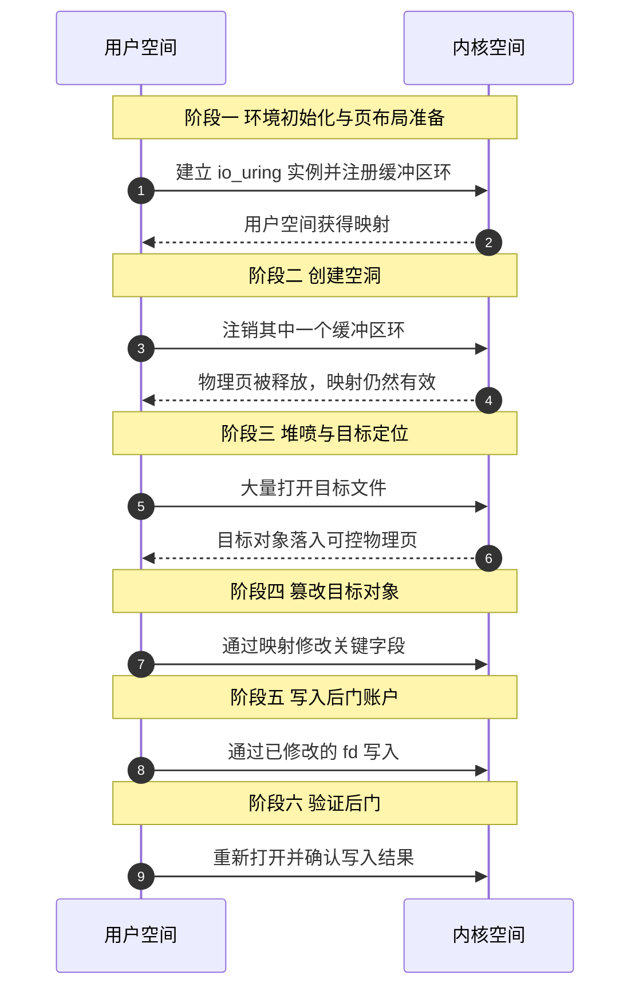
```mermaid
sequenceDiagram
    autonumber
    participant U as 用户空间
    participant K as 内核空间

    Note over U,K: 阶段一 环境初始化与页布局准备
    U->>K: 建立 io_uring 实例并注册缓冲区环
    K-->>U: 用户空间获得映射

    Note over U,K: 阶段二 创建空洞
    U->>K: 注销其中一个缓冲区环
    K-->>U: 物理页被释放，映射仍然有效

    Note over U,K: 阶段三 堆喷与目标定位
    U->>K: 大量打开目标文件
    K-->>U: 目标对象落入可控物理页

    Note over U,K: 阶段四 篡改目标对象
    U->>K: 通过映射修改关键字段

    Note over U,K: 阶段五 写入后门账户
    U->>K: 通过已修改的 fd 写入

    Note over U,K: 阶段六 验证后门
    U->>K: 重新打开并确认写入结果
```

各阶段的详细系统调用序列、状态迁移与内核数据结构交互，将在 3-2 至 3-7 中逐一展开。

### 3-2. 阶段一：环境初始化与页布局准备

环境初始化阶段的目标是建立稳定的物理页布局基础，并尽可能消耗 buddy 分配器中空闲的 order-0 页面，为后续的页回收创造有利条件。物理页布局的稳定性直接决定了后续阶段能否可靠地将目标对象分配到已释放的页面上，因此这一阶段的准备工作至关重要。

利用者首先将当前进程绑定到单一 CPU 核心。Linux 的 SLUB 分配器为每个 CPU 维护独立的空闲对象链表，跨核分配会导致对象来源不一致，进而破坏页布局的连续性。通过 CPU 绑定，可以使整个利用过程中涉及的 slab 分配与释放都在同一核心上完成，显著提高页布局的可预测性。随后，利用者提高进程的文件描述符上限，为后续大量打开文件的操作预留足够的资源槽位，避免因 fd 耗尽导致堆喷中断。

接下来，利用者通过 `io_uring_setup()` 创建 io_uring 实例，并以 `IORING_REGISTER_PBUF_RING` 配合 `IOU_PBUF_RING_MMAP` 标志注册大量缓冲区环。每个缓冲区环的物理页由内核在 `io_alloc_pbuf_ring()` 中通过 `__get_free_pages()` 分配，且每个环恰好占用一个 order-0 页面。通过注册大量这样的环，可以持续消耗 buddy 分配器中的空闲 order-0 页面。当空闲页面数量减少到一定程度后，后续的页分配将更倾向于复用刚刚释放的页面，从而为阶段二制造的页空洞被目标对象回收创造条件。

每个环注册完成后，用户空间通过 `mmap()` 以 `IORING_OFF_PBUF_RING | (bgid << IORING_OFF_PBUF_SHIFT)` 为偏移量将其映射到用户地址空间。内核在 `io_uring_mmap()` 中调用 `remap_pfn_range()` 建立 `VM_PFNMAP` 映射。该映射不增加页引用计数，用户空间的 `munmap()` 不会触发 `put_page()`，内核侧的释放也不会被用户空间映射所阻止。这一语义错位是后续所有阶段的基础，也是 **CVE-2024-0582** 的核心所在。

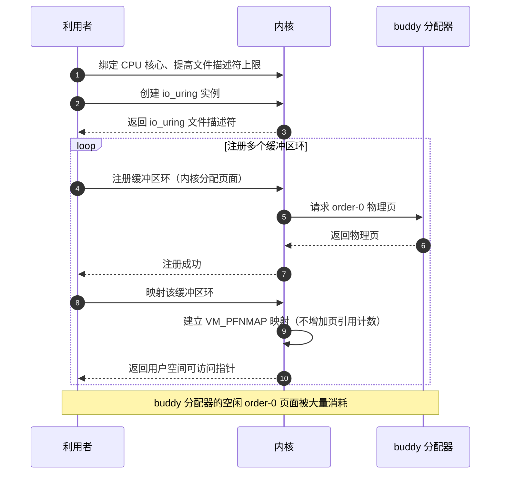
```mermaid
sequenceDiagram
    autonumber
    participant U as 利用者
    participant K as 内核
    participant B as buddy 分配器

    U->>K: 绑定 CPU 核心、提高文件描述符上限
    U->>K: 创建 io_uring 实例
    K-->>U: 返回 io_uring 文件描述符
    loop 注册多个缓冲区环
        U->>K: 注册缓冲区环（内核分配页面）
        K->>B: 请求 order-0 物理页
        B-->>K: 返回物理页
        K-->>U: 注册成功
        U->>K: 映射该缓冲区环
        K->>K: 建立 VM_PFNMAP 映射（不增加页引用计数）
        K-->>U: 返回用户空间可访问指针
    end
    Note over U,B: buddy 分配器的空闲 order-0 页面被大量消耗
```

阶段一完成后，系统中存在大量由内核分配、经用户空间映射的缓冲区环页面，buddy 分配器的空闲 order-0 页面已被显著消耗。此时，利用者已具备制造页空洞并回收该空洞的物理条件，下一阶段将选择一个环进行注销，释放其物理页。

### 3-3. 阶段二：创建空洞

阶段二的目标是制造一个 order-0 的页空洞，并保留对该空洞的用户空间访问能力。这一空洞是后续目标对象回收的容器，其位置和状态直接影响阶段三的成功率。

利用者在已注册的大量缓冲区环中选择一个环，在保持其用户空间映射有效的前提下调用 `io_uring_unregister_buf_ring()`。该调用进入内核后，经由 `io_unregister_pbuf_ring()` 和 `__io_remove_buffers()` 执行释放逻辑。由于该环是通过 `IOU_PBUF_RING_MMAP` 注册的，`bl->is_mmap` 为 1，释放路径会调用 `folio_put(virt_to_folio(bl->buf_ring))` 将物理页归还给 buddy 分配器。

关键在于，`remap_pfn_range()` 建立的 `VM_PFNMAP` 映射从未增加页引用计数，因此 `folio_put()` 会无条件成功，不会检查用户空间是否仍然持有该页的有效映射。释放完成后，物理页回到 buddy 分配器的空闲链表，而用户空间指针仍然指向该物理页，形成 dangling mapping。利用者可以通过该指针直接读写这块已被释放的物理内存，而内核对此一无所知。

这一阶段结束后，系统中存在一个已知位置、用户空间可访问的 order-0 空洞。后续阶段的目标是让内核中某个受信任的对象分配到该空洞中，从而使用户空间获得对该对象的读写能力。

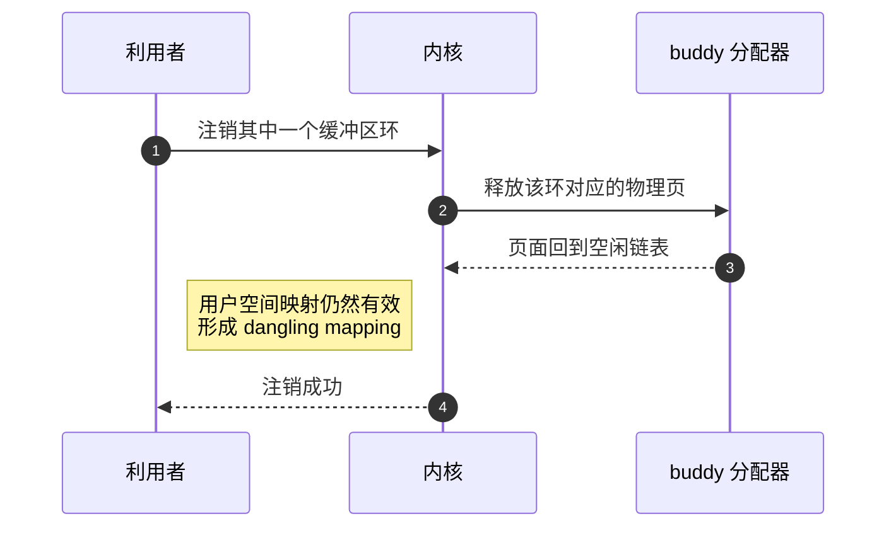
```mermaid
sequenceDiagram
    autonumber
    participant U as 利用者
    participant K as 内核
    participant B as buddy 分配器

    U->>K: 注销其中一个缓冲区环
    K->>B: 释放该环对应的物理页
    B-->>K: 页面回到空闲链表
    Note right of U: 用户空间映射仍然有效<br/>形成 dangling mapping
    K-->>U: 注销成功
```

### 3-4. 阶段三：堆喷与目标定位

阶段三的目标是让内核中一个受信任的对象分配到阶段二制造的页空洞中，并在用户空间完成对该对象的定位。本方案选择 `struct file` 作为目标对象，因为该结构体在文件操作中频繁分配，且包含多个可用于权限控制的字段。

利用者在同一进程中通过大量打开目标文件来堆喷 `struct file` 对象。每次 `open()` 调用都会从 `filp` 缓存分配一个新的 `struct file`。`filp` 缓存是 SLUB 分配器中的一个专用缓存，其 slab 由一个或多个物理页组成。当缓存中的空闲 slab 被耗尽后，内核会向 buddy 分配器请求新的空闲页面来创建新的 slab。此时，阶段二释放的物理页会被页分配器返回，后续创建的 `struct file` 对象将落入用户空间可读写的物理页中。

由于阶段一已大量消耗 buddy 分配器的空闲 order-0 页面，页分配器在收到新的页面请求时，会优先复用刚刚释放的页面。因此，阶段二制造的页空洞有较大概率被 `filp` 缓存的新 slab 所占用，从而使堆喷产生的 `struct file` 对象落入用户空间可控的物理页中。

堆喷完成后，利用者通过 dangling mapping 读取该物理页的内容，并依据 `struct file` 中若干字段的组合特征进行匹配。这些字段的取值由文件类型与内核符号布局共同决定，其组合构成了一个可识别的特征。通过该特征，利用者可以在不依赖完整内核基址、不触发额外系统调用的前提下，准确锁定目标文件结构。定位完成后，利用者即可获得目标对象在物理页中的精确位置，为下一阶段的篡改做好准备。

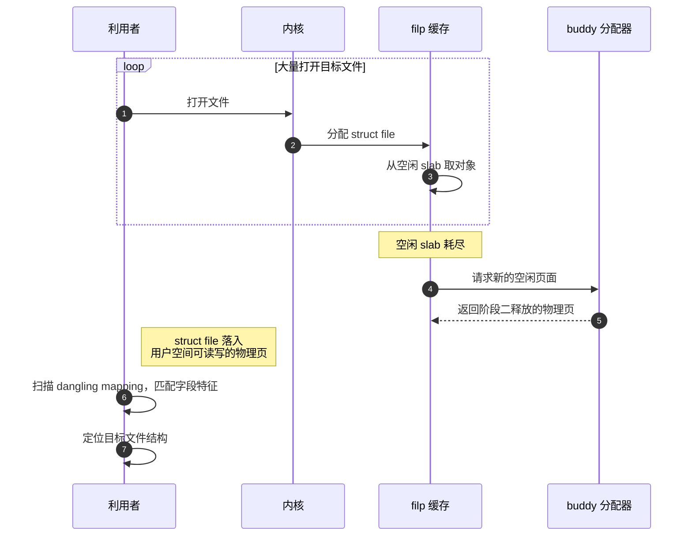
```mermaid
sequenceDiagram
    autonumber
    participant U as 利用者
    participant K as 内核
    participant F as filp 缓存
    participant B as buddy 分配器

    loop 大量打开目标文件
        U->>K: 打开文件
        K->>F: 分配 struct file
        F->>F: 从空闲 slab 取对象
    end
    Note over F: 空闲 slab 耗尽
    F->>B: 请求新的空闲页面
    B-->>F: 返回阶段二释放的物理页
    Note right of U: struct file 落入<br/>用户空间可读写的物理页
    U->>U: 扫描 dangling mapping，匹配字段特征
    U->>U: 定位目标文件结构
```

### 3-5. 阶段四：篡改目标对象

阶段四的目标是修改已定位目标对象的关键字段，使其在后续的文件操作中表现出利用者期望的行为。本方案不修改函数指针，仅调整数据字段，因此不会触发任何控制流完整性校验。

定位到目标文件结构后，利用者通过仍然有效的 dangling mapping 修改其关键字段。具体而言，通过设置与写权限相关的模式位，使原本以只读方式打开的文件描述符在 VFS 层面具备写入能力。VFS 在检查文件是否可写时，主要依据 `f_mode` 中的标志位，因此修改该字段即可绕过权限检查。同时，利用者调整文件偏移量字段，使后续写入操作追加到文件末尾，而不是覆盖文件开头的内容。

整个篡改过程仅涉及数据字段的修改，不触碰 `f_op` 等函数指针。因此，即使内核启用了 CFI 等控制流完整性保护，也不会对这类数据篡改产生任何阻碍。篡改完成后，目标文件描述符在用户空间看来仍然是一个普通的只读文件描述符，但在内核眼中，它已经具备了写入能力。

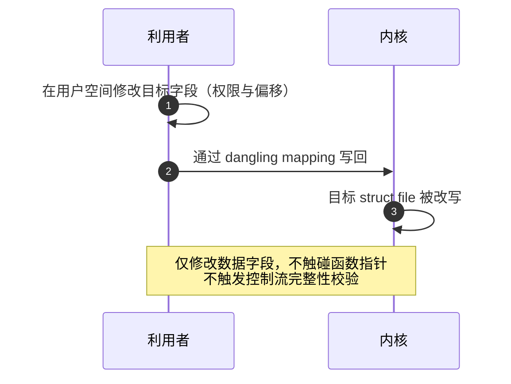
```mermaid
sequenceDiagram
    autonumber
    participant U as 利用者
    participant K as 内核

    U->>U: 在用户空间修改目标字段（权限与偏移）
    U->>K: 通过 dangling mapping 写回
    K->>K: 目标 struct file 被改写
    Note over U,K: 仅修改数据字段，不触碰函数指针<br/>不触发控制流完整性校验
```

### 3-6. 阶段五：写入后门账户

阶段五的目标是利用已篡改的文件描述符，将后门账户条目写入目标文件。由于目标文件的权限模式已被修改，VFS 将放行写入请求，使原本不可写的文件变为可写。

利用者在已篡改的文件描述符上执行写入操作。写入请求进入内核后，VFS 首先检查文件描述符对应的 `struct file` 中的 `f_mode` 字段。由于该字段已被修改为包含写权限标志，VFS 判定该文件可写，进而调用底层文件系统的写入函数，将数据追加到文件末尾。写入的内容是一条具有 root 权限的账户条目，其格式符合目标文件的语法要求。

此阶段完全通过合法的系统调用完成，不涉及用户态直接访问内核地址空间，也不涉及任何形式的控制流劫持。写入操作的结果与普通文件写入无异，区别仅在于该文件描述符在打开时并不具备写权限，其写能力来源于阶段四对内核对象的篡改。

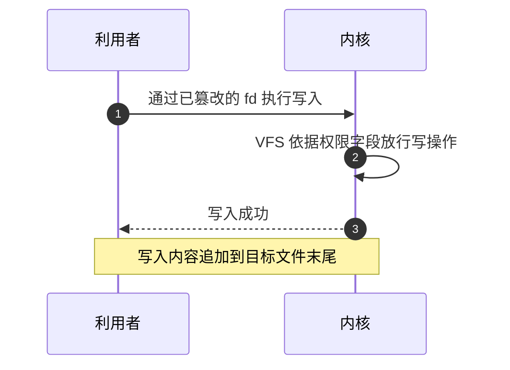
```mermaid
sequenceDiagram
    autonumber
    participant U as 利用者
    participant K as 内核

    U->>K: 通过已篡改的 fd 执行写入
    K->>K: VFS 依据权限字段放行写操作
    K-->>U: 写入成功
    Note over U,K: 写入内容追加到目标文件末尾
```

### 3-7. 阶段六：验证后门

阶段六的目标是独立验证后门账户是否已成功写入目标文件。该验证不依赖被篡改的文件描述符，而是通过重新打开文件并读取其内容来完成，确保写入结果确实落盘。

利用者重新打开目标文件，通过读取内容确认后门条目已成功写入。具体而言，利用者以只读方式打开目标文件，获取文件大小，并将文件内容映射到用户空间，随后在映射区域中搜索后门条目的特征字符串。如果搜索成功，则说明写入操作已生效；如果搜索失败，则说明写入过程存在问题，需要回溯前面的阶段。

该验证过程完全独立于被篡改的文件描述符，因此可以客观地确认写入结果是否确实落盘，而非仅停留在缓存状态。验证成功后，利用者即可确认权限提升已完成。

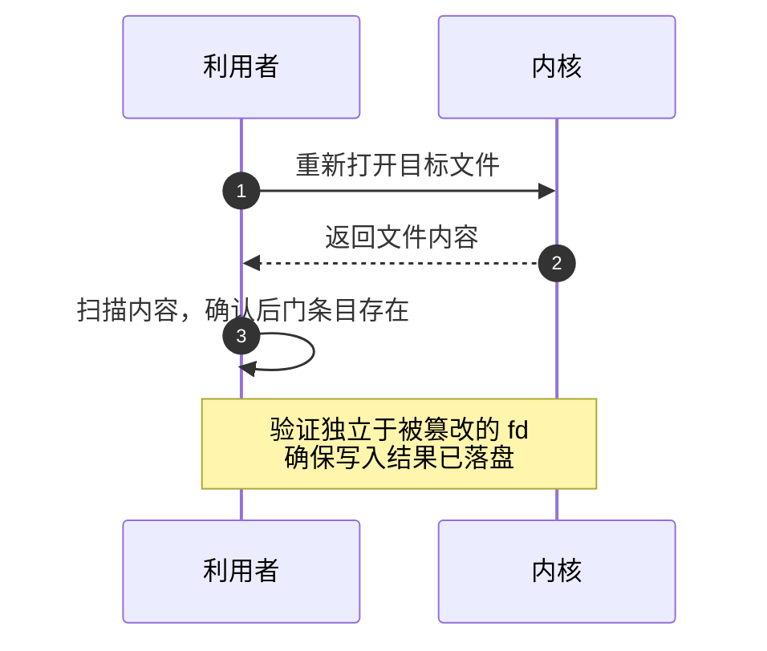
```mermaid
sequenceDiagram
    autonumber
    participant U as 利用者
    participant K as 内核

    U->>K: 重新打开目标文件
    K-->>U: 返回文件内容
    U->>U: 扫描内容，确认后门条目存在
    Note over U,K: 验证独立于被篡改的 fd<br/>确保写入结果已落盘
```

### 3-8. 内核保护机制的应对策略

现代内核通常启用多种安全机制，这些机制分别从地址空间随机化、执行权限隔离、内存分配隔离、堆元数据保护、控制流完整性以及内核与用户态数据交换边界等维度，对潜在的内存破坏行为进行防御。本方案在设计之初便充分考量了这些保护机制的影响，并针对性地选择了相应的技术路径。

| 保护机制                             | 机制原理                                                               | 本方案应对策略                                                                                             |
| ------------------------------------ | ---------------------------------------------------------------------- | ---------------------------------------------------------------------------------------------------------- |
| **KASLR**                            | 随机化内核代码段、数据段和模块的加载基址。                             | 采用数据导向路径，不依赖内核地址预测，无需执行内核代码或覆写函数指针。                                     |
| **SMEP / SMAP**                      | SMEP 阻止内核态执行用户态代码；SMAP 阻止内核态访问用户态数据。         | 不执行内核代码，通过修改目标文件的页缓存完成权限提升，执行完全在用户态进行。                               |
| **KPTI**                             | 分离内核页表与用户页表，使用户态页表不包含内核映射。                   | 全程通过合法系统调用完成，不依赖用户态直接访问内核地址空间。                                               |
| **CFI**                              | 校验间接函数调用与跳转目标，防止控制流劫持。                           | 本方案采用纯数据篡改，不修改函数指针，不劫持控制流，因此 CFI 无法阻断此类利用。                            |
| **CONFIG_MEMCG / CONFIG_MEMCG_KMEM** | 为受控进程创建独立的 `kmalloc-cg-*` 缓存，与普通 `kmalloc-*` 隔离。    | 该机制不影响页级堆布局操作。核心依赖的是物理页面级分配与释放顺序，与 slab 缓存隔离无关。                   |
| **CONFIG_SLAB_FREELIST_RANDOM**      | 随机化 SLUB 空闲链表中的对象顺序，增加同一 slab 内分配顺序的预测难度。 | 该机制作用于 SLUB 分配器内部，不影响物理页面级布局。方案核心依赖的是物理页面的地址分布与足够大的操作窗口。 |
| **CONFIG_SLAB_FREELIST_HARDENED**    | 对空闲链表指针进行异或混淆，防止通过覆写指针实现任意分配。             | 基于页面级布局，不依赖空闲链表指针覆写，该保护不构成影响。                                                 |
| **CONFIG_HARDENED_USERCOPY**         | 在 `copy_to_user()` / `copy_from_user()` 路径中增加边界检查。          | 越界写入发生在内核内部的复制路径中，不经过用户态拷贝接口，检查机制无法覆盖。                               |

整体而言，本方案通过数据导向路径、物理页面级布局与内核内部拷贝路径等设计选择，有效规避了上述保护机制。方案不依赖任何形式的控制流劫持，也不依赖内核地址泄漏，因此在面对多种现代内核保护机制时仍能保持稳定的可利用性。

### 3-9. 前提条件与局限性

**前提条件**：

- 目标内核启用 `CONFIG_IO_URING`，这是使用 io_uring 接口的前提。
- 目标内核版本处于受影响范围内，即 Linux 6.4 至 6.6.4 以及 6.7-rc1 至 6.7-rc3。
- 当前进程具备执行 `io_uring_setup()`、`io_uring_register()` 与 `mmap()` 的权限。在大多数发行版中，未特权用户即可使用 io_uring 的基础功能。
- 定位阶段需要一个或多个可用于匹配的 `file_operations` 符号锚点。这些锚点不局限于特定文件系统，可以预先构建一个符号列表，涵盖目标环境中可能出现的多种文件类型。

**局限性**：

- 方案依赖物理页面的重新分配时机，在多核高负载环境下成功率可能下降。通过 CPU 绑定可以显著缓解这一问题，但无法完全消除环境噪声的影响。
- 定位阶段的符号锚点需要与目标内核版本匹配。通过预先构建覆盖多种文件系统与多种文件类型的符号列表，并利用各符号低位偏移的匹配特性，可以在不依赖完整内核基址的前提下完成定位，从而绕过单一符号的限制。

### 3-10. 章节总结

本方案以 **CVE-2024-0582** 提供的页级释放后重用原语为起点，通过大量注册缓冲区环消耗 buddy 分配器中的空闲 order-0 页面，再释放其中一个环制造空洞，随后利用物理页面的重新分配将受信任的内核对象纳入用户空间可控范围，最终以纯数据篡改的方式完成权限提升。

方案采用数据导向路径，不修改函数指针、不劫持控制流，因此对 KASLR、SMEP/SMAP、KPTI、CFI 等主流内核保护机制具备良好的规避能力。各阶段之间的衔接以物理页布局为核心线索，通过 CPU 绑定、文件描述符预分配与特征匹配等设计选择，在保证可靠性的同时避免了敏感利用细节的外泄。

从整体上看，该方案展示了页级释放后重用漏洞在数据导向利用路径下的典型思路：以物理页为操作单元，以内核对象为篡改目标，以合法系统调用为执行手段，最终在不触发控制流保护的前提下完成权限提升。这一思路对于理解现代内核漏洞的利用方式具有参考价值。

### 3-11. 测试结果

<div style="text-align: center; margin: 2rem 0;">
  
</div>

## 4. 利用思路二（arb r/w）

### 4-1. 整体架构设计

本方案同样以 **CVE-2024-0582** 提供的页级释放后重用原语为起点，但与思路一不同，本方案不满足于对单个对象的字段篡改，而是通过将释放的高阶物理块重新分配为管道缓冲区数组，进而构造出 arb r/w 原语。依托该原语，方案可以在不依赖任何控制流劫持的前提下，完成内核符号定位、`task_struct` 定位与 cred 凭证替换，最终以 root 权限执行命令。

方案的整体流程可概括为七个阶段：环境初始化与页布局准备、创建 order-2 空洞、管道堆喷与 arb r/w 原语构建、vmemmap 基址发现、`task_struct` 定位、cred 凭证替换与管道恢复、获取 root 权限。各阶段之间以物理页布局与对象回收为核心线索，前一阶段的输出为后一阶段提供必要的状态基础。整体阶段衔接如下所示。

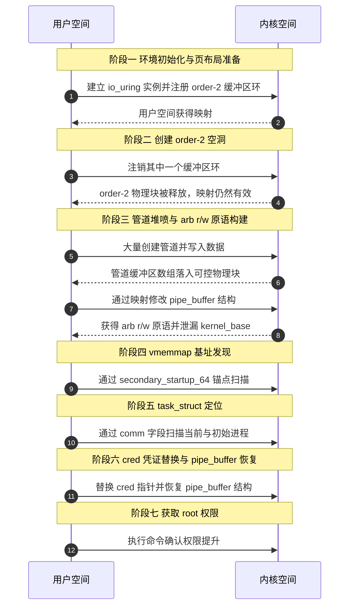
```mermaid
sequenceDiagram
    autonumber
    participant U as 用户空间
    participant K as 内核空间

    Note over U,K: 阶段一 环境初始化与页布局准备
    U->>K: 建立 io_uring 实例并注册 order-2 缓冲区环
    K-->>U: 用户空间获得映射

    Note over U,K: 阶段二 创建 order-2 空洞
    U->>K: 注销其中一个缓冲区环
    K-->>U: order-2 物理块被释放，映射仍然有效

    Note over U,K: 阶段三 管道堆喷与 arb r/w 原语构建
    U->>K: 大量创建管道并写入数据
    K-->>U: 管道缓冲区数组落入可控物理块
    U->>K: 通过映射修改 pipe_buffer 结构
    K-->>U: 获得 arb r/w 原语并泄漏 kernel_base

    Note over U,K: 阶段四 vmemmap 基址发现
    U->>K: 通过 secondary_startup_64 锚点扫描

    Note over U,K: 阶段五 task_struct 定位
    U->>K: 通过 comm 字段扫描当前与初始进程

    Note over U,K: 阶段六 cred 凭证替换与 pipe_buffer 恢复
    U->>K: 替换 cred 指针并恢复 pipe_buffer 结构

    Note over U,K: 阶段七 获取 root 权限
    U->>K: 执行命令确认权限提升
```

各阶段的详细系统调用序列、状态迁移与内核数据结构交互，将在 4-2 至 4-8 中逐一展开。

### 4-2. 阶段一：环境初始化与页布局准备

环境初始化阶段的目标与思路一相似，即建立稳定的物理页布局基础。利用者首先将当前进程绑定到单一 CPU 核心，使 SLUB 的每 CPU 空闲链表在整个利用过程中保持一致，避免因跨核分配导致页布局偏移。随后通过 `io_uring_setup()` 创建 io_uring 实例，并以 `IORING_REGISTER_PBUF_RING` 配合 `IOU_PBUF_RING_MMAP` 标志注册大量缓冲区环。

与思路一不同的是，本方案中每个缓冲区环占用的不是单个 order-0 页面，而是由 4 个连续页面组成的 order-2 物理块。这一设计选择的目的是匹配后续目标对象的分配尺寸：管道缓冲区数组在内核中以 `kmalloc-cg-1k` 缓存分配，该缓存的 slab 来自 order-2 物理块，因此需要相同阶数的空洞才能容纳。通过注册大量 order-2 缓冲区环，利用者可以持续消耗 buddy 分配器中对应阶数的空闲块，为后续的页回收创造有利条件。

每个环注册完成后，用户空间通过 `mmap()` 以 `IORING_OFF_PBUF_RING | (bgid << IORING_OFF_PBUF_SHIFT)` 为偏移量将其映射到用户地址空间。内核在 `io_uring_mmap()` 中调用 `remap_pfn_range()` 建立 `VM_PFNMAP` 映射。该映射不增加页引用计数，为后续的释放后重用埋下伏笔。

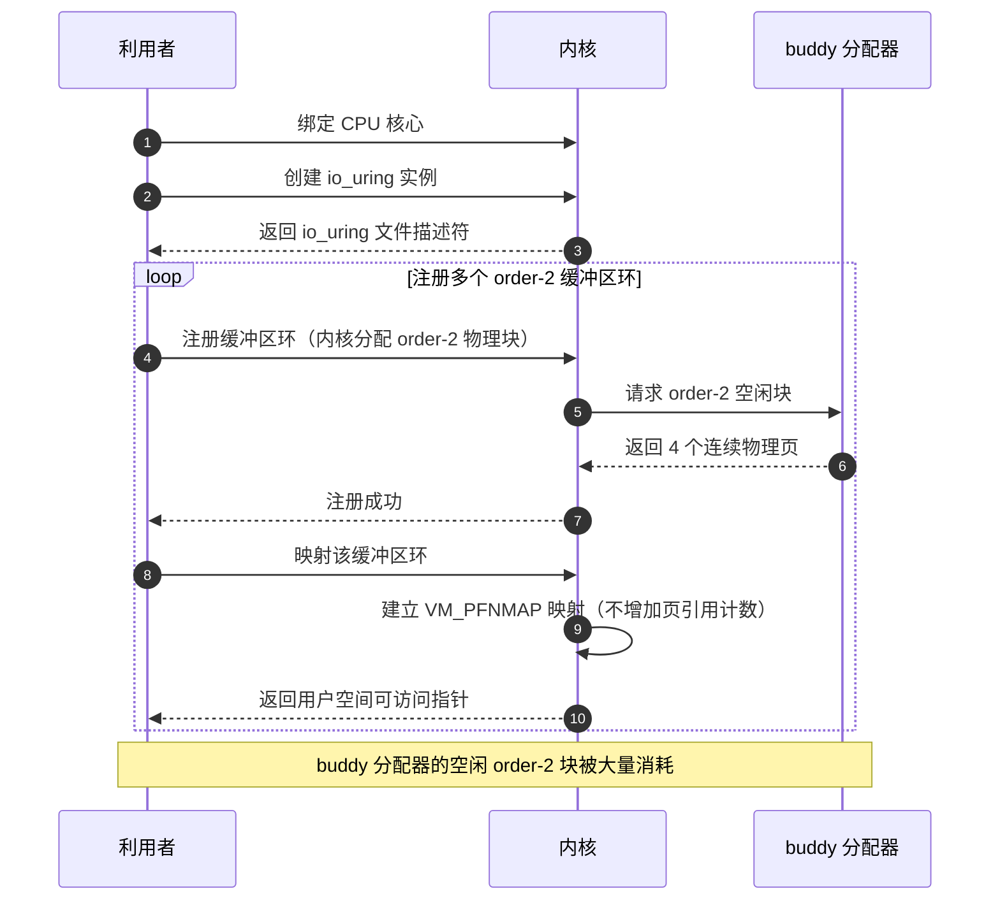
```mermaid
sequenceDiagram
    autonumber
    participant U as 利用者
    participant K as 内核
    participant B as buddy 分配器

    U->>K: 绑定 CPU 核心
    U->>K: 创建 io_uring 实例
    K-->>U: 返回 io_uring 文件描述符
    loop 注册多个 order-2 缓冲区环
        U->>K: 注册缓冲区环（内核分配 order-2 物理块）
        K->>B: 请求 order-2 空闲块
        B-->>K: 返回 4 个连续物理页
        K-->>U: 注册成功
        U->>K: 映射该缓冲区环
        K->>K: 建立 VM_PFNMAP 映射（不增加页引用计数）
        K-->>U: 返回用户空间可访问指针
    end
    Note over U,B: buddy 分配器的空闲 order-2 块被大量消耗
```

### 4-3. 阶段二：创建 order-2 空洞

在大量已注册的缓冲区环中，选择一个环，在保持用户空间映射有效的前提下调用 `io_uring_unregister_buf_ring()`。该操作释放该环对应的整个 order-2 物理块，使其返回 buddy 分配器的空闲链表，形成一个 order-2 空洞。由于 `VM_PFNMAP` 映射从未增加页引用计数，释放路径中的 `folio_put()` 会无条件将页面归还，而不会检查用户空间映射是否仍然存在。释放完成后，用户空间指针仍然指向该物理块，形成 dangling mapping。

与思路一制造的 order-0 空洞相比，本方案制造的 order-2 空洞具有更大的容量，能够容纳跨页分配的对象。这一差异决定了后续阶段可以选用的目标对象类型更为丰富，也为构建 arb r/w 原语提供了物理基础。

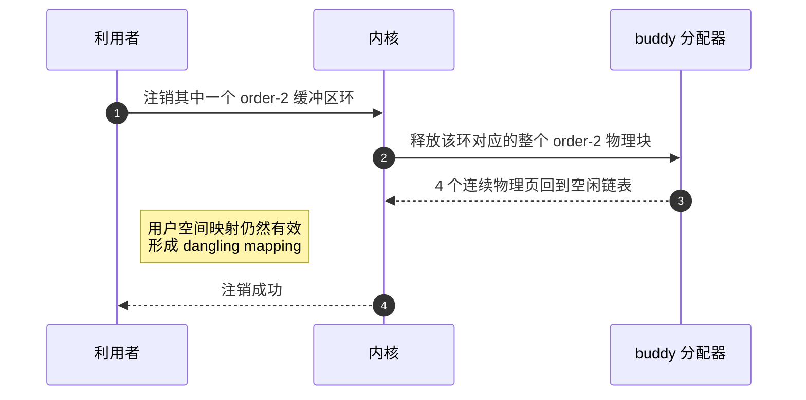
```mermaid
sequenceDiagram
    autonumber
    participant U as 利用者
    participant K as 内核
    participant B as buddy 分配器

    U->>K: 注销其中一个 order-2 缓冲区环
    K->>B: 释放该环对应的整个 order-2 物理块
    B-->>K: 4 个连续物理页回到空闲链表
    Note right of U: 用户空间映射仍然有效<br/>形成 dangling mapping
    K-->>U: 注销成功
```

### 4-4. 阶段三：管道堆喷与 arb r/w 原语构建

阶段三包含两个紧密衔接的子步骤：一是通过管道堆喷让管道缓冲区数组落入阶段二制造的 order-2 空洞，二是基于该缓冲区描述符构造 arb r/w 原语。

管道缓冲区数组在内核中由 `kmalloc-cg-1k` 缓存分配，该缓存的 slab 来自 order-2 物理块，其大小与阶段二释放的 order-2 空洞相匹配。利用者在同一进程中大量创建管道，每次 `pipe()` 调用都会分配一个管道缓冲区数组。当缓存中的空闲 slab 被耗尽后，内核会向页分配器请求新的 order-2 空闲页面，此时阶段二释放的高阶物理块会被返回，后续创建的管道缓冲区数组将落入用户空间可读写的物理块中。

为了在后续定位阶段区分不同的管道，利用者在每次创建管道后向其写入不同长度的数据。写入长度被记录在管道缓冲区描述符的 `len` 字段中，形成一个可识别的标记。堆喷完成后，利用者通过 dangling mapping 读取该物理块的内容，并依据管道缓冲区描述符中若干字段的组合特征进行匹配。其中，`ops` 字段指向内核符号 `anon_pipe_buf_ops`，利用者通过比对该符号的低位偏移确认该描述符属于管道缓冲区，同时也由此计算出 kernel_base。通过这一特征组合，利用者可以在不依赖完整内核基址的前提下，准确锁定目标管道缓冲区数组及其对应的管道索引。

定位完成后，利用者将目标 `pipe_buffer` 结构复制为读模板与写模板，并通过 dangling mapping 将其写回。读模板使用较大的长度以便一次性获取较多数据，写模板则使用零长度以避免写入路径中的合并逻辑干扰。此后，利用者只需替换模板中的物理页指针字段，即可让管道读写操作作用于任意物理页，从而获得对物理内存的 arb r/w 能力。该原语的作用范围通过直接映射区与虚拟内存空间建立线性对应关系，等价于对内核直接映射区的任意读写。

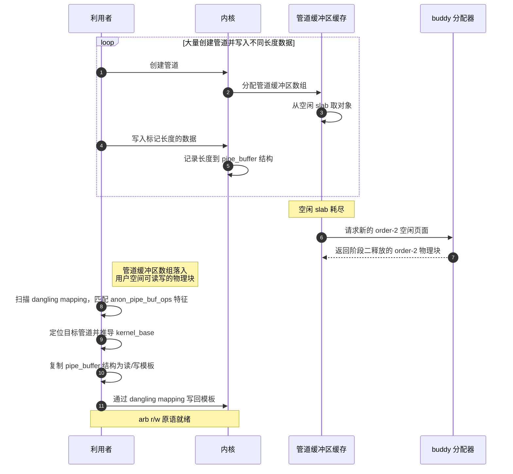
```mermaid
sequenceDiagram
    autonumber
    participant U as 利用者
    participant K as 内核
    participant C as 管道缓冲区缓存
    participant B as buddy 分配器

    loop 大量创建管道并写入不同长度数据
        U->>K: 创建管道
        K->>C: 分配管道缓冲区数组
        C->>C: 从空闲 slab 取对象
        U->>K: 写入标记长度的数据
        K->>K: 记录长度到 pipe_buffer 结构
    end
    Note over C: 空闲 slab 耗尽
    C->>B: 请求新的 order-2 空闲页面
    B-->>C: 返回阶段二释放的 order-2 物理块
    Note right of U: 管道缓冲区数组落入<br/>用户空间可读写的物理块
    U->>U: 扫描 dangling mapping，匹配 anon_pipe_buf_ops 特征
    U->>U: 定位目标管道并推导 kernel_base
    U->>U: 复制 pipe_buffer 结构为读/写模板
    U->>K: 通过 dangling mapping 写回模板
    Note over U,K: arb r/w 原语就绪
```

### 4-5. 阶段四：vmemmap 基址发现

阶段四的目标是利用 arb r/w 原语，定位 vmemmap 区域的虚拟地址基址。vmemmap 是内核用于描述物理页的结构体数组，每个物理页对应一个 `struct page`，因此 vmemmap 基址是后续通过物理地址定位 `task_struct` 的关键参数。

本方案采用的定位思路是：利用内核镜像中早期入口代码 `secondary_startup_64` 在物理内存中的固定位置作为锚点。该符号位于内核镜像的早期代码段，其物理地址在系统启动时即已确定，且其内容包含指向自身其他部分的特征指针。利用者通过读原语扫描候选的 vmemmap 基址，读取对应物理页 `0x9d000`（即 `secondary_startup_64` 所在物理地址）的 `struct page` 内容，检查其首字段是否指向 `secondary_startup_64`。若匹配成功，则候选基址即为正确的 vmemmap 基址，同时也可根据该符号的已知偏移修正 kernel_base。若匹配失败，则将候选基址向后步进 256 MB 继续尝试。

这一阶段的定位过程不依赖任何预先泄漏的 vmemmap 地址，完全通过物理内存读取与特征匹配完成。因此，KASLR 对 vmemmap 的随机化不会对本阶段构成实质性阻碍。

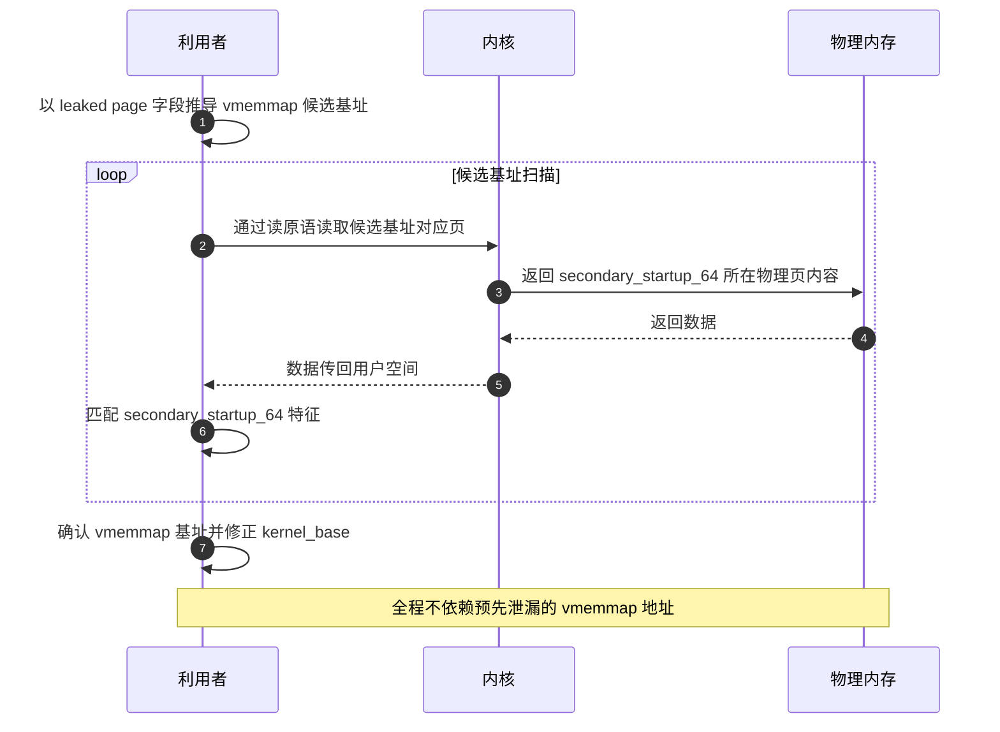
```mermaid
sequenceDiagram
    autonumber
    participant U as 利用者
    participant K as 内核
    participant M as 物理内存

    U->>U: 以 leaked page 字段推导 vmemmap 候选基址
    loop 候选基址扫描
        U->>K: 通过读原语读取候选基址对应页
        K->>M: 返回 secondary_startup_64 所在物理页内容
        M-->>K: 返回数据
        K-->>U: 数据传回用户空间
        U->>U: 匹配 secondary_startup_64 特征
    end
    U->>U: 确认 vmemmap 基址并修正 kernel_base
    Note over U,M: 全程不依赖预先泄漏的 vmemmap 地址
```

### 4-6. 阶段五：task_struct 定位

阶段五的目标是利用 arb r/w 原语，在物理内存中定位当前进程与初始进程的 `task_struct`。`task_struct` 是内核中描述进程的核心数据结构，其中包含指向 cred 结构的指针、进程名称等字段。

本方案采用的定位思路是：利用者首先通过 `prctl()` 将当前进程的名称设置为一个可识别的标记。随后，利用者通过读原语按顺序扫描 vmemmap 中的 `struct page`，逐一读取每个物理页的内容，寻找包含该标记的页面。由于 `comm` 字段位于 `task_struct` 内部固定偏移处，一旦在某个页面中匹配到该标记，即可结合标记周围字段的取值特征确认其确实位于 `task_struct` 中。同理，利用者通过扫描寻找初始进程的 `task_struct`，其 `comm` 字段具有固定的已知取值。

在定位过程中，利用者还通过 `task_struct` 中的字段推导出直接映射区的虚拟地址基准。该基准是后续通过虚拟地址访问 `task_struct` 其他字段的必要参数。定位完成后，利用者即可获得当前进程与初始进程 `task_struct` 的精确位置，以及各自的 cred 指针与命名空间指针。

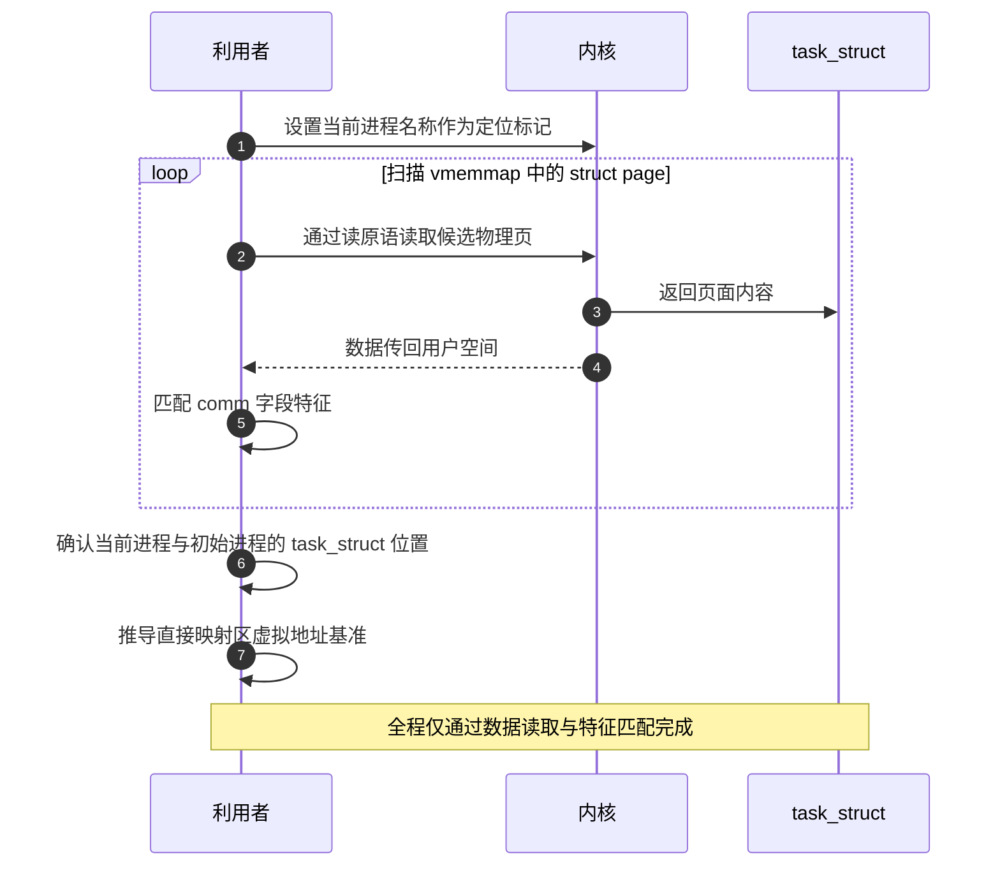
```mermaid
sequenceDiagram
    autonumber
    participant U as 利用者
    participant K as 内核
    participant T as task_struct

    U->>K: 设置当前进程名称作为定位标记
    loop 扫描 vmemmap 中的 struct page
        U->>K: 通过读原语读取候选物理页
        K->>T: 返回页面内容
        K-->>U: 数据传回用户空间
        U->>U: 匹配 comm 字段特征
    end
    U->>U: 确认当前进程与初始进程的 task_struct 位置
    U->>U: 推导直接映射区虚拟地址基准
    Note over U,T: 全程仅通过数据读取与特征匹配完成
```

### 4-7. 阶段六：cred 凭证替换与 pipe_buffer 恢复

阶段六的目标是利用 arb r/w 原语，将当前进程的 cred 凭证替换为 root 的 cred 凭证，并将利用过程中修改的 `pipe_buffer` 结构恢复至原始状态。

利用者通过写原语将当前 `task_struct` 中的 cred 指针与命名空间指针替换为初始进程对应字段的值。由于初始进程运行于 root 权限与初始命名空间，替换完成后，当前进程即获得 root 权限与完整的命名空间视图。整个替换过程仅涉及数据字段的修改，不触碰函数指针，因此不触发任何控制流完整性校验。

凭证替换完成后，利用者通过 dangling mapping 将先前保存的原始 `pipe_buffer` 结构写回目标管道对应的位置，使该管道的缓冲区描述符恢复至未被篡改的状态。至此，清理路径可以安全地关闭管道文件描述符并释放 io_uring 实例。

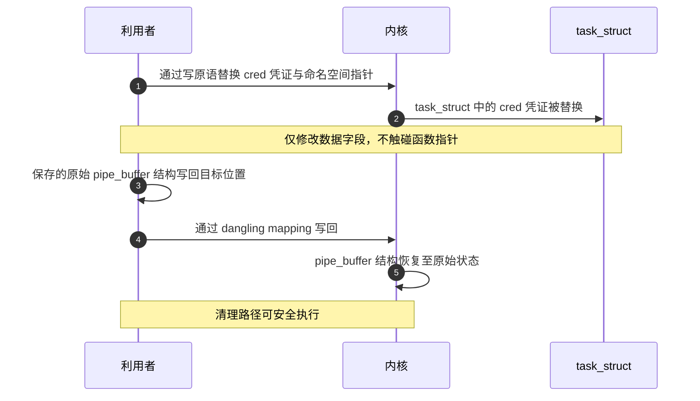
```mermaid
sequenceDiagram
    autonumber
    participant U as 利用者
    participant K as 内核
    participant T as task_struct

    U->>K: 通过写原语替换 cred 凭证与命名空间指针
    K->>T: task_struct 中的 cred 凭证被替换
    Note over U,T: 仅修改数据字段，不触碰函数指针
    U->>U: 保存的原始 pipe_buffer 结构写回目标位置
    U->>K: 通过 dangling mapping 写回
    K->>K: pipe_buffer 结构恢复至原始状态
    Note over U,K: 清理路径可安全执行
```

### 4-8. 阶段七：获取 root 权限

阶段七的目标是验证权限提升是否成功。利用者在凭证替换完成后执行命令，确认当前进程已具备 root 权限。

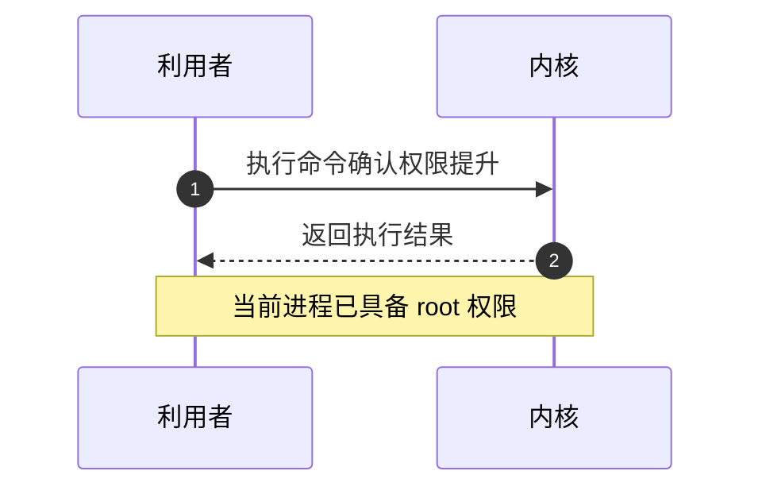
```mermaid
sequenceDiagram
    autonumber
    participant U as 利用者
    participant K as 内核

    U->>K: 执行命令确认权限提升
    K-->>U: 返回执行结果
    Note over U,K: 当前进程已具备 root 权限
```

### 4-9. 内核保护机制的应对策略

现代内核通常启用多种安全机制，这些机制分别从地址空间随机化、执行权限隔离、内存分配隔离、堆元数据保护、控制流完整性以及内核与用户态数据交换边界等维度，对潜在的内存破坏行为进行防御。本方案在设计之初便充分考量了这些保护机制的影响，并针对性地选择了相应的技术路径。

| 保护机制                             | 机制原理                                                               | 本方案应对策略                                                                                                                                     |
| ------------------------------------ | ---------------------------------------------------------------------- | -------------------------------------------------------------------------------------------------------------------------------------------------- |
| **KASLR**                            | 随机化内核代码段、数据段和模块的加载基址。                             | 通过 `anon_pipe_buf_ops` 泄漏 kernel_base，通过 `secondary_startup_64` 锚点定位 vmemmap 基址，不依赖预先泄漏的地址，不执行内核代码或覆写函数指针。 |
| **SMEP / SMAP**                      | SMEP 阻止内核态执行用户态代码；SMAP 阻止内核态访问用户态数据。         | 不执行内核代码，通过修改 `pipe_buffer` 结构构造读写原语，执行完全在用户态进行。                                                                    |
| **KPTI**                             | 分离内核页表与用户页表，使用户态页表不包含内核映射。                   | 全程通过合法系统调用完成，不依赖用户态直接访问内核地址空间。                                                                                       |
| **CFI**                              | 校验间接函数调用与跳转目标，防止控制流劫持。                           | 本方案采用纯数据篡改，不修改函数指针，不劫持控制流，因此 CFI 无法阻断此类利用。                                                                    |
| **CONFIG_MEMCG / CONFIG_MEMCG_KMEM** | 为受控进程创建独立的 `kmalloc-cg-*` 缓存，与普通 `kmalloc-*` 隔离。    | 本方案的目标对象管道缓冲区数组本身就分配在 `kmalloc-cg-1k` 缓存中，该机制不影响页级布局操作。                                                      |
| **CONFIG_SLAB_FREELIST_RANDOM**      | 随机化 SLUB 空闲链表中的对象顺序，增加同一 slab 内分配顺序的预测难度。 | 该机制作用于 SLUB 分配器内部，不影响物理页级布局。方案核心依赖的是物理页面的释放与再分配时序。                                                     |
| **CONFIG_SLAB_FREELIST_HARDENED**    | 对空闲链表指针进行异或混淆，防止通过覆写指针实现任意分配。             | 基于物理页级布局，不依赖空闲链表指针覆写，该保护不构成影响。                                                                                       |
| **CONFIG_HARDENED_USERCOPY**         | 在 `copy_to_user()` / `copy_from_user()` 路径中增加边界检查。          | 数据读写发生在管道缓冲区路径中，不经过用户态拷贝接口的边界检查，检查机制无法覆盖。                                                                 |

整体而言，本方案通过数据导向路径、物理页级布局与管道缓冲区路径等设计选择，有效规避了上述保护机制。与思路一相比，本方案的权限提升路径更为彻底，不依赖于对特定文件权限字段的修改，而是直接替换进程的 cred 凭证，因此在面对不同文件系统、不同发行版配置时具有更好的通用性。

### 4-10. 前提条件与局限性

**前提条件**：

- 目标内核启用 `CONFIG_IO_URING`，这是使用 io_uring 接口的前提。
- 目标内核版本处于受影响范围内，即 Linux 6.4 至 6.6.4 以及 6.7-rc1 至 6.7-rc3。
- 当前进程具备执行 `io_uring_setup()`、`io_uring_register()`、`mmap()` 与 `pipe()` 的权限。在大多数发行版中，未特权用户即可使用这些基础功能。
- 目标内核的 `task_struct` 布局与 `pipe_buffer` 结构布局需要与方案假设的布局一致。通过预先构建覆盖多种内核版本的布局描述，可以在不依赖完整内核基址的前提下完成定位，从而提升方案的通用性。

**局限性**：

- 方案依赖 order-2 物理块的释放与再分配时序，在多核高负载环境下成功率可能下降。通过 CPU 绑定可以显著缓解这一问题，但无法完全消除环境噪声的影响。
- 物理内存扫描阶段需要遍历较大范围的物理地址空间，耗时相对较长。在内存容量较大的系统上，扫描时间会相应增加。
- cred 凭证替换阶段依赖于 `task_struct` 中特定字段的偏移。若目标内核的 `task_struct` 布局与方案假设不一致，需要针对该内核版本重新适配偏移信息。

### 4-11. 章节总结

本方案以 **CVE-2024-0582** 提供的页级释放后重用原语为起点，通过释放 order-2 缓冲区环制造大容量空洞，再将管道缓冲区数组重新分配至该空洞，最终构造出 arb r/w 原语。依托该原语，方案完成了 kernel_base 推导、vmemmap 基址定位、`task_struct` 定位与 cred 凭证替换，从而在不修改函数指针、不劫持控制流的前提下完成权限提升。

与思路一相比，本方案的权限提升路径更为彻底，不依赖于对特定文件权限字段的修改，而是直接替换进程的 cred 凭证，因此在面对不同文件系统、不同发行版配置时具有更好的通用性。同时，方案采用数据导向路径，对 KASLR、SMEP/SMAP、KPTI、CFI 等主流内核保护机制具备良好的规避能力。

从整体上看，该方案展示了页级释放后重用漏洞在构建 arb r/w 原语方向上的典型思路：以物理页为操作单元，以管道缓冲区为原语载体，以物理内存扫描为定位手段，最终以 cred 凭证替换为提升目标。这一思路与思路一形成互补，共同覆盖了从单对象篡改到全地址空间读写的完整利用谱系。

### 4-12. 测试结果

<div style="text-align: center; margin: 2rem 0;">
  
</div>

## 5. 利用思路三（Dirty Pagetable）

### 5-1. 整体架构设计

本方案同样以 **CVE-2024-0582** 提供的页级释放后重用原语为起点，但与思路一和思路二不同，本方案不满足于对单个内核对象的字段篡改或构造任意读写原语，而是将释放的物理页重新分配为用户页表页，通过篡改页表项（PTE）实现任意物理地址的映射，进而完成内核物理基址泄漏、能力检查修补与权限提升。该策略通常被称为 Dirty Pagetable，其核心思想在于：页表本身也是由内核分配的物理页，当释放的物理页被回收为页表页时，用户空间即可通过悬空映射直接修改页表项，从而获得对任意物理地址的映射能力。

方案的整体流程可概括为六个阶段：环境初始化与页布局准备、创建 order-0 空洞、页表喷射与空洞回收、内核物理基址泄漏、能力检查修补、权限提升与状态恢复。各阶段之间以物理页布局与页表页回收为核心线索，前一阶段的输出为后一阶段提供必要的状态基础。整体阶段衔接如下所示。

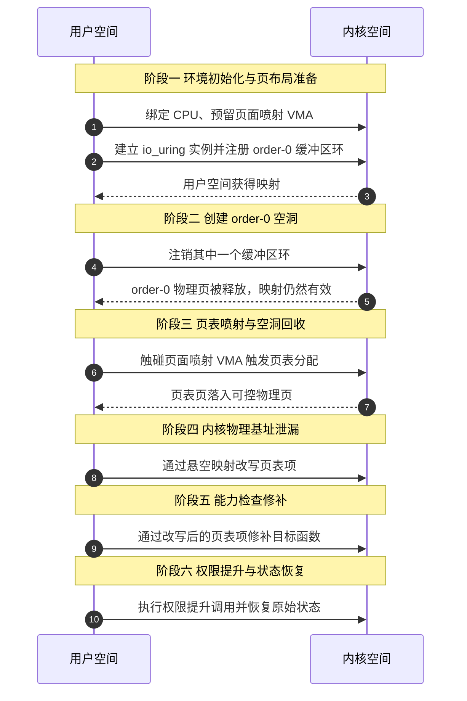
```mermaid
sequenceDiagram
    autonumber
    participant U as 用户空间
    participant K as 内核空间

    Note over U,K: 阶段一 环境初始化与页布局准备
    U->>K: 绑定 CPU、预留页面喷射 VMA
    U->>K: 建立 io_uring 实例并注册 order-0 缓冲区环
    K-->>U: 用户空间获得映射

    Note over U,K: 阶段二 创建 order-0 空洞
    U->>K: 注销其中一个缓冲区环
    K-->>U: order-0 物理页被释放，映射仍然有效

    Note over U,K: 阶段三 页表喷射与空洞回收
    U->>K: 触碰页面喷射 VMA 触发页表分配
    K-->>U: 页表页落入可控物理页

    Note over U,K: 阶段四 内核物理基址泄漏
    U->>K: 通过悬空映射改写页表项

    Note over U,K: 阶段五 能力检查修补
    U->>K: 通过改写后的页表项修补目标函数

    Note over U,K: 阶段六 权限提升与状态恢复
    U->>K: 执行权限提升调用并恢复原始状态
```

各阶段的详细系统调用序列、状态迁移与内核数据结构交互，将在后续章节中逐一展开。在分析具体实现之前，5-2 节先介绍 Dirty Pagetable 的基本原理，为后续阶段提供必要的技术背景。

### 5-2. Dirty Pagetable 原理

Dirty Pagetable 是一种基于数据流的利用技术，其核心思路是利用堆漏洞操纵用户页表，从而获得读写任意物理地址的能力。该技术不依赖控制流劫持，因此能够自然地规避 CFI、KASLR、SMAP/PAN 等主流保护机制，并且在最新内核上仍然有效。本节从基本思想、核心步骤、技术优势、挑战与应对、缓解措施以及与其他利用思路的关系六个方面，系统阐述其原理。

#### 5-2-1. 基本思想

在 x86-64 架构下，虚拟地址到物理地址的转换通过四级页表完成。以 4 KB 页面为例，48 位虚拟地址被划分为五个部分：

```
 47       39 38       30 29       21 20       12 11        0
+-----------+-----------+-----------+-----------+-----------+
| PML4 索引 | PDPT 索引 | PD 索引   | PT 索引   | 页内偏移  |
+-----------+-----------+-----------+-----------+-----------+
    9 位        9 位        9 位        9 位        12 位
```

每一级页表都包含 512 个表项，每个表项为 8 字节。其中，第四级（PML4）、第三级（PDPT）和第二级（PD）的页表项既可以指向下一级页表，也可以指向一个 2 MB 或 1 GB 的大页。只有第一级页表（PT）的页表项（PTE）直接指向 4 KB 物理页帧。Dirty Pagetable 操纵的是第一级页表中的 PTE，因此该级页表被称为“最后一级页表”。

x86-64 架构下的 PTE 格式如下：

```c
// x86-64 PTE 的位域定义（简化）
typedef struct {
    uint64_t present    : 1;   // 存在位，1 表示有效
    uint64_t rw         : 1;   // 读写位，1 表示可写
    uint64_t user       : 1;   // 用户位，1 表示用户态可访问
    uint64_t pwt        : 1;   // 写通位
    uint64_t pcd        : 1;   // 缓存禁用位
    uint64_t accessed   : 1;   // 访问位
    uint64_t dirty      : 1;   // 脏位
    uint64_t pat        : 1;   // 页属性表位
    uint64_t global     : 1;   // 全局位
    uint64_t ignored    : 3;   // 忽略位
    uint64_t pfn        : 40;  // 物理页帧号
    uint64_t reserved   : 11;  // 保留位
    uint64_t nx         : 1;   // 执行禁用位
} pte_t;
```

一个典型的用户可读写 PTE 的值为 `0x80000000_12345667`，其中低 12 位是标志位，高位是物理页帧号。通过修改页帧号部分，即可将该虚拟地址重定向到任意物理页。

页表页本身是 4 KB 的 order-0 物理页，由页分配器直接分配，并不经过 SLUB 缓存。SLUB 分配器位于页分配器之上，为内核对象提供固定大小的内存块。当 SLUB 缓存中的某个 slab 变为空闲时，该 slab 所占用的物理页可以被归还给页分配器。此后，页分配器可以将同一物理页重新分配给其他用途，例如作为用户页表页。

这一机制为 Dirty Pagetable 提供了基础：如果通过堆漏洞将一个 slab 页归还给页分配器，随后内核将同一物理页用作页表页，那么堆漏洞的悬空指针便指向了一个活跃的页表页。此时，通过悬空指针修改页表项，即可建立对任意物理地址的读写能力。

页分配器在分配物理页时，会根据迁移类型将页面归类到不同的空闲区域。页表页通常从不可迁移区域分配，而匿名 `mmap` 分配的物理页通常来自可迁移区域。这一差异在利用过程中需要特别注意，因为直接通过递增原语将 PTE 指向另一用户页表是困难的。后续阶段会介绍通过共享页解决这一问题的方法。

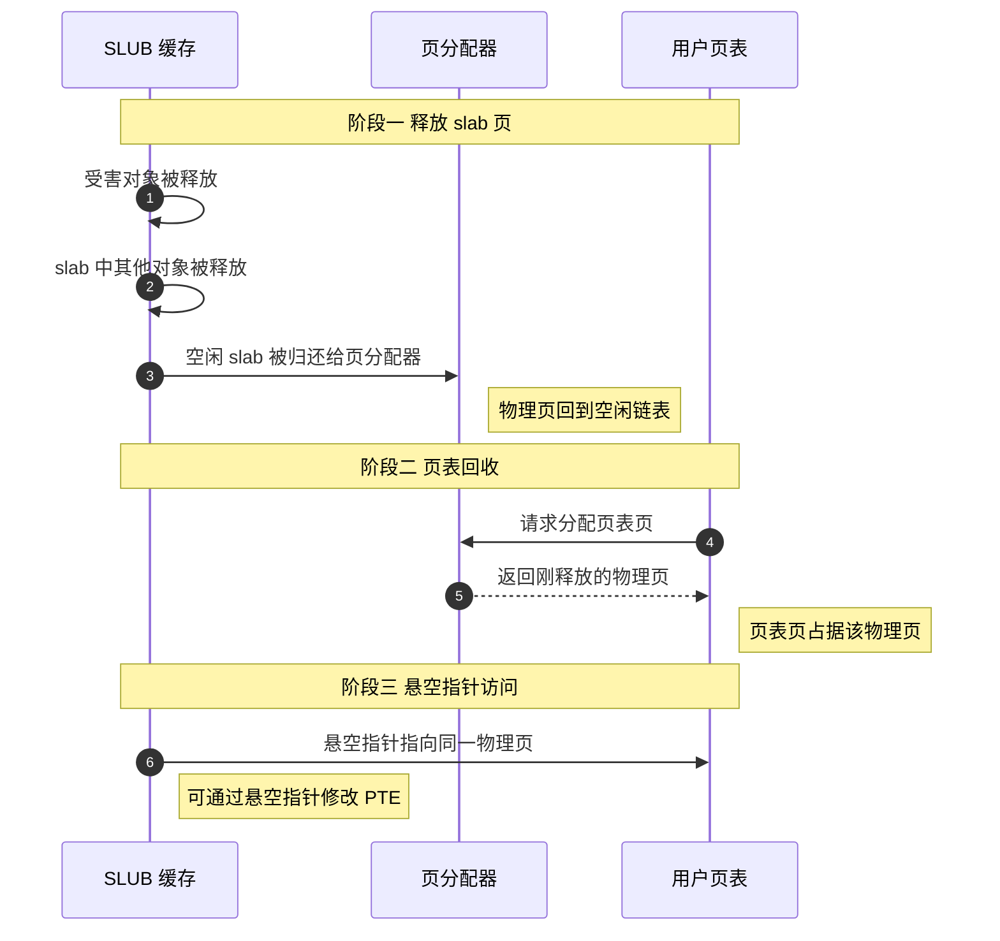
```mermaid
sequenceDiagram
    autonumber
    participant S as SLUB 缓存
    participant P as 页分配器
    participant T as 用户页表

    Note over S,T: 阶段一 释放 slab 页
    S->>S: 受害对象被释放
    S->>S: slab 中其他对象被释放
    S->>P: 空闲 slab 被归还给页分配器
    Note right of P: 物理页回到空闲链表

    Note over S,T: 阶段二 页表回收
    T->>P: 请求分配页表页
    P-->>T: 返回刚释放的物理页
    Note right of T: 页表页占据该物理页

    Note over S,T: 阶段三 悬空指针访问
    S->>T: 悬空指针指向同一物理页
    Note right of S: 可通过悬空指针修改 PTE
```

#### 5-2-2. 核心步骤

Dirty Pagetable 的典型流程可概括为以下五个步骤，每一步都配有简化的代码示意，以帮助理解其操作逻辑。

**步骤一：触发释放后重用，将受害 slab 归还给页分配器。** 通过堆漏洞释放一个受害对象，该对象所在的 slab 称为受害 slab。随后释放该 slab 中所有其他对象，使 slab 变为空闲。在合适的时机下，空闲 slab 会被页分配器回收。

```c
// 伪代码：将受害 slab 归还给页分配器
trigger_uaf();                     // 触发漏洞，释放受害对象
free_all_objects_in_slab();        // 释放受害 slab 中的其他对象
// 此时受害 slab 变为空闲，等待页分配器回收
```

为了让这一过程稳定发生，通常需要采用跨缓存利用技术。跨缓存利用的核心思想是：通过大量分配和释放同尺寸对象，促使 SLUB 缓存中的空闲 slab 数量超过阈值，从而触发页分配器回收空闲 slab。在跨缓存利用中，需要精确控制对象的分配与释放顺序，以确保目标 slab 被回收而非其他 slab。

**步骤二：用用户页表占据受害 slab。** 用户页表直接从页分配器分配，因此可以通过大量分配用户页表来尝试占据刚刚释放的物理页。注意使用的是最后一级页表，因为只有该级页表的 PTE 直接指向物理页帧。

```c
// 伪代码：分配大量用户页表以占据受害 slab
for (int i = 0; i < SPRAY_COUNT; i++) {
    void *addr = mmap(NULL, 2 * 1024 * 1024, PROT_READ | PROT_WRITE,
                      MAP_PRIVATE | MAP_ANONYMOUS, -1, 0);
    // 首次写入触发页表分配
    *(volatile char *)addr = 0xaa;
}
```

每个 2 MB 的虚拟内存窗口对应一个最后一级页表页。通过遍历整个喷射区域并写入标记数据，可以强制内核为每个窗口分配页表页。当页分配器收到页表分配请求时，阶段一释放的物理页会被返回，后续分配的页表页将落入该物理页中。

**步骤三：构造操纵页表项的原语。** 根据漏洞类型的不同，可以构造不同的原语来修改页表项。例如，对于双重释放漏洞，可以通过控制空闲链表来构造写原语；对于文件释放后重用或 pid 释放后重用漏洞，可以通过递增引用计数等操作构造递增原语。

```c
// 伪代码：利用悬空指针修改页表项
pte_t *pte = (pte_t *)dangling_pointer;  // 悬空指针指向页表页
pte->pfn = target_pfn;                   // 修改物理页帧号
pte->present = 1;                        // 确保存在位有效
pte->rw = 1;                             // 确保可写
pte->user = 1;                           // 确保用户态可访问
```

构造原语是 Dirty Pagetable 中最具挑战性的环节。不同的漏洞类型提供不同的操作能力：双重释放漏洞可以控制空闲链表，从而构造任意地址写原语；引用计数递增漏洞可以构造递增原语，通过大量递增操作逐步修改 PTE 的值。无论哪种原语，其目标都是能够修改页表项中的物理页帧号或标志位。

**步骤四：修改页表项以修补内核。** 获得操纵页表项的能力后，将页表项的目标物理地址设置为内核代码段或数据段的物理地址，即可通过对应的用户虚拟地址读写内核内存。

```c
// 伪代码：将用户虚拟地址映射到内核物理页
void *user_addr = find_corresponding_user_addr(pte);
pte->pfn = kernel_phys_addr >> 12;       // 内核物理地址的页帧号
flush_tlb(user_addr);                    // 刷新 TLB
// 此后 user_addr 指向内核物理页，可直接读写
patch_kernel_function(user_addr, ...);
```

在修补内核之前，需要先定位目标 PTE 所对应的用户虚拟地址。这可以通过遍历喷射区域并观察哪个虚拟地址的内容发生了变化来实现：当 PTE 被修改后，其对应的虚拟地址将不再返回原始标记数据，而是返回新映射物理页的内容。

**步骤五：完成权限提升。** 在内核关键路径被修补后，调用相应的系统调用即可完成权限提升。

```c
// 伪代码：调用系统调用完成权限提升
setresuid(0, 0, 0);
setresgid(0, 0, 0);
// 若权限检查函数已被修补，当前进程即获得 root 权限
```

提升完成后，通常需要将修补过的内核代码与页表项恢复原状，以避免对系统后续运行造成影响。恢复操作包括将原始指令字节写回目标函数入口，以及将页表项恢复为原始值。

#### 5-2-3. 技术优势

Dirty Pagetable 相比传统的内核利用方法具有以下优势。

**数据流利用，天然规避控制流保护。** 该技术不修改函数指针、不劫持控制流，而是通过修改页表项建立任意物理地址映射，因此对 CFI 等控制流完整性保护天然免疫。这一特性使得利用方案在各种内核配置下都具有较高的稳定性。

**不依赖内核地址泄漏。** 页表项本身就可以被直接修改，因此无需预先泄漏内核基址。即使 KASLR 开启，也可以通过页表项将用户虚拟地址映射到目标物理页，再通过读取内容推导内核基址。例如，可以将 PTE 指向内核早期启动阶段建立的锚点页表页，读取其内容后减去固定偏移量，即可得到内核物理基址。

**适用于最新内核。** 与已被缓解的 KSMA 等技术相比，Dirty Pagetable 在最新内核上仍然有效，能够达到相同的利用效果。这使其成为当前内核利用领域的重要技术之一。

**可提升多种堆漏洞的利用质量。** 许多内存破坏漏洞原本只能用于针对只读二进制文件或库的页缓存，在 Android 等平台上难以完成完整的权限提升。Dirty Pagetable 可以将这些堆漏洞直接用于操纵内核页表，从而更便捷地完成权限提升，并有助于突破容器或沙箱限制。

#### 5-2-4. 挑战与应对

在实际利用中，Dirty Pagetable 面临两个主要挑战。

**刷新 TLB 与页表缓存。** 修改页表项后，必须刷新 TLB 与页表缓存才能使修改生效。在 x86-64 架构上，可以通过 `mprotect()` 在读写权限之间切换，强制内核刷新对应范围的 TLB。

```c
// 通过 mprotect 切换权限刷新 TLB
mprotect(user_addr, PAGE_SIZE, PROT_READ);
mprotect(user_addr, PAGE_SIZE, PROT_READ | PROT_WRITE);
// 此后对 user_addr 的访问将使用新的页表项
```

在 ARM64 等架构上，MMU 使用多级缓存，包括 TLB 和专用页表缓存。可以利用已知的侧信道方法可靠地刷新这些缓存，确保后续访问使用的是修改后的页表项。

**防止权限提升期间对页表的意外操作。** 两类意外操作可能发生。其一，在分配大量最后一级页表时，可能同时分配非最后一级页表，导致受害 slab 被非最后一级页表占据。为避免这一问题，应在堆喷最后一级页表之前，先触发非最后一级页表的分配。其二，内核可能将页表项对应的物理页换出，使页表项变为非法，进而导致访问时发生内核错误。为避免这一问题，可以使用 `mlock()` 将对应虚拟地址锁定在内存中。

```c
// 使用 mlock 锁定页表项对应的虚拟地址
mlock(user_addr, PAGE_SIZE);
```

#### 5-2-5. 缓解措施

针对 Dirty Pagetable，可以从多个层面进行缓解。

**内核物理地址随机化。** 该措施可以略微增加利用难度，因为无法直接获知内核的精确物理地址。然而，利用者仍可以选择破坏其他内核堆数据来完成权限提升，而不需要绕过物理地址随机化。

**将用户页表设为只读。** 这一措施可以有效阻止直接操纵用户页表。但内核在修改页表时需要额外工作，可能带来一定的性能开销。此外，在某些架构上，硬件可能不支持对页表页的只读保护，或者实现复杂度较高。

**使用 hypervisor 或 TrustZone 保护关键内存。** 通过虚拟化或安全世界技术将内核代码段及其他关键内存区域设为只读，可以有效阻止 Dirty Pagetable 对这些区域的修改。这一措施需要硬件支持，并且可能引入额外的上下文切换开销。

#### 5-2-6. 与其它利用思路的关系

Dirty Pagetable 与思路一、思路二形成互补。思路一通过篡改单个内核对象的字段完成权限提升，利用面较窄，但实现简单；思路二通过构造任意物理读写原语完成权限提升，能力更强，但仍需依赖对特定对象的操纵；Dirty Pagetable 则直接作用于页表结构，获得的是对任意物理地址的映射能力，利用面最广，且不依赖特定对象布局。三者共同覆盖了从单对象篡改到全地址空间映射的完整利用谱系。

从技术演进的角度看，Dirty Pagetable 代表了内核利用从控制流劫持向数据流操纵转变的趋势。随着控制流完整性保护、地址空间随机化等机制的不断完善，传统利用方法的生存空间被逐渐压缩，而 Dirty Pagetable 这类直接操纵页表的数据流技术则展现出更强的适应能力。理解其原理，对于分析现代内核漏洞的利用方式与设计相应的防御措施，都具有重要意义。

### 5-3. 阶段一：环境初始化与页布局准备

在理解了 Dirty Pagetable 的基本原理后，下面结合 **CVE-2024-0582** 的具体场景，逐步分析本方案的实现过程。环境初始化阶段的目标与思路一、思路二相似，即建立稳定的物理页布局基础，并为后续的页表喷射预留必要的用户空间资源。利用者首先将当前进程绑定到单一 CPU 核心，使 SLUB 的每 CPU 空闲链表在整个利用过程中保持一致，避免因跨核分配导致页布局偏移。随后，利用者预先保留一批页面喷射 VMA，这些 VMA 在此阶段仅完成地址空间预留，尚未触发任何页表分配，因此不会消耗物理页。

接着，通过 `io_uring_setup()` 创建 io_uring 实例，并以 `IORING_REGISTER_PBUF_RING` 配合 `IOU_PBUF_RING_MMAP` 标志注册大量缓冲区环。每个环恰好占用一个 order-0 页面，通过注册大量这样的环，可以持续消耗 buddy 分配器中的空闲 order-0 页面，为后续的页回收创造有利条件。每个环注册完成后，用户空间通过 `mmap()` 以 `IORING_OFF_PBUF_RING | (bgid << IORING_OFF_PBUF_SHIFT)` 为偏移量将其映射到用户地址空间。内核在 `io_uring_mmap()` 中调用 `remap_pfn_range()` 建立 `VM_PFNMAP` 映射。该映射不增加页引用计数，为后续的释放后重用埋下伏笔。

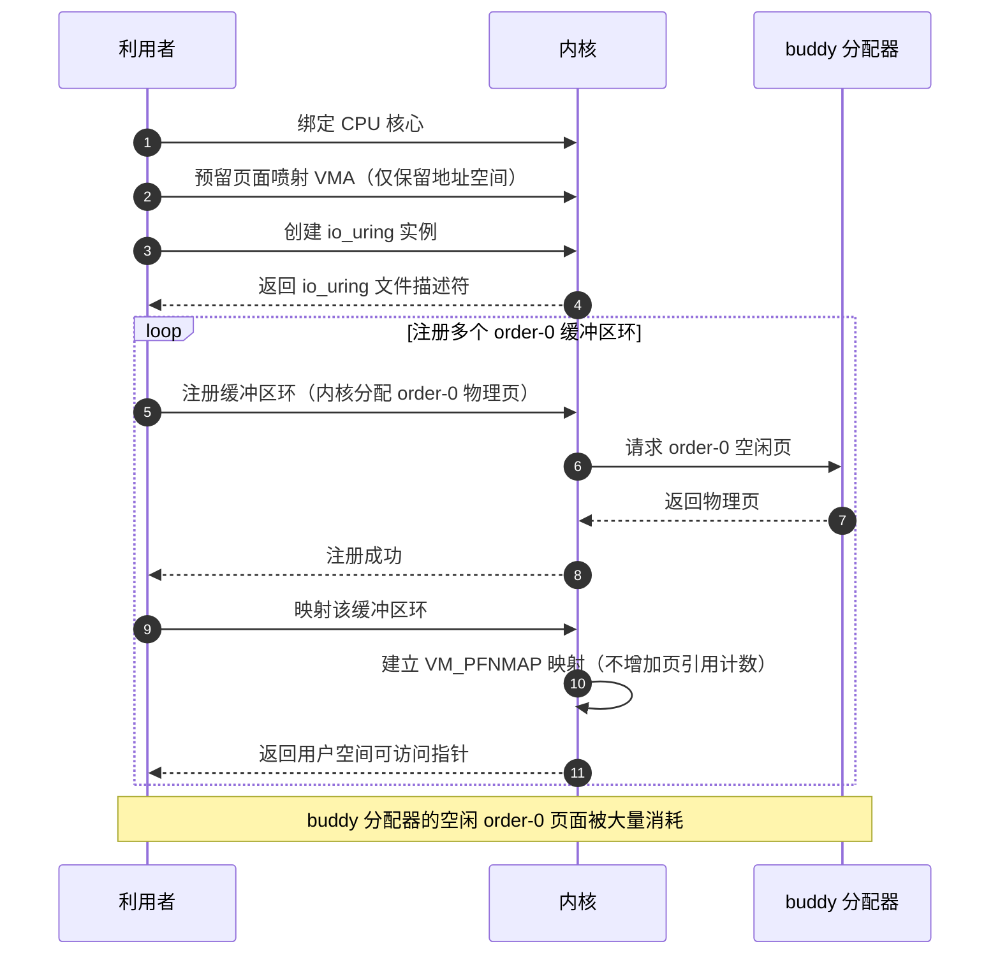
```mermaid
sequenceDiagram
    autonumber
    participant U as 利用者
    participant K as 内核
    participant B as buddy 分配器

    U->>K: 绑定 CPU 核心
    U->>K: 预留页面喷射 VMA（仅保留地址空间）
    U->>K: 创建 io_uring 实例
    K-->>U: 返回 io_uring 文件描述符
    loop 注册多个 order-0 缓冲区环
        U->>K: 注册缓冲区环（内核分配 order-0 物理页）
        K->>B: 请求 order-0 空闲页
        B-->>K: 返回物理页
        K-->>U: 注册成功
        U->>K: 映射该缓冲区环
        K->>K: 建立 VM_PFNMAP 映射（不增加页引用计数）
        K-->>U: 返回用户空间可访问指针
    end
    Note over U,B: buddy 分配器的空闲 order-0 页面被大量消耗
```

### 5-4. 阶段二：创建 order-0 空洞

在大量已注册的缓冲区环中，选择一个环，在保持用户空间映射有效的前提下调用 `io_uring_unregister_buf_ring()`。该操作释放该环对应的 order-0 物理页，使其返回 buddy 分配器的空闲链表，形成一个 order-0 空洞。由于 `VM_PFNMAP` 映射从未增加页引用计数，释放路径中的 `folio_put()` 会无条件将页面归还，而不会检查用户空间映射是否仍然存在。释放完成后，用户空间指针仍然指向该物理页，形成 dangling mapping。

与思路一和思路二制造的 order-0 空洞相比，本方案对这一空洞的用途有所不同：思路一将其回收为 `struct file` 对象，思路二将其回收为管道缓冲区数组，而本方案则将其回收为用户页表页。这一差异决定了后续阶段的操作对象与利用路径。

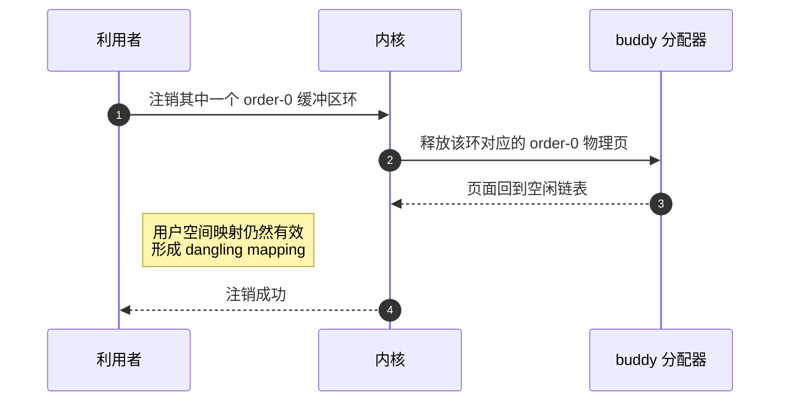
```mermaid
sequenceDiagram
    autonumber
    participant U as 利用者
    participant K as 内核
    participant B as buddy 分配器

    U->>K: 注销其中一个 order-0 缓冲区环
    K->>B: 释放该环对应的 order-0 物理页
    B-->>K: 页面回到空闲链表
    Note right of U: 用户空间映射仍然有效<br/>形成 dangling mapping
    K-->>U: 注销成功
```

### 5-5. 阶段三：页表喷射与空洞回收

阶段三的目标是让阶段二释放的 order-0 空洞被页表分配路径回收为页表页。用户页表页在内核中由页表分配路径按需分配，每个页表页恰好占用一个 order-0 页面。当用户空间首次访问一个尚未建立页表映射的 VMA 时，内核会为该 VMA 所在的 2 MB 窗口分配一个页表页，并将对应的 PTE 填入其中。

利用者在阶段一预留的页面喷射 VMA 上执行写操作，强制内核为每个 VMA 分配页表页。当页表分配路径向 buddy 分配器请求空闲页面时，阶段二释放的 order-0 空洞会被返回，后续分配的页表页将落入该物理页中。此时，悬空映射所指向的物理页已被内核用作页表页，因此用户空间可以通过悬空映射直接读写该页表页中的页表项。

需要强调的是，此阶段仅完成页表页的分配与空洞回收，尚未确定悬空映射具体对应哪一个页表页，也未建立该页表页与其所服务的用户 VMA 之间的对应关系。这些定位工作将在下一阶段通过改写页表项并观察用户页面内容的变化来完成。

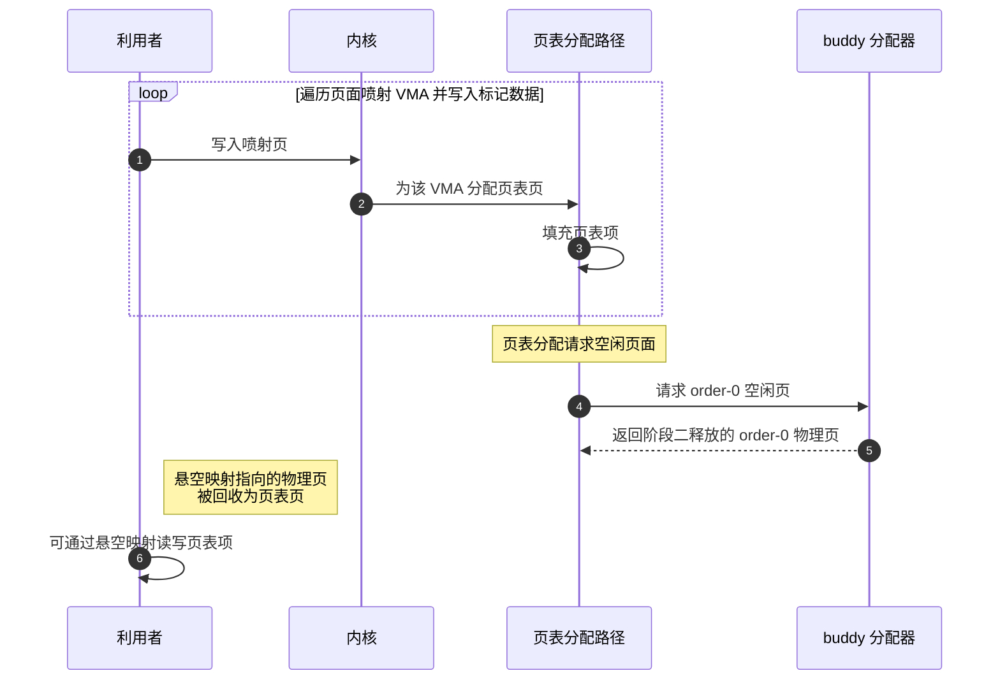
```mermaid
sequenceDiagram
    autonumber
    participant U as 利用者
    participant K as 内核
    participant P as 页表分配路径
    participant B as buddy 分配器

    loop 遍历页面喷射 VMA 并写入标记数据
        U->>K: 写入喷射页
        K->>P: 为该 VMA 分配页表页
        P->>P: 填充页表项
    end
    Note over P: 页表分配请求空闲页面
    P->>B: 请求 order-0 空闲页
    B-->>P: 返回阶段二释放的 order-0 物理页
    Note right of U: 悬空映射指向的物理页<br/>被回收为页表页
    U->>U: 可通过悬空映射读写页表项
```

### 5-6. 阶段四：内核物理基址泄漏

阶段四的目标是利用悬空映射对页表页的读写能力，构造出对任意物理地址的映射，并据此泄漏内核物理基址。

利用者首先通过悬空映射读取页表页的内容，保存第 7 个页表项（PTE[7]）的原始值。随后，将 PTE[7] 改写为指向物理地址 `0x9c000` 的锚点页表项。该物理地址处存放着内核早期启动阶段建立的页表页，其第一个四字（qword）是一个页表项，目标物理地址为内核物理基址加上固定偏移。

改写完成后，利用者通过 `mprotect()` 在读写权限之间切换，强制刷新该 VMA 的 TLB，使改写生效。随后，利用者遍历所有喷射的 VMA 页面，寻找第一个内容不再是标记数据的页面。由于 PTE[7] 已被改写，该页表项所映射的虚拟页现在指向物理地址 `0x9c000`，因此其内容不再是原先写入的标记，而是锚点页表页的内容。找到该页面后，即可确定被改写的 PTE 所对应的用户虚拟页（记为 `overlap_page`），并建立悬空映射、页表页与用户 VMA 之间的对应关系。

读取 `overlap_page` 的内容即可获得锚点页表项的值。利用者将该值与页帧掩码相与，清除标志位，再减去锚点偏移量，即可得到内核物理基址的候选值。为了消除 KASLR 对物理基址的随机化影响，利用者将结果按 2 MB 边界对齐。KASLR 对内核物理基址的随机化粒度为 2 MB，因此内核物理基址的低 21 位始终为零。利用者使用的锚点偏移量是在 KASLR 禁用布局下校准的，在 KASLR 启用布局下会存在一个小幅正向偏差。将对齐操作应用于推导结果，可以吸收这一偏差，从而无需针对每种 KASLR 配置重新校准锚点偏移量。若对齐结果低于内核物理基址的最小值，则回退到默认物理基址。

```mermaid
sequenceDiagram
    autonumber
    participant U as 利用者
    participant K as 内核
    participant M as 物理内存

    U->>U: 通过悬空映射读取页表页，保存原始 PTE[7]
    U->>K: 通过悬空映射将 PTE[7] 改写为锚点值
    K->>M: PTE[7] 指向物理地址 0x9c000
    U->>K: 通过 mprotect 切换权限刷新 TLB
    U->>U: 遍历喷射页，寻找标记失效的页面
    U->>U: 定位 overlap_page，读取锚点页表项
    U->>U: 减去锚点偏移量并按 2 MB 对齐
    U->>U: 确认内核物理基址
    Note over U,M: 全程不依赖预先泄漏的地址
```

### 5-7. 阶段五：能力检查修补

阶段五的目标是利用页表项改写能力，将内核中某一能力检查函数的物理页映射到用户空间，并修改其指令使其始终返回成功。该函数为 `ns_capable_setid`，负责校验调用者是否具备 `CAP_SETUID` 与 `CAP_SETGID` 能力，修补后即可绕过后续的权限检查。

利用者首先根据目标函数在内核镜像中的链接时虚拟地址计算其在运行时的物理地址。由于该函数相对于内核基址的偏移在编译时即已确定，且不受 KASLR 影响，因此只需将偏移量加上阶段四推导出的内核物理基址即可。随后，利用者构造一个页表项，将其指向包含该函数的物理页，并将该页表项写入 PTE[7]。刷新 TLB 后，`overlap_page` 所指向的虚拟页即映射到目标函数的物理页，利用者可以直接读取和修改其内容。

利用者将目标函数的入口指令保存到备份缓冲区，随后将入口处的原始指令替换为一段始终返回成功的指令序列：`endbr64; mov rax, 1; ret`。整个修补过程仅涉及指令字节的修改，不触碰函数指针，不劫持控制流。因此，即使内核启用了 CFI 等控制流完整性保护，也不会对这一阶段的修补产生阻碍。

```mermaid
sequenceDiagram
    autonumber
    participant U as 利用者
    participant K as 内核
    participant M as 物理内存

    U->>U: 根据内核物理基址计算目标函数物理地址
    U->>K: 通过悬空映射将 PTE[7] 指向目标物理页
    K->>M: 目标函数物理页映射到用户 VMA
    U->>K: 通过 mprotect 切换权限刷新 TLB
    U->>U: 保存目标函数入口处的原始指令
    U->>K: 替换入口指令为始终返回成功的序列
    K->>M: 函数始终返回成功
    Note over U,M: 仅修改指令字节，不触碰函数指针
```

### 5-8. 阶段六：权限提升与状态恢复

阶段六的目标是利用已修补的能力检查函数完成权限提升，并在提升完成后将内核状态恢复至原始状态。

利用者调用 `setresuid(0, 0, 0)` 与 `setresgid(0, 0, 0)`。由于目标能力检查函数已被修补为始终返回成功，系统调用中的能力校验环节被绕过，当前进程的凭证随之被提升为 root。利用者通过 `getuid()` 确认权限提升成功后，立即将先前保存的原始指令字节写回目标函数入口，并通过悬空映射将 PTE[7] 恢复为原始值。通过 `mprotect()` 切换权限刷新 TLB 后，用户 VMA 的映射恢复至原始物理页，内核中不再残留任何被修改的痕迹。

至此，清理路径可以安全地释放 io_uring 实例与所有预留的 VMA。整个利用过程中修改的内核状态已被完全恢复，不会对系统的后续运行产生持续影响。

```mermaid
sequenceDiagram
    autonumber
    participant U as 利用者
    participant K as 内核

    U->>K: 调用 setresuid(0, 0, 0) 与 setresgid(0, 0, 0)
    K->>K: 能力检查被绕过，凭证提升
    K-->>U: 权限提升成功
    U->>U: 确认当前进程已具备 root 权限
    U->>K: 写回目标函数入口处的原始指令
    U->>K: 通过悬空映射恢复 PTE[7]
    K->>K: 通过 mprotect 切换权限刷新 TLB
    K->>K: 内核状态恢复至原始状态
    Note over U,K: 清理路径可安全执行
```

### 5-9. 内核保护机制的应对策略

现代内核通常启用多种安全机制，这些机制分别从地址空间随机化、执行权限隔离、内存分配隔离、堆元数据保护、控制流完整性以及内核与用户态数据交换边界等维度，对潜在的内存破坏行为进行防御。本方案在设计之初便充分考量了这些保护机制的影响，并针对性地选择了相应的技术路径。

| 保护机制                             | 机制原理                                                               | 本方案应对策略                                                                                                                             |
| ------------------------------------ | ---------------------------------------------------------------------- | ------------------------------------------------------------------------------------------------------------------------------------------ |
| **KASLR**                            | 随机化内核代码段、数据段和模块的加载基址。                             | 通过改写页表项指向物理地址 `0x9c000` 的锚点页表页，从锚点页表项推导内核物理基址，并按 2 MB 边界对齐消除 KASLR 偏差，不依赖预先泄漏的地址。 |
| **SMEP / SMAP**                      | SMEP 阻止内核态执行用户态代码；SMAP 阻止内核态访问用户态数据。         | 不执行内核代码，通过改写页表项将目标物理页映射到用户空间，执行完全在用户态进行。                                                           |
| **KPTI**                             | 分离内核页表与用户页表，使用户态页表不包含内核映射。                   | 通过改写用户页表中的页表项实现物理页映射，不依赖用户态直接访问内核页表。                                                                   |
| **CFI**                              | 校验间接函数调用与跳转目标，防止控制流劫持。                           | 本方案采用指令字节修补，不修改函数指针，不劫持控制流，因此 CFI 无法阻断此类利用。                                                          |
| **CONFIG_MEMCG / CONFIG_MEMCG_KMEM** | 为受控进程创建独立的 `kmalloc-cg-*` 缓存，与普通 `kmalloc-*` 隔离。    | 本方案的目标对象为页表页，该机制不影响页级布局操作。核心依赖的是物理页面的释放与再分配时序。                                               |
| **CONFIG_SLAB_FREELIST_RANDOM**      | 随机化 SLUB 空闲链表中的对象顺序，增加同一 slab 内分配顺序的预测难度。 | 该机制作用于 SLUB 分配器内部，不影响页级布局。方案核心依赖的是物理页面的释放与再分配时序。                                                 |
| **CONFIG_SLAB_FREELIST_HARDENED**    | 对空闲链表指针进行异或混淆，防止通过覆写指针实现任意分配。             | 基于页级布局，不依赖空闲链表指针覆写，该保护不构成影响。                                                                                   |
| **CONFIG_HARDENED_USERCOPY**         | 在 `copy_to_user()` / `copy_from_user()` 路径中增加边界检查。          | 数据读写发生在页表页路径中，不经过用户态拷贝接口的边界检查，检查机制无法覆盖。                                                             |

整体而言，本方案通过数据导向路径、页级布局与页表页路径等设计选择，有效规避了上述保护机制。与思路一和思路二相比，本方案的权限提升路径更为底层，直接作用于页表结构，因此在面对不同文件系统、不同发行版配置时具有更好的通用性。

### 5-10. 前提条件与局限性

**前提条件**：

- 目标内核启用 `CONFIG_IO_URING`，这是使用 io_uring 接口的前提。
- 目标内核版本处于受影响范围内，即 Linux 6.4 至 6.6.4 以及 6.7-rc1 至 6.7-rc3。
- 当前进程具备执行 `io_uring_setup()`、`io_uring_register()`、`mmap()` 与 `mprotect()` 的权限。在大多数发行版中，未特权用户即可使用这些基础功能。
- 目标内核的页表布局与页表项编码需要与方案假设的布局一致。通过预先构建覆盖多种内核版本的布局描述，可以在不依赖完整内核基址的前提下完成定位，从而提升方案的通用性。

**局限性**：

- 方案依赖 order-0 物理页的释放与再分配时序，在多核高负载环境下成功率可能下降。通过 CPU 绑定可以显著缓解这一问题，但无法完全消除环境噪声的影响。
- 页表喷射阶段需要预留并触碰大量 VMA，在内存受限的系统上可能受到 VMA 数量上限的约束。
- 能力检查修补阶段依赖于目标函数在内核镜像中的链接时偏移。若目标内核的函数布局与方案假设不一致，需要针对该内核版本重新适配偏移信息。

### 5-11. 章节总结

本方案以 **CVE-2024-0582** 提供的页级释放后重用原语为起点，通过释放 order-0 缓冲区环制造空洞，再将用户页表页重新分配至该空洞，最终获得对页表项的直接改写能力。利用该能力，方案完成了内核物理基址泄漏、能力检查修补与权限提升，并在提升完成后恢复了内核的原始状态。

与思路一和思路二相比，本方案的权限提升路径更为底层，直接作用于页表结构，不依赖于对特定文件权限字段或进程凭证的修改，因此在面对不同文件系统、不同发行版配置时具有更好的通用性。同时，方案采用数据导向路径，对 KASLR、SMEP/SMAP、KPTI、CFI 等主流内核保护机制具备良好的规避能力。

从整体上看，该方案展示了页级释放后重用漏洞在 Dirty Pagetable 方向上的典型思路：以物理页为操作单元，以页表页为原语载体，以页表项改写为定位手段，最终以能力检查修补为提升目标。这一思路与思路一、思路二形成互补，共同覆盖了从单对象篡改到全地址空间映射的完整利用谱系。

### 5-12. 测试结果

<div style="text-align: center; margin: 2rem 0;">
  
</div>

## 6. 漏洞修复

### 6-1. 修复补丁概述

**CVE-2024-0582** 的修复由 Jens Axboe 于 2023 年 11 月 27 日提交，commit 号为 `c392cbecd8eca4c53f2bf508731257d9d0a21c2d`，标题为 `io_uring/kbuf: defer release of mapped buffer rings`。该提交于次日合并入上游，并随后被回溯至 6.6.y 稳定分支。

补丁的出发点在于：当提供缓冲区环以 `IOU_PBUF_RING_MMAP` 标志注册时，内核负责为其分配内存，应用随后对该内存执行 `mmap(2)`。然而，io_uring 的映射路径使用 `remap_pfn_range()`，该接口建立的映射不增加页引用计数，因此内核不能依赖常规的 `munmap`/`release` 路径来释放这些内存。这一语义错位正是漏洞的根因所在。

针对这一问题，补丁采取的策略是为每个由内核分配的缓冲区环保存一个 `io_buf_free` 条目，并提供一个辅助函数，在 `->release()` 之后统一释放这些内存。其核心思想是“延迟释放”：注销缓冲区环时不再立即释放物理页，而是将释放时机推迟到 io_uring 上下文销毁阶段，此时对 io_uring 设备文件的引用已归零，用户空间映射不可能存在。

补丁涉及四个文件，共 46 行新增、5 行删除：

- `include/linux/io_uring_types.h`：在 `io_ring_ctx` 中新增 `io_buf_list` 链表。
- `io_uring/io_uring.c`：初始化链表，并在上下文销毁时调用释放函数。
- `io_uring/kbuf.c`：定义 `io_buf_free` 结构体，调整分配与注销路径，新增 `io_kbuf_mmap_list_free()`。
- `io_uring/kbuf.h`：声明 `io_kbuf_mmap_list_free()`。

从整体结构看，补丁围绕“记录—推迟—释放”三个环节展开：分配时将缓冲区环登记到 `io_buf_list`；注销时仅清理 `io_buffer_list` 的状态字段，不触及物理页；上下文销毁时统一释放链表中的全部条目。这一结构从根本上消除了注销路径中物理页提前释放的条件，切断了 **CVE-2024-0582** 的触发链。

### 6-2. 补丁的技术分析

#### 6-2-1. 上下文中新增延迟释放链表

修复首先在 `io_ring_ctx` 结构体中新增了一个延迟释放链表，用于记录所有由内核分配、需要通过 `mmap` 映射的缓冲区环。该链表受 `->uring_lock` 保护，定义在 `include/linux/io_uring_types.h` 中。

```diff
diff --git a/include/linux/io_uring_types.h b/include/linux/io_uring_types.h
index d3009d56af0ba..805bb635cdf55 100644
--- a/include/linux/io_uring_types.h
+++ b/include/linux/io_uring_types.h
@@ -340,6 +340,9 @@ struct io_ring_ctx {

 	struct list_head	io_buffers_cache;

+	/* deferred free list, protected by ->uring_lock */
+	struct hlist_head	io_buf_list;
+
 	/* Keep this last, we don't need it for the fast path */
 	struct wait_queue_head		poll_wq;
 	struct io_restriction		restrictions;
diff --git a/io_uring/io_uring.c b/io_uring/io_uring.c
index e40b114382104..3a216f0744dd6 100644
--- a/io_uring/io_uring.c
+++ b/io_uring/io_uring.c
@@ -325,6 +325,7 @@ static __cold struct io_ring_ctx *io_ring_ctx_alloc(struct io_uring_params *p)
 	INIT_LIST_HEAD(&ctx->sqd_list);
 	INIT_LIST_HEAD(&ctx->cq_overflow_list);
 	INIT_LIST_HEAD(&ctx->io_buffers_cache);
+	INIT_HLIST_HEAD(&ctx->io_buf_list);
 	io_alloc_cache_init(&ctx->rsrc_node_cache, IO_NODE_ALLOC_CACHE_MAX,
 			    sizeof(struct io_rsrc_node));
 	io_alloc_cache_init(&ctx->apoll_cache, IO_ALLOC_CACHE_MAX,
@@ -2950,6 +2951,7 @@ static __cold void io_ring_ctx_free(struct io_ring_ctx *ctx)
 		ctx->mm_account = NULL;
 	}
 	io_rings_free(ctx);
+	io_kbuf_mmap_list_free(ctx);

 	percpu_ref_exit(&ctx->refs);
 	free_uid(ctx->user);
```

在上下文结构体中新增 `io_buf_list` 字段，类型为 `hlist_head`，作为延迟释放链表的头节点。该链表在 `io_ring_ctx_alloc()` 中通过 `INIT_HLIST_HEAD()` 初始化，确保上下文创建后链表即处于可用状态。

与此对应，`io_ring_ctx_free()` 中新增了对 `io_kbuf_mmap_list_free()` 的调用。该函数位于 `io_rings_free()` 之后，此时 io_uring 的环结构已被释放，但上下文的引用计数尚未完全退出。这一调用位置的选择至关重要：此时对 io_uring 设备文件的引用已降为 0，用户空间不可能再持有任何有效的缓冲区环映射，因此可以安全地释放这些页面。

#### 6-2-2. 延迟释放链表节点的定义

在 `io_uring/kbuf.c` 中，修复新增了一个轻量级的链表节点结构体 `io_buf_free`，用于记录待释放的缓冲区环信息。

```diff
diff --git a/io_uring/kbuf.c b/io_uring/kbuf.c
index a1e4239c7d75d..85e680fc74ce2 100644
--- a/io_uring/kbuf.c
+++ b/io_uring/kbuf.c
@@ -33,6 +33,11 @@ struct io_provide_buf {
 	__u16				bid;
 };

+struct io_buf_free {
+	struct hlist_node		list;
+	void				*mem;
+};
+
 static inline struct io_buffer_list *io_buffer_get_list(struct io_ring_ctx *ctx,
 							unsigned int bgid)
 {
```

`io_buf_free` 结构体包含两个字段：`list` 为链表节点，用于挂入 `io_buf_list`；`mem` 为缓冲区环的内存指针。该结构体的设计极为精简，仅记录释放所需的最少信息，避免引入额外的内存开销。

#### 6-2-3. 注销路径的行为调整

修复的核心变更位于 `__io_remove_buffers()` 函数中。在注销缓冲区环时，内核不再直接释放物理页，而是仅清理 `io_buffer_list` 中的状态字段。

```diff
@@ -223,7 +228,10 @@ static int __io_remove_buffers(struct io_ring_ctx *ctx,
 	if (bl->is_mapped) {
 		i = bl->buf_ring->tail - bl->head;
 		if (bl->is_mmap) {
-			folio_put(virt_to_folio(bl->buf_ring));
+			/*
+			 * io_kbuf_list_free() will free the page(s) at
+			 * ->release() time.
+			 */
 			bl->buf_ring = NULL;
 			bl->is_mmap = 0;
 		} else if (bl->buf_nr_pages) {
```

原代码在 `is_mmap` 为 1 时调用 `folio_put(virt_to_folio(bl->buf_ring))`，将物理页立即归还给 buddy 分配器。修复后，这一调用被移除，取而代之的是一条注释，说明释放工作将由 `io_kbuf_list_free()` 在 `->release()` 时执行。`bl->buf_ring` 被置为 NULL，`bl->is_mmap` 被置为 0，仅完成状态清理，不触及物理页。

这一变更切断了漏洞触发链的关键环节：在用户空间映射仍然有效的情况下，物理页不再被释放，因此不存在 dangling page，后续任何通过用户空间指针的访问都指向仍然由内核持有的有效页面。

#### 6-2-4. 分配路径的登记逻辑

与注销路径的变更相对应，分配路径 `io_alloc_pbuf_ring()` 也进行了调整，在分配物理页后，将对应的 `io_buf_free` 节点登记到 `io_buf_list` 中。

```diff
@@ -531,18 +539,28 @@ error_unpin:
 	return -EINVAL;
 }

-static int io_alloc_pbuf_ring(struct io_uring_buf_reg *reg,
+static int io_alloc_pbuf_ring(struct io_ring_ctx *ctx,
+			      struct io_uring_buf_reg *reg,
 			      struct io_buffer_list *bl)
 {
-	gfp_t gfp = GFP_KERNEL_ACCOUNT | __GFP_ZERO | __GFP_NOWARN | __GFP_COMP;
+	struct io_buf_free *ibf;
 	size_t ring_size;
 	void *ptr;

 	ring_size = reg->ring_entries * sizeof(struct io_uring_buf_ring);
-	ptr = (void *) __get_free_pages(gfp, get_order(ring_size));
+	ptr = io_mem_alloc(ring_size);
 	if (!ptr)
 		return -ENOMEM;

+	/* Allocate and store deferred free entry */
+	ibf = kmalloc(sizeof(*ibf), GFP_KERNEL_ACCOUNT);
+	if (!ibf) {
+		io_mem_free(ptr);
+		return -ENOMEM;
+	}
+	ibf->mem = ptr;
+	hlist_add_head(&ibf->list, &ctx->io_buf_list);
+
 	bl->buf_ring = ptr;
 	bl->is_mapped = 1;
 	bl->is_mmap = 1;
@@ -599,7 +617,7 @@ int io_register_pbuf_ring(struct io_ring_ctx *ctx, void __user *arg)
 	if (!(reg.flags & IOU_PBUF_RING_MMAP))
 		ret = io_pin_pbuf_ring(&reg, bl);
 	else
-		ret = io_alloc_pbuf_ring(&reg, bl);
+		ret = io_alloc_pbuf_ring(ctx, &reg, bl);

 	if (!ret) {
 		bl->nr_entries = reg.ring_entries;
```

变更包含以下几个方面：

函数签名新增 `struct io_ring_ctx *ctx` 参数，以便访问上下文中的 `io_buf_list`。分配方式由原先的 `__get_free_pages(gfp, get_order(ring_size))` 改为 `io_mem_alloc(ring_size)`，后者是 io_uring 内部封装的内存分配接口，负责处理复合页分配与相关标志。分配成功后，通过 `kmalloc(sizeof(*ibf), GFP_KERNEL_ACCOUNT)` 分配一个 `io_buf_free` 节点，将其 `mem` 字段设置为缓冲区环的内存指针，并通过 `hlist_add_head()` 挂入 `ctx->io_buf_list`。

若 `io_buf_free` 节点分配失败，则调用 `io_mem_free(ptr)` 释放已分配的缓冲区环内存并返回 `-ENOMEM`，确保失败路径不产生资源泄漏。调用方 `io_register_pbuf_ring()` 中的调用点同步更新，传入 `ctx` 参数。

通过这一登记逻辑，每一个由内核分配并通过 `mmap` 映射的缓冲区环都在 `io_buf_list` 中留有记录。当上下文最终销毁时，这些记录将成为释放物理页的依据。

#### 6-2-5. 延迟释放的执行函数

修复的最后一部分是在 `io_uring/kbuf.c` 中新增 `io_kbuf_mmap_list_free()` 函数，并在 `io_uring/kbuf.h` 中声明。

```diff
@@ -649,3 +667,19 @@ void *io_pbuf_get_address(struct io_ring_ctx *ctx, unsigned long bgid)

 	return bl->buf_ring;
 }
+
+/*
+ * Called at or after ->release(), free the mmap'ed buffers that we used
+ * for memory mapped provided buffer rings.
+ */
+void io_kbuf_mmap_list_free(struct io_ring_ctx *ctx)
+{
+	struct io_buf_free *ibf;
+	struct hlist_node *tmp;
+
+	hlist_for_each_entry_safe(ibf, tmp, &ctx->io_buf_list, list) {
+		hlist_del(&ibf->list);
+		io_mem_free(ibf->mem);
+		kfree(ibf);
+	}
+}
diff --git a/io_uring/kbuf.h b/io_uring/kbuf.h
index f2d615236b2cb..6c7646e6057cf 100644
--- a/io_uring/kbuf.h
+++ b/io_uring/kbuf.h
@@ -51,6 +51,8 @@ int io_provide_buffers(struct io_kiocb *req, unsigned int issue_flags);
 int io_register_pbuf_ring(struct io_ring_ctx *ctx, void __user *arg);
 int io_unregister_pbuf_ring(struct io_ring_ctx *ctx, void __user *arg);

+void io_kbuf_mmap_list_free(struct io_ring_ctx *ctx);
+
 unsigned int __io_put_kbuf(struct io_kiocb *req, unsigned issue_flags);

 bool io_kbuf_recycle_legacy(struct io_kiocb *req, unsigned issue_flags);
```

`io_kbuf_mmap_list_free()` 函数使用 `hlist_for_each_entry_safe()` 遍历 `ctx->io_buf_list` 中的每一个节点，依次执行三步操作：通过 `hlist_del()` 将节点从链表中移除；通过 `io_mem_free(ibf->mem)` 释放缓冲区环占用的物理页；通过 `kfree(ibf)` 释放链表节点本身。函数通过 `_safe` 后缀的遍历宏实现，允许在遍历过程中安全地删除当前节点。

函数注释明确指出，该函数在 `->release()` 时或之后被调用，此时 io_uring 设备文件的引用已归零，用户空间不可能再持有任何有效的缓冲区环映射。因此，在此刻释放物理页是安全的，不会产生 dangling page，也不会引发释放后重用。`io_uring/kbuf.h` 中同步新增了函数声明，供 `io_uring.c` 中的上下文销毁路径调用。

### 6-3. 漏洞利用链的切断

综合上述分析，修复补丁从以下三个层面切断了 **CVE-2024-0582** 的利用链。

**释放时机的推迟。** 修复前，注销缓冲区环时立即调用 `folio_put()` 释放物理页，而此时用户空间映射仍然有效，形成 dangling page。修复后，注销路径仅清理状态字段，物理页的释放被推迟到 `io_kbuf_mmap_list_free()` 执行时。该函数在 io_uring 上下文销毁阶段被调用，此时对 io_uring 设备文件的引用已归零，用户空间不可能再持有任何有效的缓冲区环映射。释放时机的推迟从根本上消除了 dangling page 的存在条件。

**引用生命周期的一致性。** 修复前，`remap_pfn_range()` 建立的 `VM_PFNMAP` 映射与内核侧的页引用计数完全脱钩，导致内核在释放物理页时无法感知用户空间映射的存在。修复后，`io_buf_list` 成为了物理页生命周期的权威记录：只要 io_uring 上下文存在，缓冲区环的物理页就不会被释放；只有当上下文被完全销毁时，这些页面才会被释放。这一设计使得物理页的生命周期与 io_uring 上下文的生命周期严格一致，消除了引用计数语义的错位。

**用户空间映射的存在性保证。** 修复前，用户空间是否持有缓冲区环映射完全取决于应用是否调用了 `munmap()`，内核对此一无所知。修复后，`io_kbuf_mmap_list_free()` 的调用时机保证了在物理页释放时用户空间映射不可能存在：io_uring 上下文的销毁意味着设备文件的引用已归零，而 io_uring 设备文件正是 `mmap()` 建立映射所依赖的文件对象。文件引用归零意味着所有通过该文件建立的映射都已被撤销，因此用户空间不可能再持有任何有效的缓冲区环映射。

### 6-4. 补丁的演进意义

从内核演进的角度看，该修复体现了 io_uring 子系统在内存生命周期管理方面的一次重要修正。

**从“立即释放”到“延迟释放”的转变。** 修复前的实现采用“立即释放”策略，即在注销操作时直接释放物理页。这一策略在用户空间提供缓冲区的场景下是正确的，因为此时物理页由用户空间提供，内核仅持有对页面的固定引用，注销时解除固定即可。但在内核分配缓冲区并通过 `mmap` 映射的场景下，“立即释放”策略忽视了用户空间映射的存在，导致了释放后重用。修复采用“延迟释放”策略，将物理页的释放推迟到上下文的销毁阶段，从而将物理页的生命周期与用户空间映射的存在性严格绑定。

**链表记录与批量释放的设计。** 修复没有选择在注销时检查用户空间映射是否存在，而是选择在分配时记录、在上下文销毁时批量释放。这一设计选择的原因在于：`remap_pfn_range()` 建立的映射不维护引用计数，内核无法在注销时判断用户空间映射是否存在。通过引入 `io_buf_list` 链表，内核可以将“释放时机”的决策权从注销路径转移到上下文销毁路径，从而绕过引用计数缺失带来的困境。

### 6-5. 修复版本与回溯状态

**上游修复。** commit `c392cbecd8eca4c53f2bf508731257d9d0a21c2d` 于 2023 年 11 月 27 日提交，2023 年 11 月 28 日合并入上游，被合入 Linux 6.7-rc4。

**稳定分支回溯。** 该修复被标记为需要回溯至稳定分支，随后被回溯至 6.6.y 稳定分支，随 **Linux 6.6.5** 发布。

**受影响版本。** 根据 NVD 的 CPE 配置，受影响的内核版本范围为：**Linux 6.4 至 6.6.4**，以及 **Linux 6.7-rc1、6.7-rc2、6.7-rc3**。修复版本为 **Linux 6.6.5** 与 **Linux 6.7-rc4**。

**发行版适配。** Ubuntu 将该修复纳入其内核更新，22.04 LTS 的 HWE 内核与 23.10 的内核均在同期的安全更新中获得了该修复。23.10 的内核修复版本为 **`6.5.0-21.21`**，22.04 LTS 的 HWE 内核修复版本为 **`6.5.0-21.21~22.04.1`**（低延迟内核对应 **`6.5.0-21.21.1~22.04.1`**）。

### 6-6. 安全开发启示

**CVE-2024-0582** 的修复为内核开发者提供了以下几点启示。

**引用计数语义的一致性至关重要。** `remap_pfn_range()` 建立的 `VM_PFNMAP` 映射不增加页引用计数，这一设计本身并非缺陷，但它要求调用方代码必须自行承担生命周期管理的责任。内核开发者在选用底层映射 API 时，必须充分理解其引用计数语义，并确保调用方代码的生命周期管理逻辑与之匹配。

**释放时机的选择需要谨慎。** 在本案中，释放时机的选择是漏洞的关键。注销操作时立即释放物理页，看似合理，却忽视了用户空间映射的存在。修复将释放时机推迟到上下文销毁阶段，确保了释放时用户空间映射不可能存在。这一设计选择提醒开发者：在设计资源释放逻辑时，必须考虑所有可能持有该资源的引用方，并选择最晚的释放时机，以覆盖所有引用方的生命周期。

**延迟释放与链表记录的组合是有效的设计模式。** 当内核无法在释放点判断所有引用方是否已释放资源时，“延迟释放”与“链表记录”的组合是一种可行的解决方案。通过在分配时记录资源、在上下文销毁时批量释放，内核可以将生命周期管理的复杂度从释放路径转移到上下文管理路径，从而简化释放逻辑并提高正确性。

## 7. 免责声明

本文档旨在提供 **CVE-2024-0582** 漏洞的技术分析与教育性内容，仅供学习、研究和安全防御目的使用。作者与发布平台对以下事项声明如下：

1. **合法使用原则**：本文档中描述的任何技术细节、代码示例或利用方法仅供教育研究之用。读者不得将这些信息用于任何非法、未经授权或恶意的活动，包括但不限于未经授权的系统入侵、数据破坏、服务干扰或其他违反法律法规的行为。

2. **知识共享与责任**：本文档基于公开可获取的信息、官方漏洞公告和学术研究资料编写。作者力求确保技术内容的准确性，但不对信息的完整性、时效性或适用性作任何明示或暗示的保证。读者应自行验证信息的准确性，并在专业环境中谨慎应用。

3. **环境限制**：所有技术分析和实验应在受控的、隔离的测试环境中进行，例如使用特制的虚拟机或专用硬件。禁止在任何生产环境、公共网络或他人系统中尝试漏洞利用或相关技术。

4. **法律合规性**：读者应遵守所在国家或地区的所有适用法律法规，包括但不限于计算机安全法、数据保护法和知识产权法。任何使用本文档内容的行为所产生的法律后果，由行为者自行承担。

5. **技术中立性**：本文档对漏洞的分析保持技术中立立场，旨在促进安全社区的防御能力提升。文中提及的任何工具、技术或方法不应被视为对任何组织、产品或技术的背书或批判。

6. **更新与修正**：技术领域发展迅速，本文档内容可能随时间而过时。作者保留更新、修正或撤回文档内容的权利，不承诺另行通知。

7. **版权声明**：本文档内容受版权法保护，未经明确书面许可，不得用于商业目的。允许在注明出处的前提下进行非商业性的分享与引用。

**重要提示**：安全研究应始终遵循道德准则，以提升整体网络安全为目标。如发现安全漏洞，建议通过负责任的披露流程向相关厂商或机构报告，共同维护数字生态的安全与稳定。

---

_本文档的撰写参考了公开的漏洞公告、内核源码（Linux 6.6.4）及相关技术分析文献。所有实验均在封闭的测试环境中完成，未对任何实际系统造成影响。_

## 参考

- https://github.com/BinRacer/pwn4cve/tree/master/src/CVE-2024-0582
- https://github.com/BinRacer/pwn4cve/tree/master/src/CVE-2024-0582_V2
- https://arttnba3.cn/2025/02/22/CVE-0X0C-CVE-2024-0582/
- https://blog.exodusintel.com/2024/03/27/mind-the-patch-gap-exploiting-an-io_uring-vulnerability-in-ubuntu/
- https://bugs.chromium.org/p/project-zero/issues/detail?id=2504
- https://zplin.me/papers/DirtyCred.pdf
- https://yanglingxi1993.github.io/dirty_pagetable/dirty_pagetable.html
- https://www.openwall.com/lists/oss-security/2024/04/24/3
- https://git.kernel.org/pub/scm/linux/kernel/git/torvalds/linux.git/commit/?id=c56e022c0a27142b7b59ae6bdf45f86bf4b298a1
- https://git.kernel.org/pub/scm/linux/kernel/git/torvalds/linux.git/commit/?id=c392cbecd8eca4c53f2bf508731257d9d0a21c2d
- https://nvd.nist.gov/vuln/detail/CVE-2024-0582
- https://ubuntu.com/security/CVE-2024-0582
