# 【Kernel Exploit】CVE-2024-1086 (Dirty Pagetable 和 Dirty Pagedirectory) 漏洞分析

## 1. 测试环境

**测试版本**：Linux-6.6.14 [内核镜像地址](https://github.com/BinRacer/pwn4cve/blob/master/kernels/6.6.14/01/bzImage) 和 Linux-6.3.13 [内核镜像地址](https://github.com/BinRacer/pwn4cve/blob/master/kernels/6.3.13/01/bzImage)

笔者测试的内核版本是 `Linux alpine 6.6.14 #1 SMP PREEMPT_DYNAMIC Sun Jan 25 18:41:11 CST 2026 x86_64 Linux` 和 `Linux alpine 6.3.13 #1 SMP PREEMPT_DYNAMIC Sun Mar  1 12:34:52 CST 2026 x86_64 Linux`。

**编译选项**：开启`CONFIG_CFI_CLANG`、`CONFIG_ARCH_USES_CFI_TRAPS`、`CONFIG_ARCH_SUPPORTS_CFI_CLANG`、`CONFIG_IO_URING`、`CONFIG_TMPFS`、`CONFIG_SHMEM`、`CONFIG_SECURITY`、`CONFIG_BINFMT_MISC`、`CONFIG_THREAD_INFO_IN_TASK`、`CONFIG_INIT_ON_ALLOC_DEFAULT_ON`、`CONFIG_KCMP`、`CONFIG_MEMCG`、`CONFIG_MEMCG_KMEM`、`CONFIG_CGROUPS`、`CONFIG_SLAB_FREELIST_RANDOM`、`CONFIG_SLAB_FREELIST_HARDENED`、`CONFIG_SHUFFLE_PAGE_ALLOCATOR`、`CONFIG_HARDENED_USERCOPY`、`CONFIG_FUSE_FS`、`CONFIG_USERFAULTFD`、`CONFIG_SYSVIPC`、`CONFIG_KEYS`、`CONFIG_STACKPROTECTOR`、`CONFIG_STACKPROTECTOR_STRONG`、`CONFIG_SLUB`、`CONFIG_SLUB_DEBUG`、`CONFIG_E1000`、`CONFIG_E1000E`、`CONFIG_PACKET`、`CONFIG_PACKET_DIAG`、`CONFIG_USER_NS`、`CONFIG_NET_NS`、`CONFIG_NAMESPACES`、`CONFIG_CHECKPOINT_RESTORE`、`CONFIG_IPC_NS`、`CONFIG_NF_TABLES`、`CONFIG_NF_TABLES_INET`、`CONFIG_NF_TABLES_NETDEV`、`CONFIG_NF_TABLES_IPV4`、`CONFIG_NF_TABLES_ARP`、`CONFIG_NF_TABLES_IPV6`、`CONFIG_NETFILTER`、`CONFIG_NETFILTER_ADVANCED`、`CONFIG_NETFILTER_INGRESS`、`CONFIG_NETFILTER_EGRESS`、`CONFIG_NETFILTER_SKIP_EGRESS`、`CONFIG_NETFILTER_NETLINK`、`CONFIG_NETFILTER_FAMILY_BRIDGE`、`CONFIG_NETFILTER_FAMILY_ARP`、`CONFIG_NETFILTER_BPF_LINK`、`CONFIG_NETFILTER_NETLINK_HOOK`、`CONFIG_NETFILTER_NETLINK_ACCT`、`CONFIG_NETFILTER_NETLINK_QUEUE`、`CONFIG_NETFILTER_NETLINK_LOG`、`CONFIG_NETFILTER_NETLINK_OSF`、`CONFIG_NETFILTER_NETLINK_GLUE_CT`、`CONFIG_NETFILTER_XTABLES`、`CONFIG_NETFILTER_XTABLES_COMPAT`、`CONFIG_NETFILTER_XT_MARK`、`CONFIG_NETFILTER_XT_TARGET_AUDIT`、`CONFIG_NETFILTER_XT_TARGET_CLASSIFY`、`CONFIG_NETFILTER_XT_TARGET_IDLETIMER`、`CONFIG_NETFILTER_XT_TARGET_LED`、`CONFIG_NETFILTER_XT_TARGET_LOG`、`CONFIG_NETFILTER_XT_TARGET_MARK`、`CONFIG_NETFILTER_XT_TARGET_NFLOG`、`CONFIG_NETFILTER_XT_TARGET_NFQUEUE`、`CONFIG_NETFILTER_XT_TARGET_RATEEST`、`CONFIG_NETFILTER_XT_TARGET_SECMARK`、`CONFIG_NETFILTER_XT_TARGET_TCPMSS`、`CONFIG_NETFILTER_XT_MATCH_ADDRTYPE`、`CONFIG_NETFILTER_XT_MATCH_BPF`、`CONFIG_NETFILTER_XT_MATCH_CGROUP`、`CONFIG_NETFILTER_XT_MATCH_COMMENT`、`CONFIG_NETFILTER_XT_MATCH_CPU`、`CONFIG_NETFILTER_XT_MATCH_DCCP`、`CONFIG_NETFILTER_XT_MATCH_DEVGROUP`、`CONFIG_NETFILTER_XT_MATCH_DSCP`、`CONFIG_NETFILTER_XT_MATCH_ECN`、`CONFIG_NETFILTER_XT_MATCH_ESP`、`CONFIG_NETFILTER_XT_MATCH_HL`、`CONFIG_NETFILTER_XT_MATCH_IPCOMP`、`CONFIG_NETFILTER_XT_MATCH_IPRANGE`、`CONFIG_NETFILTER_XT_MATCH_L2TP`、`CONFIG_NETFILTER_XT_MATCH_LENGTH`、`CONFIG_NETFILTER_XT_MATCH_LIMIT`、`CONFIG_NETFILTER_XT_MATCH_MAC`、`CONFIG_NETFILTER_XT_MATCH_MARK`、`CONFIG_NETFILTER_XT_MATCH_MULTIPORT`、`CONFIG_NETFILTER_XT_MATCH_NFACCT`、`CONFIG_NETFILTER_XT_MATCH_OSF`、`CONFIG_NETFILTER_XT_MATCH_OWNER`、`CONFIG_NETFILTER_XT_MATCH_POLICY`、`CONFIG_NETFILTER_XT_MATCH_PKTTYPE`、`CONFIG_NETFILTER_XT_MATCH_QUOTA`、`CONFIG_NETFILTER_XT_MATCH_RATEEST`、`CONFIG_NETFILTER_XT_MATCH_REALM`、`CONFIG_NETFILTER_XT_MATCH_RECENT`、`CONFIG_NETFILTER_XT_MATCH_SCTP`、`CONFIG_NETFILTER_XT_MATCH_STATISTIC`、`CONFIG_NETFILTER_XT_MATCH_STRING`、`CONFIG_NETFILTER_XT_MATCH_TCPMSS`、`CONFIG_NETFILTER_XT_MATCH_TIME`、`CONFIG_NETFILTER_XT_MATCH_U32`、`CONFIG_SECURITY_SMACK_NETFILTER`选项。完整配置参考[(6.6.14).config](https://github.com/BinRacer/pwn4cve/blob/master/kernels/6.6.14/01/.config) 和 [(6.3.13).config](https://github.com/BinRacer/pwn4cve/blob/master/kernels/6.3.13/01/.config)。

**保护机制**：KASLR/SMEP/SMAP/KPTI/CFI

## 2. 漏洞背景

### 2-1. 漏洞概述

**CVE-2024-1086** 是 Linux 内核 netfilter 子系统 nf_tables 组件中的一个释放后重用（Use-After-Free, UAF）漏洞，可被本地低权限用户利用以实现权限提升。该漏洞的 CVSS 评分为 7.8（High）。利用该漏洞需要目标系统启用非特权用户命名空间（`kernel.unprivileged_userns_clone = 1`）且 nf_tables 模块已加载；利用者通过创建新的用户与网络命名空间获得 `CAP_NET_ADMIN` 能力，进而访问 nf_tables 组件触发漏洞。漏洞的本质是 **`nft_verdict_init()` 函数允许在 hook verdict 中将正值作为 drop error 传入**，导致 `nf_hook_slow()` 函数在 `NF_DROP` 与一个类似 `NF_ACCEPT` 的 drop error 一起发出时，产生双重释放（double-free）漏洞。该漏洞自 2014 年 2 月的 commit `e0abdadcc6e1` 引入内核，影响范围涵盖 **v3.15 至 v6.7.2**，修复版本为 **v5.15.149 / v6.1.76 / v6.6.15 / v6.7.3**，涉及 Debian、Ubuntu、Fedora、Red Hat Enterprise Linux 以及大量基于 Linux 的云镜像和容器镜像。由于漏洞引入时间早、影响范围广，CISA 于 2024 年 5 月将其纳入已知被利用漏洞（KEV）目录，2025 年 10 月进一步确认该漏洞已被勒索软件组织用于实际利用活动。

该漏洞公开后受到广泛关注。Notselwyn 发布了完整的漏洞利用代码与详细分析，展示了从本地低权限用户到 root shell 的完整利用链；Solar Designer 随后在 oss-security 邮件列表中确认了该漏洞的严重性，并指出 RHEL 9.3 及大多数 rebuild 版本在漏洞公开时仍未修复。这一情况促使各大发行版加速了补丁的集成与分发。该漏洞之所以引起持续关注，不仅因为其影响范围跨越近十年的内核版本，更因为其双重释放原语可以被稳定地转化为页表操控，进而绕过当前主流的多种内核缓解措施。

在利用层面，本漏洞存在两条技术路径：**Dirty Pagetable** 与 **Dirty Pagedirectory**。两条路径均以双重释放为起点，通过页表操控获得对物理内存的任意读写能力。它们都属于 data-only 的利用原语，不依赖控制流劫持，因此能够绕过 KASLR、SMEP、SMAP、KPTI 与 CFI 等现代内核缓解措施。其共同原因在于：SMAP 仅适用于虚拟地址，而 PTE 在 PMD 中通过物理地址引用，当页表条目指向用户态页时 SMAP 无法检测；CFI 保护的是间接调用目标，而两条路径均不触发受 CFI 检查的间接调用——Dirty Pagetable 通过覆写内核代码页直接改变执行逻辑，Dirty Pagedirectory 则通过覆写内核数据间接改变执行流程。在此基础上，**Dirty Pagetable** 通过精心布局 pipe 数据页与 PTE 页的堆喷顺序，并配合 PCP 列表排空操作，进一步绕过了 v6.4+ 引入的 bad page 校验。

两条路径的核心差异如下表所示：

| 对比维度       | Dirty Pagetable                                            | Dirty Pagedirectory                                                                  |
| -------------- | ---------------------------------------------------------- | ------------------------------------------------------------------------------------ |
| 操控层级       | 仅操控 PTE 条目                                            | PTE 页与 PMD 页重叠（页表混淆）                                                      |
| 内存布局顺序   | free #1 → 分配 pipe 数据页 → free #2 → 喷射 PTE 页         | free #1 → 喷射 PTE 页 → free #2 → 分配 PMD 页                                        |
| 重叠对象       | pipe 缓冲区页 ↔ PTE 页                                     | PTE 页 ↔ PMD 页                                                                      |
| 任意读写实现   | 通过管道写入篡改 PTE 条目，将任意物理页映射到用户空间      | 将 PTE 页与 PMD 页分配至同一物理页，通过用户空间读写即可将任意物理地址映射到虚拟内存 |
| 提权方式       | 覆写内核代码页（如 `ns_capable_setid` 入口）               | 覆写内核数据（如 `modprobe_path`），触发 usermodehelper                              |
| bad page 校验  | 通过布局 pipe 数据页与 PTE 页的堆喷顺序并排空 PCP 列表绕过 | 官方 PoC 无法绕过（v6.4+ 失效）                                                      |
| 可利用版本上限 | v6.6.14（不受配置限制）                                    | 官方 PoC 为 v6.6.4（需关闭 CONFIG_INIT_ON_ALLOC_DEFAULT_ON）                         |

**Dirty Pagetable** 路径仅操控末级页表中的 PTE 条目。其内存布局顺序为：**free #1 → 分配 pipe 数据页 → free #2 → 喷射 PTE 页**。通过这一顺序，pipe 缓冲区页与 PTE 页形成物理重叠，利用者能够通过管道写入篡改 PTE 条目，从而将任意物理页映射到用户空间。随后，该路径通过覆写内核代码页（如 `ns_capable_setid` 入口）改变执行逻辑，完成权限提升。笔者方案通过调整内存布局并配合 PCP 列表排空操作，将可利用版本推进至 **v6.6.14**。

**Dirty Pagedirectory** 路径则是一种**页表混淆（pagetable confusion）** 技术，其核心思路是将一个 **PTE 页**与一个 **PMD 页**分配到同一物理页框，即让 PMD 和 PTE 的页表项指向同一个物理页。Notselwyn 将这一技术描述为一种 **data-only 的 Kernel-Space Mirroring Attack（KSMA）** ，通过页表混淆，仅需对用户空间地址执行读写操作，即可将任意物理地址及其权限链接到虚拟内存地址。其内存布局顺序为：**free #1 → 喷射 PTE 页 → free #2 → 分配 PMD 页**。该路径不修改内核代码页，而是通过任意物理读写覆写内核数据（如 `modprobe_path`），触发 usermodehelper 以 root 身份执行提权脚本。官方 PoC 适用于 **v5.14.21 ~ v6.3.13**，成功率 **99.4%**。但对于 **v6.4 及以上版本**的内核，由于默认开启了 `CONFIG_INIT_ON_ALLOC_DEFAULT_ON=y`（包括 Ubuntu v6.5），官方 PoC 会因 `bad_page()` 检测而失败；若关闭该选项，官方 PoC 最高可支持到 **v6.6.4**。

两条路径各有侧重：Dirty Pagetable 以 pipe 缓冲区页与 PTE 页的重叠为切入点，通过覆写内核代码页完成提权，并借助堆喷顺序与 PCP 列表排空绕过了 bad page 校验；Dirty Pagedirectory 则以 PTE 页与 PMD 页的重叠为核心，通过页表混淆实现任意物理地址读写，再覆写内核数据触发 usermodehelper。两者均不依赖控制流劫持，因而对 KASLR、SMEP、SMAP、KPTI、CFI 等缓解措施天然免疫。

下文将从漏洞根因开始，逐层分析 `nft_verdict_init()` 与 `nf_hook_slow()` 之间的语义鸿沟，并结合 v6.6.14 内核源码与两次释放的完整调用栈，阐明双重释放原语的形成机理。随后将分别介绍 Dirty Pagetable 与 Dirty Pagedirectory 两条路径，展示如何将双重释放转化为任意物理地址读写，最终完成权限提升。

### 2-2. 漏洞根因

#### 2-2-1. 核心矛盾

**CVE-2024-1086** 的根因在于 `nft_verdict_init()` 与 `nf_hook_slow()` 对 verdict 码的语义理解存在不一致。`nft_verdict_init()` 在规则安装阶段验证 verdict 码时，允许用户空间传入一个低 8 位匹配 `NF_DROP`、但高 16 位包含正值 drop error 的 verdict 码；而 `nf_hook_slow()` 在数据包处理阶段解析该 verdict 时，会先依据低 8 位执行释放操作，再依据高 16 位决定返回值。当高位被设置为正值时，`nf_hook_slow()` 返回正值，调用者 `NF_HOOK()` 将其误判为 `NF_ACCEPT`，进而继续处理已被释放的 skb。这一矛盾可从两个层面展开：规则安装阶段的验证缺陷，以及数据包处理阶段的返回值误判。以下逐层分析。

#### 2-2-2. 规则安装

`nft_verdict_init()` 位于 `net/netfilter/nf_tables_api.c`，是规则安装阶段验证 verdict 码的关键环节。用户空间通过 netlink 提交规则时，内核经由 `nf_tables_newrule()` 解析规则中的表达式列表，`nf_tables_newexpr()` 调用具体表达式的初始化回调，`nft_immediate_init()` 提取目标寄存器与数据，`nft_data_init()` 根据数据类型分派。当目标寄存器为 `NFT_REG_VERDICT` 时，数据即为 verdict，于是 `nft_verdict_init()` 被调用。从规则安装入口到 `nft_verdict_init()` 的关键调用链如下：

```text
entry_SYSCALL_64()
    -> do_syscall_64()
    ....
    -> netlink_sendmsg()
    ...
    -> nf_tables_newrule()
    -> nf_tables_newexpr()
    -> nft_immediate_init()
    -> nft_data_init()
    -> nft_verdict_init()
```

引入漏洞的 commit `e0abdadcc6e1` 修改了 `nft_verdict_init()` 的验证逻辑，使其开始接受带有 drop error 的 verdict 参数。在 v6.6.14 中，该函数的实现如下：

```c
static int nft_verdict_init(const struct nft_ctx *ctx, struct nft_data *data,
                            struct nft_data_desc *desc, const struct nlattr *nla)
{
    u8 genmask = nft_genmask_next(ctx->net);
    struct nlattr *tb[NFTA_VERDICT_MAX + 1];
    struct nft_chain *chain;
    int err;

    /* 解析嵌套的 verdict 属性 */
    err = nla_parse_nested_deprecated(tb, NFTA_VERDICT_MAX, nla,
                                      nft_verdict_policy, NULL);
    if (err < 0)
        return err;

    /* 必须提供 verdict 码属性 */
    if (!tb[NFTA_VERDICT_CODE])
        return -EINVAL;

    /* 将数据区清零，便于后续 memcmp 比较 */
    memset(data, 0, sizeof(*data));
    /* 从 netlink 属性读取 32 位 verdict 码，直接赋值给 data->verdict.code */
    data->verdict.code = ntohl(nla_get_be32(tb[NFTA_VERDICT_CODE]));

    switch (data->verdict.code) {
    default:
        /* 精确匹配失败后，进入 default 分支，检查低 8 位是否匹配基础 verdict */
        switch (data->verdict.code & NF_VERDICT_MASK) {
        case NF_ACCEPT:
        case NF_DROP:
        case NF_QUEUE:
            break;              /* 低 8 位匹配，接受该 verdict */
        default:
            return -EINVAL;     /* 低 8 位不匹配，拒绝 */
        }
        fallthrough;            /* 跳转到内部 verdict 分支，最终接受 */
    case NFT_CONTINUE:
    case NFT_BREAK:
    case NFT_RETURN:
        break;                  /* 这些是 nftables 内部 verdict，直接接受 */
    case NFT_JUMP:
    case NFT_GOTO:
        /* 处理跳转类 verdict，需要查找并绑定目标链 */
        if (tb[NFTA_VERDICT_CHAIN]) {
            chain = nft_chain_lookup(ctx->net, ctx->table,
                                     tb[NFTA_VERDICT_CHAIN],
                                     genmask);
        } else if (tb[NFTA_VERDICT_CHAIN_ID]) {
            chain = nft_chain_lookup_byid(ctx->net, ctx->table,
                                          tb[NFTA_VERDICT_CHAIN_ID],
                                          genmask);
            if (IS_ERR(chain))
                return PTR_ERR(chain);
        } else {
            return -EINVAL;
        }

        if (IS_ERR(chain))
            return PTR_ERR(chain);
        /* 基础链不允许作为跳转目标 */
        if (nft_is_base_chain(chain))
            return -EOPNOTSUPP;
        if (nft_chain_is_bound(chain))
            return -EINVAL;
        if (desc->flags & NFT_DATA_DESC_SETELEM &&
            chain->flags & NFT_CHAIN_BINDING)
            return -EINVAL;
        if (!nft_use_inc(&chain->use))
            return -EMFILE;

        data->verdict.chain = chain;
        break;
    }

    desc->len = sizeof(data->verdict);

    return 0;
}
```

**关键点说明**：

- 用户空间通过 netlink 属性 `NFTA_VERDICT_CODE` 传入一个 32 位值，直接赋给 `data->verdict.code`，高位 drop error 部分未做任何合法性检查。
- `switch (data->verdict.code)` 首先尝试精确匹配。若 verdict 码不是 `NFT_CONTINUE`、`NFT_BREAK`、`NFT_RETURN`、`NFT_JUMP`、`NFT_GOTO`，则进入 `default` 分支。
- 在 `default` 分支中，仅检查 `data->verdict.code & NF_VERDICT_MASK`（低 8 位）。`NF_VERDICT_MASK` 的值为 `0x000000ff`，这意味着只要低 8 位是 `NF_ACCEPT`、`NF_DROP` 或 `NF_QUEUE` 之一，整个 verdict 码就会被接受。
- 因此，一个 verdict 码 `0xFFFF0000`（低 8 位为 0，即 `NF_DROP`；高 16 位为 `0xFFFF`）会被接受并写入规则。当该 verdict 在数据包处理阶段被 `nf_hook_slow()` 读取时，低 8 位匹配 `NF_DROP`，高 16 位则被解释为 drop error，从而触发后续的误判。

#### 2-2-3. 数据包处理

规则安装完成后，特定构造的 verdict 码便驻留在 nftables 的规则链中。当数据包进入 IPv4 接收路径时，`ip_rcv()` 调用 `NF_HOOK()`，后者通过 `nf_hook()` 进入 netfilter 的 hook 处理逻辑，最终调用 `nf_hook_slow()`。从数据包接收入口到 `nf_hook_slow()` 的关键调用链如下：

```text
entry_SYSCALL_64()
    ...
    -> raw_sendmsg()
    -> raw_send_hdrinc()
    -> NF_HOOK()
    -> dst_output()
    -> ip_output()
    ...
    -> dev_queue_xmit()
    ...
    -> ip_rcv()
    -> NF_HOOK()
    -> nf_hook()
    -> nf_hook_slow()
```

`nf_hook_slow()` 位于 `net/netfilter/core.c`，负责遍历 hook 链并处理 verdict。其核心逻辑如下：

```c
/* 若调用者需要执行 okfn() 则返回 1，NF_DROP 返回 -EPERM，否则返回 0。调用者必须持有 rcu_read_lock。 */
int nf_hook_slow(struct sk_buff *skb, struct nf_hook_state *state,
                 const struct nf_hook_entries *e, unsigned int s)
{
    unsigned int verdict;
    int ret;

    for (; s < e->num_hook_entries; s++) {
        /* 执行当前 hook 函数，获得 verdict 值 */
        verdict = nf_hook_entry_hookfn(&e->hooks[s], skb, state);
        switch (verdict & NF_VERDICT_MASK) {   /* 仅取低 8 位进行判断（NF_VERDICT_MASK = 0x000000ff） */
        case NF_ACCEPT:                        /* 1：接受数据包，继续处理 */
            break;
        case NF_DROP:                          /* 0：丢弃数据包 */
            kfree_skb_reason(skb,
                             SKB_DROP_REASON_NETFILTER_DROP);  /* 释放 skb（第一次释放） */
            ret = NF_DROP_GETERR(verdict);     /* 从 verdict 高 16 位提取 drop error */
            if (ret == 0)
                ret = -EPERM;                  /* drop error 为 0 时，返回 -EPERM */
            return ret;                        /* 若 drop error 为正值（如 1），直接返回该正值 */
        case NF_QUEUE:                         /* 3：将数据包排队 */
            ret = nf_queue(skb, state, s, verdict);
            if (ret == 1)
                continue;
            return ret;
        default:
            /* 隐式处理 NF_STOLEN 以及其他非常规 verdict。 */
            return 0;
        }
    }

    return 1;
}
```

**关键点说明**：

- `verdict & NF_VERDICT_MASK` 仅检查 verdict 的低 8 位，因此任何低 8 位为 `NF_DROP`（即 0）的值都会进入 `case NF_DROP` 分支。
- 进入 `case NF_DROP` 后，`kfree_skb_reason()` 立即释放 skb（第一次释放）。
- 随后 `NF_DROP_GETERR(verdict)` 提取 verdict 的高 16 位作为 drop error。若 drop error 为 0，则返回 `-EPERM`；若 drop error 为正值（例如 1），则直接返回该正值。
- 返回正值时，调用者 `NF_HOOK()` 认为 `okfn()` 需要执行，于是继续处理已被释放的 skb，造成释放后重用（UAF），并在后续路径中演变为双重释放。

`NF_DROP_GETERR()` 的定义如下：

```c
static inline int NF_DROP_GETERR(int verdict)
{
    /* NF_VERDICT_QBITS = 16，将 verdict 算术右移 16 位后取负 */
    return -(verdict >> NF_VERDICT_QBITS);
}
```

对于 verdict 码 `0xFFFF0000`，`verdict >> 16` 得到 `0xFFFFFFFF`，取负后为 `1`，因此 `nf_hook_slow()` 返回 1，等价于 `NF_ACCEPT`。这意味着 `NF_HOOK()` 会误认为数据包已被接受，继续调用 `okfn()`，将已被释放的 skb 传递给上层协议栈。

#### 2-2-4. 双重释放

第一次释放完成后，由于 `NF_HOOK()` 的误判，已释放的 skb 被继续传递。第一个分片带有 `IP_MF` 标志，因此 `ip_frag_queue()` 会将其加入 IPv4 分片队列，使已释放的 skb 暂时“存活”。当第二个非法分片到达并触发错误路径后，分片队列被销毁，队列中的 skb 被再次释放。两次释放的关键调用链如下：

```text
entry_SYSCALL_64()
    ...
    -> raw_sendmsg()
    -> raw_send_hdrinc()
    -> NF_HOOK()
    -> dst_output()
    -> ip_output()
    ...
    -> dev_queue_xmit()
    ...
    -> net_rx_action()
    ...
    -> ip_rcv()
    -> NF_HOOK()
        ├─ 第一次释放（free #1）：
        │   -> nf_hook()
        │   -> nf_hook_slow()
        │   -> kfree_skb_reason()   /* reason = SKB_DROP_REASON_NETFILTER_DROP */
        │
        └─ 第二次释放（free #2）：
            -> ip_rcv_finish()
            -> dst_input()
            -> ip_local_deliver()
            -> ip_defrag()
            -> ipq_put()
            -> inet_frag_put()
            -> inet_frag_destroy()
            -> inet_frag_rbtree_purge()
            -> kfree_skb_reason()   /* reason = SKB_CONSUMED */
    -> __kfree_skb()
    -> skb_release_all()
    -> skb_release_data()
    -> skb_free_head()
    -> skb_kfree_head()
```

从调用链可以看出，**第一次释放**由 `nf_hook_slow()` 在 `case NF_DROP` 分支中调用 `kfree_skb_reason()` 完成，释放原因标记为 `SKB_DROP_REASON_NETFILTER_DROP`。**第二次释放**则由 `ip_defrag()` 调用 `ipq_put()`，进而 `inet_frag_put()`、`inet_frag_destroy()`、`inet_frag_rbtree_purge()`，最终调用 `kfree_skb_reason()` 完成，释放原因标记为 `SKB_CONSUMED`。释放的对象是第一个分片对应的 skb，其 `skb->head` 指向的页面已被第一次释放重置为 order-0。至此，同一个 skb 数据页经历了两次释放，形成了稳定的双重释放原语。

#### 2-2-5. 根因小结

漏洞的根因可归纳为两个环节的语义不一致：规则安装阶段的验证逻辑仅检查裁决码的低 8 位，忽略了高 16 位所携带的丢弃错误信息；数据包处理阶段的裁决解析逻辑则先依据低 8 位执行释放操作，再依据高 16 位决定返回值。当前者允许一个高位为正值的裁决码通过验证并写入规则后，后者在处理数据包时会先释放数据包，随后因高位为正值而返回一个表示“继续处理”的返回值。调用者据此误判数据包仍可处理，继续将其向上层协议栈传递，造成已释放数据包的再次使用。

这一误判最终在分片重组队列销毁时触发第二次释放，形成完整的双重释放原语。该原语的关键特征在于：第一次释放将原本较大阶的内存页归还给伙伴系统，第二次释放则将已被重置为最小阶的同一页面归还给每 CPU 页框缓存。正是这一阶数变化，使得该页面能够被后续的页表页分配所回收，为页表重叠提供了条件。

要理解后续两条利用路径如何将这一原语转化为任意物理地址读写，需要先掌握若干核心数据结构与关键函数。下一节将介绍这些内容及其在双重释放与页表操控中的角色，再下一节将梳理相关函数的调用关系。

### 2-3. 核心数据结构

漏洞的触发与利用涉及内核多个子系统的数据结构。从规则安装到数据包处理，再到页表操控与管道重叠，每一层都有其关键结构体。本节按从高层到低层的顺序，依次介绍 nftables 规则管理、数据包与网络协议栈、内存管理与页表、管道与文件描述符中涉及的核心结构体。这些结构体共同支撑了双重释放原语的形成，以及后续将释放页面转化为页表重叠的完整路径。

#### 2-3-1. 规则管理

nftables 是规则安装的入口，也是漏洞的起点。用户空间通过 netlink 提交规则，内核在验证 verdict 码时存在缺陷，使得特殊构造的裁决码被写入规则。当数据包后续经过该规则时，才会触发释放操作。以下结构体描述了规则从提交、解析到存储的完整过程。

##### 2-3-1-1. 命名空间与状态

`nftables_pernet` 维护每个网络命名空间的 nftables 状态，包括表、链、规则和表达式。它是规则管理的顶层容器。

```c
struct nftables_pernet {
    struct list_head tables;          // 表链表
    struct list_head commit_list;     // 提交链表
    struct list_head binding_list;    // 绑定链表
    struct list_head module_list;     // 模块链表
    struct list_head notify_list;     // 通知链表
    struct mutex commit_mutex;        // 提交互斥锁
    u64 table_handle;                 // 表句柄
    unsigned int base_seq;            // 基序列号
    unsigned int gc_seq;              // GC 序列号
    u8 validate_state;                // 校验状态
};
```

##### 2-3-1-2. netlink 通信

用户空间与内核之间的规则提交通过 netlink 完成。`netlink_ext_ack` 用于报告错误，`nfnl_info` 携带 netfilter 的 netlink 信息，`nlattr` 表示属性。

```c
struct netlink_ext_ack {
    const char *_msg;                 // 错误消息
    const struct nlattr *bad_attr;    // 坏属性
    const struct nla_policy *policy;  // 策略
    const struct nlattr *miss_nest;   // 缺失嵌套
    u16 miss_type;                    // 缺失类型
    u8 cookie[20];                    // cookie
    u8 cookie_len;                    // cookie 长度
    char _msg_buf[80];                // 消息缓冲区
};

struct nfnl_info {
    struct net *net;                  // 网络命名空间
    struct sock *sk;                  // 套接字
    const struct nlmsghdr *nlh;       // netlink 消息头
    const struct nfgenmsg *nfmsg;     // nfgenmsg
    struct netlink_ext_ack *extack;   // 扩展确认
};

struct nlattr {
    __u16 nla_len;                    // 属性长度
    __u16 nla_type;                   // 属性类型
};
```

##### 2-3-1-3. 规则与表达式

规则由 `nft_rule` 表示，表达式信息由 `nft_expr_info` 承载。`nft_flow_rule` 用于硬件卸载场景，其内部包含复杂的流匹配结构，此处完整展开以呈现其层次。

```c
struct nft_rule {
    struct list_head list;            // 规则链表节点
    u64 handle : 42;                  // 句柄
    u64 genmask : 2;                  // 生成掩码
    u64 dlen : 12;                    // 数据长度
    u64 udata : 1;                    // 用户数据标志
    unsigned char data[];             // 柔性数据
};

struct nft_expr_info {
    const struct nft_expr_ops *ops;   // 表达式操作
    const struct nlattr *attr;        // 属性
    struct nlattr *tb[17];            // 属性表
};

struct nft_flow_rule {
    __be16 proto;                     // 协议
    struct nft_flow_match {
        struct flow_dissector {
            unsigned long long used_keys;       // 已用键
            unsigned short offset[33];          // 偏移数组
        } dissector;
        struct nft_flow_key {
            struct flow_dissector_key_basic {
                __be16 n_proto;                 // 网络协议
                u8 ip_proto;                    // IP 协议
                u8 padding;                     // 填充
            } basic;
            struct flow_dissector_key_control {
                u16 thoff;                      // 传输头偏移
                u16 addr_type;                  // 地址类型
                u32 flags;                      // 标志
            } control;
            union {
                struct flow_dissector_key_ipv4_addrs {
                    __be32 src;                 // 源地址
                    __be32 dst;                 // 目的地址
                } ipv4;
                struct flow_dissector_key_ipv6_addrs {
                    struct in6_addr {
                        union {
                            __u8 u6_addr8[16];  // 8 位数组
                            __be16 u6_addr16[8]; // 16 位数组
                            __be32 u6_addr32[4]; // 32 位数组
                        } in6_u;
                    } src;
                    struct in6_addr {
                        union {
                            __u8 u6_addr8[16];  // 8 位数组
                            __be16 u6_addr16[8]; // 16 位数组
                            __be32 u6_addr32[4]; // 32 位数组
                        } in6_u;
                    } dst;
                } ipv6;
            };
            struct flow_dissector_key_ports {
                union {
                    __be32 ports;               // 端口
                    struct {
                        __be16 src;             // 源端口
                        __be16 dst;             // 目的端口
                    };
                };
            } tp;
            struct flow_dissector_key_ip {
                __u8 tos;                       // TOS
                __u8 ttl;                       // TTL
            } ip;
            struct flow_dissector_key_vlan {
                union {
                    struct {
                        u16 vlan_id : 12;       // VLAN ID
                        u16 vlan_dei : 1;       // VLAN DEI
                        u16 vlan_priority : 3;  // VLAN 优先级
                    };
                    __be16 vlan_tci;            // VLAN TCI
                };
                __be16 vlan_tpid;               // VLAN TPID
                __be16 vlan_eth_type;           // VLAN 以太类型
                u16 padding;                    // 填充
            } vlan;
            struct flow_dissector_key_vlan {
                union {
                    struct {
                        u16 vlan_id : 12;       // VLAN ID
                        u16 vlan_dei : 1;       // VLAN DEI
                        u16 vlan_priority : 3;  // VLAN 优先级
                    };
                    __be16 vlan_tci;            // VLAN TCI
                };
                __be16 vlan_tpid;               // VLAN TPID
                __be16 vlan_eth_type;           // VLAN 以太类型
                u16 padding;                    // 填充
            } cvlan;
            struct flow_dissector_key_eth_addrs {
                unsigned char dst[6];           // 目的 MAC
                unsigned char src[6];           // 源 MAC
            } eth_addrs;
            struct flow_dissector_key_meta {
                int ingress_ifindex;            // 入口接口索引
                u16 ingress_iftype;             // 入口接口类型
                u8 l2_miss;                     // L2 缺失
            } meta;
        } key;
        struct nft_flow_key {
            struct flow_dissector_key_basic {
                __be16 n_proto;                 // 网络协议
                u8 ip_proto;                    // IP 协议
                u8 padding;                     // 填充
            } basic;
            struct flow_dissector_key_control {
                u16 thoff;                      // 传输头偏移
                u16 addr_type;                  // 地址类型
                u32 flags;                      // 标志
            } control;
            union {
                struct flow_dissector_key_ipv4_addrs {
                    __be32 src;                 // 源地址
                    __be32 dst;                 // 目的地址
                } ipv4;
                struct flow_dissector_key_ipv6_addrs {
                    struct in6_addr {
                        union {
                            __u8 u6_addr8[16];  // 8 位数组
                            __be16 u6_addr16[8]; // 16 位数组
                            __be32 u6_addr32[4]; // 32 位数组
                        } in6_u;
                    } src;
                    struct in6_addr {
                        union {
                            __u8 u6_addr8[16];  // 8 位数组
                            __be16 u6_addr16[8]; // 16 位数组
                            __be32 u6_addr32[4]; // 32 位数组
                        } in6_u;
                    } dst;
                } ipv6;
            };
            struct flow_dissector_key_ports {
                union {
                    __be32 ports;               // 端口
                    struct {
                        __be16 src;             // 源端口
                        __be16 dst;             // 目的端口
                    };
                };
            } tp;
            struct flow_dissector_key_ip {
                __u8 tos;                       // TOS
                __u8 ttl;                       // TTL
            } ip;
            struct flow_dissector_key_vlan {
                union {
                    struct {
                        u16 vlan_id : 12;       // VLAN ID
                        u16 vlan_dei : 1;       // VLAN DEI
                        u16 vlan_priority : 3;  // VLAN 优先级
                    };
                    __be16 vlan_tci;            // VLAN TCI
                };
                __be16 vlan_tpid;               // VLAN TPID
                __be16 vlan_eth_type;           // VLAN 以太类型
                u16 padding;                    // 填充
            } vlan;
            struct flow_dissector_key_vlan {
                union {
                    struct {
                        u16 vlan_id : 12;       // VLAN ID
                        u16 vlan_dei : 1;       // VLAN DEI
                        u16 vlan_priority : 3;  // VLAN 优先级
                    };
                    __be16 vlan_tci;            // VLAN TCI
                };
                __be16 vlan_tpid;               // VLAN TPID
                __be16 vlan_eth_type;           // VLAN 以太类型
                u16 padding;                    // 填充
            } cvlan;
            struct flow_dissector_key_eth_addrs {
                unsigned char dst[6];           // 目的 MAC
                unsigned char src[6];           // 源 MAC
            } eth_addrs;
            struct flow_dissector_key_meta {
                int ingress_ifindex;            // 入口接口索引
                u16 ingress_iftype;             // 入口接口类型
                u8 l2_miss;                     // L2 缺失
            } meta;
        } mask;
    } match;
    struct flow_rule *rule;           // 流规则
};

struct nft_expr {
    const struct nft_expr_ops *ops;   // 操作
    unsigned char data[];             // 柔性数据
};
```

##### 2-3-1-4. 表与链

表由 `nft_table` 表示，内部包含链哈希表；链由 `nft_chain` 表示，内部包含规则链表。两者共同组织规则的作用范围。

```c
struct nft_table {
    struct list_head list;            // 表链表
    struct rhltable {
        struct rhashtable {
            struct bucket_table *tbl;   // 桶表
            unsigned int key_len;       // 键长度
            unsigned int max_elems;     // 最大元素
            struct rhashtable_params {
                u16 nelem_hint;         // 元素数提示
                u16 key_len;            // 键长度
                u16 key_offset;         // 键偏移
                u16 head_offset;        // 头偏移
                unsigned int max_size;  // 最大大小
                u16 min_size;           // 最小大小
                bool automatic_shrinking; // 自动收缩
                rht_hashfn_t hashfn;    // 哈希函数
                rht_obj_hashfn_t obj_hashfn; // 对象哈希函数
                rht_obj_cmpfn_t obj_cmpfn;   // 对象比较函数
            } p;
            bool rhlist;                // rhlist 标志
            struct work_struct {
                atomic_long_t data;     // 数据
                struct list_head {
                    struct list_head *next; // 下一个
                    struct list_head *prev; // 上一个
                } entry;
                work_func_t func;       // 函数
            } run_work;
            struct mutex {
                atomic_long_t owner;    // 所有者
                raw_spinlock_t wait_lock; // 等待锁
                struct optimistic_spin_queue {
                    atomic_t tail;      // 尾部
                } osq;
                struct list_head {
                    struct list_head *next; // 下一个
                    struct list_head *prev; // 上一个
                } wait_list;
            } mutex;
            spinlock_t lock;            // 锁
            atomic_t nelems;            // 元素数
        } ht;
    } chains_ht;
    struct list_head chains;          // 链链表
    struct list_head sets;            // 集合链表
    struct list_head objects;         // 对象链表
    struct list_head flowtables;      // 流表链表
    u64 hgenerator;                   // 句柄生成器
    u64 handle;                       // 句柄
    u32 use;                          // 使用计数
    u16 family : 6;                   // 协议族
    u16 flags : 8;                    // 标志
    u16 genmask : 2;                  // 生成掩码
    u32 nlpid;                        // netlink 端口 ID
    char *name;                       // 名称
    u16 udlen;                        // 用户数据长度
    u8 *udata;                        // 用户数据
    u8 validate_state;                // 校验状态
};

struct nft_chain {
    struct nft_rule_blob *blob_gen_0; // 规则 blob 0
    struct nft_rule_blob *blob_gen_1; // 规则 blob 1
    struct list_head rules;           // 规则链表
    struct list_head list;            // 链表节点
    struct rhlist_head rhlhead;       // 哈希节点
    struct nft_table *table;          // 所属表
    u64 handle;                       // 句柄
    u32 use;                          // 使用计数
    u8 flags : 5;                     // 标志
    u8 bound : 1;                     // 绑定标志
    u8 genmask : 2;                   // 生成掩码
    char *name;                       // 名称
    u16 udlen;                        // 用户数据长度
    u8 *udata;                        // 用户数据
    struct nft_rule_blob *blob_next;  // 下一个 blob
};
```

##### 2-3-1-5. 事务与上下文

`nft_trans` 表示规则变更事务，`nft_ctx` 携带操作上下文，`nft_userdata` 存储用户数据。这些结构体在规则提交过程中传递。

```c
struct nft_trans {
    struct list_head list;            // 链表节点
    struct list_head binding_list;    // 绑定链表
    int msg_type;                     // 消息类型
    bool put_net;                     // put_net 标志
    struct nft_ctx ctx;               // 上下文
    char data[];                      // 柔性数据
};

struct nft_ctx {
    struct net *net;                  // 网络
    struct nft_table *table;          // 表
    struct nft_chain *chain;          // 链
    const struct nlattr * const *nla; // 属性数组
    u32 portid;                       // 端口 ID
    u32 seq;                          // 序列号
    u16 flags;                        // 标志
    u8 family;                        // 协议族
    u8 level;                         // 层级
    bool report;                      // 报告标志
};

struct nft_userdata {
    u8 len;                           // 长度
    unsigned char data[];             // 柔性数据
};
```

##### 2-3-1-6. verdict 数据

`nft_immediate_expr` 是承载 verdict 的表达式，其 `nft_data` 联合体可存储普通数据或 `nft_verdict`。`nft_data_desc` 描述数据类型与长度，`nft_expr_ops` 定义表达式操作回调。这些结构体是 verdict 数据存储与验证的核心载体，验证缺陷发生在 `nft_verdict_init()` 函数中。

```c
struct nft_immediate_expr {
    struct nft_data data;             // 数据
    u8 dreg;                          // 目标寄存器
    u8 dlen;                          // 数据长度
};

struct nft_data {
    union {
        u32 data[4];                  // 普通数据
        struct nft_verdict verdict;   // verdict
    };
};

struct nft_data_desc {
    enum nft_data_types type;         // 类型
    unsigned int size;                // 大小
    unsigned int len;                 // 长度
    unsigned int flags;               // 标志
};

struct nft_verdict {
    u32 code;                         // verdict 码
    struct nft_chain *chain;          // 目标链
};

struct nft_expr_ops {
    void (*eval)(const struct nft_expr *, struct nft_regs *, const struct nft_pktinfo *); // 求值
    int (*clone)(struct nft_expr *, const struct nft_expr *); // 克隆
    unsigned int size;                // 大小
    int (*init)(const struct nft_ctx *, const struct nft_expr *, const struct nlattr * const *); // 初始化
    void (*activate)(const struct nft_ctx *, const struct nft_expr *); // 激活
    void (*deactivate)(const struct nft_ctx *, const struct nft_expr *, enum nft_trans_phase); // 去激活
    void (*destroy)(const struct nft_ctx *, const struct nft_expr *); // 销毁
    void (*destroy_clone)(const struct nft_ctx *, const struct nft_expr *); // 销毁克隆
    int (*dump)(struct sk_buff *, const struct nft_expr *, bool); // 转储
    int (*validate)(const struct nft_ctx *, const struct nft_expr *, const struct nft_data **); // 校验
    bool (*reduce)(const struct nft_regs_track *, const struct nft_expr *); // 归约
    bool (*gc)(struct net *, const struct nft_expr *); // GC
    int (*offload)(struct nft_offload_ctx *, struct nft_flow_rule *, const struct nft_expr *); // 卸载
    bool (*offload_action)(const struct nft_expr *); // 卸载动作
    void (*offload_stats)(struct nft_expr *, const struct flow_stats *); // 卸载统计
    const struct nft_expr_type *type; // 类型
    void *data;                       // 数据
};
```

#### 2-3-2. 数据包与协议栈

规则安装完成后，数据包进入协议栈。数据包以 `sk_buff` 表示，经过 NAPI 调度与协议分发后，进入 netfilter 钩子，最终触发释放。分片队列则在第一次释放发生的同一处理流程中暂存 skb，为第二次释放埋下伏笔。以下结构体描述了数据包从接收到释放的完整路径。

##### 2-3-2-1. 数据包描述

`sk_buff` 是数据包在内核中的表示，`skb_shared_info` 描述其共享信息。`sk_buff` 中的 `head` 指向数据区，释放操作最终作用于该区域。

```c
struct sk_buff {
    union {
        struct {
            struct sk_buff *next;     // 下一个
            struct sk_buff *prev;     // 上一个
            union {
                struct net_device *dev; // 设备
                unsigned long dev_scratch; // 设备暂存
            };
        };
        struct rb_node {
            unsigned long __rb_parent_color; // 父颜色
            struct rb_node *rb_right;        // 右子节点
            struct rb_node *rb_left;         // 左子节点
        } rbnode;
        struct list_head {
            struct list_head *next;   // 下一个
            struct list_head *prev;   // 上一个
        } list;
        struct llist_node {
            struct llist_node *next;  // 下一个
        } ll_node;
    };
    union {
        struct sock *sk;              // 套接字
        int ip_defrag_offset;         // IP 分片偏移
    };
    union {
        ktime_t tstamp;               // 时间戳
        u64 skb_mstamp_ns;            // 单调时间戳
    };
    char cb[48];                      // 控制缓冲区
    union {
        struct {
            unsigned long _skb_refdst; // 引用目标
            void (*destructor)(struct sk_buff *); // 析构函数
        };
        struct list_head {
            struct list_head *next;   // 下一个
            struct list_head *prev;   // 上一个
        } tcp_tsorted_anchor;
        unsigned long _sk_redir;      // 重定向
    };
    unsigned long _nfct;              // netfilter 连接跟踪
    unsigned int len;                 // 长度
    unsigned int data_len;            // 数据长度
    __u16 mac_len;                    // MAC 长度
    __u16 hdr_len;                    // 头长度
    __u16 queue_mapping;              // 队列映射
    __u8 cloned : 1;                  // 克隆标志
    __u8 nohdr : 1;                   // 无头标志
    __u8 fclone : 2;                  // 快速克隆
    __u8 peeked : 1;                  // 窥视标志
    __u8 head_frag : 1;               // 头部来自分片
    __u8 pfmemalloc : 1;              // PFMEMALLOC
    __u8 pp_recycle : 1;              // 页池回收
    __u8 active_extensions;           // 活动扩展
    union {
        struct {
            __u8 pkt_type : 3;        // 包类型
            __u8 ignore_df : 1;       // 忽略 DF
            __u8 dst_pending_confirm : 1; // 目标待确认
            __u8 ip_summed : 2;       // IP 校验
            __u8 ooo_okay : 1;        // 乱序允许
            __u8 mono_delivery_time : 1; // 单调交付时间
            __u8 tc_at_ingress : 1;   // TC 入口
            __u8 tc_skip_classify : 1; // TC 跳过分类
            __u8 remcsum_offload : 1; // 远程校验卸载
            __u8 csum_complete_sw : 1; // 软件校验完成
            __u8 csum_level : 2;      // 校验级别
            __u8 inner_protocol_type : 1; // 内部协议类型
            __u8 l4_hash : 1;         // L4 哈希
            __u8 sw_hash : 1;         // 软件哈希
            __u8 wifi_acked_valid : 1; // WiFi 确认有效
            __u8 wifi_acked : 1;      // WiFi 确认
            __u8 no_fcs : 1;          // 无 FCS
            __u8 encapsulation : 1;   // 封装
            __u8 encap_hdr_csum : 1;  // 封装头校验
            __u8 csum_valid : 1;      // 校验有效
            __u8 ndisc_nodetype : 2;  // NDISC 节点类型
            __u8 ipvs_property : 1;   // IPVS 属性
            __u8 nf_trace : 1;        // netfilter 跟踪
            __u8 offload_fwd_mark : 1; // 卸载转发标记
            __u8 offload_l3_fwd_mark : 1; // 卸载 L3 转发标记
            __u8 redirected : 1;      // 重定向
            __u8 from_ingress : 1;    // 来自入口
            __u8 nf_skip_egress : 1;  // 跳过出口
            __u8 decrypted : 1;       // 已解密
            __u8 slow_gro : 1;        // 慢 GRO
            __u8 csum_not_inet : 1;   // 非 INET 校验
            __u16 tc_index;           // TC 索引
            u16 alloc_cpu;            // 分配 CPU
            union {
                __wsum csum;          // 校验和
                struct {
                    __u16 csum_start; // 校验起始
                    __u16 csum_offset; // 校验偏移
                };
            };
            __u32 priority;           // 优先级
            int skb_iif;              // 入接口索引
            __u32 hash;               // 哈希
            union {
                u32 vlan_all;         // VLAN 全部
                struct {
                    __be16 vlan_proto; // VLAN 协议
                    __u16 vlan_tci;    // VLAN TCI
                };
            };
            union {
                unsigned int napi_id; // NAPI ID
                unsigned int sender_cpu; // 发送 CPU
            };
            __u32 secmark;            // 安全标记
            union {
                __u32 mark;           // 标记
                __u32 reserved_tailroom; // 保留尾部空间
            };
            union {
                __be16 inner_protocol; // 内部协议
                __u8 inner_ipproto;    // 内部 IP 协议
            };
            __u16 inner_transport_header; // 内部传输头
            __u16 inner_network_header;   // 内部网络头
            __u16 inner_mac_header;       // 内部 MAC 头
            __be16 protocol;              // 协议
            __u16 transport_header;       // 传输头
            __u16 network_header;         // 网络头
            __u16 mac_header;             // MAC 头
        } headers;
    };
    sk_buff_data_t tail;              // 尾部
    sk_buff_data_t end;               // 结束
    unsigned char *head;              // 头指针
    unsigned char *data;              // 数据指针
    unsigned int truesize;            // 真实大小
    refcount_t users;                 // 用户引用计数
    struct skb_ext *extensions;       // 扩展
};

struct skb_shared_info {
    __u8 flags;                       // 标志
    __u8 meta_len;                    // 元数据长度
    __u8 nr_frags;                    // 分片数量
    __u8 tx_flags;                    // 发送标志
    unsigned short gso_size;          // GSO 大小
    unsigned short gso_segs;          // GSO 分段
    struct sk_buff *frag_list;        // 分片链表
    struct skb_shared_hwtstamps {
        union {
            ktime_t hwtstamp;         // 硬件时间戳
            void *netdev_data;        // 网络设备数据
        };
    } hwtstamps;
    unsigned int gso_type;            // GSO 类型
    u32 tskey;                        // 时间戳键
    atomic_t dataref;                 // 数据引用计数
    unsigned int xdp_frags_size;      // XDP 分片大小
    void *destructor_arg;             // 析构参数
    skb_frag_t frags[17];             // 分片数组
};
```

##### 2-3-2-2. 接收调度

NAPI 与软网络数据负责数据包的接收调度。`napi_struct` 表示一个 NAPI 实例，`softnet_data` 是每 CPU 的软网络数据。数据包从这些结构体中被取出并送入协议栈。

```c
struct napi_struct {
    struct list_head {
        struct list_head *next;       // 下一个
        struct list_head *prev;       // 上一个
    } poll_list;
    unsigned long state;              // 状态
    int weight;                       // 权重
    int defer_hard_irqs_count;        // 延迟硬中断计数
    unsigned long gro_bitmask;        // GRO 位掩码
    int (*poll)(struct napi_struct *, int); // 轮询函数
    int poll_owner;                   // 轮询所有者
    int list_owner;                   // 链表所有者
    struct net_device *dev;           // 设备
    struct gro_list gro_hash[8];      // GRO 哈希
    struct sk_buff *skb;              // skb
    struct list_head {
        struct list_head *next;       // 下一个
        struct list_head *prev;       // 上一个
    } rx_list;
    int rx_count;                     // 接收计数
    unsigned int napi_id;             // NAPI ID
    struct hrtimer {
        struct timerqueue_node {
            struct rb_node {
                unsigned long __rb_parent_color; // 父颜色
                struct rb_node *rb_right;        // 右子节点
                struct rb_node *rb_left;         // 左子节点
            } node;
            ktime_t expires;          // 过期时间
        } node;
        ktime_t _softexpires;         // 软过期时间
        enum hrtimer_restart (*function)(struct hrtimer *); // 函数
        struct hrtimer_clock_base *base; // 时钟基
        u8 state;                     // 状态
        u8 is_rel;                    // 相对
        u8 is_soft;                   // 软
        u8 is_hard;                   // 硬
    } timer;
    struct task_struct *thread;       // 线程
    struct list_head {
        struct list_head *next;       // 下一个
        struct list_head *prev;       // 上一个
    } dev_list;
    struct hlist_node {
        struct hlist_node *next;      // 下一个
        struct hlist_node **pprev;    // 前一个的指针
    } napi_hash_node;
};

struct softnet_data {
    struct list_head {
        struct list_head *next;       // 下一个
        struct list_head *prev;       // 上一个
    } poll_list;
    struct sk_buff_head {
        union {
            struct {
                struct sk_buff *next; // 下一个
                struct sk_buff *prev; // 上一个
            };
            struct sk_buff_list {
                struct sk_buff *next; // 下一个
                struct sk_buff *prev; // 上一个
            } list;
        };
        __u32 qlen;                   // 队列长度
        spinlock_t lock;              // 锁
    } process_queue;
    unsigned int processed;           // 已处理
    unsigned int time_squeeze;        // 时间挤压
    struct softnet_data *rps_ipi_list; // RPS IPI 链表
    bool in_net_rx_action;            // 在 net_rx_action 中
    bool in_napi_threaded_poll;       // 在 NAPI 线程轮询中
    struct sd_flow_limit *flow_limit; // 流限制
    struct Qdisc *output_queue;       // 输出队列
    struct Qdisc **output_queue_tailp; // 输出队列尾
    struct sk_buff *completion_queue; // 完成队列
    struct sk_buff_head {
        union {
            struct {
                struct sk_buff *next; // 下一个
                struct sk_buff *prev; // 上一个
            };
            struct sk_buff_list {
                struct sk_buff *next; // 下一个
                struct sk_buff *prev; // 上一个
            } list;
        };
        __u32 qlen;                   // 队列长度
        spinlock_t lock;              // 锁
    } xfrm_backlog;
    struct {
        u16 recursion;                // 递归
        u8 more;                      // 更多
        u8 skip_txqueue;              // 跳过发送队列
    } xmit;
    unsigned int input_queue_head;    // 输入队列头
    call_single_data_t csd;           // CSD
    struct softnet_data *rps_ipi_next; // RPS IPI 下一个
    unsigned int cpu;                 // CPU
    unsigned int input_queue_tail;    // 输入队列尾
    unsigned int received_rps;        // 接收 RPS
    unsigned int dropped;             // 丢弃
    struct sk_buff_head {
        union {
            struct {
                struct sk_buff *next; // 下一个
                struct sk_buff *prev; // 上一个
            };
            struct sk_buff_list {
                struct sk_buff *next; // 下一个
                struct sk_buff *prev; // 上一个
            } list;
        };
        __u32 qlen;                   // 队列长度
        spinlock_t lock;              // 锁
    } input_pkt_queue;
    struct napi_struct {
        struct list_head {
            struct list_head *next;   // 下一个
            struct list_head *prev;   // 上一个
        } poll_list;
        unsigned long state;          // 状态
        int weight;                   // 权重
        int defer_hard_irqs_count;    // 延迟硬中断计数
        unsigned long gro_bitmask;    // GRO 位掩码
        int (*poll)(struct napi_struct *, int); // 轮询函数
        int poll_owner;               // 轮询所有者
        int list_owner;               // 链表所有者
        struct net_device *dev;       // 设备
        struct gro_list gro_hash[8];  // GRO 哈希
        struct sk_buff *skb;          // skb
        struct list_head {
            struct list_head *next;   // 下一个
            struct list_head *prev;   // 上一个
        } rx_list;
        int rx_count;                 // 接收计数
        unsigned int napi_id;         // NAPI ID
        struct hrtimer {
            struct timerqueue_node {
                struct rb_node {
                    unsigned long __rb_parent_color; // 父颜色
                    struct rb_node *rb_right;        // 右子节点
                    struct rb_node *rb_left;         // 左子节点
                } node;
                ktime_t expires;      // 过期时间
            } node;
            ktime_t _softexpires;     // 软过期时间
            enum hrtimer_restart (*function)(struct hrtimer *); // 函数
            struct hrtimer_clock_base *base; // 时钟基
            u8 state;                 // 状态
            u8 is_rel;                // 相对
            u8 is_soft;               // 软
            u8 is_hard;               // 硬
        } timer;
        struct task_struct *thread;   // 线程
        struct list_head {
            struct list_head *next;   // 下一个
            struct list_head *prev;   // 上一个
        } dev_list;
        struct hlist_node {
            struct hlist_node *next;  // 下一个
            struct hlist_node **pprev; // 前一个的指针
        } napi_hash_node;
    } backlog;
    spinlock_t defer_lock;            // 延迟锁
    int defer_count;                  // 延迟计数
    int defer_ipi_scheduled;          // 延迟 IPI 调度
    struct sk_buff *defer_list;       // 延迟链表
    call_single_data_t defer_csd;     // 延迟 CSD
};

struct packet_type {
    __be16 type;                      // 类型
    bool ignore_outgoing;             // 忽略发出
    struct net_device *dev;           // 设备
    int (*func)(struct sk_buff *, struct net_device *, struct packet_type *, struct net_device *); // 处理函数
    void (*list_func)(struct list_head *, struct packet_type *, struct net_device *); // 链表函数
    bool (*id_match)(struct packet_type *, struct sock *); // ID 匹配
    struct net *af_packet_net;        // AF_PACKET 网络
    void *af_packet_priv;             // AF_PACKET 私有
    struct list_head {
        struct list_head *next;       // 下一个
        struct list_head *prev;       // 上一个
    } list;
};
```

##### 2-3-2-3. 套接字与钩子

套接字 `sock` 与 `socket` 表示通信端点，`nf_hook_entries` 与 `nf_hook_state` 描述 netfilter 钩子。规则安装阶段由 `nft_verdict_init` 验证并写入 verdict 码；数据包处理阶段，数据包经过钩子时由 `nf_hook_slow` 执行 verdict，触发释放。

```c
struct sock {
    struct sock_common __sk_common;   // 公共部分，内部字段省略
    struct dst_entry *sk_rx_dst;      // 接收目标
    int sk_rx_dst_ifindex;            // 接收目标接口索引
    u32 sk_rx_dst_cookie;             // 接收目标 cookie
    socket_lock_t sk_lock;            // 套接字锁
    atomic_t sk_drops;                // 丢弃计数
    int sk_rcvlowat;                  // 接收低水位
    struct sk_buff_head sk_error_queue; // 错误队列
    struct sk_buff_head sk_receive_queue; // 接收队列
    struct {
        atomic_t rmem_alloc;          // 接收内存分配
        int len;                      // 长度
        struct sk_buff *head;         // 头
        struct sk_buff *tail;         // 尾
    } sk_backlog;
    int sk_forward_alloc;             // 前向分配
    u32 sk_reserved_mem;              // 保留内存
    unsigned int sk_ll_usec;          // 低延迟使用
    unsigned int sk_napi_id;          // NAPI ID
    int sk_rcvbuf;                    // 接收缓冲区
    int sk_disconnects;               // 断开连接
    struct sk_filter *sk_filter;      // 过滤器
    union {
        struct socket_wq *sk_wq;      // 等待队列
        struct socket_wq *sk_wq_raw;  // 原始等待队列
    };
    struct xfrm_policy *sk_policy[2]; // 策略
    struct dst_entry *sk_dst_cache;   // 目标缓存
    atomic_t sk_omem_alloc;           // 其他内存分配
    int sk_sndbuf;                    // 发送缓冲区
    int sk_wmem_queued;               // 写内存队列
    refcount_t sk_wmem_alloc;         // 写内存分配
    unsigned long sk_tsq_flags;       // TSQ 标志
    union {
        struct sk_buff *sk_send_head; // 发送头
        struct rb_root {
            struct rb_node *rb_node;  // 红黑树节点
        } tcp_rtx_queue;
    };
    struct sk_buff_head sk_write_queue; // 写队列
    __s32 sk_peek_off;                // 窥视偏移
    int sk_write_pending;             // 写挂起
    __u32 sk_dst_pending_confirm;     // 目标待确认
    u32 sk_pacing_status;             // 节奏状态
    long sk_sndtimeo;                 // 发送超时
    struct timer_list {
        struct hlist_node {
            struct hlist_node *next;  // 下一个
            struct hlist_node **pprev; // 前一个的指针
        } entry;
        unsigned long expires;        // 过期时间
        void (*function)(struct timer_list *); // 函数
        u32 flags;                    // 标志
    } sk_timer;
    __u32 sk_priority;                // 优先级
    __u32 sk_mark;                    // 标记
    unsigned long sk_pacing_rate;     // 节奏速率
    unsigned long sk_max_pacing_rate; // 最大节奏速率
    struct page_frag {
        struct page *page;            // 页
        __u32 offset;                 // 偏移
        __u32 size;                   // 大小
    } sk_frag;
    netdev_features_t sk_route_caps;  // 路由能力
    int sk_gso_type;                  // GSO 类型
    unsigned int sk_gso_max_size;     // GSO 最大大小
    gfp_t sk_allocation;              // 分配标志
    __u32 sk_txhash;                  // 发送哈希
    u8 sk_gso_disabled : 1;           // GSO 禁用
    u8 sk_kern_sock : 1;              // 内核套接字
    u8 sk_no_check_tx : 1;            // 无校验发送
    u8 sk_no_check_rx : 1;            // 无校验接收
    u8 sk_userlocks : 4;              // 用户锁
    u8 sk_pacing_shift;               // 节奏偏移
    u16 sk_type;                      // 类型
    u16 sk_protocol;                  // 协议
    u16 sk_gso_max_segs;              // GSO 最大分段
    unsigned long sk_lingertime;      // 延迟时间
    struct proto *sk_prot_creator;    // 协议创建者
    rwlock_t sk_callback_lock;        // 回调锁
    int sk_err;                       // 错误
    int sk_err_soft;                  // 软错误
    u32 sk_ack_backlog;               // 确认 backlog
    u32 sk_max_ack_backlog;           // 最大确认 backlog
    kuid_t sk_uid;                    // UID
    u8 sk_txrehash;                   // 发送重哈希
    u8 sk_prefer_busy_poll;           // 偏好忙轮询
    u16 sk_busy_poll_budget;          // 忙轮询预算
    spinlock_t sk_peer_lock;          // 对等锁
    int sk_bind_phc;                  // 绑定 PHC
    struct pid *sk_peer_pid;          // 对等 PID
    const struct cred *sk_peer_cred;  // 对等凭证
    long sk_rcvtimeo;                 // 接收超时
    ktime_t sk_stamp;                 // 时间戳
    atomic_t sk_tskey;                // 时间戳键
    atomic_t sk_zckey;                // 零拷贝键
    u32 sk_tsflags;                   // 时间戳标志
    u8 sk_shutdown;                   // 关闭
    u8 sk_clockid;                    // 时钟 ID
    u8 sk_txtime_deadline_mode : 1;   // TXTIME 截止模式
    u8 sk_txtime_report_errors : 1;   // TXTIME 报告错误
    u8 sk_txtime_unused : 6;          // TXTIME 未使用
    bool sk_use_task_frag;            // 使用任务分片
    struct socket *sk_socket;         // 套接字
    void *sk_user_data;               // 用户数据
    void *sk_security;                // 安全
    struct sock_cgroup_data {
        struct cgroup *cgroup;        // cgroup
        u32 classid;                  // 类 ID
        u16 prioidx;                  // 优先级索引
    } sk_cgrp_data;
    struct mem_cgroup *sk_memcg;      // memcg
    void (*sk_state_change)(struct sock *); // 状态改变
    void (*sk_data_ready)(struct sock *);   // 数据就绪
    void (*sk_write_space)(struct sock *);  // 写空间
    void (*sk_error_report)(struct sock *); // 错误报告
    int (*sk_backlog_rcv)(struct sock *, struct sk_buff *); // backlog 接收
    struct sk_buff *(*sk_validate_xmit_skb)(struct sock *, struct net_device *, struct sk_buff *); // 验证发送 skb
    void (*sk_destruct)(struct sock *); // 析构
    struct sock_reuseport *sk_reuseport_cb; // 重用端口 cb
    struct bpf_local_storage *sk_bpf_storage; // BPF 本地存储
    struct callback_head {
        struct callback_head *next;   // 下一个
        void (*func)(struct callback_head *); // 函数
    } sk_rcu;
    struct hlist_node {
        struct hlist_node *next;      // 下一个
        struct hlist_node **pprev;    // 前一个的指针
    } sk_bind2_node;
};

struct socket {
    socket_state state;               // 状态
    short type;                       // 类型
    unsigned long flags;              // 标志
    struct file *file;                // 文件
    struct sock *sk;                  // 套接字
    const struct proto_ops *ops;      // 操作
    struct socket_wq {
        wait_queue_head_t wait;       // 等待队列头
        struct fasync_struct *fasync_list; // 异步链表
        unsigned long flags;          // 标志
        struct callback_head {
            struct callback_head *next; // 下一个
            void (*func)(struct callback_head *); // 函数
        } rcu;
    } wq;
};

struct nf_hook_entries {
    u16 num_hook_entries;             // 钩子数量
    struct nf_hook_entry hooks[];     // 钩子数组
};

struct nf_hook_state {
    u8 hook;                          // 钩子
    u8 pf;                            // 协议族
    struct net_device *in;            // 输入设备
    struct net_device *out;           // 输出设备
    struct sock *sk;                  // 套接字
    struct net *net;                  // 网络
    int (*okfn)(struct net *, struct sock *, struct sk_buff *); // okfn
};
```

##### 2-3-2-4. 分片队列

第一次释放发生时，已释放的 skb 因带有 `IP_MF` 标志而被加入分片队列，从而暂时“存活”；第二次释放时，分片队列被清空，队列中的 skb 被再次释放。`ipq` 是 IPv4 分片队列，`inet_frag_queue` 是通用分片队列，`inet_frags` 与 `fqdir` 管理分片缓存与目录，`rb_root` 与 `rb_node` 构成红黑树。

```c
struct ipq {
    struct inet_frag_queue {
        struct rhash_head {
            struct rhash_head *next;  // 下一个
        } node;
        union {
            struct frag_v4_compare_key {
                __be32 saddr;         // 源地址
                __be32 daddr;         // 目的地址
                u32 user;             // 用户
                u32 vif;              // 虚拟接口
                __be16 id;            // ID
                u16 protocol;         // 协议
            } v4;
            struct frag_v6_compare_key {
                struct in6_addr {
                    union {
                        __u8 u6_addr8[16]; // 8 位数组
                        __be16 u6_addr16[8]; // 16 位数组
                        __be32 u6_addr32[4]; // 32 位数组
                    } in6_u;
                } saddr;
                struct in6_addr {
                    union {
                        __u8 u6_addr8[16]; // 8 位数组
                        __be16 u6_addr16[8]; // 16 位数组
                        __be32 u6_addr32[4]; // 32 位数组
                    } in6_u;
                } daddr;
                u32 user;             // 用户
                __be32 id;            // ID
                u32 iif;              // 入接口索引
            } v6;
        } key;
        struct timer_list {
            struct hlist_node {
                struct hlist_node *next; // 下一个
                struct hlist_node **pprev; // 前一个的指针
            } entry;
            unsigned long expires;    // 过期时间
            void (*function)(struct timer_list *); // 函数
            u32 flags;                // 标志
        } timer;
        spinlock_t lock;              // 锁
        refcount_t refcnt;            // 引用计数
        struct rb_root {
            struct rb_node *rb_node;  // 红黑树节点
        } rb_fragments;
        struct sk_buff *fragments_tail; // 分片尾
        struct sk_buff *last_run_head;  // 最后运行头
        ktime_t stamp;                // 时间戳
        int len;                      // 长度
        int meat;                     // 肉
        u8 mono_delivery_time;        // 单调交付时间
        __u8 flags;                   // 标志
        u16 max_size;                 // 最大大小
        struct fqdir *fqdir;          // 分片目录
        struct callback_head {
            struct callback_head *next; // 下一个
            void (*func)(struct callback_head *); // 函数
        } rcu;
    } q;
    u8 ecn;                           // ECN
    u16 max_df_size;                  // 最大 DF 大小
    int iif;                          // 入接口索引
    unsigned int rid;                 // 随机 ID
    struct inet_peer *peer;           // 对等节点
};

struct inet_frag_queue {
    struct rhash_head {
        struct rhash_head *next;      // 下一个
    } node;
    union {
        struct frag_v4_compare_key {
            __be32 saddr;             // 源地址
            __be32 daddr;             // 目的地址
            u32 user;                 // 用户
            u32 vif;                  // 虚拟接口
            __be16 id;                // ID
            u16 protocol;             // 协议
        } v4;
        struct frag_v6_compare_key {
            struct in6_addr {
                union {
                    __u8 u6_addr8[16]; // 8 位数组
                    __be16 u6_addr16[8]; // 16 位数组
                    __be32 u6_addr32[4]; // 32 位数组
                } in6_u;
            } saddr;
            struct in6_addr {
                union {
                    __u8 u6_addr8[16]; // 8 位数组
                    __be16 u6_addr16[8]; // 16 位数组
                    __be32 u6_addr32[4]; // 32 位数组
                } in6_u;
            } daddr;
            u32 user;                 // 用户
            __be32 id;                // ID
            u32 iif;                  // 入接口索引
        } v6;
    } key;
    struct timer_list {
        struct hlist_node {
            struct hlist_node *next;  // 下一个
            struct hlist_node **pprev; // 前一个的指针
        } entry;
        unsigned long expires;        // 过期时间
        void (*function)(struct timer_list *); // 函数
        u32 flags;                    // 标志
    } timer;
    spinlock_t lock;                  // 锁
    refcount_t refcnt;                // 引用计数
    struct rb_root {
        struct rb_node *rb_node;      // 红黑树节点
    } rb_fragments;
    struct sk_buff *fragments_tail;   // 分片尾
    struct sk_buff *last_run_head;    // 最后运行头
    ktime_t stamp;                    // 时间戳
    int len;                          // 长度
    int meat;                         // 肉
    u8 mono_delivery_time;            // 单调交付时间
    __u8 flags;                       // 标志
    u16 max_size;                     // 最大大小
    struct fqdir *fqdir;              // 分片目录
    struct callback_head {
        struct callback_head *next;   // 下一个
        void (*func)(struct callback_head *); // 函数
    } rcu;
};

struct inet_frags {
    unsigned int qsize;               // 队列大小
    void (*constructor)(struct inet_frag_queue *, const void *); // 构造函数
    void (*destructor)(struct inet_frag_queue *); // 析构函数
    void (*frag_expire)(struct timer_list *); // 分片过期
    struct kmem_cache *frags_cachep;  // 分片缓存
    const char *frags_cache_name;     // 分片缓存名
    struct rhashtable_params {
        u16 nelem_hint;               // 元素数提示
        u16 key_len;                  // 键长度
        u16 key_offset;               // 键偏移
        u16 head_offset;              // 头偏移
        unsigned int max_size;        // 最大大小
        u16 min_size;                 // 最小大小
        bool automatic_shrinking;     // 自动收缩
        rht_hashfn_t hashfn;          // 哈希函数
        rht_obj_hashfn_t obj_hashfn;  // 对象哈希函数
        rht_obj_cmpfn_t obj_cmpfn;    // 对象比较函数
    } rhash_params;
    refcount_t refcnt;                // 引用计数
    struct completion {
        unsigned int done;            // 完成
        struct swait_queue_head {
            raw_spinlock_t lock;      // 锁
            struct list_head {
                struct list_head *next; // 下一个
                struct list_head *prev; // 上一个
            } task_list;
        } wait;
    } completion;
};

struct fqdir {
    long high_thresh;                 // 高阈值
    long low_thresh;                  // 低阈值
    int timeout;                      // 超时
    int max_dist;                     // 最大距离
    struct inet_frags *f;             // 分片操作
    struct net *net;                  // 网络
    bool dead;                        // 死亡标志
    struct rhashtable {
        struct bucket_table *tbl;     // 桶表
        unsigned int key_len;         // 键长度
        unsigned int max_elems;       // 最大元素
        struct rhashtable_params {
            u16 nelem_hint;           // 元素数提示
            u16 key_len;              // 键长度
            u16 key_offset;           // 键偏移
            u16 head_offset;          // 头偏移
            unsigned int max_size;    // 最大大小
            u16 min_size;             // 最小大小
            bool automatic_shrinking; // 自动收缩
            rht_hashfn_t hashfn;      // 哈希函数
            rht_obj_hashfn_t obj_hashfn; // 对象哈希函数
            rht_obj_cmpfn_t obj_cmpfn;   // 对象比较函数
        } p;
        bool rhlist;                  // rhlist 标志
        struct work_struct {
            atomic_long_t data;       // 数据
            struct list_head {
                struct list_head *next; // 下一个
                struct list_head *prev; // 上一个
            } entry;
            work_func_t func;         // 函数
        } run_work;
        struct mutex {
            atomic_long_t owner;      // 所有者
            raw_spinlock_t wait_lock; // 等待锁
            struct optimistic_spin_queue {
                atomic_t tail;        // 尾部
            } osq;
            struct list_head {
                struct list_head *next; // 下一个
                struct list_head *prev; // 上一个
            } wait_list;
        } mutex;
        spinlock_t lock;              // 锁
        atomic_t nelems;              // 元素数
    } rhashtable;
    atomic_long_t mem;                // 内存
    struct work_struct {
        atomic_long_t data;           // 数据
        struct list_head {
            struct list_head *next;   // 下一个
            struct list_head *prev;   // 上一个
        } entry;
        work_func_t func;             // 函数
    } destroy_work;
    struct llist_node {
        struct llist_node *next;      // 下一个
    } free_list;
};

struct rb_root {
    struct rb_node *rb_node;          // 红黑树节点
};

struct rb_node {
    unsigned long __rb_parent_color;  // 父颜色
    struct rb_node *rb_right;         // 右子节点
    struct rb_node *rb_left;          // 左子节点
};
```

#### 2-3-3. 内存与页表

两次释放分别作用于不同的分配器层级：第一次释放将 order-4 的 skb 数据页归还伙伴系统，第二次释放将已被重置为 order-0 的同一页面归还每 CPU 页框缓存。Dirty Pagetable 路径在两次释放之间分配 pipe 数据页以切割 order-4 块，随后喷射 PTE 页回收 order-0 页；Dirty Pagedirectory 路径在两次释放之间喷射 PTE 页，随后分配 PMD 页形成重叠。以下结构体描述了物理页、内存描述符、虚拟区域、伙伴系统与页表项。

##### 2-3-3-1. 物理页

`page` 与 `folio` 描述物理页及其复合形式。第一次释放将 order-4 页归还伙伴系统，第二次释放将 order-0 页归还每 CPU 缓存，两者作用于不同的分配器层级。

```c
struct page {
    unsigned long flags;              // 标志
    union {
        struct {
            union {
                struct list_head {
                    struct list_head *next; // 下一个
                    struct list_head *prev; // 上一个
                } lru;
                struct {
                    void *__filler;   // 填充
                    unsigned int mlock_count; // 锁定计数
                };
                struct list_head {
                    struct list_head *next; // 下一个
                    struct list_head *prev; // 上一个
                } buddy_list;
                struct list_head {
                    struct list_head *next; // 下一个
                    struct list_head *prev; // 上一个
                } pcp_list;
            };
            struct address_space *mapping; // 映射
            union {
                unsigned long index; // 索引
                unsigned long share; // 共享
            };
            unsigned long private; // 私有
        };
        struct {
            unsigned long pp_magic; // 页池魔数
            struct page_pool *pp;   // 页池
            unsigned long _pp_mapping_pad; // 页池映射填充
            unsigned long dma_addr; // DMA 地址
            union {
                unsigned long dma_addr_upper; // DMA 地址高位
                atomic_long_t pp_frag_count;  // 页池分片计数
            };
        };
        struct {
            unsigned long compound_head; // 复合头
        };
        struct {
            struct dev_pagemap *pgmap; // 设备页映射
            void *zone_device_data;    // 区域设备数据
        };
        struct callback_head {
            struct callback_head *next; // 下一个
            void (*func)(struct callback_head *); // 函数
        } callback_head;
    };
    union {
        atomic_t _mapcount;           // 映射计数
        unsigned int page_type;       // 页类型
    };
    atomic_t _refcount;               // 引用计数
    unsigned long memcg_data;         // memcg 数据
};

struct folio {
    union {
        struct {
            unsigned long flags;      // 标志
            union {
                struct list_head {
                    struct list_head *next; // 下一个
                    struct list_head *prev; // 上一个
                } lru;
                struct {
                    void *__filler;   // 填充
                    unsigned int mlock_count; // 锁定计数
                };
            };
            struct address_space *mapping; // 映射
            unsigned long index;      // 索引
            union {
                void *private;        // 私有
                swp_entry_t swap;     // 交换项
            };
            atomic_t _mapcount;       // 映射计数
            atomic_t _refcount;       // 引用计数
            unsigned long memcg_data; // memcg 数据
        };
        struct page {
            unsigned long flags;      // 标志
            union {
                struct {
                    union {
                        struct list_head {
                            struct list_head *next; // 下一个
                            struct list_head *prev; // 上一个
                        } lru;
                        struct {
                            void *__filler; // 填充
                            unsigned int mlock_count; // 锁定计数
                        };
                        struct list_head {
                            struct list_head *next; // 下一个
                            struct list_head *prev; // 上一个
                        } buddy_list;
                        struct list_head {
                            struct list_head *next; // 下一个
                            struct list_head *prev; // 上一个
                        } pcp_list;
                    };
                    struct address_space *mapping; // 映射
                    union {
                        unsigned long index; // 索引
                        unsigned long share; // 共享
                    };
                    unsigned long private; // 私有
                };
                struct {
                    unsigned long pp_magic; // 页池魔数
                    struct page_pool *pp;   // 页池
                    unsigned long _pp_mapping_pad; // 页池映射填充
                    unsigned long dma_addr; // DMA 地址
                    union {
                        unsigned long dma_addr_upper; // DMA 地址高位
                        atomic_long_t pp_frag_count;  // 页池分片计数
                    };
                };
                struct {
                    unsigned long compound_head; // 复合头
                };
                struct {
                    struct dev_pagemap *pgmap; // 设备页映射
                    void *zone_device_data;    // 区域设备数据
                };
                struct callback_head {
                    struct callback_head *next; // 下一个
                    void (*func)(struct callback_head *); // 函数
                } callback_head;
            };
            union {
                atomic_t _mapcount;   // 映射计数
                unsigned int page_type; // 页类型
            };
            atomic_t _refcount;       // 引用计数
            unsigned long memcg_data; // memcg 数据
        } page;
    };
    union {
        struct {
            unsigned long _flags_1;   // 标志1
            unsigned long _head_1;    // 头1
            unsigned long _folio_avail; // folio 可用
            atomic_t _entire_mapcount; // 整体映射计数
            atomic_t _nr_pages_mapped; // 映射页数
            atomic_t _pincount;       // 固定计数
            unsigned int _folio_nr_pages; // folio 页数
        };
        struct page {
            unsigned long flags;      // 标志
            union {
                struct {
                    union {
                        struct list_head {
                            struct list_head *next; // 下一个
                            struct list_head *prev; // 上一个
                        } lru;
                        struct {
                            void *__filler; // 填充
                            unsigned int mlock_count; // 锁定计数
                        };
                        struct list_head {
                            struct list_head *next; // 下一个
                            struct list_head *prev; // 上一个
                        } buddy_list;
                        struct list_head {
                            struct list_head *next; // 下一个
                            struct list_head *prev; // 上一个
                        } pcp_list;
                    };
                    struct address_space *mapping; // 映射
                    union {
                        unsigned long index; // 索引
                        unsigned long share; // 共享
                    };
                    unsigned long private; // 私有
                };
                struct {
                    unsigned long pp_magic; // 页池魔数
                    struct page_pool *pp;   // 页池
                    unsigned long _pp_mapping_pad; // 页池映射填充
                    unsigned long dma_addr; // DMA 地址
                    union {
                        unsigned long dma_addr_upper; // DMA 地址高位
                        atomic_long_t pp_frag_count;  // 页池分片计数
                    };
                };
                struct {
                    unsigned long compound_head; // 复合头
                };
                struct {
                    struct dev_pagemap *pgmap; // 设备页映射
                    void *zone_device_data;    // 区域设备数据
                };
                struct callback_head {
                    struct callback_head *next; // 下一个
                    void (*func)(struct callback_head *); // 函数
                } callback_head;
            };
            union {
                atomic_t _mapcount;   // 映射计数
                unsigned int page_type; // 页类型
            };
            atomic_t _refcount;       // 引用计数
            unsigned long memcg_data; // memcg 数据
        } __page_1;
    };
    union {
        struct {
            unsigned long _flags_2;   // 标志2
            unsigned long _head_2;    // 头2
            void *_hugetlb_subpool;   // 大页子池
            void *_hugetlb_cgroup;    // 大页 cgroup
            void *_hugetlb_cgroup_rsvd; // 大页 cgroup 保留
            void *_hugetlb_hwpoison;  // 大页硬件毒化
        };
        struct {
            unsigned long _flags_2a;  // 标志2a
            unsigned long _head_2a;   // 头2a
            struct list_head {
                struct list_head *next; // 下一个
                struct list_head *prev; // 上一个
            } _deferred_list;
        };
        struct page {
            unsigned long flags;      // 标志
            union {
                struct {
                    union {
                        struct list_head {
                            struct list_head *next; // 下一个
                            struct list_head *prev; // 上一个
                        } lru;
                        struct {
                            void *__filler; // 填充
                            unsigned int mlock_count; // 锁定计数
                        };
                        struct list_head {
                            struct list_head *next; // 下一个
                            struct list_head *prev; // 上一个
                        } buddy_list;
                        struct list_head {
                            struct list_head *next; // 下一个
                            struct list_head *prev; // 上一个
                        } pcp_list;
                    };
                    struct address_space *mapping; // 映射
                    union {
                        unsigned long index; // 索引
                        unsigned long share; // 共享
                    };
                    unsigned long private; // 私有
                };
                struct {
                    unsigned long pp_magic; // 页池魔数
                    struct page_pool *pp;   // 页池
                    unsigned long _pp_mapping_pad; // 页池映射填充
                    unsigned long dma_addr; // DMA 地址
                    union {
                        unsigned long dma_addr_upper; // DMA 地址高位
                        atomic_long_t pp_frag_count;  // 页池分片计数
                    };
                };
                struct {
                    unsigned long compound_head; // 复合头
                };
                struct {
                    struct dev_pagemap *pgmap; // 设备页映射
                    void *zone_device_data;    // 区域设备数据
                };
                struct callback_head {
                    struct callback_head *next; // 下一个
                    void (*func)(struct callback_head *); // 函数
                } callback_head;
            };
            union {
                atomic_t _mapcount;   // 映射计数
                unsigned int page_type; // 页类型
            };
            atomic_t _refcount;       // 引用计数
            unsigned long memcg_data; // memcg 数据
        } __page_2;
    };
};
```

##### 2-3-3-2. 内存描述符

`mm_struct` 是进程的内存描述符，其 `pgd` 指向页全局目录，`map_count` 记录映射数量，`page_table_lock` 保护页表操作。页表重叠最终作用于该结构所管理的地址空间。

```c
struct mm_struct {
    struct maple_tree mm_mt;          // Maple 树
    unsigned long (*get_unmapped_area)(struct file *, unsigned long, unsigned long, unsigned long, unsigned long); // 获取未映射区域
    unsigned long mmap_base;          // mmap 基址
    unsigned long mmap_legacy_base;   // mmap 传统基址
    unsigned long mmap_compat_base;   // mmap 兼容基址
    unsigned long mmap_compat_legacy_base; // mmap 兼容传统基址
    unsigned long task_size;          // 任务大小
    pgd_t *pgd;                       // PGD
    atomic_t membarrier_state;        // 内存屏障状态
    atomic_t mm_users;                // 用户计数
    struct mm_cid *pcpu_cid;          // 每 CPU CID
    unsigned long mm_cid_next_scan;   // CID 下次扫描
    atomic_long_t pgtables_bytes;     // 页表字节数
    int map_count;                    // 映射计数
    spinlock_t page_table_lock;       // 页表锁
    struct rw_semaphore mmap_lock;    // mmap 锁
    struct list_head {
        struct list_head *next;       // 下一个
        struct list_head *prev;       // 上一个
    } mmlist;
    int mm_lock_seq;                  // 锁序列
    unsigned long hiwater_rss;        // 高水位 RSS
    unsigned long hiwater_vm;         // 高水位 VM
    unsigned long total_vm;           // 总 VM
    unsigned long locked_vm;          // 锁定 VM
    atomic64_t pinned_vm;             // 固定 VM
    unsigned long data_vm;            // 数据 VM
    unsigned long exec_vm;            // 执行 VM
    unsigned long stack_vm;           // 栈 VM
    unsigned long def_flags;          // 默认标志
    seqcount_t write_protect_seq;     // 写保护序列
    spinlock_t arg_lock;              // 参数锁
    unsigned long start_code;         // 代码起始
    unsigned long end_code;           // 代码结束
    unsigned long start_data;         // 数据起始
    unsigned long end_data;           // 数据结束
    unsigned long start_brk;          // brk 起始
    unsigned long brk;                // brk
    unsigned long start_stack;        // 栈起始
    unsigned long arg_start;          // 参数起始
    unsigned long arg_end;            // 参数结束
    unsigned long env_start;          // 环境起始
    unsigned long env_end;            // 环境结束
    unsigned long saved_auxv[52];     // 保存的 auxv
    struct percpu_counter rss_stat[4]; // RSS 统计
    struct linux_binfmt *binfmt;      // 二进制格式
    mm_context_t context;             // 上下文
    unsigned long flags;              // 标志
    spinlock_t ioctx_lock;            // ioctx 锁
    struct kioctx_table *ioctx_table; // ioctx 表
    struct task_struct *owner;        // 所有者
    struct user_namespace *user_ns;   // 用户命名空间
    struct file *exe_file;            // 可执行文件
    struct mmu_notifier_subscriptions *notifier_subscriptions; // MMU 通知订阅
    unsigned long numa_next_scan;     // NUMA 下次扫描
    unsigned long numa_scan_offset;   // NUMA 扫描偏移
    int numa_scan_seq;                // NUMA 扫描序列
    atomic_t tlb_flush_pending;       // TLB 刷新挂起
    atomic_t tlb_flush_batched;       // TLB 刷新批处理
    struct uprobes_state uprobes_state; // Uprobes 状态
    atomic_long_t hugetlb_usage;      // 大页使用
    struct work_struct {
        atomic_long_t data;           // 数据
        struct list_head {
            struct list_head *next;   // 下一个
            struct list_head *prev;   // 上一个
        } entry;
        work_func_t func;             // 函数
    } async_put_work;
    u32 pasid;                        // PASID
    unsigned long ksm_merging_pages;  // KSM 合并页
    unsigned long ksm_rmap_items;     // KSM rmap 项
    unsigned long ksm_zero_pages;     // KSM 零页
    struct {
        // LRU 生成，内部字段省略
    } lru_gen;
    unsigned long cpu_bitmap[];       // CPU 位图
};
```

##### 2-3-3-3. 虚拟区域

`vm_area_struct` 描述虚拟内存区域，页表重叠的目标 VMA 即由此结构表示。其 `vm_start`、`vm_end` 定义了重叠后可以被读写的虚拟地址范围。

```c
struct vm_area_struct {
    union {
        struct {
            unsigned long vm_start;   // 起始
            unsigned long vm_end;     // 结束
        };
        struct callback_head {
            struct callback_head *next; // 下一个
            void (*func)(struct callback_head *); // 函数
        } vm_rcu;
    };
    struct mm_struct *vm_mm;          // mm
    pgprot_t vm_page_prot;            // 页保护
    union {
        const vm_flags_t vm_flags;    // 标志
        vm_flags_t __vm_flags;        // 标志
    };
    int vm_lock_seq;                  // 锁序列
    struct vma_lock *vm_lock;         // 锁
    bool detached;                    // 分离
    struct {
        struct rb_node {
            unsigned long __rb_parent_color; // 父颜色
            struct rb_node *rb_right;        // 右子节点
            struct rb_node *rb_left;         // 左子节点
        } rb;
        unsigned long rb_subtree_last; // 子树最后
    } shared;
    struct list_head {
        struct list_head *next;       // 下一个
        struct list_head *prev;       // 上一个
    } anon_vma_chain;
    struct anon_vma *anon_vma;        // anon_vma
    const struct vm_operations_struct *vm_ops; // 操作
    unsigned long vm_pgoff;           // 页偏移
    struct file *vm_file;             // 文件
    void *vm_private_data;            // 私有数据
    struct anon_vma_name *anon_name;  // anon 名称
    atomic_long_t swap_readahead_info; // 交换预读信息
    struct mempolicy *vm_policy;      // 内存策略
    struct vma_numab_state *numab_state; // NUMA 平衡状态
    struct vm_userfaultfd_ctx {
        struct userfaultfd_ctx *ctx;  // 上下文
    } vm_userfaultfd_ctx;
};
```

##### 2-3-3-4. 伙伴系统

`zone` 管理物理内存区域，其 `free_area` 是伙伴系统的核心。`per_cpu_pages` 是每 CPU 页框缓存，`free_area` 中的 `free_list` 与 `nr_free` 记录了各阶空闲页。第一次释放将 order-4 页归还伙伴系统，第二次释放将 order-0 页归还每 CPU 缓存。Dirty Pagetable 在两次释放之间分配 pipe 数据页，Dirty Pagedirectory 在两次释放之间喷射 PTE 页。`free_area` 中的 `free_list` 与 `nr_free` 记录了各阶空闲页。

```c
struct zone {
    unsigned long _watermark[4];      // 水位
    unsigned long watermark_boost;    // 水位提升
    unsigned long nr_reserved_highatomic; // 保留高原子
    long lowmem_reserve[5];           // 低内存保留
    int node;                         // 节点
    struct pglist_data *zone_pgdat;   // 区域 pgdat
    struct per_cpu_pages *per_cpu_pageset; // 每 CPU 页集
    struct per_cpu_zonestat *per_cpu_zonestats; // 每 CPU 区域统计
    int pageset_high;                 // 页集高
    int pageset_batch;                // 页集批
    unsigned long zone_start_pfn;     // 区域起始 PFN
    atomic_long_t managed_pages;      // 管理页
    unsigned long spanned_pages;      // 跨越页
    unsigned long present_pages;      // 存在页
    unsigned long present_early_pages; // 早期存在页
    const char *name;                 // 名称
    unsigned long nr_isolate_pageblock; // 隔离页块
    seqlock_t span_seqlock;           // 跨度序列锁
    int initialized;                  // 初始化
    struct free_area {
        struct list_head {
            struct list_head *next;   // 下一个
            struct list_head *prev;   // 上一个
        } free_list[5];
        unsigned long nr_free;        // 空闲数量
    } free_area[11];
    struct list_head {
        struct list_head *next;       // 下一个
        struct list_head *prev;       // 上一个
    } unaccepted_pages;
    unsigned long flags;              // 标志
    spinlock_t lock;                  // 锁
    unsigned long percpu_drift_mark;  // 每 CPU 漂移标记
    unsigned long compact_cached_free_pfn; // 压缩缓存空闲 PFN
    unsigned long compact_cached_migrate_pfn[2]; // 压缩缓存迁移 PFN
    unsigned long compact_init_migrate_pfn; // 压缩初始迁移 PFN
    unsigned long compact_init_free_pfn; // 压缩初始空闲 PFN
    unsigned int compact_considered;  // 压缩考虑
    unsigned int compact_defer_shift; // 压缩延迟偏移
    int compact_order_failed;         // 压缩阶失败
    bool compact_blockskip_flush;     // 压缩块跳过刷新
    bool contiguous;                  // 连续
    atomic_long_t vm_stat[12];        // VM 统计
    atomic_long_t vm_numa_event[6];   // VM NUMA 事件
};

struct per_cpu_pages {
    spinlock_t lock;                  // 锁
    int count;                        // 计数
    int high;                         // 高水位
    int batch;                        // 批处理
    short free_factor;                // 空闲因子
    short expire;                     // 过期
    struct list_head {
        struct list_head *next;       // 下一个
        struct list_head *prev;       // 上一个
    } lists[13];
};

struct free_area {
    struct list_head {
        struct list_head *next;       // 下一个
        struct list_head *prev;       // 上一个
    } free_list[5];
    unsigned long nr_free;            // 空闲数量
};
```

##### 2-3-3-5. 页表项

页表项类型 `pgd_t`、`p4d_t`、`pud_t`、`pmd_t`、`pte_t` 是页表重叠的最终操控对象。每个类型均为 8 字节，存储物理地址与权限标志。

```c
typedef struct { pgdval_t pgd; } pgd_t; // PGD
typedef struct { p4dval_t p4d; } p4d_t; // P4D
typedef struct { pudval_t pud; } pud_t; // PUD
typedef struct { pmdval_t pmd; } pmd_t; // PMD
typedef struct { pteval_t pte; } pte_t; // PTE
```

#### 2-3-4. 管道与文件

管道缓冲区是 Dirty Pagetable 路径中与 PTE 页重叠的载体；Dirty Pagedirectory 路径的重叠对象则是 PTE 页与 PMD 页。以下结构体描述了管道及其缓冲区。

##### 2-3-4-1. 管道信息

`pipe_inode_info` 描述管道整体状态，包括读写等待队列、缓冲区数组与环形缓冲区索引。

```c
struct pipe_inode_info {
    struct mutex {
        atomic_long_t owner;          // 所有者
        raw_spinlock_t wait_lock;     // 等待锁
        struct optimistic_spin_queue {
            atomic_t tail;            // 尾部
        } osq;
        struct list_head {
            struct list_head *next;   // 下一个
            struct list_head *prev;   // 上一个
        } wait_list;
    } mutex;
    wait_queue_head_t rd_wait;        // 读等待队列
    wait_queue_head_t wr_wait;        // 写等待队列
    unsigned int head;                // 头
    unsigned int tail;                // 尾
    unsigned int max_usage;           // 最大使用
    unsigned int ring_size;           // 环大小
    bool note_loss;                   // 丢失标志
    unsigned int nr_accounted;        // 记账计数
    unsigned int readers;             // 读者
    unsigned int writers;             // 写者
    unsigned int files;               // 文件
    unsigned int r_counter;           // 读计数器
    unsigned int w_counter;           // 写计数器
    bool poll_usage;                  // 轮询使用
    struct page *tmp_page;            // 临时页
    struct fasync_struct *fasync_readers; // 异步读者
    struct fasync_struct *fasync_writers; // 异步写者
    struct pipe_buffer *bufs;         // 缓冲区
    struct user_struct *user;         // 用户
    struct watch_queue *watch_queue;  // 监视队列
};
```

##### 2-3-4-2. 管道缓冲

`pipe_buffer` 是管道中的单个缓冲区，其 `page` 字段指向物理页。在 Dirty Pagetable 路径中，当该物理页与 PTE 页重叠时，通过管道写入即可篡改 PTE 条目。

```c
struct pipe_buffer {
    struct page *page;                // 页
    unsigned int offset;              // 偏移
    unsigned int len;                 // 长度
    const struct pipe_buf_operations *ops; // 操作
    unsigned int flags;               // 标志
    unsigned long private;            // 私有
};
```

以上结构体构成了漏洞从规则安装、数据包处理、双重释放到页表操控与最终提权的完整数据基础。下一节将梳理这条链上的关键函数，说明它们在这一过程中的具体调用关系。

### 2-4. 关键函数

从规则安装到数据包处理，内核经过了一条层次分明的函数调用链。规则安装发生在数据包处理之前，`nft_verdict_init()` 验证并写入 verdict 码后，规则才在数据包处理阶段被 `nf_hook_slow()` 读取并执行。本节按处理顺序，将这条链上的关键函数分为四个部分：规则安装、接收入口、第一次释放、第二次释放。

#### 2-4-1. 规则安装

规则安装发生在数据包处理之前。用户空间通过 netlink 向内核提交 nftables 规则，内核在处理该请求的过程中逐层解析表达式，最终由 `nft_verdict_init()` 验证并接受 verdict 码。这一阶段的函数决定了恶意的 verdict 码能否被成功写入内核。

##### 2-4-1-1. 规则入口

`nf_tables_newrule()` 是添加新规则的入口函数。它负责查找目标表和链，解析用户空间传入的表达式列表，并为规则分配内存。在处理每个表达式时，它会调用 `nf_tables_expr_parse()` 进行解析，随后在 `nf_tables_newexpr()` 中完成初始化。

```c
static int nf_tables_newrule(struct sk_buff *skb, const struct nfnl_info *info,
                             const struct nlattr * const nla[])
{
    struct nftables_pernet *nft_net = nft_pernet(info->net);
    struct netlink_ext_ack *extack = info->extack;
    unsigned int size, i, n, ulen = 0, usize = 0;
    u8 genmask = nft_genmask_next(info->net);
    struct nft_rule *rule, *old_rule = NULL;
    struct nft_expr_info *expr_info = NULL;
    u8 family = info->nfmsg->nfgen_family;
    struct nft_flow_rule *flow = NULL;
    struct net *net = info->net;
    struct nft_userdata *udata;
    struct nft_table *table;
    struct nft_chain *chain;
    struct nft_trans *trans;
    u64 handle, pos_handle;
    struct nft_expr *expr;
    struct nft_ctx ctx;
    struct nlattr *tmp;
    int err, rem;

    /* 确认当前已持有 commit_mutex，保证规则变更的串行化 */
    lockdep_assert_held(&nft_net->commit_mutex);

    /* 根据 netlink 属性中的表名查找目标表 */
    table = nft_table_lookup(net, nla[NFTA_RULE_TABLE], family, genmask,
                             NETLINK_CB(skb).portid);
    if (IS_ERR(table)) {
        NL_SET_BAD_ATTR(extack, nla[NFTA_RULE_TABLE]);
        return PTR_ERR(table);
    }

    /* 查找目标链：优先按链名查找，其次按链 ID 查找 */
    if (nla[NFTA_RULE_CHAIN]) {
        chain = nft_chain_lookup(net, table, nla[NFTA_RULE_CHAIN],
                                 genmask);
        if (IS_ERR(chain)) {
            NL_SET_BAD_ATTR(extack, nla[NFTA_RULE_CHAIN]);
            return PTR_ERR(chain);
        }

    } else if (nla[NFTA_RULE_CHAIN_ID]) {
        chain = nft_chain_lookup_byid(net, table, nla[NFTA_RULE_CHAIN_ID],
                                      genmask);
        if (IS_ERR(chain)) {
            NL_SET_BAD_ATTR(extack, nla[NFTA_RULE_CHAIN_ID]);
            return PTR_ERR(chain);
        }
    } else {
        return -EINVAL;
    }

    /* 绑定的链不允许直接添加规则 */
    if (nft_chain_is_bound(chain))
        return -EOPNOTSUPP;

    /* 处理规则句柄：若指定了句柄则查找对应规则，否则分配新句柄 */
    if (nla[NFTA_RULE_HANDLE]) {
        handle = be64_to_cpu(nla_get_be64(nla[NFTA_RULE_HANDLE]));
        rule = __nft_rule_lookup(chain, handle);
        if (IS_ERR(rule)) {
            NL_SET_BAD_ATTR(extack, nla[NFTA_RULE_HANDLE]);
            return PTR_ERR(rule);
        }

        /* 独占标志与已存在规则冲突 */
        if (info->nlh->nlmsg_flags & NLM_F_EXCL) {
            NL_SET_BAD_ATTR(extack, nla[NFTA_RULE_HANDLE]);
            return -EEXIST;
        }
        /* 替换标志则记录旧规则，供后续替换 */
        if (info->nlh->nlmsg_flags & NLM_F_REPLACE)
            old_rule = rule;
        else
            return -EOPNOTSUPP;
    } else {
        /* 未指定句柄时必须携带创建标志，且不能同时使用替换标志 */
        if (!(info->nlh->nlmsg_flags & NLM_F_CREATE) ||
            info->nlh->nlmsg_flags & NLM_F_REPLACE)
            return -EINVAL;
        handle = nf_tables_alloc_handle(table);

        /* 若指定了位置句柄，则查找位置参考规则 */
        if (nla[NFTA_RULE_POSITION]) {
            pos_handle = be64_to_cpu(nla_get_be64(nla[NFTA_RULE_POSITION]));
            old_rule = __nft_rule_lookup(chain, pos_handle);
            if (IS_ERR(old_rule)) {
                NL_SET_BAD_ATTR(extack, nla[NFTA_RULE_POSITION]);
                return PTR_ERR(old_rule);
            }
        } else if (nla[NFTA_RULE_POSITION_ID]) {
            old_rule = nft_rule_lookup_byid(net, chain, nla[NFTA_RULE_POSITION_ID]);
            if (IS_ERR(old_rule)) {
                NL_SET_BAD_ATTR(extack, nla[NFTA_RULE_POSITION_ID]);
                return PTR_ERR(old_rule);
            }
        }
    }

    /* 初始化 nft_ctx，用于后续表达式解析与初始化 */
    nft_ctx_init(&ctx, net, skb, info->nlh, family, table, chain, nla);

    n = 0;
    size = 0;
    /* 解析用户空间传入的表达式列表 */
    if (nla[NFTA_RULE_EXPRESSIONS]) {
        expr_info = kvmalloc_array(NFT_RULE_MAXEXPRS,
                                   sizeof(struct nft_expr_info),
                                   GFP_KERNEL);
        if (!expr_info)
            return -ENOMEM;

        /* 遍历嵌套的表达式属性，逐个解析 */
        nla_for_each_nested(tmp, nla[NFTA_RULE_EXPRESSIONS], rem) {
            err = -EINVAL;
            if (nla_type(tmp) != NFTA_LIST_ELEM)
                goto err_release_expr;
            if (n == NFT_RULE_MAXEXPRS)
                goto err_release_expr;
            err = nf_tables_expr_parse(&ctx, tmp, &expr_info[n]);
            if (err < 0) {
                NL_SET_BAD_ATTR(extack, tmp);
                goto err_release_expr;
            }
            /* 累计表达式占用的空间 */
            size += expr_info[n].ops->size;
            n++;
        }
    }
    /* 检查 dlen 字段是否溢出 */
    err = -EFBIG;
    if (size >= 1 << 12)
        goto err_release_expr;

    /* 处理用户数据属性 */
    if (nla[NFTA_RULE_USERDATA]) {
        ulen = nla_len(nla[NFTA_RULE_USERDATA]);
        if (ulen > 0)
            usize = sizeof(struct nft_userdata) + ulen;
    }

    err = -ENOMEM;
    /* 为规则结构分配内存，包含表达式空间与用户数据空间 */
    rule = kzalloc(sizeof(*rule) + size + usize, GFP_KERNEL_ACCOUNT);
    if (rule == NULL)
        goto err_release_expr;

    nft_activate_next(net, rule);

    rule->handle = handle;
    rule->dlen   = size;
    rule->udata  = ulen ? 1 : 0;

    /* 拷贝用户数据到规则结构 */
    if (ulen) {
        udata = nft_userdata(rule);
        udata->len = ulen - 1;
        nla_memcpy(udata->data, nla[NFTA_RULE_USERDATA], ulen);
    }

    expr = nft_expr_first(rule);
    /* 逐个初始化表达式，nft_immediate 的初始化会触发 nft_immediate_init */
    for (i = 0; i < n; i++) {
        err = nf_tables_newexpr(&ctx, &expr_info[i], expr);
        if (err < 0) {
            NL_SET_BAD_ATTR(extack, expr_info[i].attr);
            goto err_release_rule;
        }

        /* 若表达式需要校验，则标记表为待校验状态 */
        if (expr_info[i].ops->validate)
            nft_validate_state_update(table, NFT_VALIDATE_NEED);

        expr_info[i].ops = NULL;
        expr = nft_expr_next(expr);
    }

    /* 若链支持硬件卸载，则创建流规则 */
    if (chain->flags & NFT_CHAIN_HW_OFFLOAD) {
        flow = nft_flow_rule_create(net, rule);
        if (IS_ERR(flow)) {
            err = PTR_ERR(flow);
            goto err_release_rule;
        }
    }

    /* 增加链的引用计数 */
    if (!nft_use_inc(&chain->use)) {
        err = -EMFILE;
        goto err_release_rule;
    }

    /* 处理替换语义：删除旧规则并添加新规则 */
    if (info->nlh->nlmsg_flags & NLM_F_REPLACE) {
        if (nft_chain_binding(chain)) {
            err = -EOPNOTSUPP;
            goto err_destroy_flow_rule;
        }

        err = nft_delrule(&ctx, old_rule);
        if (err < 0)
            goto err_destroy_flow_rule;

        trans = nft_trans_rule_add(&ctx, NFT_MSG_NEWRULE, rule);
        if (trans == NULL) {
            err = -ENOMEM;
            goto err_destroy_flow_rule;
        }
        list_add_tail_rcu(&rule->list, &old_rule->list);
    } else {
        trans = nft_trans_rule_add(&ctx, NFT_MSG_NEWRULE, rule);
        if (!trans) {
            err = -ENOMEM;
            goto err_destroy_flow_rule;
        }

        /* 根据 APPEND 标志决定插入位置 */
        if (info->nlh->nlmsg_flags & NLM_F_APPEND) {
            if (old_rule)
                list_add_rcu(&rule->list, &old_rule->list);
            else
                list_add_tail_rcu(&rule->list, &chain->rules);
         } else {
            if (old_rule)
                list_add_tail_rcu(&rule->list, &old_rule->list);
            else
                list_add_rcu(&rule->list, &chain->rules);
        }
    }
    kvfree(expr_info);

    if (flow)
        nft_trans_flow_rule(trans) = flow;

    /* 若表处于待校验状态，则执行校验 */
    if (table->validate_state == NFT_VALIDATE_DO)
        return nft_table_validate(net, table);

    return 0;

err_destroy_flow_rule:
    nft_use_dec_restore(&chain->use);
    if (flow)
        nft_flow_rule_destroy(flow);
err_release_rule:
    nft_rule_expr_deactivate(&ctx, rule, NFT_TRANS_PREPARE_ERROR);
    nf_tables_rule_destroy(&ctx, rule);
err_release_expr:
    for (i = 0; i < n; i++) {
        if (expr_info[i].ops) {
            module_put(expr_info[i].ops->type->owner);
            if (expr_info[i].ops->type->release_ops)
                expr_info[i].ops->type->release_ops(expr_info[i].ops);
        }
    }
    kvfree(expr_info);

    return err;
}
```

##### 2-4-1-2. 表达式初始化

`nf_tables_newexpr()` 负责调用具体表达式的初始化回调。对于 `immediate` 表达式，其 `.init` 回调就是 `nft_immediate_init()`。这个函数是表达式初始化流程的中转站。`nft_immediate_init()` 则从 netlink 属性中提取目标寄存器与数据，调用 `nft_data_init()` 解析数据。

```c
static int nf_tables_newexpr(const struct nft_ctx *ctx,
                             const struct nft_expr_info *expr_info,
                             struct nft_expr *expr)
{
    const struct nft_expr_ops *ops = expr_info->ops;
    int err;

    expr->ops = ops;
    /* 若表达式注册了 init 回调，则调用之 */
    if (ops->init) {
        err = ops->init(ctx, expr, (const struct nlattr **)expr_info->tb);
        if (err < 0)
            goto err1;
    }

    return 0;
err1:
    expr->ops = NULL;
    return err;
}

static int nft_immediate_init(const struct nft_ctx *ctx,
                              const struct nft_expr *expr,
                              const struct nlattr * const tb[])
{
    struct nft_immediate_expr *priv = nft_expr_priv(expr);
    struct nft_data_desc desc = {
        .size   = sizeof(priv->data),
    };
    int err;

    /* 必须同时提供目标寄存器与数据属性 */
    if (tb[NFTA_IMMEDIATE_DREG] == NULL ||
        tb[NFTA_IMMEDIATE_DATA] == NULL)
        return -EINVAL;

    desc.type = nft_reg_to_type(tb[NFTA_IMMEDIATE_DREG]);
    /* 解析数据，verdict 类型的数据会进入 nft_verdict_init */
    err = nft_data_init(ctx, &priv->data, &desc, tb[NFTA_IMMEDIATE_DATA]);
    if (err < 0)
        return err;

    priv->dlen = desc.len;

    /* 解析寄存器存储，校验数据与寄存器的兼容性 */
    err = nft_parse_register_store(ctx, tb[NFTA_IMMEDIATE_DREG],
                                   &priv->dreg, &priv->data, desc.type,
                                   desc.len);
    if (err < 0)
        goto err1;

    /* 若目标寄存器为 verdict，且 verdict 为 JUMP/GOTO，则绑定目标链 */
    if (priv->dreg == NFT_REG_VERDICT) {
        struct nft_chain *chain = priv->data.verdict.chain;

        switch (priv->data.verdict.code) {
        case NFT_JUMP:
        case NFT_GOTO:
            err = nf_tables_bind_chain(ctx, chain);
            if (err < 0)
                goto err1;
            break;
        default:
            break;
        }
    }

    return 0;

err1:
    nft_data_release(&priv->data, desc.type);
    return err;
}
```

##### 2-4-1-3. 数据解析

`nft_data_init()` 解析 nf_tables 的 netlink 数据属性。若数据为 verdict 类型且上下文有效，则调用 `nft_verdict_init()`。这个函数根据数据类型将解析流程分派到不同的初始化函数。

```c
/**
 * nft_data_init - 解析 nf_tables 数据 netlink 属性
 *
 * @ctx: 使用该数据的表达式上下文
 * @data: 目标 struct nft_data
 * @desc: 数据描述
 * @nla: 包含数据的 netlink 属性
 *
 * 解析 netlink 数据属性并初始化 struct nft_data。
 * 数据的类型与长度通过数据描述返回。
 *
 * 调用者可以传入 NULL 作为 ctx，以表示仅接受 NFT_DATA_VALUE 类型的数据。
 */
int nft_data_init(const struct nft_ctx *ctx, struct nft_data *data,
                  struct nft_data_desc *desc, const struct nlattr *nla)
{
    struct nlattr *tb[NFTA_DATA_MAX + 1];
    int err;

    if (WARN_ON_ONCE(!desc->size))
        return -EINVAL;

    /* 解析嵌套的数据属性 */
    err = nla_parse_nested_deprecated(tb, NFTA_DATA_MAX, nla,
                                      nft_data_policy, NULL);
    if (err < 0)
        return err;

    /* 若为普通值类型，则调用 nft_value_init */
    if (tb[NFTA_DATA_VALUE]) {
        if (desc->type != NFT_DATA_VALUE)
            return -EINVAL;

        err = nft_value_init(ctx, data, desc, tb[NFTA_DATA_VALUE]);
    /* 若为 verdict 类型且上下文有效，则调用 nft_verdict_init */
    } else if (tb[NFTA_DATA_VERDICT] && ctx != NULL) {
        if (desc->type != NFT_DATA_VERDICT)
            return -EINVAL;

        err = nft_verdict_init(ctx, data, desc, tb[NFTA_DATA_VERDICT]);
    } else {
        err = -EINVAL;
    }

    return err;
}
```

##### 2-4-1-4. verdict 验证

`nft_verdict_init()` 是 verdict 验证的最终环节。它从 netlink 属性中读取 32 位 verdict 码，并依据该值的低 8 位判断其是否匹配基础 verdict。只要低 8 位匹配 `NF_ACCEPT`、`NF_DROP` 或 `NF_QUEUE` 之一，整个 verdict 码就会被接受。这一验证逻辑是漏洞的根源所在。

```c
static int nft_verdict_init(const struct nft_ctx *ctx, struct nft_data *data,
                            struct nft_data_desc *desc, const struct nlattr *nla)
{
    u8 genmask = nft_genmask_next(ctx->net);
    struct nlattr *tb[NFTA_VERDICT_MAX + 1];
    struct nft_chain *chain;
    int err;

    /* 解析嵌套的 verdict 属性 */
    err = nla_parse_nested_deprecated(tb, NFTA_VERDICT_MAX, nla,
                                      nft_verdict_policy, NULL);
    if (err < 0)
        return err;

    /* 必须提供 verdict 码属性 */
    if (!tb[NFTA_VERDICT_CODE])
        return -EINVAL;

    /* 将数据区清零，便于后续 memcmp 比较 */
    memset(data, 0, sizeof(*data));
    /* 从 netlink 属性读取 32 位 verdict 码，直接赋值给 data->verdict.code */
    data->verdict.code = ntohl(nla_get_be32(tb[NFTA_VERDICT_CODE]));

    switch (data->verdict.code) {
    default:
        /* 精确匹配失败后，进入 default 分支，检查低 8 位是否匹配基础 verdict */
        switch (data->verdict.code & NF_VERDICT_MASK) {
        case NF_ACCEPT:
        case NF_DROP:
        case NF_QUEUE:
            break;              /* 低 8 位匹配，接受该 verdict */
        default:
            return -EINVAL;     /* 低 8 位不匹配，拒绝 */
        }
        fallthrough;            /* 跳转到内部 verdict 分支，最终接受 */
    case NFT_CONTINUE:
    case NFT_BREAK:
    case NFT_RETURN:
        break;                  /* 这些是 nftables 内部 verdict，直接接受 */
    case NFT_JUMP:
    case NFT_GOTO:
        /* 处理跳转类 verdict，需要查找并绑定目标链 */
        if (tb[NFTA_VERDICT_CHAIN]) {
            chain = nft_chain_lookup(ctx->net, ctx->table,
                                     tb[NFTA_VERDICT_CHAIN],
                                     genmask);
        } else if (tb[NFTA_VERDICT_CHAIN_ID]) {
            chain = nft_chain_lookup_byid(ctx->net, ctx->table,
                                          tb[NFTA_VERDICT_CHAIN_ID],
                                          genmask);
            if (IS_ERR(chain))
                return PTR_ERR(chain);
        } else {
            return -EINVAL;
        }

        if (IS_ERR(chain))
            return PTR_ERR(chain);
        /* 基础链不允许作为跳转目标 */
        if (nft_is_base_chain(chain))
            return -EOPNOTSUPP;
        if (nft_chain_is_bound(chain))
            return -EINVAL;
        if (desc->flags & NFT_DATA_DESC_SETELEM &&
            chain->flags & NFT_CHAIN_BINDING)
            return -EINVAL;
        if (!nft_use_inc(&chain->use))
            return -EMFILE;

        data->verdict.chain = chain;
        break;
    }

    desc->len = sizeof(data->verdict);

    return 0;
}
```

上述函数依次衔接，构成了规则安装阶段的完整路径。`nf_tables_newrule()` 解析规则并逐个初始化表达式，`nf_tables_newexpr()` 调用表达式的初始化回调，`nft_immediate_init()` 解析 immediate 表达式的数据，`nft_data_init()` 分派数据类型，最终由 `nft_verdict_init()` 完成 verdict 码的验证。当 verdict 码为 `0xFFFF0000` 时，由于低 8 位匹配 `NF_DROP`，整个 verdict 码被接受并写入规则。这条路径完成后，恶意的 verdict 便驻留在内核的 nftables 规则链中，等待数据包触发后续的释放流程。

#### 2-4-2. 接收入口

数据包从网络设备进入协议栈后，首先由软中断处理程序从队列中取出，随后经过核心分发，最终到达 IPv4 的接收入口。这一阶段的函数决定了数据包能否进入 netfilter 的规则匹配流程，也是后续释放操作的起点。

##### 2-4-2-1. 软中断出队

`process_backlog()` 是 NAPI 轮询函数，负责从软中断队列中取出数据包并逐个处理。它维护着 per-CPU 的 `softnet_data` 结构，从中取出 skb 并调用 `__netif_receive_skb()`。

```c
static int process_backlog(struct napi_struct *napi, int quota)
{
    struct softnet_data *sd = container_of(napi, struct softnet_data, backlog);
    bool again = true;
    int work = 0;

    /* 检查是否有待处理的 RPS IPI，若有则立即发送，不必等待 net_rx_action() 结束 */
    if (sd_has_rps_ipi_waiting(sd)) {
        local_irq_disable();
        net_rps_action_and_irq_enable(sd);
    }

    napi->weight = READ_ONCE(dev_rx_weight);
    while (again) {
        struct sk_buff *skb;

        /* 从 process_queue 中依次取出 skb，每次处理前加 RCU 读锁 */
        while ((skb = __skb_dequeue(&sd->process_queue))) {
            rcu_read_lock();
            __netif_receive_skb(skb);   /* 将 skb 送入协议栈处理 */
            rcu_read_unlock();
            input_queue_head_incr(sd);
            if (++work >= quota)        /* 达到配额则返回 */
                return work;
        }

        rps_lock_irq_disable(sd);
        if (skb_queue_empty(&sd->input_pkt_queue)) {
            /* 内联版 __napi_complete()：仅当前 CPU 拥有并操作该 napi，
             * backlog 上唯一可能设置的标志是 NAPI_STATE_SCHED。
             * 可直接写入而非 clear_bit()，且无需 smp_mb() 内存屏障。
             */
            napi->state = 0;
            again = false;
        } else {
            /* 将 input_pkt_queue 中的 skb 转移到 process_queue */
            skb_queue_splice_tail_init(&sd->input_pkt_queue,
                                       &sd->process_queue);
        }
        rps_unlock_irq_enable(sd);
    }

    return work;
}
```

##### 2-4-2-2. 核心分发

`__netif_receive_skb()` 处理 PFMEMALLOC 场景，`__netif_receive_skb_one_core()` 负责调用匹配的协议处理函数。当 skb 来自 PFMEMALLOC 预留内存时，会临时进入无回收分配上下文；否则直接进入核心处理。核心处理函数会遍历注册的 packet_type，找到匹配的协议处理函数并调用。

```c
static int __netif_receive_skb(struct sk_buff *skb)
{
    int ret;

    /* 若 skb 来自 PFMEMALLOC 预留内存，则临时进入无回收分配上下文 */
    if (sk_memalloc_socks() && skb_pfmemalloc(skb)) {
        unsigned int noreclaim_flag;

        /* PFMEMALLOC skb 是特殊对象，应仅投递给 SOCK_MEMALLOC 套接字、
         * 不进入用户空间、且内存使用受限。
         * 使用 PF_MEMALLOC 可避免将分配上下文传播到所有分配点。
         */
        noreclaim_flag = memalloc_noreclaim_save();
        ret = __netif_receive_skb_one_core(skb, true);
        memalloc_noreclaim_restore(noreclaim_flag);
    } else
        ret = __netif_receive_skb_one_core(skb, false);

    return ret;
}

static int __netif_receive_skb_one_core(struct sk_buff *skb, bool pfmemalloc)
{
    struct net_device *orig_dev = skb->dev;
    struct packet_type *pt_prev = NULL;
    int ret;

    /* 核心处理函数，返回时 pt_prev 指向匹配的 packet_type */
    ret = __netif_receive_skb_core(&skb, pfmemalloc, &pt_prev);
    if (pt_prev)
        /* 调用匹配的协议处理函数，IPv4 对应 ip_rcv */
        ret = INDIRECT_CALL_INET(pt_prev->func, ipv6_rcv, ip_rcv, skb,
                                 skb->dev, pt_prev, orig_dev);
    return ret;
}
```

##### 2-4-2-3. IPv4 入口

`ip_rcv()` 是 IPv4 接收入口，负责对 skb 进行基本校验，然后调用 `NF_HOOK()` 进入 netfilter 的 PRE_ROUTING hook 点。`NF_HOOK()` 会调用 `nf_hook()`，并检查其返回值：如果返回 1，则执行 `okfn`（这里是 `ip_rcv_finish`）。在漏洞场景中，`nf_hook_slow()` 内部已完成第一次释放并返回正值，`NF_HOOK()` 将其误判为 1，于是继续调用 `ip_rcv_finish()`，操作的对象是一个已被释放的 skb。

```c
/* IP 接收入口点 */
int ip_rcv(struct sk_buff *skb, struct net_device *dev, struct packet_type *pt,
           struct net_device *orig_dev)
{
    struct net *net = dev_net(dev);

    /* 对 skb 进行基本校验与准备，若失败则丢弃 */
    skb = ip_rcv_core(skb, net);
    if (skb == NULL)
        return NET_RX_DROP;

    /* 进入 IPv4 的 PRE_ROUTING hook 点，okfn 为 ip_rcv_finish */
    return NF_HOOK(NFPROTO_IPV4, NF_INET_PRE_ROUTING,
                   net, NULL, skb, dev, NULL,
                   ip_rcv_finish);
}

static inline int
NF_HOOK(uint8_t pf, unsigned int hook, struct net *net, struct sock *sk, struct sk_buff *skb,
        struct net_device *in, struct net_device *out,
        int (*okfn)(struct net *, struct sock *, struct sk_buff *))
{
    /* 调用 nf_hook()，若返回 1 则表示 hook 允许通过，需执行 okfn */
    int ret = nf_hook(pf, hook, net, sk, skb, in, out, okfn);
    if (ret == 1)
        ret = okfn(net, sk, skb);
    return ret;
}
```

##### 2-4-2-4. netfilter 入口

`nf_hook()` 根据协议族获取对应的 hook 链表头，并调用 `nf_hook_slow()` 进行遍历。如果该协议与 hook 点未注册任何 netfilter 钩子，则直接返回 1；否则初始化 `nf_hook_state` 并进入 `nf_hook_slow()`。

```c
/**
 * nf_hook - 调用 netfilter hook
 *
 * 若 hook 允许数据包通过则返回 1，此时调用者必须执行 okfn。
 * 任何其他返回值表示数据包已被 hook 消费。
 */
static inline int nf_hook(u_int8_t pf, unsigned int hook, struct net *net,
                          struct sock *sk, struct sk_buff *skb,
                          struct net_device *indev, struct net_device *outdev,
                          int (*okfn)(struct net *, struct sock *, struct sk_buff *))
{
    struct nf_hook_entries *hook_head = NULL;
    int ret = 1;

#ifdef CONFIG_JUMP_LABEL
    /* 若该协议与 hook 点未注册任何 netfilter 钩子，直接返回 1 */
    if (__builtin_constant_p(pf) &&
        __builtin_constant_p(hook) &&
        !static_key_false(&nf_hooks_needed[pf][hook]))
        return 1;
#endif

    rcu_read_lock();
    /* 根据协议族获取对应的 hook 链表头 */
    switch (pf) {
    case NFPROTO_IPV4:
        hook_head = rcu_dereference(net->nf.hooks_ipv4[hook]);
        break;
    case NFPROTO_IPV6:
        hook_head = rcu_dereference(net->nf.hooks_ipv6[hook]);
        break;
    case NFPROTO_ARP:
#ifdef CONFIG_NETFILTER_FAMILY_ARP
        if (WARN_ON_ONCE(hook >= ARRAY_SIZE(net->nf.hooks_arp)))
            break;
        hook_head = rcu_dereference(net->nf.hooks_arp[hook]);
#endif
        break;
    case NFPROTO_BRIDGE:
#ifdef CONFIG_NETFILTER_FAMILY_BRIDGE
        hook_head = rcu_dereference(net->nf.hooks_bridge[hook]);
#endif
        break;
    default:
        WARN_ON_ONCE(1);
        break;
    }

    if (hook_head) {
        struct nf_hook_state state;

        /* 初始化 hook 状态，包含协议、输入输出设备、sk、net 及 okfn */
        nf_hook_state_init(&state, hook, pf, indev, outdev,
                           sk, net, okfn);

        /* 进入 nf_hook_slow()，遍历 hook 链表并处理 verdict */
        ret = nf_hook_slow(skb, &state, hook_head, 0);
    }
    rcu_read_unlock();

    return ret;
}
```

#### 2-4-3. 第一次释放

当数据包经过 netfilter 的 hook 点时，`nf_hook_slow()` 会遍历所有注册的钩子函数，并根据返回的 verdict 决定数据包的命运。在漏洞场景中，恶意 verdict 的低 8 位匹配 `NF_DROP`，于是该函数会释放 skb，这是整个双重释放原语中的第一次释放。

##### 2-4-3-1. verdict 处理

`nf_hook_slow()` 遍历 hook 链表，遇到 `NF_DROP` 时调用 `kfree_skb_reason()` 释放 skb。随后，它从 verdict 的高 16 位提取 drop error，如果 drop error 为 0 则返回 `-EPERM`，否则直接返回该值。在漏洞场景中，drop error 被设置为正值，因此函数返回正值，调用者 `NF_HOOK()` 将其误判为 `NF_ACCEPT`，继续执行 `okfn()`，从而为第二次释放埋下伏笔。

```c
/* 若调用者需要执行 okfn() 则返回 1，NF_DROP 返回 -EPERM，否则返回 0。调用者必须持有 rcu_read_lock。 */
int nf_hook_slow(struct sk_buff *skb, struct nf_hook_state *state,
                 const struct nf_hook_entries *e, unsigned int s)
{
    unsigned int verdict;
    int ret;

    for (; s < e->num_hook_entries; s++) {
        /* 执行当前 hook 函数，获得 verdict 值 */
        verdict = nf_hook_entry_hookfn(&e->hooks[s], skb, state);
        switch (verdict & NF_VERDICT_MASK) {
        case NF_ACCEPT:
            /* 接受数据包，继续处理下一个 hook */
            break;
        case NF_DROP:
            /* 丢弃数据包，释放 skb（第一次释放） */
            kfree_skb_reason(skb,
                             SKB_DROP_REASON_NETFILTER_DROP);
            /* 从 verdict 高 16 位提取 drop error */
            ret = NF_DROP_GETERR(verdict);
            if (ret == 0)
                ret = -EPERM;   /* drop error 为 0 时返回 -EPERM */
            return ret;         /* 若 drop error 为正值（如 1），直接返回该正值 */
        case NF_QUEUE:
            /* 将数据包排队，交由用户态处理 */
            ret = nf_queue(skb, state, s, verdict);
            if (ret == 1)
                continue;
            return ret;
        default:
            /* 隐式处理 NF_STOLEN 以及其他非常规 verdict */
            return 0;
        }
    }

    return 1;
}
```

##### 2-4-3-2. 释放链

`kfree_skb_reason()` 接收 `SKB_DROP_REASON_NETFILTER_DROP` 作为释放原因，递减引用计数；归零后经由 `__kfree_skb()`、`skb_release_all()`、`skb_release_data()`、`skb_free_head()` 逐层释放，最终由 `skb_kfree_head()` 释放数据区。在 `__kfree_skb()` 内部，`skb_release_all()` 使用的是 `SKB_DROP_REASON_NOT_SPECIFIED`，而释放原因已在 `kfree_skb_reason()` 层记录。

```c
/**
 * kfree_skb_reason - 带原因释放 sk_buff
 * @skb: 待释放的缓冲区
 * @reason: skb 被丢弃的原因
 *
 * 递减缓冲区引用计数，若计数归零则释放。
 * 同时将丢弃原因传递给 kfree_skb 追踪点。
 */
void __fix_address
kfree_skb_reason(struct sk_buff *skb, enum skb_drop_reason reason)
{
    /* 尝试递减引用计数，若归零则执行实际释放 */
    if (__kfree_skb_reason(skb, reason))
        __kfree_skb(skb);
}

/**
 * __kfree_skb - 内部函数
 * @skb: 缓冲区
 *
 * 释放 sk_buff，释放其关联的所有内容并清理状态。
 * 这是内部辅助函数，用户应始终调用 kfree_skb。
 */
void __kfree_skb(struct sk_buff *skb)
{
    /* 释放 skb 关联的所有数据与状态 */
    skb_release_all(skb, SKB_DROP_REASON_NOT_SPECIFIED, false);
    /* 释放 skb 结构本身 */
    kfree_skbmem(skb);
}

/* 释放除 sk_buff 外壳之外的所有内容。 */
static void skb_release_all(struct sk_buff *skb, enum skb_drop_reason reason,
                            bool napi_safe)
{
    /* 释放头部状态（如 dst、secpath 等） */
    skb_release_head_state(skb);
    if (likely(skb->head))
        /* 释放数据区 */
        skb_release_data(skb, reason, napi_safe);
}

static void skb_release_data(struct sk_buff *skb, enum skb_drop_reason reason,
                             bool napi_safe)
{
    struct skb_shared_info *shinfo = skb_shinfo(skb);
    int i;

    /* 若 skb 被克隆且仍有引用，则递减 dataref 后直接返回 */
    if (skb->cloned &&
        atomic_sub_return(skb->nohdr ? (1 << SKB_DATAREF_SHIFT) + 1 : 1,
                          &shinfo->dataref))
        goto exit;

    if (skb_zcopy(skb)) {
        bool skip_unref = shinfo->flags & SKBFL_MANAGED_FRAG_REFS;

        /* 清除零拷贝相关引用 */
        skb_zcopy_clear(skb, true);
        if (skip_unref)
            goto free_head;
    }

    /* 释放所有分片页引用 */
    for (i = 0; i < shinfo->nr_frags; i++)
        napi_frag_unref(&shinfo->frags[i], skb->pp_recycle, napi_safe);

free_head:
    /* 若存在 frag_list，则递归释放 */
    if (shinfo->frag_list)
        kfree_skb_list_reason(shinfo->frag_list, reason);

    /* 释放数据区头部 */
    skb_free_head(skb, napi_safe);
exit:
    /* 若 skb 被克隆且分片部分仍有额外引用，则关闭回收位 */
    skb->pp_recycle = 0;
}

static void skb_free_head(struct sk_buff *skb, bool napi_safe)
{
    unsigned char *head = skb->head;

    if (skb->head_frag) {
        /* 若头部来自分片页，尝试回收或释放分片 */
        if (skb_pp_recycle(skb, head, napi_safe))
            return;
        skb_free_frag(head);
    } else {
        /* 否则释放 kmalloc 分配的头部 */
        skb_kfree_head(head, skb_end_offset(skb));
    }
}

static void skb_kfree_head(void *head, unsigned int end_offset)
{
    if (end_offset == SKB_SMALL_HEAD_HEADROOM)
        /* 小头部使用专用缓存释放 */
        kmem_cache_free(skb_small_head_cache, head);
    else
        /* 普通头部直接 kfree */
        kfree(head);
}
```

#### 2-4-4. 第二次释放

第一次释放完成后，`nf_hook_slow()` 的返回值被 `NF_HOOK()` 解读为“允许通过”，于是 `okfn()` 被继续调用。由于第一个分片带有 `IP_MF` 标志，已释放的 skb 会被加入 IPv4 分片队列，从而在一段时间内保持“存活”。随后，第二个分片的参数被故意构造成非法（如数据长度为 0 但偏移量非零），触发 `ip_frag_queue()` 的错误路径并调用 `ipq_kill()` 标记队列完成。`ip_defrag()` 返回前调用 `ipq_put()` 减少引用计数，最终触发队列销毁，队列中的 skb 被再次释放，这就是第二次释放。

##### 2-4-4-1. 路由投递

`ip_rcv_finish()` 完成路由查找，并通过 `dst_input()` 将 skb 投递到 `ip_local_deliver()`。如果入口设备属于 L3 master，则先交由对应的处理函数；否则完成路由查找后，根据 dst 的 input 回调继续投递。

```c
static int ip_rcv_finish(struct net *net, struct sock *sk, struct sk_buff *skb)
{
    struct net_device *dev = skb->dev;
    int ret;

    /* 若入口设备属于 L3 master，则交由对应处理函数 */
    skb = l3mdev_ip_rcv(skb);
    if (!skb)
        return NET_RX_SUCCESS;

    /* 完成 IP 层路由查找等准备工作 */
    ret = ip_rcv_finish_core(net, sk, skb, dev, NULL);
    if (ret != NET_RX_DROP)
        /* 根据 dst 的 input 回调继续投递，通常为 ip_local_deliver */
        ret = dst_input(skb);
    return ret;
}

/* 从网络层向传输层投递数据包。 */
static inline int dst_input(struct sk_buff *skb)
{
    /* 调用 skb 目的地的 input 回调，IPv4 为 ip_local_deliver */
    return INDIRECT_CALL_INET(skb_dst(skb)->input,
                              ip6_input, ip_local_deliver, skb);
}
```

##### 2-4-4-2. 分片重组

`ip_local_deliver()` 检测分片包并调用 `ip_defrag()` 进行重组。如果数据包是分片，则进入 `ip_defrag()`；否则继续进入 LOCAL_IN hook 点。在双重释放路径中，第一个分片带有 `IP_MF` 标志，因此会进入 `ip_defrag()` 并被加入分片队列。

```c
/*
 * 将 IP 数据包投递到上层协议。
 */
int ip_local_deliver(struct sk_buff *skb)
{
    /*
     * 重组 IP 分片。
     */
    struct net *net = dev_net(skb->dev);

    /* 若为分片包，则进入 ip_defrag() 进行重组 */
    if (ip_is_fragment(ip_hdr(skb))) {
        if (ip_defrag(net, skb, IP_DEFRAG_LOCAL_DELIVER))
            return 0;
    }

    /* 进入 LOCAL_IN hook 点，okfn 为 ip_local_deliver_finish */
    return NF_HOOK(NFPROTO_IPV4, NF_INET_LOCAL_IN,
                   net, NULL, skb, skb->dev, NULL,
                   ip_local_deliver_finish);
}

/* 处理入站 IP 数据报分片。 */
int ip_defrag(struct net *net, struct sk_buff *skb, u32 user)
{
    struct net_device *dev = skb->dev ? : skb_dst(skb)->dev;
    int vif = l3mdev_master_ifindex_rcu(dev);
    struct ipq *qp;

    __IP_INC_STATS(net, IPSTATS_MIB_REASMREQDS);
    /* 解除 skb 与套接字的关联 */
    skb_orphan(skb);

    /* 查找或创建分片队列头 */
    qp = ip_find(net, ip_hdr(skb), user, vif);
    if (qp) {
        int ret;

        spin_lock(&qp->q.lock);

        /* 将分片插入队列 */
        ret = ip_frag_queue(qp, skb);

        spin_unlock(&qp->q.lock);
        /* 减少队列引用计数 */
        ipq_put(qp);
        return ret;
    }

    __IP_INC_STATS(net, IPSTATS_MIB_REASMFAILS);
    kfree_skb(skb);
    return -ENOMEM;
}
```

##### 2-4-4-3. 引用计数

`ipq_put()` 递减分片队列引用计数，归零时调用 `inet_frag_destroy()`。在双重释放路径中，第二个非法分片触发错误路径后，`ip_defrag()` 会调用 `ipq_put()`，最终导致队列销毁，从而触发第二次释放。

```c
/* 销毁原语。 */

static void ipq_put(struct ipq *ipq)
{
    /* 递减分片队列引用计数 */
    inet_frag_put(&ipq->q);
}

static inline void inet_frag_put(struct inet_frag_queue *q)
{
    /* 引用计数归零则销毁队列 */
    if (refcount_dec_and_test(&q->refcnt))
        inet_frag_destroy(q);
}
```

##### 2-4-4-4. 红黑树清空

`inet_frag_destroy()` 清空分片队列的红黑树，`inet_frag_rbtree_purge()` 遍历并释放其中每个 skb，完成第二次释放。释放原因根据队列标志选择：若队列被标记为丢弃，则为 `SKB_DROP_REASON_FRAG_REASM_TIMEOUT`，否则为 `SKB_CONSUMED`。在漏洞场景中，队列因非法分片触发错误路径而完成，`INET_FRAG_DROP` 标志通常未被设置，因此第二次释放使用的是 `SKB_CONSUMED`，与第一次释放的 `SKB_DROP_REASON_NETFILTER_DROP` 不同。

```c
void inet_frag_destroy(struct inet_frag_queue *q)
{
    unsigned int sum, sum_truesize = 0;
    enum skb_drop_reason reason;
    struct inet_frags *f;
    struct fqdir *fqdir;

    WARN_ON(!(q->flags & INET_FRAG_COMPLETE));
    /* 根据队列标志选择释放原因：超时或已消费 */
    reason = (q->flags & INET_FRAG_DROP) ?
                SKB_DROP_REASON_FRAG_REASM_TIMEOUT :
                SKB_CONSUMED;
    WARN_ON(del_timer(&q->timer) != 0);

    /* 释放所有分片数据 */
    fqdir = q->fqdir;
    f = fqdir->f;
    /* 清空红黑树，释放其中所有 skb */
    sum_truesize = inet_frag_rbtree_purge(&q->rb_fragments, reason);
    sum = sum_truesize + f->qsize;

    /* 通过 RCU 回调异步释放队列结构 */
    call_rcu(&q->rcu, inet_frag_destroy_rcu);

    sub_frag_mem_limit(fqdir, sum);
}

unsigned int inet_frag_rbtree_purge(struct rb_root *root,
                                    enum skb_drop_reason reason)
{
    struct rb_node *p = rb_first(root);
    unsigned int sum = 0;

    /* 遍历红黑树，释放每个分片对应的 skb */
    while (p) {
        struct sk_buff *skb = rb_entry(p, struct sk_buff, rbnode);

        p = rb_next(p);
        rb_erase(&skb->rbnode, root);
        while (skb) {
            struct sk_buff *next = FRAG_CB(skb)->next_frag;

            sum += skb->truesize;
            /* 对第一个分片对应的 skb 执行第二次释放 */
            kfree_skb_reason(skb, reason);
            skb = next;
        }
    }
    return sum;
}
```

上述函数依次衔接，构成了从规则安装到双重释放的完整内核路径。`nft_verdict_init()` 在规则安装阶段接受了特殊构造的 verdict 码；`nf_hook_slow()` 在数据包处理阶段执行了第一次释放；`inet_frag_rbtree_purge()` 在分片队列销毁时执行了第二次释放。两次释放的原因分别为 `SKB_DROP_REASON_NETFILTER_DROP` 与 `SKB_CONSUMED`。这一路径的每一步都为后续的页表操控提供了必要的前提：第一次释放将 order-4 的 skb 数据页释放到 buddy 系统，第二次释放将已被重置为 order-0 的同一页面释放到 per-CPU PCP freelist，从而使该页面能够被 PTE 页分配所回收。下一节将介绍触发该路径所需满足的条件。

### 2-5. 触发条件

漏洞的触发需要满足一系列前置条件与运行条件。前置条件决定了系统是否处于可触发状态，运行条件则决定了触发路径能否在目标环境中顺利执行。以下从命名空间与权限、内核配置、规则安装、数据包发送、分片与超时、内存布局、缓解措施等方面逐一说明。

#### 2-5-1. 命名空间与权限

利用者需要具备本地低权限用户访问能力，并能够创建用户命名空间与网络命名空间。在启用非特权用户命名空间的内核上，本地用户可以通过 `unshare(CLONE_NEWUSER)` 与 `unshare(CLONE_NEWNET)` 获得独立的命名空间上下文，并在该上下文中获得 `CAP_NET_ADMIN` 能力，从而具备访问 nf_tables 的权限基础。若系统禁用了非特权用户命名空间（例如设置 `kernel.unprivileged_userns_clone = 0` 或 `user.max_user_namespaces = 0`），则利用者无法在无特权的情况下获得该能力，漏洞也就无法被触发。因此，非特权用户命名空间的可用性是漏洞触发的前提条件。

#### 2-5-2. 内核配置

漏洞涉及 nf_tables 规则安装与 netfilter 钩子处理，因此目标内核至少需要启用以下配置选项：

```text
CONFIG_NF_TABLES
CONFIG_NETFILTER
CONFIG_NETFILTER_ADVANCED
CONFIG_NF_TABLES_INET
CONFIG_USER_NS
CONFIG_NET_NS
CONFIG_NAMESPACES
```

其中 `CONFIG_NF_TABLES` 与 `CONFIG_NETFILTER` 是规则安装与钩子处理的基础，`CONFIG_USER_NS` 与 `CONFIG_NET_NS` 则是获得 `CAP_NET_ADMIN` 能力的前提。这些选项在主流发行版的默认配置中通常已启用。

#### 2-5-3. 规则安装条件

在获得 `CAP_NET_ADMIN` 能力后，利用者需要通过 netlink 向内核提交一条包含 verdict 的 nftables 规则。该规则的 verdict 码需要同时满足两个条件：低 8 位匹配 `NF_DROP`，使得 `nf_hook_slow()` 在处理该 verdict 时进入 `case NF_DROP` 分支；高 16 位包含正值，使得 `NF_DROP_GETERR()` 返回正值，进而让 `nf_hook_slow()` 的调用者误判为 `NF_ACCEPT`。在漏洞版本中，`nft_verdict_init()` 仅检查 verdict 码的低 8 位，因此上述条件可以同时满足。一个典型的 verdict 码为 `0xFFFF0000`，其低 8 位为 0（即 `NF_DROP`），高 16 位为 `0xFFFF`（经 `NF_DROP_GETERR()` 后返回 1）。

#### 2-5-4. 数据包发送条件

规则安装完成后，利用者需要发送特定的数据包来触发第一次释放。该数据包需要经过 nf_tables 规则所在的 hook 点，使得 `nf_hook_slow()` 能够读取到特殊构造的 verdict 码；同时，数据包大小需要足以触发 order-4 页分配，使得第一次释放作用于 order-4 的 skb 数据页；此外，第一个分片需要携带 `IP_MF` 标志，使已释放的 skb 被加入 IPv4 分片队列，从而在第二次释放之前保持“存活”。数据包大小是其中的关键条件：若数据包过小，skb 数据页将从 kmalloc 分配，第一次释放只会释放 slab 对象，无法转化为 order-4 页释放；只有当数据包大小超过阈值（约 32768 字节）时，内核才会从 buddy 系统分配 order-4 页，从而使后续的页表操控成为可能。

#### 2-5-5. 分片与超时条件

为了将第一次释放与第二次释放分开，利用者需要利用 IPv4 分片重组机制。第一个分片携带 `IP_MF` 标志并被加入 IPv4 分片队列；第二个分片的参数被构造为非法（如数据长度为 0 但偏移量非零），触发 `ip_frag_queue()` 的错误路径；同时，`ipfrag_time` 的值需要足够大，使得第一个分片在第二次释放之前不会被超时释放。`ipfrag_time` 是每个网络命名空间特定的参数，利用者可以在自己的命名空间中将其设置为 9999 秒，以确保分片队列在第二次释放之前不会被超时清空。

#### 2-5-6. 内存布局条件

第二次释放完成后，被释放的 order-0 页进入 per-CPU PCP freelist。为了使该页面能够被后续的 PTE 页分配所回收，内存布局需要满足一定条件：PCP freelist 中的空闲页被排空，使得后续的 PTE 页分配从 buddy 系统获取页面；在 Dirty Pagetable 路径中，pipe 数据页在两次释放之间被分配，切割被释放的 order-4 块；在 Dirty Pagedirectory 路径中，PTE 页在两次释放之间被喷射，随后 PMD 页被分配，形成重叠。这些条件并非内核的硬性要求，而是触发路径对内存布局的主动控制。通过精心安排堆喷顺序与分配时机，可以将双重释放原语转化为稳定的页表重叠。

#### 2-5-7. 绕过缓解措施的条件

目标系统可能启用了多项内核缓解措施，包括 KASLR、SMEP、SMAP、KPTI、CFI 与 bad page 检测。两条触发路径均通过页表操控获得物理内存读写能力，不依赖控制流劫持，因此能够绕过 KASLR、SMEP、SMAP、KPTI 与 CFI。

对于 v6.4+ 内核引入的 bad page 检测，Dirty Pagetable 路径通过精心设计 pipe 数据页与 PTE 页的堆喷顺序绕过：第一次释放之后、第二次释放之前，先分配 pipe 数据页以切割被释放的 order-4 块；第二次释放将已被重置为 order-0 的页面释放到 per-CPU PCP freelist；随后排空 PCP 列表并喷射 PTE 页，使 PTE 页的分配绕开对页表标志位的检查路径，从而与被释放的 pipe 缓冲区页形成重叠。正是这一布局顺序与分配时机的配合，使得 bad page 检测在 PTE 页分配时不再触发。官方 Dirty Pagedirectory PoC 在默认配置下则会因 `bad_page()` 检测而失败。

#### 2-5-8. 条件汇总

| 条件类别   | 具体要求                                                                  | 是否可控 |
| ---------- | ------------------------------------------------------------------------- | -------- |
| 命名空间   | 非特权用户命名空间可用                                                    | 否       |
| 内核配置   | 启用 nf_tables、netfilter、用户命名空间、网络命名空间                     | 否       |
| 权限       | 在命名空间中获得 CAP_NET_ADMIN                                            | 是       |
| 规则安装   | verdict 码低 8 位匹配 NF_DROP，高 16 位为正值                             | 是       |
| 数据包发送 | 数据包经过 hook 点，大小足以触发 order-4 页分配，携带 IP_MF 标志          | 是       |
| 分片与超时 | 第二个分片参数非法，ipfrag_time 设置足够大                                | 是       |
| 内存布局   | PCP freelist 排空，pipe 数据页或 PTE 页在两次释放之间分配                 | 是       |
| 缓解措施   | 页表操控绕过 KASLR、SMEP、SMAP、KPTI、CFI；PCP 列表排空绕过 bad page 检测 | 是       |

上述条件中，命名空间可用性与内核配置属于系统层面的前置条件，利用者无法直接改变；其余条件均可通过精心构造规则、数据包与内存布局来满足。下一节将按时间顺序描述漏洞的触发流程，展示上述条件如何在具体步骤中被逐一满足。

### 2-6. 触发流程

漏洞的触发可抽象为四个阶段：规则安装、第一次释放、分片暂存、第二次释放。规则安装发生在数据包处理之前，后三个阶段则在同一数据包处理流程内依次完成。以下从高层抽象描述每个阶段的核心机制。

#### 2-6-1. 规则安装

利用者在用户命名空间内创建 nf_tables 表和链，并通过 netlink 向内核提交一条包含 verdict 的规则。该 verdict 码的低 8 位匹配 `NF_DROP`，高 16 位包含正值。内核在验证该 verdict 码时，仅检查低 8 位是否匹配基础 verdict，而忽略了高 16 位的 drop error 字段，因此整个 verdict 码被接受并写入规则。

这一阶段的核心机制是**验证缺陷**：`nft_verdict_init()` 的检查逻辑允许特殊构造的 verdict 码通过验证，为后续的误判埋下伏笔。

#### 2-6-2. 第一次释放

规则安装完成后，利用者发送一个数据包，使其经过 nf_tables 规则所在的 hook 点。该数据包的大小足以触发 order-4 页分配，且其第一个分片携带 `IP_MF` 标志。

数据包经过 netfilter 钩子时，`nf_hook_slow()` 读取到特殊构造的 verdict 码。由于低 8 位匹配 `NF_DROP`，函数进入 `case NF_DROP` 分支，调用 `kfree_skb_reason()` 释放 skb。这是第一次释放，释放的是 order-4 的 skb 数据页。

释放完成后，函数从 verdict 的高 16 位提取 drop error，返回正值。调用者将其误判为 `NF_ACCEPT`，继续处理已被释放的 skb。

这一阶段的核心机制是**返回值误判**：`nf_hook_slow()` 在释放 skb 后返回正值，使调用者误认为数据包已被接受，从而继续使用已被释放的 skb。

#### 2-6-3. 分片暂存

由于第一个分片携带 `IP_MF` 标志，已被释放的 skb 被加入 IPv4 分片队列。分片队列为已释放的 skb 提供了一个暂时的寄存场所，使其生命周期被延长，为第二次释放提供时间窗口。

这一阶段的核心机制是**生命周期延长**：分片队列暂存已释放的 skb，使两次释放之间产生时间间隔，从而允许在窗口期内进行内存布局操作。

#### 2-6-4. 第二次释放

利用者随后发送第二个分片，其参数被构造为非法（如数据长度为 0 但偏移量非零）。该分片进入分片重组逻辑后，`ip_frag_queue()` 检测到非法条件，跳转错误路径并标记队列完成。`ip_defrag()` 返回前减少队列引用计数，当引用计数归零时，队列被销毁。

队列销毁过程中，分片队列的红黑树被清空，队列中的 skb 被再次释放。这是第二次释放，释放的是已被重置为 order-0 的页面。

这一阶段的核心机制是**队列销毁触发**：分片队列在销毁时清空红黑树，对暂存其中的 skb 再次调用释放函数，形成完整的双重释放原语。

#### 2-6-5. 触发流程小结

上述四个阶段依次衔接，构成了漏洞的完整触发流程：

| 阶段       | 触发位置           | 核心机制                   | 结果                      |
| ---------- | ------------------ | -------------------------- | ------------------------- |
| 规则安装   | nftables 规则提交  | 验证缺陷：仅检查低 8 位    | 特殊 verdict 码写入规则   |
| 第一次释放 | netfilter 钩子处理 | 返回值误判：返回正值       | order-4 页归还伙伴系统    |
| 分片暂存   | IPv4 分片重组      | 生命周期延长：分片队列暂存 | 已释放的 skb 暂时存活     |
| 第二次释放 | 分片队列销毁       | 队列销毁触发：清空红黑树   | order-0 页归还每 CPU 缓存 |

四个阶段共同作用，将验证缺陷转化为稳定的双重释放原语。该原语的关键特征在于：第一次释放将 order-4 的 skb 数据页释放到伙伴系统，第二次释放将已被重置为 order-0 的同一页面释放到每 CPU 页框缓存。正是这一阶数变化，使得该页面能够被后续的 PTE 页分配所回收，为页表重叠提供了条件。

下一节将介绍漏洞的影响范围，说明受影响的版本、发行版与缓解措施。

### 2-7. 影响范围

漏洞自 2014 年 2 月的 commit `e0abdadcc6e1` 引入内核，直至 2024 年 1 月的 commit `f342de4e2f33` 才被修复。

#### 2-7-1. 受影响内核版本

| 版本范围           | 修复版本  |
| ------------------ | --------- |
| ≥ 3.15，< 5.15.149 | 5.15.149+ |
| ≥ 6.1，< 6.1.76    | 6.1.76+   |
| ≥ 6.2，< 6.6.15    | 6.6.15+   |
| ≥ 6.7，< 6.7.3     | 6.7.3+    |
| 6.8-rc1            | 6.8-rc2+  |

内核 6.8 及后续版本不再受该漏洞影响。

#### 2-7-2. 受影响发行版

受影响的发行版涵盖 Debian、Ubuntu、Fedora 与 Red Hat Enterprise Linux。其中，RHEL 9.3 及大多数 rebuild 版本在漏洞公开时仍未修复。

Ubuntu 方面，22.04 LTS (jammy) 已通过内核更新 5.15.0-1053.58 修复，24.04 LTS (noble) 不受影响，而 20.04 LTS (focal) 与 16.04 LTS (xenial) 的内核支持已终止。

Debian 方面，bullseye 分支已通过 5.10.223-1 修复，bookworm 分支已通过 6.1.176-1 修复，trixie 及后续分支均已修复。

Fedora 方面，该漏洞已通过 kernel-6.7.3-200.fc39 修复。

#### 2-7-3. 缓解措施

针对该漏洞，社区与发行版提出了多项缓解措施。若 nf_tables 内核模块未被使用，可将其加入黑名单；若未使用容器，可禁止访问用户命名空间（Debian/Ubuntu 上可通过 `kernel.unprivileged_userns_clone=0`，其他发行版可通过 `user.max_user_namespaces=0`）。更温和的方案是仅禁用网络命名空间（`user.max_net_namespaces=0`），这会影响 Docker、Podman 等使用网络命名空间的容器运行时（可通过 `--net=host` 选项兼容），以及 systemd 的 `PrivateNetwork` 功能。此外，可加载 Jonathan Wright 的非官方 AlmaLinux kpatch，或加载 LKRG（Linux Kernel Runtime Guard）在利用的最后阶段将其终止，但后者会导致系统不稳定。Ubuntu Noble Numbat 发行版则使用 AppArmor 限制非特权用户命名空间：没有 AppArmor 配置文件的应用程序将使用默认配置文件，拒绝在用户命名空间内使用 capabilities；需要使用 capabilities 的应用程序必须通过配置文件进行限制，对于大型程序可使用 `unconfined` 标志。

#### 2-7-4. 利用范围

官方 Dirty Pagedirectory PoC 适用于 v5.14.21 ~ v6.3.13，成功率 99.4%；对于 v6.4 及以上版本的内核，由于默认开启了 `CONFIG_INIT_ON_ALLOC_DEFAULT_ON=y`（包括 Ubuntu v6.5），该 PoC 会因 `bad_page()` 检测而失败，若关闭该选项，最高可支持到 v6.6.4。笔者采用的 Dirty Pagetable 方案通过精心设计 pipe 数据页与 PTE 页的堆喷顺序并排空 PCP 列表，绕过了该检测，将可利用版本推进至 v6.6.14，且不受 `CONFIG_INIT_ON_ALLOC_DEFAULT_ON` 配置限制。

### 2-8. 总结

**CVE-2024-1086** 的根因在于规则验证逻辑与数据包处理逻辑对裁决码的语义理解存在不一致。规则安装阶段，验证函数仅检查裁决码的低 8 位是否匹配基础裁决，而忽略了高 16 位所携带的丢弃错误字段，使得特殊构造的裁决码能够通过验证并写入规则。数据包处理阶段，裁决解析函数先依据低 8 位执行释放操作，再依据高 16 位决定返回值。当高位为正值时，函数返回正值，调用者将其误判为“继续处理”，进而使用已被释放的数据包。这一误判最终在分片重组队列销毁时触发第二次释放，形成稳定的双重释放原语。

该原语的关键特征在于两次释放作用于不同的分配器层级。第一次释放将 order-4 的数据页归还伙伴系统，第二次释放将已被重置为 order-0 的同一页面归还每 CPU 页框缓存。这一阶数变化使得页面能够被后续的页表页分配所回收，为页表重叠提供了条件。两条利用路径在回收方式上有所不同：Dirty Pagetable 路径中，被释放的 order-0 页由 PTE 页分配回收，与管道缓冲区页形成重叠；Dirty Pagedirectory 路径中，被释放的 order-0 页由 PMD 页分配回收，与已喷射的 PTE 页形成重叠。

在利用层面，Dirty Pagetable 路径通过精心设计管道数据页与 PTE 页的堆喷顺序，并排空 PCP 列表，绕过了 v6.4+ 引入的 bad page 检测。管道缓冲区页与 PTE 页形成物理重叠后，通过管道写入即可篡改 PTE 条目，将任意物理页映射到用户空间，随后覆写内核代码页完成权限提升。该方案将可利用版本推进至 v6.6.14，且不受 `CONFIG_INIT_ON_ALLOC_DEFAULT_ON` 配置限制。Dirty Pagedirectory 路径则将 PTE 页与 PMD 页分配到同一物理页框，实现页表混淆，通过用户空间读写即可将任意物理地址映射到虚拟内存，随后覆写内核数据触发 usermodehelper。官方 PoC 适用于 v5.14.21 至 v6.3.13，成功率 99.4%；但在 v6.4+ 默认配置下会因 bad page 检测而失败，若关闭该选项最高可支持到 v6.6.4。

两条路径均属于 data-only 的任意物理地址读写原语，不依赖控制流劫持，因此能够绕过 KASLR、SMEP、SMAP、KPTI 与 CFI 等现代内核缓解措施。漏洞影响范围涵盖 v3.15 至 v6.7.2，修复版本为 v5.15.149+、v6.1.76+、v6.6.15+ 与 v6.7.3+。受影响的发行版包括 Debian、Ubuntu、Fedora 与 RHEL 等。社区与发行版提出了多种缓解措施，包括禁用非特权用户命名空间、仅禁用网络命名空间、加载非官方 kpatch 或 LKRG，以及使用 AppArmor 限制 capabilities。对于无法立即修补的系统，这些措施可在一定程度上降低风险。

该漏洞展示了验证逻辑与执行逻辑之间的语义鸿沟如何被转化为稳定的内存破坏原语，并进一步通过页表操控突破现代内核缓解措施。其修复方案简单明确，但影响范围广泛，凸显了在规则验证环节严格检查所有字段的必要性。

## 3. 利用思路一（Dirty Pagetable）

本章介绍基于 Dirty Pagetable 技术的利用方案。该方案以 CVE-2024-1086 的双重释放原语为起点，通过精心设计管道数据页与 PTE 页的堆喷顺序，将释放的页面转化为页表重叠，最终完成权限提升。整个方案不依赖控制流劫持，而是通过数据导向的方式改写页表项，从而获得任意物理地址读写能力。

### 3-1. 整体架构设计

本方案采用三层进程架构。为便于描述，本章统一使用以下进程标记：

- **P进程**：父进程（Parent）
- **C进程**：利用子进程（Child）
- **S进程**：管道喷射子进程（Spray）

后续章节直接使用 P进程、C进程、S进程指代对应进程，不再重复全称。

P进程创建同步通道后，fork C进程。C进程在环境初始化阶段 fork S进程，因此 S进程是 P进程的孙子进程。P进程不直接创建 S进程。

C进程负责阶段 0 至阶段 6 的全部操作，包括环境初始化、页表布局准备、网络准备、双重释放构造、重叠验证与内核基址泄漏、内核代码页劫持、内核代码补丁与恢复。P进程负责阶段 7 的提权调用。S进程由 C进程控制，仅负责按命令向管道写入数据，并在收到关闭命令后关闭管道文件描述符并退出。

C进程在完成资源清理后，通过同步通道向 P进程发送 `'C'`，随后进入无限休眠，以保持受害者 VMA 映射。P进程收到 `'C'` 后生成 root shell。S进程在关闭管道后退出，不进入休眠。

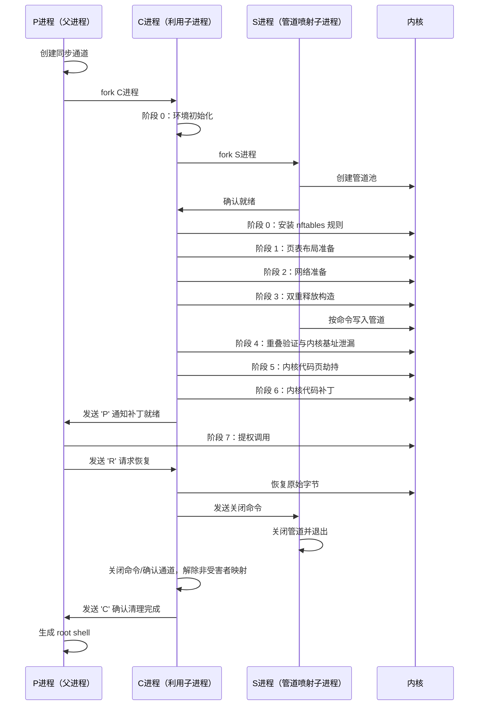
```mermaid
sequenceDiagram
    participant P as P进程（父进程）
    participant C as C进程（利用子进程）
    participant S as S进程（管道喷射子进程）
    participant Kernel as 内核

    P->>P: 创建同步通道
    P->>C: fork C进程
    C->>C: 阶段 0：环境初始化
    C->>S: fork S进程
    S->>Kernel: 创建管道池
    S->>C: 确认就绪
    C->>Kernel: 阶段 0：安装 nftables 规则
    C->>Kernel: 阶段 1：页表布局准备
    C->>Kernel: 阶段 2：网络准备
    C->>Kernel: 阶段 3：双重释放构造
    S->>Kernel: 按命令写入管道
    C->>Kernel: 阶段 4：重叠验证与内核基址泄漏
    C->>Kernel: 阶段 5：内核代码页劫持
    C->>Kernel: 阶段 6：内核代码补丁
    C->>P: 发送 'P' 通知补丁就绪
    P->>Kernel: 阶段 7：提权调用
    P->>C: 发送 'R' 请求恢复
    C->>Kernel: 恢复原始字节
    C->>S: 发送关闭命令
    S->>S: 关闭管道并退出
    C->>C: 关闭命令/确认通道，解除非受害者映射
    C->>P: 发送 'C' 确认清理完成
    P->>P: 生成 root shell
```

阶段 0 至阶段 6 由 C进程执行，阶段 7 由 P进程执行。S进程在阶段 3 中参与管道写入，作为管道数据页的载体。C进程在阶段 0 中完成 S进程的创建，并在阶段 0 的后续步骤中等待所有 S进程完成管道分配。

采用这种三层架构的原因在于：C进程需要保持对受害者 VMA 的长期映射，而 P进程需要在补丁生效的短暂窗口内完成提权调用，将两者分离可以避免因进程退出导致页表状态异常。S进程独立于 C进程，其管道文件描述符在需要时可以被单独关闭，从而精确控制管道数据页的释放时机。

### 3-2. 阶段 0：环境初始化

阶段 0 的目标是为后续阶段搭建运行环境。C进程首先绑定到 CPU 0，创建用户命名空间与网络命名空间，并提高文件描述符上限以支持大量管道。绑定 CPU 0 可以确保内存分配在同一 CPU 的每 CPU 页框缓存中进行，减少跨 CPU 分配带来的不确定性。创建用户命名空间与网络命名空间是为了在无特权的情况下获得访问 nf_tables 所需的能力。提高文件描述符上限则是为了容纳大量管道文件描述符。

随后 C进程创建管道组命令与确认通道，并 fork S进程，等待所有 S进程完成管道分配。接着 C进程启用 `lo` 接口、禁用反向路径过滤、安装 nftables 规则，并初始化分片模板 IP 头。禁用反向路径过滤是为了确保伪造源地址的分片能够被正常接收与重组。安装 nftables 规则则将特殊构造的裁决码写入内核规则链，为后续的第一次释放做好准备。

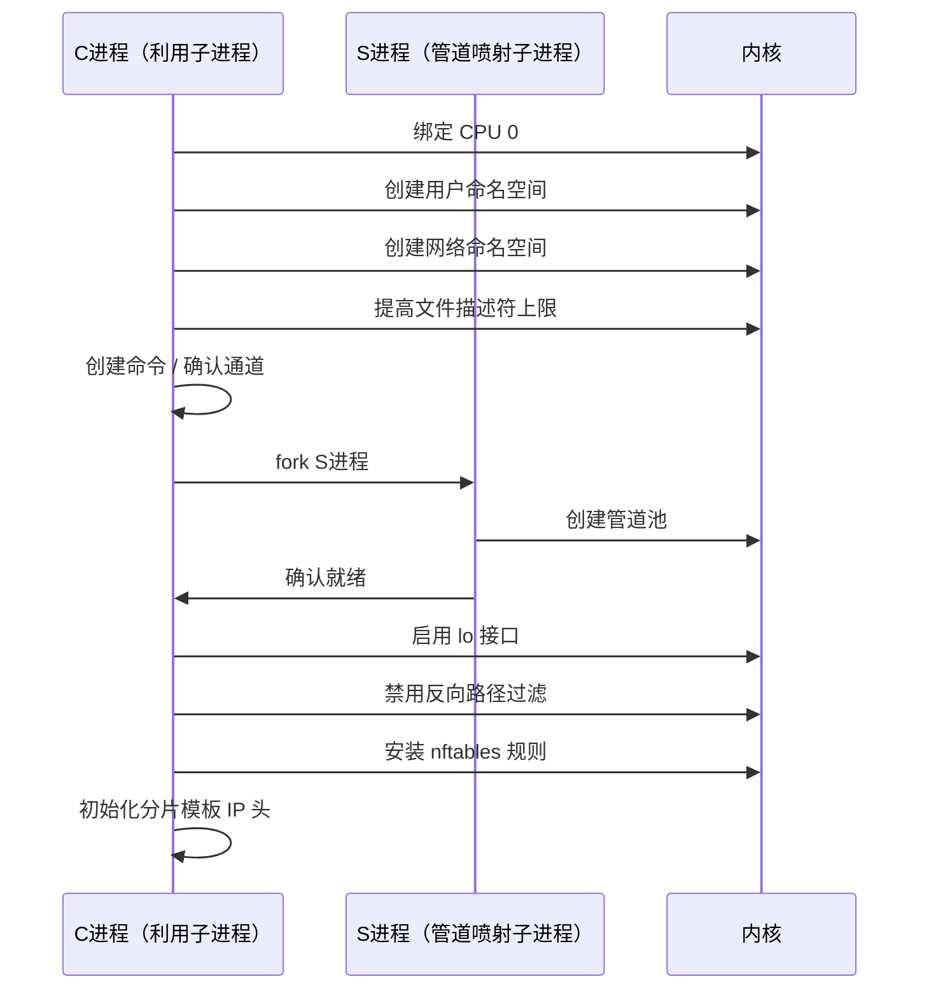
```mermaid
sequenceDiagram
    participant C as C进程（利用子进程）
    participant S as S进程（管道喷射子进程）
    participant Kernel as 内核

    C->>Kernel: 绑定 CPU 0
    C->>Kernel: 创建用户命名空间
    C->>Kernel: 创建网络命名空间
    C->>Kernel: 提高文件描述符上限
    C->>C: 创建命令 / 确认通道
    C->>S: fork S进程
    S->>Kernel: 创建管道池
    S->>C: 确认就绪
    C->>Kernel: 启用 lo 接口
    C->>Kernel: 禁用反向路径过滤
    C->>Kernel: 安装 nftables 规则
    C->>C: 初始化分片模板 IP 头
```

这一阶段的关键在于命名空间与规则安装。命名空间提供了访问 nf_tables 所需的能力，规则安装则将特殊构造的裁决码写入内核规则链，为后续的第一次释放做好准备。S进程的创建发生在这一阶段，它们由 C进程 fork，在后续阶段中作为管道数据页的载体。

### 3-3. 阶段 1：页表布局准备

阶段 1 的目标是为后续的 PTE 喷射预留虚拟地址空间，并提前分配上层页表。C进程注册大量固定大小的 VMA，覆盖多个 PUD 槽，并访问每个槽的起始地址，触发 PUD 页与 PMD 页的分配。这一阶段**不触发 PTE 页的分配**，PTE 页的分配发生在阶段 3 的 PTE 喷射中。

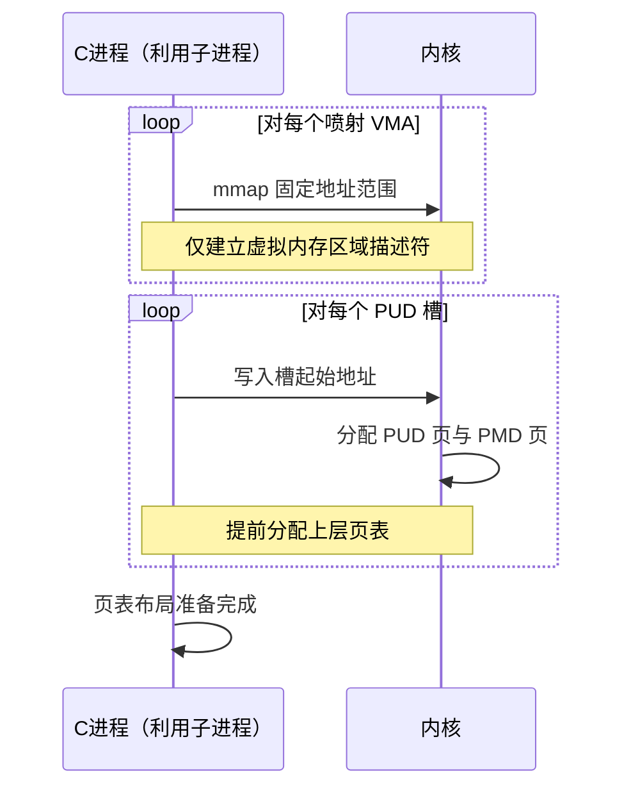
```mermaid
sequenceDiagram
    participant C as C进程（利用子进程）
    participant Kernel as 内核

    loop 对每个喷射 VMA
        C->>Kernel: mmap 固定地址范围
        Note over C,Kernel: 仅建立虚拟内存区域描述符
    end
    loop 对每个 PUD 槽
        C->>Kernel: 写入槽起始地址
        Kernel->>Kernel: 分配 PUD 页与 PMD 页
        Note over C,Kernel: 提前分配上层页表
    end
    C->>C: 页表布局准备完成
```

这一阶段的核心动作是**预留虚拟地址空间并提前分配上层页表**。

C进程通过 `mmap` 建立虚拟内存区域描述符，此时内核尚未分配任何页表页。随后，C进程访问每个 PUD 槽的起始地址，触发内核的缺页处理。内核在遍历页表时发现上层条目为空，于是分配 PUD 页与 PMD 页，填充对应的中间层级。

这一阶段**不触发 PTE 页的分配**。PTE 页的实际分配发生在阶段 3 的 PTE 喷射中。C进程通过访问每个 VMA 中尚未映射的页，触发内核为每个 VMA 分配 PTE 页。此时，喷射所使用的 PTE 页才被真正创建。

提前分配上层页表的作用在于：使后续的 PTE 喷射只需触发 PTE 页的分配，无需再分配 PUD 页与 PMD 页，从而减少内存布局的随机性，提高页表重叠的成功率。

### 3-4. 阶段 2：网络准备

阶段 2 的目标是准备网络环境，使后续的分片发送与队列暂存能够顺利进行。C进程创建 raw 套接字与 UDP 套接字，插入一个短生命周期的预热分片，将分片超时设置为较短值；随后 C进程将超时提升至较长值，以确保真实分片在第二次释放之前不会被超时清空。

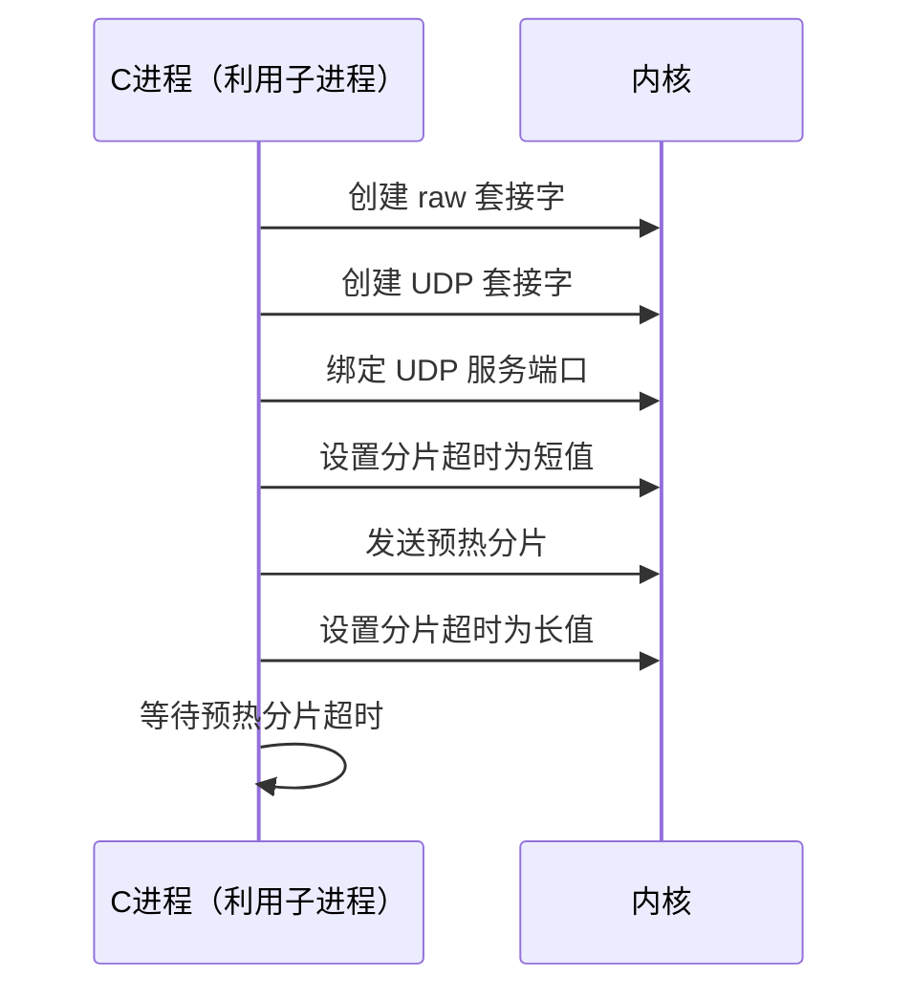
```mermaid
sequenceDiagram
    participant C as C进程（利用子进程）
    participant Kernel as 内核

    C->>Kernel: 创建 raw 套接字
    C->>Kernel: 创建 UDP 套接字
    C->>Kernel: 绑定 UDP 服务端口
    C->>Kernel: 设置分片超时为短值
    C->>Kernel: 发送预热分片
    C->>Kernel: 设置分片超时为长值
    C->>C: 等待预热分片超时
```

这一阶段的关键在于超时参数的调整。预热分片在短超时后被释放，用于验证分片路径的可用性；随后将超时提升至长值，使真实分片在第二次释放之前一直保持暂存状态，为后续的内存布局操作提供时间窗口。如果超时过短，第一个分片可能在第二次释放之前被超时释放，导致双重释放原语无法形成。

### 3-5. 阶段 3：双重释放构造

阶段 3 是整个方案的核心。C进程按七个步骤构造双重释放原语，并通过管道写入与 PTE 喷射形成页表重叠。S进程在这一阶段被 C进程唤醒，作为管道数据页的载体执行写入操作。

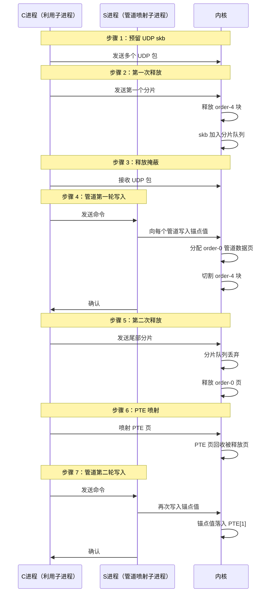
```mermaid
sequenceDiagram
    participant C as C进程（利用子进程）
    participant S as S进程（管道喷射子进程）
    participant Kernel as 内核

    Note over C,Kernel: 步骤 1：预留 UDP skb
    C->>Kernel: 发送多个 UDP 包
    Note over C,Kernel: 步骤 2：第一次释放
    C->>Kernel: 发送第一个分片
    Kernel->>Kernel: 释放 order-4 块
    Kernel->>Kernel: skb 加入分片队列
    Note over C,Kernel: 步骤 3：释放掩蔽
    C->>Kernel: 接收 UDP 包
    Note over C,S: 步骤 4：管道第一轮写入
    C->>S: 发送命令
    S->>Kernel: 向每个管道写入锚点值
    Kernel->>Kernel: 分配 order-0 管道数据页
    Kernel->>Kernel: 切割 order-4 块
    S->>C: 确认
    Note over C,Kernel: 步骤 5：第二次释放
    C->>Kernel: 发送尾部分片
    Kernel->>Kernel: 分片队列丢弃
    Kernel->>Kernel: 释放 order-0 页
    Note over C,Kernel: 步骤 6：PTE 喷射
    C->>Kernel: 喷射 PTE 页
    Kernel->>Kernel: PTE 页回收被释放页
    Note over C,S: 步骤 7：管道第二轮写入
    C->>S: 发送命令
    S->>Kernel: 再次写入锚点值
    Kernel->>Kernel: 锚点值落入 PTE[1]
    S->>C: 确认
```

七个步骤的职责如下：

**步骤 1**：C进程预留 UDP skb 用于掩蔽。该漏洞会释放两个对象：`sk_buff` 结构体本身与 `sk_buff->head` 指向的数据页。其中 `sk_buff->head` 会被后续的管道数据页回收，不构成问题；但 `sk_buff` 结构体若不处理，会在第二次释放时触发双重释放检测。为避免检测，C进程预先发送多个 UDP 包，使内核分配一批 `sk_buff` 结构体并保持存活。

**步骤 2**：C进程触发第一次释放。发送第一个分片，其裁决码触发 nftables 规则的释放操作，order-4 块归还伙伴系统。同时，由于分片携带 `IP_MF` 标志，已释放的 skb 被加入分片队列，暂时保持“存活”。此时，已释放的 `sk_buff` 结构体进入 freelist 头部。

**步骤 3**：C进程释放 UDP skb 掩蔽已释放对象。接收之前发送的 UDP 包，批量释放对应的 `sk_buff` 结构体。

这一步骤的必要性在于 SLUB 分配器的双重释放检测机制。在 `set_freepointer()` 中，内核通过以下代码检测双重释放：

```c
static inline void set_freepointer(struct kmem_cache *s, void *object, void *fp)
{
    unsigned long freeptr_addr = (unsigned long)object + s->offset;

#ifdef CONFIG_SLAB_FREELIST_HARDENED
    BUG_ON(object == fp); /* naive detection of double free or corruption */
#endif

    freeptr_addr = (unsigned long)kasan_reset_tag((void *)freeptr_addr);
    *(freeptr_t *)freeptr_addr = freelist_ptr_encode(s, fp, freeptr_addr);
}
```

该检测仅比较被释放对象 `object` 与当前 freelist 头部 `fp`。若两者相同，则判定为双重释放并触发 BUG。

第一次释放后，漏洞 `sk_buff` 位于 freelist 头部。若此时直接进行第二次释放，`object` 与 `fp` 均为漏洞 `sk_buff`，检测触发。通过批量释放之前预留的 UDP `sk_buff`，freelist 头部被其他对象占据，漏洞 `sk_buff` 不再位于头部。第二次释放时，`object` 为漏洞 `sk_buff`，`fp` 为其他对象，两者不同，检测不触发。

**步骤 4**：C进程向 S进程发送命令。S进程向所有管道写入锚点值，分配 order-0 管道数据页。这些页面切割被释放的 order-4 块，其中一个页面成为后续与 PTE 页重叠的管道缓冲区页。写入完成后，S进程向 C进程确认。

**步骤 5**：C进程触发第二次释放。发送尾部分片，其参数被构造为非法，触发分片队列丢弃，释放已被重置为 order-0 的页面。该页面进入每 CPU 页框缓存。此时，漏洞 `sk_buff` 结构体被第二次释放，但由于步骤 3 已改变 freelist 头部，双重释放检测未触发。

**步骤 6**：C进程喷射 PTE 页。C进程通过访问每个 VMA 中尚未映射的页，触发内核为每个 VMA 分配 PTE 页，回收被释放的 order-0 页。此时，喷射所使用的 PTE 页才被真正创建。由于该页面此前已被管道数据页占用，PTE 页与管道缓冲区页形成物理重叠。

**步骤 7**：C进程向 S进程发送命令。S进程再次写入锚点值，在受害者 VMA 上，该值落入 PTE[1] 位置，使受害者 VMA 的第 1 页映射到锚点页。写入完成后，S进程向 C进程确认。

至此，双重释放原语已转化为管道缓冲区页与 PTE 页的重叠，为后续的任意物理地址读写提供了条件。S进程在这一阶段中作为管道数据页的载体，其写入操作直接决定了 order-4 块的切割方式与 PTE[1] 的填充时机。

### 3-6. 阶段 4：重叠验证与内核基址泄漏

阶段 4 的目标是定位受害者 VMA 并泄漏内核物理基址。C进程扫描所有喷射 VMA 的第 1 页，寻找首 8 字节不再是初始标记的 VMA。第一个满足条件的 VMA 即为受害者。C进程读取受害者第 1 页的内容，可泄漏锚点页的内容。通过物理地址提取与偏移计算，得到内核物理基址。

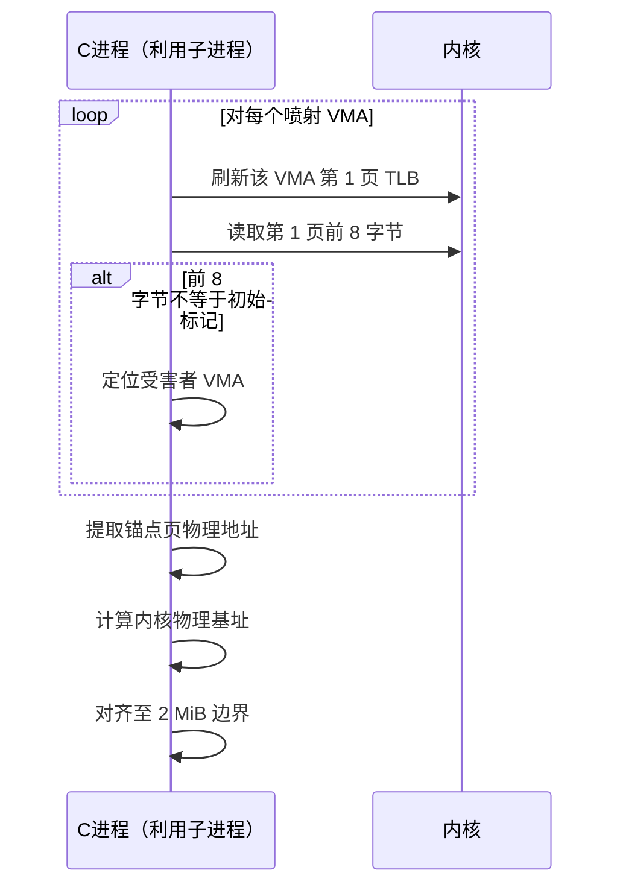
```mermaid
sequenceDiagram
    participant C as C进程（利用子进程）
    participant Kernel as 内核

    loop 对每个喷射 VMA
        C->>Kernel: 刷新该 VMA 第 1 页 TLB
        C->>Kernel: 读取第 1 页前 8 字节
        alt 前 8 字节不等于初始标记
            C->>C: 定位受害者 VMA
        end
    end
    C->>C: 提取锚点页物理地址
    C->>C: 计算内核物理基址
    C->>C: 对齐至 2 MiB 边界
```

这一阶段的关键在于受害者定位。由于 PTE 页与管道缓冲区页重叠，管道写入的锚点值会落在 PTE 页的 PTE[1] 位置，使受害者 VMA 的第 1 页映射到锚点页。通过扫描第 1 页的内容变化，C进程可以精确定位受害者，并从中读取锚点页的内容，进而推算出内核物理基址。锚点页的物理地址与内核物理基址之间有一个固定的偏移，该偏移在编译时确定，因此可以通过简单的减法得到内核物理基址。

### 3-7. 阶段 5：内核代码页劫持

阶段 5 的目标是将目标函数所在的物理页映射到用户空间。C进程使用泄漏的内核物理基址，计算特殊 PTE 值，使其指向目标函数所在的物理页。C进程将该值作为同步令牌传递给 S进程，S进程将其写入管道。在受害者 VMA 上，该值落在 PTE[2] 位置，使受害者 VMA 的第 2 页映射到目标函数所在的物理页。随后 C进程刷新第 2 页的 TLB，并读取第 2 页以触发页表遍历。

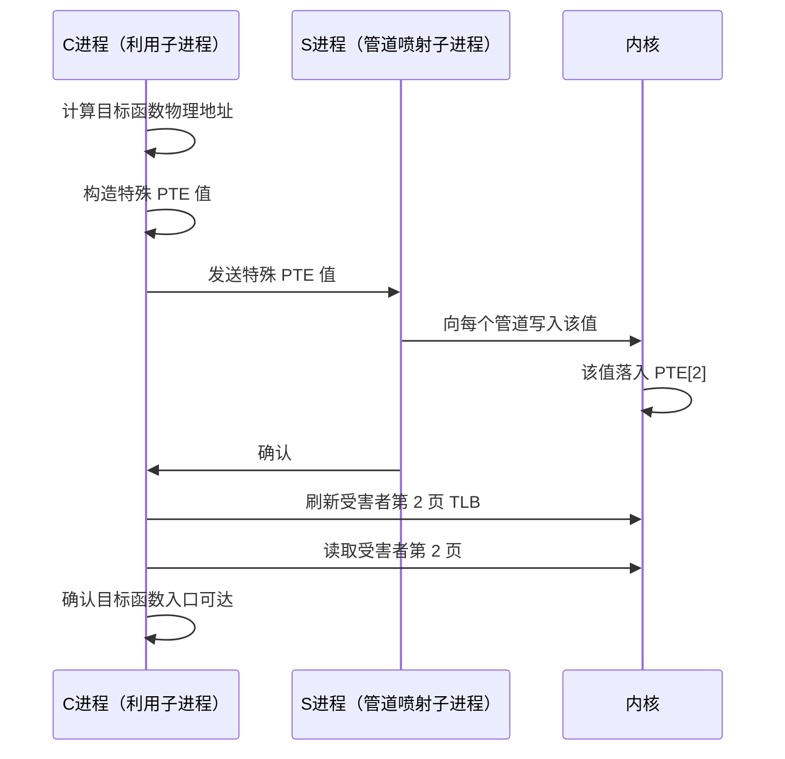
```mermaid
sequenceDiagram
    participant C as C进程（利用子进程）
    participant S as S进程（管道喷射子进程）
    participant Kernel as 内核

    C->>C: 计算目标函数物理地址
    C->>C: 构造特殊 PTE 值
    C->>S: 发送特殊 PTE 值
    S->>Kernel: 向每个管道写入该值
    Kernel->>Kernel: 该值落入 PTE[2]
    S->>C: 确认
    C->>Kernel: 刷新受害者第 2 页 TLB
    C->>Kernel: 读取受害者第 2 页
    C->>C: 确认目标函数入口可达
```

这一阶段的关键在于特殊 PTE 值的构造。通过将目标函数的物理地址与叶子 PTE 标志组合，构造出一个指向内核代码页的 PTE 值。将该值写入 PTE[2] 后，受害者 VMA 的第 2 页即映射到目标函数所在的物理页，从而可以在用户空间直接读写该页。刷新 TLB 是必要的，因为修改 PTE 后，旧的地址转换可能仍缓存于 TLB 中，需要显式刷新才能使新的映射生效。

### 3-8. 阶段 6：内核代码补丁与恢复

阶段 6 的目标是修改目标函数入口，使 P进程能够完成提权，随后恢复原始字节。C进程备份目标函数入口的原始字节，随后将其覆写为无条件返回成功的指令序列，使该函数无条件返回 1。C进程通过同步通道向 P进程发送 `'P'`，通知补丁就绪，等待 P进程的提权请求。P进程完成提权后，通过恢复通道向 C进程发送 `'R'`，请求恢复原始字节。C进程在恢复原始字节之后，进一步清理自身资源：C进程向 S进程发送关闭命令、S进程关闭管道文件描述符并退出、C进程关闭命令与确认通道、C进程解除非受害者 VMA 映射，最后 C进程通过同步通道向 P进程发送 `'C'`，确认清理完成。

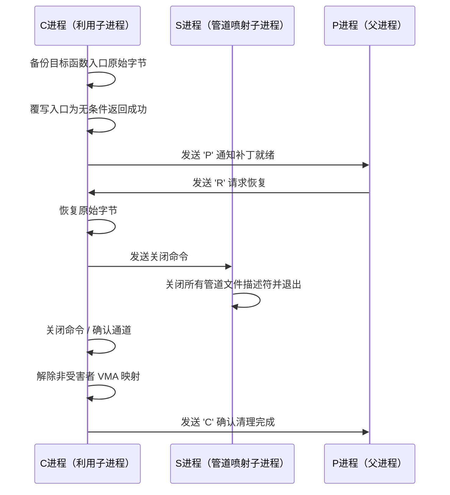
```mermaid
sequenceDiagram
    participant C as C进程（利用子进程）
    participant S as S进程（管道喷射子进程）
    participant P as P进程（父进程）

    C->>C: 备份目标函数入口原始字节
    C->>C: 覆写入口为无条件返回成功
    C->>P: 发送 'P' 通知补丁就绪
    P->>C: 发送 'R' 请求恢复
    C->>C: 恢复原始字节
    C->>S: 发送关闭命令
    S->>S: 关闭所有管道文件描述符并退出
    C->>C: 关闭命令 / 确认通道
    C->>C: 解除非受害者 VMA 映射
    C->>P: 发送 'C' 确认清理完成
```

这一阶段的关键在于 P进程与 C进程的配合与资源清理。C进程完成补丁后通知 P进程，P进程在补丁生效的窗口期内完成提权调用，随后请求 C进程恢复原始字节。恢复完成后，C进程依次执行以下清理操作：向每个 S进程发送关闭命令，使 S进程关闭各自持有的管道文件描述符并退出；关闭自身持有的命令与确认通道文件描述符；解除所有非受害者 VMA 的映射。受害者 VMA 保持映射状态，因为其 PTE 页仍与管道缓冲区页重叠，直到 S进程退出后才释放。清理完成后，C进程通知 P进程，并进入休眠以维持受害者 VMA 的映射，从而保持系统稳定。如果 C进程在恢复原始字节后立即退出，受害者 VMA 的映射可能被释放，导致内核访问已释放的 PTE 页，引发系统异常。

### 3-9. 阶段 7：父进程提权

阶段 7 由 P进程执行。P进程调用提权系统调用。由于目标函数已被 C进程补丁为无条件返回成功，这些调用成功。P进程随后请求 C进程恢复内核代码，等待 C进程确认清理完成，最后生成 root shell。

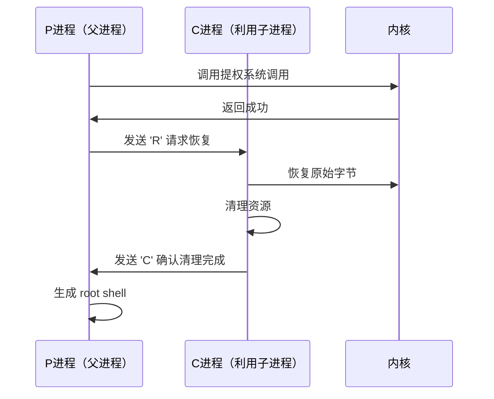
```mermaid
sequenceDiagram
    participant P as P进程（父进程）
    participant C as C进程（利用子进程）
    participant Kernel as 内核

    P->>Kernel: 调用提权系统调用
    Kernel->>P: 返回成功
    P->>C: 发送 'R' 请求恢复
    C->>Kernel: 恢复原始字节
    C->>C: 清理资源
    C->>P: 发送 'C' 确认清理完成
    P->>P: 生成 root shell
```

这一阶段的关键在于提权调用的时机。P进程必须在 C进程完成补丁后、恢复原始字节之前完成提权调用。通过命令通道与确认通道的配合，P进程与 C进程可以在精确的时间窗口内完成补丁、提权、恢复与清理四个操作。如果 P进程在恢复原始字节之后才调用提权系统调用，目标函数已恢复为原始逻辑，提权将失败。

### 3-10. 内核保护机制的应对策略

现代内核通常启用多种安全机制，这些机制分别从地址空间随机化、执行权限隔离、内存分配隔离、堆元数据保护、控制流完整性以及内核与用户态数据交换边界等维度，对潜在的内存异常操作进行防御。本方案在设计之初便充分考量了这些保护机制的影响，并针对性地选择了相应的技术路径。

- **KASLR**：随机化内核代码段、数据段和模块的加载基址。本方案不依赖内核虚拟地址预测，而是通过页表重叠直接获取目标物理页，因此 KASLR 无法阻断该路径。

- **SMEP**：阻止内核态执行用户态虚拟地址中的代码。本方案不将用户态代码注入内核执行。通过页表重叠将目标内核代码页映射到用户态，改写该页内容，使目标函数无条件返回成功。随后通过合法系统调用触发内核执行被改写后的内核代码。执行发生在内核地址空间的内核代码页上，SMEP 无法阻断。

- **SMAP**：阻止内核态通过用户态虚拟地址访问用户数据。本方案不通过用户指针直接访问用户数据。内核侧通过管道写入与页表操控访问的是物理页，而非用户态虚拟地址，因此 SMAP 无法阻断。

- **KPTI**：分离内核页表与用户页表，使用户态页表不包含内核映射。本方案全程通过合法系统调用完成，不依赖用户态直接访问内核虚拟地址空间。

- **CFI**：校验间接函数调用与跳转目标，防止控制流劫持。本方案不修改函数指针，不劫持间接调用目标，而是直接改写目标函数的入口字节。CFI 校验的是间接调用与跳转的目标地址，不校验函数入口的指令内容，因此无法阻断此类数据导向的代码页改写。

- **CONFIG_MEMCG / CONFIG_MEMCG_KMEM**：为受控进程创建独立的 `kmalloc-cg-*` 缓存，与普通 `kmalloc-*` 隔离。该机制不影响页级堆布局操作。核心依赖的是物理页面级分配与释放顺序，与 slab 缓存隔离无关。

- **CONFIG_SLAB_FREELIST_RANDOM**：随机化 SLUB 空闲链表中的对象顺序，增加同一 slab 内分配顺序的预测难度。该机制作用于 SLUB 分配器内部，不影响物理页面级布局。方案核心依赖的是物理页面的地址分布与足够大的操作窗口。

- **CONFIG_SLAB_FREELIST_HARDENED**：对空闲链表指针进行异或混淆，并在 `set_freepointer()` 中通过 `BUG_ON(object == fp)` 检测双重释放。在第二次释放之前，批量释放预留的 UDP skb，改变 freelist 头部，使漏洞 sk_buff 不再位于 freelist 头部。第二次释放时，被释放对象与 freelist 头部不同，`BUG_ON` 检测不触发。

- **CONFIG_INIT_ON_ALLOC_DEFAULT_ON**：v6.4+ 默认开启，分配页时清零内存，并在页面释放路径中启用 `free_page_is_bad()` 检测。该检测会在页面释放时检查其 `_mapcount` 是否为 -1、`_refcount` 是否为 0、以及是否残留 `PAGE_FLAGS_CHECK_AT_FREE` 中的标志位。若任一条件不满足，则调用 `bad_page()` 报告错误。

    需要强调的是，本方案中被释放并回收的页面是**数据页**（管道缓冲区页），而非页表页。该页面在第一次释放时是 order-4 的 skb 数据页；经管道数据页分配后被切割为 order-0 的管道缓冲区页，其 `_mapcount` 与 `_refcount` 已被重置为干净状态；第二次释放将该 order-0 数据页释放到每 CPU 页框缓存，释放路径中 `free_page_is_bad()` 检查通过。随后排空 PCP 列表并喷射 PTE 页，使 PTE 页分配回收该数据页。由于回收对象是数据页而非页表页，其 `PAGE_FLAGS_CHECK_AT_FREE` 中与页表相关的标志位未被设置，`bad_page()` 检测不会被触发。方案正是通过精心编排管道数据页与 PTE 页的分配顺序，确保被回收的页面在释放时处于干净的 order-0 数据页状态，从而绕过该检测。

- **CONFIG_HARDENED_USERCOPY**：在 `copy_to_user()` / `copy_from_user()` 路径中增加边界检查。越界写入发生在内核内部的复制路径中，不经过用户态拷贝接口，检查机制无法覆盖。

整体而言，本方案通过数据导向路径、物理页面级布局与内核内部代码页改写等设计选择，有效规避了上述保护机制。方案不依赖任何形式的控制流劫持，也不依赖内核虚拟地址泄漏，因此在面对多种现代内核保护机制时仍能保持稳定的可利用性。

### 3-11. 前提条件与局限性

**前提条件**

- 目标系统需满足 2-5 节中描述的全部触发条件，包括非特权用户命名空间可用、nf_tables 模块已加载、目标内核版本处于受影响范围且未应用修复补丁。

- 目标系统的每 CPU 页框缓存（PCP）列表大小适中，以便通过管道写入与 PTE 喷射的配合完成页面回收。若 PCP 列表过大，排空操作可能需要更多次喷射；若过小，则可能在排空前已被其他分配填充。

- 目标系统的分片超时参数（`ipfrag_time`）可被调整，以确保分片队列在第二次释放之前不会被超时清空。利用者需在命名空间内将该参数设置为足够大的值（如 9999 秒）。

- 目标系统的内核配置需启用 `CONFIG_NF_TABLES`、`CONFIG_NETFILTER`、`CONFIG_USER_NS`、`CONFIG_NET_NS` 等选项，以便在无特权情况下获得 `CAP_NET_ADMIN` 能力并访问 nf_tables。

- 预留的 UDP skb 数量需足以在第二次释放之前改变 `skbuff_head_cache` 的 freelist 头部，使漏洞 `sk_buff` 不再位于 freelist 头部，从而绕过 `CONFIG_SLAB_FREELIST_HARDENED` 中的 `BUG_ON(object == fp)` 双重释放检测。

**局限性**

- 若目标系统的内存压力极高，页分配行为不可预测，可能导致管道数据页与 PTE 页的重叠成功率下降。此时可能需要增加喷射数量或调整分配时机。

- 若目标系统的内核配置禁用了非特权用户命名空间（如设置 `kernel.unprivileged_userns_clone=0` 或 `user.max_user_namespaces=0`），则无法在无特权情况下获得 `CAP_NET_ADMIN`，方案无法实施。

- 若目标系统启用了额外的安全模块（如 SELinux、AppArmor）并对页表操作施加了额外限制，可能影响页表重叠的稳定性或导致部分操作被拦截。此时需要根据具体安全策略调整方案或改用其他利用路径。

- 本方案依赖于特定的内存布局顺序与分配时机，若目标系统的内核版本或配置与验证环境差异较大，可能需要重新调整 `PTE_SPRAY_COUNT`、`PIPE_SPRAY_COUNT`、`SKB_SPRAY_COUNT` 等参数。

### 3-12. 章节总结

本章介绍了基于 Dirty Pagetable 技术的利用方案。该方案以 CVE-2024-1086 的双重释放原语为起点，通过七个阶段的操作，将释放的页面转化为管道缓冲区页与 PTE 页的重叠，进而实现任意物理地址读写与权限提升。

方案的核心在于内存布局的精心设计。阶段 1 提前分配上层页表，使后续 PTE 喷射无需再分配 PUD 页与 PMD 页；阶段 3 中，在第一次释放之后分配管道数据页，切割被释放的 order-4 块；在第二次释放之后喷射 PTE 页，回收被释放的 order-0 数据页，形成页表重叠。正是这一布局顺序与分配时机的配合，使得方案能够在 v6.4+ 内核上绕过 `CONFIG_INIT_ON_ALLOC_DEFAULT_ON` 引入的 `bad_page()` 检测：被回收的页面是已处于干净状态的数据页，而非页表页，其 `PAGE_FLAGS_CHECK_AT_FREE` 中与页表相关的标志位未被设置。

方案的另一特点在于三层进程架构的配合。P进程负责在补丁生效的窗口期内完成提权调用，并请求 C进程恢复原始字节。C进程负责构造双重释放原语、完成页表重叠、修改目标函数入口，并在环境初始化阶段 fork S进程。在构造双重释放原语的过程中，C进程预先预留一批 UDP skb，并在第二次释放之前批量释放，改变 `skbuff_head_cache` 的 freelist 头部，使漏洞 `sk_buff` 不再位于 freelist 头部，从而绕过 `CONFIG_SLAB_FREELIST_HARDENED` 中的双重释放检测。S进程作为管道数据页的载体，在指定时机写入管道，为页表重叠提供了必要的内存布局条件。

在 P进程完成提权后，C进程恢复目标函数入口的原始字节，并执行资源清理：C进程向每个 S进程发送关闭命令；S进程关闭各自持有的管道文件描述符并退出；C进程关闭自身持有的命令与确认通道，解除非受害者 VMA 映射；随后 C进程通过同步通道向 P进程发送 `'C'`，并进入无限休眠以保持受害者 VMA 映射。P进程收到 `'C'` 后生成 root shell。S进程在关闭管道后退出，不进入休眠。

方案在保护机制应对方面具有明确的设计选择。通过数据导向路径规避 KASLR；通过内核代码页改写而非控制流劫持规避 SMEP、SMAP 与 CFI；通过物理页面级布局规避 slab 缓存隔离与空闲链表随机化；通过 UDP skb 掩蔽规避 SLUB 双重释放检测；通过管道数据页与 PTE 页的顺序编排规避 bad page 检测。方案不依赖内核虚拟地址泄漏，也不依赖任何形式的控制流劫持，因此在面对多种现代内核保护机制时仍能保持稳定的可利用性。

### 3-13. 测试结果

<div style="text-align: center; margin: 2rem 0;">
  
</div>

## 4. 利用思路二（Dirty Pagetable）

本章介绍基于 Dirty Pagetable 技术的第二种利用方案。该方案同样以 CVE-2024-1086 的双重释放原语为起点，但与第 3 章的内存布局顺序相反：先喷射 PTE 页以切割被释放的 order-4 块，再通过管道写入回收被释放的 order-0 页。该方案适用于 v6.4 之前的内核版本，以及 v6.4+ 至 v6.6.14 之间关闭了 `CONFIG_INIT_ON_ALLOC_DEFAULT_ON` 或通过 `init_on_alloc=0` 启动参数使 bad page 检测失效的内核版本。

### 4-1. 整体架构设计

本方案采用两层进程架构。为便于描述，本章统一使用以下进程标记：

- **P进程**：父进程（Parent）
- **C进程**：利用子进程（Child）

后续章节直接使用 P进程、C进程指代对应进程，不再重复全称。

P进程创建同步通道后，fork C进程。C进程负责阶段 0 至阶段 6 的全部操作，包括环境初始化、页表布局准备、网络准备、双重释放构造、重叠验证与内核基址泄漏、内核代码页劫持、内核代码补丁与恢复。P进程负责阶段 7 的提权调用。本方案不使用独立的管道喷射子进程，管道由 C进程预先创建并直接操作。

C进程在完成资源清理后，通过同步通道向 P进程发送 `'C'`，随后进入无限休眠，以保持受害者 VMA 映射。P进程收到 `'C'` 后生成 root shell。

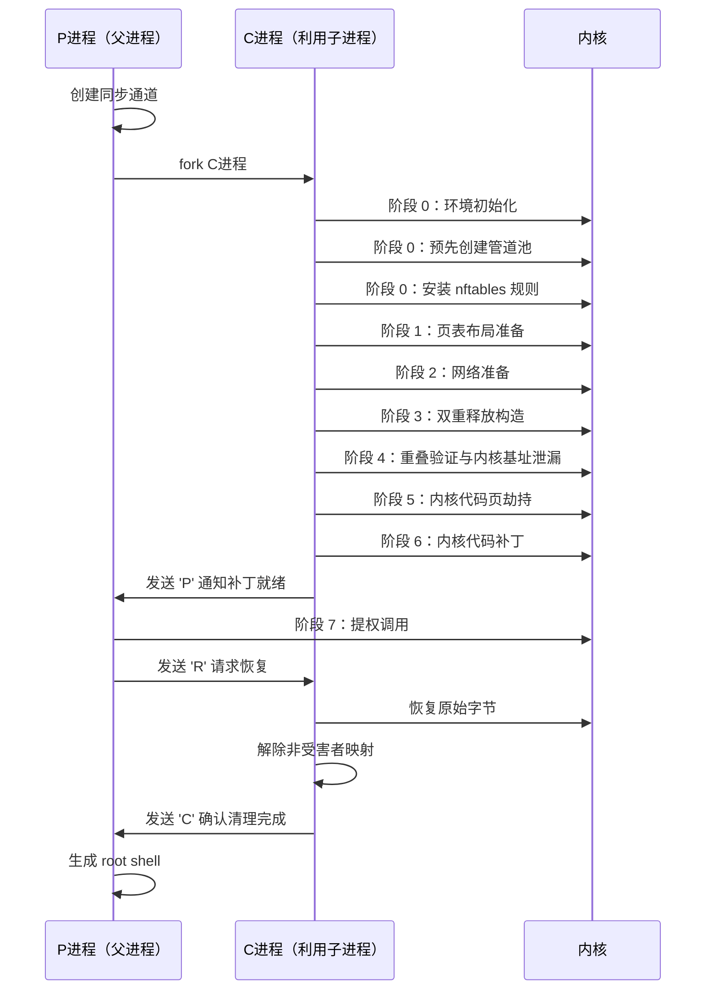
```mermaid
sequenceDiagram
    participant P as P进程（父进程）
    participant C as C进程（利用子进程）
    participant Kernel as 内核

    P->>P: 创建同步通道
    P->>C: fork C进程
    C->>Kernel: 阶段 0：环境初始化
    C->>Kernel: 阶段 0：预先创建管道池
    C->>Kernel: 阶段 0：安装 nftables 规则
    C->>Kernel: 阶段 1：页表布局准备
    C->>Kernel: 阶段 2：网络准备
    C->>Kernel: 阶段 3：双重释放构造
    C->>Kernel: 阶段 4：重叠验证与内核基址泄漏
    C->>Kernel: 阶段 5：内核代码页劫持
    C->>Kernel: 阶段 6：内核代码补丁
    C->>P: 发送 'P' 通知补丁就绪
    P->>Kernel: 阶段 7：提权调用
    P->>C: 发送 'R' 请求恢复
    C->>Kernel: 恢复原始字节
    C->>C: 解除非受害者映射
    C->>P: 发送 'C' 确认清理完成
    P->>P: 生成 root shell
```

阶段 0 至阶段 6 由 C进程执行，阶段 7 由 P进程执行。管道由 C进程在阶段 0 中预先创建，在阶段 3 与阶段 5 中由 C进程直接写入，作为 PTE 条目填充的载体。

采用两层架构的原因在于：本方案的内存布局顺序与第 3 章相反，PTE 页喷射与管道写入均由 C进程在同一进程上下文中完成，无需额外的管道喷射子进程协调。C进程需要保持对受害者 VMA 的长期映射，而 P进程需要在补丁生效的短暂窗口内完成提权调用，将两者分离可以避免因进程退出导致页表状态异常。

### 4-2. 阶段 0：环境初始化

阶段 0 的目标是为后续阶段搭建运行环境。C进程首先绑定到 CPU 0，创建用户命名空间与网络命名空间，并提高文件描述符上限以支持大量管道。随后 C进程启用 `lo` 接口、禁用反向路径过滤、安装 nftables 规则，并预先创建管道池。接着 C进程初始化分片模板 IP 头。

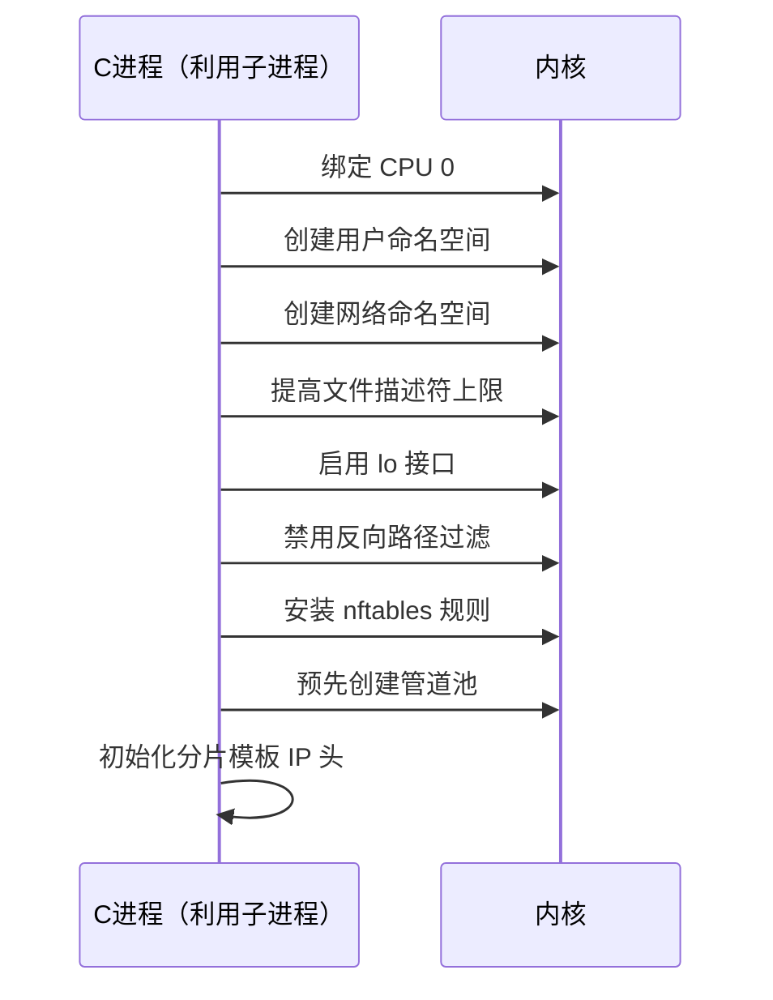
```mermaid
sequenceDiagram
    participant C as C进程（利用子进程）
    participant Kernel as 内核

    C->>Kernel: 绑定 CPU 0
    C->>Kernel: 创建用户命名空间
    C->>Kernel: 创建网络命名空间
    C->>Kernel: 提高文件描述符上限
    C->>Kernel: 启用 lo 接口
    C->>Kernel: 禁用反向路径过滤
    C->>Kernel: 安装 nftables 规则
    C->>Kernel: 预先创建管道池
    C->>C: 初始化分片模板 IP 头
```

这一阶段的关键在于命名空间、规则安装与管道池准备。命名空间提供了访问 nf_tables 所需的能力，规则安装则将特殊构造的裁决码写入内核规则链，为后续的第一次释放做好准备。管道池在阶段 3 与阶段 5 中作为 PTE 条目填充的载体。

### 4-3. 阶段 1：页表布局准备

阶段 1 的目标是为后续的 PTE 喷射预留虚拟地址空间，并提前分配上层页表。C进程注册大量固定大小的 VMA，覆盖多个 PUD 槽，并访问每个槽的起始地址，触发 PUD 页与 PMD 页的分配。这一阶段不触发 PTE 页的分配，PTE 页的分配发生在阶段 3 的 PTE 喷射中。


```mermaid
sequenceDiagram
    participant C as C进程（利用子进程）
    participant Kernel as 内核

    loop 对每个喷射 VMA
        C->>Kernel: mmap 固定地址范围
        Note over C,Kernel: 仅建立虚拟内存区域描述符
    end
    loop 对每个 PUD 槽
        C->>Kernel: 写入槽起始地址
        Kernel->>Kernel: 分配 PUD 页与 PMD 页
        Note over C,Kernel: 提前分配上层页表
    end
    C->>C: 页表布局准备完成
```

这一阶段的核心动作是**预留虚拟地址空间并提前分配上层页表**。C进程通过 `mmap` 建立虚拟内存区域描述符，此时内核尚未分配任何页表页。随后，C进程访问每个 PUD 槽的起始地址，触发内核的缺页处理。内核在遍历页表时发现上层条目为空，于是分配 PUD 页与 PMD 页，填充对应的中间层级。

这一阶段不触发 PTE 页的分配。PTE 页的实际分配发生在阶段 3 的 PTE 喷射中。C进程通过访问每个 VMA 中尚未映射的页，触发内核为每个 VMA 分配 PTE 页。此时，喷射所使用的 PTE 页才被真正创建。

提前分配上层页表的作用在于：使后续的 PTE 喷射只需触发 PTE 页的分配，无需再分配 PUD 页与 PMD 页，从而减少内存布局的随机性，提高页表重叠的成功率。

### 4-4. 阶段 2：网络准备

阶段 2 的目标是准备网络环境，使后续的分片发送与队列暂存能够顺利进行。C进程创建 raw 套接字与 UDP 套接字，插入一个短生命周期的预热分片，将分片超时设置为较短值；随后 C进程将超时提升至较长值，以确保真实分片在第二次释放之前不会被超时清空。


```mermaid
sequenceDiagram
    participant C as C进程（利用子进程）
    participant Kernel as 内核

    C->>Kernel: 创建 raw 套接字
    C->>Kernel: 创建 UDP 套接字
    C->>Kernel: 绑定 UDP 服务端口
    C->>Kernel: 设置分片超时为短值
    C->>Kernel: 发送预热分片
    C->>Kernel: 设置分片超时为长值
    C->>C: 等待预热分片超时
```

这一阶段的关键在于超时参数的调整。预热分片在短超时后被释放，用于验证分片路径的可用性；随后将超时提升至长值，使真实分片在第二次释放之前一直保持暂存状态，为后续的内存布局操作提供时间窗口。

### 4-5. 阶段 3：双重释放构造

阶段 3 是整个方案的核心。C进程按六个步骤构造双重释放原语，并通过 PTE 喷射与管道写入形成页表重叠。与第 3 章相比，本方案的内存布局顺序相反：先喷射 PTE 页以切割被释放的 order-4 块，再通过管道写入回收被释放的 order-0 页。

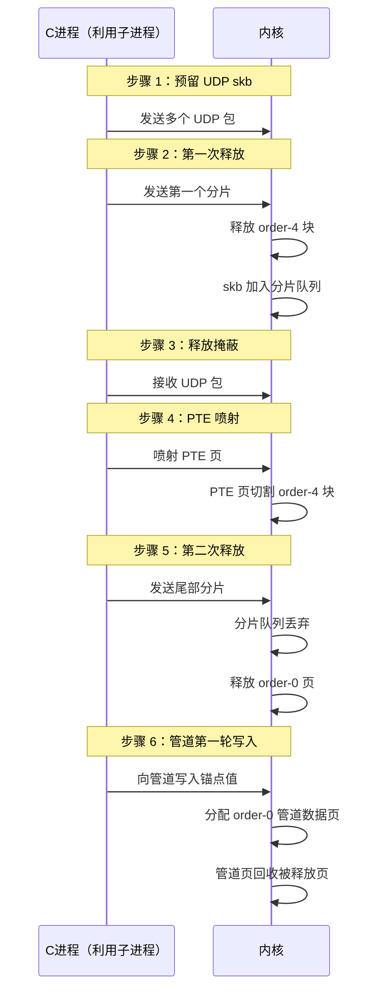
```mermaid
sequenceDiagram
    participant C as C进程（利用子进程）
    participant Kernel as 内核

    Note over C,Kernel: 步骤 1：预留 UDP skb
    C->>Kernel: 发送多个 UDP 包
    Note over C,Kernel: 步骤 2：第一次释放
    C->>Kernel: 发送第一个分片
    Kernel->>Kernel: 释放 order-4 块
    Kernel->>Kernel: skb 加入分片队列
    Note over C,Kernel: 步骤 3：释放掩蔽
    C->>Kernel: 接收 UDP 包
    Note over C,Kernel: 步骤 4：PTE 喷射
    C->>Kernel: 喷射 PTE 页
    Kernel->>Kernel: PTE 页切割 order-4 块
    Note over C,Kernel: 步骤 5：第二次释放
    C->>Kernel: 发送尾部分片
    Kernel->>Kernel: 分片队列丢弃
    Kernel->>Kernel: 释放 order-0 页
    Note over C,Kernel: 步骤 6：管道第一轮写入
    C->>Kernel: 向管道写入锚点值
    Kernel->>Kernel: 分配 order-0 管道数据页
    Kernel->>Kernel: 管道页回收被释放页
```

六个步骤的职责如下：

**步骤 1**：C进程预留 UDP skb 用于掩蔽。该漏洞会释放两个对象：`sk_buff` 结构体本身与 `sk_buff->head` 指向的数据页。其中 `sk_buff->head` 会被后续的 PTE 页回收，不构成问题；但 `sk_buff` 结构体若不处理，会在第二次释放时触发双重释放检测。为避免检测，C进程预先发送多个 UDP 包，使内核分配一批 `sk_buff` 结构体并保持存活。

**步骤 2**：C进程触发第一次释放。发送第一个分片，其裁决码触发 nftables 规则的释放操作，order-4 块归还伙伴系统。同时，由于分片携带 `IP_MF` 标志，已释放的 skb 被加入分片队列，暂时保持“存活”。此时，已释放的 `sk_buff` 结构体进入 freelist 头部。

**步骤 3**：C进程释放 UDP skb 掩蔽已释放对象。接收之前发送的 UDP 包，批量释放对应的 `sk_buff` 结构体。

这一步骤的必要性在于 SLUB 分配器的双重释放检测机制。在 `set_freepointer()` 中，内核通过以下代码检测双重释放：

```c
static inline void set_freepointer(struct kmem_cache *s, void *object, void *fp)
{
    unsigned long freeptr_addr = (unsigned long)object + s->offset;

#ifdef CONFIG_SLAB_FREELIST_HARDENED
    BUG_ON(object == fp); /* naive detection of double free or corruption */
#endif

    freeptr_addr = (unsigned long)kasan_reset_tag((void *)freeptr_addr);
    *(freeptr_t *)freeptr_addr = freelist_ptr_encode(s, fp, freeptr_addr);
}
```

该检测仅比较被释放对象 `object` 与当前 freelist 头部 `fp`。若两者相同，则判定为双重释放并触发 BUG。第一次释放后，漏洞 `sk_buff` 位于 freelist 头部。若此时直接进行第二次释放，`object` 与 `fp` 均为漏洞 `sk_buff`，检测触发。通过批量释放之前预留的 UDP `sk_buff`，freelist 头部被其他对象占据，漏洞 `sk_buff` 不再位于头部。第二次释放时，`object` 为漏洞 `sk_buff`，`fp` 为其他对象，两者不同，检测不触发。

**步骤 4**：C进程喷射 PTE 页。C进程通过访问每个 VMA 中尚未映射的页，触发内核为每个 VMA 分配 PTE 页。这些 PTE 页回收被释放的 order-4 块，将其切割为若干 order-0 页。其中一个 order-0 页成为某个 VMA 的活跃 PTE 页。由于该 PTE 页在后续步骤中会被管道数据页回收，PTE 页与管道缓冲区页形成物理重叠。

**步骤 5**：C进程触发第二次释放。发送尾部分片，其参数被构造为非法，触发分片队列丢弃，释放已被重置为 order-0 的页面。该页面进入每 CPU 页框缓存。此时，漏洞 `sk_buff` 结构体被第二次释放，但由于步骤 3 已改变 freelist 头部，双重释放检测未触发。

**步骤 6**：C进程向管道写入锚点值。由于管道写入分配 order-0 管道数据页，其中一个管道数据页回收被释放的 order-0 页。在受害者 VMA 上，该管道页与 PTE 页重叠，写入的锚点值落入 PTE[0] 位置，使受害者 VMA 的第 0 页映射到锚点页。

至此，双重释放原语已转化为 PTE 页与管道缓冲区页的重叠，为后续的任意物理地址读写提供了条件。本方案的内存布局顺序与第 3 章相反：先喷射 PTE 页切割 order-4 块，再通过管道写入回收 order-0 页。该顺序适用于 bad page 检测未启用或失效的内核版本。

### 4-6. 阶段 4：重叠验证与内核基址泄漏

阶段 4 的目标是定位受害者 VMA 并泄漏内核物理基址。C进程扫描所有喷射 VMA 的第 0 页，寻找首 8 字节不再是初始标记的 VMA。第一个满足条件的 VMA 即为受害者。C进程读取受害者第 0 页的内容，可泄漏锚点页的内容。通过物理地址提取与偏移计算，得到内核物理基址。


```mermaid
sequenceDiagram
    participant C as C进程（利用子进程）
    participant Kernel as 内核

    loop 对每个喷射 VMA
        C->>Kernel: 刷新该 VMA 第 0 页 TLB
        C->>Kernel: 读取第 0 页前 8 字节
        alt 前 8 字节不等于初始标记
            C->>C: 定位受害者 VMA
        end
    end
    C->>C: 提取锚点页物理地址
    C->>C: 计算内核物理基址
    C->>C: 对齐至 2 MiB 边界
```

这一阶段的关键在于受害者定位。由于 PTE 页与管道缓冲区页重叠，管道写入的锚点值会落在 PTE 页的 PTE[0] 位置，使受害者 VMA 的第 0 页映射到锚点页。通过扫描第 0 页的内容变化，C进程可以精确定位受害者，并从中读取锚点页的内容，进而推算出内核物理基址。

### 4-7. 阶段 5：内核代码页劫持

阶段 5 的目标是将目标函数所在的物理页映射到用户空间。C进程使用泄漏的内核物理基址，计算特殊 PTE 值，使其指向目标函数所在的物理页。C进程将该值追加写入每个管道。在受害者 VMA 上，该值落入 PTE[1] 位置，使受害者 VMA 的第 1 页映射到目标函数所在的物理页。随后 C进程刷新第 1 页的 TLB，并读取第 1 页以触发页表遍历。

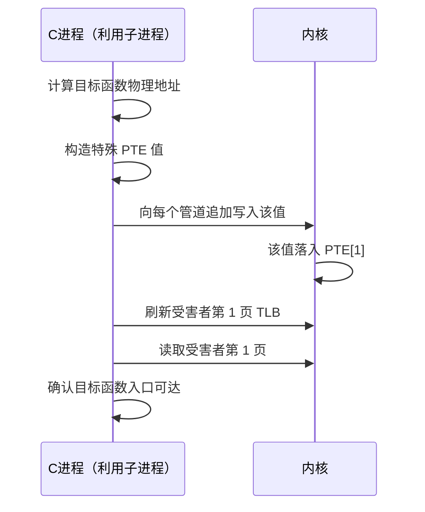
```mermaid
sequenceDiagram
    participant C as C进程（利用子进程）
    participant Kernel as 内核

    C->>C: 计算目标函数物理地址
    C->>C: 构造特殊 PTE 值
    C->>Kernel: 向每个管道追加写入该值
    Kernel->>Kernel: 该值落入 PTE[1]
    C->>Kernel: 刷新受害者第 1 页 TLB
    C->>Kernel: 读取受害者第 1 页
    C->>C: 确认目标函数入口可达
```

这一阶段的关键在于特殊 PTE 值的构造。通过将目标函数的物理地址与叶子 PTE 标志组合，构造出一个指向内核代码页的 PTE 值。将该值写入 PTE[1] 后，受害者 VMA 的第 1 页即映射到目标函数所在的物理页，从而可以在用户空间直接读写该页。刷新 TLB 是必要的，因为修改 PTE 后，旧的地址转换可能仍缓存于 TLB 中，需要显式刷新才能使新的映射生效。

### 4-8. 阶段 6：内核代码补丁与恢复

阶段 6 的目标是修改目标函数入口，使 P进程能够完成提权，随后恢复原始字节。C进程备份目标函数入口的原始字节，随后将其覆写为无条件返回成功的指令序列，使该函数无条件返回 1。C进程通过同步通道向 P进程发送 `'P'`，通知补丁就绪，等待 P进程的提权请求。P进程完成提权后，通过恢复通道向 C进程发送 `'R'`，请求恢复原始字节。C进程在恢复原始字节之后，进一步清理自身资源：C进程解除非受害者 VMA 映射，最后 C进程通过同步通道向 P进程发送 `'C'`，确认清理完成。

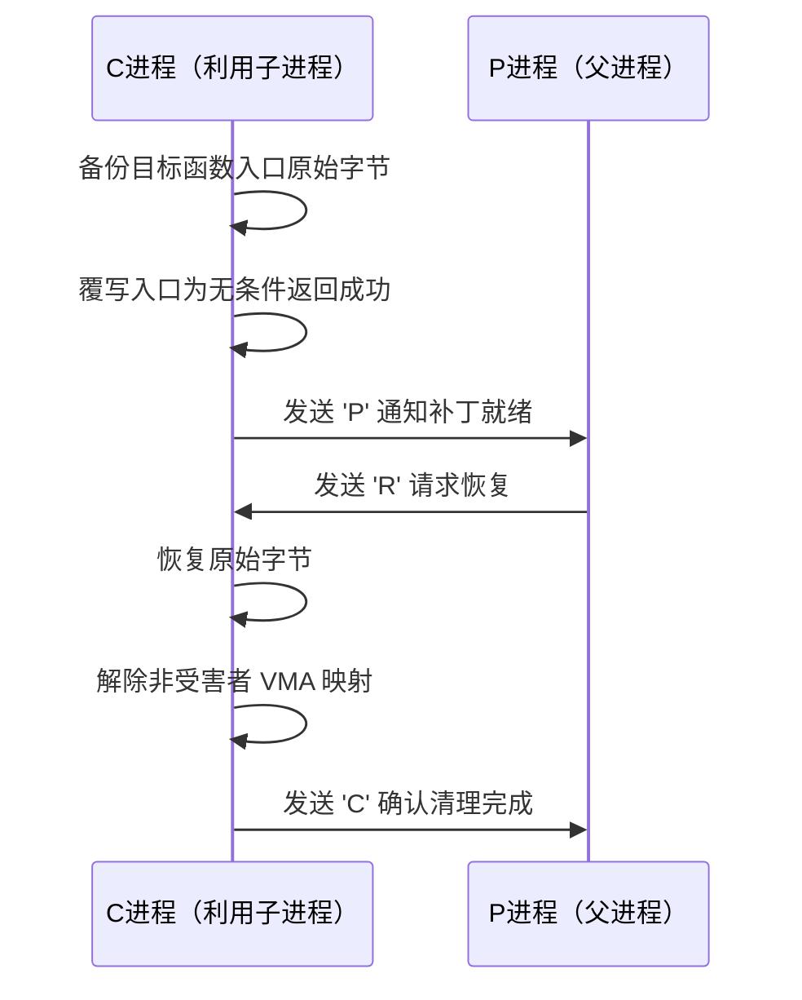
```mermaid
sequenceDiagram
    participant C as C进程（利用子进程）
    participant P as P进程（父进程）

    C->>C: 备份目标函数入口原始字节
    C->>C: 覆写入口为无条件返回成功
    C->>P: 发送 'P' 通知补丁就绪
    P->>C: 发送 'R' 请求恢复
    C->>C: 恢复原始字节
    C->>C: 解除非受害者 VMA 映射
    C->>P: 发送 'C' 确认清理完成
```

这一阶段的关键在于 P进程与 C进程的配合与资源清理。C进程完成补丁后通知 P进程，P进程在补丁生效的窗口期内完成提权调用，随后请求 C进程恢复原始字节。恢复完成后，C进程解除所有非受害者 VMA 的映射。受害者 VMA 保持映射状态，因为其 PTE 页仍与管道缓冲区页重叠，直到 C进程进入休眠后才维持。清理完成后，C进程通知 P进程，并进入休眠以维持受害者 VMA 的映射，从而保持系统稳定。

### 4-9. 阶段 7：父进程提权

阶段 7 由 P进程执行。P进程调用提权系统调用。由于目标函数已被 C进程补丁为无条件返回成功，这些调用成功。P进程随后请求 C进程恢复内核代码，等待 C进程确认清理完成，最后生成 root shell。


```mermaid
sequenceDiagram
    participant P as P进程（父进程）
    participant C as C进程（利用子进程）
    participant Kernel as 内核

    P->>Kernel: 调用提权系统调用
    Kernel->>P: 返回成功
    P->>C: 发送 'R' 请求恢复
    C->>Kernel: 恢复原始字节
    C->>C: 清理资源
    C->>P: 发送 'C' 确认清理完成
    P->>P: 生成 root shell
```

这一阶段的关键在于提权调用的时机。P进程必须在 C进程完成补丁后、恢复原始字节之前完成提权调用。通过命令通道与确认通道的配合，P进程与 C进程可以在精确的时间窗口内完成补丁、提权、恢复与清理四个操作。

### 4-10. 内核保护机制的应对策略

现代内核通常启用多种安全机制，这些机制分别从地址空间随机化、执行权限隔离、内存分配隔离、堆元数据保护、控制流完整性以及内核与用户态数据交换边界等维度，对潜在的内存异常操作进行防御。本方案在设计之初便充分考量了这些保护机制的影响，并针对性地选择了相应的技术路径。

- **KASLR**：随机化内核代码段、数据段和模块的加载基址。本方案不依赖内核虚拟地址预测，而是通过页表重叠直接获取目标物理页，因此 KASLR 无法阻断该路径。

- **SMEP**：阻止内核态执行用户态虚拟地址中的代码。本方案不将用户态代码注入内核执行。通过页表重叠将目标内核代码页映射到用户态，改写该页内容，使目标函数无条件返回成功。随后通过合法系统调用触发内核执行被改写后的内核代码。执行发生在内核地址空间的内核代码页上，SMEP 无法阻断。

- **SMAP**：阻止内核态通过用户态虚拟地址访问用户数据。本方案不通过用户指针直接访问用户数据。内核侧通过管道写入与页表操控访问的是物理页，而非用户态虚拟地址，因此 SMAP 无法阻断。

- **KPTI**：分离内核页表与用户页表，使用户态页表不包含内核映射。本方案全程通过合法系统调用完成，不依赖用户态直接访问内核虚拟地址空间。

- **CFI**：校验间接函数调用与跳转目标，防止控制流劫持。本方案不修改函数指针，不劫持间接调用目标，而是直接改写目标函数的入口字节。CFI 校验的是间接调用与跳转的目标地址，不校验函数入口的指令内容，因此无法阻断此类数据导向的代码页改写。

- **CONFIG_MEMCG / CONFIG_MEMCG_KMEM**：为受控进程创建独立的 `kmalloc-cg-*` 缓存，与普通 `kmalloc-*` 隔离。该机制不影响页级堆布局操作。核心依赖的是物理页面级分配与释放顺序，与 slab 缓存隔离无关。

- **CONFIG_SLAB_FREELIST_RANDOM**：随机化 SLUB 空闲链表中的对象顺序，增加同一 slab 内分配顺序的预测难度。该机制作用于 SLUB 分配器内部，不影响物理页面级布局。方案核心依赖的是物理页面的地址分布与足够大的操作窗口。

- **CONFIG_SLAB_FREELIST_HARDENED**：对空闲链表指针进行异或混淆，并在 `set_freepointer()` 中通过 `BUG_ON(object == fp)` 检测双重释放。在第二次释放之前，批量释放预留的 UDP skb，改变 freelist 头部，使漏洞 sk_buff 不再位于 freelist 头部。第二次释放时，被释放对象与 freelist 头部不同，`BUG_ON` 检测不触发。

- **CONFIG_INIT_ON_ALLOC_DEFAULT_ON 与 bad page 检测**：v6.4+ 内核默认开启该选项，分配页时清零内存，并在页面释放路径中启用 `free_page_is_bad()` 检测。该检测会在页面释放时检查其 `_mapcount`、`_refcount` 以及是否残留 `PAGE_FLAGS_CHECK_AT_FREE` 中的标志位。若任一条件不满足，则调用 `bad_page()` 报告错误。本方案适用于 v6.4 之前的内核版本，以及 v6.4+ 至 v6.6.14 之间关闭了该选项或通过 `init_on_alloc=0` 启动参数使该检测失效的内核版本。在这些版本中，被回收的页面在释放时不经过 bad page 检测，因此方案的内存布局顺序（先喷射 PTE 页，再通过管道写入回收）可以正常工作。

- **CONFIG_HARDENED_USERCOPY**：在 `copy_to_user()` / `copy_from_user()` 路径中增加边界检查。越界写入发生在内核内部的复制路径中，不经过用户态拷贝接口，检查机制无法覆盖。

整体而言，本方案通过数据导向路径、物理页面级布局与内核内部代码页改写等设计选择，有效规避了上述保护机制。方案不依赖任何形式的控制流劫持，也不依赖内核虚拟地址泄漏，因此在面对多种现代内核保护机制时仍能保持稳定的可利用性。

### 4-11. 前提条件与局限性

**前提条件**

- 目标系统需满足 2-5 节中描述的全部触发条件，包括非特权用户命名空间可用、nf_tables 模块已加载、目标内核版本处于受影响范围且未应用修复补丁。

- 目标内核版本需满足以下条件之一：处于 v6.4 之前，此时 bad page 检测尚未引入；处于 v6.4+ 至 v6.6.14 之间，且关闭了 `CONFIG_INIT_ON_ALLOC_DEFAULT_ON` 或通过 `init_on_alloc=0` 启动参数使 bad page 检测失效。

- 目标系统的每 CPU 页框缓存（PCP）列表大小适中，以便通过 PTE 喷射与管道写入的配合完成页面回收。

- 目标系统的分片超时参数（`ipfrag_time`）可被调整，以确保分片队列在第二次释放之前不会被超时清空。

- 目标系统的内核配置需启用 `CONFIG_NF_TABLES`、`CONFIG_NETFILTER`、`CONFIG_USER_NS`、`CONFIG_NET_NS` 等选项，以便在无特权情况下获得 `CAP_NET_ADMIN` 能力并访问 nf_tables。

- 预留的 UDP skb 数量需足以在第二次释放之前改变 `skbuff_head_cache` 的 freelist 头部，使漏洞 `sk_buff` 不再位于 freelist 头部，从而绕过 `CONFIG_SLAB_FREELIST_HARDENED` 中的 `BUG_ON(object == fp)` 双重释放检测。

**局限性**

- 本方案不适用于启用了 `CONFIG_INIT_ON_ALLOC_DEFAULT_ON` 且未通过启动参数关闭 bad page 检测的 v6.4+ 内核。在这些内核上，被回收的页面在释放时会经过 bad page 检测，先喷射 PTE 页再通过管道写入回收的顺序可能触发检测。对于此类内核，应采用第 3 章描述的内存布局顺序。

- 若目标系统的内存压力极高，页分配行为不可预测，可能导致 PTE 页与管道数据页的重叠成功率下降。此时可能需要增加喷射数量或调整分配时机。

- 若目标系统的内核配置禁用了非特权用户命名空间，则无法在无特权情况下获得 `CAP_NET_ADMIN`，方案无法实施。

- 若目标系统启用了额外的安全模块（如 SELinux、AppArmor）并对页表操作施加了额外限制，可能影响页表重叠的稳定性或导致部分操作被拦截。此时需要根据具体安全策略调整方案或改用其他利用路径。

- 本方案依赖于特定的内存布局顺序与分配时机，若目标系统的内核版本或配置与验证环境差异较大，可能需要重新调整 `PTE_SPRAY_COUNT`、`PIPE_SPRAY_COUNT`、`SKB_SPRAY_COUNT` 等参数。

### 4-12. 章节总结

本章介绍了基于 Dirty Pagetable 技术的第二种利用方案。该方案以 CVE-2024-1086 的双重释放原语为起点，通过六个阶段的操作，将释放的页面转化为 PTE 页与管道缓冲区页的重叠，进而实现任意物理地址读写与权限提升。

方案的核心在于内存布局的设计。阶段 1 提前分配上层页表，使后续 PTE 喷射无需再分配 PUD 页与 PMD 页；阶段 3 中，在第一次释放之后喷射 PTE 页，切割被释放的 order-4 块；在第二次释放之后通过管道写入回收被释放的 order-0 页，形成页表重叠。这一顺序与第 3 章相反，适用于 bad page 检测未启用或失效的内核版本。

方案的另一特点在于两层进程架构的配合。P进程负责在补丁生效的窗口期内完成提权调用，并请求 C进程恢复原始字节。C进程负责构造双重释放原语、完成页表重叠、修改目标函数入口，并直接操作管道池。在构造双重释放原语的过程中，C进程预先预留一批 UDP skb，并在第二次释放之前批量释放，改变 `skbuff_head_cache` 的 freelist 头部，绕过 `CONFIG_SLAB_FREELIST_HARDENED` 中的双重释放检测。

在 P进程完成提权后，C进程恢复原始字节并执行资源清理：C进程解除非受害者 VMA 映射，随后通过同步通道向 P进程发送 `'C'`，并进入无限休眠以保持受害者 VMA 映射。P进程收到 `'C'` 后生成 root shell。

本章方案与第 3 章方案的主要差异在于：内存布局顺序相反（先 PTE 喷射后管道写入，而非先管道写入后 PTE 喷射）；适用于不同的内核版本范围（v6.4 之前或 bad page 检测失效的 v6.4+ 至 v6.6.14）；采用两层进程架构而非三层。两条方案共同覆盖了 CVE-2024-1086 在 v6.3.13 至 v6.6.14 范围内的可利用版本，为不同内核配置下的利用提供了完整的解决方案。

### 4-13. 测试结果

<div style="text-align: center; margin: 2rem 0;">
  
</div>

## 5. 利用思路三（Dirty Pagedirectory）

本章介绍基于 Dirty Pagedirectory 技术的第三种利用方案。该方案整理自官方 PoC 的利用步骤，以 CVE-2024-1086 的双重释放原语为起点，通过将 PTE 页与 PMD 页分配到同一物理页框，构造页表混淆，实现从用户空间镜像内核物理内存的能力。在此基础上，利用者可以覆写内核中的 usermodehelper 路径字符串，触发内核以 root 身份执行指定脚本，最终完成权限提升。该方案不修改内核代码页，属于数据导向的任意物理地址读写原语。

### 5-1. 整体架构设计

本方案采用两层进程架构。为便于描述，本章统一使用以下进程标记：

- **P进程**：父进程（Parent）
- **C进程**：利用子进程（Child）

后续章节直接使用 P进程、C进程指代对应进程，不再重复全称。

P进程创建同步通道后，fork C进程。C进程负责阶段 0 至阶段 7 的全部操作，包括环境初始化、页表布局准备、网络准备、双重释放构造、重叠验证、内核基址扫描、目标路径定位以及 PID 爆破与 root shell 获取。P进程负责等待 C进程的最终状态，并在 C进程成功获取 root shell 后退出。

C进程在完成全部阶段后，通过同步通道向 P进程报告成功或失败。若成功，C进程进入休眠以保持页表映射不被释放；若失败，C进程退出，P进程随之退出。

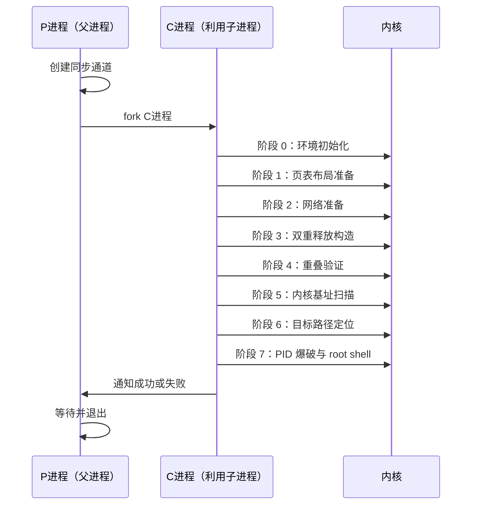
```mermaid
sequenceDiagram
    participant P as P进程（父进程）
    participant C as C进程（利用子进程）
    participant Kernel as 内核

    P->>P: 创建同步通道
    P->>C: fork C进程
    C->>Kernel: 阶段 0：环境初始化
    C->>Kernel: 阶段 1：页表布局准备
    C->>Kernel: 阶段 2：网络准备
    C->>Kernel: 阶段 3：双重释放构造
    C->>Kernel: 阶段 4：重叠验证
    C->>Kernel: 阶段 5：内核基址扫描
    C->>Kernel: 阶段 6：目标路径定位
    C->>Kernel: 阶段 7：PID 爆破与 root shell
    C->>P: 通知成功或失败
    P->>P: 等待并退出
```

阶段 0 至阶段 7 由 C进程执行。本方案不使用独立的管道喷射子进程，管道由 C进程预先创建并直接操作。C进程需要保持对重叠页表的长期映射，因此成功后会进入休眠；P进程仅负责等待 C进程的最终状态。

采用两层架构的原因在于：本方案的核心操作均在 C进程的地址空间内完成，页表重叠后 C进程可以通过用户空间读写直接镜像物理内存，无需额外的进程协调。P进程仅作为父进程存在，用于接收 C进程的最终状态并避免 C进程成为孤儿进程。

该方案适用于 v6.4 之前的内核版本，以及 v6.4+ 至 v6.6.4 之间关闭了 `CONFIG_INIT_ON_ALLOC_DEFAULT_ON` 或通过 `init_on_alloc=0` 启动参数使 bad page 检测失效的内核版本。

### 5-2. 阶段 0：环境初始化

阶段 0 的目标是为后续阶段搭建运行环境。C进程首先绑定到 CPU 0，创建用户命名空间与网络命名空间，并提高文件描述符上限以支持大量 VMA 与管道。随后 C进程启用 `lo` 接口、禁用反向路径过滤、安装 nftables 规则，并初始化分片模板 IP 头。接着 C进程复制标准输入与标准输出，以便后续 root shell 使用；并缓存目标路径字符串，供阶段 6 使用。

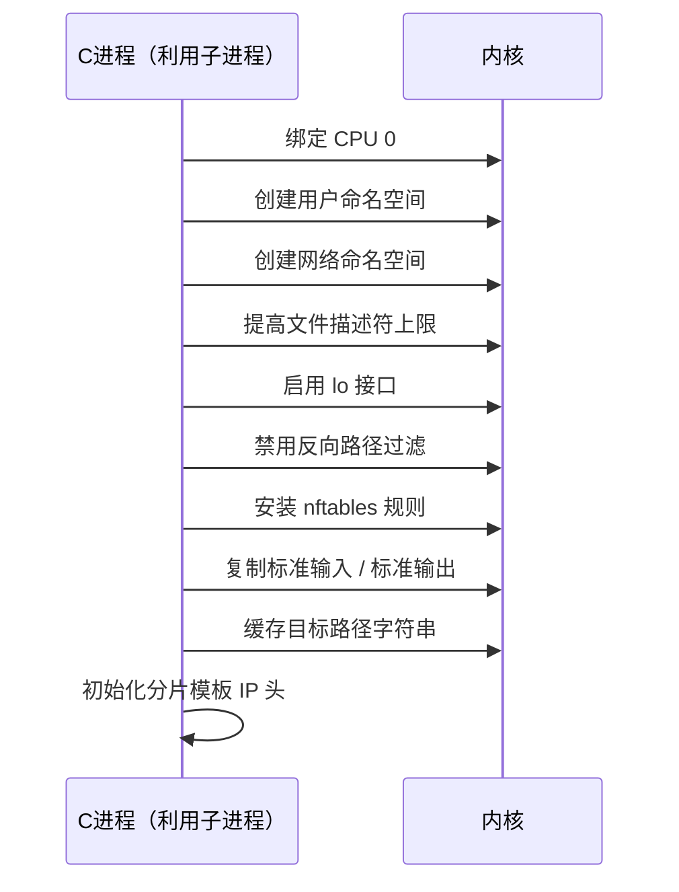
```mermaid
sequenceDiagram
    participant C as C进程（利用子进程）
    participant Kernel as 内核

    C->>Kernel: 绑定 CPU 0
    C->>Kernel: 创建用户命名空间
    C->>Kernel: 创建网络命名空间
    C->>Kernel: 提高文件描述符上限
    C->>Kernel: 启用 lo 接口
    C->>Kernel: 禁用反向路径过滤
    C->>Kernel: 安装 nftables 规则
    C->>Kernel: 复制标准输入 / 标准输出
    C->>Kernel: 缓存目标路径字符串
    C->>C: 初始化分片模板 IP 头
```

这一阶段的关键在于命名空间、规则安装与状态初始化。命名空间提供了访问 nf_tables 所需的能力，规则安装则将特殊构造的裁决码写入内核规则链，为后续的第一次释放做好准备。复制标准输入与标准输出是为了在阶段 7 中，当 root shell 被触发时，能够将 shell 的文件描述符重定向到利用进程已复制的文件描述符上。缓存目标路径字符串是为了在阶段 6 中，当内核配置启用 `CONFIG_STATIC_USERMODEHELPER` 时，搜索静态 usermodehelper 路径；否则搜索 modprobe 路径。

### 5-3. 阶段 1：页表布局准备

阶段 1 的目标是准备页表布局，为后续的 PTE 页喷射与 PMD 页重叠奠定基础。C进程预先填充 PGD[1] 页表链，注册大量固定大小的 VMA，并为每个 VMA 预填充 PMD 页。随后 C进程映射一个较大的 PMD 区域，该区域被划分为两个窗口：kernel_window 与 data_window。这两个窗口在后续阶段中分别用于内核基址扫描与目标路径扫描。

```mermaid
sequenceDiagram
    participant C as C进程（利用子进程）
    participant Kernel as 内核

    C->>Kernel: 预填充 PGD[1] 页表链
    C->>Kernel: 注册大量固定大小的 VMA
    C->>Kernel: 预填充每个 VMA 的 PMD 页
    C->>Kernel: 映射 PMD 区域（kernel_window + data_window）
    C->>C: 页表布局准备完成
```

这一阶段的核心动作是**预留虚拟地址空间并提前分配上层页表**。C进程通过 `mmap` 建立虚拟内存区域描述符，此时内核尚未分配任何页表页。随后，C进程访问每个 VMA 的 PMD 槽起始地址，触发内核分配 PMD 页。这一阶段不触发 PTE 页的分配；PTE 页的实际分配发生在阶段 3 的 PTE 喷射中。C进程通过访问每个 VMA 中尚未映射的页，触发内核为每个 VMA 分配 PTE 页。

PMD 区域的映射被划分为两个窗口。kernel_window 用于在阶段 5 中扫描内核基址；data_window 用于在阶段 6 中扫描目标路径字符串。这两个窗口共享同一个 PMD 页，因此在阶段 3 中，当该 PMD 页与某个 PTE 页重叠时，两个窗口都可以通过改写 PTE 条目来镜像不同的物理地址范围。

### 5-4. 阶段 2：网络准备

阶段 2 的目标是准备网络环境，使后续的分片发送与队列暂存能够顺利进行。C进程创建 raw 套接字、UDP 套接字与 TCP 套接字，插入一个短生命周期的预热分片，将分片超时设置为较短值；随后 C进程将超时提升至较长值，以确保真实分片在第二次释放之前不会被超时清空。

```mermaid
sequenceDiagram
    participant C as C进程（利用子进程）
    participant Kernel as 内核

    C->>Kernel: 创建 raw 套接字
    C->>Kernel: 创建 UDP 套接字
    C->>Kernel: 创建 TCP 套接字
    C->>Kernel: 绑定 UDP / TCP 服务端口
    C->>Kernel: 设置分片超时为短值
    C->>Kernel: 发送预热分片
    C->>Kernel: 设置分片超时为长值
    C->>C: 等待预热分片超时
```

这一阶段的关键在于超时参数的调整。预热分片在短超时后被释放，用于验证分片路径的可用性；随后将超时提升至长值，使真实分片在第二次释放之前一直保持暂存状态，为后续的内存布局操作提供时间窗口。TCP 套接字的创建是为了在后续阶段中保持某些网络对象的存活，从而影响内存布局的稳定性。

### 5-5. 阶段 3：双重释放构造

阶段 3 是整个方案的核心。C进程按五个步骤构造双重释放原语，并通过 PTE 页喷射与 PMD 页分配形成页表重叠。与 Dirty Pagetable 路径不同，本方案的重叠对象是 PTE 页与 PMD 页，而非 PTE 页与管道缓冲区页。

```mermaid
sequenceDiagram
    participant C as C进程（利用子进程）
    participant Kernel as 内核

    Note over C,Kernel: 步骤 1：预留 UDP skb
    C->>Kernel: 发送多个 UDP 包
    Note over C,Kernel: 步骤 2：第一次释放
    C->>Kernel: 发送第一个分片（MF=1）
    Kernel->>Kernel: 释放 order-4 块
    Kernel->>Kernel: skb 加入分片队列
    Note over C,Kernel: 步骤 3：释放掩蔽
    C->>Kernel: 接收 UDP 包
    Note over C,Kernel: 步骤 4：PTE 页喷射
    C->>Kernel: 喷射 PTE 页
    Kernel->>Kernel: 排空 PCP order-0 freelist
    Kernel->>Kernel: 抓取被释放的 order-4 块
    Note over C,Kernel: 步骤 5：第二次释放与 PMD 分配
    C->>Kernel: 发送尾部分片
    Kernel->>Kernel: 分片队列丢弃，释放 order-0 页
    C->>Kernel: 写入 PMD 区域
    Kernel->>Kernel: 分配重叠的 PMD 页
```

五个步骤的职责如下：

**步骤 1**：C进程预留 UDP skb 用于掩蔽。该漏洞会释放两个对象：`sk_buff` 结构体本身与 `sk_buff->head` 指向的数据页。其中 `sk_buff->head` 会被后续的 PTE 页回收，不构成问题；但 `sk_buff` 结构体若不处理，会在第二次释放时触发双重释放检测。为避免检测，C进程预先发送多个 UDP 包，使内核分配一批 `sk_buff` 结构体并保持存活。

**步骤 2**：C进程触发第一次释放。发送第一个分片，其裁决码触发 nftables 规则的释放操作，order-4 块归还伙伴系统。同时，由于分片携带 `IP_MF` 标志，已释放的 skb 被加入分片队列，暂时保持“存活”。此时，已释放的 `sk_buff` 结构体进入 freelist 头部。

**步骤 3**：C进程释放 UDP skb 掩蔽已释放对象。接收之前发送的 UDP 包，批量释放对应的 `sk_buff` 结构体。这一步骤的必要性在于 SLUB 分配器的双重释放检测机制。在 `set_freepointer()` 中，内核通过 `BUG_ON(object == fp)` 检测双重释放。该检测仅比较被释放对象与当前 freelist 头部。第一次释放后，漏洞 `sk_buff` 位于 freelist 头部。若此时直接进行第二次释放，`object` 与 `fp` 均为漏洞 `sk_buff`，检测触发。通过批量释放之前预留的 UDP `sk_buff`，freelist 头部被其他对象占据，漏洞 `sk_buff` 不再位于头部。第二次释放时，`object` 为漏洞 `sk_buff`，`fp` 为其他对象，两者不同，检测不触发。

**步骤 4**：C进程喷射 PTE 页。C进程通过访问每个 VMA 中尚未映射的页，触发内核为每个 VMA 分配 PTE 页。这些 PTE 页排空每 CPU 页框缓存中的 order-0 空闲链表，并从伙伴系统中抓取被释放的 order-4 块。该块被切割为若干 order-0 页，其中一个页成为某个 VMA 的活跃 PTE 页。由于该 PTE 页在后续步骤中会被 PMD 页回收，PTE 页与 PMD 页形成物理重叠。

**步骤 5**：C进程触发第二次释放，并分配重叠的 PMD 页。发送尾部分片，其参数被构造为非法，触发分片队列丢弃，释放已被重置为 order-0 的页面。该页面进入每 CPU 页框缓存。随后 C进程写入 PMD 区域，触发内核分配 PMD 页。该 PMD 页回收被释放的 order-0 页，与已喷射的 PTE 页形成物理重叠。此时，漏洞 `sk_buff` 结构体被第二次释放，但由于步骤 3 已改变 freelist 头部，双重释放检测未触发。

至此，双重释放原语已转化为 PTE 页与 PMD 页的重叠，为后续的任意物理地址读写提供了条件。本方案的内存布局顺序与 Dirty Pagetable 路径不同：先喷射 PTE 页切割 order-4 块，再通过 PMD 页分配回收 order-0 页。这一顺序适用于官方 PoC 所针对的内核版本与配置。

### 5-6. 阶段 4：重叠验证

阶段 4 的目标是验证 PTE 页与 PMD 页的重叠是否成功，并建立恒等映射作为完整性检查。C进程扫描所有喷射的 PTE 页，寻找值不再是填充字节的条目。若找到，则说明该 PTE 页已被 PMD 页覆写。随后 C进程安装一个恒等映射 PTE（物理地址 0），并刷新 TLB，以确认重叠后的页表可以被正常使用。

```mermaid
sequenceDiagram
    participant C as C进程（利用子进程）
    participant Kernel as 内核

    loop 对每个喷射的 PTE 页
        C->>Kernel: 读取 PTE 条目
        alt 条目值不等于填充字节
            C->>C: 确认重叠成功
        end
    end
    C->>Kernel: 安装恒等映射 PTE（物理地址 0）
    C->>Kernel: 刷新 TLB
    C->>C: 确认重叠后的页表可用
```

这一阶段的关键在于重叠确认。由于 PTE 页与 PMD 页重叠，PMD 页中的条目会覆写 PTE 页中的对应条目。通过扫描 PTE 页中值发生变化的条目，可以确认重叠是否成功。安装恒等映射 PTE 并刷新 TLB 是为了验证重叠后的页表是否可以被正常读写。若恒等映射生效，则说明后续的物理内存扫描可以正常进行。

### 5-7. 阶段 5：内核基址扫描

阶段 5 的目标是扫描物理内存，定位内核镜像的物理基址。C进程创建两个 memfd，分别用于存放提权脚本与接收状态字节。随后 C进程以 1 GiB 为块遍历物理内存，寻找 x86-64 内核入口签名。一旦找到匹配的签名，即记录内核物理基址。

```mermaid
sequenceDiagram
    participant C as C进程（利用子进程）
    participant Kernel as 内核

    C->>Kernel: 创建 privesc memfd
    C->>Kernel: 创建 status memfd
    loop 以 1 GiB 为块遍历物理内存
        C->>Kernel: 填充 PTE 条目，指向当前物理块
        C->>Kernel: 刷新 TLB
        C->>Kernel: 扫描内核入口签名
        alt 找到匹配签名
            C->>C: 记录内核物理基址
        end
    end
```

这一阶段的关键在于内核基址扫描。由于内核物理基址与 2 MiB 边界对齐，C进程可以以 2 MiB 为步长扫描物理内存。每个 2 MiB 块对应一个 PMD 条目，因此可以通过改写 PTE 条目来映射不同的物理地址范围。扫描时，C进程检查每个页面的前若干字节是否匹配已知的内核入口签名。一旦找到匹配的签名，即记录内核物理基址。

创建 privesc memfd 与 status memfd 是为了在阶段 7 中使用。privesc memfd 用于存放提权脚本，status memfd 用于接收提权脚本执行后写入的状态字节。

### 5-8. 阶段 6：目标路径定位

阶段 6 的目标是在内核数据段中定位目标路径字符串。C进程从内核基址开始，扫描其后 80 MiB 的区域，搜索静态 usermodehelper 路径。若内核未启用静态 usermodehelper 保护，则搜索 modprobe 路径。找到目标路径后，记录其在 data_window 中的用户空间地址。

```mermaid
sequenceDiagram
    participant C as C进程（利用子进程）
    participant Kernel as 内核

    loop 从内核基址开始，扫描 80 MiB 区域
        C->>Kernel: 填充 PTE 条目，指向当前物理块
        C->>Kernel: 刷新 TLB
        C->>Kernel: 搜索目标路径字符串
        alt 找到目标路径
            C->>C: 记录用户空间地址
        end
    end
```

这一阶段的关键在于目标路径定位。由于内核配置可能启用 `CONFIG_STATIC_USERMODEHELPER`，内核会忽略 modprobe 路径，转而使用静态 usermodehelper 路径。因此，C进程需要根据内核配置选择搜索目标。搜索范围通常为内核基址后的 80 MiB 区域，该区域覆盖了内核数据段中的大部分关键字符串。找到目标路径后，C进程记录其在 data_window 中的用户空间地址，以便在阶段 7 中覆写。

### 5-9. 阶段 7：PID 爆破与 root shell

阶段 7 的目标是覆写目标路径字符串，触发 usermodehelper 执行提权脚本，并通过爆破 PID 获取 root shell。C进程将目标路径字符串覆写为 `/proc/<pid>/fd/<script_fd>`，随后通过执行一个无效二进制文件触发 usermodehelper。由于 C进程运行在 PID 命名空间中，真实的宿主机 PID 未知，因此 C进程需要爆破 PID：每次迭代重写字符串，触发执行，并检查 status memfd 是否收到哨兵字节。一旦收到，即表示提权脚本成功执行，root shell 已生成。

```mermaid
sequenceDiagram
    participant C as C进程（利用子进程）
    participant Kernel as 内核

    loop 爆破 PID
        C->>Kernel: 覆写目标路径为 /proc/<pid>/fd/<script_fd>
        C->>Kernel: 构造提权脚本
        C->>Kernel: 触发 usermodehelper
        Kernel->>Kernel: 执行提权脚本
        C->>Kernel: 读取 status memfd
        alt 收到哨兵字节
            C->>C: root shell 已生成
        end
    end
```

这一阶段的关键在于 PID 爆破与提权脚本的构造。提权脚本以 root 身份执行 `/bin/sh`，并将 shell 的标准输入、标准输出重定向到利用进程已复制的文件描述符上。提权脚本还会向 status memfd 写入哨兵字节，以通知利用进程提权成功。由于宿主机 PID 未知，C进程需要遍历可能的 PID 值，直到提权脚本成功执行。一旦收到哨兵字节，即表示 root shell 已生成，利用完成。

### 5-10. 内核保护机制的应对策略

现代内核通常启用多种安全机制，这些机制分别从地址空间随机化、执行权限隔离、内存分配隔离、堆元数据保护、控制流完整性以及内核与用户态数据交换边界等维度，对潜在的内存异常操作进行防御。本方案在设计之初便充分考量了这些保护机制的影响，并针对性地选择了相应的技术路径。

- **KASLR**：随机化内核代码段、数据段和模块的加载基址。本方案不依赖内核虚拟地址预测，而是通过页表重叠直接扫描物理内存，定位内核物理基址，因此 KASLR 无法阻断该路径。

- **SMEP**：阻止内核态执行用户态虚拟地址中的代码。本方案不将用户态代码注入内核执行。通过覆写 usermodehelper 路径字符串，触发内核以 root 身份执行用户态脚本。执行发生在用户态，SMEP 无法阻断。

- **SMAP**：阻止内核态通过用户态虚拟地址访问用户数据。本方案不通过用户指针直接访问用户数据。内核侧通过页表操控访问的是物理页，而非用户态虚拟地址，因此 SMAP 无法阻断。

- **KPTI**：分离内核页表与用户页表，使用户态页表不包含内核映射。本方案全程通过合法系统调用与页表操控完成，不依赖用户态直接访问内核虚拟地址空间。

- **CFI**：校验间接函数调用与跳转目标，防止控制流劫持。本方案不修改函数指针，不劫持间接调用目标，而是通过覆写数据段中的路径字符串触发 usermodehelper。CFI 无法阻断此类数据导向的利用路径。

- **CONFIG_MEMCG / CONFIG_MEMCG_KMEM**：为受控进程创建独立的 `kmalloc-cg-*` 缓存，与普通 `kmalloc-*` 隔离。该机制不影响页级堆布局操作。核心依赖的是物理页面级分配与释放顺序，与 slab 缓存隔离无关。

- **CONFIG_SLAB_FREELIST_RANDOM**：随机化 SLUB 空闲链表中的对象顺序，增加同一 slab 内分配顺序的预测难度。该机制作用于 SLUB 分配器内部，不影响物理页面级布局。方案核心依赖的是物理页面的地址分布与足够大的操作窗口。

- **CONFIG_SLAB_FREELIST_HARDENED**：对空闲链表指针进行异或混淆，并在 `set_freepointer()` 中通过 `BUG_ON(object == fp)` 检测双重释放。在第二次释放之前，批量释放预留的 UDP skb，改变 freelist 头部，使漏洞 sk_buff 不再位于 freelist 头部。第二次释放时，被释放对象与 freelist 头部不同，`BUG_ON` 检测不触发。

- **CONFIG_INIT_ON_ALLOC_DEFAULT_ON 与 bad page 检测**：v6.4+ 内核默认开启该选项，分配页时清零内存，并在页面释放路径中启用 `free_page_is_bad()` 检测。本方案适用于 v6.4 之前的内核版本，以及 v6.4+ 至 v6.6.4 之间关闭了该选项或通过 `init_on_alloc=0` 启动参数使该检测失效的内核版本。在这些版本中，被回收的页面在释放时不经过 bad page 检测，因此方案的内存布局顺序（先喷射 PTE 页，再通过 PMD 页分配回收）可以正常工作。

- **CONFIG_HARDENED_USERCOPY**：在 `copy_to_user()` / `copy_from_user()` 路径中增加边界检查。越界写入发生在内核内部的复制路径中，不经过用户态拷贝接口，检查机制无法覆盖。

- **CONFIG_STATIC_USERMODEHELPER**：将 usermodehelper 路径固定为只读字符串，防止覆写 modprobe 路径。本方案通过搜索并覆写静态 usermodehelper 路径字符串，绕过该保护。由于该字符串位于内核数据段，且未标记为只读，因此可以被页表重叠后的用户空间写入所覆盖。

整体而言，本方案通过数据导向路径、物理页面级布局与内核数据段覆写等设计选择，有效规避了上述保护机制。方案不依赖任何形式的控制流劫持，也不依赖内核虚拟地址泄漏，因此在面对多种现代内核保护机制时仍能保持稳定的可利用性。

### 5-11. 前提条件与局限性

**前提条件**

- 目标系统需满足 2-5 节中描述的全部触发条件，包括非特权用户命名空间可用、nf_tables 模块已加载、目标内核版本处于受影响范围且未应用修复补丁。

- 目标内核版本需满足以下条件之一：处于 v6.4 之前，此时 bad page 检测尚未引入；处于 v6.4+ 至 v6.6.4 之间，且关闭了 `CONFIG_INIT_ON_ALLOC_DEFAULT_ON` 或通过 `init_on_alloc=0` 启动参数使 bad page 检测失效。

- 目标系统的每 CPU 页框缓存（PCP）列表大小适中，以便通过 PTE 页喷射与 PMD 页分配的配合完成页面回收。

- 目标系统的分片超时参数（`ipfrag_time`）可被调整，以确保分片队列在第二次释放之前不会被超时清空。

- 目标系统的内核配置需启用 `CONFIG_NF_TABLES`、`CONFIG_NETFILTER`、`CONFIG_USER_NS`、`CONFIG_NET_NS` 等选项，以便在无特权情况下获得 `CAP_NET_ADMIN` 能力并访问 nf_tables。

- 预留的 UDP skb 数量需足以在第二次释放之前改变 `skbuff_head_cache` 的 freelist 头部，使漏洞 `sk_buff` 不再位于 freelist 头部，从而绕过 `CONFIG_SLAB_FREELIST_HARDENED` 中的 `BUG_ON(object == fp)` 双重释放检测。

**局限性**

- 本方案不适用于启用了 `CONFIG_INIT_ON_ALLOC_DEFAULT_ON` 且未通过启动参数关闭 bad page 检测的 v6.4+ 内核。在这些内核上，被回收的页面在释放时会经过 bad page 检测，先喷射 PTE 页再通过 PMD 页分配回收的顺序可能触发检测。对于此类内核，应采用第 3 章或第 4 章描述的内存布局顺序。

- 若目标系统的内存压力极高，页分配行为不可预测，可能导致 PTE 页与 PMD 页的重叠成功率下降。此时可能需要增加喷射数量或调整分配时机。

- 若目标系统的内核配置禁用了非特权用户命名空间，则无法在无特权情况下获得 `CAP_NET_ADMIN`，方案无法实施。

- 若目标系统启用了额外的安全模块（如 SELinux、AppArmor）并对页表操作施加了额外限制，可能影响页表重叠的稳定性或导致部分操作被拦截。此时需要根据具体安全策略调整方案或改用其他利用路径。

- 本方案依赖于特定的内存布局顺序与分配时机，若目标系统的内核版本或配置与验证环境差异较大，可能需要重新调整 `PTE_SPRAY_COUNT`、`SKB_SPRAY_COUNT`、`KERNEL_SCAN_REGION_COUNT` 等参数。

### 5-12. 章节总结

本章介绍了基于 Dirty Pagedirectory 技术的第三种利用方案。该方案整理自官方 PoC 的利用步骤，以 CVE-2024-1086 的双重释放原语为起点，通过七个阶段的操作，将 PTE 页与 PMD 页分配到同一物理页框，构造页表混淆，实现从用户空间镜像内核物理内存的能力。在此基础上，利用者覆写内核中的 usermodehelper 路径字符串，触发内核以 root 身份执行指定脚本，最终完成权限提升。

方案的核心在于内存布局的设计。阶段 1 提前分配上层页表，阶段 3 中，在第一次释放之后喷射 PTE 页，排空 PCP 空闲链表并抓取被释放的 order-4 块；在第二次释放之后写入 PMD 区域，分配 PMD 页并回收被释放的 order-0 页，形成 PTE 页与 PMD 页的重叠。这一顺序适用于 bad page 检测未启用或失效的内核版本。

方案的另一特点在于数据导向的提权路径。与 Dirty Pagetable 路径不同，本方案不修改内核代码页，而是通过页表混淆获得任意物理地址读写能力，随后覆写内核数据段中的 usermodehelper 路径字符串，触发内核以 root 身份执行用户态脚本。该路径不依赖控制流劫持，因此 CFI 无法阻断；同时，由于 usermodehelper 路径字符串位于内核数据段，覆写该字符串不需要执行内核代码，SMEP 也无法阻断。

方案采用两层进程架构。P进程负责等待 C进程的最终状态，C进程负责全部利用阶段。在完成全部阶段后，C进程进入休眠以保持页表映射不被释放，P进程等待 C进程的最终状态后退出。

本章方案与第 3 章、第 4 章方案的主要差异在于：内存布局顺序不同（先 PTE 喷射后 PMD 分配，而非先管道写入后 PTE 喷射，或先 PTE 喷射后管道写入）；提权路径不同（覆写 usermodehelper 路径字符串，而非修改内核代码页）；适用于特定的内核版本范围（v6.4 之前或 bad page 检测失效的 v6.4+ 至 v6.6.4）。三条方案共同覆盖了 CVE-2024-1086 在不同内核版本与配置下的可利用场景，为不同环境下的利用提供了完整的解决方案。

### 5-13. 测试结果

<div style="text-align: center; margin: 2rem 0;">
  
</div>

## 6. 漏洞修复

### 6-1. 修复补丁概述

漏洞的修复由 Florian Westphal 于 2024 年 1 月 20 日提交，commit 标识为 `f342de4e2f33e0e39165d8639387aa6c19dff660`，提交主题为“netfilter: nf_tables: reject QUEUE/DROP verdict parameters”。该补丁由 Pablo Neira Ayuso 于 2024 年 1 月 24 日合并入主线，父提交为 `b462579b2b86a8f5230543cadd3a4836be27baf7`。

补丁的核心动作是**回退引入漏洞的 commit `e0abdadcc6e1`**。引入漏洞的 commit 修改了 `nft_verdict_init()` 的验证逻辑，使其接受带有 drop error 的 verdict 参数。修复补丁将该逻辑恢复为精确匹配模式，拒绝任何非精确匹配 `NF_ACCEPT`、`NF_DROP`、`NF_QUEUE` 的 verdict 码。

提交信息中，Florian Westphal 对修复的动机与技术依据做了以下说明：`core.c` 中的 `nf_hook_slow()` 假定 `NF_DROP` verdict 的高 16 位包含有效的 errno（如 `-EPERM`、`-EHOSTUNREACH` 或类似值，或为 0）。由于被回退的 commit，用户可以提供一个正值（例如 `NF_ACCEPT`，即 1），这会导致释放后重用。`NF_QUEUE` 并未被 nftables 使用；nftables 中的“queue”规则会通过 `nft_queue` 表达式实现。若未来需要允许用户空间指定 errno 值，则必须调用 `NF_DROP_GETERR()` 并检查 `err <= 0` 是否成立。

### 6-2. 补丁的技术分析

补丁对 `net/netfilter/nf_tables_api.c` 中的 `nft_verdict_init()` 做了修改。以下为补丁的完整内容：

```diff
diff --git a/net/netfilter/nf_tables_api.c b/net/netfilter/nf_tables_api.c
index 02f45424644b4..c537104411e7d1 100644
--- a/net/netfilter/nf_tables_api.c
+++ b/net/netfilter/nf_tables_api.c
@@ -10992,16 +10992,10 @@ static int nft_verdict_init(const struct nft_ctx *ctx, struct nft_data *data,
 	data->verdict.code = ntohl(nla_get_be32(tb[NFTA_VERDICT_CODE]));

 	switch (data->verdict.code) {
-	default:
-		switch (data->verdict.code & NF_VERDICT_MASK) {
-		case NF_ACCEPT:
-		case NF_DROP:
-		case NF_QUEUE:
-			break;
-		default:
-			return -EINVAL;
-		}
-		fallthrough;
+	case NF_ACCEPT:
+	case NF_DROP:
+	case NF_QUEUE:
+		break;
 	case NFT_CONTINUE:
 	case NFT_BREAK:
 	case NFT_RETURN:
@@ -11036,6 +11030,8 @@ static int nft_verdict_init(const struct nft_ctx *ctx, struct nft_data *data,

 		data->verdict.chain = chain;
 		break;
+	default:
+		return -EINVAL;
 	}

 	desc->len = sizeof(data->verdict);
```

补丁的修改可分为两个部分。

**第一部分**位于 `switch` 语句的起始处。修复前的代码使用两层嵌套的 `switch`：外层 `switch` 的 `default` 分支进入内层 `switch`，内层 `switch` 通过 `data->verdict.code & NF_VERDICT_MASK` 检查 verdict 码的低 8 位是否匹配 `NF_ACCEPT`、`NF_DROP` 或 `NF_QUEUE`。若低 8 位匹配，则执行 `break` 并 `fallthrough` 到后续分支；若低 8 位不匹配，则返回 `-EINVAL`。修复后的代码移除了内层 `switch`，直接将 `NF_ACCEPT`、`NF_DROP`、`NF_QUEUE` 作为外层 `switch` 的 `case` 分支。这意味着 verdict 码必须精确等于这三个值之一，才能通过验证。任何包含高位 drop error 的 verdict 码，即使其低 8 位匹配 `NF_DROP`，也会因不满足精确匹配而落入 `default` 分支。

**第二部分**位于 `switch` 语句的末尾。修复前的代码没有 `default` 分支，未匹配任何 `case` 的 verdict 码会直接跳过 `switch` 语句，继续执行后续代码并返回 0（接受）。修复后的代码在 `switch` 语句末尾添加了 `default: return -EINVAL;`，确保任何未精确匹配的 verdict 码都会被拒绝。

两部分修改共同作用，将 `nft_verdict_init()` 的验证逻辑从掩码匹配恢复为精确匹配。特殊构造的 verdict 码 `0xFFFF0000` 不再能通过验证，`nf_hook_slow()` 也就无法在释放 skb 后返回正值，双重释放原语从根本上被切断。

### 6-3. 漏洞利用链的切断

修复补丁在漏洞利用链的起点处切断了整个链路。漏洞利用链可抽象为以下环节：

- **规则安装阶段**：用户空间提交 verdict 码为 `0xFFFF0000` 的规则，`nft_verdict_init()` 的掩码验证逻辑接受该 verdict 码，将其写入内核规则链。
- **第一次释放**：数据包经过规则时，`nf_hook_slow()` 读取到特殊构造的 verdict 码，释放 skb，并返回正值。
- **返回值误判**：调用者将正值误判为 `NF_ACCEPT`，继续使用已被释放的 skb。
- **分片暂存**：已释放的 skb 被加入分片队列，延长生命周期。
- **第二次释放**：分片队列销毁时，对暂存的 skb 再次释放，形成双重释放原语。
- **页表重叠**：通过管道写入或 PTE 喷射等操作，将双重释放原语转化为页表重叠。
- **权限提升**：通过页表重叠获得任意物理地址读写能力，完成权限提升。

修复补丁作用于第一个环节。`nft_verdict_init()` 不再接受包含高位 drop error 的 verdict 码，因此 `0xFFFF0000` 无法写入内核规则链。后续的所有环节均依赖于规则安装阶段的成功，因此修复补丁从源头上切断了整个利用链。

这一修复策略的特点是在验证环节彻底拒绝非法输入，而非在后续执行环节增加额外的检查。这种策略的优势在于：修复点单一，覆盖所有可能的利用路径；不引入额外的运行时开销；不依赖于对利用路径的具体分析。无论利用者采用 Dirty Pagetable、Dirty Pagedirectory 还是其他技术，只要无法通过规则安装阶段的验证，后续操作均无法进行。

### 6-4. 补丁的演进意义

引入漏洞的 commit `e0abdadcc6e1`（“netfilter: nf_tables: accept QUEUE/DROP verdict parameters”）修改了 `nft_verdict_init()` 的验证逻辑，使其接受带有 drop error 的 verdict 参数。修复补丁选择回退该 commit，而非在 `nf_hook_slow()` 中增加额外的检查。

提交信息中，Florian Westphal 明确指出：“我不清楚为什么做了这个 commit。”修复补丁的注释还指出，若未来确实需要允许用户空间指定 errno 值，则必须调用 `NF_DROP_GETERR()` 并检查 `err <= 0` 是否成立。这为未来的类似需求提供了明确的实现指导。

从技术角度看，该补丁的回退性质表明：当放宽验证逻辑的实际需求不明确时，恢复原有严格验证是可行的修复路径。回退的优势在于修复点单一，覆盖所有利用路径，且不依赖于对利用路径的具体分析。

### 6-5. 修复版本与回溯状态

修复补丁已合入主线内核，并回溯至多个稳定版本分支。具体修复版本如下：

| 版本范围           | 修复版本  |
| ------------------ | --------- |
| ≥ 3.15，< 5.15.149 | 5.15.149+ |
| ≥ 6.1，< 6.1.76    | 6.1.76+   |
| ≥ 6.2，< 6.6.15    | 6.6.15+   |
| ≥ 6.7，< 6.7.3     | 6.7.3+    |
| 6.8-rc1            | 6.8-rc2+  |

补丁的提交信息中包含 `Cc: stable` 标签，表明该修复需要回溯至稳定版本分支。这一标签由 Florian Westphal 在提交时添加，用于通知稳定版本维护者将该修复移植到受影响的稳定版本中。

各大发行版已通过内核更新集成了该修复。根据 Debian 安全跟踪页面，bullseye 分支通过 5.10.223-1 修复，bookworm 分支通过 6.1.176-1 修复，trixie 分支通过 6.12.94-1 修复，后续分支亦已修复。根据 Ubuntu 官方 CVE 页面，22.04 LTS (jammy) 通过内核更新 5.15.0-1053.58 修复，24.04 LTS (noble) 不受影响，20.04 LTS (focal) 的内核支持已终止。Fedora 39 通过 kernel-6.7.3-200.fc39 修复。RHEL 9.3 及大多数 rebuild 版本在漏洞公开时仍未修复，具体修复状态与版本可通过 Red Hat CVE 页面查询。

### 6-6. 修复的技术要点

该修复涉及以下技术要点。

**验证逻辑与执行逻辑的一致性**。漏洞的根因在于 `nft_verdict_init()` 的验证逻辑与 `nf_hook_slow()` 的执行逻辑对 verdict 码的语义理解不一致。验证逻辑放宽后，执行逻辑未做相应调整，导致语义鸿沟被利用。在修改验证逻辑时，需要同时检查所有依赖该验证结果的执行路径，确保两者的语义理解一致。

**隐式契约的显式化**。`nf_hook_slow()` 对 drop error 的隐式契约（高 16 位为负值或零）未在代码中显式表达，也未在验证逻辑中强制检查。修复补丁的提交信息中明确指出了这一契约，并建议若未来需要放宽验证，则必须显式检查 `err <= 0`。将隐式契约显式化，有助于避免类似问题。

**回退作为修复手段**。修复补丁选择回退引入漏洞的 commit，而非在后续执行路径中增加额外的检查。回退的优势在于：修复点单一，覆盖所有利用路径；不引入额外的运行时开销；不依赖于对利用路径的具体分析。

## 7. 免责声明

本文档旨在提供 **CVE-2024-1086** 漏洞的技术分析与教育性内容，仅供学习、研究和安全防御目的使用。作者与发布平台对以下事项声明如下：

1. **合法使用原则**：本文档中描述的任何技术细节、代码示例或利用方法仅供教育研究之用。读者不得将这些信息用于任何非法、未经授权或恶意的活动，包括但不限于未经授权的系统入侵、数据破坏、服务干扰或其他违反法律法规的行为。

2. **知识共享与责任**：本文档基于公开可获取的信息、官方漏洞公告和学术研究资料编写。作者力求确保技术内容的准确性，但不对信息的完整性、时效性或适用性作任何明示或暗示的保证。读者应自行验证信息的准确性，并在专业环境中谨慎应用。

3. **环境限制**：所有技术分析和实验应在受控的、隔离的测试环境中进行，例如使用特制的虚拟机或专用硬件。禁止在任何生产环境、公共网络或他人系统中尝试漏洞利用或相关技术。

4. **法律合规性**：读者应遵守所在国家或地区的所有适用法律法规，包括但不限于计算机安全法、数据保护法和知识产权法。任何使用本文档内容的行为所产生的法律后果，由行为者自行承担。

5. **技术中立性**：本文档对漏洞的分析保持技术中立立场，旨在促进安全社区的防御能力提升。文中提及的任何工具、技术或方法不应被视为对任何组织、产品或技术的背书或批判。

6. **更新与修正**：技术领域发展迅速，本文档内容可能随时间而过时。作者保留更新、修正或撤回文档内容的权利，不承诺另行通知。

7. **版权声明**：本文档内容受版权法保护，未经明确书面许可，不得用于商业目的。允许在注明出处的前提下进行非商业性的分享与引用。

**重要提示**：安全研究应始终遵循道德准则，以提升整体网络安全为目标。如发现安全漏洞，建议通过负责任的披露流程向相关厂商或机构报告，共同维护数字生态的安全与稳定。

---

_本文档的撰写参考了公开的漏洞公告、内核源码（Linux 6.6.14 和 Linux 6.3.13）及相关技术分析文献。所有实验均在封闭的测试环境中完成，未对任何实际系统造成影响。_

## 参考

- https://github.com/BinRacer/pwn4cve/tree/master/src/CVE-2024-1086
- https://github.com/BinRacer/pwn4cve/tree/master/src/CVE-2024-1086_V2
- https://github.com/BinRacer/pwn4cve/tree/master/src/CVE-2024-1086_V3
- https://github.com/Notselwyn/CVE-2024-1086
- https://bsauce.github.io/2024/05/10/CVE-2024-1086/
- https://yanglingxi1993.github.io/dirty_pagetable/dirty_pagetable.html
- https://pwning.tech/nftables/
- https://skyi23.github.io/2024/11/12/CVE-2024-1086/
- https://www.openwall.com/lists/kernel-hardening/2025/09/05/2
- https://www.openwall.com/lists/oss-security/2024/04/10/22
- https://www.openwall.com/lists/oss-security/2024/04/10/23
- https://www.openwall.com/lists/oss-security/2024/04/14/1
- https://www.openwall.com/lists/oss-security/2024/04/15/2
- https://www.openwall.com/lists/oss-security/2024/04/17/5
- https://git.kernel.org/pub/scm/linux/kernel/git/torvalds/linux.git/commit/?id=e0abdadcc6e113ed2e22c85b350074487095875b
- https://git.kernel.org/pub/scm/linux/kernel/git/torvalds/linux.git/commit/?id=f342de4e2f33e0e39165d8639387aa6c19dff660
- https://nvd.nist.gov/vuln/detail/CVE-2024-1086
- https://ubuntu.com/security/CVE-2024-1086
